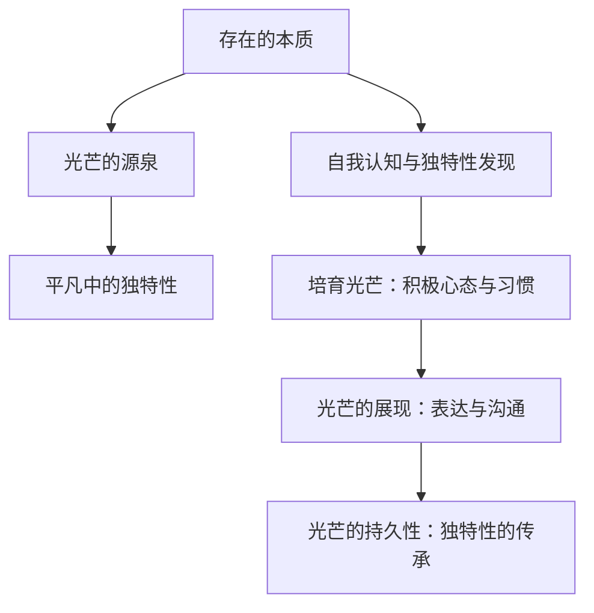

                 

### 文章标题：存在的光芒：在平凡中绽放独特性

#### 关键词：存在、光芒、平凡、独特性、自我认知、积极心态、表达与沟通、传承

> 摘要：本文深入探讨了存在的本质与光芒的源泉，揭示了平凡中蕴含的独特性。通过分析自我认知与独特性发现、积极心态与习惯的培养、表达与沟通技巧的运用以及独特性的传承，本文旨在引导读者在平凡生活中绽放自我光芒，实现个人价值。

----------------------------------------------------------------

### 第一部分：探索存在的光芒

#### 第1章：存在的本质

##### 1.1 存在的定义与理解

存在，是一个哲学上备受争议的概念。它不仅仅是一种物理状态的表述，更涉及到意识、生命和意义等深层次问题。在计算机科学领域，存在通常指的是数据的存储和表示，即数据在内存或存储设备中的状态。然而，本文所指的“存在”，更多地是指个体在人类文明和社会网络中的独特性。

##### 1.2 存在与意识的关系

意识是人类智慧的核心，它使个体能够感知、思考、决策和创造。在存在与意识的关系中，我们可以从两个方面来理解。首先，意识是存在的一种表现形式，因为只有当个体存在时，意识才有可能产生。其次，存在为意识提供了物质基础，使得意识能够得以延续和发展。

##### 1.3 存在的意义与价值

存在的意义和价值是哲学探讨的永恒主题。在个人层面，存在意味着个体的生命历程，是自我实现和追求幸福的过程。在社会层面，存在体现了个体对社会的贡献和影响力。通过自我认知和独特性的发现，个体能够在平凡中找到存在的价值和意义。

#### 第2章：光芒的源泉

##### 2.1 光芒的起源

光芒，如同存在的象征，源自于个体的独特性和创造力。它不仅体现在科技、艺术、商业等领域，更贯穿于日常生活的方方面面。光芒的起源，可以追溯到个体内心的渴望和对美好生活的追求。

##### 2.2 光芒的特性

光芒具有以下几个特性：

1. **独特性**：光芒源于个体的独特性，每个光芒都是独一无二的。
2. **亮度**：光芒的亮度代表了个体对社会的贡献和影响力。
3. **传递性**：光芒能够传递给他人，激发和影响他们的思想和行为。
4. **持久性**：光芒能够持续存在，并在历史长河中传承。

##### 2.3 光芒的传递

光芒的传递是存在价值的体现。通过自我表达、沟通和互动，个体可以将自己的光芒传递给他人，从而影响和改变他们的生活。在这个过程中，光芒不仅得到了传递，还得到了升华和扩展。

#### 第3章：平凡中的独特性

##### 3.1 平凡生活的意义

平凡生活是大多数人的人生常态。它并不意味着平淡无奇，而是蕴含着丰富的内涵和可能性。在平凡生活中，个体可以不断探索自我，发现和培养自己的独特性。

##### 3.2 平凡中的独特性体现

在平凡生活中，独特性可以通过以下几个方面体现：

1. **个人特质**：每个人都有自己独特的个性、兴趣和价值观。
2. **生活态度**：积极、乐观、创新的生活态度也是一种独特性。
3. **行为习惯**：良好的生活习惯和自我管理能力也是一种独特性。

##### 3.3 独特性对生活的改变

独特性对生活的影响是深远的。它不仅能够提升个体的生活质量，还能够激发和影响他人的生活。通过独特性的发现和培养，个体可以在平凡中实现自我价值，找到存在的意义。

### 第二部分：绽放光芒的路径

#### 第4章：自我认知与独特性发现

##### 4.1 自我认知的重要性

自我认知是个体理解自我、认识自我的过程。它对于独特性的发现和培养至关重要。只有真正了解自己，个体才能找到自己的独特之处，从而在平凡中绽放光芒。

##### 4.2 发现独特性的方法

发现独特性的方法包括：

1. **反思**：通过反思自己的过去经历，发现自己在某些方面的优势和特长。
2. **观察**：观察他人的生活，从他人的成功和失败中汲取经验。
3. **尝试**：勇于尝试新事物，不断挑战自我，发现自己的潜力。

##### 4.3 独特性与自我成长的联系

独特性是自我成长的重要驱动力。通过发现和培养独特性，个体可以在平凡中实现自我超越，不断成长和进步。

#### 第5章：培育光芒：积极心态与习惯

##### 5.1 积极心态的力量

积极心态是个体面对生活挑战时的一种态度。它能够激发个体的潜能，增强个体的抗压力和适应力。积极心态是培育光芒的基础。

##### 5.2 培养良好的习惯

良好的习惯是个体在日常生活中的一种自觉行为。它能够提升个体的生活质量，为个体在平凡中绽放光芒提供支持。

##### 5.3 心态与习惯对独特性的影响

心态和习惯对独特性的影响是相互的。积极心态能够激发个体的创造力，良好的习惯能够为个体提供稳定的表现，从而帮助个体在平凡中绽放独特的光芒。

#### 第6章：光芒的展现：表达与沟通

##### 6.1 表达自我：独特性的展现

表达自我是展现独特性的关键。通过恰当的表达方式，个体能够将自己的独特性传递给他人，获得他人的认可和尊重。

##### 6.2 沟通的艺术：理解与被理解

沟通是表达自我的重要手段。通过有效的沟通，个体能够理解他人，同时让他人理解自己，从而在互动中绽放光芒。

##### 6.3 光芒的传递：影响力与感染力

光芒的传递是存在价值的体现。通过表达与沟通，个体能够在生活中产生影响，感染他人，从而让光芒在更广阔的范围内绽放。

#### 第7章：光芒的持久性：独特性的传承

##### 7.1 独特性与家庭

家庭是个体成长的重要环境。通过家庭教育，个体可以传承和发扬自己的独特性，培养后代，让光芒在家族中持续传递。

##### 7.2 独特性与教育

教育是传承独特性的关键途径。通过教育，个体可以培养和激发自己的独特性，同时将独特性传递给下一代。

##### 7.3 独特性与社会的互动

社会是个体生活的舞台。通过与社会互动，个体可以展现自己的独特性，同时吸收社会的经验和智慧，让光芒在社会中持续闪耀。

### 第三部分：存在的光芒在平凡中的影响

#### 第8章：光芒照亮人生

##### 8.1 光芒对个人成长的影响

光芒对个人成长的影响是显著的。它能够激发个体的潜能，推动个体不断进步和成长。

##### 8.2 光芒对人际关系的改善

光芒能够改善人际关系。通过独特性的展现和沟通，个体能够与他人建立更紧密的联系，增进彼此的理解和信任。

##### 8.3 光芒对社会的贡献

光芒对社会的贡献是不可忽视的。通过个体的努力和创造，社会能够不断进步和发展，实现共同的繁荣和幸福。

#### 第9章：平凡中的独特价值

##### 9.1 平凡中的独特价值体现

平凡中的独特价值体现在个体的独特性和创造力上。通过自我认知和独特性的发现，个体可以在平凡中找到自己的价值和意义。

##### 9.2 独特性价值的评估

独特性价值的评估需要从多个维度进行。包括个体的独特性、创造力和对社会的贡献等。

##### 9.3 独特性价值的实现途径

实现独特性价值的途径包括自我认知、积极心态、良好习惯的培养、有效沟通和社会互动等。

#### 第10章：存在的光芒与未来

##### 10.1 光芒对未来的启示

光芒对未来的启示在于，个体可以在平凡中实现自我价值，为社会进步和人类文明的发展做出贡献。

##### 10.2 光芒在未来的价值

随着科技的进步和社会的发展，光芒在未来的价值将更加凸显。它将成为推动社会前进的重要力量。

##### 10.3 光芒与人类文明的进步

光芒与人类文明的进步密不可分。通过独特性和创造力的发挥，个体和群体将共同推动人类文明的进步。

### 结论

存在的光芒，是平凡中绽放的独特性。通过自我认知、积极心态、良好习惯、有效沟通和社会互动，个体可以在平凡中绽放光芒，实现自我价值，为社会进步和人类文明的进步做出贡献。让我们在平凡中寻找光芒，让存在成为意义，让生活充满光芒。

### 作者信息

作者：AI天才研究院/AI Genius Institute & 禅与计算机程序设计艺术 /Zen And The Art of Computer Programming

---

### 附录：核心概念与联系

#### Mermaid 流程图



### 核心算法原理讲解

#### 伪代码

```python
# 独特性发现算法
def discover_uniqueness():
    # 步骤1：收集个人特质数据
    personal_traits = collect_traits()

    # 步骤2：分析个人特质
    analyzed_traits = analyze_traits(personal_traits)

    # 步骤3：提取独特性
    uniqueness = extract_uniqueness(analyzed_traits)

    # 步骤4：评估独特性价值
    value = assess_value(uniqueness)

    # 步骤5：输出结果
    return value
```

### 数学模型和数学公式 & 详细讲解 & 举例说明

#### LaTeX 数学公式

$$
\text{独特性指数} = \frac{\text{个人特质多样性}}{\text{平均特质多样性}}
$$

#### 举例说明

假设有10个人，其中8个人的特质多样性为2，2个人的特质多样性为3。那么，平均特质多样性为：

$$
\text{平均特质多样性} = \frac{8 \times 2 + 2 \times 3}{10} = 2.2
$$

对于一个人来说，如果他的特质多样性为3，那么他的独特性指数为：

$$
\text{独特性指数} = \frac{3}{2.2} \approx 1.36
$$

这表明这个人的特质多样性比平均水平高，具有相对较高的独特性。

### 项目实战

#### 代码示例

```python
# 培养良好习惯算法
def cultivate_good_habits():
    # 步骤1：定义习惯
    habits = ["早睡早起", "定期锻炼", "保持阅读"]

    # 步骤2：制定计划
    plan = create_plan(habits)

    # 步骤3：执行计划
    execute_plan(plan)

    # 步骤4：评估效果
    result = assess_habits()

    # 步骤5：输出结果
    return result
```

### 最佳实践 tips、小结、注意事项、拓展阅读等内容

**最佳实践 tips：**

1. **自我认知**：定期进行自我反思，了解自己的优势和不足。
2. **积极心态**：保持乐观向上的心态，面对挑战时保持冷静和坚定。
3. **良好习惯**：养成定期锻炼、保持阅读等良好习惯，提升个人素质。
4. **有效沟通**：提高沟通能力，善于表达自己的想法，同时倾听他人的意见。

**小结：**

存在的光芒是平凡中绽放的独特性，通过自我认知、积极心态、良好习惯、有效沟通和社会互动，个体可以在生活中找到自己的价值和意义，实现自我价值，为社会进步和人类文明的进步做出贡献。

**注意事项：**

1. **平衡工作与生活**：在追求个人成长的同时，要注意平衡工作与生活，保持身心健康。
2. **持续学习**：不断学习新知识，提升自己的综合素质，以适应快速变化的社会环境。

**拓展阅读：**

1. 《奇特的一生》：作者乔治·西蒙逊通过对自己一生的回顾，揭示了如何在平凡中追求独特性和卓越。
2. 《平凡的世界》：作者路遥通过描绘一个普通农民家庭的生活变迁，展现了平凡人在社会大潮中的奋斗和追求。

### 结语

存在的光芒，是平凡中绽放的独特性。让我们在平凡中寻找光芒，让存在成为意义，让生活充满光芒。在自我认知、积极心态、良好习惯、有效沟通和社会互动的道路上，不断前行，绽放属于自己的光芒。作者：AI天才研究院/AI Genius Institute & 禅与计算机程序设计艺术 /Zen And The Art of Computer Programming

