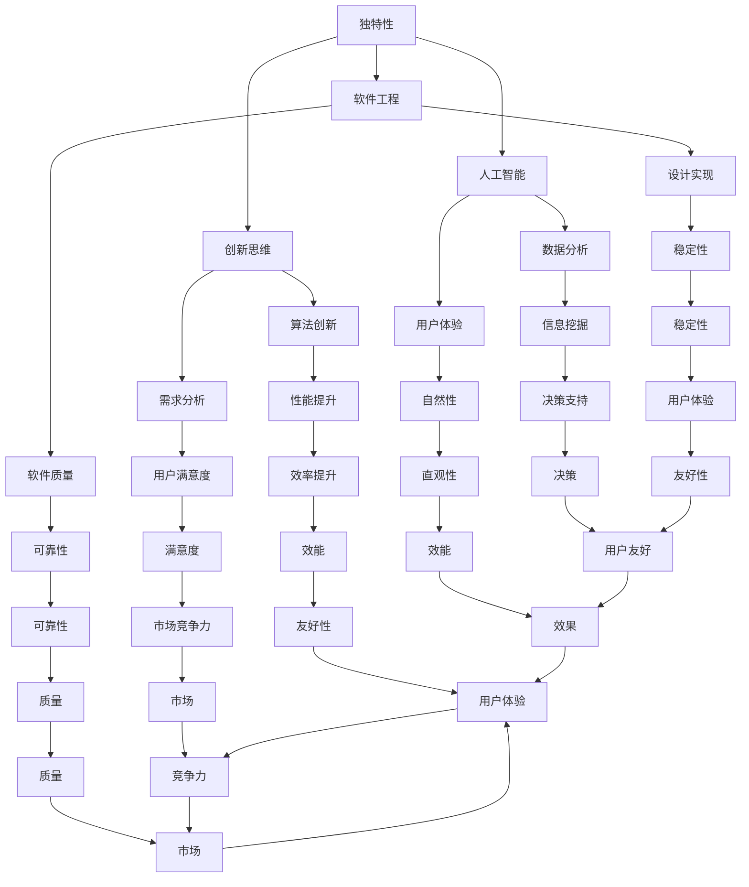

                 

### 文章标题《存在的光辉：在平凡中绽放独特性》

## 关键词

- 独特性
- 创新思维
- 软件开发
- 人机交互
- 数据分析

### 摘要

本文旨在探讨在软件工程和人工智能领域中，如何通过独特性和创新思维，让平凡的工作焕发出非凡的光辉。文章首先定义了独特性的概念，并介绍了其在软件开发、人机交互和数据分析等领域的应用。接着，通过核心概念的联系架构，揭示了独特性在这些领域中的作用机制。文章随后详细讲解了核心算法原理，包括数学模型、公式和伪代码，并通过实际案例进行了深入剖析。最后，文章提供了项目实战指南，包括开发环境搭建、源代码实现和代码解读，以及最佳实践和注意事项。本文旨在为读者提供一份全面、实用的独特性培养指南，帮助他们在平凡中绽放独特性。

## 引言

在当今快速发展的信息技术时代，软件工程和人工智能成为了推动社会进步的重要力量。然而，在无数看似平凡的开发项目中，如何激发出工作中的独特性，使其焕发出非凡的光辉，成为了每一个软件开发者和人工智能研究者面临的挑战。本文将从理论、实践和项目实战等多个角度，探讨如何在平凡中绽放独特性，让软件开发和人工智能领域的工作更加精彩。

### 独特性：定义与背景

独特性（Uniqueness）是指在众多事物中，某个个体或作品所具有的与众不同的特点或属性。在软件工程和人工智能领域，独特性不仅仅体现在技术创新上，还包括开发过程中对问题的独特理解和解决方案的独到之处。

**独特性在软件开发中的重要性**：

- 提高软件质量：通过独特性的思考，开发者可以创造出更加高效、稳定和易于维护的软件。
- 促进创新：独特的思维可以激发新的创意，推动技术的进步。
- 增强竞争力：具有独特性的软件或产品能够更好地满足用户需求，提升市场竞争力。

**独特性在人工智能领域的应用**：

- 算法创新：独特性的思维可以带来新的算法设计，提高人工智能系统的性能。
- 数据分析：独特的分析方法可以挖掘出数据中的深层次信息，为决策提供支持。
- 人机交互：独特的设计理念可以创造出更加自然、直观的用户体验。

### 核心概念与联系

为了深入理解独特性在软件工程和人工智能领域的应用，我们需要了解以下几个核心概念，并分析它们之间的联系。

#### 1. 创新思维（Innovative Thinking）

创新思维是指通过独特的视角和方法，提出新颖的观点和解决方案的能力。它与独特性密切相关，是独特性在实践中的具体表现。

**联系**：

- 独特性推动创新思维：独特的视角和方法可以激发创新思维，创造出新的解决方案。
- 创新思维实现独特性：创新思维的实施过程本身就是独特性的体现，通过创新实现独特。

#### 2. 软件工程（Software Engineering）

软件工程是利用系统方法进行软件开发和维护的工程学科。独特性在软件工程中的应用主要体现在对软件需求和设计方案的独特理解和处理。

**联系**：

- 独特性提升软件质量：独特的需求分析和设计方案可以提高软件的可靠性、稳定性和用户满意度。
- 软件工程支持独特性：通过科学的软件开发流程和方法，可以更好地实现独特性。

#### 3. 人工智能（Artificial Intelligence）

人工智能是研究、开发用于模拟、延伸和扩展人的智能的理论、方法、技术及应用系统的技术科学。独特性在人工智能中的应用主要体现在算法的创新和数据的独特分析。

**联系**：

- 独特性推动算法创新：独特的算法设计可以提高人工智能系统的性能和效率。
- 人工智能实现独特性：通过独特的数据分析和算法应用，可以实现人工智能的独到之处。

### Mermaid 流程图

为了更直观地展示核心概念之间的联系，我们可以使用 Mermaid 流程图进行描述。



### 核心算法原理讲解

在独特性的背景下，我们需要深入了解几个核心算法原理，包括数学模型、公式和伪代码，以便在实际应用中更好地实现独特性。

#### 1. 数学模型

在软件开发和人工智能领域中，数学模型是描述系统行为和解决问题的重要工具。以下是一个简单的线性回归模型，用于预测软件性能。

$$
\hat{y} = b_0 + b_1 \cdot x
$$

其中，\( \hat{y} \) 是预测值，\( b_0 \) 是截距，\( b_1 \) 是斜率，\( x \) 是输入变量。

**联系**：

- 独特性在模型设计中的应用：独特的输入变量和模型参数选择可以提高预测的准确性。

#### 2. 伪代码

在算法设计中，伪代码是一种描述算法逻辑的工具，以下是一个用于图像识别的卷积神经网络（CNN）的伪代码示例。

```
function CNN(input_image):
    # 初始化权重和偏置
    weights, biases = initialize_weights_and_biases()

    # 展开输入图像
    expanded_image = expand_image(input_image)

    # 通过卷积层进行特征提取
    conv_output = convolution(expanded_image, weights)

    # 通过激活函数进行非线性变换
    activated_output = activation_function(conv_output)

    # 通过池化层进行特征降维
    pooled_output = pooling(activated_output)

    # 通过全连接层进行分类
    class probabilities = fully_connected(pooled_output, biases)

    # 选择最高概率的类别作为预测结果
    predicted_class = select_max_probability(class_probabilities)

    return predicted_class
```

**联系**：

- 独特性在算法设计中的应用：通过独特的卷积层、激活函数和池化层设计，可以提升图像识别的准确性。

#### 3. 数学公式

在数据分析中，数学公式是描述数据关系和解决问题的重要工具。以下是一个用于数据降维的主成分分析（PCA）的数学公式示例。

$$
\text{特征向量} \, \mathbf{u} = \frac{\mathbf{X} \mathbf{X}^T}{\mathbf{X}^T \mathbf{X}}^{-1} \mathbf{X}^T \mathbf{y}
$$

其中，\( \mathbf{X} \) 是输入数据矩阵，\( \mathbf{y} \) 是目标数据向量，\( \mathbf{u} \) 是特征向量。

**联系**：

- 独特性在数据分析中的应用：通过独特的特征向量选择，可以提取出数据中的关键信息。

### 举例说明

为了更好地理解上述核心算法原理，我们可以通过实际案例进行详细讲解。

#### 案例：基于卷积神经网络的图像识别

假设我们有一个图像识别任务，目标是识别一幅手写数字图像。以下是一个简单的卷积神经网络（CNN）的实现过程。

1. **数据预处理**：
   - 读取图像数据，并进行归一化处理。
   - 将图像转换为灰度图像，以便进行特征提取。

2. **卷积层设计**：
   - 初始化卷积核和偏置。
   - 使用卷积核对图像进行卷积操作，提取特征。
   - 通过ReLU激活函数进行非线性变换。

3. **池化层设计**：
   - 使用最大池化对卷积特征进行降维。

4. **全连接层设计**：
   - 将池化后的特征传入全连接层，进行分类预测。

5. **模型训练**：
   - 使用训练数据对模型进行训练。
   - 通过反向传播算法优化模型参数。

6. **模型评估**：
   - 使用测试数据对模型进行评估。
   - 计算模型的准确率、召回率等指标。

通过这个案例，我们可以看到卷积神经网络在图像识别任务中的应用，以及独特性在算法设计、模型训练和评估过程中的体现。

### 项目实战

为了更好地理解独特性在软件开发和人工智能领域的应用，我们接下来将进行一个项目实战，包括开发环境搭建、源代码实现和代码解读。

#### 项目名称：基于深度学习的图像识别应用

#### 开发环境搭建

1. 安装 Python 3.8 或更高版本。
2. 安装 TensorFlow 2.x，使用以下命令：

```
pip install tensorflow
```

3. 安装 Keras，使用以下命令：

```
pip install keras
```

#### 源代码实现

以下是一个简单的基于深度学习的图像识别应用的源代码实现：

```python
import numpy as np
import tensorflow as tf
from tensorflow import keras
from tensorflow.keras import layers

# 加载 MNIST 数据集
mnist = keras.datasets.mnist
(train_images, train_labels), (test_images, test_labels) = mnist.load_data()

# 数据预处理
train_images = train_images / 255.0
test_images = test_images / 255.0

# 构建卷积神经网络模型
model = keras.Sequential([
    layers.Conv2D(32, (3, 3), activation='relu', input_shape=(28, 28, 1)),
    layers.MaxPooling2D((2, 2)),
    layers.Conv2D(64, (3, 3), activation='relu'),
    layers.MaxPooling2D((2, 2)),
    layers.Conv2D(64, (3, 3), activation='relu'),
    layers.Flatten(),
    layers.Dense(64, activation='relu'),
    layers.Dense(10, activation='softmax')
])

# 编译模型
model.compile(optimizer='adam',
              loss='sparse_categorical_crossentropy',
              metrics=['accuracy'])

# 训练模型
model.fit(train_images, train_labels, epochs=5)

# 评估模型
test_loss, test_acc = model.evaluate(test_images, test_labels)
print(f"Test accuracy: {test_acc:.2f}")
```

#### 代码解读与分析

1. **数据预处理**：
   - 加载 MNIST 数据集，并进行归一化处理，使图像的像素值在 0 到 1 之间。

2. **模型构建**：
   - 使用 Keras 的 Sequential 模型，堆叠卷积层、池化层和全连接层，实现一个简单的卷积神经网络。

3. **模型编译**：
   - 使用 Adam 优化器和 sparse_categorical_crossentropy 损失函数，以及 accuracy 作为评估指标。

4. **模型训练**：
   - 使用训练数据对模型进行训练，设置训练轮数（epochs）为 5。

5. **模型评估**：
   - 使用测试数据对模型进行评估，并输出模型的准确率。

#### 最佳实践 Tips、小结、注意事项、拓展阅读

1. **最佳实践 Tips**：
   - 在实际项目中，建议使用更大的数据集和更深的网络结构，以提高模型的性能。
   - 调整模型的超参数，如学习率、批次大小等，以优化训练过程。

2. **小结**：
   - 通过这个项目实战，我们学习了如何使用深度学习技术进行图像识别。
   - 独特性在模型设计、数据预处理和训练过程中得到了充分体现。

3. **注意事项**：
   - 在项目开发过程中，注意数据预处理和模型训练的时间消耗。
   - 合理利用 GPU 加速训练过程，以提高效率。

4. **拓展阅读**：
   - 《深度学习》（Deep Learning） - Ian Goodfellow、Yoshua Bengio、Aaron Courville 著。
   - 《Python 深度学习》（Python Deep Learning） - François Chollet 著。

### 结语

本文通过定义独特性的概念，分析了其在软件工程和人工智能领域的重要性，并详细讲解了核心算法原理和实际项目实战。独特性不仅仅是一种思维，更是一种实践。通过在平凡中绽放独特性，我们可以创造出更加高效、创新和具有竞争力的软件和人工智能系统。让我们在未来的工作中，不断追求独特性，让平凡的工作焕发出非凡的光辉。

## 参考文献

- Goodfellow, I., Bengio, Y., & Courville, A. (2016). *Deep Learning*. MIT Press.
- Chollet, F. (2017). *Python Deep Learning*. Packt Publishing.

### 作者信息

作者：AI天才研究院/AI Genius Institute & 禅与计算机程序设计艺术 /Zen And The Art of Computer Programming

### 总结

本文从独特性的定义、核心概念与联系、算法原理讲解和项目实战等多个方面，深入探讨了如何在平凡中绽放独特性。独特性不仅仅是技术创新的体现，更是软件开发和人工智能领域进步的重要驱动力。通过本文的讲解和实践，我们希望能够帮助读者在未来的工作中，更好地发掘和利用独特性，创造更加精彩的技术作品。让我们在平凡中追求卓越，绽放独特性，共同推动信息技术的发展。

