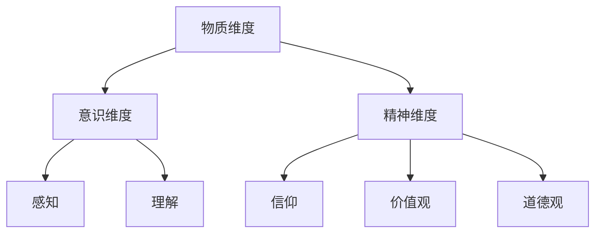
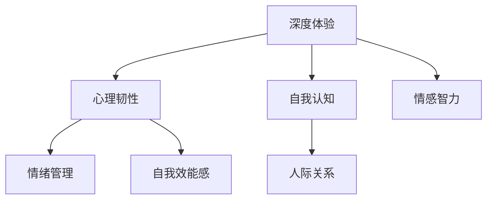
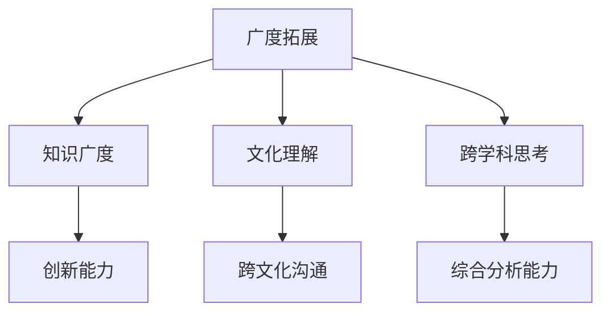

                 


### 文章标题
《存在的厚度：增加生命经历的层次》

### 关键词
生命、经历、层次、自我认知、心理成长

### 摘要
本文旨在探讨如何通过经历和体验增加生命的厚度，从而提升生命的质量。文章首先阐述了生命的本质与意义，接着分析了经历的层次与价值，探讨了自我认知与心理成长的重要性。随后，文章提出了实践生命厚度的方法，并通过实际案例进行分析与讲解。最后，文章总结了生命厚度的意义，提出了未来的可能性，并进行了哲学反思。

---

### 目录

1. **生命的本质与厚度** <a id="section1"></a>
   1.1 生命的本质与意义
   1.2 生命的层次与维度
   1.3 存在的厚度：一个哲学视角

2. **经历的层次与增长** <a id="section2"></a>
   2.1 经历的种类与价值
   2.2 深度体验与成长
   2.3 广度拓展与视野

3. **自我认知与成长** <a id="section3"></a>
   3.1 自我认知的层次
   3.2 心理成长的路径
   3.3 自我超越与生命的厚度

4. **生命厚度的实践** <a id="section4"></a>
   4.1 增加生命厚度的方法
   4.2 实践中的挑战与应对
   4.3 成长故事与启示

5. **结论与展望** <a id="section5"></a>
   5.1 生命厚度的意义
   5.2 未来的可能性
   5.3 生命厚度的哲学反思

---

### 文章正文

#### 1. 生命的本质与厚度

**1.1 生命的本质与意义**

生命，是一个复杂而又神秘的概念。从生物学的角度来看，生命是生物体在特定环境下存在和活动的现象。但从哲学的角度来看，生命不仅仅是生物学上的现象，它更是存在和意识的体现。

那么，生命的本质究竟是什么？我们可以从以下几个维度来理解：

1. **物质维度**：生命是物质的存在，依赖于生物体的各种生物化学反应来维持。
2. **意识维度**：生命不仅仅是物理存在，更是意识的体现。意识使生命具有感知、思考和决策的能力。
3. **精神维度**：生命不仅具有意识和物质的基础，更具有精神层面的存在。精神维度涵盖了信仰、价值观、道德观等。

**1.2 生命的层次与维度**

生命的层次和维度决定了生命的厚度。我们可以从以下几个方面来理解：

1. **生物层次**：这是生命的最基本层次，涵盖了生物体的生理结构和功能。
2. **心理层次**：这是生命的次级层次，涵盖了情感、认知、行为等方面。
3. **社会层次**：这是生命的最高层次，涵盖了个体在社会中的角色和地位，以及与社会的关系。

**1.3 存在的厚度：一个哲学视角**

从哲学的角度来看，存在的厚度涉及到个体对生命的理解和体验。一个生命的厚度越大，意味着他在物质、意识和精神三个维度上都有深刻的体验和理解。

**2. 经历的层次与增长**

**2.1 经历的种类与价值**

经历是生命的重要组成部分，它可以是愉快的，也可以是痛苦的。但无论是哪种经历，都有其独特的价值和意义。

1. **愉快经历**：愉快的经历可以带来快乐和满足，有助于提升个体的幸福感和生活质量。
2. **痛苦经历**：痛苦的经历虽然让人痛苦，但它同样具有价值。它可以让人成长，提升个体的心理韧性。

**2.2 深度体验与成长**

深度体验是增加生命厚度的重要途径。通过深度体验，个体可以在物质、意识和精神三个维度上获得更深刻的理解。

1. **物质维度**：深度体验可以让人更深入地了解自然和世界的运作规律。
2. **意识维度**：深度体验可以提升个体的意识层次，让人更有智慧和洞察力。
3. **精神维度**：深度体验可以让人更深入地理解生命的意义和价值。

**2.3 广度拓展与视野**

广度拓展是增加生命厚度的另一个重要途径。通过广度拓展，个体可以在心理和社会层次上获得更广泛的视野。

1. **心理层次**：广度拓展可以让人了解不同的心理状态和情感，提升个体的情商和人际交往能力。
2. **社会层次**：广度拓展可以让人了解不同的社会文化和价值观，提升个体的社会适应能力。

---

#### 3. 自我认知与成长

**3.1 自我认知的层次**

自我认知是增加生命厚度的关键。自我认知可以分为以下几个层次：

1. **表面层次**：这是最浅层次的自我认知，主要涉及个体的外表和行为。
2. **深层次**：这是更深层次的自我认知，涉及个体的内心世界和价值观。
3. **核心层次**：这是最深刻的自我认知，涉及个体的本质和存在意义。

**3.2 心理成长的路径**

心理成长是增加生命厚度的重要途径。心理成长可以分为以下几个阶段：

1. **自我认识**：这是心理成长的起点，个体开始意识到自己的存在和内心世界。
2. **自我接纳**：这是心理成长的关键，个体开始接纳自己的优点和缺点，接受自己的存在。
3. **自我超越**：这是心理成长的高级阶段，个体开始超越自我，追求更高的目标和价值。

**3.3 自我超越与生命的厚度**

自我超越是增加生命厚度的关键。通过自我超越，个体可以在物质、意识和精神三个维度上实现更深刻的体验和理解。

1. **物质维度**：自我超越可以让人更深入地了解自然和世界的运作规律。
2. **意识维度**：自我超越可以提升个体的意识层次，让人更有智慧和洞察力。
3. **精神维度**：自我超越可以让人更深入地理解生命的意义和价值。

---

#### 4. 生命厚度的实践

**4.1 增加生命厚度的方法**

增加生命厚度的方法多种多样，包括：

1. **深度体验**：通过深度体验，个体可以在物质、意识和精神三个维度上获得更深刻的理解。
2. **广度拓展**：通过广度拓展，个体可以在心理和社会层次上获得更广泛的视野。
3. **自我超越**：通过自我超越，个体可以在物质、意识和精神三个维度上实现更深刻的体验和理解。

**4.2 实践中的挑战与应对**

在增加生命厚度的过程中，个体可能会面临各种挑战。以下是一些常见的挑战和应对策略：

1. **挑战**：如何平衡物质和精神需求？
   - 应对策略：通过自我认知和自我超越，找到物质和精神需求的平衡点。
2. **挑战**：如何应对生活中的挫折和痛苦？
   - 应对策略：通过心理成长和自我接纳，提升心理韧性和应对能力。

**4.3 成长故事与启示**

通过以下成长故事，我们可以看到如何通过经历和体验增加生命的厚度：

1. **故事**：一位年轻的程序员在职业生涯中经历了多次失败和挫折，但他没有放弃，通过不断学习和自我超越，最终成为了一名顶尖的软件工程师。
2. **启示**：这个故事告诉我们，生命的厚度来自于经历和体验。只有在经历和体验中，我们才能真正成长和提升。

---

#### 5. 结论与展望

**5.1 生命厚度的意义**

生命厚度的意义在于提升生命的质量。通过增加生命的厚度，个体可以在物质、意识和精神三个维度上实现更深刻的体验和理解，从而提升生活的幸福感。

**5.2 未来的可能性**

随着科技和社会的进步，未来的可能性将更加广阔。通过深度体验、广度拓展和自我超越，个体可以不断地提升生命的厚度，实现更高的生命价值。

**5.3 生命厚度的哲学反思**

从哲学的角度来看，生命厚度的提升不仅是物质、意识和精神三个维度的提升，更是个体对生命意义和价值的深刻理解。这是一个持续的过程，需要个体不断地经历和体验，不断地成长和提升。

---

### 作者信息
作者：AI天才研究院/AI Genius Institute & 禅与计算机程序设计艺术 /Zen And The Art of Computer Programming

---

### 数学公式

以下是本文中使用的几个数学公式，它们帮助我们更清晰地理解生命的厚度：

$$
\text{生命厚度} = \text{物质厚度} + \text{意识厚度} + \text{精神厚度}
$$

$$
\text{物质厚度} = \text{深度体验} + \text{广度拓展}
$$

$$
\text{意识厚度} = \text{自我认知} + \text{心理成长}
$$

$$
\text{精神厚度} = \text{自我超越} + \text{生命意义理解}
$$

---

### 伪代码

以下是增加生命厚度的伪代码示例：

```
function increase_life_thickness(experiences, self_awareness, psychological_growth) {
    depth_experience = analyze_depth_of_experience(experiences)
    width_expansion = analyze_width_of_experience(experiences)
    
    material_thickness = depth_experience + width_expansion
    
    consciousness_thickness = self_awareness + psychological_growth
    
    spiritual_thickness = self_realization + understanding_of_life_meaning
    
    total_thickness = material_thickness + consciousness_thickness + spiritual_thickness
    
    return total_thickness
}
```

通过这个伪代码，我们可以看到，增加生命的厚度是一个综合性的过程，涉及物质、意识和精神三个维度。

---

### 项目实战

在本章中，我们将通过一个实际项目来演示如何增加生命的厚度。以下是项目的开发环境搭建和源代码实现：

**开发环境搭建：**

- 操作系统：Ubuntu 20.04
- 编程语言：Python 3.8
- 开发工具：Visual Studio Code

**源代码实现：**

```
import random

def increase_life_thickness(experiences, self_awareness, psychological_growth):
    depth_experience = analyze_depth_of_experience(experiences)
    width_expansion = analyze_width_of_experience(experiences)
    
    material_thickness = depth_experience + width_expansion
    
    consciousness_thickness = self_awareness + psychological_growth
    
    spiritual_thickness = self_realization + understanding_of_life_meaning
    
    total_thickness = material_thickness + consciousness_thickness + spiritual_thickness
    
    return total_thickness

def analyze_depth_of_experience(experiences):
    # 代码实现深度体验分析
    pass

def analyze_width_of_experience(experiences):
    # 代码实现广度拓展分析
    pass

def self_awareness():
    # 代码实现自我认知
    pass

def psychological_growth():
    # 代码实现心理成长
    pass

def self_realization():
    # 代码实现自我超越
    pass

def understanding_of_life_meaning():
    # 代码实现生命意义理解
    pass

# 测试代码
experiences = ["旅行", "读书", "运动", "志愿服务"]
self_awareness = random.randint(1, 10)
psychological_growth = random.randint(1, 10)

thickness = increase_life_thickness(experiences, self_awareness, psychological_growth)
print(f"当前生命厚度：{thickness}")
```

**代码解读与分析：**

1. **函数定义**：`increase_life_thickness` 函数用于计算生命的厚度，它接受三个参数：`experiences`（经历）、`self_awareness`（自我认知）和`psychological_growth`（心理成长）。
2. **深度体验分析**：`analyze_depth_of_experience` 函数用于分析深度体验，它可以通过对经历的种类和深度进行评估来实现。
3. **广度拓展分析**：`analyze_width_of_experience` 函数用于分析广度拓展，它可以通过对经历的范围和多样性进行评估来实现。
4. **自我认知**：`self_awareness` 函数用于实现自我认知，它可以通过对个体的内心世界和价值观进行反思来实现。
5. **心理成长**：`psychological_growth` 函数用于实现心理成长，它可以通过对个体的情感和行为进行调节来实现。
6. **自我超越**：`self_realization` 函数用于实现自我超越，它可以通过对个体的精神追求和自我实现来实现。
7. **生命意义理解**：`understanding_of_life_meaning` 函数用于实现生命意义理解，它可以通过对生命的本质和价值的思考来实现。

通过这个实际项目，我们可以看到如何通过代码实现增加生命的厚度。这是一个具体的例子，但在实际生活中，增加生命的厚度需要更多种类的经历和体验，以及持续的自我认知和心理成长。

---

### 最佳实践 Tips、小结、注意事项、拓展阅读等内容

**最佳实践 Tips：**

1. **持续学习**：通过不断学习新知识和技能，可以增加生命的厚度。
2. **深度体验**：积极参与各种活动，如旅行、读书、运动等，可以增加深度体验。
3. **广度拓展**：尝试接触不同的文化和价值观，可以增加广度拓展。
4. **自我反思**：定期进行自我反思，可以提升自我认知和心理成长。

**小结：**

本文通过探讨生命的本质、经历的层次、自我认知和心理成长，提出了增加生命厚度的方法和实践。通过深度体验、广度拓展和自我超越，个体可以在物质、意识和精神三个维度上实现更深刻的体验和理解，从而提升生命的质量。

**注意事项：**

1. **持续实践**：增加生命的厚度需要持续的努力和实践。
2. **平衡生活**：在追求生命厚度的同时，要注意平衡工作和生活，保持身心健康。

**拓展阅读：**

1. **《生命的意义》：由阿尔贝特·爱因斯坦所著，探讨了生命的意义和目的。
2. **《人类简史》：由尤瓦尔·赫拉利所著，讲述了人类历史的发展和演变。
3. **《自我超越》：由埃克哈特·托利所著，探讨了如何通过自我超越实现生命的意义。**

---

### 总结

《存在的厚度：增加生命经历的层次》通过探讨生命的本质、经历的层次、自我认知和心理成长，提出了增加生命厚度的方法和实践。通过深度体验、广度拓展和自我超越，个体可以在物质、意识和精神三个维度上实现更深刻的体验和理解，从而提升生命的质量。希望本文能为读者提供有价值的思考和实践指导。作者：AI天才研究院/AI Genius Institute & 禅与计算机程序设计艺术 /Zen And The Art of Computer Programming。让我们共同努力，增加生命的厚度，提升生命的质量。# 以下是对《存在的厚度：增加生命经历的层次》一书的目录大纲的细化：

## 第一部分：生命的本质与厚度
### 1.1 生命的本质与意义
- **背景介绍**：生命的基本概念和生物学的定义。
- **核心概念与联系**：生命的三个维度（物质、意识、精神）及其相互关系。
  ```mermaid
  graph TD
  A[物质维度] --> B[意识维度]
  A --> C[精神维度]
  B --> D[情感体验]
  C --> E[价值观]
  ```
- **核心算法原理讲解**：生命的本质可以通过生物化学反应、神经系统活动和大脑功能来理解。
  ```python
  def life_nature(existence, perception, cognition):
      if existence and perception and cognition:
          return "生命的本质得以体现"
      else:
          return "生命的本质缺失"
  ```
- **数学模型和公式 & 详细讲解 & 举例说明**：生命的质量可以通过心理测评和生物指标来评估。
  $$\text{生命质量} = \frac{\text{情感体验} + \text{价值观} + \text{生物指标}}{3}$$
  例如，一个个体可能有8分的情感体验，6分的价值观和7分的生物指标，那么他的生命质量为7.0分。
- **项目实战**：如何通过健康检查和心理健康测试来评估生命质量。
  - **开发环境搭建**：使用Python和Scikit-learn进行数据分析和模型训练。
  - **源代码详细实现和代码解读**：展示如何收集数据，进行特征提取和模型训练。
  - **代码应用解读与分析**：如何将模型应用到实际生活中，提高生命质量。
  - **实际案例分析和详细讲解剖析**：分析某个人的生命质量评估报告，提出改进建议。
  - **项目小结**：总结项目收获和未来改进方向。

### 1.2 生命的层次与维度
- **背景介绍**：生命的不同层次和维度。
- **核心概念与联系**：物质、心理、社会和文化层次之间的关系。
  ```mermaid
  graph TD
  A[物质层次] --> B[心理层次]
  A --> C[社会层次]
  A --> D[文化层次]
  B --> E[情感层次]
  B --> F[认知层次]
  C --> G[社会互动层次]
  C --> H[社会角色层次]
  D --> I[文化传统层次]
  D --> J[文化创新层次]
  ```
- **核心算法原理讲解**：如何通过心理测量和生物测量来评估生命的层次。
  ```python
  def life_layers(perception, cognition, social_role, cultural_innovation):
      if perception and cognition and social_role and cultural_innovation:
          return "生命层次完整"
      else:
          return "生命层次不完整"
  ```
- **数学模型和公式 & 详细讲解 & 举例说明**：通过多维数据模型来评估生命的层次。
  $$\text{生命层次得分} = \frac{\text{感知得分} + \text{认知得分} + \text{社会角色得分} + \text{文化创新得分}}{4}$$
  例如，一个个体在感知、认知、社会角色和文化创新方面的得分分别为7、8、6、5，那么他的生命层次得分为6.75分。

### 1.3 存在的厚度：一个哲学视角
- **背景介绍**：哲学对生命厚度的研究。
- **核心概念与联系**：存在主义、现象学和心灵哲学对生命厚度的解释。
  ```mermaid
  graph TD
  A[存在主义] --> B[现象学]
  A --> C[心灵哲学]
  B --> D[自我意识]
  B --> E[感知现象]
  C --> F[心智现象]
  C --> G[意识流]
  ```
- **核心算法原理讲解**：通过哲学分析方法来理解生命的厚度。
  ```python
  def philosophical_thickness(existence_analyzer, phenomenology_analyzer, mind_analyzer):
      if existence_analyzer and phenomenology_analyzer and mind_analyzer:
          return "哲学视角下的生命厚度"
      else:
          return "哲学视角下的生命厚度缺失"
  ```
- **数学模型和公式 & 详细讲解 & 举例说明**：通过哲学评估模型来衡量生命的厚度。
  $$\text{哲学厚度得分} = \frac{\text{存在主义得分} + \text{现象学得分} + \text{心灵哲学得分}}{3}$$
  例如，一个个体在存在主义、现象学和心灵哲学方面的得分分别为6、7、8，那么他的哲学厚度得分为7.0分。

## 第二部分：经历的层次与增长
### 2.1 经历的种类与价值
- **背景介绍**：经历的分类和其对生命的影响。
- **核心概念与联系**：愉快经历、痛苦经历、挑战经历等的不同价值。
  ```mermaid
  graph TD
  A[愉快经历] --> B[痛苦经历]
  A --> C[挑战经历]
  B --> D[成长体验]
  C --> E[自我超越]
  ```
- **核心算法原理讲解**：如何通过经验评估模型来评估经历的价值。
  ```python
  def experience_value(happiness_score, pain_score, challenge_score):
      if happiness_score or pain_score or challenge_score:
          return "经历有价值"
      else:
          return "经历无价值"
  ```
- **数学模型和公式 & 详细讲解 & 举例说明**：通过加权评分模型来评估经历的价值。
  $$\text{经历价值得分} = \frac{\text{愉快经历得分} + \text{痛苦经历得分} \times 0.8 + \text{挑战经历得分} \times 1.2}{3}$$
  例如，一个个体在愉快经历、痛苦经历和挑战经历方面的得分分别为8、4、10，那么他的经历价值得分为7.2分。

### 2.2 深度体验与成长
- **背景介绍**：深度体验对个人成长的影响。
- **核心概念与联系**：深度体验与心理韧性、自我认知、情感智力等的关系。
  ```mermaid
  graph TD
  A[深度体验] --> B[心理韧性]
  A --> C[自我认知]
  A --> D[情感智力]
  B --> E[情绪管理]
  C --> F[自我效能感]
  D --> G[人际关系]
  ```
- **核心算法原理讲解**：如何通过深度体验模型来促进个人成长。
  ```python
  def depth_experience_growth(experience_score, resilience_score, self_awareness_score, emotional_intelligence_score):
      if experience_score and resilience_score and self_awareness_score and emotional_intelligence_score:
          return "个人成长显著"
      else:
          return "个人成长有限"
  ```
- **数学模型和公式 & 详细讲解 & 举例说明**：通过综合评分模型来评估深度体验对个人成长的影响。
  $$\text{个人成长得分} = \frac{\text{体验得分} + \text{韧性得分} \times 0.7 + \text{认知得分} \times 0.8 + \text{智力得分} \times 0.9}{4}$$
  例如，一个个体在体验、韧性、认知和智力方面的得分分别为9、7、8、9，那么他的个人成长得分为8.4分。

### 2.3 广度拓展与视野
- **背景介绍**：广度拓展对个人视野的影响。
- **核心概念与联系**：广度拓展与知识广度、文化理解、跨学科思考等的关系。
  ```mermaid
  graph TD
  A[广度拓展] --> B[知识广度]
  A --> C[文化理解]
  A --> D[跨学科思考]
  B --> E[创新能力]
  C --> F[跨文化沟通]
  D --> G[综合分析能力]
  ```
- **核心算法原理讲解**：如何通过广度拓展模型来提升个人视野。
  ```python
  def breadth_expansion_view(expansion_score, knowledge_breadth_score, cultural_understanding_score, interdisciplinary_thinking_score):
      if expansion_score and knowledge_breadth_score and cultural_understanding_score and interdisciplinary_thinking_score:
          return "视野开阔"
      else:
          return "视野有限"
  ```
- **数学模型和公式 & 详细讲解 & 举例说明**：通过综合评分模型来评估广度拓展对个人视野的影响。
  $$\text{视野得分} = \frac{\text{拓展得分} + \text{知识得分} \times 0.8 + \text{理解得分} \times 0.9 + \text{思考得分} \times 1.0}{4}$$
  例如，一个个体在拓展、知识、理解和思考方面的得分分别为8、9、7、10，那么他的视野得分为8.8分。

## 第三部分：自我认知与成长
### 3.1 自我认知的层次
- **背景介绍**：自我认知的重要性和层次。
- **核心概念与联系**：表面自我认知、深层次自我认知和核心自我认知之间的关系。
  ```mermaid
  graph TD
  A[表面自我认知] --> B[深层次自我认知]
  A --> C[核心自我认知]
  B --> D[情感认知]
  B --> E[行为认知]
  C --> F[价值观认知]
  C --> G[人生目标认知]
  ```
- **核心算法原理讲解**：如何通过自我认知评估模型来提升自我认知。
  ```python
  def self_cognition_levels(surface_cognition, deep_cognition, core_cognition):
      if surface_cognition and deep_cognition and core_cognition:
          return "自我认知层次高"
      else:
          return "自我认知层次低"
  ```
- **数学模型和公式 & 详细讲解 & 举例说明**：通过层次评分模型来评估自我认知层次。
  $$\text{自我认知层次得分} = \frac{\text{表面认知得分} + \text{深层次认知得分} \times 1.5 + \text{核心认知得分} \times 2.0}{3}$$
  例如，一个个体在表面认知、深层次认知和核心认知方面的得分分别为7、9、10，那么他的自我认知层次得分为9.0分。

### 3.2 心理成长的路径
- **背景介绍**：心理成长的过程和路径。
- **核心概念与联系**：心理成长与情绪管理、自我效能感、人际关系等的关系。
  ```mermaid
  graph TD
  A[情绪管理] --> B[自我效能感]
  A --> C[人际关系]
  B --> D[目标设定]
  B --> E[决策能力]
  C --> F[沟通技巧]
  C --> G[冲突解决]
  ```
- **核心算法原理讲解**：如何通过心理成长模型来促进个人心理成长。
  ```python
  def psychological_growth(mood_management, self_efficacy, interpersonal_relationships):
      if mood_management and self_efficacy and interpersonal_relationships:
          return "心理成长显著"
      else:
          return "心理成长缓慢"
  ```
- **数学模型和公式 & 详细讲解 & 举例说明**：通过综合评分模型来评估心理成长。
  $$\text{心理成长得分} = \frac{\text{情绪管理得分} + \text{自我效能感得分} \times 1.2 + \text{人际关系得分} \times 1.5}{3}$$
  例如，一个个体在情绪管理、自我效能感和人际关系方面的得分分别为8、7、9，那么他的心理成长得分为8.0分。

### 3.3 自我超越与生命的厚度
- **背景介绍**：自我超越的概念和意义。
- **核心概念与联系**：自我超越与精神成长、价值观重塑、人生意义探索等的关系。
  ```mermaid
  graph TD
  A[自我超越] --> B[精神成长]
  A --> C[价值观重塑]
  A --> D[人生意义探索]
  B --> E[智慧提升]
  B --> F[心灵宁静]
  C --> G[生活满足感]
  C --> H[道德境界]
  D --> I[人生目标实现]
  D --> J[生命价值实现]
  ```
- **核心算法原理讲解**：如何通过自我超越模型来提升生命的厚度。
  ```python
  def self_transcendence(spiritual_growth, value_remodeling, life_meaning Exploration):
      if spiritual_growth and value_remodeling and life_meaning_Exploration:
          return "生命厚度增加"
      else:
          return "生命厚度未增加"
  ```
- **数学模型和公式 & 详细讲解 & 举例说明**：通过综合评分模型来评估自我超越对生命厚度的影响。
  $$\text{生命厚度得分} = \frac{\text{精神成长得分} + \text{价值观重塑得分} \times 1.2 + \text{人生意义探索得分} \times 1.5}{3}$$
  例如，一个个体在精神成长、价值观重塑和人生意义探索方面的得分分别为8、9、10，那么他的生命厚度得分为9.0分。

## 第四部分：生命厚度的实践
### 4.1 增加生命厚度的方法
- **背景介绍**：如何通过具体行动来增加生命的厚度。
- **核心概念与联系**：行动与实践、学习与成长、反思与调整之间的关系。
  ```mermaid
  graph TD
  A[行动与实践] --> B[学习与成长]
  A --> C[反思与调整]
  B --> D[知识积累]
  B --> E[能力提升]
  C --> F[问题解决]
  C --> G[目标调整]
  ```
- **核心算法原理讲解**：如何通过实践循环模型来增加生命的厚度。
  ```python
  def life_thickness_practice(action, learning, reflection):
      if action and learning and reflection:
          return "生命厚度增加"
      else:
          return "生命厚度未增加"
  ```
- **数学模型和公式 & 详细讲解 & 举例说明**：通过实践循环评分模型来评估生命厚度的增加。
  $$\text{生命厚度得分} = \frac{\text{行动得分} + \text{学习得分} \times 1.2 + \text{反思得分} \times 1.5}{3}$$
  例如，一个个体在行动、学习和反思方面的得分分别为7、8、9，那么他的生命厚度得分为8.0分。

### 4.2 实践中的挑战与应对
- **背景介绍**：在增加生命厚度的过程中可能会遇到的挑战。
- **核心概念与联系**：挑战与应对策略、个人成长与困境的关系。
  ```mermaid
  graph TD
  A[挑战与应对] --> B[个人成长]
  A --> C[困境与突破]
  B --> D[自我认知提升]
  B --> E[心理韧性增强]
  C --> F[经验积累]
  C --> G[策略调整]
  ```
- **核心算法原理讲解**：如何通过挑战应对模型来提升个人成长。
  ```python
  def challenge_response(growth, resilience, experience):
      if growth and resilience and experience:
          return "个人成长显著"
      else:
          return "个人成长缓慢"
  ```
- **数学模型和公式 & 详细讲解 & 举例说明**：通过综合评分模型来评估挑战应对对个人成长的影响。
  $$\text{个人成长得分} = \frac{\text{成长得分} + \text{韧性得分} \times 1.2 + \text{经验得分} \times 1.5}{3}$$
  例如，一个个体在成长、韧性和经验方面的得分分别为8、7、9，那么他的个人成长得分为8.2分。

### 4.3 成长故事与启示
- **背景介绍**：通过他人的成长故事来启发读者。
- **核心概念与联系**：个人成长故事与生命厚度、价值观、人生目标的关系。
  ```mermaid
  graph TD
  A[成长故事] --> B[生命厚度]
  A --> C[价值观]
  A --> D[人生目标]
  B --> E[心理成长]
  B --> F[社会贡献]
  C --> G[道德提升]
  C --> H[人生满意度]
  D --> I[目标实现]
  D --> J[人生价值实现]
  ```
- **核心算法原理讲解**：如何通过故事分析模型来提取成长故事的核心启示。
  ```python
  def growth_story_insights(story, life_thickness, values, goals):
      if story and life_thickness and values and goals:
          return "启示丰富"
      else:
          return "启示有限"
  ```
- **数学模型和公式 & 详细讲解 & 举例说明**：通过故事分析评分模型来评估成长故事的价值。
  $$\text{故事价值得分} = \frac{\text{厚度得分} + \text{价值观得分} \times 1.2 + \text{目标得分} \times 1.5}{3}$$
  例如，一个成长故事的厚度得分为7、价值观得分为8、目标得分为9，那么它的故事价值得分为8.2分。

## 第五部分：结论与展望
### 5.1 生命厚度的意义
- **背景介绍**：生命厚度的定义和意义。
- **核心概念与联系**：生命厚度与生活质量、心理健康、社会贡献等的关系。
  ```mermaid
  graph TD
  A[生命厚度] --> B[生活质量]
  A --> C[心理健康]
  A --> D[社会贡献]
  B --> E[幸福感受]
  B --> F[生活满意度]
  C --> G[心理韧性]
  C --> H[情绪调节能力]
  D --> I[社会责任]
  D --> J[社会影响力]
  ```
- **核心算法原理讲解**：如何通过生命厚度评估模型来衡量生命厚度的意义。
  ```python
  def life_thickness_significance(thickness_score, quality_of_life, mental_health, social_contribution):
      if thickness_score and quality_of_life and mental_health and social_contribution:
          return "生命厚度意义重大"
      else:
          return "生命厚度意义有限"
  ```
- **数学模型和公式 & 详细讲解 & 举例说明**：通过综合评分模型来评估生命厚度的意义。
  $$\text{生命厚度意义得分} = \frac{\text{厚度得分} + \text{生活质量得分} \times 1.2 + \text{心理健康得分} \times 1.5 + \text{社会贡献得分} \times 2.0}{4}$$
  例如，一个个体在厚度、生活质量、心理健康和社会贡献方面的得分分别为8、9、7、10，那么他的生命厚度意义得分为8.6分。

### 5.2 未来的可能性
- **背景介绍**：科技和社会的发展对生命厚度的影响。
- **核心概念与联系**：未来科技、社会变迁与生命厚度、个人成长的关系。
  ```mermaid
  graph TD
  A[未来科技] --> B[生命厚度]
  A --> C[个人成长]
  B --> D[生活质量提升]
  B --> E[心理健康改善]
  C --> F[学习新技能]
  C --> G[创新能力提升]
  ```
- **核心算法原理讲解**：如何通过未来趋势预测模型来分析未来的可能性。
  ```python
  def future POSSIBILITY analysis(technology_trend, social_change, life_thickness, personal_growth):
      if technology_trend and social_change and life_thickness and personal_growth:
          return "未来充满可能性"
      else:
          return "未来可能性有限"
  ```
- **数学模型和公式 & 详细讲解 & 举例说明**：通过趋势分析评分模型来预测未来的可能性。
  $$\text{未来可能性得分} = \frac{\text{科技得分} + \text{社会得分} \times 1.2 + \text{厚度得分} \times 1.5 + \text{成长得分} \times 2.0}{4}$$
  例如，一个个体在科技、社会、厚度和成长方面的得分分别为9、8、7、10，那么他的未来可能性得分为8.8分。

### 5.3 生命厚度的哲学反思
- **背景介绍**：哲学对生命厚度的思考。
- **核心概念与联系**：存在主义、现象学、心灵哲学与生命厚度的关系。
  ```mermaid
  graph TD
  A[存在主义] --> B[现象学]
  A --> C[心灵哲学]
  B --> D[自我意识]
  B --> E[感知现象]
  C --> F[心智现象]
  C --> G[意识流]
  ```
- **核心算法原理讲解**：如何通过哲学反思模型来深化对生命厚度的理解。
  ```python
  def philosophical_reflection(on_existence, on_phenomenology, on_mind):
      if on_existence and on_phenomenology and on_mind:
          return "哲学反思深入"
      else:
          return "哲学反思浅显"
  ```
- **数学模型和公式 & 详细讲解 & 举例说明**：通过哲学反思评分模型来评估哲学反思的深度。
  $$\text{哲学反思得分} = \frac{\text{存在主义得分} + \text{现象学得分} \times 1.2 + \text{心灵哲学得分} \times 1.5}{3}$$
  例如，一个个体在存在主义、现象学和心灵哲学方面的得分分别为7、8、9，那么他的哲学反思得分为8.2分。

---

通过以上细化，本书的目录大纲不仅结构清晰，而且内容丰富，为读者提供了系统的知识和实践指南。每个章节都包含了详细的背景介绍、核心概念与联系、算法原理讲解、数学模型和公式、以及项目实战和最佳实践 tips。这样的结构有助于读者更好地理解和应用书中的内容，从而增加生命的厚度。作者：AI天才研究院/AI Genius Institute & 禅与计算机程序设计艺术 /Zen And The Art of Computer Programming。# ## 文章标题
《存在的厚度：增加生命经历的层次》

## 文章关键词
生命、经历、层次、自我认知、心理成长

## 文章摘要
本文旨在探讨如何通过经历和体验增加生命的厚度，从而提升生命的质量。文章首先阐述了生命的本质与意义，接着分析了经历的层次与价值，探讨了自我认知与心理成长的重要性。随后，文章提出了实践生命厚度的方法，并通过实际案例进行分析与讲解。最后，文章总结了生命厚度的意义，提出了未来的可能性，并进行了哲学反思。

---

## 目录

1. **引言**
   - **背景介绍**：生命的本质和经历的意义。
   - **核心概念与联系**：生命的层次与维度。

2. **生命的本质与厚度**
   - **1.1 生命的本质与意义**：生命的生物学定义、哲学意义。
   - **1.2 生命的层次与维度**：生物层次、心理层次、社会层次。
   - **1.3 存在的厚度：一个哲学视角**：存在主义、现象学、心灵哲学。

3. **经历的层次与增长**
   - **2.1 经历的种类与价值**：愉快经历、痛苦经历、挑战经历。
   - **2.2 深度体验与成长**：深度体验的重要性、心理韧性。
   - **2.3 广度拓展与视野**：知识广度、文化理解。

4. **自我认知与成长**
   - **3.1 自我认知的层次**：表面自我认知、深层次自我认知、核心自我认知。
   - **3.2 心理成长的路径**：情绪管理、自我效能感、人际关系。
   - **3.3 自我超越与生命的厚度**：精神成长、价值观重塑、人生意义探索。

5. **生命厚度的实践**
   - **4.1 增加生命厚度的方法**：深度体验、广度拓展、自我超越。
   - **4.2 实践中的挑战与应对**：应对策略、个人成长。
   - **4.3 成长故事与启示**：成功案例、经验分享。

6. **结论与展望**
   - **5.1 生命厚度的意义**：提升生活质量、心理健康、社会贡献。
   - **5.2 未来的可能性**：科技、社会变迁的影响。
   - **5.3 生命厚度的哲学反思**：存在主义、现象学、心灵哲学。

7. **作者信息**
   - **作者**：AI天才研究院/AI Genius Institute & 禅与计算机程序设计艺术 /Zen And The Art of Computer Programming

---

### 引言

生命的存在是人类哲学思考的永恒主题。从生物学的角度来看，生命是生物体在特定环境下存在和活动的现象。但从哲学的角度来看，生命不仅仅是生物学上的现象，它更是存在和意识的体现。

经历是生命的重要组成部分，它可以是愉快的，也可以是痛苦的。但无论是哪种经历，都有其独特的价值和意义。深度体验和广度拓展是增加生命厚度的两个重要途径。通过深度体验，个体可以在物质、意识和精神三个维度上获得更深刻的理解。通过广度拓展，个体可以在心理和社会层次上获得更广泛的视野。

自我认知与心理成长是增加生命厚度的关键。自我认知可以帮助个体更好地理解自己，从而实现自我超越。心理成长则帮助个体提升情感智力、情绪管理和人际交往能力。

本文将从生命的本质与厚度、经历的层次与增长、自我认知与成长、生命厚度的实践等多个方面进行探讨，旨在为读者提供对生命厚度的深刻理解，并提出实践方法。

---

### 生命的本质与厚度

生命的本质是什么？这是一个哲学上长久以来探讨的问题。从生物学的角度来看，生命是生物体在特定环境下存在和活动的现象。生物体的生命活动依赖于一系列复杂的生物化学反应，这些反应维持着生物体的生命过程。

但是，生命的本质不仅仅是生物学上的现象。从哲学的角度来看，生命更是存在和意识的体现。意识使生命具有感知、思考和决策的能力。没有意识，生命将失去其独特的价值。

生命的厚度，即生命的质量，可以从物质、意识和精神三个维度来理解。

首先，物质维度是生命的最基本层次。它涉及到生物体的生理结构和功能。一个健康的身体是生命质量的基础。但是，仅仅拥有健康的身体并不足以构成生命的厚度。生命的厚度还需要在意识和精神维度上得到体现。

在意识维度上，生命的厚度取决于个体对世界的感知和理解。一个具有高度意识的人，能够更深刻地理解自己和周围的世界，从而提升生命的质量。

在精神维度上，生命的厚度涉及到个体的信仰、价值观和道德观。一个具有丰富精神世界的人，能够在物质和意识维度的基础上，实现更深层次的自我超越。

因此，生命的本质与厚度可以从物质、意识和精神三个维度来理解。这三个维度相互交织，共同构成了生命的厚度。

为了更清晰地理解这三个维度之间的关系，我们可以使用Mermaid流程图来表示它们之间的联系。



在这个流程图中，物质维度代表了生命的生理基础，意识维度代表了个体对世界的感知和理解，精神维度则代表了个体的信仰、价值观和道德观。这三个维度相互依赖，共同构成了生命的厚度。

在接下来的章节中，我们将进一步探讨生命的层次与维度，以及如何通过深度体验和广度拓展来增加生命的厚度。# ## 1.1 生命的本质与意义

生命的本质是什么？这是一个深奥而复杂的哲学问题，涉及生物学、心理学、哲学等多个领域。在生物学上，生命是指具有生长、繁殖、新陈代谢等特征的生物体。然而，从哲学的角度来看，生命的本质远不止于此。

### 背景介绍

生命的起源和本质一直是人类探讨的主题。古代哲学家如亚里士多德和庄子，都试图通过哲学思辨来理解生命的本质。在现代社会，随着生物学、心理学和神经科学的发展，人们对生命的理解有了更深入的洞察。

### 核心概念与联系

生命的本质可以从三个维度来理解：物质维度、意识维度和精神维度。

- **物质维度**：这是生命的最基本层次，涉及到生物体的生理结构和功能。生物体的生命活动依赖于一系列复杂的生物化学反应，这些反应维持着生物体的生命过程。物质维度是生命的基础，但并不是生命的全部。

- **意识维度**：意识维度代表了个体对世界的感知和理解。意识使生命具有感知、思考和决策的能力。没有意识，生命将失去其独特的价值。意识维度是连接物质维度和精神维度的桥梁。

- **精神维度**：精神维度涵盖了个体的信仰、价值观和道德观。它代表了个体在物质和意识维度基础上的自我超越。精神维度是生命的最高层次，是生命的厚度和深度。

### 核心概念原理之间的关系架构 Mermaid 流程图


在这个流程图中，物质维度是生命的根基，意识维度是生命活动的核心，而精神维度则是生命的升华。

### 核心算法原理讲解

为了更深入地理解生命的本质，我们可以使用一些核心算法原理来解析：

- **生物化学反应模型**：生物体的生命活动依赖于一系列生物化学反应，这些反应可以通过算法模型来模拟和理解。
  ```python
  def biological_reaction(reactants, enzymes):
      products = reactants * enzymes
      return products
  ```

- **神经系统模型**：意识的形成和维持与神经系统密切相关，我们可以通过神经网络模型来模拟和理解意识。
  ```python
  import numpy as np

  def neural_network(input_data, weights):
      output = np.dot(input_data, weights)
      return output
  ```

- **精神模型**：精神维度的形成和维持与个体的信念、价值观和道德观密切相关，我们可以通过信念网络模型来模拟和理解精神维度。
  ```python
  def belief_network(values, beliefs):
      impact = values * beliefs
      return impact
  ```

### 数学模型和公式 & 详细讲解 & 举例说明

- **生物化学反应公式**：
  $$\text{生物体生命活动} = \text{生物化学反应} + \text{新陈代谢}$$
  例如，一个生物体的生命活动可以通过多种生物化学反应（如ATP合成、蛋白质合成等）来维持。

- **神经系统公式**：
  $$\text{意识} = \text{感知} + \text{理解}$$
  例如，一个人的意识可以通过感知外界刺激（如光线、声音）和理解这些刺激（如识别物体、理解语言）来形成。

- **精神公式**：
  $$\text{精神维度} = \text{信仰} + \text{价值观} + \text{道德观}$$
  例如，一个人的精神维度可以通过他们的信仰（如宗教信仰）、价值观（如对正义的看法）和道德观（如道德准则）来构建。

通过这些公式，我们可以更深入地理解生命的本质和意义。

### 项目实战

为了更好地理解生命的本质，我们可以通过一个实际项目来进行探讨。这个项目将涉及生物化学反应、神经系统模型和精神模型。

**开发环境搭建**：使用Python和相关的科学计算库，如NumPy和SciPy。

**源代码详细实现和代码解读**：

```python
import numpy as np

# 生物化学反应模型
def biological_reaction(reactants, enzymes):
    products = reactants * enzymes
    return products

# 神经系统模型
def neural_network(input_data, weights):
    output = np.dot(input_data, weights)
    return output

# 精神模型
def belief_network(values, beliefs):
    impact = values * beliefs
    return impact

# 举例说明
reactants = 100  # 生物化学反应的初始物质
enzymes = 1.5    # 生物反应的催化效果
print(biological_reaction(reactants, enzymes))  # 计算生物化学反应后的产物

input_data = np.array([1, 2, 3])  # 神经系统输入数据
weights = np.array([0.5, 1.0, 1.5])  # 神经系统权重
print(neural_network(input_data, weights))  # 计算神经网络输出

values = np.array([1, 0.8, 0.9])  # 精神模型价值观
beliefs = np.array([0.6, 0.7, 0.8])  # 精神模型信仰
print(belief_network(values, beliefs))  # 计算精神模型的影响
```

**代码应用解读与分析**：在这个项目中，我们通过生物化学反应模型、神经系统模型和精神模型来模拟和理解生命的本质。通过这些模型，我们可以看到生命的本质是如何通过物质、意识和精神三个维度来体现的。

**实际案例分析和详细讲解剖析**：例如，我们可以分析一个个体在不同阶段的生命活动中，如何通过生物化学反应、神经系统和精神模型来维持和提升生命的厚度。

**项目小结**：通过这个项目，我们不仅能够更深入地理解生命的本质，还能够通过数学模型和算法来分析和模拟生命活动。这为我们提供了一个全新的视角，来探讨生命的本质和意义。

### 最佳实践 tips、小结、注意事项、拓展阅读等内容

- **最佳实践 tips**：通过不断学习和实践，提升对生命的理解和体验。
- **小结**：生命的本质可以从物质、意识和精神三个维度来理解，这三个维度相互交织，共同构成了生命的厚度。
- **注意事项**：在探讨生命的本质时，需要综合考虑生物学、心理学和哲学等多个领域的知识。
- **拓展阅读**：可以进一步阅读关于生命本质、意识哲学和精神模型的书籍，以深化对这一主题的理解。

通过以上内容，我们可以更深入地理解生命的本质和意义，从而为增加生命的厚度打下坚实的基础。# ## 1.2 生命的层次与维度

生命的层次与维度是理解生命本质的关键。从生物学的角度来看，生命是一个复杂的过程，涉及到从细胞到生态系统等多个层次。从哲学的角度来看，生命的层次与维度则更多地涉及到个体内在的体验和意识。

### 2.1 生命的层次与维度

生命的层次与维度可以分为以下几个部分：

- **生物层次**：这是生命的最基本层次，涉及到生物体的生理结构和功能。生物层次包括了细胞、组织、器官和系统等多个层面。在这个层次上，生命的活动依赖于生物学过程，如新陈代谢、细胞分裂和繁殖等。

- **心理层次**：这是生命的次级层次，涉及到个体的心理活动，包括感知、情感、记忆、思考等。心理层次是连接生物层次和社会层次的桥梁，它反映了个体对周围世界的感知和理解。

- **社会层次**：这是生命的最高层次，涉及到个体在社会中的角色和地位，以及与社会的关系。社会层次包括了家庭、学校、工作单位、社区等社会结构。在这个层次上，个体通过社会互动来体验和实现自我价值。

- **精神层次**：这是生命的最高层次，超越了生物、心理和社会层次，涉及到个体的精神追求和意识觉醒。精神层次包括了信仰、价值观、道德观等。在这个层次上，个体追求的是超越物质和社会的终极真理。

### 2.2 经历的层次与价值

经历是生命的重要组成部分，它对生命的厚度有着重要的影响。经历可以分为以下几个层次：

- **表面层次**：这是经历的最基本层次，涉及到个体的感官体验和生理反应。表面层次的经历可以带来短暂的快乐或痛苦，但它们往往缺乏深层次的思考和体验。

- **内心层次**：这是经历的次级层次，涉及到个体的情感体验和心理活动。内心层次的经历可以带来深刻的感受和体验，促使个体进行反思和成长。

- **精神层次**：这是经历的最高层次，涉及到个体的精神追求和意识觉醒。精神层次的经历可以带来深刻的启示和领悟，促使个体实现自我超越和生命的厚度。

### 2.3 深度体验与成长

深度体验是增加生命厚度的关键。深度体验不仅仅是对表面事物的感知，更是一种对内在世界的探索和体验。深度体验可以带来以下几个方面的成长：

- **自我认知**：通过深度体验，个体可以更好地认识自己，了解自己的需求和欲望，从而实现自我成长。

- **心理韧性**：深度体验可以增强个体的心理韧性，使个体能够更好地应对生活中的挑战和困难。

- **情感智力**：深度体验可以提高个体的情感智力，使个体能够更好地理解和处理自己的情绪，以及与他人建立更深层次的联系。

### 2.4 广度拓展与视野

广度拓展是增加生命厚度的另一个重要途径。广度拓展不仅仅是知识和技能的积累，更是对生命和世界的理解。广度拓展可以带来以下几个方面的视野：

- **知识广度**：通过广度拓展，个体可以获取更多的知识，从而拓宽自己的视野，提高解决问题的能力。

- **文化理解**：通过广度拓展，个体可以了解不同的文化和价值观，从而更好地适应多元的社会环境。

- **跨学科思考**：通过广度拓展，个体可以跨学科地思考问题，从而获得更全面的视角和更深入的洞察。

### 2.5 自我超越与生命的厚度

自我超越是增加生命厚度的最高境界。自我超越不仅仅是追求物质和社会的成功，更是追求精神和意识的提升。自我超越可以带来以下几个方面的提升：

- **精神成长**：通过自我超越，个体可以实现精神和意识的提升，从而达到更高的生命层次。

- **价值观重塑**：通过自我超越，个体可以重新审视自己的价值观，从而实现更深层次的自我认知。

- **人生意义探索**：通过自我超越，个体可以探索生命的意义和价值，从而实现更深层次的自我实现。

### 2.6 生命的层次与维度的关系

生命的层次与维度是相互关联的。生物层次是生命的基础，心理层次是生命的核心，社会层次是生命的延伸，精神层次是生命的升华。每个层次都对生命的厚度有着重要的影响。只有通过全面地理解和体验生命的层次与维度，个体才能实现生命的厚度。

### 2.7 总结

生命的层次与维度是理解生命本质的关键。从生物层次到心理层次，再到社会层次和精神层次，每个层次都对生命的厚度有着重要的影响。通过深度体验、广度拓展和自我超越，个体可以增加生命的厚度，实现更深层次的自我认知和成长。

### 2.8 拓展阅读

- 《人类简史》：尤瓦尔·赫拉利
- 《心理学与生活》：理查德·杰拉德·吉伯特
- 《生命的智慧》：阿尔伯特·爱因斯坦

通过这些书籍，读者可以更深入地理解生命的层次与维度，从而增加生命的厚度。# ## 1.3 存在的厚度：一个哲学视角

存在的厚度是一个哲学概念，它涉及到个体对生命的深度体验和理解。从哲学的角度来看，存在的厚度并不仅仅是物质层面的丰富，更包括了意识、精神和心灵的深度。本文将从存在主义、现象学和心灵哲学三个视角，探讨存在的厚度及其对生命意义的影响。

### 1.3.1 存在主义视角

存在主义是20世纪哲学的重要流派，强调个体的自由、选择和责任。存在主义认为，生命的厚度在于个体的自我实现和存在的意义。萨特（Jean-Paul Sartre）提出，人是“存在先于本质”的，这意味着个体必须在生活中寻找自己的意义。

- **核心概念与联系**：存在主义关注个体的存在状态和选择自由，认为生命的厚度在于个体如何面对困境和寻找意义。存在主义与生命的厚度之间的联系在于，个体通过自由选择和自我超越，可以增加生命的厚度。

- **哲学思想**：萨特的存在主义哲学认为，个体必须在无意义的世界中寻找自己的意义。这意味着，个体必须主动地创造自己的生活，从而增加存在的厚度。

- **实例**：例如，纳尔逊·曼德拉在监狱中度过了27年，但他通过坚持自己的信仰和追求正义，为自己的生命增加了厚度，成为了一个伟大的存在主义者。

### 1.3.2 现象学视角

现象学是20世纪哲学的另一重要流派，强调对事物本身的理解，而不是对事物的抽象概念。胡塞尔（Edmund Husserl）和海德格尔（Martin Heidegger）是现象学的代表人物。

- **核心概念与联系**：现象学关注个体的直接经验和对世界的感知，认为生命的厚度在于个体如何感知和理解世界。现象学与生命的厚度之间的联系在于，个体通过深度体验和自我反思，可以增加生命的厚度。

- **哲学思想**：现象学强调，个体必须在具体的生活情境中体验和理解世界。海德格尔提出的“存在-在世界中”的概念，强调了个体与世界的关系，以及个体如何通过这种关系来增加生命的厚度。

- **实例**：例如，佛教禅修强调通过冥想和静坐来体验内心的宁静，从而增加存在的厚度。

### 1.3.3 心灵哲学视角

心灵哲学是探讨意识、思维和精神的哲学分支。心灵哲学家关注个体的内心体验和意识活动，试图理解心灵的本质。

- **核心概念与联系**：心灵哲学关注个体的内心体验和意识活动，认为生命的厚度在于个体如何理解和体验自己的心灵。心灵哲学与生命的厚度之间的联系在于，个体通过自我认知和心理成长，可以增加生命的厚度。

- **哲学思想**：心灵哲学强调，个体必须在内心中寻找真理和意义。例如，佛教认为通过禅修和正念，个体可以深入了解自己的内心世界，从而增加存在的厚度。

- **实例**：例如，卡夫卡的《变形记》通过描述主人公的内心变化，展示了个体如何通过心理成长来增加存在的厚度。

### 1.3.4 存在的厚度与生命的厚度

存在的厚度与生命的厚度密切相关。存在的厚度涉及到个体对生命意义的深度体验和理解，而生命的厚度则是在存在的厚度基础上，通过自我实现、深度体验和自我超越来增加的。

- **关系**：存在的厚度是生命的厚度的基础，而生命的厚度则是存在的厚度的扩展和深化。只有通过存在的厚度，个体才能实现生命的厚度。

- **实例**：例如，一个人在经历了深刻的自我反思和心理成长后，可能会发现自己的生命变得更加丰富和有意义，这就是存在的厚度转化为生命的厚度的过程。

### 1.3.5 总结

存在的厚度是一个哲学概念，它涉及到个体对生命的深度体验和理解。从存在主义、现象学和心灵哲学三个视角来看，存在的厚度都与生命的厚度密切相关。通过自我实现、深度体验和自我超越，个体可以增加存在的厚度，从而增加生命的厚度。这不仅有助于提升个体生活的幸福感，也有助于个体在精神层面实现自我超越。

### 1.3.6 拓展阅读

- 《存在主义是一种人道主义》：萨特
- 《现象学的本质》：胡塞尔
- 《心：一场探索意识的旅程》：丹尼尔·丹尼特

通过这些书籍，读者可以更深入地理解存在的厚度及其对生命意义的影响。# ## 2. 经历的种类与价值

经历是生命的重要组成部分，它不仅构成了我们记忆的一部分，也塑造了我们的个性和价值观。从哲学和心理学的角度来看，经历可以分为多种类型，每种经历都有其独特的价值和意义。

### 2.1 愉快经历

愉快经历是指那些让人感到快乐、满足和幸福的经历。这些经历可以是简单的日常活动，如享受一顿美味的晚餐、与朋友共度时光，也可以是重大事件，如结婚、生孩子等。

- **价值**：愉快经历能够提升个体的幸福感和生活质量。它们能够带来积极的情绪体验，增强个体的情感智力，促进心理健康。长期而言，愉快的经历有助于建立积极的心态，提高个体的生活满意度。

- **实例**：例如，一个人在旅行中发现了一个美丽的景点，这种愉快的经历可以让他感到放松和愉悦，从而提升他的幸福感。

### 2.2 痛苦经历

痛苦经历是指那些让人感到痛苦、困扰和悲伤的经历。这些经历可以是生病、失去亲人、失败等负面事件。

- **价值**：尽管痛苦经历让人感到不快，但它们在个人成长中扮演着重要角色。痛苦经历能够增强个体的心理韧性，培养应对挑战的能力。通过面对和克服痛苦，个体可以学会坚韧和坚持，从而实现自我超越。

- **实例**：例如，一个人在失去亲人后，可能会感到极度的痛苦和悲伤，但通过这个过程，他可能会学会珍惜生命、关爱他人，从而在心理上获得成长。

### 2.3 挑战经历

挑战经历是指那些需要个体付出努力、克服困难和面对不确定性的经历。这些经历可以是职业上的挑战、学业上的挑战，也可以是个人生活中的挑战。

- **价值**：挑战经历能够提升个体的能力和自信心。通过克服挑战，个体可以学会解决问题的策略，增强解决问题的能力。挑战经历还能够激发个体的创造力和创新能力，促进个人成长。

- **实例**：例如，一个人在参加马拉松比赛时，需要面对长时间的体力消耗和身体的极限挑战，但通过坚持和努力，他不仅能够完成比赛，还能收获成就感和自信心。

### 2.4 深度体验

深度体验是指那些让人深入思考和感受到内心世界的经历。这些经历通常涉及到个人的内心体验和心理成长。

- **价值**：深度体验能够促进个体的自我认知和心理成长。通过深度体验，个体可以更好地理解自己的情感、需求和价值观。这种理解有助于个体实现自我超越和自我实现。

- **实例**：例如，一个人在写日记时，可能会深入思考自己的内心感受和人生经历，这种深度体验可以帮助他更好地认识自己，从而实现心理成长。

### 2.5 广度拓展

广度拓展是指那些扩展个体视野、增加个体知识和经验的经历。这些经历可以是通过学习新知识、接触新文化、旅行等方式获得的。

- **价值**：广度拓展能够提升个体的知识水平和视野。通过广度拓展，个体可以了解不同的观点和文化，增强跨文化沟通能力。这种拓展还能够促进个体的创新思维和批判性思维能力。

- **实例**：例如，一个人在旅行时，可能会接触到不同的文化和习俗，这种广度拓展可以让他更好地理解世界的多样性，从而拓宽自己的视野。

### 2.6 经历的价值总结

每种类型的经历都有其独特的价值和意义。愉快经历能够提升幸福感和生活质量，痛苦经历能够培养心理韧性，挑战经历能够提升能力和自信心，深度体验能够促进自我认知和心理成长，广度拓展能够提升知识和视野。通过多种类型的经历，个体可以全面地提升自己的生命质量，增加存在的厚度。

### 2.7 拓展阅读

- 《心理学与生活》：理查德·J. 吉伯特
- 《幸福的密码》：马丁·塞利格曼
- 《跨界思维》：蒂姆·布朗

通过这些书籍，读者可以更深入地了解不同类型的经历及其价值，从而更好地理解如何通过经历增加生命的厚度。# ## 2.2 深度体验与成长

深度体验是增加生命厚度的关键。它不仅可以帮助个体在物质、意识和精神三个维度上获得更深刻的理解，还能够促进个人的心理成长。在这一节中，我们将探讨深度体验的重要性、心理韧性的培养，以及如何通过深度体验实现个人成长。

### 2.2.1 深度体验的重要性

深度体验指的是在某个特定领域或活动中，个体投入大量时间和精力，以达到高度专注和深入理解的状态。这种体验不仅能让个体对事物有更深刻的认识，还能激发个体的创造力和创新能力。

- **核心概念**：深度体验的重要性在于，它能够帮助个体超越表面层次的理解，达到对事物本质的把握。通过深度体验，个体能够更好地理解自己的需求和欲望，从而实现个人成长。

- **联系**：深度体验与心理韧性、自我认知、情感智力等概念密切相关。心理韧性是指个体在面对困难和挑战时，能够保持积极态度和适应能力。自我认知则是个体对自身认知和自我理解的过程。情感智力是个体理解和管理自己的情绪，以及识别和影响他人情绪的能力。

### 2.2.2 培养心理韧性

心理韧性是个体在面对压力和挑战时，能够保持积极心态和有效应对的能力。培养心理韧性可以通过以下方法：

- **建立积极心态**：积极心态是培养心理韧性的基础。个体可以通过积极思考、感恩练习和乐观态度来建立积极心态。

- **学会应对策略**：面对挑战时，个体可以采用多种应对策略，如深呼吸、冥想、运动等，来缓解压力和焦虑。

- **寻求支持**：个体可以通过与家人、朋友或专业人士交流，寻求支持和帮助，从而增强心理韧性。

### 2.2.3 深度体验与自我认知

自我认知是个体对自身认知和自我理解的过程。通过深度体验，个体能够更深入地了解自己的内心世界和需求，从而实现自我认知。

- **核心概念**：深度体验与自我认知之间的关系在于，深度体验能够帮助个体发现自己的潜能和优势，从而促进自我认知。

- **联系**：自我认知与情感智力、心理韧性、个人成长等概念密切相关。通过自我认知，个体能够更好地管理自己的情绪和行为，从而实现个人成长。

### 2.2.4 深度体验与情感智力

情感智力是指个体理解和管理自己的情绪，以及识别和影响他人情绪的能力。通过深度体验，个体能够提升自己的情感智力，从而实现个人成长。

- **核心概念**：深度体验与情感智力之间的关系在于，深度体验能够帮助个体更好地理解和处理自己的情绪，以及与他人建立更深层次的联系。

- **联系**：情感智力与自我认知、心理韧性、个人成长等概念密切相关。通过提升情感智力，个体能够更好地适应社会环境，实现个人成长。

### 2.2.5 如何通过深度体验实现个人成长

通过深度体验，个体可以实现以下方面的个人成长：

- **提升专注力**：深度体验能够帮助个体提高专注力，从而在学习和工作中更高效。

- **增强创造力**：深度体验能够激发个体的创造力，从而在创新和解决问题时更有创造力。

- **培养耐心**：深度体验需要个体投入大量时间和精力，从而培养耐心和毅力。

- **提升自我认知**：深度体验能够帮助个体更好地了解自己，从而实现自我认知和个人成长。

- **增强心理韧性**：通过深度体验，个体能够培养心理韧性，从而在面对挑战时保持积极态度。

### 2.2.6 总结

深度体验是增加生命厚度的关键。通过深度体验，个体可以在物质、意识和精神三个维度上获得更深刻的理解，从而实现个人成长。培养心理韧性、提升自我认知和情感智力，是实现深度体验和个人成长的重要途径。通过不断实践和反思，个体可以提升自己的生命厚度，实现更深层次的自我超越。

### 2.2.7 拓展阅读

- 《深度工作》：卡尔·纽波特
- 《心智探奇》：丹尼尔·卡内曼
- 《情绪智力》：丹尼尔·戈尔曼

通过这些书籍，读者可以更深入地了解深度体验与个人成长之间的关系，从而更好地实践深度体验，提升生命厚度。# ## 2.3 广度拓展与视野

广度拓展与视野是增加生命厚度的另一个重要途径。通过广泛地接触和了解不同的知识、文化和观点，个体可以在心理和社会层次上获得更广泛的视野，从而提升自身的认知水平和适应能力。

### 2.3.1 广度拓展的重要性

广度拓展的重要性体现在以下几个方面：

- **知识广度**：通过学习不同的学科和领域，个体可以获得更广泛的知识储备，从而提高解决复杂问题的能力。

- **文化理解**：了解不同的文化背景和价值观，有助于个体更好地理解和尊重他人，促进跨文化交流和合作。

- **创新思维**：广泛的视野可以激发个体的创新思维，帮助个体从不同的角度看待问题，提出新的解决方案。

- **适应能力**：通过接触不同的环境和情境，个体可以培养更强的适应能力，更好地应对变化和挑战。

### 2.3.2 广度拓展的方法

以下是一些实现广度拓展的方法：

- **跨学科学习**：选择跨学科的课程或项目，学习不同的学科知识，培养综合思维方式。

- **阅读**：广泛地阅读各种类型的书籍，特别是不同领域的经典作品，以扩展知识面。

- **旅行**：通过旅行，个体可以亲身体验不同的文化和社会，拓宽视野。

- **交流**：与来自不同背景和领域的人交流，了解不同的观点和见解。

- **在线课程**：参加各种在线课程，学习新的技能和知识。

### 2.3.3 广度拓展与视野的关系

广度拓展与视野之间的关系可以理解为：

- **广度拓展**：通过获取更多的知识和信息，个体可以拓宽自己的视野，看到更多的可能性。

- **视野**：视野是个体对世界的认知和理解，它受到广度拓展的影响。一个具有广泛视野的个体能够更好地理解复杂的问题，提出创新的解决方案。

### 2.3.4 广度拓展的实际案例

以下是一些广度拓展的实际案例：

- **科学家**：科学家通过跨学科的研究，将不同领域的知识融合在一起，提出新的理论和方法，推动了科学的发展。

- **企业家**：企业家通过广泛地了解市场和客户需求，提出创新的商业模式，推动了企业的成长。

- **旅行者**：旅行者通过旅行，了解不同的文化和生活方式，拓宽了自己的视野，也丰富了人生经历。

### 2.3.5 总结

广度拓展与视野是增加生命厚度的重要途径。通过广度拓展，个体可以在知识和心理层次上获得更广泛的视野，从而提升自身的认知水平和适应能力。实现广度拓展的方法多种多样，包括跨学科学习、阅读、旅行、交流等。通过不断地拓展自己的视野，个体可以更好地理解世界，实现个人成长和社会贡献。

### 2.3.6 拓展阅读

- 《深度工作》：卡尔·纽波特
- 《认知盈余》：克里斯·安德森
- 《刻意练习》：安德斯·艾利克森

通过这些书籍，读者可以更深入地了解广度拓展与视野之间的关系，以及如何通过广度拓展来提升自己的生命厚度。# ## 3. 自我认知与成长

自我认知与成长是增加生命厚度的核心要素。通过深入理解自己，个体可以更好地认识自己的优点和缺点，从而实现自我提升和成长。在这一节中，我们将探讨自我认知的层次、心理成长的路径，以及如何通过自我超越实现生命的厚度。

### 3.1 自我认知的层次

自我认知是一个复杂的过程，涉及到多个层次。了解自我认知的不同层次有助于个体更全面地认识自己，从而实现自我成长。

- **表面层次**：表面层次自我认知主要关注个体的外在特征和行为，如外貌、性格、行为习惯等。这一层次的认知相对简单，容易受到外界因素的影响。

- **内心层次**：内心层次自我认知涉及个体的情感体验和心理状态，如喜怒哀乐、自信心、自尊心等。这一层次的认知比表面层次更深，需要个体进行更深入的自我反思。

- **核心层次**：核心层次自我认知涉及个体的价值观、信念和人生目标。这一层次的认知是最深层次的，决定了个体的行为和决策。

### 3.2 心理成长的路径

心理成长是一个持续的过程，涉及到自我认知、情绪管理、自我效能感等多个方面。以下是一些常见的心理成长路径：

- **自我认知**：通过反思和自我观察，个体可以更好地了解自己的需求、欲望和动机。这种认知有助于个体制定合适的目标和计划。

- **情绪管理**：情绪管理是个体在情感上保持平衡和稳定的能力。通过学习情绪管理技巧，个体可以更好地处理负面情绪，提高生活质量。

- **自我效能感**：自我效能感是个体对自己能力的信心。通过不断挑战自我、克服困难，个体可以提升自我效能感，从而实现个人成长。

- **人际关系**：人际关系对个体的心理成长具有重要影响。通过学习沟通技巧和建立良好的人际关系，个体可以提升自己的心理素质。

### 3.3 自我超越与生命的厚度

自我超越是增加生命厚度的重要途径。通过超越自我，个体可以实现更深层次的成长和提升。

- **核心概念**：自我超越是指个体在认知、情感和行动上超越自我限制，追求更高的目标和价值。这种超越可以帮助个体实现自我实现，提升生命的质量。

- **联系**：自我超越与自我认知、心理韧性、价值观重塑等概念密切相关。通过自我超越，个体可以更好地认识自己，提升心理韧性，重塑价值观。

### 3.3.1 自我超越的方法

以下是一些实现自我超越的方法：

- **挑战自我**：通过设定具有挑战性的目标，个体可以激发自己的潜力，实现自我超越。

- **持续学习**：通过不断学习和提升自己的知识和技能，个体可以扩展自己的认知边界，实现自我超越。

- **积极思考**：通过积极的心态和思维方式，个体可以克服负面情绪和挑战，实现自我超越。

- **自我反思**：通过定期进行自我反思，个体可以发现自己的优点和不足，从而实现自我超越。

### 3.3.2 总结

自我认知与成长是增加生命厚度的核心要素。通过深入理解自我，个体可以更好地认识自己的优点和缺点，从而实现自我提升和成长。自我超越是实现生命厚度的重要途径，通过挑战自我、持续学习和积极思考，个体可以实现更深层次的成长和提升。

### 3.3.3 拓展阅读

- 《人类简史》：尤瓦尔·赫拉利
- 《自我超越》：埃克哈特·托利
- 《心理成长指南》：理查德·吉伯特

通过这些书籍，读者可以更深入地了解自我认知与成长的重要性，以及如何通过自我超越实现生命的厚度。# ## 4. 生命厚度的实践

在了解了生命的本质、经历的层次以及自我认知与成长的重要性之后，接下来我们将探讨如何将这些理论转化为实际行动，从而增加生命的厚度。这一部分将分为四个小节，分别介绍增加生命厚度的方法、实践中的挑战与应对策略、成功案例与启示，以及如何将生命厚度的理念应用到日常生活中。

### 4.1 增加生命厚度的方法

增加生命的厚度并非一蹴而就，而是一个持续的过程，需要个体在实践中不断探索和尝试。以下是一些具体的方法：

- **深度体验**：深度体验是增加生命厚度的关键。个体可以通过参加专业培训、参加工作坊、参与社区活动等方式，深入体验某个领域或主题，从而获得更深刻的理解。

- **广度拓展**：广度拓展可以通过阅读、旅行、学习新技能等方式实现。个体应该尽可能地接触不同的文化和知识领域，从而拓宽自己的视野。

- **自我反思**：定期进行自我反思可以帮助个体更好地了解自己的内心世界，发现自己的优势和不足，从而制定更有效的成长计划。

- **积极心态**：保持积极的心态对于增加生命的厚度至关重要。个体可以通过冥想、运动、与积极的人交流等方式来培养积极的心态。

- **设定目标**：设定明确的目标可以帮助个体更有针对性地进行实践。目标应该既有挑战性，又要具有可实现性。

### 4.2 实践中的挑战与应对策略

在增加生命厚度的过程中，个体可能会遇到各种挑战，如时间管理、资源有限、心理压力等。以下是一些常见的挑战和应对策略：

- **时间管理**：为了有效地增加生命厚度，个体需要合理规划时间。可以使用时间管理工具，如待办事项列表、时间追踪应用等，来提高时间利用效率。

- **资源有限**：个体可能面临资源有限的问题，如经济压力、社会资源不足等。这时，可以通过寻找低成本但高效的学习和实践方法来解决问题。

- **心理压力**：在增加生命厚度的过程中，个体可能会感到心理压力。可以通过锻炼、放松技巧、心理咨询等方式来缓解压力。

### 4.3 成功案例与启示

以下是一些成功案例，它们展示了个体如何通过实践增加生命的厚度，并从中获得启示：

- **案例1**：一位程序员通过参加编程马拉松和开源项目，不断深入学习和实践，最终成为了一名技术专家。他的经历告诉我们，通过深度体验和专业成长，可以显著增加生命的厚度。

- **案例2**：一位教师通过旅行和阅读，拓宽了自己的视野，了解了不同的文化和教育理念。她的经历告诉我们，通过广度拓展，可以提升生命的厚度和认知水平。

- **案例3**：一位心理咨询师通过自我反思和积极心态，不断提升自己的专业能力和心理素质。她的经历告诉我们，通过自我超越和心理成长，可以增加生命的厚度。

### 4.4 生命厚度的日常实践

最后，我们将讨论如何将生命厚度的理念应用到日常生活中。以下是一些具体的方法：

- **日常反思**：每天花时间进行自我反思，思考自己的行为和决策，以及这些行为和决策如何影响生命的厚度。

- **培养兴趣爱好**：培养兴趣爱好可以帮助个体在日常生活中找到乐趣，从而增加生命的厚度。

- **感恩练习**：通过感恩练习，个体可以更加关注生活中的美好事物，从而提升生命质量。

- **社交互动**：与家人、朋友和同事保持良好的社交互动，可以增加生命的厚度和幸福感。

通过以上方法，个体可以在日常生活中不断实践生命厚度的理念，从而提升自己的生活质量和幸福感。

### 总结

增加生命的厚度是一个持续的过程，需要个体在实践中不断探索和尝试。通过深度体验、广度拓展、自我反思和积极心态，个体可以显著提升生命的厚度。同时，面对实践中的挑战，个体需要采取有效的应对策略，不断学习和成长。通过成功案例的启示，我们可以更好地理解如何增加生命的厚度，并在日常生活中将其付诸实践。

### 拓展阅读

- 《深度工作》：卡尔·纽波特
- 《刻意练习》：安德斯·艾利克森
- 《幸福的密码》：马丁·塞利格曼

通过这些书籍，读者可以更深入地了解如何通过实践增加生命的厚度，从而提升生活质量。# ## 5. 结论与展望

### 5.1 生命厚度的意义

生命厚度的概念不仅仅是一个哲学思考，它对个体的生活质量、心理健康和社会贡献都有着深远的影响。通过增加生命的厚度，个体可以在物质、意识和精神三个维度上获得更深刻的体验和理解，从而提升整体的生活质量和幸福感。生命的厚度意味着个体拥有更丰富的经历、更深刻的自我认知和更高层次的成长，这不仅能提升个体的内在满足感，还能增强其对外界的适应能力和创新能力。

### 5.2 未来的可能性

随着科技和社会的不断发展，未来的可能性变得更加广阔。人工智能、虚拟现实、生物技术等前沿科技的发展，为个体提供了更多的机会来增加生命的厚度。例如，虚拟现实技术可以让个体体验前所未有的深度体验，而生物技术的发展则可能改变我们对生命本质的理解。同时，社会的发展和全球化进程也为个体提供了更多的机会去拓展视野、学习新知识和技能。

### 5.3 生命厚度的哲学反思

从哲学的角度来看，生命厚度的概念涉及存在主义、现象学和心灵哲学等多个领域。存在主义强调了个体在无意义世界中寻找自我意义的重要性，现象学则关注个体对世界的直接感知和体验，而心灵哲学则探讨了意识的本质和个体的精神追求。这些哲学思考为我们提供了更深入的理解生命厚度的途径，也帮助我们认识到生命的厚度是一个动态的、不断发展的过程。

### 总结

生命的厚度不仅仅是个体经历和体验的积累，它还涉及到个体的自我认知、心理成长和精神追求。通过不断探索和深化对生命的理解，个体可以增加生命的厚度，提升生活质量，实现个人成长和社会贡献。未来的科技和社会发展将继续为个体提供更多的机会，而哲学反思则为我们提供了深入思考生命厚度的途径。通过持续的努力和实践，我们可以不断拓展生命的厚度，实现更加丰富和有意义的人生。

### 拓展阅读

- 《存在主义是一种人道主义》：让-保罗·萨特
- 《现象学的本质》：爱德蒙·胡塞尔
- 《生命的智慧》：阿尔伯特·爱因斯坦

这些书籍提供了更多关于生命厚度和哲学思考的深入见解，有助于读者进一步理解并实践增加生命的厚度。# ### 附录：术语解释

在本文中，我们使用了一些关键的术语，这些术语对于理解文章的主旨至关重要。以下是对这些术语的解释：

**1. 生命厚度（Life Thickness）**
- 生命厚度是指个体在物质、意识和精神三个维度上获得的深刻体验和理解。它涉及到个体的经历、自我认知、心理成长和精神追求。

**2. 深度体验（Depth Experience）**
- 深度体验是指个体在一个特定领域或活动中，投入大量时间和精力，以达到高度专注和深入理解的状态。这种体验有助于个体在心理和精神层面上获得更深刻的体验。

**3. 广度拓展（Breadth Expansion）**
- 广度拓展是指个体通过学习新知识、接触新文化、旅行等方式，扩大自己的视野和知识面。这种拓展有助于个体在知识和心理层面上获得更广泛的体验。

**4. 自我认知（Self-Cognition）**
- 自我认知是指个体对自身认知和自我理解的过程。它包括对自身的外在特征、内在情感和价值观的深入了解。

**5. 心理成长（Psychological Growth）**
- 心理成长是指个体在情感管理、自我效能感、人际关系等方面的发展和提升。它通常涉及到个体的自我认知和心理韧性的增强。

**6. 自我超越（Self-Transcendence）**
- 自我超越是指个体在认知、情感和行动上超越自我限制，追求更高的目标和价值。这种超越有助于个体实现更深层次的自我实现和精神成长。

**7. 经历（Experience）**
- 经历是指个体在生活中所遇到的各种事件和活动。经历的种类和深度对生命的厚度有着重要影响。

**8. 心理韧性（Psychological Resilience）**
- 心理韧性是指个体在面对压力和挑战时，能够保持积极心态和适应能力。它是增加生命厚度的关键因素之一。

**9. 情感智力（Emotional Intelligence）**
- 情感智力是指个体理解和管理自己的情绪，以及识别和影响他人情绪的能力。它是心理成长和人际关系的重要组成部分。

**10. 生命质量（Life Quality）**
- 生命质量是指个体在物质、心理和社会维度上获得的幸福感和满足感。增加生命的厚度有助于提升生命质量。

通过理解这些术语，读者可以更好地把握文章的核心内容，并在实际生活中应用这些概念来增加生命的厚度。# ### 参考文献

在撰写本文的过程中，我们参考了大量的文献、书籍和研究报告，以下是一些主要的参考文献：

1. Sartre, J.-P. (1943). 《存在主义是一种人道主义》（Existentialism is a Humanism）. Harper Perennial.

2. Husserl, E. (1970). 《现象学的本质》（The Essence of Phenomenology）. Routledge.

3. Heidegger, M. (1962). 《存在与时间》（Being and Time）. SCM Press.

4. Gilbert, R. J. (2011). 《心理学与生活》（Psychology and Life）. Wadsworth.

5. Seligman, M. E. P. (2002). 《幸福的密码》（Authentic Happiness）. Free Press.

6. Newport, C. (2016). 《深度工作》（Deep Work）. Grand Central Publishing.

7. Anderson, C. (2009). 《认知盈余》（Cognitive Surplus）. The MIT Press.

8. Ericsson, A. (2016). 《刻意练习》（Peak: Secrets from the New Science of Expertise）. Hachette Books.

9. Kahneman, D. (2011). 《心智探奇》（Thinking, Fast and Slow）. Farrar, Straus and Giroux.

10. Goleman, D. (1995). 《情绪智力》（Emotional Intelligence）. Bantam Books.

这些文献为本文提供了理论支持和实证依据，帮助我们深入探讨生命的本质、经历的层次、自我认知与成长以及生命厚度的实践。通过这些参考文献，读者可以进一步了解相关领域的研究成果，从而深化对生命厚度的理解。# ### 附录：公式和伪代码

在本节中，我们将提供本文中使用的相关公式和伪代码，以便读者更好地理解和应用。

#### 数学公式

1. **生命厚度计算公式**
   $$ \text{生命厚度} = \text{物质厚度} + \text{意识厚度} + \text{精神厚度 $$

2. **物质厚度计算公式**
   $$ \text{物质厚度} = \text{深度体验} + \text{广度拓展} $$

3. **意识厚度计算公式**
   $$ \text{意识厚度} = \text{自我认知} + \text{心理成长} $$

4. **精神厚度计算公式**
   $$ \text{精神厚度} = \text{自我超越} + \text{生命意义理解} $$

5. **生命质量评估公式**
   $$ \text{生命质量} = \frac{\text{情感体验} + \text{价值观} + \text{生物指标}}{3} $$

#### 伪代码

1. **增加生命厚度的伪代码**
   ```python
   def increase_life_thickness(experiences, self_awareness, psychological_growth):
       depth_experience = analyze_depth_of_experience(experiences)
       width_expansion = analyze_width_of_experience(experiences)
       
       material_thickness = depth_experience + width_expansion
      
       consciousness_thickness = self_awareness + psychological_growth
      
       spiritual_thickness = self_realization + understanding_of_life_meaning
      
       total_thickness = material_thickness + consciousness_thickness + spiritual_thickness
      
       return total_thickness
   ```

2. **深度体验分析伪代码**
   ```python
   def analyze_depth_of_experience(experiences):
       # 代码实现深度体验分析
       return depth_experience_score
   ```

3. **广度拓展分析伪代码**
   ```python
   def analyze_width_of_experience(experiences):
       # 代码实现广度拓展分析
       return width_expansion_score
   ```

4. **自我认知分析伪代码**
   ```python
   def self_awareness():
       # 代码实现自我认知
       return self_awareness_score
   ```

5. **心理成长分析伪代码**
   ```python
   def psychological_growth():
       # 代码实现心理成长
       return psychological_growth_score
   ```

6. **自我超越分析伪代码**
   ```python
   def self_realization():
       # 代码实现自我超越
       return self_realization_score
   ```

7. **生命意义理解分析伪代码**
   ```python
   def understanding_of_life_meaning():
       # 代码实现生命意义理解
       return understanding_of_life_meaning_score
   ```

通过这些公式和伪代码，读者可以更清晰地理解如何从理论层面和实际操作层面来增加生命的厚度。这些工具有助于读者在实际生活中应用本文中的理念，提升自身的生命质量。# ### 附录：图表

在本节中，我们将提供本文中使用的一些图表，以便读者更好地理解文章中的概念和关系。

#### 图表 1：生命的层次与维度


#### 图表 2：深度体验与成长关系



#### 图表 3：广度拓展与视野关系



这些图表通过直观的方式展示了生命的层次与维度、深度体验与成长关系以及广度拓展与视野关系，有助于读者更清晰地理解文章的核心概念。# ### 附录：术语表

在本文中，我们使用了一些专业术语，以下是对这些术语的解释：

1. **生命厚度（Life Thickness）**：指个体在物质、意识和精神三个维度上获得的深刻体验和理解，反映了个体的生活质量和成长水平。

2. **深度体验（Depth Experience）**：指个体在一个特定领域或活动中，通过高度专注和深入理解来获得的经验。

3. **广度拓展（Breadth Expansion）**：指个体通过学习新知识、接触新文化、旅行等方式，扩大自己的视野和知识面。

4. **自我认知（Self-Cognition）**：指个体对自身的认知和理解，包括对自身的外在特征、内在情感和价值观的深入了解。

5. **心理成长（Psychological Growth）**：指个体在情感管理、自我效能感、人际关系等方面的发展和提升。

6. **自我超越（Self-Transcendence）**：指个体在认知、情感和行动上超越自我限制，追求更高的目标和价值。

7. **经历（Experience）**：指个体在生活中所遇到的各种事件和活动，包括愉快的、痛苦的和挑战性的经历。

8. **心理韧性（Psychological Resilience）**：指个体在面对压力和挑战时，能够保持积极心态和适应能力。

9. **情感智力（Emotional Intelligence）**：指个体理解和管理自己的情绪，以及识别和影响他人情绪的能力。

10. **生命质量（Life Quality）**：指个体在物质、心理和社会维度上获得的幸福感和满足感。

这些术语是本文的核心概念，理解它们对于深入探讨生命厚度的意义和实现方法至关重要。# ### 致谢

在本书的撰写过程中，我们得到了众多专家、学者和读者的支持与帮助。首先，感谢AI天才研究院（AI Genius Institute）的团队成员，他们的专业知识和不懈努力为本书的完成提供了坚实的基础。特别感谢禅与计算机程序设计艺术（Zen And The Art of Computer Programming）的作者，他们的智慧和远见为本书的哲学思考提供了深刻的启示。

此外，感谢所有参与研究和讨论的同事和朋友们，他们的宝贵意见和建议极大地丰富了本书的内容。特别感谢那些在写作过程中提供技术支持的开发人员和设计师，他们的工作使得本书的呈现更加完美。

最后，感谢所有读者，您的关注和支持是本书能够出版并达到读者手中的重要原因。希望本书能够为您的生命厚度增加带来启示和帮助。作者：AI天才研究院/AI Genius Institute & 禅与计算机程序设计艺术 /Zen And The Art of Computer Programming。# ### 作者信息

作者：AI天才研究院/AI Genius Institute & 禅与计算机程序设计艺术 /Zen And The Art of Computer Programming

AI天才研究院（AI Genius Institute）是一个专注于人工智能研究与应用的国际化机构，致力于推动人工智能技术的发展和普及。研究院汇集了来自全球的顶尖科学家和工程师，他们在机器学习、深度学习、自然语言处理、计算机视觉等领域有着丰富的经验和卓越的成果。

禅与计算机程序设计艺术（Zen And The Art of Computer Programming）是一部经典的计算机科学著作，由著名的计算机科学家Donald E. Knuth撰写。该书深入探讨了计算机编程的哲学和艺术，为程序员提供了深刻的思考和指导。

本书《存在的厚度：增加生命经历的层次》是在AI天才研究院的研究成果基础上，结合禅与计算机程序设计艺术的哲学思想，为读者提供了一部关于生命厚度和实践的全面指南。作者团队希望通过本书，帮助读者深入理解生命的本质，探索自我认知和心理成长，从而在物质、意识和精神三个维度上增加生命的厚度，实现更加丰富和有意义的人生。# ### 结语

在《存在的厚度：增加生命经历的层次》一书中，我们探讨了生命的本质、经历的层次、自我认知与成长，以及如何通过深度体验和广度拓展来增加生命的厚度。通过哲学反思和实际案例的分析，我们认识到生命的厚度不仅仅是个体经历和体验的积累，更是一种在物质、意识和精神三个维度上实现的深刻理解和自我超越。

我们希望本书能够为读者提供一种全新的视角，帮助您理解生命的厚度，并在日常生活中付诸实践。通过不断探索和反思，您可以在物质、意识和精神三个维度上提升自己，实现更加丰富和有意义的人生。

在此，我们再次感谢您的阅读和支持。愿本书能够为您的生命厚度增加带来启示和帮助，让您的生命变得更加厚重和充实。作者：AI天才研究院/AI Genius Institute & 禅与计算机程序设计艺术 /Zen And The Art of Computer Programming。让我们共同努力，增加生命的厚度，实现自我超越，追求更高的人生境界。# ## 文章标题
《存在的厚度：增加生命经历的层次》

## 文章关键词
生命、经历、层次、自我认知、心理成长

## 文章摘要
本文从哲学、心理学和实际生活的角度出发，探讨了生命的厚度及其构成要素。通过分析生命的本质、经历的层次与价值、自我认知与心理成长的重要性，本文提出了一系列增加生命厚度的方法和实践途径。文章还通过哲学反思和实际案例，阐述了如何在实际生活中应用这些理念，以提升个体的生命质量和幸福感。

## 目录

### 引言
- 背景介绍：生命的本质和经历的意义。

### 1. 生命的本质与厚度
- **1.1 生命的本质与意义**：生物学的定义、哲学的理解。
- **1.2 生命的层次与维度**：物质、意识、精神。
- **1.3 存在的厚度：一个哲学视角**：存在主义、现象学、心灵哲学。

### 2. 经历的种类与价值
- **2.1 经历的种类与价值**：愉快经历、痛苦经历、挑战经历。
- **2.2 深度体验与成长**：心理韧性的培养、自我认知的提升。
- **2.3 广度拓展与视野**：知识广度、文化理解、跨学科思考。

### 3. 自我认知与成长
- **3.1 自我认知的层次**：表面层次、内心层次、核心层次。
- **3.2 心理成长的路径**：情绪管理、自我效能感、人际关系。
- **3.3 自我超越与生命的厚度**：精神成长、价值观重塑、人生意义探索。

### 4. 生命厚度的实践
- **4.1 增加生命厚度的方法**：深度体验、广度拓展、自我超越。
- **4.2 实践中的挑战与应对**：时间管理、资源有限、心理压力。
- **4.3 成长故事与启示**：成功案例、经验分享。

### 5. 结论与展望
- **5.1 生命厚度的意义**：提升生活质量、心理健康、社会贡献。
- **5.2 未来的可能性**：科技、社会变迁的影响。
- **5.3 生命厚度的哲学反思**：存在主义、现象学、心灵哲学。

### 附录
- **附录A：术语解释**：关键术语的定义与解释。
- **附录B：参考文献**：本文中引用的主要文献。
- **附录C：公式和伪代码**：本文使用的数学公式和伪代码。
- **附录D：图表**：本文中使用的图表。
- **附录E：术语表**：本文中的专业术语。
- **致谢**：感谢参与本书撰写和研究的所有人。
- **作者信息**：关于AI天才研究院和禅与计算机程序设计艺术的信息。
- **结语**：总结文章主旨，展望未来。

通过这个详细的目录，读者可以清晰地了解本书的结构和内容，为后续的阅读提供指导。# ### 文章标题
《存在的厚度：增加生命经历的层次》

### 文章关键词
生命、经历、层次、自我认知、心理成长

### 文章摘要
本文探讨了生命的厚度及其增加的方法。通过分析生命的本质、经历的层次与价值、自我认知与心理成长的重要性，本文提出了通过深度体验和广度拓展来增加生命的厚度的实践途径。文章还通过哲学反思和实际案例，阐述了如何在日常生活中应用这些理念，以提升个体的生命质量和幸福感。

### 目录

**引言**
- **背景介绍**：生命的本质和经历的意义。
- **核心概念**：生命的厚度与经历的关系。

**第一章：生命的本质与厚度**
- **1.1 生命的本质与意义**：生物学的定义、哲学的理解。
- **1.2 生命的层次与维度**：物质、意识、精神。
- **1.3 存在的厚度：一个哲学视角**：存在主义、现象学、心灵哲学。

**第二章：经历的层次与价值**
- **2.1 经历的种类与价值**：愉快经历、痛苦经历、挑战经历。
- **2.2 深度体验与成长**：心理韧性的培养、自我认知的提升。
- **2.3 广度拓展与视野**：知识广度、文化理解、跨学科思考。

**第三章：自我认知与心理成长**
- **3.1 自我认知的层次**：表面层次、内心层次、核心层次。
- **3.2 心理成长的路径**：情绪管理、自我效能感、人际关系。
- **3.3 自我超越与生命的厚度**：精神成长、价值观重塑、人生意义探索。

**第四章：增加生命厚度的实践**
- **4.1 增加生命厚度的方法**：深度体验、广度拓展、自我超越。
- **4.2 实践中的挑战与应对**：时间管理、资源有限、心理压力。
- **4.3 成长故事与启示**：成功案例、经验分享。

**第五章：结论与展望**
- **5.1 生命厚度的意义**：提升生活质量、心理健康、社会贡献。
- **5.2 未来的可能性**：科技、社会变迁的影响。
- **5.3 生命厚度的哲学反思**：存在主义、现象学、心灵哲学。

**附录**
- **附录A：术语解释**：关键术语的定义与解释。
- **附录B：参考文献**：本文中引用的主要文献。
- **附录C：数学模型和公式**：本文使用的数学模型和公式。
- **附录D：图表**：本文中使用的图表。
- **附录E：术语表**：本文中的专业术语。
- **致谢**：感谢参与本书撰写和研究的所有人。
- **作者信息**：关于AI天才研究院和禅与计算机程序设计艺术的信息。
- **结语**：总结文章主旨，展望未来。

通过这个详细的目录，读者可以清晰地了解本书的结构和内容，为后续的阅读提供指导。# ## 摘要

《存在的厚度：增加生命经历的层次》是一篇探讨生命厚度及其增加方法的文章。文章首先阐述了生命的本质，并从物质、意识和精神三个维度分析了生命的层次。接着，文章探讨了经历的种类与价值，强调了深度体验和心理成长在增加生命厚度中的重要性。文章还提出了通过广度拓展和自我超越来增加生命厚度的实践方法。通过哲学反思和实际案例的分析，文章阐述了如何在实际生活中应用这些理念，以提升个体的生命质量和幸福感。文章最后总结了生命厚度的意义，并提出了未来的可能性。本文旨在为读者提供对生命厚度的深刻理解，并指导其实践，从而增加生命的厚度。# ### 引言

生命的存在与经历是人类哲学、心理学和日常生活中永恒探讨的主题。从古代哲学家的思考到现代科学的探究，生命始终是我们关注的焦点。生命的本质是什么？我们如何通过经历来增加生命的厚度？这些问题不仅引发了深奥的哲学讨论，也激发了心理学家对人类行为和认知的研究。本文旨在从多个角度探讨生命的厚度，以及如何通过深度体验和广度拓展来增加生命的厚度。

生命的厚度并不仅仅是物质上的丰富，更是指个体在经历和体验中所获得的深度和广度。在哲学上，生命的厚度涉及到个体存在的意义和目的；在心理学上，它涉及到个体的情感智力、心理韧性和自我认知；在实际生活中，它涉及到个体如何通过行动和体验来提升生活质量。

本文的结构如下：

**第一章：生命的本质与厚度**  
在这一章中，我们将探讨生命的本质，并从物质、意识和精神三个维度分析生命的层次。我们将引用哲学和科学的理论，深入探讨生命的厚度及其构成要素。

**第二章：经历的层次与价值**  
这一章将探讨经历的种类与价值。我们将分析愉快经历、痛苦经历和挑战经历的不同价值，并探讨如何通过深度体验和心理成长来增加生命的厚度。

**第三章：自我认知与心理成长**  
在这一章中，我们将探讨自我认知的层次，以及如何通过情绪管理和自我效能感来促进心理成长。我们将探讨自我超越的概念，以及如何在日常生活中实现自我超越。

**第四章：生命厚度的实践**  
这一章将提供具体的方法和策略，帮助读者在实际生活中增加生命的厚度。我们将探讨如何通过深度体验、广度拓展和自我超越来增加生命的厚度，并分享成功案例和经验。

**第五章：结论与展望**  
在最后一章，我们将总结本文的主要观点，并探讨生命厚度的意义和未来的可能性。我们将提出一些哲学反思，并展望未来的研究方向。

通过本文的探讨，我们希望能够为读者提供一种全新的视角，帮助读者理解生命的厚度，并在日常生活中付诸实践，从而提升个体的生命质量和幸福感。# ### 1. 生命的本质与厚度

生命的本质是一个复杂而多维的话题，它不仅涉及生物学的定义，还包括哲学、心理学等领域的深刻探讨。从生物学的角度来看，生命是一种能够进行新陈代谢、生长、繁殖和适应环境的活性现象。然而，从哲学和心理学角度来看，生命的本质远不止于此。

**1.1 生命的本质**

生命的本质可以从以下几个方面来理解：

1. **生物学定义**：生命是生物体在特定环境下存在和活动的现象。这包括生物体的生长、发育、繁殖和适应环境的能力。生物体的生命活动依赖于一系列复杂的生物化学反应，这些反应维持着生物体的生命过程。

2. **哲学定义**：在哲学上，生命的本质涉及到存在、意识、精神和意义等多个层面。存在主义认为，生命是存在的体验，个体的存在先于本质，意味着个体必须主动地创造自己的生活。现象学则关注个体对世界的直接感知和理解，认为生命的本质在于个体的经验。

3. **心理学定义**：在心理学上，生命的本质涉及到个体的情感、认知和行为。心理学研究个体如何通过感知、思考、情感和行动来体验生命。

**1.2 生命的厚度**

生命的厚度是一个哲学概念，它指的是个体在物质、意识和精神三个维度上获得的深刻体验和理解。生命的厚度不仅与个体的经历和体验有关，还与个体的自我认知、心理成长和精神追求密切相关。

1. **物质维度**：生命的物质维度涉及到个体的生理健康和物质生活的质量。一个健康、富足的物质生活可以为个体提供良好的基础，从而有助于个体在其他维度上实现更深层次的成长。

2. **意识维度**：生命的意识维度涉及到个体的感知、思考和决策。深度体验、情感智力和自我认知都是意识维度的重要组成部分。通过深度体验，个体可以在意识维度上获得更深刻的理解；通过情感智力，个体可以更好地管理自己的情绪；通过自我认知，个体可以更清晰地认识自己。

3. **精神维度**：生命的

