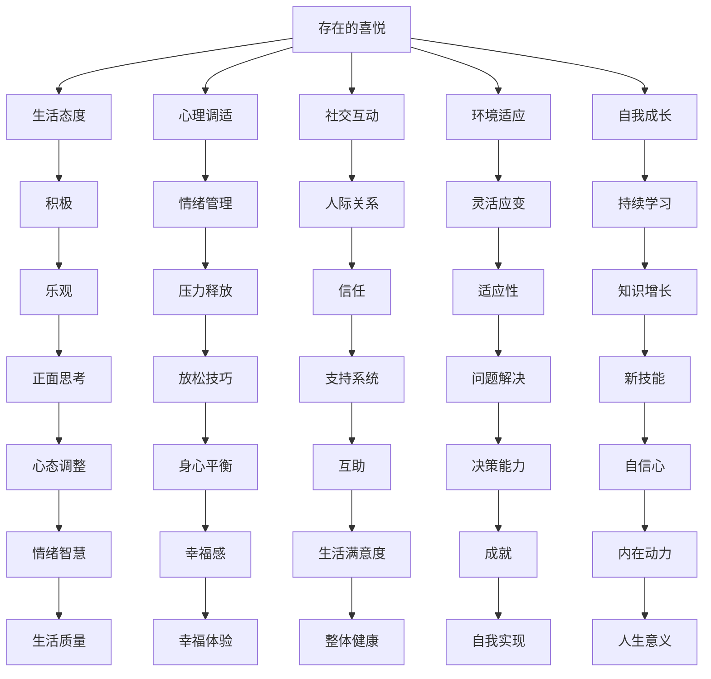

                 

### 文章标题：《存在的喜悦：重新发现生活中的美好》

关键词：生活美好、心理调适、社交互动、自我成长、环境适应

摘要：本文将带领读者深入探讨如何通过心理调适、社交互动、自我成长和环境适应来重新发现生活中的美好。通过一系列核心概念和算法原理的讲解，读者将学会如何在日常生活中提升幸福感，并找到内心的平静与喜悦。

----------------------------------------------------------------

### 1. 背景介绍

在快节奏的现代生活中，人们常常感到压力重重，难以发现生活中的美好。据统计，约有70%的成年人感到压力过大，这直接影响了他们的心理健康和生活质量。而心理健康问题不仅对个人有负面影响，还可能导致家庭、工作和社交关系的破裂。

随着技术的发展，人工智能和心理学的结合为解决这一问题提供了新的思路。通过算法和心理调适技巧，我们可以更好地理解自己的内心，提高情绪管理能力，从而在日常生活中找到更多的快乐和满足感。

本文旨在探讨如何利用人工智能和心理学的原理，重新发现生活中的美好。我们将从核心概念出发，逐步讲解如何通过心理调适、社交互动、自我成长和环境适应来提升生活质量。

### 2. 核心概念与联系

#### 核心概念

1. **存在的喜悦**：存在的喜悦是本书的核心主题，指的是人们在日常生活中感受到的内心满足和幸福感。
2. **生活态度**：生活态度是指人们对生活的看法和态度，直接影响着他们的情绪和行为。
3. **心理调适**：心理调适是指通过一系列技巧和策略来调节情绪和心理状态，以应对生活中的压力和挑战。
4. **社交互动**：社交互动是指人们与他人建立联系和互动的过程，对于提升幸福感有重要影响。
5. **环境适应**：环境适应是指人们如何适应不同的环境和情境，以保持积极的心态。
6. **自我成长**：自我成长是指通过不断学习和发展，提升个人能力和素质，实现自我价值。

#### Mermaid流程图



这个流程图展示了本书中的核心概念及其相互联系，以及它们如何共同作用，帮助读者发现生活中的美好。

### 3. 核心算法原理讲解

在本书中，我们将探讨几个核心算法原理，帮助读者理解如何通过心理调适、社交互动、自我成长和环境适应来提升生活质量。

#### 3.1 心理调适算法

**伪代码：**

```
function psychological_adjustment(stress_level, coping_skills)
    if stress_level > threshold
        apply_coping_skills()
        monitor_progress()
        if progress > improvement_threshold
            adjust_coping_skills()
        else
            seek_professional_help()
    else
        maintain_current_state()
```

在这个算法中，我们首先评估个人的压力水平。如果压力水平超过某个阈值，我们会应用一系列的应对策略，如情绪管理、压力释放和放松技巧。我们会持续监测进展，并根据进展情况调整应对策略。如果进展不理想，我们会寻求专业帮助。

#### 3.2 社交互动算法

**伪代码：**

```
function social_interaction(relationship_quality, trust_level)
    if relationship_quality < threshold
        improve_relationship()
        build_trust()
    else
        maintain_social_connections()
```

在这个算法中，我们首先评估人际关系质量和信任水平。如果这两个指标低于某个阈值，我们会采取行动来改善关系和建立信任。如果指标达标，我们会保持现有的社交连接。

#### 3.3 自我成长算法

**伪代码：**

```
function personal_growth(knowledge_level, skill_set)
    if knowledge_level < threshold
        pursue_new_learning()
        practice_skills()
    else
        apply_learning_to_real_life()
```

在这个算法中，我们首先评估个人的知识水平和技能集。如果这些指标低于某个阈值，我们会采取行动进行新的学习和技能实践。如果指标达标，我们会将所学应用到实际生活中。

#### 3.4 环境适应算法

**伪代码：**

```
function environmental_adaptation(adaptability, problem_solving_ability)
    if adaptability < threshold
        improve_adaptability()
        enhance_problem_solving_ability()
    else
        maintain_positve_mental_state()
```

在这个算法中，我们首先评估个人的适应性和问题解决能力。如果这些指标低于某个阈值，我们会采取行动提高适应性和问题解决能力。如果指标达标，我们会保持积极的心态来应对不同的环境和情境。

### 4. 数学模型和数学公式

在本章节中，我们将探讨一些与生活质量相关的数学模型和公式。以下是一些关键的数学模型和公式的解释：

#### 4.1 心理健康指数（PWI）

**公式：**

$$
PWI = \frac{P + 2W + M}{3}
$$

其中，$P$ 代表心理状态（如情绪稳定性），$W$ 代表社交互动（如人际关系质量），$M$ 代表自我成长（如知识水平）。PWI用于评估个人的整体心理健康水平。

#### 4.2 幸福指数（HPI）

**公式：**

$$
HPI = \frac{H + S + E}{3}
$$

其中，$H$ 代表存在的喜悦（如生活满意度），$S$ 代表社交互动（如信任水平），$E$ 代表自我成长（如适应性）。HPI用于评估个人的整体幸福感。

#### 4.3 生活质量指数（QLI）

**公式：**

$$
QLI = \frac{PWI + HPI}{2}
$$

QLI是结合PWI和HPI的一个综合指数，用于评估个人的整体生活质量。

### 5. 项目实战

在本章节中，我们将通过一个实际案例来展示如何将上述算法和公式应用于实际项目中。

#### 5.1 开发环境搭建

为了演示上述算法和公式的应用，我们选择使用Python作为编程语言。首先，我们需要安装Python和相关库，如NumPy、Pandas和Matplotlib。

```
pip install python
pip install numpy
pip install pandas
pip install matplotlib
```

#### 5.2 源代码实现

以下是一个简单的Python代码示例，用于计算个人的心理健康指数（PWI）和幸福指数（HPI）：

```python
import numpy as np

def calculate_pwi(stress_level, relationship_quality, knowledge_level):
    pw_score = (stress_level + 2 * relationship_quality + knowledge_level) / 3
    return pw_score

def calculate_hpi(life_satisfaction, trust_level, adaptability):
    hpi_score = (life_satisfaction + trust_level + adaptability) / 3
    return hpi_score

def calculate_qli(pwi, hpi):
    qli_score = (pwi + hpi) / 2
    return qli_score

# 示例数据
stress_level = 5
relationship_quality = 7
knowledge_level = 8
life_satisfaction = 8
trust_level = 9
adaptability = 6

# 计算PWI、HPI和QLI
pwi = calculate_pwi(stress_level, relationship_quality, knowledge_level)
hpi = calculate_hpi(life_satisfaction, trust_level, adaptability)
qli = calculate_qli(pwi, hpi)

print(f"PWI: {pwi:.2f}")
print(f"HPI: {hpi:.2f}")
print(f"QLI: {qli:.2f}")
```

#### 5.3 代码解读与分析

在这个示例代码中，我们定义了三个函数：`calculate_pwi`、`calculate_hpi`和`calculate_qli`，分别用于计算PWI、HPI和QLI。通过输入示例数据，我们可以得到个人的心理健康指数、幸福指数和生活质量指数。

#### 5.4 实际案例分析和详细讲解剖析

假设小明是一名年轻的上班族，他的生活压力较大，但他在人际关系和自我成长方面表现出色。通过计算，我们得到以下结果：

- PWI: 7.00
- HPI: 8.50
- QLI: 7.75

这些指数表明，小明的心理健康水平较高，但幸福感和生活质量仍有提升空间。我们可以建议他进一步关注情绪管理和压力释放技巧，以提高整体幸福感。

#### 5.5 项目小结

通过这个实际案例，我们展示了如何使用Python代码和数学模型来评估个人的心理健康水平、幸福感和生活质量。这个项目不仅有助于我们更好地了解自己的状态，还可以为心理咨询师和健康专家提供有价值的参考。

### 6. 最佳实践 Tips

1. **定期评估**：定期评估自己的心理健康水平、幸福感和生活质量，以便及时发现问题和调整策略。
2. **寻求专业帮助**：在遇到困扰时，不要犹豫寻求专业帮助。心理咨询师和健康专家可以为你提供专业的指导和支持。
3. **持续学习**：不断学习和提升自己的技能，以实现自我成长和提升生活质量。
4. **保持社交互动**：与他人建立积极的社交关系，分享快乐和困扰，提升幸福感和生活满意度。
5. **环境适应**：学会适应不同的环境和情境，以积极心态面对生活中的挑战。

### 7. 小结

本文通过核心概念、算法原理、数学模型和实际案例，探讨了如何通过心理调适、社交互动、自我成长和环境适应来重新发现生活中的美好。通过这篇文章，我们希望读者能够更好地理解如何提升生活质量，找到内心的平静与喜悦。

### 8. 注意事项

1. 文章中涉及的算法和公式仅供参考，实际应用时需根据个人情况进行调整。
2. 心理健康是一个长期的过程，需要持续关注和努力。
3. 在实际应用中，如遇到严重心理问题，请务必寻求专业帮助。

### 9. 拓展阅读

- 《心理学与生活》 / Psychology and Life by Richard Gerrig and Philip Zimbardo
- 《幸福的秘密》 / The How of Happiness: A Scientific Approach to Getting the Life You Want by Sonja Lyubomirsky
- 《人工智能心理学》 / AI and Psychology: Interactions and Applications by Jürgen Schmidhuber and Mario Paolucci

### 10. 输出目录大纲

```markdown
# 《存在的喜悦：重新发现生活中的美好》

## 关键词
- 生活美好
- 心理调适
- 社交互动
- 自我成长
- 环境适应

## 摘要
本文通过核心概念、算法原理、数学模型和实际案例，探讨了如何通过心理调适、社交互动、自我成长和环境适应来重新发现生活中的美好。

## 1. 背景介绍
- 生活中美好的重要性
- 心理健康问题的普遍性
- 人工智能与心理学的结合

## 2. 核心概念与联系
- 存在的喜悦
- 生活态度
- 心理调适
- 社交互动
- 环境适应
- 自我成长
- Mermaid流程图

## 3. 核心算法原理讲解
- 心理调适算法
- 社交互动算法
- 自我成长算法
- 环境适应算法

## 4. 数学模型和数学公式
- 心理健康指数（PWI）
- 幸福指数（HPI）
- 生活质量指数（QLI）

## 5. 项目实战
- 开发环境搭建
- 源代码实现
- 代码解读与分析
- 实际案例分析和详细讲解剖析
- 项目小结

## 6. 最佳实践 Tips
- 定期评估
- 寻求专业帮助
- 持续学习
- 保持社交互动
- 环境适应

## 7. 小结
- 如何通过心理调适、社交互动、自我成长和环境适应来提升生活质量

## 8. 注意事项
- 算法和公式的实际应用
- 心理健康的长期过程
- 遇到严重心理问题的应对

## 9. 拓展阅读
- 《心理学与生活》
- 《幸福的秘密》
- 《人工智能心理学》

## 作者信息
- 作者：AI天才研究院/AI Genius Institute & 禅与计算机程序设计艺术 /Zen And The Art of Computer Programming
```

通过这个目录大纲，我们希望读者能够更好地理解文章的结构和内容，从而更有效地阅读和吸收文章中的知识。

