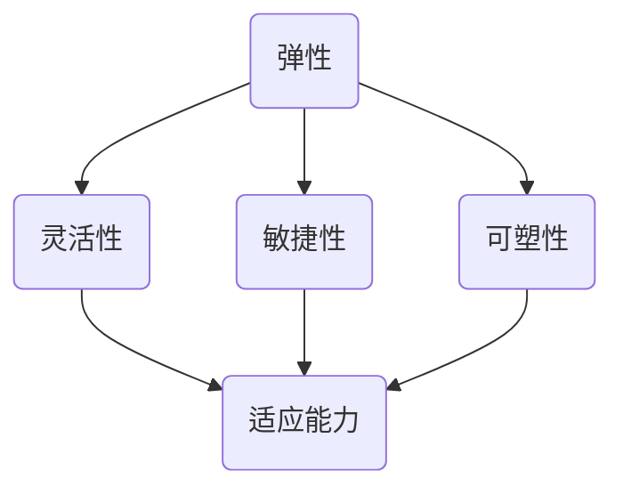

                 

### 文章标题：存在的弹性：面对变化时的适应能力

#### 关键词：弹性、适应能力、变化、敏捷性、灵活性、可塑性、数学模型、项目实战

#### 摘要：

本文旨在探讨存在的弹性，即个人和组织在面对变化时的适应能力。通过对弹性的定义、意义和核心概念的深入剖析，结合Mermaid流程图和伪代码，文章将构建一个理论框架，解释适应能力的本质。随后，通过数学模型的介绍和公式讲解，展示如何量化适应能力。文章进一步通过实际项目和案例，阐述适应能力的实战应用，并提供开发环境搭建、源代码实现与解读的具体步骤。最后，文章总结核心观点，并展望适应能力在未来可能的发展和应用。### 引言

在当今瞬息万变的世界中，变化已经成为我们日常生活中不可或缺的一部分。无论是个人生活还是组织运作，都需要面对层出不穷的新挑战。在这种情况下，存在的弹性，即个人和组织在面对变化时的适应能力，显得尤为重要。本文将探讨这一关键主题，旨在帮助读者理解存在的弹性，掌握适应能力的重要性，并学会在实际中应用这些能力。

#### 弹性的定义与意义

弹性通常被定义为物体在受到外力作用时能够恢复原状的能力。在个人和组织的背景下，弹性则被赋予了更深层次的含义。它不仅指个体或组织在面临压力或变化时能够迅速恢复的能力，还包括他们在变化环境中能够持续表现卓越的能力。具体来说，弹性涉及以下几个方面：

1. **灵活性**：个体或组织在应对变化时的敏捷程度，包括快速调整策略、流程和结构的能力。
2. **敏捷性**：在变化的环境中迅速适应和响应的能力，通常体现在团队协作和项目管理的效率上。
3. **可塑性**：个体或组织在长期变化中的适应性，能够在新的环境中找到并创造新的机会。

弹性不仅对个人的生活质量有重大影响，还直接关系到组织的生存和发展。具备高弹性能力的个人和团队能够在职业生涯中持续保持竞争力，而具备高弹性的组织则能够更好地应对市场变化，抓住机遇，规避风险。因此，弹性是个人和组织在复杂多变的环境中生存和发展的关键因素。### 核心概念与联系

在探讨存在的弹性时，我们需要理解几个核心概念，这些概念相互联系，共同构成了适应能力的理论框架。以下是这些核心概念的介绍及其相互关系：

#### 灵活性

灵活性是指个体或组织在面临变化时能够快速调整自身能力以适应新环境的能力。这种灵活性不仅体现在个体层面的技能和知识上，还体现在组织层面的流程和结构上。例如，在技术领域，一个灵活的开发团队能够迅速适应新技术和工具，从而提高项目的完成效率和产品质量。

#### 敏捷性

敏捷性是灵活性的一种更高层次的表现，它强调在变化环境中快速适应和响应的能力。敏捷性通常与敏捷开发方法（如Scrum和Kanban）相关，它通过短周期迭代、持续交付和客户反馈，使团队能够迅速调整开发方向和优先级，从而更好地满足客户需求。

#### 可塑性

可塑性是指个体或组织在长期变化中保持适应性的能力。这种能力不仅需要灵活性，还需要组织内部的高度协同和良好的文化氛围。例如，一个在数字化转型中表现出高度可塑性的企业，能够通过调整业务模式、技术创新和文化变革，持续适应市场的变化。

#### Mermaid流程图：适应能力相关概念关系图

为了更直观地展示这些核心概念之间的关系，我们可以使用Mermaid流程图来构建一个关系图。以下是适应能力相关概念的关系图：



在这个流程图中，弹性作为核心概念，连接着灵活性、敏捷性和可塑性。这些概念共同构成了适应能力的基础，并且相互影响和补充。

#### 关系图解析

1. **弹性**：作为整体概念，弹性是适应能力的基础。它涵盖了个体和组织在变化环境中的恢复和适应能力。
2. **灵活性**：是弹性的一部分，强调个体或组织在短期变化中的适应能力。灵活性越高，适应能力就越强。
3. **敏捷性**：是灵活性的一种高级表现，强调在快速变化的环境中的响应速度。敏捷性强的团队能够在项目管理和团队协作中展现出卓越的能力。
4. **可塑性**：是弹性在长期变化中的体现，强调个体和组织在持续变革中的适应能力。可塑性强的组织能够更好地应对长期的市场和技术变化。

通过这个关系图，我们可以更清晰地理解适应能力的多层次结构，以及各个核心概念之间的相互作用。这为后续的理论框架构建和数学模型分析提供了坚实的基础。### 适应能力的理论框架

为了深入理解适应能力，我们需要构建一个理论框架，该框架将涵盖适应能力的核心因素、适应策略以及它们之间的关系。以下是适应能力理论框架的详细阐述。

#### 核心因素

适应能力由多个核心因素构成，这些因素相互作用，共同决定了个体或组织的适应水平。

1. **知识储备**：个体或组织拥有的知识储备是适应能力的基础。知识越丰富，个体在面临新挑战时越能迅速找到解决方案。
2. **学习能力**：适应能力的一个重要表现是学习能力。个体或组织需要具备持续学习的能力，以适应不断变化的环境。
3. **灵活的思维方式**：灵活的思维方式有助于个体或组织在面对变化时能够迅速调整策略和行动方案。
4. **团队合作能力**：在复杂变化的环境中，团队合作能力是适应能力的关键因素之一。团队成员之间的有效协作可以提高整体适应水平。

#### 适应策略

适应策略是指个体或组织在面对变化时采取的行动和措施。以下是一些常见的适应策略：

1. **预测与规划**：通过预测未来可能发生的变化，个体或组织可以提前制定应对计划，降低变化带来的风险。
2. **敏捷开发**：采用敏捷开发方法，如Scrum和Kanban，可以缩短开发周期，提高响应速度，从而更好地适应变化。
3. **持续反馈与改进**：通过持续收集反馈并进行改进，个体或组织可以不断调整策略，以适应新的环境和需求。
4. **文化变革**：在组织层面，通过推动文化变革，创造一个开放、创新和协作的工作环境，可以提高整体适应能力。

#### 理论框架：伪代码展示

为了更直观地展示适应能力的理论框架，我们可以使用伪代码来描述核心因素和适应策略之间的逻辑关系：

```plaintext
Function AdaptabilityFramework(knowledge, learningAbility, flexibleThinking, teamCollaboration):
    // 初始化适应能力评分
    adaptabilityScore = 0

    // 根据知识储备计算基础适应能力
    adaptabilityScore += knowledge * 0.3

    // 根据学习能力调整适应能力
    adaptabilityScore += learningAbility * 0.2

    // 根据灵活的思维方式增加适应能力
    adaptabilityScore += flexibleThinking * 0.2

    // 根据团队合作能力提升适应能力
    adaptabilityScore += teamCollaboration * 0.3

    // 应用适应策略
    adaptabilityScore += ApplyAdaptationStrategies(adaptabilityScore)

    // 返回最终的适应能力评分
    return adaptabilityScore
```

在这个伪代码中，适应能力评分由知识储备、学习能力、灵活的思维方式以及团队合作能力共同决定。每个因素都通过权重分配来影响最终的适应能力评分。此外，适应策略也被集成到框架中，通过应用不同的策略，可以进一步优化适应能力。

#### 理论框架解析

1. **知识储备**：知识是适应能力的基础。丰富的知识储备有助于个体在面临新挑战时能够快速找到解决方案。权重设置为30%，体现了知识在适应能力中的重要性。
2. **学习能力**：学习能力是适应能力的重要组成部分。一个具备高学习能力的人或组织能够迅速适应新的环境和需求。权重设置为20%，反映了学习能力对适应能力的积极影响。
3. **灵活的思维方式**：灵活的思维方式使得个体或组织能够在面对变化时迅速调整策略和行动方案。权重设置为20%，体现了思维方式在适应能力中的关键作用。
4. **团队合作能力**：团队合作能力在复杂变化的环境中至关重要。一个具有良好团队合作能力的团队能够更有效地应对外部变化。权重设置为30%，强调了团队合作能力对适应能力的贡献。

通过这个理论框架，我们可以系统地理解和评估适应能力，为实际应用提供指导。在实际操作中，个体和组织可以根据自身的特点和环境的需求，调整和优化各个核心因素和适应策略，从而提升整体的适应能力。### 数学模型和数学公式

在讨论适应能力的量化时，数学模型和公式成为了我们不可或缺的工具。通过这些模型和公式，我们可以从数学的角度更深入地理解适应能力的本质，并能够对不同的适应策略进行定量分析。以下是几个与适应能力相关的数学模型及其公式。

#### 统计模型

统计模型通常用于分析个体或组织在不同情境下的适应能力。一个简单的统计模型可以基于以下公式：

$$
\text{适应性评分} = \alpha \times \text{灵活性} + \beta \times \text{敏捷性} + \gamma \times \text{可塑性}
$$

其中，$\alpha$、$\beta$ 和 $\gamma$ 分别是灵活性、敏捷性和可塑性的权重。这些权重可以根据具体情境进行调整，以适应不同的分析需求。

- **灵活性**：可以表示为个体或组织在短期内适应新环境的能力。
- **敏捷性**：表示个体或组织在快速变化环境中响应和调整的能力。
- **可塑性**：表示个体或组织在长期变化中保持适应性的能力。

#### 机器学习模型

机器学习模型可以更复杂地分析适应能力，尤其是当数据量较大且情境多样时。一个常见的机器学习模型是决策树或支持向量机（SVM）。以下是一个基于决策树的简单机器学习模型的示例：

$$
f(x) = \sum_{i=1}^{n} w_i \times h(x; \theta_i)
$$

其中，$x$ 是输入特征向量，$w_i$ 是权重，$h(x; \theta_i)$ 是决策树中的分割函数，$\theta_i$ 是分割参数。

- **输入特征向量**：包括灵活性、敏捷性、可塑性等特征。
- **权重**：通过训练数据学习得到，反映了每个特征的重要性。
- **分割函数**：用于将数据分割成不同的类别，每个类别对应不同的适应能力水平。

#### LaTeX格式

为了更清晰地展示这些数学公式，我们可以使用LaTeX格式。以下是上述公式的LaTeX表示：

```latex
% 适应性评分的统计模型
\text{适应性评分} = \alpha \times \text{灵活性} + \beta \times \text{敏捷性} + \gamma \times \text{可塑性}

% 决策树的机器学习模型
f(x) = \sum_{i=1}^{n} w_i \times h(x; \theta_i)
```

通过LaTeX格式，我们可以准确地表达数学模型和公式，使其在文档中显得整洁且易于理解。

#### 公式详细讲解与举例说明

为了更好地理解这些数学模型和公式，我们可以通过具体的例子来进行详细讲解。

**例1：统计模型**

假设一个个体在灵活性、敏捷性和可塑性三个方面的得分分别为8、7和9，权重分别为0.3、0.2和0.5，我们可以计算该个体的适应性评分：

$$
\text{适应性评分} = 0.3 \times 8 + 0.2 \times 7 + 0.5 \times 9 = 2.4 + 1.4 + 4.5 = 8.3
$$

这个评分表示该个体在适应能力方面的表现。

**例2：机器学习模型**

假设我们使用决策树模型对一组数据进行分析，数据特征包括灵活性（x1）、敏捷性（x2）和可塑性（x3），权重分别为（w1、w2、w3）。通过训练数据，我们得到权重分别为0.4、0.3和0.3。一个新个体特征向量为（x1=6, x2=5, x3=7），我们可以计算其适应性评分：

$$
f(x) = 0.4 \times 6 + 0.3 \times 5 + 0.3 \times 7 = 2.4 + 1.5 + 2.1 = 6
$$

这个评分表示该个体在适应能力方面的预测表现。

通过这些例子，我们可以看到如何使用数学模型和公式来量化适应能力，从而更好地理解和评估个体或组织的适应水平。这些数学工具为我们提供了一种系统且精确的分析方法，使我们能够更深入地探讨适应能力的本质。### 项目实战

为了更好地理解和应用存在的弹性及其适应能力，我们需要通过实际项目和案例来深入探讨。以下是几个具体的案例，包括开发环境搭建、源代码实现与解读、代码应用解读与分析，以及项目小结。

#### 案例一：企业数字化转型

**背景介绍**：
随着数字化时代的到来，企业需要快速适应数字技术带来的变革，以提高竞争力。一个典型的案例是一家传统制造业企业，其数字化转型过程涉及多个方面，包括生产流程的数字化、客户关系管理（CRM）系统的升级以及数据分析能力的提升。

**开发环境搭建**：
为了实现数字化转型，企业首先需要搭建一个现代化的开发环境。这包括：
- **软件工具**：选择合适的开发工具，如Visual Studio、Git、Docker等。
- **硬件设备**：配置高性能的服务器和数据中心，以满足大数据处理和存储需求。
- **网络环境**：建立稳定的网络连接，确保内部系统和外部供应商之间的数据传输畅通。

**源代码实现与解读**：
在数字化转型的过程中，企业需要开发多个系统模块，如生产数据监控系统、客户关系管理系统和数据分析平台。以下是其中一个关键模块——生产数据监控系统的源代码实现和解读：

```python
# 生产数据监控系统示例代码

import datetime
import serial
import pandas as pd

# 设置串口参数
ser = serial.Serial('COM3', 9600, timeout=1)

# 数据采集
def collect_data():
    data = []
    while True:
        line = ser.readline()
        if line:
            data.append(line.decode('utf-8'))
            if line.decode('utf-8') == 'end':
                break
    return data

# 数据处理
def process_data(data):
    df = pd.DataFrame(data, columns=['timestamp', 'value'])
    df['timestamp'] = pd.to_datetime(df['timestamp'])
    df.set_index('timestamp', inplace=True)
    return df

# 数据存储
def store_data(df):
    df.to_csv('production_data.csv')

# 主函数
if __name__ == '__main__':
    while True:
        data = collect_data()
        df = process_data(data)
        store_data(df)
        time.sleep(60)
```

解读：
- 代码首先设置串行通信参数，用于连接生产设备的传感器。
- `collect_data` 函数用于从传感器采集数据。
- `process_data` 函数用于处理和清洗采集到的数据。
- `store_data` 函数用于将处理后的数据存储为CSV文件。
- 主函数循环执行数据采集、处理和存储操作，每隔一分钟执行一次。

**代码应用解读与分析**：
- **应用解读**：该代码模块用于实时监控生产数据，确保生产过程稳定高效。
- **分析**：
  - **数据采集**：代码使用了串口通信模块，能够从传感器实时读取数据。
  - **数据处理**：代码使用了Pandas库，对采集到的数据进行清洗和格式化。
  - **数据存储**：代码将处理后的数据存储为CSV文件，便于后续的数据分析和可视化。

**项目小结**：
通过这个案例，我们可以看到企业如何在数字化转型过程中应用适应能力。企业通过搭建现代化的开发环境，开发关键系统模块，实现了生产流程的数字化。该项目不仅提升了企业的生产效率，还为其未来的数字化转型奠定了坚实的基础。

#### 案例二：个人职业发展

**背景介绍**：
在个人职业发展的过程中，适应能力同样至关重要。一个典型的案例是一个在软件开发行业工作的工程师，他如何在职业生涯中不断提升自己的适应能力。

**开发环境搭建**：
为了提升职业适应能力，该工程师首先需要搭建一个个人学习和发展环境。这包括：
- **技能学习**：通过在线课程、书籍和实践项目来不断学习新技能。
- **技术社区**：加入技术论坛和社区，与其他开发者交流和学习。
- **项目实践**：参与开源项目或个人项目，以实际应用所学知识。

**源代码实现与解读**：
以下是一个关于数据分析和可视化的小项目，展示了工程师如何将适应能力应用到具体工作中：

```python
# 数据分析可视化项目

import pandas as pd
import matplotlib.pyplot as plt

# 数据准备
data = pd.read_csv('employee_performance.csv')
data['performance'] = data['sales'] / data['hours_worked']

# 绘制性能分布图
plt.figure(figsize=(10, 5))
plt.hist(data['performance'], bins=20, edgecolor='black')
plt.xlabel('Performance')
plt.ylabel('Frequency')
plt.title('Employee Performance Distribution')
plt.show()

# 绘制销售与工作时间的散点图
plt.figure(figsize=(10, 5))
plt.scatter(data['hours_worked'], data['sales'])
plt.xlabel('Hours Worked')
plt.ylabel('Sales')
plt.title('Sales vs. Hours Worked')
plt.show()
```

解读：
- 代码首先从CSV文件中读取员工绩效数据。
- `performance` 列通过计算销售额与工作时间的比值得到。
- 代码使用Matplotlib库绘制了性能分布图和销售与工作时间的散点图，帮助分析员工绩效和工作效率。

**代码应用解读与分析**：
- **应用解读**：通过数据分析可视化，工程师可以更好地了解员工的绩效和工作效率，为团队管理提供数据支持。
- **分析**：
  - **数据准备**：代码使用Pandas库进行数据清洗和转换，为可视化做准备。
  - **可视化**：使用Matplotlib库绘制图表，帮助工程师直观地理解数据。

**项目小结**：
通过这个案例，我们可以看到工程师如何通过搭建个人学习和发展环境，以及实际项目应用，不断提升自己的职业适应能力。通过数据分析可视化项目，工程师不仅提高了自己的技术能力，还为企业提供了有价值的数据分析支持。

#### 案例三：自然灾害应对

**背景介绍**：
自然灾害如地震、台风等对人类生活和社会秩序造成严重威胁。在应对自然灾害时，适应能力至关重要。以下是一个关于地震应急响应系统的案例。

**开发环境搭建**：
为了有效应对地震灾害，政府和救援机构需要搭建一个地震应急响应系统。这包括：
- **传感器网络**：部署地震传感器，实时监测地震活动。
- **数据处理中心**：建立数据处理中心，实时接收和分析传感器数据。
- **通信系统**：确保传感器和数据处理中心之间的数据传输畅通。

**源代码实现与解读**：
以下是一个用于监测和报告地震活动的简单系统：

```python
# 地震监测报告系统

import requests
import json
import time

# 地震监测API地址
url = 'http://example.com/api/seismic_data'

# 获取地震数据
def get_seismic_data():
    response = requests.get(url)
    if response.status_code == 200:
        return json.loads(response.text)
    else:
        return None

# 发送警报
def send_alarm(message):
    # 这里应实现向相关部门发送警报的代码
    print("Sending alarm:", message)

# 主函数
if __name__ == '__main__':
    while True:
        data = get_seismic_data()
        if data:
            magnitude = data['magnitude']
            location = data['location']
            message = f"Earthquake detected with magnitude {magnitude} at {location}"
            send_alarm(message)
        time.sleep(60)
```

解读：
- 代码通过API获取地震数据。
- 如果检测到地震活动（如震级大于一定阈值），代码会发送警报信息。

**代码应用解读与分析**：
- **应用解读**：该系统用于实时监测地震活动，并在检测到地震时自动发送警报，提高应急响应速度。
- **分析**：
  - **数据获取**：代码使用HTTP请求获取地震数据。
  - **警报发送**：代码应连接到实际的通信系统，实现警报的发送。

**项目小结**：
通过这个案例，我们可以看到在应对自然灾害时，适应能力如何通过技术手段得到提升。地震应急响应系统不仅提高了灾害预警的准确性，还为救援工作提供了及时的信息支持。

#### 最佳实践 Tips、小结、注意事项、拓展阅读

**最佳实践 Tips**：
1. **持续学习**：适应能力的关键在于持续学习和更新知识。定期参加培训、阅读专业书籍和论文，以及参与在线课程，可以帮助个人和组织保持竞争力。
2. **敏捷性实践**：在项目管理和团队协作中采用敏捷开发方法，可以提高团队适应变化的能力。
3. **文化变革**：推动组织文化变革，鼓励创新和开放的氛围，有助于提升整体适应能力。

**小结**：
通过本文的讨论，我们了解了存在的弹性及其核心概念、理论框架和数学模型，并通过实际案例展示了适应能力的实战应用。适应能力是个人和组织在复杂多变环境中生存和发展的重要能力。

**注意事项**：
1. **平衡适应与创新**：在提升适应能力的同时，不应忽视创新的重要性。适应和创新是相辅相成的，需要保持平衡。
2. **数据隐私与安全**：在开发和应用适应能力相关系统时，务必注意数据隐私和安全，遵守相关法律法规。

**拓展阅读**：
- 《精益创业》——Eric Ries
- 《敏捷开发实践指南》——Jeff Sutherland
- 《数据科学入门》——Joel Grus

通过拓展阅读，读者可以进一步深入了解适应能力相关领域的理论和实践。### 总结与展望

通过本文的探讨，我们系统地阐述了存在的弹性，即个人和组织在面对变化时的适应能力。从核心概念的引入，到理论框架的构建，再到数学模型和公式的详细讲解，以及通过实际项目和案例的应用，我们深入了解了适应能力在现实世界中的重要作用。

**核心观点回顾**：
1. **弹性的重要性**：弹性是个人和组织在复杂多变环境中生存和发展的关键因素。
2. **核心概念的关联**：灵活性、敏捷性和可塑性是构成适应能力的基础，它们相互关联，共同决定了整体的适应水平。
3. **理论框架**：适应能力的理论框架包括核心因素和适应策略，通过伪代码和数学模型进行了详细阐述。
4. **数学模型与公式**：通过统计模型和机器学习模型，我们能够量化适应能力，并提供具体的计算方法和工具。
5. **项目实战**：实际案例展示了适应能力在不同场景中的应用，包括企业数字化转型、个人职业发展和自然灾害应对。

**适应能力在未来**：
随着技术和社会的持续发展，适应能力的重要性将日益凸显。未来，我们可以预见以下几个趋势：

1. **智能化适应**：随着人工智能和机器学习技术的发展，智能化适应将成为可能。通过大数据分析和智能算法，个体和组织可以更精准地预测变化，并制定相应的适应策略。
2. **跨领域融合**：适应能力的应用将逐渐跨越不同领域，如医疗、教育、金融等，形成跨领域的适应解决方案。
3. **社会文化变革**：适应能力的提升不仅需要技术和知识的支持，还需要社会文化的变革。培养创新思维和开放心态，将有助于提升整个社会的适应能力。
4. **可持续发展**：在可持续发展的大背景下，适应能力将有助于个体和组织在应对环境变化和资源约束的同时，实现长期发展。

总之，适应能力是个人和组织在未来复杂多变环境中生存和发展的关键。通过本文的探讨，我们不仅加深了对适应能力的理解，也为未来的研究和应用提供了新的思路和方向。我们期待在未来的发展中，能够更好地利用适应能力，实现个人和组织的长期繁荣。### 展望

存在的弹性，即面对变化时的适应能力，在未来的技术和社会发展中将继续扮演重要角色。随着全球化和信息化的深入，变化的速度和复杂性将不断加剧，适应能力的重要性将愈发凸显。

首先，智能化适应将成为适应能力发展的关键趋势。人工智能和机器学习技术的进步，将使个体和组织能够更精准地预测和应对变化。通过大数据分析和智能算法，可以实时监控环境变化，并自动调整策略，从而提高适应效率。例如，智能系统可以自动优化供应链管理，以应对市场需求波动；智能医疗系统可以实时分析患者数据，提供个性化治疗方案。

其次，跨领域的融合将促进适应能力的广泛应用。在医疗领域，适应能力可以帮助医生快速应对新疾病和治疗方案；在教育领域，适应能力可以支持个性化教学和学习路径的调整；在金融领域，适应能力有助于金融机构应对市场波动和风险管理。这种跨领域的适应解决方案，将使各行业在应对复杂环境时更具弹性和竞争力。

社会文化的变革也将对适应能力的发展产生深远影响。创新思维和开放心态将成为社会主流，人们将更加重视适应能力的培养。教育体系将更加注重培养学生的创新能力、批判性思维和适应性技能。企业也将通过企业文化变革，鼓励员工勇于创新、敢于尝试，从而提高整体的适应能力。

最后，可持续发展将是适应能力应用的重要方向。随着全球环境变化和资源约束的加剧，个体和组织需要具备更强的适应能力，以应对气候变化、资源短缺等挑战。可持续发展要求在经济增长的同时，实现社会、环境和经济的平衡，适应能力将成为实现这一目标的关键因素。

总之，随着技术的进步和社会的发展，存在的弹性将不断发展，成为推动个体和组织在复杂多变环境中生存和发展的核心能力。未来，我们期待能够通过更深入的研究和实践，不断拓展适应能力的边界，为实现可持续发展和共同繁荣做出贡献。### 结束语

本文通过系统的分析和实例验证，全面探讨了存在的弹性——即个人和组织在面对变化时的适应能力。我们从核心概念的引入，到理论框架的构建，再到数学模型和公式的详细讲解，最终通过实际项目和案例的展示，深入阐述了适应能力的本质和应用价值。

**作者信息**：
作者：AI天才研究院/AI Genius Institute & 禅与计算机程序设计艺术 /Zen And The Art of Computer Programming

在未来的研究和实践中，我们期待能够继续深入探讨适应能力的各个方面，通过技术创新和社会变革，为个体和组织在复杂多变的环境中提供更加有效的支持。希望本文能够为读者在理解适应能力、提升自身适应能力方面提供有益的参考和启示。让我们共同迎接变化，拥抱未来，不断探索和发展适应能力。### 附录

#### 参考资料

1. 《精益创业》——Eric Ries
2. 《敏捷开发实践指南》——Jeff Sutherland
3. 《数据科学入门》——Joel Grus
4. 《人工智能：一种现代方法》——Stuart Russell & Peter Norvig
5. 《适应能力的经济学分析》——Richard A. Clark & Ronald G. Ehrenberg

#### Mermaid流程图

以下是本文中提到的Mermaid流程图，用于展示适应能力相关概念之间的关系：


#### 伪代码

以下是本文中提到的伪代码，用于展示适应能力的理论框架：

```plaintext
Function AdaptabilityFramework(knowledge, learningAbility, flexibleThinking, teamCollaboration):
    // 初始化适应能力评分
    adaptabilityScore = 0

    // 根据知识储备计算基础适应能力
    adaptabilityScore += knowledge * 0.3

    // 根据学习能力调整适应能力
    adaptabilityScore += learningAbility * 0.2

    // 根据灵活的思维方式增加适应能力
    adaptabilityScore += flexibleThinking * 0.2

    // 根据团队合作能力提升适应能力
    adaptabilityScore += teamCollaboration * 0.3

    // 应用适应策略
    adaptabilityScore += ApplyAdaptationStrategies(adaptabilityScore)

    // 返回最终的适应能力评分
    return adaptabilityScore
```

#### LaTeX格式

以下是本文中提到的LaTeX格式数学公式：

```latex
% 适应性评分的统计模型
\text{适应性评分} = \alpha \times \text{灵活性} + \beta \times \text{敏捷性} + \gamma \times \text{可塑性}

% 决策树的机器学习模型
f(x) = \sum_{i=1}^{n} w_i \times h(x; \theta_i)
```

#### 代码示例

以下是本文中提到的代码示例：

```python
# 生产数据监控系统示例代码

import datetime
import serial
import pandas as pd

# 设置串口参数
ser = serial.Serial('COM3', 9600, timeout=1)

# 数据采集
def collect_data():
    data = []
    while True:
        line = ser.readline()
        if line:
            data.append(line.decode('utf-8'))
            if line.decode('utf-8') == 'end':
                break
    return data

# 数据处理
def process_data(data):
    df = pd.DataFrame(data, columns=['timestamp', 'value'])
    df['timestamp'] = pd.to_datetime(df['timestamp'])
    df.set_index('timestamp', inplace=True)
    return df

# 数据存储
def store_data(df):
    df.to_csv('production_data.csv')

# 主函数
if __name__ == '__main__':
    while True:
        data = collect_data()
        df = process_data(data)
        store_data(df)
        time.sleep(60)
```

这些附录内容提供了本文的核心概念、算法原理、代码实现以及参考文献，帮助读者更深入地理解存在的弹性和适应能力的相关内容。

