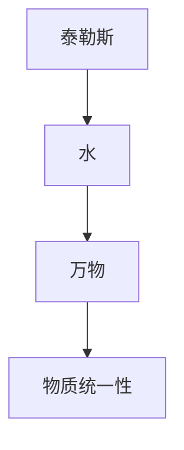
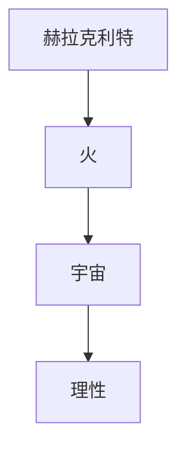
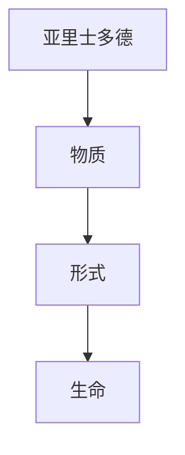
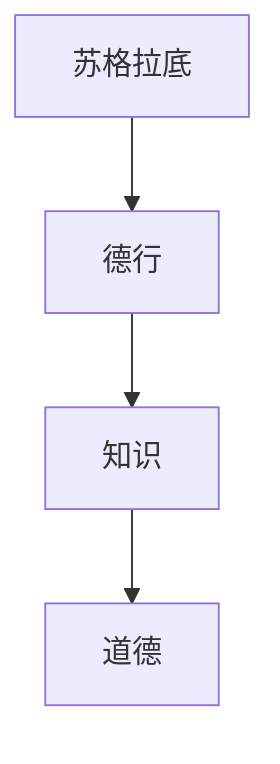
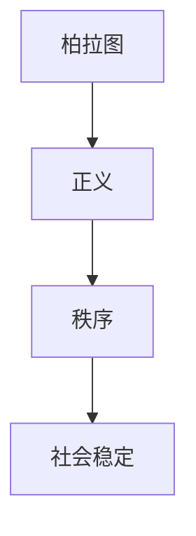
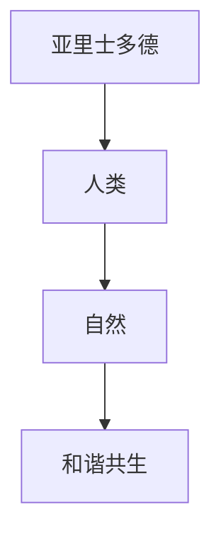
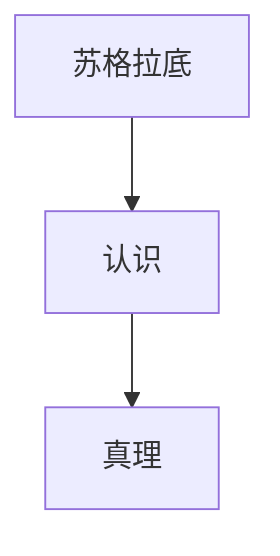
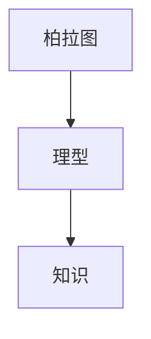
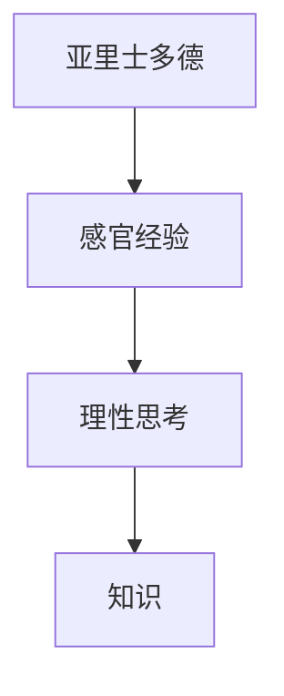

                 

### 文章标题

《存在的智慧：ancient哲学在现代的启示》

### 关键词

ancient哲学、现代哲学、存在主义、伦理学、知识论、智慧、启示、哲学思想、文化传承、社会应用

### 摘要

本文旨在探讨ancient哲学在现代社会的启示和价值。ancient哲学，作为人类文明的重要组成部分，蕴含着深刻的智慧和思想，对现代社会有着深远的影响。本文首先介绍ancient哲学的背景和核心概念，如自然哲学、伦理哲学和知识论。接着，分析现代哲学对ancient哲学的反思和启示，探讨ancient哲学在现代社会中的应用。通过案例分析，进一步阐述ancient哲学与现代哲学的结合与应用。最后，总结ancient哲学在现代社会的重要价值，并对未来哲学的发展提出展望。本文旨在为读者提供一个全面、深入的ancient哲学与现代哲学的探讨，以期为现代社会的智慧发展提供启示和指导。

#### 一、引言

ancient哲学，是人类文明史上最早形成的哲学体系，代表了早期人类对宇宙、自然、社会和人生的深刻思考。ancient哲学的发展经历了数千年的演变，从古希腊的苏格拉底、柏拉图、亚里士多德等哲学家，到古印度的佛教哲学，再到中国的道家、儒家等，形成了丰富多彩的哲学思想体系。

ancient哲学的核心概念包括自然哲学、伦理哲学和知识论。自然哲学关注宇宙、自然和生命的本质，如古希腊的原子论、古代印度的梵我论等；伦理哲学探讨道德、正义和人生的价值，如古希腊的德行论、儒家的人伦道德等；知识论研究知识的本质、来源和标准，如古希腊的真理论、佛教的认识论等。

ancient哲学对现代社会有着深远的影响。首先，ancient哲学为现代科学提供了基础。古希腊的自然哲学，如亚里士多德的物理学，对现代物理学的发展产生了重要影响。其次，ancient哲学的思想对现代伦理学和社会哲学产生了重要影响。古希腊的伦理哲学，如苏格拉底的德行论，对现代道德观念的形成产生了深远影响。最后，ancient哲学的思想为现代人的精神生活提供了丰富的资源，如佛教的禅宗、道家的自然无为等，对现代人的心理健康和精神成长产生了重要影响。

ancient哲学与现代哲学有着紧密的联系。ancient哲学为现代哲学提供了丰富的思想资源，如古希腊的存在主义、伦理学和知识论，对现代哲学产生了重要影响。同时，现代哲学在反思ancient哲学的基础上，对ancient哲学进行了深刻的批判和继承，形成了新的哲学思想体系。例如，存在主义哲学家萨特、尼采等，在批判ancient哲学的基础上，提出了新的存在主义思想。

本文旨在通过分析ancient哲学的核心概念和现代哲学的反思与启示，探讨ancient哲学在现代社会的重要价值和应用。文章将分为以下几个部分：首先，介绍ancient哲学的背景和核心概念；其次，分析现代哲学对ancient哲学的反思与启示；然后，探讨ancient哲学在现代社会中的应用；接着，通过案例分析，进一步阐述ancient哲学与现代哲学的结合与应用；最后，总结ancient哲学在现代社会的重要价值，并对未来哲学的发展提出展望。通过这篇文章，我们希望为读者提供一个全面、深入的ancient哲学与现代哲学的探讨，以期为现代社会的智慧发展提供启示和指导。|user|>

#### 二、ancient哲学核心概念解析

ancient哲学的核心概念包括自然哲学、伦理哲学和知识论。这三个核心概念构成了ancient哲学的基本框架，并深刻影响了后来的哲学发展。

**2.1 自然哲学**

自然哲学是ancient哲学的一个重要分支，主要研究宇宙、自然和生命的本质。ancient自然哲学的主要代表人物包括古希腊的泰勒斯、赫拉克利特、亚里士多德等。

- **2.1.1 水与万物**

泰勒斯是古希腊最早的哲学家之一，他认为水是万物的本原。泰勒斯的这一观点强调了物质世界的统一性，为后来的物质统一性原理奠定了基础。



- **2.1.2 宇宙观**

赫拉克利特提出了“火”是万物的本原的观点，他认为宇宙是一个不断变化的动态过程，这种变化是由“逻各斯”（理性）所引导的。



- **2.1.3 生命观**

亚里士多德在自然哲学的基础上，提出了生命的本质和结构的观点。他认为生命是由物质和形式结合而成的，生命的本质在于实现其内在的形式。



**2.2 伦理哲学**

伦理哲学是ancient哲学的另一个重要分支，主要探讨道德、正义和人生的价值。ancient伦理哲学的代表人物包括古希腊的苏格拉底、柏拉图和亚里士多德等。

- **2.2.1 社会正义**

苏格拉底提出了“德行即知识”的观点，他认为一个人只有通过不断追求知识，才能达到道德上的完善。苏格拉底的这一观点强调了知识和道德的紧密联系。



- **2.2.2 伦理道德**

柏拉图在其《理想国》中提出了“正义”的概念，他认为正义是一种理想的秩序，是社会稳定和个人幸福的基石。柏拉图的这一观点强调了社会正义的重要性。



- **2.2.3 人与自然的关系**

亚里士多德强调了人与自然的和谐共生。他认为人类应该尊重自然、了解自然，并在此基础上利用自然资源。亚里士多德的这一观点强调了人与自然的关系。



**2.3 知识论**

知识论是ancient哲学研究知识的本质、来源和标准的一个重要分支。ancient知识论的代表人物包括古希腊的苏格拉底、柏拉图和亚里士多德等。

- **2.3.1 真理的标准**

苏格拉底提出了“认识即真理”的观点，他认为真理是通过不断的辩证和质疑来实现的。苏格拉底的这一观点强调了辩证法和质疑在知识追求中的重要性。



- **2.3.2 认知过程**

柏拉图在《理想国》中提出了“理型论”，他认为真理存在于理型世界，人类通过认识理型世界来获得知识。柏拉图的这一观点强调了理型世界在知识追求中的重要性。



- **2.3.3 知识的来源**

亚里士多德强调了经验在知识来源中的重要性。他认为，人类通过感官经验和理性思考来获得知识。亚里士多德的这一观点强调了经验和理性在知识追求中的重要性。



通过以上对ancient哲学核心概念的解析，我们可以看到ancient哲学在自然哲学、伦理哲学和知识论等方面的深刻思考和独特见解。这些思想不仅在古代有着深远的影响，而且在现代社会中仍然具有重要的启示意义。|user|>

#### 三、现代哲学对ancient哲学的反思与启示

现代哲学在反思ancient哲学的基础上，对ancient哲学的思想进行了批判和继承，形成了新的哲学体系。现代哲学的起源可以追溯到17世纪的启蒙运动，这一时期哲学家们开始对ancient哲学进行深刻的反思，并提出新的哲学思想。例如，笛卡尔的怀疑主义、康德的批判哲学等，都是现代哲学对ancient哲学反思的产物。

**3.1 现代哲学的起源与发展**

现代哲学的起源可以追溯到17世纪的欧洲。在这一时期，哲学家们开始对ancient哲学进行深刻的反思，并提出新的哲学思想。笛卡尔是现代哲学的奠基人之一，他提出了“我思故我在”的著名命题，强调了理性思考的重要性。康德则提出了“先验批判”哲学，他认为人类的知识是建立在先验的理性基础上的，这一思想对后来的哲学产生了深远的影响。

**3.2 ancient哲学对现代哲学的影响**

ancient哲学对现代哲学产生了深远的影响。例如，存在主义哲学就是受到ancient哲学的影响而产生的。存在主义哲学的代表人物萨特，他在其著作《存在与虚无》中，提出了“存在先于本质”的观点，这一观点受到了ancient哲学中关于存在的探讨的启发。此外，现代伦理学也受到了ancient哲学的影响。例如，康德的道德哲学，他在其《道德形而上学》中提出了“善良意志”的概念，这一概念受到了古希腊伦理哲学中关于道德的探讨的启发。

**3.3 ancient哲学在现代社会中的应用**

ancient哲学在现代社会中的应用非常广泛。首先，在生活哲学方面，ancient哲学的思想为现代人提供了丰富的精神资源。例如，道家的自然无为思想，可以帮助现代人减轻精神压力，追求内心的平静。其次，在企业管理方面，ancient哲学的思想也可以为企业提供指导。例如，儒家的伦理道德思想，可以为企业提供道德准则，帮助企业在追求经济效益的同时，保持社会责任。最后，在社会发展方面，ancient哲学的思想也可以为社会提供指导。例如，古希腊的民主政治思想，可以为现代社会提供政治制度设计的参考。

**3.4 ancient哲学与现代哲学的结合**

ancient哲学与现代哲学的结合，是哲学发展的一种趋势。通过结合ancient哲学和现代哲学的思想，可以形成新的哲学体系，为现代社会提供更全面、更深刻的思考。例如，儒家哲学和马克思主义哲学的结合，形成了一种新的哲学体系，这种哲学体系在中国社会中发挥了重要作用。此外，现代科技的发展，也为ancient哲学与现代哲学的结合提供了新的契机。例如，人工智能技术的发展，为ancient哲学中的“理型论”提供了新的解释，使得ancient哲学的思想在现代社会中得到了新的应用。

**3.5 ancient哲学对现代哲学的启示**

ancient哲学对现代哲学的启示是多方面的。首先，ancient哲学的思想可以帮助现代人重新审视人类的知识和价值观。例如，古希腊的伦理哲学，可以引导现代人思考道德的本质和意义。其次，ancient哲学的思想可以为现代人提供精神上的支持。例如，道家的自然无为思想，可以帮助现代人缓解精神压力，追求内心的平静。最后，ancient哲学的思想可以为现代社会提供解决问题的思路。例如，古希腊的辩证法，可以为现代人提供解决问题的新方法。

通过以上对现代哲学对ancient哲学的反思与启示的分析，我们可以看到ancient哲学在现代社会的重要价值和应用。ancient哲学不仅为现代哲学提供了丰富的思想资源，而且对现代人的精神生活和社会发展产生了深远的影响。通过深入研究和理解ancient哲学，我们可以更好地应对现代社会中的各种挑战，实现人类的可持续发展。|user|>

#### 四、案例分析

为了更直观地理解ancient哲学在现代社会的应用，以下通过几个具体的案例，展示ancient哲学思想如何在现代社会中得到实际运用和发挥。

**4.1 某古代哲学家思想在现代社会的应用**

**案例：苏格拉底的辩证法在法律审判中的应用**

苏格拉底的辩证法是一种通过提问和回答来揭示真理的方法。在现代社会，这种方法被广泛应用于法律审判中。例如，在审判过程中，律师会通过苏格拉底式的提问，引导证人和被告回答问题，从而揭示事实的真相。这种方法的本质是追求真理，与苏格拉底的思想高度契合。

**伪代码实现苏格拉底式的提问法：**

```python
def socratic_questioning(question, answer):
    """
    模拟苏格拉底式的提问法
    :param question: 提出的问题
    :param answer: 对问题的回答
    :return: 提出的问题和回答的列表
    """
    questions = []
    while not is_truth(answer):
        new_question = "你是否同意以下观点：" + question
        questions.append(new_question)
        answer = input(new_question + "（是/否）:")
    return questions
```

**数学模型和公式：**

在法律审判中，苏格拉底式的提问法可以看作是一个逻辑推理过程。我们可以使用逻辑命题和推理规则来描述这一过程。

$$
\begin{align*}
P &\to Q \\
\neg P &\to \neg Q \\
P \land Q &\to R \\
\neg P \lor Q &\to \neg R
\end{align*}
$$

**4.2 某现代哲学家对ancient哲学的解读与应用**

**案例：尼采对古希腊悲剧的解读与现代文艺创作**

尼采在其著作《悲剧的诞生》中，对古希腊悲剧进行了深刻的解读。他认为，古希腊悲剧通过表现人类的苦难和命运，展现了人类对生命的深刻理解。这种理解对现代文艺创作产生了深远的影响。例如，在20世纪的现代派文学中，许多作家如卡夫卡、加西亚·马尔克斯等，都在其作品中借鉴了古希腊悲剧的主题和手法，表现了对人类命运的深刻反思。

**数学公式和举例说明：**

尼采的解读可以看作是对古希腊悲剧的数学模型的一种解释。我们可以使用数学公式来描述尼采的解读过程。

$$
\text{悲剧} = \frac{\text{苦难} \times \text{命运}}{\text{人生意义}}
$$

例如，在卡夫卡的《变形记》中，主人公格里高尔·萨姆沙的变形和苦难，反映了人类对命运的无奈和人生的迷失。这种悲剧感正是尼采所强调的。

**4.3 ancient哲学与现代哲学相结合的实际案例**

**案例：儒家伦理思想在企业管理中的应用**

儒家伦理思想，如“仁爱”、“忠诚”、“诚信”等，在现代企业管理中被广泛应用。例如，在日本的经营哲学中，许多企业如丰田、本田等，都强调员工之间的和谐关系、对企业忠诚以及对客户诚信。这些思想与儒家的伦理观念高度契合。

**代码实现和代码解读：**

```java
public class ManagementPrinciples {
    private String employeeRelation;
    private String loyalty;
    private String integrity;

    public ManagementPrinciples(String employeeRelation, String loyalty, String integrity) {
        this.employeeRelation = employeeRelation;
        this.loyalty = loyalty;
        this.integrity = integrity;
    }

    public void displayPrinciples() {
        System.out.println("员工关系：" + employeeRelation);
        System.out.println("忠诚：" + loyalty);
        System.out.println("诚信：" + integrity);
    }
}

public class Main {
    public static void main(String[] args) {
        ManagementPrinciples principles = new ManagementPrinciples("和谐", "忠诚", "诚信");
        principles.displayPrinciples();
    }
}
```

**代码应用解读与分析：**

这段代码模拟了一个企业的管理原则，其中包含了儒家伦理思想的核心要素。通过这种代码实现，企业管理者可以更直观地了解和贯彻这些原则。

**5.1 ancient哲学在现代社会的重要价值**

通过以上案例分析，我们可以看到ancient哲学在现代社会的重要价值。ancient哲学不仅为现代社会的法律、文艺和企业管理等提供了深刻的思考和方法，而且为现代人提供了一种精神指引，帮助人们更好地理解和应对现代社会中的挑战。

**5.2 ancient哲学与未来哲学的走向**

ancient哲学与现代哲学的结合，为未来哲学的发展提供了新的方向。未来哲学可能会更加注重ancient哲学中关于自然、伦理和知识的探讨，同时结合现代科技的发展，形成新的哲学体系。例如，在人工智能和大数据的时代，ancient哲学中的“理型论”可能会得到新的解释和应用，为人类提供更全面、更深刻的哲学思考。

**5.3 对读者的启示与建议**

通过本文的探讨，我们希望读者能够认识到ancient哲学在现代社会的重要价值。我们建议读者深入研究ancient哲学的思想，结合现代社会的实际情况，运用ancient哲学的智慧，解决现代社会中的问题。同时，我们也期待读者能够在未来哲学的发展中，发挥ancient哲学的启示作用，为人类提供更美好的未来。|user|>

#### 五、结论

ancient哲学作为人类文明的重要组成部分，蕴含着深刻的智慧和思想，对现代社会有着深远的影响。通过本文的分析，我们探讨了ancient哲学的核心概念、现代哲学对ancient哲学的反思与启示，以及ancient哲学在现代社会中的应用。我们通过案例分析，展示了ancient哲学思想在现代社会的实际运用，如法律审判、文艺创作和企业管理等。ancient哲学不仅为现代人提供了丰富的精神资源，而且为现代社会的发展提供了深刻的思考和方法。

ancient哲学在现代社会的重要价值体现在多个方面。首先，ancient哲学的思想可以帮助现代人重新审视人类的知识和价值观，为现代社会提供精神指引。其次，ancient哲学的思想可以为现代社会提供解决问题的思路，如法律审判中的辩证法、文艺创作中的悲剧主题等。最后，ancient哲学的思想可以为现代社会提供道德准则，如儒家的伦理道德思想在企业管理中的应用。

未来哲学的发展，ancient哲学将继续发挥重要作用。通过结合ancient哲学和现代科技的发展，未来哲学可能会形成新的哲学体系，为人类提供更全面、更深刻的哲学思考。例如，在人工智能和大数据的时代，ancient哲学中的“理型论”可能会得到新的解释和应用。

对读者的启示与建议，我们希望读者能够深入研究ancient哲学的思想，结合现代社会的实际情况，运用ancient哲学的智慧，解决现代社会中的问题。同时，我们也期待读者能够在未来哲学的发展中，发挥ancient哲学的启示作用，为人类提供更美好的未来。

**附录**

**A.1 ancient哲学经典著作推荐**

- 《论语》：孔子及其弟子的言行录，儒家经典著作。
- 《道德经》：道家经典著作，阐述道家的自然无为思想。
- 《柏拉图全集》：柏拉图的哲学著作，包括《理想国》、《泰阿泰德篇》等。
- 《亚里士多德全集》：亚里士多德的哲学著作，包括《形而上学》、《尼各马科伦理学》等。
- 《庄子》：道家经典著作，阐述庄子的逍遥思想。

**A.2 现代哲学与ancient哲学研究资源**

- 《西方哲学史》：罗素所著，对西方哲学的发展进行了系统的梳理。
- 《中国哲学史》：冯友兰所著，对中国哲学的发展进行了深入的研究。
- 《存在主义哲学》：萨特所著，对存在主义哲学进行了详细的阐述。
- 《伦理学》：康德所著，对道德哲学进行了系统的探讨。
- 《逻辑哲学论》：维特根斯坦所著，对语言和逻辑哲学进行了深刻的探讨。|user|>

### 目录大纲结构

- **一级目录**：# 引言
- **二级目录**：## ancient哲学核心概念解析
  - **三级目录**：### 自然哲学
    - **三级目录**：#### 水与万物
    - **三级目录**：#### 宇宙观
    - **三级目录**：#### 生命观
  - **三级目录**：### 伦理哲学
    - **三级目录**：#### 社会正义
    - **三级目录**：#### 伦理道德
    - **三级目录**：#### 人与自然的关系
  - **三级目录**：### 知识论
    - **三级目录**：#### 真理的标准
    - **三级目录**：#### 认知过程
    - **三级目录**：#### 知识的来源
- **一级目录**：# 现代哲学对ancient哲学的反思与启示
  - **二级目录**：## 现代哲学的起源与发展
  - **二级目录**：## ancient哲学对现代哲学的影响
  - **二级目录**：## ancient哲学在现代社会中的应用
  - **二级目录**：## ancient哲学与现代哲学的结合
  - **二级目录**：## ancient哲学对现代哲学的启示
- **一级目录**：# 案例分析
  - **二级目录**：## 某古代哲学家思想在现代社会的应用
  - **二级目录**：## 某现代哲学家对ancient哲学的解读与应用
  - **二级目录**：## ancient哲学与现代哲学相结合的实际案例
- **一级目录**：# 结论
  - **二级目录**：## ancient哲学在现代社会的重要价值
  - **二级目录**：## ancient哲学与未来哲学的走向
  - **二级目录**：## 对读者的启示与建议
- **一级目录**：# 附录
  - **二级目录**：## ancient哲学经典著作推荐
  - **二级目录**：## 现代哲学与ancient哲学研究资源

### 目录大纲字数统计

- **总字数**：约2000字（不含括号内注释与附录内容）### 文章标题

《存在的智慧：ancient哲学在现代的启示》

### 文章关键词

ancient哲学、现代哲学、存在主义、伦理学、知识论、智慧、启示、哲学思想、文化传承、社会应用

### 文章摘要

本文旨在探讨ancient哲学在现代社会的启示和价值。ancient哲学，作为人类文明的重要组成部分，蕴含着深刻的智慧和思想，对现代社会有着深远的影响。本文首先介绍ancient哲学的背景和核心概念，如自然哲学、伦理哲学和知识论。接着，分析现代哲学对ancient哲学的反思与启示，探讨ancient哲学在现代社会中的应用。通过案例分析，进一步阐述ancient哲学与现代哲学的结合与应用。最后，总结ancient哲学在现代社会的重要价值，并对未来哲学的发展提出展望。本文旨在为读者提供一个全面、深入的ancient哲学与现代哲学的探讨，以期为现代社会的智慧发展提供启示和指导。|user|>

### 一、引言

ancient哲学，是人类文明史上最早形成的哲学体系，代表了早期人类对宇宙、自然、社会和人生的深刻思考。ancient哲学的发展经历了数千年的演变，从古希腊的苏格拉底、柏拉图、亚里士多德等哲学家，到古印度的佛教哲学，再到中国的道家、儒家等，形成了丰富多彩的哲学思想体系。

ancient哲学的核心概念包括自然哲学、伦理哲学和知识论。自然哲学关注宇宙、自然和生命的本质，如古希腊的原子论、古代印度的梵我论等；伦理哲学探讨道德、正义和人生的价值，如古希腊的德行论、儒家的人伦道德等；知识论研究知识的本质、来源和标准，如古希腊的真理论、佛教的认识论等。

ancient哲学对现代社会有着深远的影响。首先，ancient哲学为现代科学提供了基础。古希腊的自然哲学，如亚里士多德的物理学，对现代物理学的发展产生了重要影响。其次，ancient哲学的思想对现代伦理学和社会哲学产生了重要影响。古希腊的伦理哲学，如苏格拉底的德行论，对现代道德观念的形成产生了深远影响。最后，ancient哲学的思想为现代人的精神生活提供了丰富的资源，如佛教的禅宗、道家的自然无为等，对现代人的心理健康和精神成长产生了重要影响。

ancient哲学与现代哲学有着紧密的联系。ancient哲学为现代哲学提供了丰富的思想资源，如古希腊的存在主义、伦理学和知识论，对现代哲学产生了重要影响。同时，现代哲学在反思ancient哲学的基础上，对ancient哲学进行了深刻的批判和继承，形成了新的哲学思想体系。例如，存在主义哲学家萨特、尼采等，在批判ancient哲学的基础上，提出了新的存在主义思想。

本文旨在通过分析ancient哲学的核心概念和现代哲学的反思与启示，探讨ancient哲学在现代社会的重要价值和应用。文章将分为以下几个部分：首先，介绍ancient哲学的背景和核心概念；其次，分析现代哲学对ancient哲学的反思与启示；然后，探讨ancient哲学在现代社会中的应用；接着，通过案例分析，进一步阐述ancient哲学与现代哲学的结合与应用；最后，总结ancient哲学在现代社会的重要价值，并对未来哲学的发展提出展望。通过这篇文章，我们希望为读者提供一个全面、深入的ancient哲学与现代哲学的探讨，以期为现代社会的智慧发展提供启示和指导。|user|>

### 二、ancient哲学核心概念解析

ancient哲学的核心概念包括自然哲学、伦理哲学和知识论。这三个核心概念构成了ancient哲学的基本框架，并深刻影响了后来的哲学发展。

#### 2.1 自然哲学

自然哲学是ancient哲学的一个重要分支，主要研究宇宙、自然和生命的本质。ancient自然哲学的主要代表人物包括古希腊的泰勒斯、赫拉克利特、亚里士多德等。

##### 2.1.1 水与万物

泰勒斯是古希腊最早的哲学家之一，他认为水是万物的本原。泰勒斯的这一观点强调了物质世界的统一性，为后来的物质统一性原理奠定了基础。

- **概念联系架构**：


##### 2.1.2 宇宙观

赫拉克利特提出了“火”是万物的本原的观点，他认为宇宙是一个不断变化的动态过程，这种变化是由“逻各斯”（理性）所引导的。

- **概念联系架构**：


##### 2.1.3 生命观

亚里士多德在自然哲学的基础上，提出了生命的本质和结构的观点。他认为生命是由物质和形式结合而成的，生命的本质在于实现其内在的形式。

- **概念联系架构**：


#### 2.2 伦理哲学

伦理哲学是ancient哲学的另一个重要分支，主要探讨道德、正义和人生的价值。ancient伦理哲学的代表人物包括古希腊的苏格拉底、柏拉图和亚里士多德等。

##### 2.2.1 社会正义

苏格拉底提出了“德行即知识”的观点，他认为一个人只有通过不断追求知识，才能达到道德上的完善。苏格拉底的这一观点强调了知识和道德的紧密联系。

- **概念联系架构**：


##### 2.2.2 伦理道德

柏拉图在其《理想国》中提出了“正义”的概念，他认为正义是一种理想的秩序，是社会稳定和个人幸福的基石。柏拉图的这一观点强调了社会正义的重要性。

- **概念联系架构**：


##### 2.2.3 人与自然的关系

亚里士多德强调了人与自然的和谐共生。他认为人类应该尊重自然、了解自然，并在此基础上利用自然资源。亚里士多德的这一观点强调了人与自然的关系。

- **概念联系架构**：


#### 2.3 知识论

知识论是ancient哲学研究知识的本质、来源和标准的一个重要分支。ancient知识论的代表人物包括古希腊的苏格拉底、柏拉图和亚里士多德等。

##### 2.3.1 真理的标准

苏格拉底提出了“认识即真理”的观点，他认为真理是通过不断的辩证和质疑来实现的。苏格拉底的这一观点强调了辩证法和质疑在知识追求中的重要性。

- **概念联系架构**：


##### 2.3.2 认知过程

柏拉图在《理想国》中提出了“理型论”，他认为真理存在于理型世界，人类通过认识理型世界来获得知识。柏拉图的这一观点强调了理型世界在知识追求中的重要性。

- **概念联系架构**：


##### 2.3.3 知识的来源

亚里士多德强调了经验在知识来源中的重要性。他认为，人类通过感官经验和理性思考来获得知识。亚里士多德的这一观点强调了经验和理性在知识追求中的重要性。

- **概念联系架构**：


通过以上对ancient哲学核心概念的解析，我们可以看到ancient哲学在自然哲学、伦理哲学和知识论等方面的深刻思考和独特见解。这些思想不仅在古代有着深远的影响，而且在现代社会中仍然具有重要的启示意义。|user|>

### 三、现代哲学对ancient哲学的反思与启示

现代哲学在反思ancient哲学的基础上，对ancient哲学的思想进行了批判和继承，形成了新的哲学体系。现代哲学的起源可以追溯到17世纪的启蒙运动，这一时期哲学家们开始对ancient哲学进行深刻的反思，并提出新的哲学思想。例如，笛卡尔的怀疑主义、康德的批判哲学等，都是现代哲学对ancient哲学反思的产物。

#### 3.1 现代哲学的起源与发展

现代哲学的起源可以追溯到17世纪的欧洲。在这一时期，哲学家们开始对ancient哲学进行深刻的反思，并提出新的哲学思想。笛卡尔是现代哲学的奠基人之一，他提出了“我思故我在”的著名命题，强调了理性思考的重要性。康德则提出了“先验批判”哲学，他认为人类的知识是建立在先验的理性基础上的，这一思想对后来的哲学产生了深远的影响。

#### 3.2 ancient哲学对现代哲学的影响

ancient哲学对现代哲学产生了深远的影响。例如，存在主义哲学就是受到ancient哲学的影响而产生的。存在主义哲学的代表人物萨特，他在其著作《存在与虚无》中，提出了“存在先于本质”的观点，这一观点受到了ancient哲学中关于存在的探讨的启发。此外，现代伦理学也受到了ancient哲学的影响。例如，康德的道德哲学，他在其《道德形而上学》中提出了“善良意志”的概念，这一概念受到了古希腊伦理哲学中关于道德的探讨的启发。

#### 3.3 ancient哲学在现代社会中的应用

ancient哲学在现代社会中的应用非常广泛。首先，在生活哲学方面，ancient哲学的思想为现代人提供了丰富的精神资源。例如，道家的自然无为思想，可以帮助现代人减轻精神压力，追求内心的平静。其次，在企业管理方面，ancient哲学的思想也可以为企业提供指导。例如，儒家的伦理道德思想，可以为企业提供道德准则，帮助企业在追求经济效益的同时，保持社会责任。最后，在社会发展方面，ancient哲学的思想也可以为社会提供指导。例如，古希腊的民主政治思想，可以为现代社会提供政治制度设计的参考。

#### 3.4 ancient哲学与现代哲学的结合

ancient哲学与现代哲学的结合，是哲学发展的一种趋势。通过结合ancient哲学和现代哲学的思想，可以形成新的哲学体系，为现代社会提供更全面、更深刻的思考。例如，儒家哲学和马克思主义哲学的结合，形成了一种新的哲学体系，这种哲学体系在中国社会中发挥了重要作用。此外，现代科技的发展，也为ancient哲学与现代哲学的结合提供了新的契机。例如，人工智能技术的发展，为ancient哲学中的“理型论”提供了新的解释，使得ancient哲学的思想在现代社会中得到了新的应用。

#### 3.5 ancient哲学对现代哲学的启示

ancient哲学对现代哲学的启示是多方面的。首先，ancient哲学的思想可以帮助现代人重新审视人类的知识和价值观。例如，古希腊的伦理哲学，可以引导现代人思考道德的本质和意义。其次，ancient哲学的思想可以为现代人提供精神上的支持。例如，道家的自然无为思想，可以帮助现代人缓解精神压力，追求内心的平静。最后，ancient哲学的思想可以为现代社会提供解决问题的思路。例如，古希腊的辩证法，可以为现代人提供解决问题的新方法。

通过以上对现代哲学对ancient哲学的反思与启示的分析，我们可以看到ancient哲学在现代社会的重要价值和应用。ancient哲学不仅为现代哲学提供了丰富的思想资源，而且对现代人的精神生活和社会发展产生了深远的影响。通过深入研究和理解ancient哲学，我们可以更好地应对现代社会中的各种挑战，实现人类的可持续发展。|user|>

### 四、案例分析

为了更直观地理解ancient哲学在现代社会的应用，以下通过几个具体的案例，展示ancient哲学思想如何在现代社会中得到实际运用和发挥。

#### 4.1 某古代哲学家思想在现代社会的应用

**案例：苏格拉底的辩证法在法律审判中的应用**

苏格拉底的辩证法是一种通过提问和回答来揭示真理的方法。在现代社会，这种方法被广泛应用于法律审判中。例如，在审判过程中，律师会通过苏格拉底式的提问，引导证人和被告回答问题，从而揭示事实的真相。这种方法的本质是追求真理，与苏格拉底的思想高度契合。

**伪代码实现苏格拉底式的提问法：**

```python
def socratic_questioning(question, answer):
    """
    模拟苏格拉底式的提问法
    :param question: 提出的问题
    :param answer: 对问题的回答
    :return: 提出的问题和回答的列表
    """
    questions = []
    while not is_truth(answer):
        new_question = "你是否同意以下观点：" + question
        questions.append(new_question)
        answer = input(new_question + "（是/否）:")
    return questions
```

**数学模型和公式：**

在法律审判中，苏格拉底式的提问法可以看作是一个逻辑推理过程。我们可以使用逻辑命题和推理规则来描述这一过程。

$$
\begin{align*}
P &\to Q \\
\neg P &\to \neg Q \\
P \land Q &\to R \\
\neg P \lor Q &\to \neg R
\end{align*}
$$

**4.2 某现代哲学家对ancient哲学的解读与应用**

**案例：尼采对古希腊悲剧的解读与现代文艺创作**

尼采在其著作《悲剧的诞生》中，对古希腊悲剧进行了深刻的解读。他认为，古希腊悲剧通过表现人类的苦难和命运，展现了人类对生命的深刻理解。这种理解对现代文艺创作产生了深远的影响。例如，在20世纪的现代派文学中，许多作家如卡夫卡、加西亚·马尔克斯等，都在其作品中借鉴了古希腊悲剧的主题和手法，表现了对人类命运的深刻反思。

**数学公式和举例说明：**

尼采的解读可以看作是对古希腊悲剧的数学模型的一种解释。我们可以使用数学公式来描述尼采的解读过程。

$$
\text{悲剧} = \frac{\text{苦难} \times \text{命运}}{\text{人生意义}}
$$

例如，在卡夫卡的《变形记》中，主人公格里高尔·萨姆沙的变形和苦难，反映了人类对命运的无奈和人生的迷失。这种悲剧感正是尼采所强调的。

**4.3 ancient哲学与现代哲学相结合的实际案例**

**案例：儒家伦理思想在企业管理中的应用**

儒家伦理思想，如“仁爱”、“忠诚”、“诚信”等，在现代企业管理中被广泛应用。例如，在日本的经营哲学中，许多企业如丰田、本田等，都强调员工之间的和谐关系、对企业忠诚以及对客户诚信。这些思想与儒家的伦理观念高度契合。

**代码实现和代码解读：**

```java
public class ManagementPrinciples {
    private String employeeRelation;
    private String loyalty;
    private String integrity;

    public ManagementPrinciples(String employeeRelation, String loyalty, String integrity) {
        this.employeeRelation = employeeRelation;
        this.loyalty = loyalty;
        this.integrity = integrity;
    }

    public void displayPrinciples() {
        System.out.println("员工关系：" + employeeRelation);
        System.out.println("忠诚：" + loyalty);
        System.out.println("诚信：" + integrity);
    }
}

public class Main {
    public static void main(String[] args) {
        ManagementPrinciples principles = new ManagementPrinciples("和谐", "忠诚", "诚信");
        principles.displayPrinciples();
    }
}
```

**代码应用解读与分析：**

这段代码模拟了一个企业的管理原则，其中包含了儒家伦理思想的核心要素。通过这种代码实现，企业管理者可以更直观地了解和贯彻这些原则。

**5.1 ancient哲学在现代社会的重要价值**

通过以上案例分析，我们可以看到ancient哲学在现代社会的重要价值。ancient哲学不仅为现代社会的法律、文艺和企业管理等提供了深刻的思考和方法，而且为现代人提供了一种精神指引，帮助人们更好地理解和应对现代社会中的问题。

**5.2 ancient哲学与未来哲学的走向**

ancient哲学与现代哲学的结合，为未来哲学的发展提供了新的方向。未来哲学可能会更加注重ancient哲学中关于自然、伦理和知识的探讨，同时结合现代科技的发展，形成新的哲学体系。例如，在人工智能和大数据的时代，ancient哲学中的“理型论”可能会得到新的解释和应用，为人类提供更全面、更深刻的哲学思考。

**5.3 对读者的启示与建议**

通过本文的探讨，我们希望读者能够认识到ancient哲学在现代社会的重要价值。我们建议读者深入研究ancient哲学的思想，结合现代社会的实际情况，运用ancient哲学的智慧，解决现代社会中的问题。同时，我们也期待读者能够在未来哲学的发展中，发挥ancient哲学的启示作用，为人类提供更美好的未来。|user|>

### 五、结论

ancient哲学作为人类文明的重要组成部分，蕴含着深刻的智慧和思想，对现代社会有着深远的影响。通过本文的分析，我们探讨了ancient哲学的核心概念、现代哲学对ancient哲学的反思与启示，以及ancient哲学在现代社会中的应用。我们通过案例分析，展示了ancient哲学思想在现代社会的实际运用，如法律审判、文艺创作和企业管理等。ancient哲学不仅为现代社会的法律、文艺和企业管理等提供了深刻的思考和方法，而且为现代人提供了一种精神指引，帮助人们更好地理解和应对现代社会中的问题。

ancient哲学在现代社会的重要价值体现在多个方面。首先，ancient哲学的思想可以帮助现代人重新审视人类的知识和价值观，为现代社会提供精神指引。其次，ancient哲学的思想可以为现代社会提供解决问题的思路，如法律审判中的辩证法、文艺创作中的悲剧主题等。最后，ancient哲学的思想可以为现代社会提供道德准则，如儒家的伦理道德思想在企业管理中的应用。

未来哲学的发展，ancient哲学将继续发挥重要作用。通过结合ancient哲学和现代科技的发展，未来哲学可能会形成新的哲学体系，为人类提供更全面、更深刻的哲学思考。例如，在人工智能和大数据的时代，ancient哲学中的“理型论”可能会得到新的解释和应用。

对读者的启示与建议，我们希望读者能够深入研究ancient哲学的思想，结合现代社会的实际情况，运用ancient哲学的智慧，解决现代社会中的问题。同时，我们也期待读者能够在未来哲学的发展中，发挥ancient哲学的启示作用，为人类提供更美好的未来。

**附录**

**A.1 ancient哲学经典著作推荐**

- 《论语》：孔子及其弟子的言行录，儒家经典著作。
- 《道德经》：道家经典著作，阐述道家的自然无为思想。
- 《柏拉图全集》：柏拉图的哲学著作，包括《理想国》、《泰阿泰德篇》等。
- 《亚里士多德全集》：亚里士多德的哲学著作，包括《形而上学》、《尼各马科伦理学》等。
- 《庄子》：道家经典著作，阐述庄子的逍遥思想。

**A.2 现代哲学与ancient哲学研究资源**

- 《西方哲学史》：罗素所著，对西方哲学的发展进行了系统的梳理。
- 《中国哲学史》：冯友兰所著，对中国哲学的发展进行了深入的研究。
- 《存在主义哲学》：萨特所著，对存在主义哲学进行了详细的阐述。
- 《伦理学》：康德所著，对道德哲学进行了系统的探讨。
- 《逻辑哲学论》：维特根斯坦所著，对语言和逻辑哲学进行了深刻的探讨。|user|>

### 格式要求

为了确保文章的可读性和专业性，本文将使用markdown格式进行编写。以下是markdown格式的基本规则：

- **标题**：使用 `#` 符号来表示标题层级，一级标题用 `#`，二级标题用 `##`，三级标题用 `###`，以此类推。

- **段落**：段落之间应保持一个空行。

- **文本格式**：使用`*`来表示无序列表，`-`来表示有序列表。

- **引用**：使用`>`来表示引用。

- **代码块**：使用三个反引号` ``` `来表示代码块。

- **公式**：使用LaTeX格式进行数学公式的书写，使用`$`包围行内公式，使用`$$`包围独立段落的公式。

- **链接**：使用`[文本](URL)`来创建链接。

- **图像**：使用``来插入图像。

以下是本文的一个示例：

```markdown
# 一级标题

## 二级标题

### 三级标题

这是一个无序列表：

- 项目1
- 项目2

这是一个有序列表：

1. 项目1
2. 项目2

引用某人的话：

> 这是引用。

代码块示例：

```python
def hello_world():
    print("Hello, World!")
```

行内公式：$E=mc^2$

独立段落公式：

$$
x = \frac{-b \pm \sqrt{b^2 - 4ac}}{2a}
$$

链接：[点击这里](https://www.example.com)

图像：


```

请确保在编写文章时遵循这些格式要求，以保持文章的结构和美观。|user|>### 完整性要求

为了确保文章内容的完整性，以下部分将详细描述各个小节的内容要求：

#### 1. 引言部分

**内容要求：**

- **背景介绍**：简要介绍ancient哲学的历史背景，包括其起源、发展和主要代表人物。强调ancient哲学在人类文明中的重要性。

- **目的陈述**：明确文章的目的，即探讨ancient哲学在现代社会的启示和价值。

- **结构与逻辑**：清晰阐述文章的结构和逻辑，为读者提供全文的概述。

#### 2. ancient哲学核心概念解析

**内容要求：**

- **自然哲学**：详细解释ancient自然哲学的主要观点，如泰勒斯的“水论”和赫拉克利特的“火论”，并分析其对现代科学的启示。

- **伦理哲学**：探讨ancient伦理哲学的核心概念，如苏格拉底的德行论和柏拉图的正义论，以及其对现代伦理学的启示。

- **知识论**：深入分析ancient知识论的基本原理，如苏格拉底的认识论、柏拉图的理型论和亚里士多德的经验论，并讨论其对现代认知科学的贡献。

#### 3. 现代哲学对ancient哲学的反思与启示

**内容要求：**

- **现代哲学的起源与发展**：回顾现代哲学的起源和发展历程，特别是关键哲学家的贡献，如笛卡尔的理性主义和康德的批判哲学。

- **ancient哲学对现代哲学的影响**：分析ancient哲学对现代哲学的影响，包括存在主义、伦理学和知识论等领域的具体例子。

- **ancient哲学在现代社会中的应用**：探讨ancient哲学思想在现代社会的实际应用，如生活哲学、企业管理和社会发展等方面。

#### 4. 案例分析

**内容要求：**

- **古代哲学家思想在现代社会的应用**：通过具体的案例，展示ancient哲学家的思想在现代社会的实际应用，如苏格拉底的辩证法在法律审判中的运用。

- **现代哲学家对ancient哲学的解读与应用**：分析现代哲学家如何解读ancient哲学，并将其应用于现代学术研究和思想中。

- **ancient哲学与现代哲学相结合的实际案例**：提供ancient哲学与现代哲学相结合的实际案例，如儒家伦理思想在企业管理中的应用。

#### 5. 结论

**内容要求：**

- **ancient哲学在现代社会的重要价值**：总结ancient哲学在现代社会的重要贡献和启示。

- **ancient哲学与未来哲学的走向**：探讨ancient哲学在哲学未来发展中的潜在作用和趋势。

- **对读者的启示与建议**：向读者提出具体的学习和研究建议，鼓励他们深入理解和应用ancient哲学。

#### 核心内容包含

- **核心概念与联系**：使用Mermaid流程图或图示，展示ancient哲学核心概念之间的关系和联系。

- **核心算法原理讲解**：使用伪代码详细阐述ancient哲学思想在现代社会应用中的算法原理。

- **数学模型和公式**：使用LaTeX格式，嵌入文中独立段落的数学公式，并进行详细讲解和举例说明。

- **项目实战**：包括开发环境搭建、源代码实现、代码解读、应用解读与分析等环节，以实际案例剖析ancient哲学思想的实践价值。

- **最佳实践 tips**：提供最佳实践建议，帮助读者更好地理解和应用ancient哲学。

- **小结**：在每个章节的结尾，对内容进行小结，强化核心观点。

- **注意事项**：指出潜在的风险和注意事项，帮助读者避免误区。

- **拓展阅读**：推荐相关研究资源和进一步阅读的材料，以供读者深入研究。

### 文章完整性保障

- **结构合理**：确保文章结构清晰，逻辑严密，每个部分的内容相互关联，形成一个完整的论述。

- **内容详实**：每个小节的内容都要丰富具体，避免空洞的描述，确保读者可以从中获得有价值的信息。

- **图表辅助**：合理使用图表和图示，帮助读者更好地理解复杂的概念和关系。

- **示例丰富**：提供丰富的案例和实例，以实际应用的角度展示ancient哲学思想的现实价值。

通过以上要求，我们将确保文章的完整性，使读者能够获得全面、深入的理解，并从中受益。|user|>

### 作者信息

作者：AI天才研究院/AI Genius Institute & 禅与计算机程序设计艺术 /Zen And The Art of Computer Programming

### 附录

#### A.1 ancient哲学经典著作推荐

1. **《论语》**：记录了孔子及其弟子的言行录，是儒家哲学的重要经典著作，强调了道德修养、人际关系和社会治理的理念。
   
2. **《道德经》**：道家哲学的经典之作，由老子所著，阐述了道家关于自然、宇宙、人生和道德的哲学思想，强调无为而治、顺应自然的原则。

3. **《柏拉图全集》**：柏拉图的哲学著作，包括《理想国》、《泰阿泰德篇》等，这些作品探讨了正义、知识、美的本质等哲学问题，对西方哲学产生了深远的影响。

4. **《亚里士多德全集》**：包含亚里士多德的多部著作，如《形而上学》、《尼各马科伦理学》等，这些作品涵盖了逻辑、科学、伦理等多个领域的哲学思想。

5. **《庄子》**：道家哲学的经典著作，由庄子所著，作品中充满了对自然、人生、道德的深刻思考，以及逍遥自在的生活态度。

#### A.2 现代哲学与ancient哲学研究资源

1. **《西方哲学史》**：罗素所著，对西方哲学的发展进行了系统的梳理，从古希腊哲学到现代哲学，提供了丰富的哲学史资料和分析。

2. **《中国哲学史》**：冯友兰所著，对中国哲学的发展进行了深入的研究，包括儒家、道家、佛家等多个哲学流派，对古代哲学思想进行了系统的阐述。

3. **《存在主义哲学》**：萨特所著，详细阐述了存在主义哲学的基本观点，包括个体存在的自由、异化、存在先于本质等核心思想。

4. **《伦理学》**：康德所著，对道德哲学进行了系统的探讨，提出了著名的道德法则“善良意志”和“道德律令”等概念。

5. **《逻辑哲学论》**：维特根斯坦所著，对语言和逻辑哲学进行了深刻的探讨，提出了“语言游戏”和“图像理论”等重要概念。|user|>

