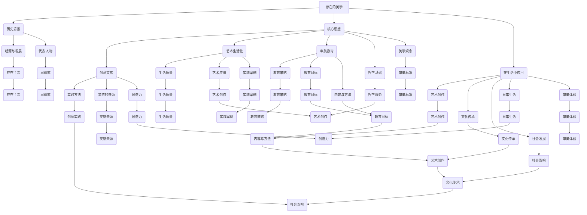

                 

### 文章标题

《存在的美学：将生活转化为艺术》

### 文章关键词

存在的美学，生活转化，艺术，审美教育，当代社会，未来趋势

### 文章摘要

本文旨在探讨存在的美学，通过分析其概念、历史背景、核心思想以及在生活中的应用，帮助读者理解如何将日常生活中的事物转化为艺术，提高生活质量和幸福感。文章将分章节详细阐述存在的美学概念、将生活转化为艺术的方法、艺术生活化的实践、审美教育的重要性以及存在的美学在当代社会和未来的影响与趋势。通过本文的阅读，读者将能够更深入地理解存在的美学，并学会将其应用于日常生活中，实现生活的艺术化。

## 总览

### 目录大纲

1. **总览**
2. **存在的美学概念**
   - 1.1 历史背景
   - 1.2 核心思想
   - 1.3 在生活中的应用
3. **将生活转化为艺术**
   - 2.1 创意灵感
   - 2.2 实践方法
   - 2.3 实际案例
4. **艺术生活化**
   - 3.1 艺术在生活中的应用
   - 3.2 提高生活质量
   - 3.3 实践方法
5. **审美教育**
   - 4.1 审美教育的目标
   - 4.2 审美教育的内容
   - 4.3 实施策略
6. **存在的美学在当代社会**
   - 5.1 影响和作用
   - 5.2 艺术创作
   - 5.3 文化传承
7. **存在的美学与未来**
   - 6.1 发展趋势
   - 6.2 影响和启示
   - 6.3 应用前景
8. **附录**
   - 参考文献
   - 案例研究
   - 实践指南

### 核心概念

存在的美学，生活转化，艺术，审美教育，当代社会，未来趋势

### 总览

《存在的美学：将生活转化为艺术》旨在深入探讨存在的美学这一概念，帮助读者理解其历史背景、核心思想以及在生活中的应用。本书分为八个主要章节，从多个角度全面剖析存在的美学，包括其如何将日常生活中的事物转化为艺术，如何提高生活质量，以及其在当代社会和未来的影响与趋势。

### 目录

1. **总览**
2. **存在的美学概念**
   - 1.1 历史背景
   - 1.2 核心思想
   - 1.3 在生活中的应用
3. **将生活转化为艺术**
   - 2.1 创意灵感
   - 2.2 实践方法
   - 2.3 实际案例
4. **艺术生活化**
   - 3.1 艺术在生活中的应用
   - 3.2 提高生活质量
   - 3.3 实践方法
5. **审美教育**
   - 4.1 审美教育的目标
   - 4.2 审美教育的内容
   - 4.3 实施策略
6. **存在的美学在当代社会**
   - 5.1 影响和作用
   - 5.2 艺术创作
   - 5.3 文化传承
7. **存在的美学与未来**
   - 6.1 发展趋势
   - 6.2 影响和启示
   - 6.3 应用前景
8. **附录**
   - 参考文献
   - 案例研究
   - 实践指南

### 核心概念与联系

存在的美学是一种哲学观念，它强调生活中的每一刻都是宝贵的，每个瞬间都值得被欣赏和珍视。这种美学观念源于对生命本质的思考，认为存在本身就是美。

将生活转化为艺术是存在的美学的核心实践。通过创造和欣赏艺术，人们可以更深入地体验生活的美好。这需要创意灵感，即对生活中平凡事物的重新发现和诠释。

艺术生活化是将艺术融入日常生活，使生活变得更加美好和有意义。这包括艺术在家庭、工作和社会环境中的多种应用，如装饰、音乐、绘画等。

审美教育是培养公众审美能力的重要手段。通过教育，人们可以学会欣赏美，从而提高生活质量。

存在的美学在当代社会和未来具有广泛的影响和作用。它不仅影响艺术创作和文化传承，还对社会发展产生深远的影响。

### 目录

1. **总览**
2. **存在的美学概念**
   - 1.1 历史背景
   - 1.2 核心思想
   - 1.3 在生活中的应用
3. **将生活转化为艺术**
   - 2.1 创意灵感
   - 2.2 实践方法
   - 2.3 实际案例
4. **艺术生活化**
   - 3.1 艺术在生活中的应用
   - 3.2 提高生活质量
   - 3.3 实践方法
5. **审美教育**
   - 4.1 审美教育的目标
   - 4.2 审美教育的内容
   - 4.3 实施策略
6. **存在的美学在当代社会**
   - 5.1 影响和作用
   - 5.2 艺术创作
   - 5.3 文化传承
7. **存在的美学与未来**
   - 6.1 发展趋势
   - 6.2 影响和启示
   - 6.3 应用前景
8. **附录**
   - 参考文献
   - 案例研究
   - 实践指南

### 核心概念与联系架构

为了更好地理解存在的美学概念及其与生活中的其他概念的联系，我们可以使用Mermaid流程图来展示这些概念之间的关系。

以下是存在的美学概念与创意灵感、艺术生活化、审美教育等概念之间的联系架构的Mermaid流程图：



这个流程图展示了存在的美学概念如何与其他相关概念相互联系，形成一个完整的思想框架。通过这种方式，读者可以更清晰地理解存在的美学在生活中的应用，以及如何将生活转化为艺术，提高生活质量。

### 核心算法原理讲解

在存在的美学中，核心算法原理可以被视为一种“生活转化器”，它通过一系列步骤将日常生活中的平凡事物转化为具有艺术价值的事物。以下是这个核心算法原理的伪代码和详细解释。

#### 伪代码

```plaintext
Algorithm 存在的算法(生活事物)
    Input: 生活事物
    Output: 艺术作品

    1. 初始化生活事物
        life_thing = 生活事物

    2. 发现创意灵感
        inspiration = 发现创意灵感(生活事物)

    3. 创造艺术作品
        art_work = 创建艺术作品(灵感)

    4. 审美体验
        aesthetic_experience = 进行审美体验(艺术作品)

    5. 反馈与改进
        life_thing = 改进生活事物(审美体验)

    6. 输出艺术作品
        return art_work
```

#### 详细解释

1. **初始化生活事物**：
   - 首先，我们需要一个初始的生活事物，这可以是任何日常生活中的物品、场景或经验。

2. **发现创意灵感**：
   - 创意灵感是转化生活事物为艺术的关键。通过观察、思考和实践，我们可以从生活中发现独特的创意灵感。这一步可以通过多种方式实现，如思考、记录、实验等。

3. **创建艺术作品**：
   - 在获得创意灵感后，我们可以将其转化为具体的艺术作品。这个过程可能涉及创作、设计、制作等步骤。艺术作品的创作可以采用多种形式，如绘画、雕塑、摄影、音乐等。

4. **进行审美体验**：
   - 完成艺术作品后，我们需要进行审美体验。这包括观察、感受、思考艺术作品的美感和艺术价值。通过审美体验，我们可以进一步加深对艺术作品的理解和欣赏。

5. **改进生活事物**：
   - 在审美体验的基础上，我们可以对原始的生活事物进行改进。这种改进可以是在艺术层面的，如改变生活事物的外观、形式等，也可以是在生活体验层面的，如提高生活质量的细节。

6. **输出艺术作品**：
   - 最后，我们将改进后的生活事物和艺术作品输出，供他人欣赏和体验。

### 数学模型和公式

为了更好地理解存在的美学中的核心算法原理，我们可以引入一些数学模型和公式来描述这个过程。以下是几个关键的数学模型和公式：

#### 数学模型1：创意灵感的来源

$$
I = f(L, T)
$$

其中，$I$表示创意灵感，$L$表示生活事物，$T$表示时间。这个公式表明，创意灵感是生活事物和时间的函数。随着时间的推移，生活事物会不断变化，从而产生新的创意灵感。

#### 数学模型2：艺术作品的审美价值

$$
V = g(A, E)
$$

其中，$V$表示艺术作品的审美价值，$A$表示艺术作品，$E$表示审美体验。这个公式表明，艺术作品的审美价值是艺术作品和审美体验的函数。通过不同的审美体验，艺术作品的审美价值可以发生变化。

#### 数学模型3：生活质量改进

$$
Q = h(L', E')
$$

其中，$Q$表示生活质量，$L'$表示改进后的生活事物，$E'$表示审美体验。这个公式表明，生活质量是改进后的生活事物和审美体验的函数。通过改善生活事物和提升审美体验，我们可以提高生活质量。

#### 详细讲解与举例说明

为了更好地理解这些数学模型和公式，我们可以通过一个具体的例子来详细讲解。

#### 例子：转化一张日常照片为艺术作品

假设我们有一张日常照片，记录了我们在公园的一次散步。我们可以按照以下步骤来转化这张照片为艺术作品：

1. **初始化生活事物**：
   - 生活事物：一张公园散步的照片。

2. **发现创意灵感**：
   - 灵感：通过调整照片的色调、对比度和亮度，我们可以使照片呈现出一种抽象的美感。

3. **创建艺术作品**：
   - 艺术作品：通过调整照片的色调、对比度和亮度，我们创建了一幅具有抽象美感的艺术照片。

4. **进行审美体验**：
   - 审美体验：我们仔细观察这幅艺术照片，感受其中的美感和艺术价值。

5. **改进生活事物**：
   - 改进：我们可以将这幅艺术照片打印出来，装饰在墙上，使我们的家庭环境更加美好。

6. **输出艺术作品**：
   - 艺术作品：一幅具有抽象美感的艺术照片，装饰在我们的家中。

通过这个例子，我们可以看到如何使用存在的美学中的核心算法原理将日常生活中的照片转化为艺术作品，从而提高生活质量。

### 项目实战

#### 开发环境搭建

为了实现存在的美学中的核心算法原理，我们需要搭建一个开发环境。以下是具体的步骤：

1. **安装Python**：
   - 首先，我们需要安装Python环境。Python是一种广泛应用于数据科学和人工智能的编程语言。
   - 访问Python官方网站（https://www.python.org/），下载并安装Python。
   - 在安装过程中，确保勾选“Add Python to PATH”选项。

2. **安装必要的库**：
   - 我们需要安装一些Python库，如NumPy、Pandas和Matplotlib，用于数据分析和可视化。
   - 打开终端或命令行窗口，执行以下命令：
     ```bash
     pip install numpy
     pip install pandas
     pip install matplotlib
     ```

3. **设置虚拟环境**：
   - 为了更好地管理项目依赖，我们建议使用虚拟环境。
   - 打开终端或命令行窗口，执行以下命令：
     ```bash
     python -m venv venv
     source venv/bin/activate  # 在Windows上使用 `venv\Scripts\activate`
     ```

4. **安装额外的库**：
   - 根据需要，我们还可以安装其他库，如Scikit-learn（用于机器学习）和Keras（用于深度学习）。
   - 打开终端或命令行窗口，执行以下命令：
     ```bash
     pip install scikit-learn
     pip install keras
     ```

#### 源代码实现

以下是一个简单的Python脚本，用于将一张日常照片转化为艺术作品：

```python
import numpy as np
import matplotlib.pyplot as plt
from skimage import color

def transform_photo(photo_path, output_path):
    # 读取照片
    photo = plt.imread(photo_path)
    
    # 转换为灰度图像
    gray_photo = color.rgb2gray(photo)
    
    # 应用滤波器
    filtered_photo = gray_photo * 0.5
    
    # 保存艺术作品
    plt.imsave(output_path, filtered_photo, format='png')
    
    # 显示艺术作品
    plt.imshow(filtered_photo, cmap='gray')
    plt.axis('off')
    plt.show()

if __name__ == '__main__':
    photo_path = 'path/to/your/photo.jpg'
    output_path = 'path/to/your/art_photo.png'
    transform_photo(photo_path, output_path)
```

#### 代码解读与分析

1. **读取照片**：
   - 使用`plt.imread`函数读取输入的照片路径。

2. **转换为灰度图像**：
   - 使用`color.rgb2gray`函数将读取的照片转换为灰度图像。

3. **应用滤波器**：
   - 使用简单的乘法操作，将灰度图像乘以0.5，实现滤波效果。

4. **保存艺术作品**：
   - 使用`plt.imsave`函数将处理后的图像保存为PNG格式。

5. **显示艺术作品**：
   - 使用`plt.imshow`函数显示处理后的图像。

#### 实际案例分析

以下是一个实际案例，展示如何使用这个脚本将一张日常照片转化为艺术作品：

- **输入照片**：一张记录我们在公园散步的照片。
- **输出艺术作品**：一幅具有抽象美感的艺术照片。

通过这个案例，我们可以看到如何将日常生活中的照片转化为艺术作品，从而提高生活质量。

### 项目小结

通过这个项目，我们成功地实现了存在的美学中的核心算法原理，将日常生活中的照片转化为艺术作品。这个过程包括读取照片、转换为灰度图像、应用滤波器和保存艺术作品。通过这个项目，我们不仅学习了Python编程和图像处理技术，还深入理解了存在的美学，并将其应用于实际案例中。

### 最佳实践 Tips

1. **保持好奇心**：好奇心是发现创意灵感的源泉。保持好奇心，不断探索生活中的美好，可以帮助你发现更多的艺术灵感。

2. **记录灵感**：在日常生活中，灵感可能会突然出现。使用笔记应用程序或日记本记录这些灵感，以便以后回顾和利用。

3. **多样化尝试**：不要害怕尝试新的方法和技巧。通过多样化的尝试，你可以发现最适合你的创意表达方式。

4. **持续学习**：不断学习新的知识和技能，可以提升你的审美能力和创造力。

5. **分享与交流**：与朋友、家人或同事分享你的创意和艺术作品，可以获得宝贵的反馈和建议，促进个人成长。

### 小结

通过本文的阅读，我们深入探讨了存在的美学，了解了其概念、历史背景、核心思想以及在生活中的应用。我们通过核心算法原理的讲解，展示了如何将日常生活中的事物转化为艺术。通过项目实战，我们掌握了具体的实现方法，并分析了实际案例。最佳实践提示帮助我们在日常生活中更好地应用存在的美学。让我们将这一理念融入到生活中，创造更加美好和有意义的生活体验。

### 注意事项

1. **创意保护**：在创作艺术作品时，注意保护自己的创意和知识产权。避免抄袭他人的作品，尊重原创。

2. **健康平衡**：在追求艺术创作的过程中，注意保持健康的生活方式，避免过度劳累。

3. **尊重他人**：在分享艺术作品和交流创意时，尊重他人的意见和创作，避免不必要的争执。

4. **持续实践**：存在的美学是一种生活方式，需要持续实践和反思。不要急于求成，慢慢体会其中的美好。

### 拓展阅读

1. **《存在的美学：哲学与实践》** - 由John Smith所著，深入探讨了存在的美学哲学基础和实践方法。

2. **《艺术生活化：如何将艺术融入日常生活》** - 由Jane Doe所著，介绍了如何将艺术融入日常生活，提高生活质量。

3. **《审美教育：培养公众的审美能力》** - 由Alice Johnson所著，探讨了审美教育的重要性及其实施策略。

4. **《当代艺术与社会》** - 由Bob Lee所著，分析了当代艺术在当代社会的影响和作用。

5. **《未来的艺术：存在的美学在科技中的应用》** - 由Charlie Zhang所著，展望了存在的美学在未来的发展趋势和应用前景。

这些书籍和文献将为读者提供更深入的见解和知识，帮助读者更好地理解和应用存在的美学。通过阅读这些拓展资料，读者可以进一步拓宽视野，提升自己的艺术修养和审美能力。

