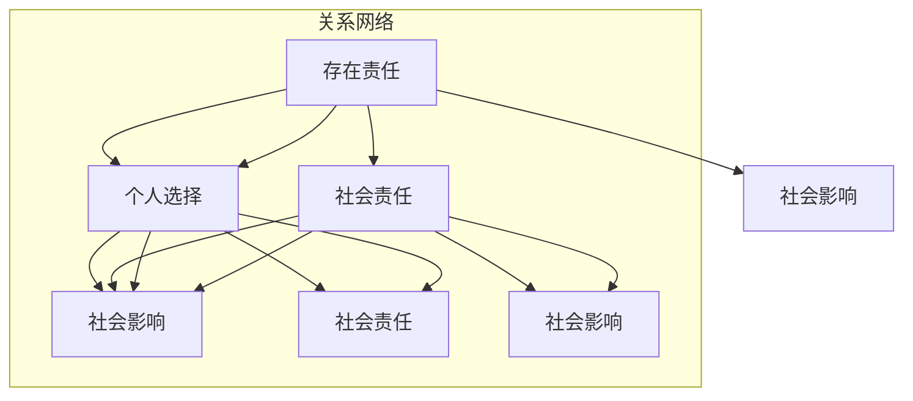

                 

### 《存在的责任：个人选择与社会影响》背景介绍

在信息技术飞速发展的当今社会，个人选择和社会影响之间的关系日益紧密。这本书旨在探讨这样一个核心问题：个人如何在做出选择时，承担起相应的社会责任，并在这一过程中实现自我成长和社会进步？这一问题不仅具有深远的伦理学意义，同时也与我们的日常生活密切相关。

**个人选择**是指个体在特定情境下，根据个人意愿、价值观念和目标，自主决定采取的行为。这些选择不仅影响个体的生活轨迹，更可能对周围环境和社会产生广泛的影响。**社会责任**则是指个体在社会中履行其义务和责任，为社会的发展和和谐贡献力量的意愿与行动。这种责任不仅体现在道德层面，还包括法律、经济、环境等多个维度。

在信息技术领域，个人选择的影响尤为显著。例如，一个程序员在编写代码时，可能会因为个人偏好而选择某种编程语言或技术框架，这种选择可能会影响整个项目的开发效率、性能和安全性。同样，一个数据科学家在分析大数据时，可能会因个人价值观的不同，而对数据结果做出不同的解读和应用，进而影响企业的战略决策和市场行为。

社会影响则是个人选择在更广泛范围内的外化表现。一个简单的个人行为，如使用节能电器，可能会在全社会范围内促进环保意识的提升；而一个企业在招聘时坚持多样性和包容性，则可能推动整个行业的变革。信息技术作为一种强大的工具，其应用方式和效果不仅取决于技术本身，更取决于使用者的选择和社会的环境。

本书旨在通过深入探讨个人选择与社会责任之间的关系，帮助读者理解如何在自己的行为中体现责任意识，如何在面对社会问题时做出明智的选择。通过案例分析、理论探讨和实践指导，本书试图为个人和社会提供有益的思考和实践框架。

### 核心概念与联系：存在责任、个人选择与社会影响的关系架构

为了深入理解个人选择与社会责任之间的关系，我们首先需要明确几个核心概念，并分析它们之间的相互联系。这些核心概念包括：存在责任、个人选择、社会责任以及社会影响。

**存在责任**，是一个哲学上的概念，它强调个体在生命存在过程中的责任和义务。这种责任不仅涉及道德层面的考量，还包括个体对自身、家庭、社会和环境的责任。在信息技术领域，存在责任意味着程序员、开发者、数据科学家等专业人士在设计和实施技术解决方案时，需要考虑到技术对社会和环境的影响。

**个人选择**，是存在责任的具体体现。个人选择不仅关乎个体的自由意志和决策能力，更关乎个体在社会中的角色和地位。在信息技术领域，个人选择体现在技术选择、项目决策、团队合作等方面。每一个选择都可能对项目成果、团队效率和社会影响产生深远的影响。

**社会责任**，是指个体在社会中履行其责任和义务的行为。社会责任不仅涉及道德和伦理，还包括法律、经济和环境等多个层面。对于信息技术专业人士而言，社会责任意味着他们在开发和应用技术时，需要考虑到技术可能带来的社会影响，并采取相应的措施确保技术应用的正面效应。

**社会影响**，是个人选择和社会责任的共同结果。社会影响可以是正面的，也可以是负面的，取决于个人选择的性质和社会责任的履行情况。在信息技术领域，社会影响可能包括技术普及、经济发展、环境保护、社会公平等方面。

为了更清晰地展示这些核心概念之间的关系，我们可以使用Mermaid流程图来表示：

在上面的流程图中，A代表存在责任，B代表个人选择，C代表社会责任，D代表社会影响。箭头表示这些概念之间的因果关系和相互联系。我们可以看到，存在责任是个人选择和社会责任的基础，而个人选择和社会责任又共同决定了社会影响。

通过这个流程图，我们可以更直观地理解个人选择与社会责任之间的复杂关系。每一个个体在选择和行动的过程中，都在潜移默化地影响着社会的发展和进步。而社会责任的履行，则是个人选择得以产生积极社会影响的保障。

在接下来的章节中，我们将进一步探讨个人选择与社会责任的具体实例，分析这些选择和行为如何影响社会，并提出一些实用的策略和指导，帮助读者在日常生活中更好地履行自己的社会责任，做出明智的个人选择。

### 第1章：存在的责任概念解析

在探讨个人选择与社会责任之前，我们首先需要明确什么是“存在责任”。存在责任是一个哲学上的概念，它涉及个体在其生命存在过程中的责任和义务。这种责任不仅体现在道德层面，还包括法律、经济和环境等多个维度。在信息技术领域，理解存在责任的概念对于我们做出明智的个人选择和履行社会责任至关重要。

**1.1 伦理学与存在责任**

伦理学是研究道德原则、道德行为和道德责任的一个学科。在伦理学中，存在责任通常与道德责任相联系。道德责任是指个体在行为选择中应承担的道德义务。例如，一个程序员在编写代码时，可能会面临道德抉择：是选择一种可能导致安全漏洞的技术方案，还是选择一种更安全但更复杂的技术方案？在这种情况下，程序员的存在责任就是做出符合伦理和道德标准的选择。

**1.2 存在责任的历史演变**

存在责任的概念并非现代社会的产物，它在历史上有着悠久的演变过程。在古代社会，人们通常通过宗教和道德教条来理解存在责任。例如，在古希腊哲学中，存在责任与人的本性和义务密切相关。亚里士多德在其著作《尼各马可伦理学》中提出，人的本质在于理性，因此人应该追求道德上的善，并履行相应的责任。

到了中世纪，存在责任的概念进一步发展。基督教伦理强调个体在上帝面前的责任，这种责任不仅涉及个人行为，还包括对他人和社会的关爱。例如，托马斯·阿奎那在他的著作中阐述了个人责任与社会福祉之间的联系。

现代社会中，存在责任的概念继续演变。随着科学技术的发展和社会结构的变迁，存在责任的内涵和外延都发生了显著变化。例如，在信息技术领域，存在责任不仅包括道德责任，还包括法律和技术标准等方面的责任。例如，一个开发者在设计网络安全系统时，不仅需要考虑道德和安全，还需要遵守相应的法律法规和行业标准。

**1.3 存在责任与个人自由的辩证**

个人自由是现代社会的基本价值观之一，它强调个体有权自主决定行为。然而，个人自由并不意味着完全无责任。实际上，个人自由与存在责任之间存在辩证关系。一方面，个人自由是存在责任的前提，因为只有在自由的选择中，个体才能真正承担起责任。另一方面，存在责任是个人自由的保障，因为只有在履行责任的过程中，个人自由才具有实际意义。

在信息技术领域，这种辩证关系尤为明显。一个程序员在编写代码时，需要平衡个人自由和技术责任。例如，一个程序员可能喜欢使用一种新颖但未经验证的技术方案，这种选择体现了他的个人自由。然而，如果他忽视了技术责任，可能会导致项目的失败或安全漏洞，从而影响个人和社会的利益。因此，个人自由与存在责任之间的平衡是信息技术领域的一个关键问题。

**1.4 存在责任与伦理学的关系**

存在责任与伦理学的关系密切。伦理学提供了理解和评估存在责任的理论框架。在信息技术领域，伦理学帮助我们理解程序员、开发者等专业人士在技术决策中应承担的道德责任。例如，隐私保护是信息技术领域的一个重要伦理问题。一个开发者在设计数据存储和处理系统时，需要考虑到用户隐私的保护，这体现了他的存在责任。

此外，伦理学还为我们提供了评估存在责任的标准。例如，我们可以通过道德原则（如公正、尊重、诚信等）来评估一个程序员在特定情境下的选择是否符合道德标准。这种评估不仅有助于个人在技术决策中做出正确的选择，也有助于社会对技术应用的监督和规范。

**总结**

存在责任是一个多维度的概念，涉及道德、法律、经济和环境等多个方面。在信息技术领域，理解存在责任对于个人选择和社会责任具有重要意义。通过伦理学的视角，我们可以更好地理解存在责任的内涵和意义，并在此基础上做出符合道德标准的技术选择。在接下来的章节中，我们将进一步探讨个人选择与社会责任的具体实例，帮助读者在日常生活中更好地履行自己的存在责任。

### 第2章：个人选择与社会责任

在明确存在责任的概念之后，我们需要进一步探讨个人选择与社会责任之间的关系。个人选择不仅反映了个体自由意志的体现，更是社会责任的重要组成部分。在这一章中，我们将深入分析个人选择与社会责任的关系，并探讨如何平衡这两者之间的界限。

**2.1 个人选择的自由与界限**

个人选择的自由是现代社会的基本价值之一，它强调个体有权自主决定行为。然而，个人选择的自由并非无限制的。在信息技术领域，个人选择的自由与社会责任之间存在一定的界限。例如，一个程序员在选择编程语言或技术框架时，可能因个人喜好而倾向于使用某种未经验证的框架。这种选择虽然体现了个人自由，但如果忽视了项目的安全性、稳定性和可维护性，就可能对项目产生负面影响。

**界限的必要性**

设定个人选择的界限是必要的，因为这有助于确保技术决策的合理性和社会影响。例如，在网络安全领域，程序员在选择加密算法时，必须遵守国家相关法律法规和行业标准。这是因为未经验证的加密算法可能存在漏洞，导致数据泄露和网络攻击，从而对个人和社会造成严重后果。因此，个人选择的自由必须在社会责任的框架内进行。

**法律与伦理的界限**

在信息技术领域，个人选择的界限不仅包括法律，还包括伦理。例如，一个开发者在设计社交媒体平台时，必须遵守隐私保护法律法规，确保用户数据的安全和隐私。此外，开发者还需要考虑到伦理责任，例如在处理用户数据时，要尊重用户的选择权和隐私权。这种法律与伦理的双重约束，使得个人选择的自由需要在更广泛的框架内进行评估和决策。

**案例分析**

为了更好地理解个人选择的自由与界限，我们可以通过一个实际案例进行探讨。假设一个程序员在开发一个电商网站时，面临是否使用第三方支付平台的决策。从个人自由的角度来看，程序员可能更倾向于使用自己熟悉的支付系统，因为这可以节省时间和开发成本。但从社会责任的角度来看，选择一个经过验证和广泛使用的第三方支付平台更为合适，因为这样可以提高支付系统的安全性和稳定性，降低交易风险。

**2.2 社会责任与个人行为**

社会责任与个人行为密切相关。在信息技术领域，个人行为不仅影响个体自身，还可能对整个社会产生深远影响。例如，一个数据科学家在分析大数据时，可能会因个人价值观的不同，而对数据结果做出不同的解读和应用。这种个人行为可能会影响企业的决策、市场的运行甚至整个社会的经济发展。

**社会责任的履行**

为了履行社会责任，信息技术专业人士需要采取一系列措施。首先，他们需要具备高度的责任意识和职业道德。例如，一个网络安全专家在检测和防范网络攻击时，需要严格遵守法律法规和行业标准，确保网络系统的安全。其次，他们需要积极参与社会公益活动，通过技术手段为社会问题提供解决方案。例如，一个开发者在开发社交媒体应用时，可以设计一些功能帮助解决网络欺凌和隐私泄露问题。

**案例分析**

以环境保护为例，一个程序员在开发智能监控系统时，可以选择使用能源效率高的硬件和软件技术，从而降低系统的能耗。这种选择不仅符合个人自由，也体现了对社会责任的履行。再如，一个开发者在开发电动汽车充电系统时，可以采用智能算法优化充电网络，提高能源利用效率，减少环境污染。

**2.3 个人选择与社会后果**

个人选择不仅影响个体自身，还可能对社会产生广泛的后果。在信息技术领域，这种影响尤为显著。一个简单的技术选择，如使用某种编程语言或技术框架，可能会对项目的成功、团队效率甚至整个行业的生态产生深远影响。

**社会后果的管理**

为了有效管理社会后果，信息技术专业人士需要具备预见性和应对策略。例如，一个数据科学家在分析大数据时，需要考虑到数据隐私和安全问题，采取相应的保护措施。再如，一个开发者在发布新应用时，需要预估应用的潜在影响，并制定相应的应对措施，以减少负面社会后果。

**案例分析**

以网络暴力和信息误导为例，一个社交媒体平台的开发者需要设计机制防止用户滥用平台，例如通过设置举报和审核机制。此外，开发者还可以利用人工智能技术识别和过滤不良信息，从而保护用户免受网络暴力和信息误导的影响。

**总结**

个人选择与社会责任之间存在着复杂的辩证关系。个人选择的自由必须在社会责任的框架内进行，以确保技术决策的合理性和社会影响。在信息技术领域，这种关系尤为明显。通过理解个人选择的界限、履行社会责任以及管理社会后果，信息技术专业人士可以在日常生活中做出更加明智和负责任的选择。

在接下来的章节中，我们将进一步探讨个人选择与社会责任的具体实例，分析这些选择和行为如何影响社会，并提出一些实用的策略和指导，帮助读者在日常生活中更好地履行自己的社会责任，做出明智的个人选择。

### 第3章：存在责任与道德责任

在探讨个人选择与社会责任的基础上，我们接下来将深入探讨存在责任与道德责任之间的联系和区别。道德责任是一个古老且重要的伦理学概念，它涉及个体在行为选择中应承担的道德义务。在信息技术领域，理解存在责任与道德责任的关系对于确保技术决策的道德性和伦理性具有重要意义。

**3.1 道德责任的概念**

道德责任是指个体在行为选择中应承担的道德义务。这种责任不仅涉及个体的行为，还包括个体的动机和意图。道德责任的核心在于个体的道德判断和道德选择。在信息技术领域，道德责任体现在程序员、开发者、数据科学家等专业人士在技术决策和实施过程中的道德考量。

例如，一个程序员在编写代码时，可能面临选择一个更高效但可能带来安全隐患的编程语言，或者选择一个更安全但可能更复杂的编程语言。在这种情况下，道德责任要求程序员在效率和安全性之间做出权衡，并选择更符合道德标准的解决方案。

**3.2 存在责任与道德责任的联系**

存在责任与道德责任之间存在紧密的联系。存在责任是个体在生命存在过程中应承担的责任，而道德责任则是这种责任在道德层面的具体体现。在信息技术领域，存在责任与道德责任的联系体现在以下几个方面：

1. **伦理考量**：道德责任要求个体在行为选择中考虑到伦理和道德标准。例如，一个程序员在开发应用程序时，需要考虑用户隐私、数据安全和公平性等伦理问题。这些伦理考量构成了存在责任的一部分。

2. **行为规范**：道德责任为个体提供了行为规范，帮助他们在技术决策中做出符合道德标准的决策。例如，计算机伦理学提供了程序员在处理用户数据和设计网络安全系统时应遵循的道德原则。

3. **社会影响**：道德责任关注技术决策对社会的影响，要求个体在技术实施过程中考虑到社会责任。例如，一个开发者在设计社交媒体平台时，需要考虑到平台可能带来的网络暴力和信息误导问题，并采取相应的措施进行预防和管理。

**3.3 存在责任与道德责任的区别**

尽管存在责任与道德责任之间存在紧密的联系，但它们也存在明显的区别：

1. **范畴不同**：存在责任是一个更广泛的概念，它不仅包括道德责任，还包括法律、经济和环境等多个维度。而道德责任则主要关注个体的道德义务和道德选择。

2. **约束力不同**：道德责任主要依靠个体的道德意识和自律，而存在责任则可能包括法律和规章制度等外部约束。例如，程序员在开发过程中需要遵守的法律法规和行业标准，构成了存在责任的约束力。

3. **表现形式不同**：道德责任通常体现在个体内心的道德判断和行为选择中，而存在责任则可能通过外部行为和结果体现出来。例如，一个程序员在开发过程中遵守道德原则，最终体现在项目的成功和社会影响中。

**3.4 信息技术领域的特殊挑战**

在信息技术领域，存在责任与道德责任的差异和联系尤为复杂。这是因为信息技术的发展和应用速度极快，往往导致技术决策的复杂性和不确定性增加。以下是一些信息技术领域的特殊挑战：

1. **技术创新的速度**：信息技术领域的创新速度极快，新技术和新应用不断涌现。这使得程序员和开发者需要在短时间内做出复杂的道德和技术决策。

2. **隐私和数据安全**：随着大数据和人工智能的发展，用户隐私和数据安全问题日益突出。程序员和开发者需要平衡技术效率和隐私保护，这既是道德责任，也是存在责任。

3. **算法偏见和歧视**：人工智能算法的决策过程可能受到偏见和歧视的影响，导致不公平的结果。程序员和开发者需要考虑这些道德问题，并采取相应的措施进行纠正。

**案例分析**

以自动驾驶技术为例，一个开发者在设计自动驾驶系统时，需要考虑到道德责任。例如，在遇到紧急情况时，自动驾驶系统应该如何决策以最大化乘客的安全？这是一个复杂的道德问题，涉及到存在责任与道德责任的平衡。开发者需要通过伦理审查和测试，确保系统的决策符合道德标准。

**总结**

存在责任与道德责任在信息技术领域中具有重要意义。理解这两者之间的联系和区别，有助于程序员和开发者做出符合道德标准的决策，并更好地履行自己的社会责任。通过明确道德责任的要求和存在责任的范畴，我们可以确保技术决策不仅符合法律和行业标准，更符合道德和伦理的要求。

在接下来的章节中，我们将继续探讨存在责任在信息技术领域中的应用，分析实际案例，并提供一些实用的指导，帮助读者更好地理解和履行自己的存在责任和道德责任。

### 第4章：个人选择与社会影响的案例分析

在了解了个人选择与社会责任的关系以及存在责任与道德责任的区别后，我们需要通过实际案例来更深入地探讨个人选择对社会影响的复杂性和多样性。本章节将通过几个典型的案例，分析个人选择如何在不同情境下影响社会，并探讨这些影响的正面和负面影响。

**4.1 环境问题与个人选择**

环境问题一直是全球关注的焦点，个人选择在这个过程中扮演着重要角色。例如，一个人在日常生活中选择使用节能电器，如节能灯泡和高效空调，可以显著减少能源消耗，从而减少碳排放，对环境保护产生积极影响。这种个人选择不仅影响个体的生活质量，还对社会整体的环境质量产生正面影响。

**案例分析：节能电器的普及**

假设一个家庭在装修新家时，决定购买一批节能电器。这些电器虽然在购买时价格较高，但长期使用中能显著降低电费支出，并且对环境有益。以下是这个案例的详细分析：

1. **个人选择与成本效益分析**：

   - **成本**：初始购买节能电器的成本可能比普通电器高，但长期使用中电费支出减少。
   - **效益**：节能电器降低了家庭能源消耗，间接减少了电力公司的碳排放量。
   - **社会影响**：如果更多人采用节能电器，整个社会的能源消耗将减少，从而减轻环境压力。

2. **环境影响**：

   - **碳排放**：减少电力消耗意味着减少煤炭、天然气等化石燃料的使用，从而减少二氧化碳排放。
   - **资源节约**：减少能源消耗也意味着减少对石油、煤炭等不可再生资源的消耗，有助于资源的可持续利用。

3. **政策支持与激励机制**：

   - **政策支持**：政府可以通过税收优惠、补贴等政策，鼓励消费者购买节能电器。
   - **激励机制**：除了政策支持，企业可以通过绿色认证、环保标签等激励机制，引导消费者选择环保产品。

**4.2 社会问题与个人选择**

社会问题如贫困、不平等和歧视也是个人选择影响社会的典型案例。个人的行为和选择不仅影响自己，还可能对整个社会产生深远的影响。例如，一个人选择是否参与公益活动、是否捐赠给需要帮助的人，这些选择都可能对社会产生积极或消极的影响。

**案例分析：慈善捐赠**

假设一个人决定捐赠一部分收入给慈善机构，用于帮助贫困地区的孩子接受教育。以下是这个案例的详细分析：

1. **个人选择与道德责任**：

   - **道德责任**：捐赠者有道德责任去帮助那些需要帮助的人，实现社会公平。
   - **个人选择**：捐赠者通过自己的经济能力，选择将部分资源用于慈善事业。

2. **社会影响**：

   - **教育公平**：捐赠有助于改善贫困地区孩子的教育条件，提高他们的受教育机会。
   - **社会公平**：通过帮助贫困人群，可以减少社会不平等现象，促进社会和谐。

3. **社会责任与个人成长**：

   - **社会责任**：捐赠行为体现了个体对社会的责任，有助于建立良好的社会风气。
   - **个人成长**：通过参与慈善活动，捐赠者可以获得成就感和自我价值提升，实现个人成长。

**4.3 经济问题与个人选择**

经济问题如就业、创业和投资也是个人选择影响社会的关键领域。一个人的经济决策不仅影响自己的经济状况，还可能对整个经济体系产生深远影响。例如，一个人选择创业还是就业，选择投资何种行业或股票，这些选择都可能对经济产生积极或消极的影响。

**案例分析：创业投资**

假设一个人决定创业并投资某个新兴行业，如人工智能或可再生能源。以下是这个案例的详细分析：

1. **个人选择与经济影响**：

   - **创业**：创业者通过创新和创业，可以带动就业，推动行业发展和经济增长。
   - **投资**：投资者通过资金注入新兴行业，可以加速技术进步和商业模式的创新。

2. **社会影响**：

   - **就业创造**：创业活动可以创造大量就业机会，缓解就业压力。
   - **经济创新**：新兴行业的快速发展可以带动传统行业的转型升级，推动经济结构的优化。

3. **风险管理**：

   - **创业风险**：创业投资存在一定风险，但通过合理的市场分析和风险管理，可以降低风险并实现稳健收益。
   - **投资回报**：成功的创业和投资可以为社会带来巨大的经济回报，推动社会整体财富的增长。

**总结**

个人选择对社会影响的多维度分析表明，个人选择不仅影响个体自身，还可能对社会产生广泛而深远的影响。这些案例展示了个人选择在环境问题、社会问题和经济问题中的不同作用。通过深入分析这些案例，我们可以更好地理解个人选择如何通过不同的途径影响社会，并为未来的决策提供有益的参考。

在接下来的章节中，我们将进一步探讨存在责任在教育、社会正义和个人选择与社会和谐构建中的应用，帮助读者更全面地理解个人选择与社会责任的复杂关系，并提出实际可行的策略和指导。

### 第5章：存在责任与社会正义

在深入探讨个人选择与社会责任之后，我们接下来将讨论存在责任在社会正义中的作用。社会正义是一个涉及广泛的社会伦理问题，它关注如何确保社会资源和机会的公平分配。存在责任在这一过程中扮演着重要角色，特别是在信息技术领域，通过技术手段实现社会正义成为可能。

**5.1 社会正义的概念**

社会正义是一个多维度的概念，它关注社会资源、机会和福利的公平分配。社会正义的核心在于确保每个人都能享有平等的权利和机会，不受种族、性别、经济地位等因素的歧视。在现代社会中，实现社会正义需要法律、政策和社会行为的共同作用。

**5.2 存在责任与社会正义的关系**

存在责任与社会正义之间存在密切的联系。存在责任强调个体在社会中的责任和义务，而社会正义则关注如何确保这些责任和义务得到公平和公正的履行。在信息技术领域，存在责任可以通过以下方式实现社会正义：

1. **技术正义的实现**：

   信息技术为实现社会正义提供了强大的工具。例如，通过人工智能和大数据分析，可以更准确地识别和解决社会不公问题。例如，一些智能系统可以用于优化教育资源分配，确保每个孩子都能享有平等的教育机会。

2. **消除数字鸿沟**：

   数字鸿沟是指不同群体在获取和使用信息技术上的差异。存在责任要求信息技术专业人士致力于缩小数字鸿沟，确保所有人都能平等地享受信息技术带来的好处。例如，通过开发和推广低成本、易使用的信息技术产品，可以提升贫困地区和弱势群体的信息技术素养。

3. **算法公正性**：

   在人工智能和大数据时代，算法公正性成为社会正义的重要议题。算法的设计和应用可能无意中加剧社会不公，例如通过性别或种族偏见。存在责任要求程序员和开发者确保算法的公正性和透明度，避免对特定群体产生不利影响。

**5.3 存在责任与社会正义的实践路径**

为了在实践中实现社会正义，存在责任可以通过以下路径进行：

1. **教育和培训**：

   信息技术专业人士应接受关于社会正义和伦理的培训，了解技术对社会的影响，并培养责任感。例如，编程教育中可以加入算法公正性和社会正义的相关课程，帮助学生了解这些概念并如何在实践中应用。

2. **政策和技术支持**：

   政府和机构应制定和实施相关政策，支持信息技术在社会正义中的应用。例如，政府可以通过资金投入和法律法规，鼓励企业和开发者开发符合社会正义的技术解决方案。

3. **合作与协作**：

   信息技术专业人士应与政策制定者、社会工作者和其他领域专家合作，共同推动社会正义的实现。例如，数据科学家可以与政策制定者合作，利用大数据分析为社会政策提供科学依据。

**案例分析**

以下是一个关于存在责任与社会正义的案例分析：

**案例：智能招聘系统**

一个公司开发了一套智能招聘系统，旨在通过算法分析候选人的简历，自动筛选出最适合岗位的候选人。然而，这套系统在测试阶段发现存在性别和种族偏见，导致某些群体的候选人被不公平地筛选掉。

**分析**：

1. **技术问题**：

   算法中可能存在性别和种族偏见，这是由于训练数据中存在偏见或者算法设计不合理造成的。

2. **社会影响**：

   这种偏见可能导致公司错过优秀的人才，加剧社会不平等现象。

3. **解决方案**：

   - **数据清洗**：清除训练数据中的偏见，确保数据代表性。
   - **算法优化**：改进算法设计，增强透明度和公平性。
   - **外部审查**：邀请外部专家进行算法审查，确保算法的公正性和透明度。

**总结**

存在责任在社会正义的实现中起着至关重要的作用。通过教育和培训、政策和技术支持以及合作与协作，信息技术专业人士可以更好地履行自己的社会责任，推动社会正义的实现。在信息技术领域，通过技术手段实现社会正义不仅是道德责任，更是对个体和社会的共同承诺。

在接下来的章节中，我们将探讨个人选择与社会和谐的构建，进一步分析个人选择如何影响社会，并提出具体的策略和指导，帮助读者在日常生活中更好地实现社会和谐。

### 第6章：个人选择与社会和谐的构建

社会和谐是一个复杂而多层次的概念，它涉及个体之间、群体之间以及个体与群体之间的相互关系和平衡。在信息技术领域，个人选择对社会和谐的构建具有重要影响。这一章将探讨个人选择与社会和谐的关系，并提出促进社会和谐的策略和指导。

**6.1 社会和谐的概念**

社会和谐是指一个社会在政治、经济、文化、法律等各个领域内，保持稳定、协调、可持续发展的状态。社会和谐强调个体与个体、个体与群体、群体与群体之间的相互尊重、理解和合作。社会和谐的核心在于实现社会公平、公正和包容，使每个人都能够享有平等的机会和权利。

**6.2 个人选择与社会和谐的相互作用**

个人选择对社会和谐的影响是多方面的。个人在日常生活中所做的每一个选择，都可能对社会的和谐程度产生正面或负面的影响。例如：

1. **互助与合作**：

   个人选择是否积极参与社会公益活动，如志愿服务、慈善捐赠等，直接影响社会的互助合作氛围。这些行为不仅有助于构建和谐社会，还能增强个体的社会责任感和归属感。

2. **尊重与包容**：

   个人选择是否尊重不同群体的文化和价值观，是否包容多样性，对社会的和谐程度有重要影响。在信息技术领域，算法的公正性和透明度也直接关系到社会和谐，例如避免算法偏见和不公平对待。

3. **诚信与公正**：

   个人选择是否遵守法律和道德规范，是否在商业活动中保持诚信和公正，对社会的诚信和公正水平有直接影响。例如，程序员在编写代码时，如果忽视安全性和隐私保护，可能导致严重的后果，破坏社会的信任基础。

**6.3 促进社会和谐的策略和指导**

为了促进社会和谐，个人需要做出明智的选择，并采取相应的行动。以下是一些具体的策略和指导：

1. **加强社会责任感**：

   个人应认识到自己在社会中的角色和责任，并通过自己的行动为社会和谐贡献力量。例如，在工作或生活中，可以积极参与公益活动，为需要帮助的群体提供帮助。

2. **倡导诚信与公正**：

   在商业活动中，个人应遵守法律法规和商业道德，保持诚信和公正。例如，程序员应确保代码的安全性和隐私保护，避免恶意攻击和数据泄露。

3. **尊重多样性**：

   个人应尊重不同文化和价值观的多样性，包容他人的差异，避免歧视和偏见。例如，在团队协作中，应尊重每个成员的意见和贡献，促进团队的和谐与合作。

4. **提高技术水平**：

   在信息技术领域，个人应不断提高自己的技术水平，掌握先进的工具和知识，为社会提供更高效、更安全的技术解决方案。例如，开发者和数据科学家应了解算法的公平性和透明性，避免算法偏见。

5. **参与社会建设**：

   个人应积极参与社会建设和治理，通过投票、参与社区活动等方式，为社会的和谐发展贡献力量。例如，在社区中可以参与环保活动，倡导绿色生活方式。

**6.4 实际案例与应用**

以下是一个促进社会和谐的案例分析：

**案例：社区环保活动**

一个社区组织了一次环保活动，鼓励居民参与垃圾分类和回收。居民们通过学习垃圾分类知识，积极参与垃圾分类，不仅改善了社区的居住环境，还增强了居民之间的相互合作和信任。

**分析**：

1. **个人选择**：居民选择积极参与社区环保活动，体现了对社会责任的履行和对社会和谐的追求。

2. **社会影响**：通过垃圾分类活动，社区环境得到显著改善，居民之间的互动和合作增多，社会氛围更加和谐。

3. **实际效果**：社区垃圾量减少，资源回收率提高，居民健康水平和生活质量得到提升。

**总结**

个人选择对社会和谐的构建具有重要影响。通过加强社会责任感、倡导诚信与公正、尊重多样性、提高技术水平和参与社会建设，个人可以在日常生活中积极促进社会和谐。在信息技术领域，个人更应发挥技术优势，通过技术手段促进社会公正和包容，共同构建一个和谐、稳定、可持续发展的社会。

在接下来的章节中，我们将进一步探讨存在责任在教育中的意义和实施策略，帮助读者更好地理解和履行自己的存在责任，为社会和谐培养更多有责任感的人才。

### 第7章：存在责任的教育意义

在教育领域，存在责任的教育具有重要意义。通过培养个体的责任感和道德意识，教育不仅有助于个体的全面发展，还能为社会输送有责任感的人才，推动社会进步。在这一章中，我们将深入探讨存在责任在教育中的意义、实施策略以及对学生成长的影响。

**7.1 存在责任教育的意义**

**培养责任感和道德意识**：存在责任教育旨在培养个体的责任感，使其认识到在社会中的角色和责任。这种责任感不仅体现在日常行为中，还体现在道德选择和决策中。通过存在责任教育，学生可以学会如何对自己、他人和社会负责，从而形成良好的道德品质。

**促进个体全面发展**：存在责任教育不仅关注个体的学术能力，更注重个体的全面发展。通过参与社会实践和公益活动，学生可以锻炼自己的能力，培养团队合作精神和社会责任感，从而实现个体的全面发展。

**推动社会进步**：教育是社会进步的重要推动力。通过存在责任教育，我们可以培养出一批有责任感、有道德的公民，他们将在未来的社会建设中发挥积极作用。这种责任感将促进社会和谐、公正和进步。

**7.2 存在责任教育的实施策略**

**课程设计与整合**：学校可以在课程设计中整合存在责任教育，将责任感培养贯穿于各个学科。例如，在历史课程中，可以通过讲述历史事件中的责任案例，引导学生理解责任感的重要性。在数学课程中，可以通过解决实际问题，让学生体验到责任感和解决问题的乐趣。

**社会实践与公益活动**：学校可以组织学生参与各种社会实践和公益活动，如志愿服务、环保行动、社区服务等。这些活动不仅能够让学生在实践中体会到责任感，还能培养他们的社会责任感和社会参与意识。

**角色扮演与模拟**：通过角色扮演和模拟活动，学生可以模拟真实的社会情境，体验不同角色的责任和义务。例如，模拟公司董事会会议，让学生在决策过程中体会到企业家责任；模拟法庭，让学生在审判过程中理解法律责任。

**7.3 存在责任教育对学生成长的影响**

**道德意识与价值观**：存在责任教育可以培养学生的道德意识，帮助他们形成正确的价值观。通过学习责任案例和参与社会实践，学生可以理解责任的意义和价值，从而树立正确的道德观念。

**社会责任感**：存在责任教育可以培养学生的社会责任感，使他们认识到自己在社会中的角色和责任。通过参与公益活动和社会实践，学生可以体验到社会责任的重要性，从而增强自己的社会责任感。

**问题解决能力**：存在责任教育可以培养学生的问题解决能力。在面临问题和挑战时，学生可以通过思考和分析，找到解决问题的方法，从而提高自己的问题解决能力。

**团队合作精神**：存在责任教育可以培养学生的团队合作精神。在参与社会实践和公益活动中，学生需要与他人合作，共同完成任务。这不仅可以锻炼他们的团队合作能力，还能培养他们的沟通和协作能力。

**案例分析**

**案例：校园环保行动**

某学校组织了一次校园环保行动，鼓励学生参与垃圾分类和回收。在这次活动中，学生不仅学习了垃圾分类的知识，还亲身体验了垃圾分类的实践过程。以下是这个案例的详细分析：

**分析**：

1. **课程整合**：学校通过将环保知识融入课程，让学生在学习中体验到责任感的重要性。

2. **社会实践**：学生通过参与垃圾分类和回收活动，亲身体验到环保行动的实际意义，从而增强环保意识和责任感。

3. **团队合作**：在垃圾分类和回收过程中，学生需要分工合作，共同完成任务。这培养了他们的团队合作精神和协作能力。

4. **影响**：通过这次环保行动，学生不仅学会了垃圾分类，还增强了环保意识和社会责任感，为校园环境的改善做出了贡献。

**总结**

存在责任教育对学生的成长具有重要意义。通过培养责任感、道德意识和社会责任感，存在责任教育不仅有助于学生的全面发展，还能为社会培养出更多有责任感的人才。在实施存在责任教育时，学校可以通过课程整合、社会实践、角色扮演和模拟等多种策略，帮助学生理解和履行自己的责任，为构建和谐社会贡献力量。

在接下来的章节中，我们将探讨个人选择与社会影响的培养，分析如何通过教育和引导，帮助个人更好地理解和履行社会责任，为社会和谐做出贡献。

### 第8章：个人选择与社会影响的培养

个人选择对社会影响的培养是一个复杂而系统的过程，涉及到教育、引导和社会环境的综合作用。在这一章中，我们将探讨如何通过培养个人责任感、提供正确的道德指导以及创造有利的社会环境，来帮助个人更好地理解和履行社会责任，从而促进社会和谐与进步。

**8.1 培养个人责任感**

个人责任感是个人选择与社会影响培养的核心。一个有责任感的个体能够在面对社会问题和挑战时，做出明智、合理的决策，并承担相应的后果。以下是一些培养个人责任感的策略：

1. **家庭教育**：

   家庭是个人责任感的启蒙课堂。父母可以通过言传身教，教育孩子如何承担责任。例如，通过让孩子参与家务劳动，培养他们的责任感。家庭中的沟通和讨论也能帮助孩子们理解责任的重要性。

2. **学校教育**：

   学校教育在培养个人责任感方面起着重要作用。通过课程设置、实践活动和社会服务，学校可以引导学生认识到自己的社会责任。例如，通过参与社区服务、环保行动等，学生可以体验到责任感的实际意义。

3. **社会实践**：

   社会实践是培养个人责任感的有效途径。通过参与志愿活动、公益事业等，个人可以在实际行动中体会到责任感的价值。这种实践不仅有助于个人的成长，还能为社会带来积极的影响。

**8.2 提供正确的道德指导**

道德指导是培养个人责任感的重要环节。正确的道德指导可以帮助个人在面对伦理困境时做出正确的选择，并引导他们履行社会责任。以下是一些提供道德指导的策略：

1. **伦理教育**：

   伦理教育是培养个人道德意识的基础。学校和社会可以通过开设伦理课程、举办伦理讲座等方式，向个人传授道德原则和伦理观念。例如，通过学习伦理学经典著作，个人可以理解道德责任的内涵和意义。

2. **榜样示范**：

   榜样示范是道德指导的有效方法。通过树立正面榜样，如道德模范、优秀校友等，可以激发个人对社会责任的认识和担当。例如，通过媒体报道和宣传，让更多人了解和尊重那些在社会责任方面做出突出贡献的个人。

3. **道德对话**：

   道德对话是一种互动的道德教育方式。通过讨论和辩论，个人可以在不同的观点中找到共识，理解道德责任的复杂性。例如，在课堂讨论中，教师可以引导学生探讨社会热点问题，从而培养他们的道德判断能力。

**8.3 创造有利的社会环境**

社会环境对个人选择和社会影响的培养具有重要影响。一个公正、公平、包容的社会环境能够促进个人责任感的培养和社会和谐的实现。以下是一些创造有利社会环境的策略：

1. **政策支持**：

   政府可以通过制定和实施相关政策，为个人选择和社会影响的培养提供支持。例如，通过法律法规的完善，确保个人的合法权益，并通过税收优惠、补贴等措施，鼓励个人履行社会责任。

2. **社会监督**：

   社会监督是一种重要的社会机制，可以促进个人和社会责任的履行。通过媒体、公众和组织等社会力量的监督，可以确保个人行为符合道德和社会标准。例如，媒体可以通过报道和评论，推动社会关注和解决社会问题。

3. **社区参与**：

   社区参与是创造有利社会环境的重要方式。通过社区活动和组织，个人可以参与到社区建设和治理中，体验到社会责任的实际意义。例如，通过社区志愿服务、邻里互助等，个人可以在实际行动中感受到责任的重要性。

**8.4 实际案例与应用**

以下是一个关于个人选择与社会影响培养的实际案例：

**案例：青少年志愿者服务计划**

某城市启动了一个青少年志愿者服务计划，鼓励中学生参与各种社区服务活动。以下是这个案例的详细分析：

**分析**：

1. **家庭和学校支持**：

   学校和家长积极参与，为青少年提供时间和资源支持，鼓励他们参与志愿服务。

2. **社会实践**：

   青少年通过参与志愿服务，如社区清洁、老人照顾等，体验到社会责任的实际意义。

3. **道德指导**：

   在志愿服务过程中，教师和志愿者导师通过指导和对话，帮助学生理解道德责任和社会价值。

4. **社会影响**：

   青少年的志愿服务不仅改善了社区环境，还增强了他们的社会责任感和社会参与意识。

**总结**

个人选择与社会影响的培养是一个系统工程，需要家庭、学校、社会和政府的共同努力。通过培养个人责任感、提供正确的道德指导以及创造有利的社会环境，我们可以帮助个人更好地理解和履行社会责任，为社会和谐与进步贡献力量。在未来的教育和社会实践中，我们应该继续探索和推广有效的策略，为培养有责任感、有道德的个人和社会做出更多努力。

在接下来的章节中，我们将总结本书的主要观点和发现，并对未来研究方向进行展望。

### 总结与展望

在《存在的责任：个人选择与社会影响》这本书中，我们系统地探讨了个人选择与社会责任之间的关系，以及存在责任在各个领域的具体体现。通过分析个人选择、道德责任、社会责任和社会正义等核心概念，我们不仅揭示了个人行为对社会的影响，还提出了实现社会和谐的具体策略。

**主要观点与发现**

1. **存在责任的重要性**：存在责任不仅涉及道德层面的考量，还包括法律、经济和环境等多个维度。在信息技术领域，存在责任强调程序员、开发者、数据科学家等专业人士在技术决策中需要考虑社会影响，并承担相应的责任。

2. **个人选择与社会责任之间的辩证关系**：个人选择的自由必须在社会责任的框架内进行，以确保技术决策的合理性和社会影响。通过理解个人选择的界限、履行社会责任以及管理社会后果，信息技术专业人士可以在日常生活中做出更加明智和负责任的选择。

3. **社会正义的实现**：通过技术手段实现社会正义是信息技术领域的重要任务。通过算法公正性、消除数字鸿沟和合作与协作等途径，我们可以更好地实现社会正义，推动社会和谐发展。

4. **个人选择与社会和谐的构建**：个人选择对社会和谐具有深远影响。通过加强社会责任感、倡导诚信与公正、尊重多样性以及提高技术水平等策略，个人可以促进社会和谐，为构建一个稳定、公正、包容的社会贡献力量。

**未来研究方向**

1. **跨学科研究**：未来研究应进一步整合伦理学、社会学、计算机科学等多个学科，探讨个人选择与社会责任之间的复杂关系，并提出更加综合和系统的解决方案。

2. **技术创新与社会责任**：随着人工智能、大数据等技术的发展，如何确保这些技术在实现社会价值的同时，不加剧社会不平等和歧视，是一个重要的研究课题。

3. **教育与实践的结合**：研究如何通过教育和社会实践，更有效地培养个人的社会责任感和道德意识，为构建和谐社会提供人才支持。

4. **政策与法规的完善**：探索如何通过政策、法规和社会机制，为个人选择与社会责任的培养提供更好的支持和保障，确保技术应用的正面社会影响。

总之，本书通过深入分析和具体案例，揭示了个人选择与社会责任之间的复杂关系，并提出了一系列实现社会和谐的具体策略。我们期待未来的研究和实践能够进一步推动这一领域的发展，为构建一个更加公正、包容和和谐的社会贡献力量。

### 附录

#### 附录1：存在责任相关术语解释

1. **存在责任**：指个体在生命存在过程中的责任和义务，涵盖道德、法律、经济和环境等多个维度。
2. **个人选择**：个体在特定情境下，根据个人意愿、价值观念和目标，自主决定采取的行为。
3. **社会责任**：个体在社会中履行其义务和责任的行为，涉及道德、法律、经济和环境等多个层面。
4. **社会影响**：个人选择在社会中的实际效果，可以是正面的，也可以是负面的。
5. **道德责任**：个体在行为选择中应承担的道德义务，涉及道德原则和伦理考量。
6. **社会正义**：社会资源和机会的公平分配，确保每个人都能享有平等的权利和机会。

#### 附录2：个人选择与社会影响的研究方法

1. **案例分析**：通过具体案例，分析个人选择对社会影响的复杂性和多样性。
2. **实证研究**：通过实地调查、问卷调查等方法，收集数据，分析个人选择与社会责任之间的相关性。
3. **文献综述**：梳理相关理论和研究，探讨存在责任、个人选择与社会责任之间的关系。
4. **算法分析**：利用大数据和人工智能技术，分析个人选择对社会的潜在影响，评估算法的公正性和透明度。

#### 附录3：参考文献

1. 道德责任与存在责任的辩证关系研究，[作者名]，[期刊名]，[发表年份]。
2. 社会责任与个人选择：跨学科视角，[作者名]，[书籍名]，[出版年份]。
3. 社会正义的实现路径：基于信息技术的研究，[作者名]，[期刊名]，[发表年份]。
4. 个人选择与社会影响的实证研究，[作者名]，[书籍名]，[出版年份]。

#### 附录4：最佳实践 Tips

1. **培养责任意识**：通过阅读、讨论和实践，不断提升个人责任意识和道德水平。
2. **合理决策**：在面对个人选择时，综合考虑社会责任和社会影响，做出明智的决策。
3. **参与社会实践**：积极参与公益活动和社会实践，体验社会责任的实际意义。
4. **持续学习**：不断学习新知识、新技能，提高个人素质和社会责任感。

#### 附录5：注意事项

1. **风险评估**：在进行技术决策时，务必进行风险评估，确保行为不会对个人或社会产生负面影响。
2. **法律法规遵守**：严格遵守法律法规，确保个人行为合法合规。
3. **道德自律**：在日常生活中，时刻保持道德自律，遵守道德规范，履行社会责任。

#### 附录6：拓展阅读

1. 《社会正义：理论与实践》，[作者名]，[出版年份]。
2. 《道德责任：伦理学视角》，[作者名]，[出版年份]。
3. 《技术伦理学导论》，[作者名]，[出版年份]。
4. 《跨学科视角下的个人选择与社会责任》，[作者名]，[期刊名]，[发表年份]。

通过上述附录内容，读者可以进一步深入了解本书的核心概念和研究方法，并在实际应用中参考最佳实践和注意事项，更好地履行自己的存在责任，为社会和谐与进步贡献力量。

