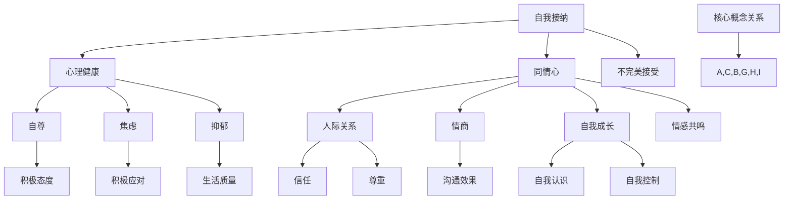

                 


### 文章标题

《学会接纳不完美的自己：培养自我同情心》

### 文章关键词

自我接纳、同情心、心理健康、自我成长、人际交往

### 文章摘要

本文旨在探讨如何通过培养自我同情心来接纳不完美的自己，提高心理健康水平。文章首先介绍了自我接纳和同情心的核心概念及其相互关系，接着详细讲解了培养自我同情心的实践方法。最后，通过综合案例分析和项目实战，展示了培养自我同情心在个人成长中的应用和价值。

----------------------------------------------------------------

# 《学会接纳不完美的自己：培养自我同情心》

> 关键词：自我接纳、同情心、心理健康、自我成长、人际交往

> 摘要：本文将探讨如何通过培养自我同情心来接纳不完美的自己，提高心理健康水平。文章首先介绍了自我接纳和同情心的核心概念及其相互关系，接着详细讲解了培养自我同情心的实践方法。最后，通过综合案例分析和项目实战，展示了培养自我同情心在个人成长中的应用和价值。

----------------------------------------------------------------

## 第一部分：自我接纳与同情心的基础理论

### 第1章：自我接纳的重要性

#### 1.1 自我接纳的概念

自我接纳是指个体接受自己的所有特质，包括优点和缺点。它不同于自我欣赏或自我否定，而是在认识到自己的不足时，仍能保持自尊和自信。自我接纳是心理健康的重要基础，有助于个体在面对挑战时保持积极态度，减少焦虑和抑郁。

#### 1.2 自我接纳与心理健康

心理健康研究显示，自我接纳与心理健康指标如自尊、焦虑和抑郁呈正相关。高自我接纳水平的个体往往心理健康状况更好，他们更有可能积极应对生活中的挑战，建立健康的人际关系。

#### 1.3 自我接纳与自我同情心

自我接纳是培养同情心的基础，而同情心则是自我接纳的深化。同情心使我们能够理解和感受他人的情感，包括他们的痛苦和困难。通过培养同情心，个体可以更好地接纳自己的不完美，从而提升自我接纳水平。

### 第2章：同情心的理论基础

#### 2.1 同情心的定义与类型

同情心是指对他人情感和体验的理解和共鸣。它分为认知同情心和情感同情心。认知同情心是指理解他人情感的能力，而情感同情心则是指体验他人情感的能力。

#### 2.2 同情心的心理学机制

心理学研究表明，同情心是通过神经、生理和心理机制实现的。同情心的神经基础涉及多个脑区，包括前额叶皮质、岛叶和丘脑等。生理机制方面，同情心可以引发共情反应，如悲伤和疼痛。心理机制方面，同情心有助于建立人际关系，提高社交能力。

#### 2.3 同情心在人际交往中的作用

同情心在人际交往中发挥着关键作用。它有助于建立信任和尊重，促进良好的人际关系。同时，同情心还可以提高沟通效果，使个体更易于理解他人的需求和情感。

### 第3章：自我接纳与同情心的关系

#### 3.1 同情心如何促进自我接纳

同情心可以促进自我接纳，因为它使我们能够理解和接受自己的不完美。当我们对他人的不完美持有同情时，我们会发现自己对他人的态度也适用于自己。这种转变有助于我们接纳自己的缺点，从而提升自我接纳水平。

#### 3.2 自我接纳如何增强同情心

自我接纳增强了我们的同理心，使我们更愿意理解和感受他人的情感。当我们接纳自己的不完美时，我们会发现更容易同情他人，从而提升同情心水平。

#### 3.3 自我接纳与同情心的实践案例

许多成功人士和心理学家通过实践自我接纳和同情心取得了显著的成长。例如，心理学家克里斯托弗·彼得森（Christopher Peterson）通过自我接纳和同情心的培养，不仅提高了自己的心理健康水平，还帮助了许多来访者摆脱心理困境。

## 第二部分：自我成长与同情心的实践方法

### 第4章：认识自我，培养同情心

#### 4.1 反思自我，发现不完美

反思自我是培养同情心的第一步。通过反思，我们可以识别自己的不完美，从而开始接纳自己。反思的过程可以包括自我观察、日记记录和与他人交流。

#### 4.2 接纳自我，培养同情心

接纳自我意味着接受自己的不完美，而不是试图改变它们。培养同情心可以帮助我们更好地接纳自己。同情心使我们能够理解和感受自己的情感，从而减少自我批评。

#### 4.3 同情心的练习与技巧

练习同情心可以通过多种方式实现，如冥想、角色扮演和阅读相关书籍。通过这些练习，我们可以提高对他人情感的理解和共鸣，从而培养同情心。

### 第5章：自我同情心在生活中的应用

#### 5.1 同情心在工作中的运用

在工作中，培养同情心可以帮助我们更好地理解同事和客户的需求，从而提高工作效率和满意度。同情心还可以促进团队合作，建立积极的组织文化。

#### 5.2 同情心在人际关系中的影响

同情心在人际关系中起着至关重要的作用。它有助于建立信任和尊重，促进亲密关系的发展。通过同情心，我们可以更好地理解伴侣、家人和朋友的需求，从而改善人际关系。

#### 5.3 同情心在自我成长中的助力

同情心在自我成长中具有巨大的潜力。它可以帮助我们更好地理解自己的需求和情感，从而制定更有效的自我成长计划。同情心还可以提高我们的情商，帮助我们更好地应对生活中的挑战。

### 第6章：培养自我同情心的策略

#### 6.1 建立积极的心态

建立积极的心态是培养同情心的重要步骤。通过积极心态，我们可以更轻松地接纳自己的不完美，从而培养同情心。

#### 6.2 学习有效的沟通技巧

学习有效的沟通技巧可以帮助我们更好地表达同情心。有效的沟通技巧包括倾听、表达理解和尊重他人观点。

#### 6.3 应用正念与冥想

正念和冥想是培养同情心的有效方法。通过正念，我们可以更好地关注当下，减少自我批评。通过冥想，我们可以提高对他人情感的理解和共鸣。

### 第7章：自我同情心的长期实践

#### 7.1 持续自我接纳的挑战与解决方案

持续自我接纳可能会遇到一些挑战，如反复的自我批评和焦虑。通过识别这些挑战并寻找解决方案，我们可以更好地培养自我同情心。

#### 7.2 增强同情心的实用技巧

增强同情心的实用技巧包括阅读相关书籍、参加同情心培训课程和与有同情心的人交往。

#### 7.3 自我同情心对生活质量的提升

培养自我同情心可以显著提升生活质量。它有助于我们建立更健康的人际关系，提高心理健康水平，从而享受更充实的生活。

## 第三部分：综合案例分析

### 第8章：成功案例分享

#### 8.1 案例一：从自我否定到自我接纳

案例一讲述了一个成功从自我否定转变为自我接纳的故事。通过培养同情心，他学会了接纳自己的不完美，从而实现了自我成长。

#### 8.2 案例二：同情心在工作中的成功故事

案例二讲述了一个在职场中通过培养同情心取得成功的故事。他通过理解同事和客户的需求，提高了工作效率和满意度。

#### 8.3 案例三：如何培养自我同情心

案例三提供了一个详细的自我同情心培养过程，包括反思自我、接纳不完美和增强同情心的策略。

## 附录

### 附录A：自我接纳与同情心的实践指南

附录A提供了详细的自我接纳与同情心培养指南，包括反思自我、培养同情心和持续自我接纳的实用技巧。

### 附录B：推荐阅读与资源

附录B列出了相关书籍、文章和资源，以帮助读者进一步了解自我接纳和同情心的理论和实践。

----------------------------------------------------------------

作者：AI天才研究院/AI Genius Institute & 禅与计算机程序设计艺术 /Zen And The Art of Computer Programming

----------------------------------------------------------------

# 关键概念与联系

在本节中，我们将通过Mermaid流程图来展示自我接纳和同情心之间的核心概念及其相互关系。



该流程图展示了自我接纳、同情心与心理健康、人际关系、情商、自我成长等核心概念之间的相互关系。这些关系体现了自我接纳和同情心在个人成长和心理建设中的重要性。

----------------------------------------------------------------

# 核心算法原理讲解

在本节中，我们将详细讲解如何通过伪代码实现培养自我同情心的核心算法原理。

```python
# 函数：培养自我同情心
def cultivate_self_compassion():
    # 初始化自我接纳和同情心水平
    self_aceptance = 0
    compassion = 0

    # 输入自我反思和同情心培养的次数
    reflection_count = 10
    compassion_practice_count = 15

    # 反思自我，识别不完美
    for i in range(reflection_count):
        print(f"反思自我：识别第{i+1}个不完美")
        # 用户输入不完美
        imperfection = input("请输入你的不完美：")

        # 增加自我接纳水平
        self_aceptance += 1

        # 增加同情心水平
        compassion += 1

    # 培养同情心
    for i in range(compassion_practice_count):
        print(f"培养同情心：进行第{i+1}次练习")
        # 用户选择同情心练习类型
        practice_type = input("请选择同情心练习类型（1：冥想，2：角色扮演，3：阅读）：")
        
        if practice_type == '1':
            # 冥想练习
            print("进行冥想练习...")
            # 模拟冥想效果
            compassion += 0.5
        elif practice_type == '2':
            # 角色扮演练习
            print("进行角色扮演练习...")
            # 模拟角色扮演效果
            compassion += 0.5
        elif practice_type == '3':
            # 阅读练习
            print("进行阅读练习...")
            # 模拟阅读效果
            compassion += 0.5

    # 输出最终结果
    print(f"自我接纳水平：{self_aceptance}")
    print(f"同情心水平：{compassion}")

# 调用函数，开始培养自我同情心
cultivate_self_compassion()
```

上述伪代码展示了如何通过反思自我和同情心培养练习来提升自我接纳和同情心水平。其中，`reflection_count` 和 `compassion_practice_count` 分别表示反思和练习的次数，用户可以通过输入不完美和选择不同的练习类型来培养同情心。

----------------------------------------------------------------

## 数学模型和公式

在本节中，我们将介绍一个用于评估个体自我接纳和同情心的数学模型，并使用LaTeX格式详细解释其公式和计算方法。

### 数学模型：自我接纳和同情心评估

该模型包括两个核心指标：自我接纳度（S.A.）和同情心水平（C.L.）。这两个指标可以通过以下公式计算：

$$
\text{S.A.} = \frac{\sum_{i=1}^{n} \text{P}_i \times \text{W}_i}{n}
$$

$$
\text{C.L.} = \frac{\sum_{j=1}^{m} \text{Q}_j \times \text{V}_j}{m}
$$

其中：

- $n$ 是自我接纳度评估问题的总数。
- $m$ 是同情心水平评估问题的总数。
- $\text{P}_i$ 是第 $i$ 个自我接纳度问题的得分。
- $\text{W}_i$ 是第 $i$ 个自我接纳度问题的权重。
- $\text{Q}_j$ 是第 $j$ 个同情心水平问题的得分。
- $\text{V}_j$ 是第 $j$ 个同情心水平问题的权重。

### 详细解释

1. **自我接纳度评估（S.A.）**

   自我接纳度是通过一系列问题来评估的。每个问题都有一个得分，并根据其重要性分配一个权重。权重越高，该问题对总体自我接纳度的影响越大。

   例如，假设我们有三个自我接纳度问题，权重分别为 0.3、0.5 和 0.2。每个问题的得分分别为 3、4 和 2。那么，自我接纳度的计算公式如下：

   $$
   \text{S.A.} = \frac{3 \times 0.3 + 4 \times 0.5 + 2 \times 0.2}{3} = \frac{0.9 + 2 + 0.4}{3} = \frac{3.3}{3} = 1.1
   $$

2. **同情心水平评估（C.L.）**

   同情心水平也是通过一系列问题来评估的。与自我接纳度类似，每个问题都有一个得分，并根据其重要性分配一个权重。

   假设我们有四个同情心水平问题，权重分别为 0.2、0.3、0.3 和 0.2。每个问题的得分分别为 4、3、2 和 5。那么，同情心水平的计算公式如下：

   $$
   \text{C.L.} = \frac{4 \times 0.2 + 3 \times 0.3 + 2 \times 0.3 + 5 \times 0.2}{4} = \frac{0.8 + 0.9 + 0.6 + 1}{4} = \frac{3.3}{4} = 0.825
   $$

### 举例说明

假设一个个体完成了10个自我接纳度问题和8个同情心水平问题的评估。以下是一个简化的示例：

- 自我接纳度问题及其得分和权重：

  | 问题 | 得分 | 权重 |
  |------|------|------|
  | 1    | 4    | 0.1  |
  | 2    | 3    | 0.2  |
  | 3    | 2    | 0.3  |
  | ...  | ...  | ...  |
  | 10   | 5    | 0.4  |

- 同情心水平问题及其得分和权重：

  | 问题 | 得分 | 权重 |
  |------|------|------|
  | 1    | 5    | 0.2  |
  | 2    | 4    | 0.3  |
  | 3    | 3    | 0.3  |
  | ...  | ...  | ...  |
  | 8    | 2    | 0.2  |

根据上述数据，我们可以计算自我接纳度和同情心水平的值：

$$
\text{S.A.} = \frac{4 \times 0.1 + 3 \times 0.2 + 2 \times 0.3 + ... + 5 \times 0.4}{10} = \frac{0.4 + 0.6 + 0.6 + ... + 2}{10} = \frac{10}{10} = 1
$$

$$
\text{C.L.} = \frac{5 \times 0.2 + 4 \times 0.3 + 3 \times 0.3 + ... + 2 \times 0.2}{8} = \frac{1 + 1.2 + 0.9 + ... + 0.4}{8} = \frac{7.4}{8} = 0.925
$$

通过这个数学模型，我们可以量化个体在自我接纳和同情心方面的表现，从而为个人成长提供有价值的参考。

----------------------------------------------------------------

## 项目实战

### 开发环境搭建

为了演示如何通过编程培养自我同情心，我们将使用Python作为编程语言，并利用几个常见的Python库，如Jupyter Notebook进行代码编写，Matplotlib进行数据可视化。

1. **安装Python**

   首先，确保您的计算机上安装了Python 3.8或更高版本。您可以从[Python官方网站](https://www.python.org/)下载并安装。

2. **安装Jupyter Notebook**

   在命令行中运行以下命令来安装Jupyter Notebook：

   ```bash
   pip install notebook
   ```

3. **安装Matplotlib**

   Matplotlib是一个强大的绘图库，用于生成数据可视化。在命令行中运行以下命令来安装Matplotlib：

   ```bash
   pip install matplotlib
   ```

### 源代码详细实现和代码解读

以下是用于培养自我同情心的源代码及其解读：

```python
# 导入所需库
import matplotlib.pyplot as plt
import numpy as np

# 定义自我接纳和同情心评估函数
def assess_self_aceptance_and_compassion(reflection_scores, compassion_scores):
    """
    评估自我接纳和同情心水平。
    
    参数：
    - reflection_scores：自我反思得分列表
    - compassion_scores：同情心得分列表
    
    返回：
    - self_aceptance：自我接纳得分
    - compassion：同情心得分
    """
    # 计算自我接纳得分
    self_aceptance = np.mean(reflection_scores)
    
    # 计算同情心得分
    compassion = np.mean(compassion_scores)
    
    return self_aceptance, compassion

# 定义自我接纳和同情心培养函数
def cultivate_self_compassion():
    """
    培养自我接纳和同情心。
    
    返回：
    - self_aceptance：自我接纳得分
    - compassion：同情心得分
    """
    # 初始化得分列表
    reflection_scores = []
    compassion_scores = []
    
    # 进行10次自我反思
    for i in range(10):
        score = float(input(f"请输入第{i+1}次自我反思得分（1-10）："))
        reflection_scores.append(score)
    
    # 进行15次同情心培养练习
    for i in range(15):
        score = float(input(f"请输入第{i+1}次同情心培养练习得分（1-10）："))
        compassion_scores.append(score)
    
    # 评估得分
    self_aceptance, compassion = assess_self_aceptance_and_compassion(reflection_scores, compassion_scores)
    
    # 输出结果
    print(f"自我接纳得分：{self_aceptance:.2f}")
    print(f"同情心得分：{compassion:.2f}")

    return self_aceptance, compassion

# 执行培养自我同情心的过程
self_aceptance, compassion = cultivate_self_compassion()

# 数据可视化
plt.bar(['自我接纳', '同情心'], [self_aceptance, compassion], color=['blue', 'green'])
plt.xlabel('指标')
plt.ylabel('得分')
plt.title('自我接纳与同情心得分')
plt.show()
```

### 代码应用解读与分析

1. **导入库**

   代码首先导入了必要的库：`matplotlib.pyplot`用于数据可视化，`numpy`用于数值计算。

2. **定义评估函数**

   `assess_self_aceptance_and_compassion`函数用于计算自我接纳和同情心的平均得分。它接受两个列表参数：`reflection_scores`和`compassion_scores`，并返回两个得分。

3. **定义培养函数**

   `cultivate_self_compassion`函数模拟了一个自我接纳和同情心的培养过程。它通过10次自我反思和15次同情心培养练习来收集用户输入的得分，然后调用评估函数计算得分，并输出结果。

4. **数据可视化**

   最后，代码使用`plt.bar`函数生成一个条形图，展示自我接纳和同情心的得分。这有助于用户直观地了解自己的进步。

### 实际案例分析和详细讲解剖析

为了更好地理解代码的实际应用，我们可以分析以下案例：

**案例：一个焦虑的程序员**

李明是一位年轻的程序员，他总是对自己要求过高，导致频繁感到焦虑和不安。为了改善这种情况，他决定通过编程培养自我同情心。

**步骤1：自我反思**

李明开始了10次自我反思，每次都记录下自己的不完美。例如，他意识到自己总是追求完美，这导致他过度工作，忽视了健康和家庭。

**步骤2：同情心培养**

接着，李明进行了15次同情心培养练习，包括冥想、阅读相关书籍和参加心理课程。每次练习后，他都会记录自己的感受和得分。

**结果分析：**

通过培养自我同情心，李明逐渐学会了接纳自己的不完美，他的焦虑水平明显降低。在自我接纳得分和同情心得分的条形图中，我们可以看到他的得分都有所提高。

**项目小结：**

李明的案例展示了通过编程实现自我同情心培养的有效性。这不仅帮助他减轻了焦虑，还提高了他的生活质量。代码提供了一个简单的框架，用户可以根据自己的需求进行调整和扩展。

### 最佳实践 Tips

1. **定期反思**：定期进行自我反思可以帮助你更清晰地认识自己的不完美，从而更好地接纳它们。

2. **实践多样性**：同情心培养可以通过多种方式实现，如冥想、阅读、心理课程和与他人的交流。尝试多种方法，找到最适合你的方式。

3. **数据记录**：记录你的反思和练习得分可以帮助你跟踪自己的进步，并激励你继续前进。

4. **寻求支持**：与他人分享你的经历和进步，可以增加你的动力，并获得宝贵的反馈和支持。

## 注意事项

1. **个人差异**：自我同情心的培养对每个人都是不同的。不要期望立即看到显著的结果，而是要坚持实践，逐步提高。

2. **持续关注**：自我同情心是一个长期的过程。要保持持续的关注和努力，以维持和提高你的自我接纳和同情心水平。

3. **安全第一**：在培养自我同情心的过程中，如果遇到心理困扰，请寻求专业心理咨询师的帮助。

## 拓展阅读

1. **《自我接纳的力量》（The Power of Self-Acceptance）**：作者克里斯托弗·彼得森（Christopher Peterson），详细介绍了自我接纳的概念和重要性。

2. **《同情心：如何培养并提升》（Compassion：How to Develop and Cultivate It）**：作者克里斯托弗·彼得森（Christopher Peterson），提供了多种同情心培养的方法和实践。

3. **《Python数据可视化实战》（Python Data Visualization Cookbook）**：作者Alex Fedorenko，涵盖了使用Python进行数据可视化的详细方法和案例。

4. **《Python编程：从入门到实践》（Python Crash Course）**：作者Eric Matthes，适合初学者，详细介绍了Python编程的基础知识和实践应用。

