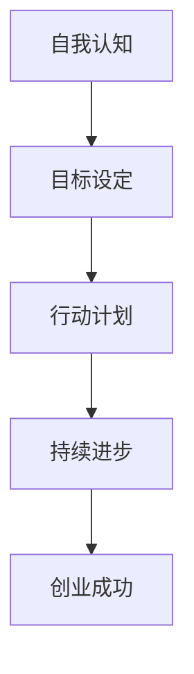
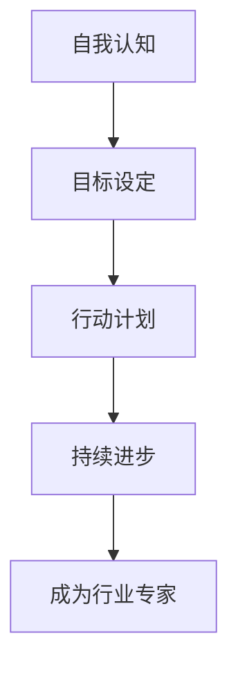
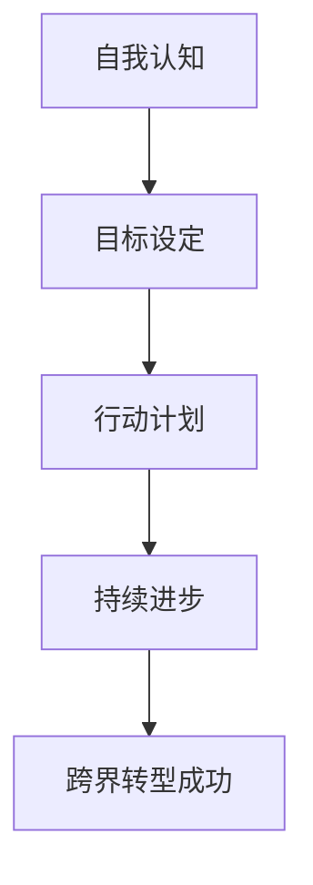

                 

### 文章标题：实现梦想的具体步骤：自我实现的路径规划

> 关键词：自我实现、路径规划、目标设定、时间管理、心理调适、人脉资源、持续进步

> 摘要：本文将探讨如何通过具体的步骤实现个人梦想，实现自我实现。文章从自我认知、目标设定、行动计划、时间管理、心理调适、人脉资源、持续进步等多个方面进行阐述，提供了一套完整且实用的路径规划方法。

----------------------------------------------------------------

# 实现梦想的具体步骤：自我实现的路径规划

## 引言：自我实现的重要性

在现代社会，自我实现成为越来越多人的追求。它不仅仅是一个梦想，更是个人价值和社会价值的体现。自我实现是指一个人通过努力和奋斗，实现自己的潜能，达到内心的满足和幸福。

### 自我实现的定义

自我实现是一种精神状态，也是一种行为过程。它涉及到个人潜能的发挥、目标的实现、内心的满足和幸福。具体来说，自我实现包括以下几个方面：

- **潜能发挥**：通过不断努力和学习，发掘和利用自己的潜力。
- **目标实现**：设定明确的目标，并通过努力实现这些目标。
- **内心满足**：在实现目标的过程中，获得内心的满足和幸福感。
- **社会价值**：通过自我实现，为社会做出贡献，实现个人价值。

### 自我实现对个人的意义

自我实现对个人有着深远的影响。首先，它能够帮助个人找到自己的价值和方向，提升自信心和自尊心。其次，自我实现能够提升个人的生活质量和幸福感。最后，自我实现能够帮助个人实现自己的梦想，实现人生的价值。

### 社会对自我实现的期待

随着社会的进步和发展，社会对个人的期待也在不断提高。社会期待个人能够通过自我实现，为社会做出贡献，实现个人价值。同时，社会也为个人提供了更多的机会和平台，支持个人实现自我价值。

### 自我实现与个人成长的关系

自我实现是个人成长的一个重要组成部分。个人成长包括知识、技能、情感、社会等方面的发展。而自我实现则是个人成长的目标和动力。通过自我实现，个人能够不断提升自己，实现个人价值和梦想。

## 自我认知：了解自己的优势和弱点

实现自我实现的第一步是自我认知，了解自己的优势和弱点。只有清楚自己的长处和短板，才能有针对性地制定目标和计划。

### 自我评估的方法

自我评估是了解自己的重要手段。通过自我评估，可以明确自己的优势和弱点。自我评估的方法包括以下几种：

- **自我反思**：通过回顾自己的经历和行为，分析自己的优势和弱点。
- **他人评价**：通过他人的反馈和评价，了解自己在他人眼中的形象和表现。
- **专业评估**：通过专业的评估工具和方法，如性格测试、能力评估等，了解自己的特质和能力。

### 发现和利用个人优势

每个人都有自己的优势和特长。发现和利用个人优势是实现自我实现的关键。以下是几个方法：

- **自我观察**：通过观察自己的行为和表现，发现自己的优势和特长。
- **请教他人**：通过请教他人，了解他人对自己的评价和看法。
- **实践尝试**：通过实践和尝试，验证自己的优势和特长。

### 如何识别和克服弱点

了解自己的弱点是自我实现的重要一环。以下是一些方法可以帮助识别和克服弱点：

- **正视弱点**：承认自己的弱点，不要逃避和掩盖。
- **分析原因**：分析造成弱点的原因，找到解决问题的方法。
- **持续改进**：通过持续的努力和改进，克服自己的弱点。

### 自我认知的持续过程

自我认知是一个持续的过程。随着时间和经历的变化，个人的优势和弱点也会发生变化。因此，需要不断地进行自我评估和反思，调整自己的认知和行动。

## 目标设定：明确你的梦想和目标

明确目标是实现自我实现的重要步骤。一个明确的目标能够指引我们的行动，帮助我们集中精力，克服困难，最终实现梦想。

### 目标设定的原则

在设定目标时，需要遵循以下原则：

- **具体性（Specific）**：目标要具体明确，而不是模糊的。
- **衡量性（Measurable）**：目标要有可衡量的指标，以便评估进展。
- **可实现性（Achievable）**：目标要具有实现的可能性，避免过于理想化。
- **相关性（Relevant）**：目标要与个人价值观和梦想相符。
- **时限性（Time-bound）**：目标要有明确的时间期限，以便有明确的目标期限。

### 设定SMART目标

SMART是一种常用的目标设定方法，它涵盖了上述原则。SMART目标具体包括：

- **S（Specific）：具体性**：明确你的目标是什么，以及你希望实现的结果。
- **M（Measurable）：衡量性**：设定一个可以衡量的指标，以便追踪进度。
- **A（Achievable）：可实现性**：目标应该是可以实现的，避免设定过高或过低的目标。
- **R（Relevant）：相关性**：目标应该与你的整体梦想和价值观相符。
- **T（Time-bound）：时限性**：设定一个明确的时间期限，以便有明确的目标期限。

### 目标分解和优先级排序

为了更好地实现目标，我们需要将目标分解成更小的子目标，并对这些子目标进行优先级排序。

- **目标分解**：将大目标分解成一系列小目标，每个小目标都是实现大目标的一部分。
- **优先级排序**：根据目标的紧急性和重要性，对子目标进行优先级排序。

### 目标设定与自我实现的关系

目标设定是实现自我实现的桥梁。一个明确的目标能够帮助我们集中精力，有条不紊地实现自我价值。通过设定和实现目标，我们可以逐步实现自我实现，达到内心的满足和幸福。

## 行动计划：制定实现梦想的步骤

有了明确的目标，接下来就需要制定详细的行动计划，以便有条不紊地实现这些目标。行动计划是实现梦想的重要步骤，它需要具体、可行且具有时间限制。

### 制定行动计划的步骤

制定行动计划通常包括以下步骤：

1. **明确目标**：首先要明确你想要实现的目标是什么。
2. **分解目标**：将大目标分解成一系列小目标，每个小目标都是实现大目标的一部分。
3. **确定步骤**：为每个小目标制定具体的实现步骤。
4. **设定时间表**：为每个步骤设定一个明确的时间期限。
5. **分配资源**：确定实现每个步骤所需的资源，包括时间、资金、人力等。

### 制定可行的行动计划

在制定行动计划时，要确保计划的可行性。以下是一些制定可行行动计划的建议：

- **目标具体化**：确保目标具体、明确，避免模糊不清。
- **考虑资源限制**：根据自身资源情况，制定可行的计划。
- **逐步实现**：将大目标分解成小目标，逐步实现，避免急于求成。
- **灵活性**：计划要具有一定的灵活性，以应对可能出现的变化。

### 行动计划与时间管理

时间管理是实现行动计划的关键。以下是几个时间管理的建议：

- **设定优先级**：根据任务的紧急性和重要性，设定优先级。
- **合理安排时间**：合理安排每天的时间，确保有足够的时间完成每个任务。
- **避免拖延**：设定明确的时间表，避免拖延，确保按时完成任务。
- **定期评估**：定期评估计划的执行情况，及时调整和优化计划。

### 行动计划的调整与适应

在执行行动计划的过程中，可能会遇到各种挑战和变化。这时，需要根据实际情况对计划进行调整和适应。

- **及时调整**：根据实际情况，及时调整计划，确保目标的实现。
- **保持灵活性**：保持计划的灵活性，以应对可能出现的变化。
- **持续学习**：在执行计划的过程中，不断学习新知识和技能，提升自己的能力。

通过制定和执行详细的行动计划，我们可以有条不紊地实现梦想，实现自我实现。

## 时间管理：高效利用每一天

时间管理是实现梦想的关键因素之一。高效利用每一天，能够帮助我们更好地实现目标，提高生活质量。

### 时间管理的重要性

时间管理不仅关系到我们的工作效率，更影响到我们的生活质量。通过有效的时间管理，我们可以：

- **提高工作效率**：合理安排时间，确保每个任务都能按时完成。
- **减少拖延**：设定明确的时间表，避免拖延，提高执行力。
- **增强生活质量**：有充足的时间进行休息、娱乐和自我提升。

### 时间管理的方法

以下是几种常见的时间管理方法：

- **四象限法**：将任务分为紧急且重要、紧急不重要、不紧急但重要、不紧急且不重要四个象限，根据任务的重要性和紧急性进行优先级排序。
- **番茄工作法**：将工作时间分为25分钟工作周期，每个周期后休息5分钟，通过这种方式提高工作效率。
- **GTD法（Getting Things Done）**：将任务分为收集、整理、组织、执行、回顾五个步骤，确保所有任务都能得到妥善处理。

### 建立高效的工作习惯

建立高效的工作习惯，能够帮助我们更好地管理时间。以下是一些建议：

- **早起**：早起能够让我们有更多的时间进行自我提升和准备。
- **定期休息**：合理安排工作和休息时间，避免疲劳和压力。
- **减少干扰**：在工作时减少干扰，如关闭社交媒体、手机等。
- **持续学习**：通过学习新知识和技能，提升自己的能力，提高工作效率。

### 应对时间管理的挑战

在时间管理的过程中，可能会遇到各种挑战。以下是一些建议，帮助我们应对这些挑战：

- **学会拒绝**：合理拒绝不重要的任务和请求，确保有足够的时间完成重要任务。
- **灵活调整**：根据实际情况，灵活调整计划，确保目标的实现。
- **定期反思**：定期反思时间管理的效果，找出问题并改进。

通过有效的时间管理，我们可以更好地实现目标，提高生活质量，实现自我实现。

## 心理调适：保持积极心态

在实现梦想的过程中，保持积极心态至关重要。积极心态能够帮助我们应对挫折和困难，保持前进的动力。

### 心理调适的重要性

心理调适是指通过调整心态，保持积极和健康的精神状态。它对于实现自我实现有着重要的影响：

- **应对挫折**：在实现梦想的过程中，难免会遇到挫折和困难。积极心态能够帮助我们更好地应对这些挑战，找到解决问题的方法。
- **保持动力**：积极心态能够激发我们内心的动力，让我们更加坚定地追求梦想。
- **提高生活质量**：积极心态能够提升我们的生活质量和幸福感，让我们更加享受生活。

### 常见的心理障碍

在实现自我实现的过程中，常见的一些心理障碍包括：

- **焦虑**：对未来不确定性的担忧和恐惧。
- **拖延**：对任务的拖延和推迟，导致无法按时完成任务。
- **自我怀疑**：对自己的能力和价值的怀疑，影响自我实现。
- **挫败感**：在遇到挫折时，感到失望和沮丧。

### 培养积极心态的方法

以下是一些培养积极心态的方法：

- **正面思考**：通过积极的思考和态度，面对生活中的挑战和困难。
- **设定小目标**：通过设定小目标，逐步实现大目标，增加成功的机会和成就感。
- **感恩**：对生活中的美好和帮助表示感谢，提升幸福感。
- **积极交流**：与他人积极交流，分享快乐和困难，获得支持和鼓励。

### 应对负面情绪的策略

在遇到负面情绪时，以下是一些应对策略：

- **深呼吸**：通过深呼吸，缓解紧张和焦虑。
- **倾诉**：找到合适的人倾诉，释放内心的压力。
- **运动**：通过运动，释放压力，提升心情。
- **专注当下**：将注意力集中在当前的任务和目标上，避免焦虑和担忧。

通过保持积极心态，我们可以更好地实现自我实现，实现梦想。

## 人脉资源：如何拓展和利用

人脉资源是我们在实现梦想过程中不可或缺的一部分。通过拓展和利用人脉资源，我们可以获得更多的机会和帮助，加速自我实现的过程。

### 人脉资源的重要性

人脉资源是指我们与他人建立的联系和关系，这些关系可以为我们提供各种资源和机会。以下是人脉资源的重要性：

- **机会**：通过人脉资源，我们可以获得更多的工作机会、项目机会等。
- **信息**：人脉资源能够帮助我们获取行业动态、市场信息等，帮助我们做出更明智的决策。
- **支持**：在实现梦想的过程中，人脉资源可以提供各种形式的支持，如资金、技术、人力等。
- **人脉**：人脉资源不仅包括直接的联系人，还可以通过他们进一步扩展我们的社交网络。

### 拓展人脉的方法

以下是一些拓展人脉的方法：

- **参加行业活动**：通过参加行业会议、研讨会等活动，结识行业内的人士。
- **加入专业组织**：加入专业组织或社团，与同行业的人建立联系。
- **网络社交**：通过社交媒体、职业社交平台等，拓展线上人脉。
- **主动交流**：主动与他人交流，表达自己的想法和需求，建立友好关系。

### 维护人脉的策略

拓展人脉只是第一步，维护人脉同样重要。以下是一些维护人脉的策略：

- **保持联系**：定期与他人保持联系，如发送邮件、电话或社交媒体互动。
- **提供帮助**：在对方需要帮助时，主动提供帮助，建立互信关系。
- **资源共享**：与他人分享信息和资源，建立互利共赢的关系。
- **持续互动**：通过参加活动、聚会等方式，持续与他人保持互动。

### 利用人脉实现自我实现

人脉资源可以帮助我们在实现梦想的过程中获得更多的支持和机会。以下是一些建议：

- **寻找导师**：通过人脉资源，寻找行业内的导师或专家，向他们请教和学习。
- **获取资金**：通过人脉资源，寻找投资人或合作伙伴，获得资金支持。
- **合作机会**：通过人脉资源，寻找合作伙伴，共同实现项目或梦想。
- **拓展业务**：通过人脉资源，拓展业务范围，获得更多的商业机会。

通过拓展和利用人脉资源，我们可以更好地实现自我实现，实现梦想。

## 持续进步：不断学习和改进

在实现梦想的过程中，持续进步是至关重要的。只有不断学习和改进，我们才能不断提升自己，适应不断变化的环境，最终实现自我实现。

### 学习的重要性

学习是个人成长和进步的基石。通过学习，我们可以获得新的知识和技能，提升自己的能力，为梦想的实现奠定基础。以下是一些学习的重要性：

- **提升技能**：学习新的知识和技能，帮助我们更好地应对工作中的挑战，提高工作效率。
- **拓宽视野**：通过学习，我们可以了解不同的观点和思想，拓宽视野，提升思维高度。
- **适应变化**：在快速变化的世界中，只有不断学习，我们才能适应新的环境和要求。
- **实现自我价值**：通过不断学习和进步，我们能够实现自己的梦想，实现个人价值。

### 如何选择合适的学习资源

选择合适的学习资源，能够帮助我们更高效地学习和进步。以下是一些建议：

- **了解需求**：首先，要明确自己的学习目标和需求，选择与目标相关的学习资源。
- **多样性**：选择多样化的学习资源，如书籍、在线课程、研讨会、实战项目等，以获得全面的了解。
- **权威性**：选择权威性较高的学习资源，如知名专家的书籍、专业的在线课程等。
- **实用性**：选择具有实用性的学习资源，能够直接应用到实际工作中，提升自己的能力。

### 学习与自我实现的结合

学习不仅是个人成长的需要，也是实现自我实现的重要手段。以下是如何将学习与自我实现结合的一些方法：

- **制定学习计划**：根据自我实现的目标，制定详细的学习计划，确保学习与目标的实现相结合。
- **持续实践**：通过实践，将学到的知识和技能应用到实际工作中，不断提升自己的能力。
- **反思和总结**：在学习过程中，定期反思和总结，找出不足之处，不断改进和提升。
- **设定学习目标**：将学习目标与自我实现的目标相结合，通过实现学习目标，推动自我实现的实现。

### 如何进行自我改进

自我改进是实现自我实现的关键步骤。以下是一些自我改进的方法：

- **接受反馈**：接受他人的反馈和建议，了解自己的不足之处，并进行改进。
- **持续学习**：不断学习新的知识和技能，提升自己的能力。
- **制定改进计划**：根据自我反思和反馈，制定详细的改进计划，并付诸实践。
- **定期评估**：定期评估自己的改进效果，调整改进计划，确保持续进步。

通过持续进步和自我改进，我们可以不断提升自己，实现自我实现，实现梦想。

## 案例分析：成功实现自我实现的例子

为了更好地理解如何通过具体的步骤实现自我实现，以下将分析几个成功实现自我实现的例子。

### 案例一：从零开始的创业者

**背景介绍**：
李先生，一个普通的上班族，因对互联网行业的热爱，决定辞去稳定的工作，开始自己的创业之路。

**核心概念与联系**：
- **自我认知**：李先生在创业初期，通过自我评估，发现了自己对互联网技术的兴趣和优势，决定将自己的兴趣转化为职业。
- **目标设定**：他设定了具体的目标，包括开发一款受欢迎的移动应用，并在三年内实现盈利。
- **行动计划**：他制定了详细的行动计划，包括学习相关技术、寻找合作伙伴、市场调研等。
- **持续进步**：他在创业过程中，不断学习新技术，改进产品，并积极拓展人脉资源。

**Mermaid 流程图**：


**核心算法原理讲解**：
```plaintext
// 自我认知
self-assessment()

// 目标设定
function setGoal(){
    specificGoal()
    measurableGoal()
    achievableGoal()
    relevantGoal()
    time-boundGoal()
}

// 行动计划
function setActionPlan(){
    learnTechnical()
    findPartner()
    marketResearch()
}

// 持续进步
function continueProgress(){
    learnNewTech()
    improveProduct()
    expandNetwork()
}
```

**数学模型和公式**：
$$ \text{盈利} = \text{收入} - \text{成本} $$

**详细讲解和举例说明**：
李先生在创业初期，通过学习前端和后端技术，开发了第一款移动应用，并通过市场调研，发现用户的需求。在持续改进产品的同时，他积极拓展人脉，寻找投资者和合作伙伴。经过三年的努力，他的移动应用成功获得了用户的认可，实现了盈利。

### 案例二：从职场新人到行业专家

**背景介绍**：
张女士，一个初出茅庐的职场新人，希望通过不断学习和努力，成为行业专家。

**核心概念与联系**：
- **自我认知**：张女士在进入职场后，通过自我评估，发现了自己对金融分析的兴趣和优势。
- **目标设定**：她设定了成为金融分析师的目标，并在五年内获得业内认可的专业证书。
- **行动计划**：她制定了详细的学习计划和职业发展路径，包括学习金融知识、参加专业培训、积累实践经验等。
- **持续进步**：她在职场中，不断学习新知识，提升自己的分析能力，并积极参与行业交流活动。

**Mermaid 流�程图**：


**核心算法原理讲解**：
```plaintext
// 自我认知
self-assessment()

// 目标设定
function setGoal(){
    specificGoal()
    measurableGoal()
    achievableGoal()
    relevantGoal()
    time-boundGoal()
}

// 行动计划
function setActionPlan(){
    learnFinancialKnowledge()
    attendProfessionalTraining()
    gainPracticeExperience()
}

// 持续进步
function continueProgress(){
    learnNewKnowledge()
    improveAnalyticalSkills()
    participateInIndustryActivities()
}
```

**数学模型和公式**：
$$ \text{学习进度} = \frac{\text{已学知识}}{\text{总学习内容}} $$

**详细讲解和举例说明**：
张女士在进入职场后，通过自我评估，发现了自己对金融分析的兴趣和优势。她设定了成为金融分析师的目标，并在五年内获得业内认可的专业证书。在职业发展过程中，她通过学习金融知识、参加专业培训和积累实践经验，不断提升自己的分析能力。最终，她成功获得了业内专家的认可，成为行业专家。

### 案例三：跨界转型的成功实例

**背景介绍**：
王先生，一个在传统制造业工作多年的工程师，希望通过跨界转型，进入互联网行业。

**核心概念与联系**：
- **自我认知**：王先生在制造业工作多年，积累了丰富的工程经验。他意识到互联网行业的巨大发展潜力，决定跨界转型。
- **目标设定**：他设定了成为互联网工程师的目标，并在三年内掌握相关技能。
- **行动计划**：他制定了详细的学习计划，包括学习编程语言、参与开源项目、积累实践经验等。
- **持续进步**：他在跨界转型过程中，不断学习新技能，提升自己的编程能力，并积极参与行业交流活动。

**Mermaid 流程图**：


**核心算法原理讲解**：
```plaintext
// 自我认知
self-assessment()

// 目标设定
function setGoal(){
    specificGoal()
    measurableGoal()
    achievableGoal()
    relevantGoal()
    time-boundGoal()
}

// 行动计划
function setActionPlan(){
    learnProgrammingLanguage()
    participateInOpenSourceProjects()
    gainPracticeExperience()
}

// 持续进步
function continueProgress(){
    learnNewSkills()
    improveProgrammingSkills()
    participateInIndustryActivities()
}
```

**数学模型和公式**：
$$ \text{技能掌握度} = \frac{\text{实际应用案例}}{\text{学习案例}} $$

**详细讲解和举例说明**：
王先生在意识到互联网行业的巨大潜力后，决定跨界转型。他在业余时间学习编程语言，参与开源项目，积累实践经验。在三年内，他不仅掌握了互联网工程师所需的相关技能，还成功转型，成为了一名互联网工程师。通过不断学习和实践，他成功实现了自己的跨界转型梦想。

## 结论：自我实现的关键要素

通过本文的讨论，我们可以总结出实现自我实现的关键要素：

1. **自我认知**：了解自己的优势和弱点，是自我实现的第一步。
2. **目标设定**：设定明确、具体、可衡量、可实现、相关的目标，是自我实现的指引。
3. **行动计划**：制定详细的行动计划，确保目标的实现。
4. **时间管理**：高效利用每一天，确保行动计划的执行。
5. **心理调适**：保持积极心态，应对挫折和困难。
6. **人脉资源**：拓展和利用人脉资源，获取更多的机会和支持。
7. **持续进步**：不断学习和改进，提升自己的能力和技能。

只有通过这些关键要素的有机结合，我们才能实现自我实现，实现自己的梦想。

### 作者信息

- **作者**：AI天才研究院/AI Genius Institute & 禅与计算机程序设计艺术 /Zen And The Art of Computer Programming

本文由AI天才研究院撰写，旨在为读者提供实现自我实现的具体步骤和方法。如需进一步了解，请参考《禅与计算机程序设计艺术》一书。希望本文能够对您的自我实现之路有所帮助。如果您有任何问题或建议，欢迎与我们联系。祝您在自我实现的道路上取得成功！

