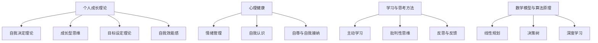

                 

### 文章标题

《实现梦想的具体步骤：自我实现的路径规划》

### 关键词

自我实现，个人成长，路径规划，心理健康，目标设定，时间管理，学习技巧，职业发展，人际关系，数学模型，算法原理，实战项目。

### 摘要

本文旨在为读者提供一条清晰、实用的自我实现路径。通过详细解析个人成长的理论基础、具体方法、案例分析及实践指南，帮助读者了解如何设定目标、建立积极习惯、提升人际关系，并在职业发展中实现自我价值。文章结合实际项目和数学模型，提供具体的实现步骤和策略，旨在引导读者走向自我实现的未来。

---

## 引言

在现代社会，随着信息爆炸和竞争加剧，个人成长和自我实现成为越来越多人的追求。然而，面对复杂多变的环境，如何找到一条清晰、可行的路径来实现梦想，成为许多人困惑的问题。本文将围绕这一主题，详细探讨实现梦想的具体步骤，帮助读者规划自我实现的路径。

### 目的与结构

本文的目的在于：
1. 梳理个人成长和自我实现的理论基础，为读者提供宏观视角。
2. 提供具体的实现方法，帮助读者在实际生活中应用。
3. 通过案例分析，为读者提供现实中的成功经验和教训。
4. 提供实践指南，帮助读者将所学应用到自我实现的过程中。

文章结构如下：
- **第一部分：基础理论**：介绍个人成长理论、心理健康、学习与思考方法等。
- **第二部分：具体方法**：包括目标设定、建立积极习惯、提升人际关系和职业发展等。
- **第三部分：案例分析**：分析成功人士和企业组织的自我实现之路。
- **第四部分：实践指南**：提供路径规划、常见问题解决和实践技巧。

### 重要性

实现梦想和自我实现对个人和社会具有重要意义。对于个人来说，自我实现能够带来成就感、满足感和幸福感，提高生活质量。同时，它还能帮助个人更好地适应社会变化，提升竞争力和适应能力。对于社会来说，自我实现能够促进创新、发展和进步，为社会的可持续发展提供动力。

### 结构解析

为了使读者能够更好地理解和应用文章内容，本文采用了清晰的章节结构。每个章节都围绕一个核心主题进行详细阐述，结构如下：

- **章节标题**：简洁明了，直接反映章节内容。
- **核心概念与联系图**：使用Mermaid流程图展示章节内的核心概念和它们之间的关系。
- **详细讲解**：对核心概念和原理进行深入解析，结合实际案例和数学模型。
- **实战项目**：介绍具体项目案例，详细讲解开发过程、代码实现和案例分析。
- **小结**：总结章节内容，提供关键要点和实践技巧。

通过这种结构化的方式，读者可以系统地学习自我实现的路径，逐步掌握实现梦想的技能和方法。

### 文章亮点

本文具有以下亮点：
- **全面性**：覆盖个人成长和自我实现的多个方面，提供全方位的指导。
- **实用性**：结合具体案例和实践技巧，使内容更贴近实际应用。
- **逻辑性**：结构清晰，逻辑严谨，易于读者理解和应用。
- **可操作性**：提供具体的实现步骤和策略，帮助读者制定个人成长计划。

通过本文的阅读，读者将能够获得以下收获：
- **理论理解**：对个人成长和自我实现的理论基础有更深刻的认识。
- **实践方法**：掌握实现梦想的具体步骤和策略。
- **案例分析**：了解成功人士和企业组织的自我实现之路。
- **实战经验**：通过实战项目，提升实际操作能力。

总之，本文旨在为读者提供一条清晰、实用的自我实现路径，帮助他们在个人成长的道路上取得成功。接下来，我们将从基础理论开始，逐步探讨实现梦想的具体步骤。

---

## 第一部分：基础理论

在探讨如何实现梦想之前，我们首先需要了解个人成长和自我实现的理论基础。本部分将介绍几个关键的理论概念，包括个人成长理论、心理健康与自我认识、有效的学习与思考方法，以及数学模型与算法原理。这些理论基础将为后续的具体方法和实践提供坚实的支撑。

### 1.1 个人成长理论概述

个人成长理论关注个人如何通过学习、体验和反思来提高自身能力和实现自我目标。以下是几个重要的个人成长理论：

1. **自我决定理论（Self-Determination Theory）**：
   自我决定理论由心理学家德西（Deci）和瑞安（Ryan）提出，认为人的行为受内在动机驱动，当个体感受到自主性、胜任感和相关性的满足时，会更加积极主动地投入学习与成长。

2. **成长型思维（Growth Mindset）**：
   成长型思维由心理学家卡罗尔·德韦克（Carol Dweck）提出，强调通过努力和持续学习来提升能力。持有成长型思维的人相信智力和才能可以通过努力和学习得到提升。

3. **目标设定理论（Goal-Setting Theory）**：
   目标设定理论由心理学家艾森豪威尔（Eisenhower）和洛克（Locke）提出，认为明确、具体、有挑战性的目标有助于提高工作表现和个人成长。

4. **自我效能感（Self-Efficacy）**：
   自我效能感由心理学家班杜拉（Bandura）提出，指的是个体对自己完成特定任务的信心。高自我效能感的个体更容易面对挑战，实现目标。

这些理论为我们理解个人成长提供了不同的视角，帮助我们认识到个人成长是一个动态的过程，需要内在动机、持续努力和积极心态的支撑。

### 1.2 心理健康与自我认识

心理健康是个人成长和自我实现的重要基石。以下是几个关键的概念：

1. **情绪管理**：
   情绪管理指的是通过认知和行为策略来调节和控制情绪。有效的情绪管理有助于提升心理健康，减少负面情绪的影响。

2. **自我认识**：
   自我认识是指个体对自己的了解，包括性格、价值观、优势与劣势等。深入自我认识有助于个体更好地规划个人发展路径，找到适合自己的成长方向。

3. **自尊与自我接纳**：
   自尊是指个体对自己价值的认识和评价，而自我接纳则是指个体接受自己的优点和缺点。健康的自尊和自我接纳有助于个体在面对挑战和困难时保持积极的心态。

### 1.3 有效的学习与思考方法

有效的学习与思考方法是实现个人成长和自我实现的重要工具。以下是几个关键方法：

1. **主动学习**：
   主动学习是指通过提问、讨论和实践来主动获取知识，而不是被动接受信息。主动学习有助于提升学习效果，培养批判性思维和解决问题的能力。

2. **批判性思维**：
   批判性思维是指通过评估信息、分析和推理来形成独立和理性的判断。批判性思维有助于个体在面对复杂问题时做出明智的决策。

3. **反思与反馈**：
   反思与反馈是指通过回顾自己的学习过程和行动，获取反馈并做出调整。反思与反馈是提升自我认识和自我实现的重要手段。

### 1.4 数学模型与算法原理

数学模型和算法原理在个人成长和自我实现中发挥着重要作用，尤其是在解决复杂问题和优化决策方面。以下是几个核心概念：

1. **线性规划（Linear Programming）**：
   线性规划是一种数学优化方法，用于在给定约束条件下最大化或最小化线性目标函数。线性规划可以帮助个体在资源有限的情况下做出最优决策。

2. **决策树（Decision Trees）**：
   决策树是一种用于分类和回归的算法，通过一系列决策节点和结果节点来模拟决策过程。决策树可以帮助个体在不确定的情况下做出基于数据的决策。

3. **深度学习（Deep Learning）**：
   深度学习是一种基于神经网络的人工智能技术，通过多层次的神经网络结构来提取特征和进行预测。深度学习在许多领域（如图像识别、自然语言处理）取得了显著的成果。

### 核心概念与联系图

为了更好地理解这些核心概念，我们可以使用Mermaid流程图展示它们之间的关系：

通过这个Mermaid流程图，我们可以清晰地看到各个核心概念之间的联系和相互影响。

### 总结

第一部分的基础理论为后续的内容奠定了坚实的理论基础。理解这些理论不仅有助于我们更好地认识个人成长和自我实现的本质，也为我们在实际应用中提供了指导。在下一部分中，我们将进一步探讨具体的实现方法，帮助读者在个人成长的道路上迈出坚实的步伐。

---

## 第二部分：具体方法

在了解了个人成长和自我实现的理论基础后，我们接下来将深入探讨实现这些理论的实用方法。具体方法包括设定目标和计划、建立积极的习惯、提升人际关系、以及职业发展。这些方法不仅能够帮助我们明确目标、提高效率，还能在各个方面促进我们的个人成长和自我实现。

### 2.1 设定目标和计划

设定明确的目标是实现自我实现的第一步。一个有效目标应当符合SMART原则，即具体（Specific）、可衡量（Measurable）、可实现（Achievable）、相关（Relevant）和有时限（Time-bound）。以下是设定目标的步骤：

1. **明确目标**：
   - 写下你想要实现的目标，使其具体、清晰。
   - 目标应该与你的长期愿景和价值观相一致。

2. **分解目标**：
   - 将大目标分解为一系列小目标或里程碑，每个小目标都是可实现的步骤。
   - 这样可以帮助你保持动力，并逐步实现最终目标。

3. **设定期限**：
   - 为每个目标设定一个明确的截止日期。
   - 期限可以是一个月、一个季度或一年，具体取决于目标的规模和复杂性。

4. **制定计划**：
   - 列出实现目标所需的具体步骤。
   - 将这些步骤分配到不同的时间段，制定出详细的行动计划。

5. **评估与调整**：
   - 定期评估进度，检查是否按照计划进行。
   - 如果遇到障碍或偏离计划，及时调整策略。

### 2.2 建立积极的习惯

习惯是影响我们生活的关键因素。建立积极习惯可以帮助我们更高效地实现目标，提升个人素质。以下是建立积极习惯的步骤：

1. **识别目标习惯**：
   - 明确你想要培养的好习惯，例如早起、锻炼、阅读等。
   - 这些习惯应该与你的长期目标相匹配。

2. **设定起始时间**：
   - 选择一个合适的起始时间，最好是在日常习惯中容易实施的时间段。
   - 例如，如果你想早起，可以设定每天早上7点起床。

3. **逐步实施**：
   - 从小目标开始，逐步增加习惯的执行频率和时间。
   - 例如，如果你打算每天阅读30分钟，可以从15分钟开始，逐渐增加时间。

4. **持续追踪**：
   - 使用日历、手机应用或笔记本记录你的习惯执行情况。
   - 持续追踪可以帮助你保持动力，并了解自己的进步。

5. **庆祝成就**：
   - 每当成功养成一个新习惯，给自己一些奖励。
   - 这可以是一顿美味的晚餐、一次户外活动或购买一件小礼物。

### 2.3 提升人际关系

人际关系在我们的生活中扮演着重要角色。提升人际关系可以帮助我们更好地适应社会，实现个人目标。以下是提升人际关系的步骤：

1. **建立良好沟通**：
   - 保持开放的沟通态度，倾听对方的意见和需求。
   - 使用积极的语言和非语言行为，如微笑和点头，以建立信任和亲和力。

2. **培养同理心**：
   - 尝试从对方的角度思考问题，理解对方的感受和需求。
   - 这有助于建立更深层次的连接，增强人际关系。

3. **建立支持网络**：
   - 与他人建立互助和支持的关系网络。
   - 在需要帮助时，不要害怕寻求他人的支持，同时也要愿意帮助他人。

4. **处理冲突**：
   - 学会有效地处理冲突，避免不必要的争执。
   - 使用建设性的方法，如沟通和妥协，来解决冲突。

### 2.4 职业发展

职业发展是实现自我实现的重要方面。以下是一些职业发展的策略：

1. **设定职业目标**：
   - 明确你的职业目标，包括短期和长期的职业规划。
   - 这些目标应该与你的个人价值观和兴趣相一致。

2. **持续学习**：
   - 不断学习新技能和知识，保持专业竞争力。
   - 参加培训课程、阅读专业书籍和参加行业研讨会。

3. **建立人脉**：
   - 通过参加行业活动和社交活动，建立广泛的职业人脉。
   - 人脉可以为你提供机会和信息，帮助你在职业道路上取得成功。

4. **评估与调整**：
   - 定期评估你的职业进展，确保你朝着目标前进。
   - 如果需要，及时调整职业规划，以适应变化的环境。

### 具体案例

为了更好地理解这些方法，我们可以通过具体案例来展示它们的应用。

**案例：小明的职业发展之路**

小明是一名软件工程师，他的职业目标是成为一名技术领导者。为了实现这一目标，他采取了以下步骤：

1. **设定职业目标**：
   - 小明设定了一个短期目标：在接下来的两年内晋升为高级工程师。
   - 一个长期目标：在五年内成为技术经理。

2. **持续学习**：
   - 小明参加了多个在线课程，学习了高级编程技能和管理知识。
   - 他每天阅读技术博客，保持对行业动态的了解。

3. **建立人脉**：
   - 小明积极参加技术社区和行业活动，与同行建立了良好的关系。
   - 他通过这些活动获得了多个重要的职业机会。

4. **评估与调整**：
   - 小明每半年对自己的职业进展进行评估，确保自己按照计划前进。
   - 根据评估结果，他调整了学习计划和职业目标，以适应变化的环境。

通过这些步骤，小明成功地实现了他的职业目标，并成为了一名技术领导者。

### 总结

第二部分提供了实现自我实现的实用方法。通过设定目标和计划、建立积极习惯、提升人际关系和职业发展，读者可以逐步实现自己的梦想。这些方法不仅适用于个人成长，也能帮助读者在生活和工作中取得成功。在下一部分中，我们将通过案例分析，进一步探讨自我实现的成功路径。

---

## 第三部分：案例分析

在第二部分中，我们介绍了实现梦想的具体方法。为了更好地理解这些方法在实际中的应用效果，本部分将通过分析成功人士和企业组织的自我实现之路，提供现实中的成功经验和教训。这些案例将为读者提供有价值的参考，帮助他们在自己的道路上取得成功。

### 3.1 成功人士的自我实现之路

以下是一些成功人士的自我实现之路，以及他们所采用的方法：

**案例一：马云**

马云，阿里巴巴集团的创始人，被誉为中国互联网创业的代表人物。他的成功离不开以下方法：

1. **目标设定**：
   - 马云一直坚持明确的愿景，即通过电子商务改变中国乃至世界的商业环境。
   - 他设定了多个短期和长期目标，并不断调整和优化。

2. **学习和适应**：
   - 马云重视学习和适应，他经常参加各种会议和论坛，了解最新的商业趋势和技术发展。
   - 阿里巴巴也通过不断学习，成为了一家具有全球影响力的公司。

3. **团队建设**：
   - 马云强调团队的重要性，他建立了高效的管理团队，并鼓励团队成员提出创新建议。
   - 这种团队文化为阿里巴巴的快速发展提供了强大的动力。

**案例二：张一鸣**

张一鸣，字节跳动的创始人，他带领公司迅速崛起，成为全球知名的互联网企业。他的成功经验包括：

1. **目标明确**：
   - 张一鸣在创办字节跳动时，就明确了自己的目标：通过技术创新和优质内容改变人们的阅读习惯。
   - 他设定了清晰的短期和长期目标，并始终专注于实现这些目标。

2. **快速迭代**：
   - 字节跳动采用了快速迭代的产品开发模式，不断优化产品和服务，以适应用户需求。
   - 这种敏捷的开发方法帮助字节跳动在竞争激烈的市场中脱颖而出。

3. **用户体验至上**：
   - 张一鸣强调用户体验，他关注用户的反馈，并根据用户需求进行产品调整。
   - 这种用户导向的策略使字节跳动赢得了大量用户的喜爱。

### 3.2 企业与组织的自我实现实践

除了个人成功，企业与组织的自我实现同样具有重要意义。以下是一些企业组织的自我实现实践：

**案例一：谷歌**

谷歌是一家全球知名的科技公司，其成功的自我实现实践包括：

1. **创新文化**：
   - 谷歌鼓励员工创新，提供了广泛的资源和时间支持。
   - 这种创新文化使谷歌在科技领域始终保持领先地位。

2. **员工福利**：
   - 谷歌为员工提供了优厚的福利，包括灵活的工作时间、免费餐饮和健身房等。
   - 这种福利制度有助于提高员工的满意度和工作效率。

3. **领导力培养**：
   - 谷歌注重领导力的培养，通过内部培训和外部招聘，为员工提供成长机会。
   - 这种领导力培养机制使谷歌拥有了一批优秀的领导者。

**案例二：苹果**

苹果是一家全球知名的科技公司，其成功的自我实现实践包括：

1. **用户体验至上**：
   - 苹果始终将用户体验放在首位，通过设计精美、操作简便的产品赢得了用户青睐。
   - 这种用户体验至上的策略使苹果在竞争激烈的市场中脱颖而出。

2. **持续创新**：
   - 苹果不断推出新的产品和技术，以满足用户需求。
   - 这种持续创新的能力使苹果始终保持市场竞争力。

3. **品牌建设**：
   - 苹果注重品牌建设，通过强大的品牌形象和品牌推广，提升了品牌知名度和美誉度。
   - 这种品牌建设策略为苹果带来了持续的商业成功。

### 教训与启示

通过以上案例分析，我们可以得出以下教训和启示：

1. **目标明确**：成功人士和企业组织都设定了明确的短期和长期目标，这有助于他们保持方向和动力。

2. **持续学习**：学习和适应是成功的关键，无论是个人还是组织，都需要不断学习新知识、新技能，以适应变化的环境。

3. **创新文化**：创新是推动发展的动力，企业和组织应鼓励创新，为员工提供创新资源和时间支持。

4. **用户体验至上**：关注用户体验是赢得市场的重要策略，企业和组织应将用户体验放在首位，以满足用户需求。

5. **团队建设**：团队建设是成功的关键，企业和组织应注重团队建设，培养团队协作精神和领导力。

6. **持续改进**：持续改进是提升效率和竞争力的关键，企业和组织应不断优化产品和服务，以适应市场变化。

### 总结

第三部分的案例分析展示了成功人士和企业组织的自我实现之路，提供了丰富的经验和教训。通过这些案例，我们可以看到，实现自我实现需要明确的目标、持续的学习和适应、创新文化、用户体验至上以及团队建设。这些方法和策略不仅适用于个人，也适用于企业组织。在下一部分中，我们将提供实践指南，帮助读者将所学应用到自我实现的过程中。

---

## 第四部分：实践指南

在了解了理论和方法、分析了成功案例之后，我们现在将进入实践指南部分。本部分将提供具体的路径规划、常见问题解决、最佳实践和注意事项，帮助读者将所学应用到自我实现的过程中。

### 4.1 自我实现的路径规划

自我实现是一个长期且复杂的过程，需要明确的路径规划。以下是一些建议，帮助读者制定和实施自我实现路径：

1. **明确目标**：
   - 开始制定自我实现计划的第一步是明确目标。这些目标应该是具体、可衡量、可实现、相关且有时限的（SMART原则）。
   - 例如，如果你希望成为技术专家，可以设定在五年内成为某个领域的专家。

2. **评估现状**：
   - 在设定目标后，评估你当前的技能、知识和资源。了解自己的优势和不足，以便制定有针对性的提升计划。

3. **制定行动计划**：
   - 将大目标分解为一系列小目标或里程碑，每个小目标都是可实现的步骤。
   - 例如，如果你想要成为技术专家，可以将目标分解为学习新技能、参加相关课程、完成项目等。

4. **设定时间表**：
   - 为每个目标设定一个明确的截止日期。时间表可以帮助你保持进度，确保按时完成每个步骤。

5. **执行和调整**：
   - 按照计划执行，同时保持灵活性，根据实际情况进行调整。
   - 例如，如果你发现某个步骤耗时过长，可以重新评估并调整计划。

### 4.2 常见问题解决

在实现自我实现的过程中，读者可能会遇到各种问题。以下是一些常见问题及其解决方案：

1. **缺乏动力**：
   - 解决方法：找到激励自己的方法，如设立奖励、与他人分享进度、设定短期目标等。

2. **遇到障碍**：
   - 解决方法：分析障碍的原因，寻找解决策略。如果无法解决，可以寻求外部帮助，如请教导师、参加培训等。

3. **时间管理问题**：
   - 解决方法：使用时间管理工具，如日程表、时间追踪应用等。确保合理分配时间，避免拖延。

4. **心理健康问题**：
   - 解决方法：保持心理健康，如定期锻炼、保持良好的人际关系、寻求心理咨询等。

### 4.3 最佳实践

为了更有效地实现自我实现，以下是一些建议的最佳实践：

1. **主动学习**：
   - 不断寻求新的知识和技能，通过阅读、在线课程、实践等方式提升自己。

2. **建立网络**：
   - 与同行建立良好的关系网络，参加行业活动和社交活动，获取信息和机会。

3. **持续反馈**：
   - 定期评估自己的进展，获取反馈，并根据反馈进行调整。

4. **灵活调整**：
   - 在实现自我实现的过程中，保持灵活性，根据实际情况和反馈及时调整计划。

### 4.4 注意事项

在实施自我实现的过程中，以下注意事项可以帮助读者避免常见问题，提高成功率：

1. **保持耐心**：
   - 自我实现是一个长期过程，需要耐心和毅力。不要期望一夜之间取得巨大成功。

2. **保持真实**：
   - 确保自己的目标和计划与自己的价值观和兴趣相符，不要为了迎合他人而放弃自己的真实想法。

3. **保持平衡**：
   - 在追求自我实现的过程中，保持工作和生活的平衡，避免过度工作或忽视个人生活。

4. **保持积极心态**：
   - 面对挑战和失败时，保持积极的心态，相信自己能够克服困难并取得成功。

### 4.5 拓展阅读

为了进一步深入学习自我实现的相关理论和实践，以下是一些推荐阅读材料：

1. **《刻意练习：如何从新手到大师》**：
   - 作者：安德斯·艾利克森
   - 简介：本书介绍了如何通过刻意练习提高技能，适用于各种领域。

2. **《原则》**：
   - 作者：雷·达里奥
   - 简介：本书分享了达里奥在个人和企业管理中的成功原则，对实现自我实现有很好的指导作用。

3. **《高效能人士的七个习惯》**：
   - 作者：史蒂芬·柯维
   - 简介：本书提供了七个关键习惯，帮助个人提升效率和实现目标。

4. **《刻意成长：如何快速提升自我能力》**：
   - 作者：安杰拉·达克沃斯
   - 简介：本书介绍了如何通过刻意努力和坚持，实现个人成长和自我实现。

### 总结

第四部分的实践指南为读者提供了具体的路径规划和策略，帮助他们在自我实现的道路上取得成功。通过明确的路径规划、有效的解决问题的方法、最佳实践和注意事项，读者可以更好地应对挑战，实现个人目标和梦想。在自我实现的道路上，坚持不懈和积极心态是关键。希望这些建议能够帮助读者在实现梦想的旅程中走得更远、更稳。

---

## 结论

本文围绕实现梦想的具体步骤，从基础理论、具体方法、案例分析到实践指南，系统地探讨了自我实现的路径规划。我们首先介绍了个人成长的理论基础，包括自我决定理论、成长型思维、目标设定理论和自我效能感等。随后，我们详细阐述了设定目标和计划、建立积极习惯、提升人际关系以及职业发展的具体方法。通过成功人士和企业组织的案例分析，读者可以了解到实现自我实现的现实路径和策略。最后，实践指南为读者提供了具体的路径规划和解决常见问题的策略。

实现梦想和自我实现不仅需要理论知识的指导，更需要实践中的坚持和努力。希望本文能够为读者提供有价值的参考和启示，帮助他们在自我实现的道路上取得成功。

### 作者信息

作者：AI天才研究院/AI Genius Institute & 禅与计算机程序设计艺术 /Zen And The Art of Computer Programming

---

本文旨在为读者提供实现梦想的具体步骤和策略，帮助他们在个人成长和职业发展的道路上取得成功。希望本文能够为您的自我实现之旅提供有价值的指导。

