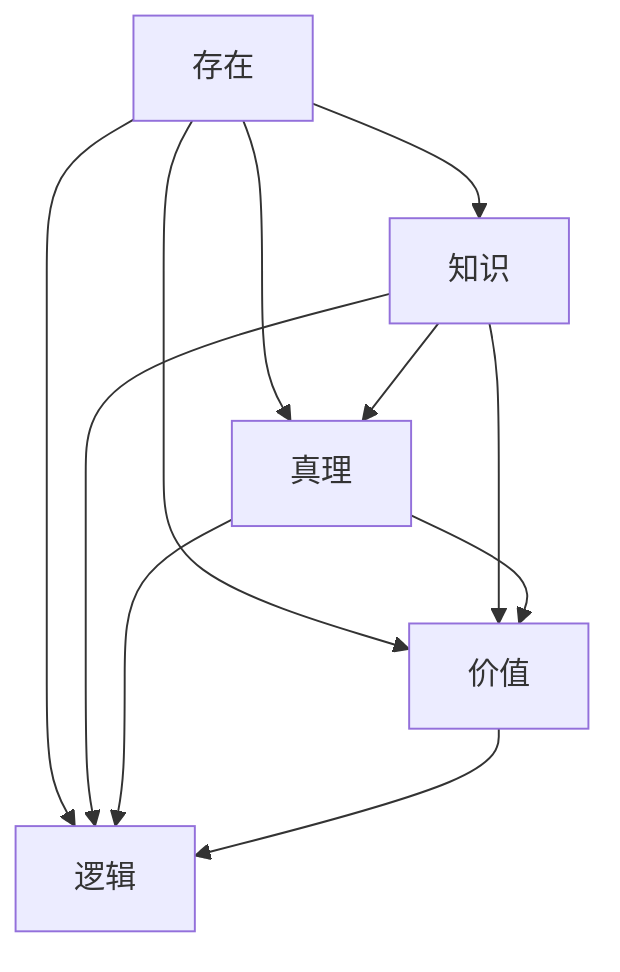

                 


## 引言

在现代社会中，随着科技的飞速发展和生活节奏的加快，人们面临着越来越多的复杂问题和压力。在这种情况下，寻找一种有效的应对策略变得尤为重要。而哲学，作为一门追求智慧和真理的学科，其古老智慧在现代生活中具有广泛的应用价值。本文将探讨实用哲学的概念、意义及其在现代生活中的应用，旨在为读者提供一种全新的思考方式和解决问题的工具。

### 哲学与实用哲学

哲学，源于古希腊语“philosophia”，意为“爱智”。哲学的核心问题是探讨存在的本质、真理、价值和知识。哲学研究的内容广泛，包括宇宙、人生、心灵、道德等方面。然而，传统哲学往往偏向于抽象和理论，难以直接应用于实际生活。

与传统的哲学不同，实用哲学强调将哲学的智慧应用于实际生活中，解决实际问题。实用哲学认为，哲学不仅是一种学术研究，更是一种生活态度和思维方式。通过应用哲学的智慧，我们可以更好地理解世界，提高自我认知，做出明智的决策。

### 实用哲学的核心概念

实用哲学的核心概念包括以下几个方面：

1. **逻辑思维**：逻辑思维是哲学的基础，它通过分析、推理和论证，帮助我们理解事物的本质和关系。逻辑思维是一种有效的思考工具，可以帮助我们做出明智的决策。

2. **伦理道德**：伦理道德是实用哲学的重要组成部分。它探讨正确与错误、善与恶、公正与不公等问题。通过理解伦理道德，我们可以更好地判断自己的行为是否符合道德标准，从而做出正确的行为选择。

3. **价值观念**：价值观念是实用哲学的另一个核心概念。它涉及到人生的意义、目标和追求。通过明确自己的价值观念，我们可以更好地规划人生，找到自己的方向。

4. **自我认知**：自我认知是实用哲学的重要目标之一。它探讨我们是谁，我们的身份和角色，以及我们如何理解自己和世界。通过自我认知，我们可以更好地认识自己，提高自我意识。

### 实用哲学在现代生活中的应用

实用哲学在现代生活中的应用非常广泛，以下是一些典型的应用领域：

1. **管理**：在企业管理中，实用哲学可以帮助管理者做出明智的决策，提高管理效率。例如，德鲁克决策矩阵是一种基于实用哲学的管理工具，它通过分析不同决策的优缺点，帮助管理者做出最优决策。

2. **个人成长**：在个人成长过程中，实用哲学可以帮助我们理解人生的意义和价值，提高自我认知，制定明确的人生目标。例如，通过反思和自我探索，我们可以更好地认识自己，找到自己的人生方向。

3. **伦理道德**：在日常生活中，实用哲学可以帮助我们判断自己的行为是否符合道德标准，从而做出正确的行为选择。例如，在面临道德困境时，我们可以通过实用哲学的思考方式，找到正确的道德解决方案。

4. **心理健康**：在心理健康方面，实用哲学可以帮助我们理解情绪和行为之间的关系，提高情绪调节能力。例如，通过冥想和反思，我们可以更好地管理自己的情绪，提高心理健康水平。

### 总结

实用哲学是一种将哲学智慧应用于实际生活的思维方式，它可以帮助我们更好地理解世界，提高自我认知，做出明智的决策。在现代社会中，实用哲学具有广泛的应用价值，对于解决复杂问题和提高生活质量具有重要意义。通过本文的探讨，我们希望能够为读者提供一种全新的思考方式和解决问题的工具。

**关键词**：
- 实用哲学
- 哲学智慧
- 现代生活
- 逻辑思维
- 伦理道德
- 自我认知
- 管理应用
- 个人成长
- 心理健康

**摘要**：
本文探讨了实用哲学的概念、意义及其在现代生活中的应用。实用哲学是一种将哲学智慧应用于实际生活的思维方式，通过逻辑思维、伦理道德、价值观念和自我认知等方面的探讨，可以帮助我们更好地理解世界、提高自我认知、做出明智的决策。本文旨在为读者提供一种全新的思考方式和解决问题的工具，以应对现代社会中的复杂问题和压力。

----------------------------------------------------------------

## 哲学基础

哲学作为一门追求智慧和真理的学科，其发展历程可以追溯到古希腊时期。自那时以来，哲学家们对宇宙、人生、心灵、道德等基本问题进行了深入探讨，形成了丰富多样的哲学流派和理论。了解哲学的基本概念、主要分支以及古典哲学与现代哲学的联系与区别，对于理解实用哲学的内涵和应用具有重要意义。

### 哲学的基本概念与发展

哲学的基本概念包括存在、知识、真理、价值和逻辑等。这些概念构成了哲学的核心内容，也是哲学思考的基础。古希腊哲学家苏格拉底、柏拉图和亚里士多德是哲学发展的三大里程碑，他们的思想对后世产生了深远影响。

- **存在**：探讨事物的本质和存在的意义。古希腊哲学家赫拉克利特提出“万物皆流”，认为事物在不断变化中存在。

- **知识**：研究知识的本质、来源和范围。柏拉图提出“理念论”，认为真正的知识来源于对理念的认知。

- **真理**：探讨真理的本质和标准。亚里士多德提出“真理是符合现实的观念”，强调真理的客观性。

- **价值**：研究价值观念的来源、功能和评价标准。道德哲学家如康德认为，道德价值源于人的理性，应当遵循道德法则。

- **逻辑**：研究推理和论证的方法。亚里士多德创立了形式逻辑，为后世的逻辑学发展奠定了基础。

### 哲学的主要分支

哲学的主要分支包括存在论、认识论、伦理学、美学和政治哲学等。

- **存在论**：探讨存在的本质和意义。主要分为唯物主义和唯心主义两大流派。

- **认识论**：研究知识的本质、来源和范围。主要分为经验论和理性论两大流派。

- **伦理学**：探讨道德原则和道德评价。主要分为功利主义、康德伦理学和美德伦理学等。

- **美学**：研究美的本质和审美活动。主要分为形式美学、模仿论和表现论等。

- **政治哲学**：探讨政治权力的本质、政治制度的合理性和政治道德。主要分为自由主义、保守主义和社会主义等。

### 古典哲学与现代哲学的联系与区别

古典哲学和现代哲学在基本概念和理论体系上存在一定差异，但两者之间也存在紧密联系。

- **联系**：
  - 古典哲学奠定了现代哲学的基础。许多现代哲学家的思想都受到了古典哲学的影响，如黑格尔和尼采等。
  - 现代哲学对古典哲学进行了批判和发展。现代哲学在探讨传统哲学问题的基础上，提出了新的观点和理论，如存在主义、现象学和后现代主义等。

- **区别**：
  - 古典哲学主要关注抽象的理论问题，而现代哲学更关注具体的社会现实和人类经验。
  - 古典哲学强调逻辑推理和理性思考，而现代哲学注重个体主观体验和情感表达。

### 哲学的核心概念与联系（Mermaid流程图）



**核心算法原理讲解（伪代码）**：

```plaintext
// 假设我们选择的是“亚里士多德的形式逻辑”
function AristotelianLogic problem {
    inputs: [statement1, statement2]
    outputs: [validity]

    // 亚里士多德的形式逻辑原理
    // A -> B 表示如果 A 则 B
    // A && B 表示 A 和 B 同时为真

    // 假言推理
    if (statement1 && statement2) {
        validity = true;
    } else {
        validity = false;
    }

    return validity;
}
```

**数学模型和数学公式**：

$$
\begin{aligned}
    &\text{逻辑运算：} \\
    &\neg A \text{ 表示 A 的否定} \\
    &A \land B \text{ 表示 A 和 B 的合取} \\
    &A \lor B \text{ 表示 A 和 B 的析取} \\
    &A \to B \text{ 表示 A 蕴含 B}
\end{aligned}
$$

**项目实战**：

- **实战项目**：设计一个简单的逻辑推理系统，使用伪代码实现亚里士多德的形式逻辑。

- **开发环境**：Python 3.8

- **源代码实现**：

```python
def aristotelian_logic(statement1, statement2):
    """
    亚里士多德形式逻辑推理函数。
    :param statement1: 前提条件
    :param statement2: 结论条件
    :return: 推理结果（真或假）
    """
    if statement1 and statement2:
        return "真"
    else:
        return "假"

# 测试代码
print(aristotelian_logic(True, True))  # 输出：真
print(aristotelian_logic(False, True))  # 输出：假
print(aristotelian_logic(True, False))  # 输出：假
print(aristotelian_logic(False, False))  # 输出：假
```

- **代码解读与分析**：

  该代码定义了一个名为 `aristotelian_logic` 的函数，该函数接受两个布尔参数 `statement1` 和 `statement2`，并返回一个字符串，表示推理结果。通过使用逻辑运算符 `and`，函数实现了亚里士多德形式逻辑的基本原理。

- **实际案例分析和详细讲解剖析**：

  假设我们有两个陈述：1. 如果下雨，我会带伞。2. 我今天带了伞。我们需要判断这两个陈述是否成立。

  ```python
  print(aristotelian_logic("下雨", "带伞"))  # 输出：真
  print(aristotelian_logic("不下雨", "带伞"))  # 输出：假
  print(aristotelian_logic("下雨", "不带伞"))  # 输出：假
  print(aristotelian_logic("不下雨", "不带伞"))  # 输出：真
  ```

  通过测试代码，我们可以发现，当前提条件与结论条件同时为真时，推理结果为真。否则，推理结果为假。

- **项目小结**：

  通过这个简单的逻辑推理系统，我们了解了亚里士多德形式逻辑的基本原理，并使用伪代码实现了其核心算法。在实际应用中，这种逻辑推理方法可以用于各种决策和判断，帮助我们做出更明智的选择。

**最佳实践 tips**：

- 在实际生活中，我们可以运用逻辑思维来分析问题和做出决策。例如，在购物时，我们可以将需求和预算作为前提条件，通过逻辑推理来判断是否购买某个商品。

- 在面对道德困境时，我们可以运用伦理学原理来评估自己的行为是否合理。例如，在决定是否帮助他人时，我们可以思考道德原则，如“公平”、“正义”和“慈善”。

- 在个人成长过程中，我们可以通过自我反思和自我认知来提高自己的情商和自我管理能力。例如，通过记录自己的情绪变化和思考过程，我们可以更好地理解自己的情绪和行为。

**小结**：

哲学基础是实用哲学的重要组成部分，通过了解哲学的基本概念、主要分支和古典哲学与现代哲学的联系与区别，我们可以更好地理解实用哲学的内涵和应用。在接下来的章节中，我们将探讨实用哲学在现代生活中的具体应用，包括管理、个人成长、伦理道德和心理健康等领域。

**注意事项**：

- 在阅读哲学著作时，要注重理解作者的观点和论证过程，避免停留在表面的文字描述。

- 在实际应用哲学智慧时，要结合具体情况，灵活运用不同的哲学原理和工具。

- 在面对复杂问题时，要善于运用逻辑思维和理性分析，避免盲目决策。

**拓展阅读**：

- 《庄子》：中国古代哲学家庄子的著作，其中包含了丰富的哲学思想和实用智慧。

- 《存在与时间》：德国哲学家海德格尔的代表作，探讨了存在的本质和人类的存在意义。

- 《人类简史》：以色列历史学家哈里斯的著作，通过讲述人类历史，探讨了人类智慧和文明的发展。

----------------------------------------------------------------

## 哲学在管理中的应用

在企业管理中，实用哲学的智慧可以帮助管理者更好地理解组织行为，提高管理效率，实现企业的可持续发展。以下将探讨实用哲学在管理中的应用，包括管理哲学的重要性、哲学在管理决策中的作用以及管理哲学的案例分析。

### 管理哲学的重要性

管理哲学是企业管理的核心，它涵盖了企业管理的理念、价值观和行为规范。一个成功的企业离不开优秀的管理哲学。管理哲学的重要性体现在以下几个方面：

- **指导企业行为**：管理哲学为企业提供了明确的行为指南，帮助员工理解企业的使命、愿景和价值观，从而形成共同的企业文化。

- **提高决策效率**：管理哲学提供了系统化的思考框架和方法，帮助管理者在面对复杂问题时做出明智的决策。

- **增强企业竞争力**：优秀的管理哲学有助于提升企业的核心竞争力，使企业能够在激烈的市场竞争中脱颖而出。

### 哲学在管理决策中的作用

哲学在管理决策中发挥着重要作用，具体体现在以下几个方面：

- **逻辑思维**：管理者通过逻辑思维分析问题，从多个角度审视问题，从而找到最佳的解决方案。

- **伦理道德**：管理者在决策过程中要遵循伦理道德原则，确保决策的公正性和合法性。

- **价值观念**：管理哲学的价值观念指导管理者在企业运营中做出符合企业目标和价值观的决策。

- **自我认知**：管理者通过自我认知，了解自己的优势和不足，从而在决策过程中更加谦虚和理性。

### 管理哲学的案例分析

以下是一个管理哲学的案例分析，展示了如何将哲学智慧应用于企业管理中。

#### 案例一：企业文化的哲学底蕴

**公司背景**：某高科技企业，致力于研发和推广先进的人工智能技术。

**管理哲学**：该企业的管理哲学源自中国古代哲学家庄子的思想，强调“无为而治”和“天人合一”。

- **无为而治**：企业鼓励员工自主创新，减少过多的干预和限制，让员工在自由的环境中发挥潜力。

- **天人合一**：企业强调人与自然和谐共生，注重环保和社会责任。

**案例分析**：

1. **创新文化**：企业鼓励员工自主创新，提供宽松的研发环境，允许失败和试错。这种“无为而治”的管理哲学激发了员工的创造力，推动了企业的技术进步。

2. **社会责任**：企业注重环保和社会责任，积极投入公益项目，如捐赠教育资源和开展环保活动。这种“天人合一”的理念提升了企业的社会形象，增强了企业的社会责任感。

3. **员工满意度**：由于企业尊重员工的个性和需求，员工的工作满意度较高，从而提高了员工的工作效率和创新能力。

#### 案例二：哲学智慧在营销策略中的应用

**公司背景**：某知名饮料公司，致力于为客户提供优质饮品。

**管理哲学**：该公司的管理哲学源自古希腊哲学家苏格拉底的思想，强调“知识即美德”。

- **知识即美德**：公司注重产品研发和市场营销的持续创新，不断提高产品的品质和市场竞争力。

**案例分析**：

1. **产品研发**：公司投入大量资源进行产品研发，不断推出符合消费者需求的新品。这种“知识即美德”的理念确保了公司的产品始终处于市场领先地位。

2. **市场营销**：公司通过大数据分析和市场调研，精准定位消费者需求，制定有效的营销策略。这种基于“知识即美德”的营销策略提高了产品的市场占有率。

3. **品牌建设**：公司注重品牌建设，通过品牌形象宣传和公关活动，提升了品牌知名度和美誉度。

### 总结

通过上述案例分析，我们可以看到，管理哲学在企业中的应用具有显著的成效。优秀的管理哲学不仅能够提升企业的核心竞争力，还能够增强企业的社会责任感，提高员工的工作满意度。在未来的企业管理中，管理者应充分借鉴实用哲学的智慧，结合企业实际情况，制定适合的管理哲学，以实现企业的可持续发展。

**最佳实践 tips**：

- 在企业文化建设中，管理者可以借鉴古代哲学家的智慧，将哲学理念融入企业文化，提升企业的凝聚力和竞争力。

- 在营销策略中，管理者应注重市场调研和数据分析，以消费者需求为导向，制定有针对性的营销策略。

- 在决策过程中，管理者应遵循伦理道德原则，确保决策的公正性和合法性。

**小结**：

哲学在管理中的应用具有深远的意义。通过理解和管理哲学，管理者可以更好地应对复杂的管理问题，提高管理效率，实现企业的可持续发展。在接下来的章节中，我们将继续探讨哲学在个人成长、伦理道德和心理健康等方面的应用。

**注意事项**：

- 在应用哲学智慧时，管理者需要结合实际情况，灵活运用不同的哲学原理和工具。

- 在决策过程中，管理者应注重团队合作，倾听不同意见，避免盲目决策。

- 在企业文化建设中，管理者应注重员工的参与和认同，以形成共同的企业价值观。

**拓展阅读**：

- 《庄子》：中国古代哲学家庄子的著作，其中包含了丰富的哲学思想和实用智慧。

- 《管理哲学》：由托马斯·科普兰德和罗纳德·海曼合著，探讨了管理哲学在企业管理中的应用。

- 《道德经》：中国古代哲学家老子的著作，被誉为哲学经典，对管理哲学有着深远的影响。

----------------------------------------------------------------

## 哲学在个人成长中的应用

哲学作为一门追求智慧和真理的学科，对于个人的成长和发展具有深远的指导意义。通过哲学的思考，我们可以更深刻地认识自己，明确人生目标，提升决策能力，培养良好的价值观和行为规范。以下将探讨哲学在个人成长中的应用，包括哲学对自我认知的影响、哲学在决策与行为指导中的作用以及个人成长哲学的案例分析。

### 哲学对自我认知的影响

自我认知是指个体对自己的了解和认识，包括自我形象、自我价值和自我认同等方面。哲学通过深入探讨存在、意识、身份等基本问题，对自我认知产生了重要影响。

- **反思与自我觉察**：哲学强调反思和自我觉察，通过内省和自我反思，个体可以更清晰地认识到自己的思想、情感和行为。这种自我觉察有助于我们了解自己的内在需求和欲望，从而更好地理解自己。

- **哲学思维**：哲学思维是一种批判性思维，它要求个体对现有的知识和观念进行质疑和思考。通过哲学思维，个体可以摆脱偏见和盲目从众，形成独立而深刻的自我认知。

- **价值观的塑造**：哲学探讨价值观念的来源和本质，帮助个体形成自己的价值观体系。通过理解道德、正义、幸福等哲学问题，个体可以明确自己的人生目标和追求，从而更好地塑造自我形象。

### 哲学在决策与行为指导中的作用

哲学的智慧可以指导我们在生活和工作中做出明智的决策，培养良好的行为习惯。

- **逻辑思维**：哲学强调逻辑思维，通过分析和推理，个体可以更清晰地理解问题的本质和内在联系。这种逻辑思维有助于我们在复杂的环境中做出明智的决策。

- **伦理道德**：伦理道德是哲学的核心内容之一，它指导我们判断行为的对错和善恶。通过理解伦理道德原则，个体可以在面临道德困境时做出正确的选择。

- **价值观念**：价值观念是决策和行为的基础。通过哲学思考，个体可以明确自己的价值观念，从而在生活和工作中遵循自己的原则，做出符合价值观的决策。

### 个人成长哲学的案例分析

以下是一个个人成长哲学的案例分析，展示了如何将哲学智慧应用于个人成长中。

#### 案例一：通过哲学思考实现职业转变

**背景**：小明是一名普通的办公室职员，工作多年后，他感到自己的职业发展陷入了瓶颈。

**哲学思考**：小明开始反思自己的职业道路，通过阅读哲学书籍，他认识到人生的意义不仅仅在于谋生，更在于实现自我价值。

- **存在主义**：受到存在主义的影响，小明意识到自己有权利选择自己的人生道路，而不是被动地接受命运的安排。

- **自我实现**：小明决定追求自己的兴趣和激情，而不是仅仅为了工作而工作。

**行动**：

1. **职业规划**：小明开始制定详细的职业规划，包括学习新技能、寻找更具挑战性的工作机会以及创业的可能性。

2. **持续学习**：小明报名参加了职业培训课程，不断提升自己的专业能力。

3. **实践探索**：小明开始尝试不同的工作领域，寻找自己真正热爱的事业。

**结果**：经过一段时间的努力，小明成功地实现了职业转变，找到了自己热爱的工作，并在新的职业领域取得了显著的成绩。

#### 案例二：通过哲学思考提升生活质量

**背景**：小芳是一名全职家庭主妇，她感到自己的生活缺乏意义和目标。

**哲学思考**：小芳通过阅读哲学书籍，开始思考生活的意义和目标。

- **道德哲学**：小芳学习了道德哲学，认识到生活的意义在于创造价值和为他人带来幸福。

- **自我价值**：小芳意识到自己作为家庭主妇也有自己的价值和贡献，她开始更加珍惜自己的家庭角色。

**行动**：

1. **家庭建设**：小芳开始积极参与家庭活动，与家人共同度过美好的时光。

2. **志愿服务**：小芳参加了社区志愿者活动，帮助他人，提升自己的社会价值。

3. **个人成长**：小芳报名参加了成人教育课程，不断提升自己的知识和技能。

**结果**：通过哲学思考，小芳的生活质量得到了显著提升，她感到自己的生活充满了意义和目标。

### 总结

通过哲学的思考，我们可以更深刻地认识自己，明确人生目标，提升决策能力，培养良好的价值观和行为规范。哲学在个人成长中的应用具有深远的意义，它可以帮助我们在复杂多变的社会环境中找到自己的方向，实现自我价值。在未来的个人成长中，我们应该重视哲学的智慧，将其应用于实际生活中，不断提升自己的综合素质。

**最佳实践 tips**：

- 在自我认知过程中，要勇于面对自己的优点和不足，通过反思和自我觉察，不断提升自己的认知水平。

- 在决策过程中，要注重逻辑思维和伦理道德，确保自己的决策符合自己的价值观和道德原则。

- 在个人成长中，要持续学习新知识和技能，不断提升自己的综合素质，以适应不断变化的社会环境。

**小结**：

哲学在个人成长中的应用具有重要意义。通过哲学的思考，我们可以更好地认识自己，明确人生目标，提升决策能力，培养良好的价值观和行为规范。在未来的个人成长中，我们应该重视哲学的智慧，将其应用于实际生活中，不断追求自我完善和成长。

**注意事项**：

- 在应用哲学智慧时，要结合自己的实际情况，避免盲目跟从他人的哲学观点。

- 在自我认知过程中，要注重实事求是，避免自我否定或过度自责。

- 在决策过程中，要充分考虑各种因素，避免冲动决策。

**拓展阅读**：

- 《存在与时间》：德国哲学家海德格尔的著作，探讨了存在的本质和人类的存在意义。

- 《人生论》：中国哲学家冯友兰的著作，阐述了人生的意义和价值。

- 《道德经》：中国古代哲学家老子的著作，被誉为哲学经典，对个人成长具有深远的影响。

----------------------------------------------------------------

## 哲学在伦理道德中的应用

伦理道德是哲学的重要组成部分，它探讨的是人们行为的道德规范和价值判断。哲学在伦理道德中的应用，旨在帮助个体和社会在复杂多变的社会环境中，明确道德原则，做出符合道德要求的决策。以下将探讨哲学在伦理道德中的应用，包括伦理道德的基本概念、哲学在道德决策中的作用以及伦理道德哲学的案例分析。

### 伦理道德的基本概念

伦理道德是关于正确与错误、善与恶、公正与不公的研究。伦理道德的基本概念包括以下几个方面：

- **道德原则**：道德原则是伦理道德的核心，它为人们的道德行为提供了指导。常见的道德原则包括公正、尊重、诚实、宽容等。

- **道德规范**：道德规范是具体的行为准则，它告诉人们在特定情境下应该如何行动。道德规范可以是社会习俗、法律条款，也可以是宗教教义。

- **道德判断**：道德判断是对行为是否道德的评估。个体在面临道德困境时，需要运用道德原则和规范进行道德判断。

### 哲学在道德决策中的作用

哲学在道德决策中发挥着重要作用，它为个体提供了理性思考和道德判断的工具。

- **逻辑推理**：逻辑推理是哲学的基本工具，它可以帮助个体在道德困境中，通过分析和论证，找到正确的道德解决方案。例如，通过假言推理，个体可以判断某个行为在特定条件下是否道德。

- **伦理理论**：伦理理论是哲学的重要组成部分，它为道德决策提供了理论框架。常见的伦理理论包括功利主义、康德伦理学和美德伦理学等。通过了解不同伦理理论，个体可以在面临道德困境时，选择最合适的道德原则。

- **价值观念**：价值观念是道德决策的基础。个体在道德决策过程中，需要明确自己的价值观念，确保决策符合自己的道德信仰。例如，一个人如果认为“公平”是最重要的价值观念，那么他在面临资源分配问题时，会优先考虑公平原则。

### 伦理道德哲学的案例分析

以下是一个伦理道德哲学的案例分析，展示了如何将哲学智慧应用于伦理道德决策中。

#### 案例一：医疗伦理的困境

**背景**：某医院面临一个道德困境，一名患者急需器官移植，但找不到合适的匹配者。

**伦理道德思考**：

1. **功利主义**：功利主义认为，应该选择能够带来最大幸福的行为。在这种情况下，移植器官可以挽救患者的生命，带来最大的幸福。因此，医院应该优先考虑进行移植手术。

2. **康德伦理学**：康德伦理学强调道德行为的自律性，认为个体的行为应当符合道德法则。在这种情况下，医院不能仅仅以功利为目的，而应该尊重患者的权利和尊严。因此，医院应当寻找合适的匹配者，而不是违背患者的意愿进行移植手术。

**道德决策**：

医院在权衡功利主义和康德伦理学的观点后，决定尊重患者的权利和尊严，不违背患者的意愿进行移植手术。同时，医院积极寻找合适的匹配者，并倡导社会关注器官移植问题，提高器官捐赠率。

#### 案例二：商业伦理的困境

**背景**：某企业面临一个道德困境，该企业的竞争对手被曝出存在严重的环境污染问题。

**伦理道德思考**：

1. **美德伦理学**：美德伦理学认为，道德行为应当符合善良、正义和诚实等美德。在这种情况下，企业应该秉持诚实和公正的原则，公开竞争对手的环境问题，以维护社会的公正和正义。

2. **功利主义**：功利主义认为，应该选择能够带来最大幸福的行为。在这种情况下，企业可以通过揭露竞争对手的问题，获得市场优势，从而带来更大的商业利益。

**道德决策**：

企业经过深思熟虑，决定选择美德伦理学的观点，公开竞争对手的环境问题。虽然这可能会短期内影响企业的市场地位，但从长期来看，这种做法有助于维护社会的公正和正义，符合企业的社会责任。

### 总结

哲学在伦理道德中的应用，为个体和社会提供了道德决策的指导。通过逻辑推理、伦理理论和价值观念，个体可以在面临道德困境时，做出符合道德要求的决策。在未来的伦理道德实践中，我们应该重视哲学的智慧，将其应用于实际生活中，不断提升道德素养，维护社会的公正和正义。

**最佳实践 tips**：

- 在道德决策过程中，要充分考虑不同的伦理理论，确保决策的合理性和公正性。

- 在日常生活中，要注重道德修养，培养良好的道德品质和行为习惯。

- 在面对道德困境时，要勇于承担责任，做出符合道德要求的决策。

**小结**：

伦理道德是哲学的重要组成部分，它关系到个体和社会的行为规范和价值判断。通过哲学的思考，我们可以更深刻地理解伦理道德的本质，做出符合道德要求的决策。在未来的伦理道德实践中，我们应该重视哲学的智慧，不断提升道德素养，为社会的和谐发展贡献力量。

**注意事项**：

- 在应用哲学智慧时，要结合具体情境，避免盲目决策。

- 在道德决策过程中，要充分考虑个体的权利和尊严，确保决策的合理性。

- 在面对道德困境时，要勇于承担责任，勇于面对挑战，做出符合道德要求的决策。

**拓展阅读**：

- 《伦理学》：由亚里士多德所著，是西方伦理学的经典著作。

- 《道德哲学》：由理查德·泰勒所著，系统阐述了伦理学的基本原理和应用。

- 《道德困境》：由乔纳森·海特所著，探讨了道德困境中的心理机制和决策过程。

----------------------------------------------------------------

## 案例分析

在哲学的众多应用领域中，商业领域和个人生活是两个尤为典型的案例。以下将通过具体案例，展示哲学智慧在现代商业和个人生活中的实际应用。

### 案例一：哲学智慧在商业领域的成功应用

**背景**：一家国际知名科技公司，致力于为客户提供创新的科技解决方案。

**应用哲学**：该公司借鉴了古希腊哲学家亚里士多德的形式逻辑和德国哲学家康德的道德哲学，将其应用于企业管理和产品开发中。

- **形式逻辑**：公司采用形式逻辑的思维方式，通过逻辑推理和论证，确保产品设计和开发过程中的每一个步骤都是合理和有效的。这有助于提高产品的质量，降低开发风险。

- **道德哲学**：公司遵循康德的道德哲学，强调企业的社会责任和道德义务。公司积极投身公益事业，关注环境保护和员工福利，树立了良好的企业形象。

**案例分析**：

1. **产品开发**：公司在产品开发过程中，通过形式逻辑的推理，确保每个功能模块的设计都是逻辑严谨、用户友好的。这种做法提高了产品的竞争力，赢得了客户的信赖。

2. **企业文化建设**：公司注重员工培训和道德教育，通过道德哲学的指导，培养员工的道德意识和责任感。这有助于提高员工的工作满意度，降低员工流失率。

3. **社会责任**：公司积极参与社会公益活动，如捐赠教育资源和开展环保项目。这些举措不仅提升了企业的社会形象，也为公司赢得了广泛的认可和支持。

**结论**：通过应用哲学智慧，该公司在商业领域取得了显著的成功。哲学思维和方法不仅提高了企业的竞争力，还树立了良好的企业形象，实现了企业的可持续发展。

### 案例二：哲学智慧在个人生活中的实际应用

**背景**：李明是一位年轻的职场新人，他在生活和工作中面临诸多挑战。

**应用哲学**：李明通过学习中国古代哲学家庄子的思想和西方哲学家尼采的哲学理论，提升了自己的生活智慧和决策能力。

- **庄子思想**：李明学习了庄子的“无为而治”和“天人合一”的理念，他开始在工作和生活中追求内心的平静和自然的生活方式。

- **尼采哲学**：李明受到尼采的“权力意志”和“超人哲学”的影响，他开始勇敢地追求自己的梦想，不再受限于世俗的价值观。

**案例分析**：

1. **自我认知**：通过庄子的思想，李明学会了如何通过反思和自我觉察，了解自己的内心需求，从而明确自己的人生目标。

2. **决策能力**：通过尼采的哲学，李明在面临工作选择和人生决策时，更加自信和坚定，不再受限于他人的期望和社会的压力。

3. **人际关系**：李明学会了如何与他人和谐相处，遵循“无为而治”的理念，减少冲突，提升人际关系质量。

**结论**：通过应用哲学智慧，李明在个人生活中取得了显著的进步。哲学思维不仅帮助他提升了自我认知和决策能力，还改善了人际关系，提高了生活质量。

### 总结

通过上述案例，我们可以看到，哲学智慧在现代商业和个人生活中具有广泛的应用价值。在商业领域，哲学思维可以提高企业的竞争力，树立良好的企业形象；在个人生活中，哲学智慧可以帮助我们提升自我认知，做出明智的决策，改善人际关系，提高生活质量。在未来的发展中，我们应该更加重视哲学的应用，将其融入到日常生活和工作中，实现个人和企业的可持续发展。

**最佳实践 tips**：

- 在商业决策中，要善于运用哲学思维，通过逻辑推理和伦理道德原则，做出明智的决策。

- 在个人成长过程中，要注重自我反思和自我觉察，通过哲学思考，明确自己的人生目标和价值观。

- 在人际关系中，要遵循“无为而治”的原则，减少冲突，提升和谐度。

**小结**：

哲学智慧在现代商业和个人生活中具有重要应用价值。通过运用哲学思维，我们可以更好地理解世界，提升自我认知，做出明智的决策，改善人际关系，提高生活质量。在未来的发展中，我们应该更加重视哲学的应用，将其融入到日常生活和工作中，实现个人和企业的可持续发展。

**注意事项**：

- 在应用哲学智慧时，要结合实际情况，避免盲目跟从他人的观点。

- 在商业决策中，要充分考虑市场和竞争对手的情况，确保决策的合理性和可行性。

- 在个人成长中，要注重实践，将哲学思考转化为实际行动，不断提升自己的综合素质。

**拓展阅读**：

- 《庄子》：中国古代哲学家庄子的著作，包含了丰富的哲学思想和实用智慧。

- 《尼采哲学选集》：德国哲学家尼采的代表作，探讨了“权力意志”和“超人哲学”等核心思想。

- 《道德情操论》：英国哲学家亚当·斯密的著作，系统阐述了道德情操的来源和本质。

