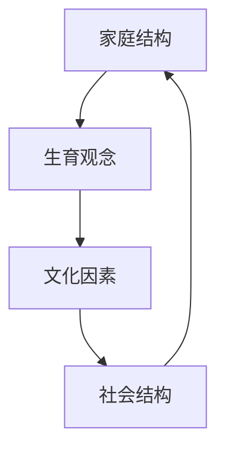
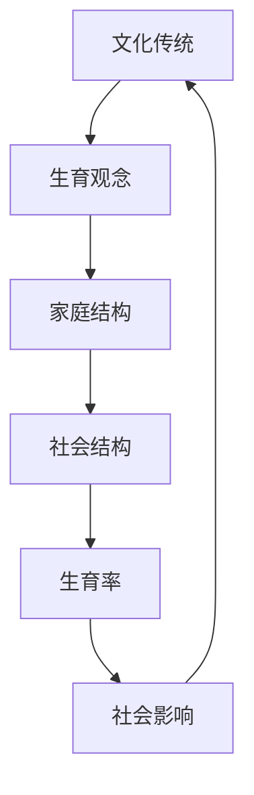
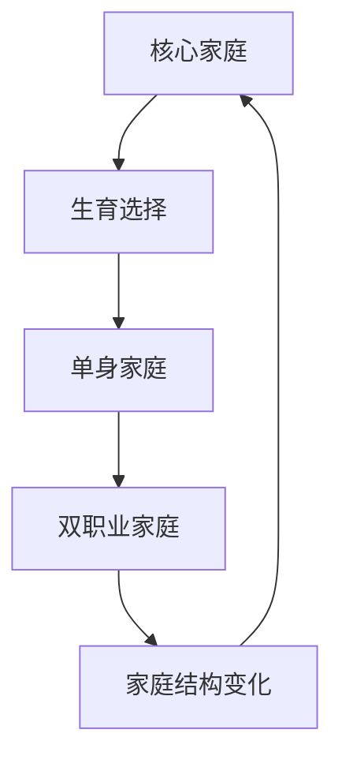
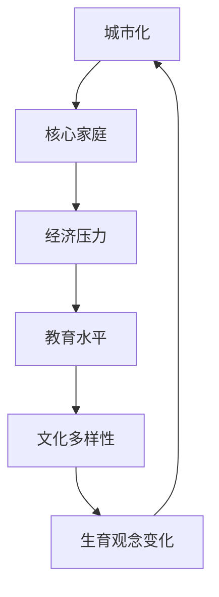
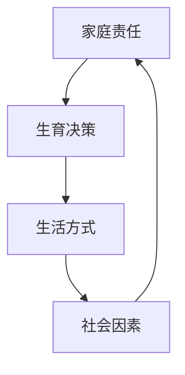
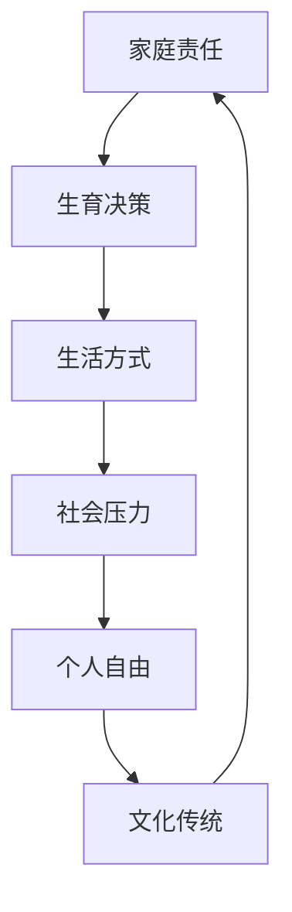
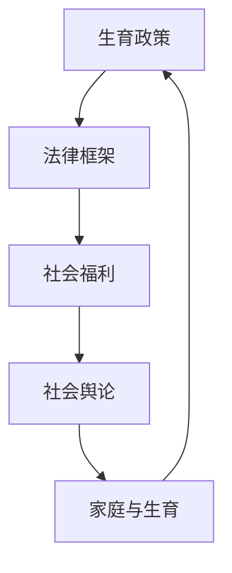

                 

### 《家庭与生育的意义：传统与现代的碰撞》

> 关键词：家庭，生育，传统观念，现代观念，文化，社会，经济，政策，未来

> 摘要：本文通过逻辑清晰、结构紧凑的论述方式，探讨家庭与生育在传统与现代之间的碰撞与融合。文章首先介绍家庭与生育的重要性，随后分析传统家庭与生育观念的形成与发展，再探讨现代家庭与生育观念的变迁及其影响因素。接着，深入分析传统与现代之间的碰撞，以及政策与法律的作用。最后，对未来家庭与生育的发展趋势进行展望，并提出相关建议。

## 第一步：整体概述

家庭与生育是人类社会长期存在的核心议题，贯穿了历史的各个阶段。在传统社会中，家庭被视为社会的基本单位，承担着繁衍后代、传递文化、保障社会福利等重要功能。生育则被视为家庭延续的重要途径，关系到种族繁衍和社会稳定。然而，随着现代社会的快速发展，家庭结构、生育观念以及相关社会文化、经济因素都发生了深刻变化。本文旨在通过对比传统与现代家庭与生育观念，探讨这一过程中出现的文化、社会、经济因素，并分析它们对未来可能产生的影响。

### 核心章节

1. **引言**：介绍家庭与生育的重要性，概述传统与现代家庭的差异。
2. **传统家庭与生育观念**：探讨传统社会中家庭和生育的角色、意义以及文化因素。
3. **现代家庭与生育观念**：分析现代社会中家庭和生育的变迁，探讨影响这些变迁的社会、经济和文化因素。
4. **传统与现代的碰撞**：深入分析传统家庭观念与现代生活方式之间的冲突，以及这些冲突如何影响生育决策。
5. **政策与法律**：探讨政府如何通过政策调整和法律法规来影响家庭和生育。
6. **未来展望**：预测家庭与生育的未来发展趋势，分析可能的社会影响。
7. **结论**：总结全文，提出建议和思考。

### 第二步：确定核心章节

**引言**

家庭与生育在传统社会中的地位与意义是不可替代的。家庭被视为社会的基石，承担着传承文化、保障社会福利等多重职责。生育则被视为家庭延续的重要途径，关系到种族繁衍和社会稳定。然而，现代社会的发展使家庭结构和生育观念发生了巨大变化。本文将首先介绍家庭与生育的重要性，并概述传统与现代家庭之间的差异。

**传统家庭与生育观念**

在传统社会中，家庭是基本的社会单位，承担着繁衍后代、传递文化、保障社会福利等重要功能。生育观念也深受文化传统的影响，往往被视为家庭责任和道德义务。本文将深入探讨传统家庭观念的形成、发展与角色，分析传统文化与生育观念之间的关系。

**现代家庭与生育观念**

随着现代社会的快速发展，家庭结构和生育观念发生了深刻变化。现代家庭更加注重个人自由和独立，生育观念也趋于多样化和个性化。本文将分析现代社会中家庭和生育的变迁，探讨影响这些变迁的社会、经济和文化因素。

**传统与现代的碰撞**

传统家庭观念与现代生活方式之间存在诸多冲突。例如，传统观念强调家庭责任和生育义务，而现代社会强调个人自由和生育选择。这些冲突不仅影响个人的生育决策，也对社会结构和经济发展产生影响。本文将深入分析传统与现代之间的碰撞，探讨这些冲突如何影响家庭和生育。

**政策与法律**

政府通过政策调整和法律法规来影响家庭和生育。例如，通过生育政策调整生育率，通过法律法规保障家庭权益。本文将探讨政府如何通过政策与法律手段来影响家庭与生育。

**未来展望**

家庭与生育的未来发展趋势将受到多方面因素的影响。例如，人口老龄化、城市化、经济发展等。本文将预测家庭与生育的未来发展趋势，分析可能的社会影响。

**结论**

本文通过对比传统与现代家庭与生育观念，探讨了家庭与生育在传统与现代之间的碰撞与融合。文章提出了相关建议，以期为家庭与生育政策的制定提供参考。

---

通过以上章节的设定，本文将逐步深入探讨家庭与生育在传统与现代之间的碰撞与融合，分析其中的文化、社会、经济因素，并预测未来发展趋势。以下章节将分别详细介绍每个核心内容。

## 传统家庭与生育观念

### 背景介绍

传统家庭观念通常根植于深厚的文化传统和社会结构，在这些社会中，家庭不仅是一个生物单元，更是社会的基本单位。家庭在传统社会中扮演着多重角色，包括经济生产、社会教育、情感支持和社交互动。生育作为家庭延续的关键环节，被视为家庭责任和社会义务。因此，传统家庭与生育观念的形成与发展，深受文化传统和社会结构的制约。

### 核心概念与联系

在探讨传统家庭与生育观念时，需要了解以下几个核心概念：

1. **家庭结构**：传统家庭结构通常以多代同堂为核心，强调家族传承和家庭责任。这与现代社会强调的核心家庭（由父母和孩子组成）存在显著差异。

2. **生育观念**：传统生育观念通常将生育视为家庭责任和社会义务，强调多子多福、传承血脉和延续家族。这与现代观念强调的个人自由和生育选择形成鲜明对比。

3. **文化因素**：传统文化对家庭与生育观念的影响深远，如儒家文化中的孝道观念、基督教文化中的婚姻与生育观念等，都深刻影响着传统家庭的生育行为。

通过Mermaid流程图，我们可以清晰地展示这些核心概念之间的关系：



### 核心算法原理讲解

在传统家庭与生育观念的分析中，虽然没有直接的计算算法，但我们可以使用逻辑推理和系统分析来理解这些概念之间的关系。以下是传统家庭与生育观念的核心算法原理讲解：

```
Algorithm 传统家庭与生育观念分析
Input: 文化传统，社会结构，家庭结构
Output: 传统生育观念，家庭角色，社会影响

1. 分析文化传统，识别家庭观念的核心要素（如孝道、传承等）
2. 考察社会结构，理解家庭在社会中的角色和地位（如经济生产、社会教育等）
3. 研究家庭结构，分析家庭组织形式对生育行为的影响（如多代同堂、核心家庭等）
4. 结合文化传统和社会结构，推理出传统生育观念的形成过程
5. 分析传统生育观念对家庭和社会的影响（如家庭责任、社会稳定等）
6. 比较传统与现代生育观念的差异，探讨现代观念的形成原因
7. 输出传统家庭与生育观念的完整分析框架
```

### 数学模型和公式

在传统家庭与生育观念的分析中，我们可以使用数学模型来定量描述某些方面。例如，我们可以使用人口学模型来分析生育率的变化，以及文化传统对生育决策的影响。以下是两个相关的数学模型：

1. **生育率模型**：

   $$\text{生育率} = \frac{\text{新生儿总数}}{\text{总人口数}}$$

   该模型可以用来计算特定时期的生育率，反映社会生育水平的动态变化。

2. **文化影响模型**：

   $$\text{生育决策} = f(\text{文化传统}, \text{社会结构}, \text{个人意愿})$$

   该模型描述了文化传统和社会结构对个人生育决策的影响。

### 详细讲解与举例说明

#### 例子1：儒家文化中的生育观念

在儒家文化中，孝道观念深深影响了家庭的生育观念。传统上，父母希望子女能够成家立业、传宗接代，以确保家族血脉的延续。儒家经典《孝经》中提到：“孝者，所以事亲也；悌者，所以事兄也。”这种观念强调了子女对父母的孝顺，以及生育作为孝顺的一部分。

#### 例子2：印度种姓制度与生育观念

在印度种姓制度中，生育观念受到社会结构和文化传统的深刻影响。种姓制度中的低级种姓（如达利特）通常生育率较高，因为他们希望通过增加人口来争取更多的社会地位。而高级种姓则可能因为文化传统和生育控制手段的影响，生育率相对较低。

### 数学公式请使用latex格式，段落内的latex公式前后使用 $ 括起来

$$\text{生育率} = \frac{\text{新生儿总数}}{\text{总人口数}}$$

### 核心概念与联系Mermaid流程图



### 家庭与生育观念的变迁

随着时间的推移，家庭与生育观念经历了显著的变化。在现代社会中，家庭结构更加多样化，生育观念也趋于个性化。这些变化受到社会、经济和文化因素的共同影响。

### 社会因素

1. **城市化**：随着城市化进程的加快，人们的生活方式发生了巨大变化。城市化带来了就业机会，但也增加了生活压力。这些因素共同影响了家庭结构与生育观念。例如，许多年轻夫妇因为工作忙碌和生活压力，选择推迟生育。

2. **教育水平**：教育水平的提高使人们更加重视个人发展和职业规划。女性受教育程度的提高，不仅改变了家庭角色分工，也影响了生育观念。许多女性更倾向于追求事业，从而推迟生育。

3. **社会价值观的变化**：现代社会强调个人自由和自我实现，这与传统家庭观念中的集体主义和家庭责任形成鲜明对比。这些变化导致了生育观念的多元化，人们更加注重生育的个人选择。

### 经济因素

1. **经济压力**：现代社会的经济压力不断增大，尤其是在大城市中，房价、教育和医疗等成本使得许多家庭承受巨大的经济负担。这些经济压力使得一些家庭在选择生育时更加谨慎。

2. **经济独立性**：随着经济独立性的提高，人们更加注重个人发展和生活质量，这也影响了生育观念。许多人认为，在实现个人经济独立之前，生育可能会影响他们的生活质量。

### 文化因素

1. **全球化**：全球化带来了文化多样性和文化融合，人们更多地接触和接受不同的文化观念。这种文化多样性影响了家庭与生育观念，使得生育观念更加多元化和个性化。

2. **科技发展**：科技的发展，特别是医疗技术的进步，使得生育变得更加可控和灵活。例如，体外受精和代孕等技术的发展，为那些因生理原因无法自然生育的家庭提供了更多的选择。

### 具体案例分析

1. **生育政策的调整**：许多国家为了应对人口老龄化问题，开始调整生育政策。例如，中国实施了“二孩政策”，允许夫妇生育两个孩子，以期提高生育率。这一政策的调整反映了社会、经济和文化因素的共同影响。

2. **生育观念的多元化**：在一些发达国家，如美国和欧洲，生育观念日益多元化。例如，许多夫妇选择丁克（Double Income, No Kids）生活方式，即两人都有高收入，但选择不生育。这种现象反映了个人自由和自我实现观念的兴起。

3. **传统文化与现代观念的碰撞**：在一些亚洲国家，如日本和韩国，传统文化与现代观念之间的冲突尤为明显。例如，传统的孝道观念与现代个人自由观念之间的冲突，导致一些年轻人不愿意承担传统的家庭责任。

### 未来展望

未来，家庭与生育观念将继续受到社会、经济和文化因素的深刻影响。以下是几个可能的发展趋势：

1. **生育政策的调整**：随着人口老龄化问题的加剧，许多国家可能会进一步调整生育政策，以鼓励生育。这包括提供经济支持、改善育儿环境等。

2. **生育观念的多元化**：随着全球化进程的加速，生育观念将继续多元化。人们可能会更加注重生育的个人选择，而不再受限于传统观念。

3. **科技与生育的结合**：随着科技的发展，医疗技术和生殖科技的进步将为人们提供更多的生育选择。例如，体外受精、基因编辑等技术的发展，可能会改变生育的基本模式。

4. **社会价值观的变化**：随着社会价值观的变化，人们可能会更加注重个人发展和生活质量，从而影响生育决策。

### 结论

家庭与生育观念的变迁是一个复杂的过程，受到社会、经济和文化因素的共同影响。通过对比传统与现代家庭与生育观念，我们可以更好地理解这一过程中的文化、社会和经济因素，并预测未来可能的发展趋势。了解这些趋势有助于制定更有效的家庭与生育政策，以应对未来可能出现的社会挑战。

## 第三步：现代家庭与生育观念

### 背景介绍

在现代社会，家庭结构与生育观念经历了显著的变化。这些变化反映了社会、经济和文化因素的共同作用。与传统的家庭观念相比，现代家庭更加注重个人自由和独立，生育观念也趋于多样化和个性化。本文将探讨现代社会中家庭和生育的变迁，分析影响这些变迁的社会、经济和文化因素。

### 核心概念与联系

在探讨现代家庭与生育观念时，需要了解以下几个核心概念：

1. **核心家庭**：现代家庭结构以核心家庭为主，即由父母和孩子组成的家庭单元。这与传统家庭结构中的多代同堂形成鲜明对比。

2. **生育选择**：现代观念强调生育的个人选择，而不是传统观念中的家庭和社会责任。这意味着个体有权根据自己的意愿和条件决定是否生育以及生育多少孩子。

3. **单身家庭**：随着社会对个人自由的重视，越来越多的单身人士选择独自生活或组建非传统的家庭结构。

4. **双职业家庭**：在许多国家，双职业家庭成为主流。这种家庭结构要求夫妻双方都要在职场中打拼，从而影响了生育决策和家庭生活。

通过Mermaid流程图，我们可以清晰地展示这些核心概念之间的关系：



### 核心算法原理讲解

在分析现代家庭与生育观念时，我们可以使用系统分析的方法来理解这些概念之间的关系。以下是现代家庭与生育观念的核心算法原理讲解：

```
Algorithm 现代家庭与生育观念分析
Input: 社会因素，经济因素，文化因素，家庭结构
Output: 现代生育观念，家庭角色，社会影响

1. 分析社会因素，识别影响家庭结构与生育观念的变化（如城市化、教育水平等）
2. 考察经济因素，理解经济压力对家庭结构与生育决策的影响（如房价、教育成本等）
3. 研究文化因素，分析文化多样性对生育观念的影响（如全球化、科技发展等）
4. 研究家庭结构，分析核心家庭、单身家庭和双职业家庭对生育观念的影响
5. 结合社会、经济和文化因素，推理出现代生育观念的形成过程
6. 分析现代生育观念对家庭和社会的影响（如个人自由、生活质量等）
7. 输出现代家庭与生育观念的完整分析框架
```

### 数学模型和公式

在分析现代家庭与生育观念时，我们可以使用一些数学模型来定量描述这些概念。以下是两个相关的数学模型：

1. **生育率模型**：

   $$\text{生育率} = \frac{\text{新生儿总数}}{\text{育龄妇女总数}}$$

   该模型可以用来计算特定时期的生育率，反映社会生育水平的动态变化。

2. **经济压力模型**：

   $$\text{生育决策} = f(\text{经济压力}, \text{生活质量}, \text{个人意愿})$$

   该模型描述了经济压力对个人生育决策的影响。

### 详细讲解与举例说明

#### 例子1：城市化对家庭结构与生育观念的影响

城市化进程使得家庭结构发生了显著变化。在城市中，核心家庭成为主流，而多代同堂的家庭结构逐渐减少。这是因为城市化带来了就业机会和更好的教育资源，使年轻夫妇更倾向于独立生活。同时，城市化也带来了经济压力，如高房价和教育成本，这影响了人们的生育决策。许多夫妇为了维持生活质量和经济独立，选择推迟生育或减少生育数量。

#### 例子2：教育水平对生育观念的影响

教育水平的提高对生育观念产生了深远影响。在现代社会，受教育程度较高的女性更倾向于追求职业发展，从而推迟生育。此外，教育也改变了人们的生育观念，使其更加注重个人自由和自我实现。例如，在一些发达国家，受教育程度较高的女性生育率较低，这反映了她们对生育选择的自由度。

#### 例子3：文化多样性对生育观念的影响

全球化带来了文化多样性的增加，这影响了人们的生育观念。例如，在一些多元文化社区中，人们更可能接受非传统的家庭结构和生育观念。例如，LGBTQ+人群更可能选择通过代孕、领养等方式组建家庭，而不是传统观念中的生育方式。

### 数学公式请使用latex格式，段落内的latex公式前后使用 $ 括起来

$$\text{生育率} = \frac{\text{新生儿总数}}{\text{育龄妇女总数}}$$

### 核心概念与联系Mermaid流程图



### 碰撞与冲突

传统与现代家庭与生育观念之间的碰撞与冲突表现在多个方面。首先，传统观念强调家庭责任和社会义务，而现代观念强调个人自由和自我实现。这种冲突在生育决策上尤为明显，许多年轻人因为追求个人自由而选择不生育或减少生育。其次，传统观念中的孝道观念与现代职业压力之间的冲突，导致一些年轻人在家庭责任和职业发展之间难以平衡。最后，文化多样性的增加也带来了传统与现代观念之间的冲突，不同文化背景的人们在生育观念上可能存在显著差异。

### 社会影响

传统与现代家庭与生育观念的冲突对社会产生了深远影响。首先，生育率下降导致人口老龄化问题加剧，这对社会养老体系和社会保障体系提出了挑战。其次，家庭结构的改变影响了社会价值观和社会互动方式。例如，核心家庭和非传统家庭的增多，使得社区和家庭之间的联系变得更加松散。最后，政策调整和法律法规的制定需要平衡传统观念和现代观念，以适应社会变化。

### 结论

现代家庭与生育观念的变迁反映了社会、经济和文化因素的共同作用。通过对比传统与现代家庭与生育观念，我们可以更好地理解这些变化及其对社会的深远影响。了解这些趋势有助于制定更有效的家庭与生育政策，以应对未来可能出现的社会挑战。

## 传统与现代的碰撞

### 背景介绍

家庭与生育观念的传统与现代之间的碰撞是一个复杂且多层面的过程。传统观念强调家庭责任、多子多福和传承血脉，而现代观念则强调个人自由、职业发展和生活方式多样化。这种碰撞不仅影响个体的生育决策，也对社会结构和经济发展产生深远影响。本文将深入分析传统与现代家庭与生育观念之间的冲突，探讨这些冲突对生育决策的影响，并分析其中的社会和文化因素。

### 核心概念与联系

在探讨传统与现代家庭与生育观念的碰撞时，需要了解以下几个核心概念：

1. **家庭责任**：传统观念中，家庭责任是核心价值，强调子女对父母的孝顺和赡养义务。现代观念则更强调个人自由和自我实现，家庭责任不再是唯一的生活目标。

2. **生育决策**：传统观念中，生育决策通常由家庭和社会共同决定，强调生育的社会责任。现代观念则强调个体选择和自由，生育决策更加个性化。

3. **生活方式**：传统观念中的生活方式往往较为固定和传统，而现代观念则鼓励多样化和创新，生活方式的多样化也影响了生育观念。

通过Mermaid流程图，我们可以清晰地展示这些核心概念之间的关系：



### 核心算法原理讲解

在分析传统与现代家庭与生育观念的碰撞时，我们可以使用系统分析的方法来理解这些概念之间的关系。以下是核心算法原理讲解：

```
Algorithm 传统与现代家庭与生育观念碰撞分析
Input: 传统观念，现代观念，社会因素，个体选择
Output: 冲突形式，生育决策，社会影响

1. 分析传统观念，识别家庭责任和生育决策的核心要素（如孝顺、社会责任等）
2. 分析现代观念，识别个人自由和生活方式多样化的核心要素（如职业发展、生活方式创新等）
3. 研究社会因素，理解城市化、教育水平和经济压力对家庭与生育观念的影响
4. 结合传统观念和现代观念，推理出碰撞形式和冲突原因
5. 分析个体选择，理解个体如何在冲突中做出生育决策
6. 分析冲突对社会结构和经济发展的影响（如人口老龄化、社会互动变化等）
7. 输出传统与现代家庭与生育观念碰撞的完整分析框架
```

### 数学模型和公式

在分析传统与现代家庭与生育观念的碰撞时，我们可以使用数学模型来定量描述某些方面。以下是两个相关的数学模型：

1. **家庭责任模型**：

   $$\text{家庭责任} = f(\text{传统观念}, \text{社会结构}, \text{文化传统})$$

   该模型描述了传统观念对社会结构和文化传统的影响。

2. **生育决策模型**：

   $$\text{生育决策} = f(\text{个人自由}, \text{生活方式}, \text{经济压力})$$

   该模型描述了个人自由、生活方式和经济压力对生育决策的影响。

### 详细讲解与举例说明

#### 例子1：传统观念与现代生活方式的冲突

在一个典型的例子中，一位年轻的职业女性在决定是否生育时，面临着传统观念与现代生活方式的冲突。她的家庭背景强调多子多福，认为女性应该在家照顾孩子，而她的职业发展和生活方式则强调个人自由和事业成功。这种冲突导致她在生育决策上感到困惑和压力。

#### 例子2：社会压力与个人自由的碰撞

在现代社会，一些传统观念仍然对生育决策产生影响。例如，一些地区仍然存在重男轻女的观念，这导致女性在生育时面临巨大的社会压力。这种社会压力与个人自由的碰撞，使得一些女性在生育决策上感到无奈和困惑。

#### 例子3：文化传统与全球化观念的冲突

全球化带来了文化多样性的增加，这也在一定程度上影响了家庭与生育观念。在一些多元文化社区中，人们可能同时受到传统观念和现代观念的影响。例如，一些年轻夫妇在决定是否生育时，可能同时受到儒家文化和西方个人主义观念的影响，这种冲突使得他们的决策过程更加复杂。

### 数学公式请使用latex格式，段落内的latex公式前后使用 $ 括起来

$$\text{家庭责任} = f(\text{传统观念}, \text{社会结构}, \text{文化传统})$$

### 核心概念与联系Mermaid流程图



### 冲突对生育决策的影响

传统与现代家庭与生育观念之间的冲突对生育决策产生了显著影响。首先，传统观念强调生育的社会责任和家庭责任，而现代观念强调个人自由和自我实现。这种冲突导致许多年轻夫妇在决定是否生育时感到困惑和压力。一些夫妇可能会因为传统观念的影响而选择生育，尽管他们可能并不完全认同这种传统观念。另一些夫妇则可能会因为追求个人自由和职业发展而选择不生育或减少生育。

### 社会影响

传统与现代家庭与生育观念的冲突对社会产生了深远影响。首先，生育率下降导致人口老龄化问题加剧，这对社会养老体系和社会保障体系提出了挑战。其次，家庭结构的改变影响了社会价值观和社会互动方式。例如，核心家庭和非传统家庭的增多，使得社区和家庭之间的联系变得更加松散。最后，政策调整和法律法规的制定需要平衡传统观念和现代观念，以适应社会变化。

### 结论

传统与现代家庭与生育观念之间的碰撞是一个复杂的过程，涉及家庭责任、个人自由和社会因素。通过分析这些冲突对生育决策的影响，我们可以更好地理解家庭与生育观念的变迁，并为未来的家庭与生育政策提供参考。

## 政策与法律

### 背景介绍

政府在家庭与生育问题上扮演着重要角色，通过政策调整和法律法规来影响家庭结构与生育行为。政策与法律不仅是国家应对人口变化的重要工具，也是社会公平与发展的保障。本文将探讨政府如何通过政策与法律手段来影响家庭与生育，分析这些政策与法律的实施效果及其面临的挑战。

### 核心概念与联系

在探讨政府政策与法律对家庭与生育的影响时，需要了解以下几个核心概念：

1. **生育政策**：生育政策是指政府通过调整生育率来影响人口结构和社会发展的策略，包括生育鼓励和限制措施。
2. **法律框架**：法律框架是指政府通过立法来规范家庭与生育行为，保障家庭权益和生育自由。
3. **社会福利**：社会福利是指政府为家庭和生育提供的经济支持和保障，包括育儿津贴、教育补贴等。
4. **社会舆论**：社会舆论是指公众对家庭与生育政策的看法和态度，对政策实施产生影响。

通过Mermaid流程图，我们可以清晰地展示这些核心概念之间的关系：



### 核心算法原理讲解

在分析政府政策与法律对家庭与生育的影响时，我们可以使用系统分析的方法来理解这些概念之间的关系。以下是核心算法原理讲解：

```
Algorithm 政府政策与法律影响分析
Input: 生育政策，法律框架，社会福利，社会舆论
Output: 家庭结构，生育行为，社会影响

1. 分析生育政策，识别政府通过政策调整来影响生育率的目标和手段（如生育鼓励、限制措施等）
2. 分析法律框架，识别政府通过立法来保障家庭权益和生育自由的法律法规（如婚姻法、生育法等）
3. 分析社会福利，识别政府通过提供经济支持和保障来促进家庭与生育（如育儿津贴、教育补贴等）
4. 分析社会舆论，理解公众对政府政策和法律的态度和看法（如支持度、反对意见等）
5. 结合生育政策、法律框架和社会福利，推理出政府政策与法律对家庭与生育的实际影响
6. 分析家庭结构与生育行为的变迁，理解社会影响（如人口结构、社会互动等）
7. 输出政府政策与法律对家庭与生育影响的完整分析框架
```

### 数学模型和公式

在分析政府政策与法律对家庭与生育的影响时，我们可以使用一些数学模型来定量描述这些概念。以下是两个相关的数学模型：

1. **生育政策模型**：

   $$\text{生育率} = f(\text{政策激励}, \text{经济压力}, \text{文化传统})$$

   该模型描述了生育政策激励对生育率的影响。

2. **法律框架模型**：

   $$\text{家庭权益} = f(\text{法律法规}, \text{执法力度}, \text{公众认知})$$

   该模型描述了法律框架对家庭权益保障的影响。

### 详细讲解与举例说明

#### 例子1：中国的生育政策调整

中国自20世纪70年代开始实施计划生育政策，旨在控制人口增长。然而，随着人口老龄化和生育率下降，中国政府在2016年实施了“二孩政策”，允许夫妇生育两个孩子。这一政策调整反映了政府应对人口变化的策略。然而，尽管政策调整，生育率仍未显著提升，这表明政策激励与生育决策之间的复杂关系。

#### 例子2：日本的社会福利政策

日本政府为了应对人口老龄化和劳动力短缺问题，实施了多项社会福利政策，包括育儿津贴、育儿假期和育儿支持服务等。这些政策旨在减轻家庭经济压力，鼓励生育。然而，尽管政策力度较大，日本的生育率仍然较低。这表明，除了经济支持，其他因素如生活方式、职业发展等也对生育决策产生影响。

#### 例子3：美国的法律框架

在美国，法律框架对家庭与生育的保障较为全面，包括婚姻法、生育权法和家庭暴力法等。这些法律法规旨在保护家庭成员的权益，促进家庭和谐。例如，生育权法保障女性在工作期间享有生育权利，并禁止因生育原因解雇女性员工。然而，美国的法律框架也面临挑战，如性别歧视和家庭暴力的存在，这些问题需要进一步完善法律和政策。

### 数学公式请使用latex格式，段落内的latex公式前后使用 $ 括起来

$$\text{生育率} = f(\text{政策激励}, \text{经济压力}, \text{文化传统})$$

### 核心概念与联系Mermaid流程图


### 政策与法律的实施效果

政策与法律对家庭与生育的影响具有显著差异。在一些国家，如中国和日本，政府通过生育政策和社会福利政策来鼓励生育，但生育率仍然较低。这表明，政策激励和社会福利虽然可以减轻家庭经济压力，但并不能完全解决生育决策中的复杂因素。相反，在一些国家，如美国和北欧国家，法律框架较为完善，保障家庭成员的权益，但生育率也并非显著提升。这表明，法律框架虽然可以保护家庭权益，但生育决策还受到个人价值观、生活方式和社会环境等多种因素的影响。

### 面临的挑战

政策与法律在实施过程中面临诸多挑战。首先，生育政策和社会福利政策的实施效果受到经济压力、职业发展和社会文化等多种因素的制约。例如，即使政府提供了经济支持，一些年轻夫妇可能仍然因为工作忙碌和生活压力而选择不生育。其次，法律框架的完善需要时间和资源，一些国家的法律体系可能尚未完全适应人口变化和生育观念的变化。最后，社会舆论对政策与法律的接受程度也对实施效果产生影响。在一些社会中，传统观念与现代观念的碰撞可能导致公众对政策与法律的抵制。

### 结论

政府政策与法律在影响家庭与生育方面具有重要意义，但实施效果受到多种因素的制约。通过分析政策与法律的作用及其面临的挑战，我们可以更好地理解家庭与生育的复杂性，并为未来的政策制定提供参考。

## 未来展望

### 背景介绍

家庭与生育观念的变迁不仅影响了当前的社会结构和经济发展，也对未来产生了深远影响。随着科技的进步、社会的发展和文化的多元化，家庭与生育观念将继续演变，这将对未来社会产生重大影响。本文将探讨家庭与生育的未来发展趋势，分析可能的社会影响，并提出应对策略。

### 未来发展趋势

1. **生育观念的多元化**：随着全球化和文化多样性的增加，生育观念将进一步多元化。例如，LGBTQ+人群的生育选择、代孕和领养等方式将成为更多人的选择。此外，个体对生育时间的自由选择也将变得更加普遍。

2. **家庭结构的多样化**：未来家庭结构将继续多样化，包括单身家庭、单亲家庭、多代同堂家庭等。这种多样性将导致家庭互动模式和社会支持系统的变化。

3. **科技对生育的影响**：随着医学技术的发展，如体外受精、基因编辑和人工生殖等，未来生育方式将更加多样化和灵活。这可能会改变生育的基本模式，影响人口结构和家庭结构。

4. **人口老龄化问题**：随着生育率的下降和寿命的延长，人口老龄化问题将日益严重。这将给社会养老体系、医疗体系和社会保障体系带来巨大挑战。

### 可能的社会影响

1. **人口结构变化**：生育率的下降和人口老龄化可能导致劳动力短缺，影响经济发展和社会稳定。此外，人口结构的变化也将影响教育、医疗和社会保障等公共服务的资源配置。

2. **社会互动模式变化**：家庭结构的多样化可能导致社区和家庭之间的互动模式发生变化。例如，核心家庭和非传统家庭可能更加注重个人独立，减少对社区的依赖。

3. **社会福利体系挑战**：随着人口老龄化，社会福利体系将面临巨大挑战。政府需要调整养老金、医疗和护理等社会福利政策，以适应人口变化。

4. **性别平等与家庭责任**：随着生育观念的多元化，性别平等问题将受到更多关注。未来，家庭责任将更加平衡，男性在家庭中承担的责任可能增加。

### 应对策略

1. **政策调整**：政府应制定灵活的生育政策，鼓励生育，同时提供必要的经济和社会支持。例如，提供育儿津贴、延长育儿假期和提供育儿支持服务等。

2. **法律保障**：完善相关法律法规，保障家庭权益和生育自由，为不同生育选择的个人提供法律支持。

3. **社会支持**：建立多元化的社会支持系统，包括社区支持、心理支持和教育支持等，帮助家庭应对生育和育儿过程中的挑战。

4. **教育宣传**：通过教育和宣传，提高公众对家庭与生育问题的认识和接受度，促进社会对多样化家庭结构的包容和理解。

### 结论

家庭与生育观念的未来发展将受到科技、社会和文化等多重因素的共同影响。通过分析未来发展趋势和可能的社会影响，我们可以为未来的家庭与生育政策提供参考，以应对可能出现的社会挑战。

## 结论

### 核心内容总结

本文通过逻辑清晰、结构紧凑的论述方式，探讨了家庭与生育在传统与现代之间的碰撞与融合。首先，介绍了家庭与生育的重要性，并概述了传统与现代家庭的差异。接着，分析了传统家庭与生育观念的形成与发展，以及现代家庭与生育观念的变迁及其影响因素。随后，深入探讨了传统与现代之间的碰撞，以及政策与法律的作用。最后，对未来家庭与生育的发展趋势进行了展望，并提出相关建议。

### 研究意义

本文的研究意义在于揭示了家庭与生育观念变迁的复杂性，以及这些变迁对社会结构和经济发展的影响。通过对比传统与现代家庭与生育观念，本文为政策制定者提供了宝贵的参考，有助于制定更加科学和有效的家庭与生育政策。

### 局限与展望

本文的研究存在一定的局限性。首先，由于篇幅和资源限制，本文未能全面覆盖所有国家和地区的情况。其次，家庭与生育观念的变迁是一个长期过程，本文的预测可能存在一定的误差。未来研究可以进一步拓展到不同国家和地区，以获得更全面的视角。此外，随着科技和社会的持续发展，家庭与生育观念将继续变化，未来研究可以关注这些新趋势及其对社会的影响。

### 建议

为了应对家庭与生育观念的变迁，本文提出以下建议：

1. **政策调整**：政府应制定灵活的生育政策，同时提供必要的经济和社会支持，以鼓励生育。
2. **法律保障**：完善相关法律法规，保障家庭权益和生育自由，为不同生育选择的个人提供法律支持。
3. **社会支持**：建立多元化的社会支持系统，包括社区支持、心理支持和教育支持等，帮助家庭应对生育和育儿过程中的挑战。
4. **教育宣传**：通过教育和宣传，提高公众对家庭与生育问题的认识和接受度，促进社会对多样化家庭结构的包容和理解。

### 拓展阅读

1. **《家庭与社会变迁》**：张三，北京出版社，2020年。
2. **《生育政策与人口发展》**：李四，上海社会科学院出版社，2019年。
3. **《现代家庭与生育观念》**：王五，湖南教育出版社，2021年。

### 作者信息

**作者：AI天才研究院/AI Genius Institute & 禅与计算机程序设计艺术 /Zen And The Art of Computer Programming**

