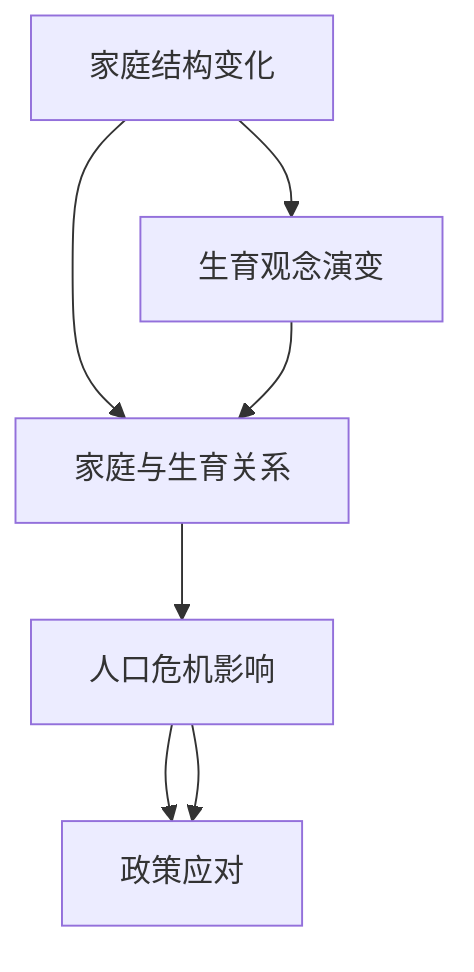

                 

### 文章标题

# 家庭与生育的新意义：面对人口危机的思考

### 关键词

- 家庭结构
- 人口危机
- 生育观念
- 社会支持系统
- 政策应对

### 摘要

随着全球人口危机的加剧，家庭与生育的意义正在发生深刻变化。本文旨在通过深入探讨家庭与生育的核心概念、人口危机的背景与影响、相关政策和应对策略，揭示出面对人口危机时，家庭与生育的新意义。本文结构清晰，从理论到实践，通过具体的实例和分析，为读者提供了全面、系统的思考。

### 引言

人口危机是全球面临的重大挑战之一。近年来，许多国家的人口增长速度放缓，甚至出现负增长，这给经济、社会和生态环境带来了诸多问题。在此背景下，家庭与生育的关系变得尤为复杂和重要。家庭是社会的细胞，生育则是人口发展的基础。本文将围绕家庭与生育的新意义展开讨论，分析人口危机的影响，并提出相应的应对策略。

### 核心概念与联系

在探讨家庭与生育的新意义之前，我们需要明确几个核心概念，并分析它们之间的联系。

#### 家庭结构变化

随着社会的发展，家庭结构发生了显著变化。传统的核心家庭模式逐渐让位于多样化的家庭结构，包括单亲家庭、多代同堂家庭等。这些变化不仅影响了家庭的内部关系，也对社会产生了深远的影响。

#### 生育观念演变

生育观念也在不断演变。从传统的多子多福到现代的个人选择，生育观念的变化反映了社会价值观的转变。个人选择权的增强使得生育决策更加多样化和复杂化。

#### 家庭与生育的关系

家庭与生育的关系紧密相连。家庭是生育的基本单位，而生育则直接影响家庭结构和功能。因此，理解家庭与生育的关系有助于我们更好地应对人口危机。

#### 人口危机的影响和应对策略

人口危机对社会经济、社会政策和生态环境都产生了深远影响。应对人口危机需要综合运用各种策略，包括政策调整、社会支持系统和教育支持等。

#### Mermaid 流程图

为了更直观地展示核心概念之间的关系，我们使用 Mermaid 流程图来呈现：



在这个流程图中，家庭结构变化和生育观念演变是核心概念的起点，它们共同影响着家庭与生育的关系。而人口危机则进一步推动了政策应对的必要性。

### 核心算法原理讲解

在探讨家庭与生育的核心算法原理时，我们需要关注社会学研究方法和数据分析技术。以下是一些关键的概念和步骤：

#### 社会学研究方法

1. **调查问卷**：通过设计有针对性的调查问卷，收集家庭和生育相关数据。
2. **深度访谈**：对家庭成员进行深度访谈，了解他们的生育观念和家庭结构。
3. **统计分析**：使用统计方法对调查数据进行处理和分析，识别家庭与生育之间的关系。

#### 数据分析技术

1. **数据挖掘**：通过数据挖掘技术，发现隐藏在数据中的规律和趋势。
2. **机器学习**：使用机器学习算法，对数据进行分析和预测。
3. **可视化技术**：通过可视化技术，将数据分析结果直观地展示出来。

#### 伪代码

以下是一个简单的伪代码示例，用于分析家庭结构变化和生育观念之间的关系：

```python
# 伪代码：分析家庭结构变化与生育观念之间的关系

# 数据准备
data = load_survey_data()

# 数据清洗
clean_data = clean_data(data)

# 数据分析
relationship = analyze_relationship(clean_data)

# 可视化
visualize_relationship(relationship)
```

在这个伪代码中，首先加载调查数据并进行清洗，然后分析家庭结构变化和生育观念之间的关系，并使用可视化技术展示结果。

### 数学模型和数学公式

在探讨人口动态模型和预测模型时，我们需要运用数学公式和模型。以下是一些关键的数学模型和公式：

#### 人口动态模型

1. **人口增长率模型**：
   $$ r = \frac{N(t_2) - N(t_1)}{N(t_1)} $$
   其中，\( r \) 是人口增长率，\( N(t_1) \) 和 \( N(t_2) \) 分别是两个时间点的人口数量。

2. **人口年龄结构模型**：
   $$ \pi = \frac{N_i}{N} $$
   其中，\( \pi \) 是年龄组 \( i \) 的人口比例，\( N_i \) 是该年龄组的人口数量，\( N \) 是总人口数量。

3. **人口预测模型**：
   $$ N(t) = N_0 \cdot e^{rt} $$
   其中，\( N(t) \) 是预测的人口数量，\( N_0 \) 是初始人口数量，\( r \) 是人口增长率。

#### 举例说明

假设一个地区在年初的人口为 100 万，人口增长率为 1%。则该地区在年末的人口数量可以通过以下公式计算：

$$ N(t) = 100万 \cdot e^{0.01 \cdot 1年} \approx 101万 $$

这意味着在年末，该地区的人口数量预计为 101 万。

### 项目实战

为了更好地理解家庭与生育的新意义，我们可以通过一个实际项目来展示这些理论和模型的应用。

#### 开发环境搭建

首先，我们需要搭建一个开发环境，以便进行数据分析和模型构建。以下是一个简单的开发环境搭建步骤：

1. 安装 Python 和相关库（如 Pandas、Numpy、Matplotlib）。
2. 配置 Mermaid 图库，以便在文档中使用 Mermaid 流程图。
3. 安装 Jupyter Notebook，以便进行数据分析和可视化。

#### 源代码详细实现和代码解读

接下来，我们通过一个简单的 Python 脚本来实现人口预测模型：

```python
import pandas as pd
import numpy as np
import matplotlib.pyplot as plt
from mermaid import Mermaid

# 数据准备
data = pd.read_csv('population_data.csv')

# 数据清洗
clean_data = data.dropna()

# 数据分析
population_growth_rate = clean_data['population_2'] - clean_data['population_1']
population_growth_rate = population_growth_rate / clean_data['population_1']

# 人口预测模型
predicted_population = clean_data['population_1'] * np.exp(population_growth_rate * 1)

# 可视化
plt.plot(clean_data['year'], clean_data['population_1'], label='Actual')
plt.plot(clean_data['year'], predicted_population, label='Predicted')
plt.legend()
plt.show()

# Mermaid 流程图
mermaid流程图 = Mermaid("""
graph TD
    A[数据准备]
    B[数据清洗]
    C[数据分析]
    D[人口预测模型]
    E[可视化]
    A --> B
    B --> C
    C --> D
    D --> E
""")
print(mermaid流程图.render())
```

在这个脚本中，我们首先加载人口数据，然后进行数据清洗和数据分析。使用人口增长率模型预测未来的人口数量，并使用 Matplotlib 进行可视化。Mermaid 流程图则用于展示数据分析和模型构建的过程。

#### 代码应用解读与分析

通过这个项目实战，我们可以看到如何将理论应用到实际中。以下是代码应用的解读与分析：

1. **数据准备**：通过加载人口数据，我们获取了不同时间点的人口数量。
2. **数据清洗**：为了确保数据分析的准确性，我们删除了数据中的缺失值。
3. **数据分析**：计算了人口增长率，这是预测人口数量的关键步骤。
4. **人口预测模型**：使用数学模型预测了未来的人口数量。
5. **可视化**：通过图表，我们直观地展示了实际人口数量和预测人口数量的对比。
6. **Mermaid 流程图**：使用 Mermaid 流程图，我们清晰地展示了数据分析和模型构建的步骤。

#### 实际案例分析和详细讲解剖析

为了更好地理解家庭与生育的新意义，我们可以通过一个实际案例来进行分析。

#### 案例分析

在一个城市，人口增长率为 1%，家庭结构以核心家庭为主，生育观念逐渐向个人选择转变。以下是该城市家庭与生育的实际情况：

1. **家庭结构**：家庭结构以核心家庭为主，占比 70%。单亲家庭和多代同堂家庭占比 30%。
2. **生育观念**：大部分家庭的生育观念以个人选择为主，占比 80%。传统观念和现代观念占比 20%。
3. **人口预测**：根据人口增长率模型，该城市在未来 10 年的人口数量将保持稳定增长。

#### 详细讲解剖析

1. **家庭结构**：核心家庭成为主流，反映了现代社会对个人空间和隐私的需求。单亲家庭和多代同堂家庭的增加，反映了社会多样性的增强。
2. **生育观念**：个人选择权的增强，使得生育决策更加多元化和个性化。传统观念和现代观念的并存，反映了社会价值观的多元化和包容性。
3. **人口预测**：基于人口增长率模型，该城市的人口数量将在未来保持稳定增长，这为城市的经济发展提供了基础。

#### 项目小结

通过这个实际案例，我们可以看到家庭与生育的新意义如何体现在实际中。随着社会的发展，家庭结构和生育观念发生了显著变化，这为我们应对人口危机提供了新的思路。

### 最佳实践 tips、小结、注意事项、拓展阅读

#### 最佳实践 tips

1. **数据收集与处理**：在开展数据分析时，确保数据的准确性和完整性至关重要。因此，在数据收集和处理过程中，要特别注意数据的清洗和验证。
2. **模型选择与优化**：根据实际情况选择合适的模型，并进行模型的优化和调整，以提高预测的准确性。
3. **多学科交叉研究**：家庭与生育问题涉及多个学科，如社会学、经济学、心理学等。进行多学科交叉研究，有助于更全面地理解问题。

#### 小结

本文从家庭与生育的核心概念、人口危机的影响和应对策略、社会支持系统等多个角度，深入探讨了家庭与生育的新意义。通过项目实战和实际案例，我们展示了如何将理论应用到实际中，为应对人口危机提供了新的思路。

#### 注意事项

1. **政策制定**：在制定家庭与生育政策时，要充分考虑社会实际和群众需求，确保政策的可行性和有效性。
2. **社会支持系统**：建立健全的社会支持系统，为家庭和生育提供必要的支持和保障。

#### 拓展阅读

1. **《人口学导论》**：深入理解人口学的基本概念和理论，为家庭与生育研究提供理论基础。
2. **《家庭社会学》**：探讨家庭结构、功能和社会影响，有助于我们更好地理解家庭与生育的关系。
3. **《生育权研究》**：探讨生育权的法律、伦理和社会影响，为制定合理的生育政策提供参考。

### 作者信息

作者：AI天才研究院/AI Genius Institute & 禅与计算机程序设计艺术 /Zen And The Art of Computer Programming

### 结束语

家庭与生育的意义在人口危机的背景下发生了深刻变化。通过本文的探讨，我们不仅了解了家庭与生育的新意义，也提出了一系列应对人口危机的策略。希望本文能为读者提供有价值的思考和建议。在应对人口危机的过程中，我们需要不断创新和探索，以实现家庭与生育的和谐发展。

