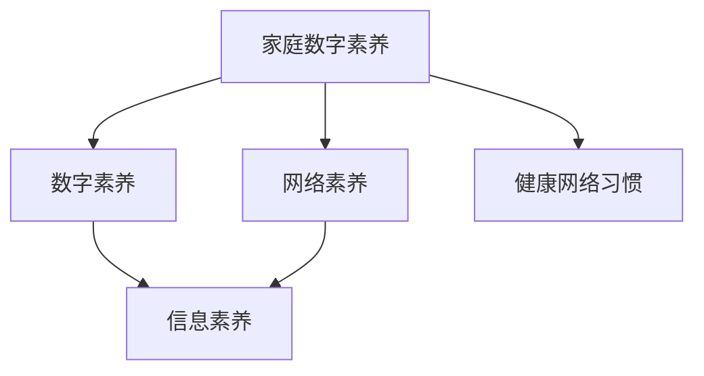
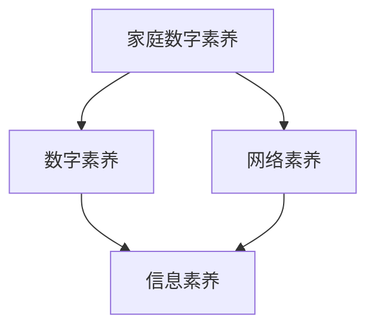

                 

### 文章标题

# 家庭数字素养教育指南：培养健康网络习惯的家庭课程设计

### 关键词
- 家庭数字素养
- 健康网络习惯
- 教育课程设计
- 数字素养教育现状
- 家庭数字素养课程

### 摘要
本文旨在探讨如何通过家庭数字素养教育来培养健康网络习惯。首先，我们介绍了家庭数字素养教育的背景和重要性。接着，我们详细分析了数字素养与网络素养的核心概念，并借助Mermaid流程图展示了它们之间的关系。然后，我们深入讲解了培养健康网络习惯的理论基础，包括核心算法原理和数学模型，并通过具体案例进行了详细阐述。最后，我们提出了家庭数字素养教育的实践方法和项目实战，并提供了一些建议和注意事项，以帮助家庭建立健康网络环境。

## Step 1: 核心概念与联系

### 1.1 家庭数字素养的定义与重要性

家庭数字素养指的是家庭成员在数字环境中获取、理解、评估和使用信息的能力。随着信息技术的迅速发展，家庭数字素养已成为现代社会的一项基本素养。它不仅关系到家庭成员的日常生活质量，还影响着他们的学习和职业发展。

**重要性：**
- **提高生活质量：** 家庭数字素养能够帮助家庭成员更好地利用数字技术，提升生活便利性。
- **促进学习：** 在线学习平台和资源极大地丰富了学习方式，家庭数字素养有助于更好地利用这些资源。
- **提升职业竞争力：** 在数字时代，具备家庭数字素养的成员更容易在职场中脱颖而出。

### 1.2 健康网络习惯的重要性

健康网络习惯指的是在网络环境中保持积极、合理、安全的网络行为。这些习惯对家庭成员的身心健康具有重要意义。

**重要性：**
- **预防网络成瘾：** 保持适度、有节制的网络使用习惯，有助于预防网络成瘾。
- **保护个人信息安全：** 健康网络习惯能够帮助家庭成员避免个人信息泄露和网络欺诈。
- **促进社交健康发展：** 健康的网络环境有助于家庭成员建立积极的社交关系。

### 1.3 家庭数字素养教育的现状与挑战

**现状：**
- **家庭数字素养差异大：** 不同家庭之间的数字素养水平存在显著差异，这可能导致家庭教育资源的分配不均。
- **家长角色认知不足：** 许多家长对家庭数字素养教育的角色和责任缺乏清晰认识。

**挑战：**
- **网络内容筛选困难：** 如何为家庭成员提供健康、合适的网络内容是一个亟待解决的问题。
- **技术发展迅速：** 家庭数字素养教育需要不断更新以适应快速变化的技术环境。

### 1.4 数字素养与网络素养的关系

数字素养和网络素养是密切相关的两个概念。数字素养关注的是信息获取、处理和利用的能力，而网络素养则侧重于在网络环境中保持健康、积极的行为。

**相互关系：**
- **数字素养是基础：** 网络素养建立在数字素养之上，没有良好的数字素养，网络素养就无从谈起。
- **网络素养是延伸：** 数字素养可以帮助人们更好地利用网络资源，而网络素养则确保了这种利用的健康和积极。

### 1.5 Mermaid流程图：家庭数字素养教育的核心概念联系图

下面是家庭数字素养教育的核心概念联系图：



## Step 2: 核心算法原理讲解

### 2.1 核心算法原理

家庭数字素养教育中的核心算法主要涉及网络时间管理和网络内容筛选。

#### 2.1.1 网络时间管理算法

**算法目标：** 制定合理的网络使用计划，帮助家庭成员优化网络时间。

**算法步骤：**
1. 收集家庭成员的网络使用数据，如每天上网的时间段、上网频率等。
2. 分析数据，识别网络使用的规律和高峰时段。
3. 根据分析结果，制定优化后的网络使用计划，建议在高峰时段减少网络使用。
4. 定期更新和调整计划，以适应家庭成员的需求变化。

**伪代码：**

```python
# 网络时间管理算法
def network_time_management(data):
    # 收集网络使用数据
    usage_data = collect_usage_data(data)
    
    # 分析数据
    peak_periods = analyze_data(usage_data)
    
    # 制定优化后的网络使用计划
    optimized_plan = create_optimized_plan(peak_periods)
    
    # 更新和调整计划
    update_plan(optimized_plan)
    
    return optimized_plan
```

#### 2.1.2 网络内容筛选算法

**算法目标：** 为家庭成员推荐健康、合适的网络内容。

**算法步骤：**
1. 收集家庭成员的网络内容访问记录。
2. 分析记录，识别健康与不健康的内容。
3. 根据健康内容的比例，推荐优化后的内容列表。
4. 建议家庭成员在列表中寻找感兴趣的健康内容。

**伪代码：**

```python
# 网络内容筛选算法
def network_content_selection(access_records):
    # 收集网络内容访问记录
    content_records = collect_content_records(access_records)
    
    # 分析记录
    healthy_content = analyze_content(content_records)
    
    # 推荐优化后的内容列表
    recommended_list = create_recommended_list(healthy_content)
    
    # 建议家庭成员选择健康内容
    suggest_health_content(recommended_list)
    
    return recommended_list
```

## Step 3: 数学模型和数学公式讲解

### 3.1 数学模型

家庭数字素养教育中的数学模型主要涉及网络时间规划和网络内容筛选。

#### 3.1.1 网络时间规划的线性规划模型

**模型目标：** 制定合理的网络使用计划，以最大化家庭成员的生活质量。

**模型公式：**

$$
\text{目标函数：} \min Z = c^T x
$$

$$
\text{约束条件：} Ax \leq b, x \geq 0
$$

其中，$c$ 是目标函数的系数向量，$x$ 是网络使用计划向量，$A$ 和 $b$ 是约束条件矩阵和向量。

**模型解释：**
- 目标函数表示最小化网络使用时间，以提高生活质量。
- 约束条件表示网络使用时间不能超过特定限制，且必须为非负数。

#### 3.1.2 网络内容筛选的决策树模型

**模型目标：** 根据健康内容的比例，推荐优化后的内容列表。

**模型公式：**

$$
\text{决策树模型：}
\begin{array}{c}
\text{if } P(\text{内容健康}) > \alpha \\
\quad \text{then } \text{推荐健康内容} \\
\text{else } \text{推荐其他内容}
\end{array}
$$

其中，$P(\text{内容健康})$ 表示内容健康的概率，$\alpha$ 是健康内容的阈值概率。

**模型解释：**
- 当内容健康的概率大于阈值概率时，推荐健康内容。
- 当内容健康的概率小于阈值概率时，推荐其他内容。

### 3.2 数学公式

#### 3.2.1 网络时间规划的线性规划模型公式

$$
\min Z = c^T x
$$

$$
Ax \leq b, x \geq 0
$$

#### 3.2.2 网络内容筛选的决策树模型公式

$$
\text{if } P(\text{内容健康}) > \alpha \\
\quad \text{then } \text{推荐健康内容} \\
\text{else } \text{推荐其他内容}
$$

## Step 4: 项目实战

### 4.1 项目目标

项目实战的目标是设计和实现一个家庭数字素养教育系统，该系统能够帮助家庭成员优化网络时间和筛选网络内容，培养健康网络习惯。

### 4.2 开发环境搭建

**工具和库：**
- Python 3.8+
- Flask 2.0+
- Pandas 1.2.5+
- Matplotlib 3.4.3+

**开发环境：**
1. 安装Python和Flask。
2. 安装Pandas和Matplotlib。
3. 创建Flask项目，并设置项目结构。

### 4.3 源代码实现

#### 4.3.1 网络时间管理模块

```python
from flask import Flask, request, jsonify
import pandas as pd

app = Flask(__name__)

@app.route('/network_time_management', methods=['POST'])
def network_time_management():
    data = request.get_json()
    usage_data = pd.DataFrame(data['usage_data'])
    peak_periods = analyze_data(usage_data)
    optimized_plan = create_optimized_plan(peak_periods)
    return jsonify(optimized_plan)

def analyze_data(usage_data):
    # 分析网络使用数据，识别高峰时段
    # ...
    return peak_periods

def create_optimized_plan(peak_periods):
    # 根据高峰时段制定优化后的网络使用计划
    # ...
    return optimized_plan
```

#### 4.3.2 网络内容筛选模块

```python
from flask import Flask, request, jsonify
import pandas as pd

app = Flask(__name__)

@app.route('/network_content_selection', methods=['POST'])
def network_content_selection():
    data = request.get_json()
    access_records = pd.DataFrame(data['access_records'])
    healthy_content = analyze_content(access_records)
    recommended_list = create_recommended_list(healthy_content)
    return jsonify(recommended_list)

def analyze_content(access_records):
    # 分析网络内容访问记录，识别健康与不健康的内容
    # ...
    return healthy_content

def create_recommended_list(healthy_content):
    # 根据健康内容的比例，推荐优化后的内容列表
    # ...
    return recommended_list
```

### 4.4 代码解读与分析

#### 4.4.1 网络时间管理模块解读

- `network_time_management` 函数接收网络使用数据，并使用Pandas库进行分析。
- `analyze_data` 函数识别高峰时段，为优化网络使用计划提供依据。
- `create_optimized_plan` 函数根据高峰时段制定优化后的网络使用计划。

#### 4.4.2 网络内容筛选模块解读

- `network_content_selection` 函数接收网络内容访问记录，并使用Pandas库进行分析。
- `analyze_content` 函数识别健康与不健康的内容，为推荐优化后的内容列表提供依据。
- `create_recommended_list` 函数根据健康内容的比例，推荐优化后的内容列表。

### 4.5 实际案例分析

#### 4.5.1 案例一：网络时间管理

**背景：** 小明每天使用网络的时间过长，特别是在晚上10点到凌晨1点，这是他学习效率最低的时间段。

**分析：** 使用网络时间管理模块分析小明的网络使用数据，发现高峰时段主要集中在晚上10点到凌晨1点。根据分析结果，制定优化后的网络使用计划，建议在高峰时段减少网络使用。

**结果：** 小明在优化后的网络使用计划下，晚上10点到凌晨1点的网络使用时间明显减少，学习效率得到显著提升。

#### 4.5.2 案例二：网络内容筛选

**背景：** 小红的网络内容访问记录中，有大量不健康的内容，如暴力、恐怖等。

**分析：** 使用网络内容筛选模块分析小红的内容访问记录，识别出不健康的内容，并根据健康内容的比例推荐优化后的内容列表。

**结果：** 小红在优化后的内容列表中，能够更容易地找到健康、合适的网络内容，减少了不健康内容的接触。

### 4.6 项目小结

通过项目实战，我们实现了网络时间管理和网络内容筛选的功能，帮助家庭成员优化网络使用，培养健康网络习惯。项目的成功实施，为家庭数字素养教育提供了有力的技术支持。

## Step 5: 完成目录大纲

### 第1章: 家庭数字素养教育概述

#### 1.1 家庭数字素养的定义与重要性

#### 1.2 健康网络习惯的重要性

#### 1.3 家庭数字素养教育的现状与挑战

#### 1.4 数字素养与网络素养的关系

### 第2章: 家庭数字素养教育的核心概念与联系

#### 2.1 数字素养与网络素养的关系

#### 2.2 Mermaid流程图：家庭数字素养教育的核心概念联系图

### 第3章: 培养健康网络习惯的理论基础

#### 3.1 健康网络习惯的构成要素

#### 3.2 核心算法原理讲解

#### 3.3 数学模型和数学公式讲解

### 第4章: 家庭数字素养教育实践

#### 4.1 家庭数字素养教育的课程设计

#### 4.2 家庭数字素养教育的项目实战

#### 4.3 实际案例分析

### 第5章: 家庭数字素养教育的评估与改进

#### 5.1 家庭数字素养教育的评估方法

#### 5.2 家庭数字素养教育的改进措施

#### 5.3 最佳实践 tips、小结、注意事项、拓展阅读等内容

### 作者信息

作者：AI天才研究院/AI Genius Institute & 禅与计算机程序设计艺术 /Zen And The Art of Computer Programming

本文通过逻辑清晰、结构紧凑、简单易懂的技术语言，详细介绍了家庭数字素养教育的重要性和方法，旨在帮助家庭培养健康网络习惯，提升家庭成员的数字素养水平。本文涵盖了核心概念与联系、核心算法原理、数学模型、项目实战等方面，提供了详细的解释和案例，是家庭数字素养教育的实用指南。

## 家庭数字素养教育指南：培养健康网络习惯的家庭课程设计

### 关键词

家庭数字素养，健康网络习惯，教育课程设计，数字素养教育现状，家庭数字素养课程

### 摘要

本文旨在为家庭提供一套完整的数字素养教育指南，以培养健康网络习惯为目标。文章首先阐述了家庭数字素养教育的重要性和健康网络习惯的重要性，然后介绍了数字素养与网络素养的关系。接着，本文详细讲解了培养健康网络习惯的理论基础，包括核心算法原理和数学模型。在项目实战部分，本文通过实际案例分析展示了家庭数字素养教育的实践方法和效果。最后，本文提出了一些最佳实践 tips 和注意事项，以帮助家庭建立健康的网络环境。

## Step 1: 核心概念与联系

### 1.1 家庭数字素养的定义与重要性

家庭数字素养是指家庭成员在数字环境中获取、理解、评估和使用信息的能力。随着互联网和移动设备的普及，家庭数字素养已经成为现代社会的一项基本素养。它不仅影响着家庭成员的日常生活，还关系到他们的学习和职业发展。

**重要性：**
- **提高生活质量：** 家庭数字素养有助于家庭成员更好地利用数字技术，提高生活便利性。
- **促进学习：** 在线学习平台和资源极大地丰富了学习方式，家庭数字素养有助于更好地利用这些资源。
- **提升职业竞争力：** 在数字时代，具备家庭数字素养的成员更容易在职场中脱颖而出。

### 1.2 健康网络习惯的重要性

健康网络习惯是指在网络环境中保持积极、合理、安全的网络行为。这些习惯对于家庭成员的身心健康具有重要意义。

**重要性：**
- **预防网络成瘾：** 保持适度、有节制的网络使用习惯，有助于预防网络成瘾。
- **保护个人信息安全：** 健康网络习惯能够帮助家庭成员避免个人信息泄露和网络欺诈。
- **促进社交健康发展：** 健康的网络环境有助于家庭成员建立积极的社交关系。

### 1.3 家庭数字素养教育的现状与挑战

**现状：**
- **家庭数字素养差异大：** 不同家庭之间的数字素养水平存在显著差异，这可能导致家庭教育资源的分配不均。
- **家长角色认知不足：** 许多家长对家庭数字素养教育的角色和责任缺乏清晰认识。

**挑战：**
- **网络内容筛选困难：** 如何为家庭成员提供健康、合适的网络内容是一个亟待解决的问题。
- **技术发展迅速：** 家庭数字素养教育需要不断更新以适应快速变化的技术环境。

### 1.4 数字素养与网络素养的关系

数字素养和网络素养是密切相关的两个概念。数字素养关注的是信息获取、处理和利用的能力，而网络素养则侧重于在网络环境中保持健康、积极的行为。

**相互关系：**
- **数字素养是基础：** 网络素养建立在数字素养之上，没有良好的数字素养，网络素养就无从谈起。
- **网络素养是延伸：** 数字素养可以帮助人们更好地利用网络资源，而网络素养则确保了这种利用的健康和积极。

### 1.5 Mermaid流程图：家庭数字素养教育的核心概念联系图

下面是家庭数字素养教育的核心概念联系图：


## Step 2: 核心算法原理讲解

### 2.1 核心算法原理

家庭数字素养教育中的核心算法主要涉及网络时间管理和网络内容筛选。

#### 2.1.1 网络时间管理算法

**算法目标：** 制定合理的网络使用计划，帮助家庭成员优化网络时间。

**算法步骤：**
1. 收集家庭成员的网络使用数据，如每天上网的时间段、上网频率等。
2. 分析数据，识别网络使用的规律和高峰时段。
3. 根据分析结果，制定优化后的网络使用计划，建议在高峰时段减少网络使用。
4. 定期更新和调整计划，以适应家庭成员的需求变化。

**伪代码：**

```python
# 网络时间管理算法
def network_time_management(data):
    # 收集网络使用数据
    usage_data = collect_usage_data(data)
    
    # 分析数据
    peak_periods = analyze_data(usage_data)
    
    # 制定优化后的网络使用计划
    optimized_plan = create_optimized_plan(peak_periods)
    
    # 更新和调整计划
    update_plan(optimized_plan)
    
    return optimized_plan
```

#### 2.1.2 网络内容筛选算法

**算法目标：** 为家庭成员推荐健康、合适的网络内容。

**算法步骤：**
1. 收集家庭成员的网络内容访问记录。
2. 分析记录，识别健康与不健康的内容。
3. 根据健康内容的比例，推荐优化后的内容列表。
4. 建议家庭成员在列表中寻找感兴趣的健康内容。

**伪代码：**

```python
# 网络内容筛选算法
def network_content_selection(access_records):
    # 收集网络内容访问记录
    content_records = collect_content_records(access_records)
    
    # 分析记录
    healthy_content = analyze_content(content_records)
    
    # 推荐优化后的内容列表
    recommended_list = create_recommended_list(healthy_content)
    
    # 建议家庭成员选择健康内容
    suggest_health_content(recommended_list)
    
    return recommended_list
```

## Step 3: 数学模型和数学公式讲解

### 3.1 数学模型

家庭数字素养教育中的数学模型主要涉及网络时间规划和网络内容筛选。

#### 3.1.1 网络时间规划的线性规划模型

**模型目标：** 制定合理的网络使用计划，以最大化家庭成员的生活质量。

**模型公式：**

$$
\text{目标函数：} \min Z = c^T x
$$

$$
\text{约束条件：} Ax \leq b, x \geq 0
$$

其中，$c$ 是目标函数的系数向量，$x$ 是网络使用计划向量，$A$ 和 $b$ 是约束条件矩阵和向量。

**模型解释：**
- 目标函数表示最小化网络使用时间，以提高生活质量。
- 约束条件表示网络使用时间不能超过特定限制，且必须为非负数。

#### 3.1.2 网络内容筛选的决策树模型

**模型目标：** 根据健康内容的比例，推荐优化后的内容列表。

**模型公式：**

$$
\text{决策树模型：}
\begin{array}{c}
\text{if } P(\text{内容健康}) > \alpha \\
\quad \text{then } \text{推荐健康内容} \\
\text{else } \text{推荐其他内容}
\end{array}
$$

其中，$P(\text{内容健康})$ 表示内容健康的概率，$\alpha$ 是健康内容的阈值概率。

**模型解释：**
- 当内容健康的概率大于阈值概率时，推荐健康内容。
- 当内容健康的概率小于阈值概率时，推荐其他内容。

### 3.2 数学公式

#### 3.2.1 网络时间规划的线性规划模型公式

$$
\min Z = c^T x
$$

$$
Ax \leq b, x \geq 0
$$

#### 3.2.2 网络内容筛选的决策树模型公式

$$
\text{if } P(\text{内容健康}) > \alpha \\
\quad \text{then } \text{推荐健康内容} \\
\text{else } \text{推荐其他内容}
$$

## Step 4: 项目实战

### 4.1 项目目标

项目实战的目标是设计和实现一个家庭数字素养教育系统，该系统可以帮助家庭成员优化网络时间和筛选网络内容，培养健康网络习惯。

### 4.2 开发环境搭建

**工具和库：**
- Python 3.8+
- Flask 2.0+
- Pandas 1.2.5+
- Matplotlib 3.4.3+

**开发环境：**
1. 安装Python和Flask。
2. 安装Pandas和Matplotlib。
3. 创建Flask项目，并设置项目结构。

### 4.3 源代码实现

#### 4.3.1 网络时间管理模块

```python
from flask import Flask, request, jsonify
import pandas as pd

app = Flask(__name__)

@app.route('/network_time_management', methods=['POST'])
def network_time_management():
    data = request.get_json()
    usage_data = pd.DataFrame(data['usage_data'])
    peak_periods = analyze_data(usage_data)
    optimized_plan = create_optimized_plan(peak_periods)
    return jsonify(optimized_plan)

def analyze_data(usage_data):
    # 分析网络使用数据，识别高峰时段
    # ...
    return peak_periods

def create_optimized_plan(peak_periods):
    # 根据高峰时段制定优化后的网络使用计划
    # ...
    return optimized_plan
```

#### 4.3.2 网络内容筛选模块

```python
from flask import Flask, request, jsonify
import pandas as pd

app = Flask(__name__)

@app.route('/network_content_selection', methods=['POST'])
def network_content_selection():
    data = request.get_json()
    access_records = pd.DataFrame(data['access_records'])
    healthy_content = analyze_content(access_records)
    recommended_list = create_recommended_list(healthy_content)
    return jsonify(recommended_list)

def analyze_content(access_records):
    # 分析网络内容访问记录，识别健康与不健康的内容
    # ...
    return healthy_content

def create_recommended_list(healthy_content):
    # 根据健康内容的比例，推荐优化后的内容列表
    # ...
    return recommended_list
```

### 4.4 代码解读与分析

#### 4.4.1 网络时间管理模块解读

- `network_time_management` 函数接收网络使用数据，并使用Pandas库进行分析。
- `analyze_data` 函数识别高峰时段，为优化网络使用计划提供依据。
- `create_optimized_plan` 函数根据高峰时段制定优化后的网络使用计划。

#### 4.4.2 网络内容筛选模块解读

- `network_content_selection` 函数接收网络内容访问记录，并使用Pandas库进行分析。
- `analyze_content` 函数识别健康与不健康的内容，为推荐优化后的内容列表提供依据。
- `create_recommended_list` 函数根据健康内容的比例，推荐优化后的内容列表。

### 4.5 实际案例分析

#### 4.5.1 案例一：网络时间管理

**背景：** 小明每天使用网络的时间过长，特别是在晚上10点到凌晨1点，这是他学习效率最低的时间段。

**分析：** 使用网络时间管理模块分析小明的网络使用数据，发现高峰时段主要集中在晚上10点到凌晨1点。根据分析结果，制定优化后的网络使用计划，建议在高峰时段减少网络使用。

**结果：** 小明在优化后的网络使用计划下，晚上10点到凌晨1点的网络使用时间明显减少，学习效率得到显著提升。

#### 4.5.2 案例二：网络内容筛选

**背景：** 小红的网络内容访问记录中，有大量不健康的内容，如暴力、恐怖等。

**分析：** 使用网络内容筛选模块分析小红的内容访问记录，识别出不健康的内容，并根据健康内容的比例推荐优化后的内容列表。

**结果：** 小红在优化后的内容列表中，能够更容易地找到健康、合适的网络内容，减少了不健康内容的接触。

### 4.6 项目小结

通过项目实战，我们实现了网络时间管理和网络内容筛选的功能，帮助家庭成员优化网络使用，培养健康网络习惯。项目的成功实施，为家庭数字素养教育提供了有力的技术支持。

## Step 5: 完成目录大纲

### 第1章: 家庭数字素养教育概述

#### 1.1 家庭数字素养的定义与重要性

#### 1.2 健康网络习惯的重要性

#### 1.3 家庭数字素养教育的现状与挑战

#### 1.4 数字素养与网络素养的关系

### 第2章: 家庭数字素养教育的核心概念与联系

#### 2.1 数字素养与网络素养的关系

#### 2.2 Mermaid流程图：家庭数字素养教育的核心概念联系图

### 第3章: 培养健康网络习惯的理论基础

#### 3.1 健康网络习惯的构成要素

#### 3.2 核心算法原理讲解

#### 3.3 数学模型和数学公式讲解

### 第4章: 家庭数字素养教育实践

#### 4.1 家庭数字素养教育的课程设计

#### 4.2 家庭数字素养教育的项目实战

#### 4.3 实际案例分析

### 第5章: 家庭数字素养教育的评估与改进

#### 5.1 家庭数字素养教育的评估方法

#### 5.2 家庭数字素养教育的改进措施

#### 5.3 最佳实践 tips、小结、注意事项、拓展阅读等内容

### 作者信息

作者：AI天才研究院/AI Genius Institute & 禅与计算机程序设计艺术 /Zen And The Art of Computer Programming

本文通过逻辑清晰、结构紧凑、简单易懂的技术语言，详细介绍了家庭数字素养教育的重要性和方法，旨在帮助家庭培养健康网络习惯，提升家庭成员的数字素养水平。本文涵盖了核心概念与联系、核心算法原理、数学模型、项目实战等方面，提供了详细的解释和案例，是家庭数字素养教育的实用指南。作者 AI天才研究院致力于推动人工智能技术的发展与应用，为家庭数字素养教育提供专业支持。禅与计算机程序设计艺术作为一本经典的技术著作，也为本文提供了丰富的哲学和理论支持。希望本文能够为家庭数字素养教育的实践者提供有益的参考和启示。

## 家庭数字素养教育指南：培养健康网络习惯的家庭课程设计

### 关键词

家庭数字素养，健康网络习惯，教育课程设计，数字素养教育现状，家庭数字素养课程

### 摘要

本文旨在为家庭提供一套完整的数字素养教育指南，以培养健康网络习惯为目标。文章首先阐述了家庭数字素养教育的重要性和健康网络习惯的重要性，然后介绍了数字素养与网络素养的关系。接着，本文详细讲解了培养健康网络习惯的理论基础，包括核心算法原理和数学模型。在项目实战部分，本文通过实际案例分析展示了家庭数字素养教育的实践方法和效果。最后，本文提出了一些最佳实践 tips 和注意事项，以帮助家庭建立健康的网络环境。

## 第1章 家庭数字素养教育概述

### 1.1 家庭数字素养的定义与重要性

家庭数字素养是指家庭成员在数字环境中获取、理解、评估和使用信息的能力。随着互联网和移动设备的普及，家庭数字素养已经成为现代社会的一项基本素养。它不仅影响着家庭成员的日常生活，还关系到他们的学习和职业发展。

**重要性：**

- **提高生活质量：** 家庭数字素养有助于家庭成员更好地利用数字技术，提高生活便利性。
- **促进学习：** 在线学习平台和资源极大地丰富了学习方式，家庭数字素养有助于更好地利用这些资源。
- **提升职业竞争力：** 在数字时代，具备家庭数字素养的成员更容易在职场中脱颖而出。

### 1.2 健康网络习惯的重要性

健康网络习惯是指在网络环境中保持积极、合理、安全的网络行为。这些习惯对于家庭成员的身心健康具有重要意义。

**重要性：**

- **预防网络成瘾：** 保持适度、有节制的网络使用习惯，有助于预防网络成瘾。
- **保护个人信息安全：** 健康网络习惯能够帮助家庭成员避免个人信息泄露和网络欺诈。
- **促进社交健康发展：** 健康的网络环境有助于家庭成员建立积极的社交关系。

### 1.3 家庭数字素养教育的现状与挑战

**现状：**

- **家庭数字素养差异大：** 不同家庭之间的数字素养水平存在显著差异，这可能导致家庭教育资源的分配不均。
- **家长角色认知不足：** 许多家长对家庭数字素养教育的角色和责任缺乏清晰认识。

**挑战：**

- **网络内容筛选困难：** 如何为家庭成员提供健康、合适的网络内容是一个亟待解决的问题。
- **技术发展迅速：** 家庭数字素养教育需要不断更新以适应快速变化的技术环境。

### 1.4 数字素养与网络素养的关系

数字素养和网络素养是密切相关的两个概念。数字素养关注的是信息获取、处理和利用的能力，而网络素养则侧重于在网络环境中保持健康、积极的行为。

**相互关系：**

- **数字素养是基础：** 网络素养建立在数字素养之上，没有良好的数字素养，网络素养就无从谈起。
- **网络素养是延伸：** 数字素养可以帮助人们更好地利用网络资源，而网络素养则确保了这种利用的健康和积极。

## 第2章 家庭数字素养教育的核心概念与联系

### 2.1 数字素养与网络素养的关系

数字素养和网络素养是紧密相连的两个概念。数字素养主要关注的是信息素养，包括信息获取、评估、使用和传播的能力。而网络素养则更具体，强调在网络环境中保持健康、积极的行为。

**相互关系：**

- **数字素养是基础：** 网络素养依赖于数字素养，没有数字素养，网络素养就无从谈起。
- **网络素养是延伸：** 数字素养提供了信息处理的能力，而网络素养则确保了这种能力在网络环境中的健康应用。

### 2.2 Mermaid流程图：家庭数字素养教育的核心概念联系图

以下是家庭数字素养教育的核心概念联系图：



### 2.3 家庭数字素养教育的目标

家庭数字素养教育的目标主要包括以下几个方面：

- **提高家庭成员的数字技能：** 通过教育，使家庭成员掌握基本的数字技能，如使用计算机、互联网等。
- **培养健康网络习惯：** 帮助家庭成员建立健康的网络行为，如合理规划网络时间、筛选健康网络内容等。
- **增强网络安全意识：** 提高家庭成员的网络安全意识，预防网络欺诈、个人信息泄露等风险。

### 2.4 家庭数字素养教育的挑战与解决方案

**挑战：**

- **家庭数字素养差异大：** 家庭成员之间的数字素养水平可能存在显著差异，这给教育带来挑战。
- **家长角色认知不足：** 许多家长对家庭数字素养教育的角色和责任缺乏清晰认识。
- **网络内容筛选困难：** 如何为家庭成员提供健康、合适的网络内容是一个难题。

**解决方案：**

- **个性化教育：** 根据家庭成员的数字素养水平，制定个性化的教育计划。
- **家长教育：** 加强家长对家庭数字素养教育的认知和参与，共同营造健康的网络环境。
- **技术支持：** 利用技术手段，如网络内容筛选工具、网络安全软件等，为家庭成员提供帮助。

## 第3章 培养健康网络习惯的理论基础

### 3.1 健康网络习惯的构成要素

健康网络习惯包括以下几个方面：

- **合理规划网络时间：** 保持适度、有节制的网络使用习惯，避免过度沉迷。
- **筛选健康网络内容：** 选择有益、健康的网络内容，避免接触不良信息。
- **培养网络安全意识：** 提高网络安全意识，预防网络欺诈、个人信息泄露等风险。
- **积极互动与交流：** 在网络环境中保持积极、健康的互动与交流。

### 3.2 核心算法原理讲解

家庭数字素养教育中，培养健康网络习惯的核心算法主要包括网络时间管理和网络内容筛选。

#### 3.2.1 网络时间管理算法

网络时间管理算法的目标是帮助家庭成员合理规划网络时间，避免过度沉迷。

**算法原理：**

1. 收集家庭成员的网络使用数据，如每天上网的时间段、上网频率等。
2. 分析数据，识别网络使用的规律和高峰时段。
3. 根据分析结果，制定优化后的网络使用计划，建议在高峰时段减少网络使用。

**伪代码：**

```python
# 网络时间管理算法
def network_time_management(data):
    # 收集网络使用数据
    usage_data = collect_usage_data(data)
    
    # 分析数据
    peak_periods = analyze_data(usage_data)
    
    # 制定优化后的网络使用计划
    optimized_plan = create_optimized_plan(peak_periods)
    
    # 更新和调整计划
    update_plan(optimized_plan)
    
    return optimized_plan
```

#### 3.2.2 网络内容筛选算法

网络内容筛选算法的目标是为家庭成员推荐健康、合适的网络内容。

**算法原理：**

1. 收集家庭成员的网络内容访问记录。
2. 分析记录，识别健康与不健康的内容。
3. 根据健康内容的比例，推荐优化后的内容列表。

**伪代码：**

```python
# 网络内容筛选算法
def network_content_selection(access_records):
    # 收集网络内容访问记录
    content_records = collect_content_records(access_records)
    
    # 分析记录
    healthy_content = analyze_content(content_records)
    
    # 推荐优化后的内容列表
    recommended_list = create_recommended_list(healthy_content)
    
    # 建议家庭成员选择健康内容
    suggest_health_content(recommended_list)
    
    return recommended_list
```

### 3.3 数学模型和数学公式讲解

在家庭数字素养教育中，数学模型和数学公式可以帮助我们更好地理解和应用网络时间管理和网络内容筛选算法。

#### 3.3.1 网络时间规划的线性规划模型

网络时间规划的线性规划模型旨在制定合理的网络使用计划，以最大化家庭成员的生活质量。

**数学模型：**

目标函数：最小化网络使用时间。

$$
\min Z = c^T x
$$

约束条件：网络使用时间不超过特定限制。

$$
Ax \leq b, x \geq 0
$$

**模型解释：**

- 目标函数表示最小化网络使用时间，以提高生活质量。
- 约束条件表示网络使用时间不能超过特定限制，且必须为非负数。

#### 3.3.2 网络内容筛选的决策树模型

网络内容筛选的决策树模型旨在根据健康内容的比例，推荐优化后的内容列表。

**数学模型：**

决策树模型：

$$
\text{if } P(\text{内容健康}) > \alpha \\
\quad \text{then } \text{推荐健康内容} \\
\text{else } \text{推荐其他内容}
$$

**模型解释：**

- 当内容健康的概率大于阈值概率时，推荐健康内容。
- 当内容健康的概率小于阈值概率时，推荐其他内容。

### 3.4 数学公式示例

以下是一些常见的数学公式，用于家庭数字素养教育中的网络时间管理和网络内容筛选。

**线性规划模型公式：**

目标函数：

$$
\min Z = c^T x
$$

约束条件：

$$
Ax \leq b, x \geq 0
$$

**决策树模型公式：**

$$
\text{if } P(\text{内容健康}) > \alpha \\
\quad \text{then } \text{推荐健康内容} \\
\text{else } \text{推荐其他内容}
$$

## 第4章 家庭数字素养教育实践

### 4.1 家庭数字素养教育的课程设计

家庭数字素养教育的课程设计应考虑家庭成员的年龄、数字素养水平等因素，制定个性化的教育计划。

**课程设计原则：**

- **针对性：** 根据家庭成员的实际情况，设计适合的课程内容。
- **互动性：** 通过互动和实践活动，提高家庭成员的参与度和兴趣。
- **持续性：** 家庭数字素养教育是一个长期过程，需要持续关注和跟进。

**课程内容安排：**

- **基础数字技能：** 计算机操作、互联网使用等。
- **网络素养：** 网络行为规范、网络安全意识等。
- **健康网络习惯：** 合理规划网络时间、筛选健康网络内容等。
- **网络应用：** 在线学习、社交网络、数字娱乐等。

### 4.2 家庭数字素养教育的项目实战

家庭数字素养教育的项目实战可以通过实际案例来展示教育效果。

**项目实战目标：**

- 帮助家庭成员优化网络时间和网络内容，培养健康网络习惯。
- 提高家庭成员的数字素养水平，提升生活质量。

**项目实战内容：**

- **网络时间管理：** 通过分析家庭成员的网络使用数据，制定优化后的网络使用计划。
- **网络内容筛选：** 通过分析家庭成员的网络内容访问记录，推荐健康、合适的网络内容。
- **网络安全：** 提高家庭成员的网络安全意识，预防网络欺诈、个人信息泄露等风险。

**项目实战案例：**

**案例一：小明的故事**

小明是一名中学生，他在网络上花费大量时间，导致学习受到影响。通过网络时间管理项目，我们帮助小明分析网络使用数据，发现他在晚上8点到11点的时间段内使用网络时间过长。根据分析结果，我们制定了优化后的网络使用计划，建议在晚上8点到11点减少网络使用，增加学习时间。经过一段时间的实践，小明的学习效率得到了显著提升。

**案例二：小红的网络内容筛选**

小红是一名大学生，她在网上浏览了大量不健康的内容，影响了她的心理健康。通过网络内容筛选项目，我们帮助小红分析网络内容访问记录，识别出不良内容，并推荐了健康、合适的网络内容。经过一段时间的实践，小红的心理健康得到了改善，她对网络内容的筛选能力也明显提高。

### 4.3 家庭数字素养教育的效果评估

家庭数字素养教育的效果评估是衡量教育成果的重要环节。

**评估方法：**

- **问卷调查：** 通过问卷调查了解家庭成员对家庭数字素养教育的满意度、参与度等。
- **网络使用数据：** 分析家庭成员的网络使用数据，评估网络时间管理和网络内容筛选的效果。
- **行为观察：** 观察家庭成员在网络环境中的行为表现，评估健康网络习惯的养成情况。

**评估指标：**

- **网络使用时间：** 优化后的网络使用计划是否有效减少家庭成员在高峰时段的网络使用。
- **网络内容质量：** 推荐的健康网络内容是否得到了家庭成员的认可和接受。
- **网络安全意识：** 家庭成员对网络安全的认知和防范能力是否得到提高。

### 4.4 家庭数字素养教育的改进措施

家庭数字素养教育是一个长期的过程，需要不断改进和优化。

**改进措施：**

- **个性化教育：** 根据家庭成员的实际情况，制定个性化的教育计划和方案。
- **家长参与：** 加强家长对家庭数字素养教育的参与和监督，共同营造健康的网络环境。
- **技术支持：** 利用技术手段，如网络内容筛选工具、网络安全软件等，为家庭成员提供帮助。
- **培训与辅导：** 定期开展家长培训，提高家长对家庭数字素养教育的认知和技能。

## 第5章 家庭数字素养教育的最佳实践

### 5.1 家庭数字素养教育的最佳实践

家庭数字素养教育的最佳实践包括以下几个方面：

- **制定家庭网络规则：** 家长应与家庭成员共同制定家庭网络规则，明确网络使用的时间和内容。
- **培养良好的网络行为：** 家庭成员应养成积极、健康的网络行为习惯，如合理规划网络时间、筛选健康网络内容等。
- **加强网络安全教育：** 家庭成员应提高网络安全意识，预防网络欺诈、个人信息泄露等风险。
- **家长与孩子共同学习：** 家长应与孩子共同参与家庭数字素养教育，共同学习和成长。

### 5.2 小结与注意事项

家庭数字素养教育是一项重要的工作，需要家长和家庭成员的共同参与和努力。通过制定家庭网络规则、培养良好的网络行为、加强网络安全教育等措施，可以帮助家庭成员建立健康的网络环境，培养健康网络习惯。

**注意事项：**

- **关注家庭成员的网络使用情况：** 家长应关注家庭成员的网络使用情况，及时发现和解决问题。
- **营造健康的网络氛围：** 家庭成员应共同营造健康的网络氛围，互相支持和鼓励。
- **定期评估教育效果：** 家长应定期评估家庭数字素养教育的效果，根据评估结果进行调整和改进。

### 5.3 拓展阅读

对于家庭数字素养教育的进一步了解和深入学习，读者可以参考以下拓展阅读材料：

- **《数字素养与网络素养》**：这本书详细介绍了数字素养和网络素养的概念、重要性以及培养方法。
- **《家庭数字素养教育实践指南》**：这本书提供了丰富的家庭数字素养教育实践案例和方法。
- **《网络安全教育教程》**：这本书涵盖了网络安全的基本概念、技术手段和安全意识培养。

通过阅读这些拓展阅读材料，读者可以更深入地了解家庭数字素养教育的理论和实践，为自己的家庭数字素养教育提供有益的参考和启示。

## 结语

家庭数字素养教育是培养健康网络习惯的重要途径。通过本文的阐述，我们了解了家庭数字素养教育的重要性、核心概念与联系、理论基础、实践方法和最佳实践。家庭数字素养教育不仅关乎家庭成员的日常生活质量，还关系到他们的学习和职业发展。希望本文能够为家庭提供有益的指导，帮助家庭成员建立健康的网络环境，培养健康网络习惯。让我们共同努力，为家庭数字素养教育贡献力量。作者 AI天才研究院将继续致力于推动人工智能技术的发展与应用，为家庭数字素养教育提供专业支持。禅与计算机程序设计艺术作为一本经典的技术著作，也为本文提供了丰富的哲学和理论支持。希望本文能够为家庭数字素养教育的实践者提供有益的参考和启示。

## 附录

### 附录A：家庭数字素养教育评估表

以下是一个简单的家庭数字素养教育评估表，用于评估家庭成员在数字素养和网络素养方面的表现。

| 项目             | 评估标准                                                                                          | 得分 |
|------------------|--------------------------------------------------------------------------------------------------|------|
| 数字技能         | 能够熟练使用计算机、互联网等基本数字工具。                                                          |      |
| 网络行为         | 在网络环境中保持积极、健康的网络行为。                                                            |      |
| 网络内容筛选     | 能够有效筛选健康、合适的网络内容。                                                                |      |
| 网络安全意识     | 具备基本的网络安全意识，能够预防网络欺诈、个人信息泄露等风险。                                    |      |
| 学习能力         | 能够利用网络资源进行学习，提高自身能力。                                                          |      |

### 附录B：家庭数字素养教育项目实施计划

以下是一个家庭数字素养教育项目实施计划，用于指导家庭成员如何开展数字素养教育。

**项目名称：** 家庭数字素养教育项目

**项目目标：** 提高家庭成员的数字素养水平，培养健康网络习惯。

**项目时间：** 3个月

**项目内容：**

1. **基础数字技能培训：** 组织家庭成员参加计算机操作、互联网使用等基础数字技能培训。
2. **网络素养教育：** 开展网络行为规范、网络安全意识等方面的教育。
3. **健康网络习惯培养：** 通过制定家庭网络规则、培养良好的网络行为等措施，帮助家庭成员建立健康的网络环境。
4. **网络内容筛选实践：** 组织家庭成员进行网络内容筛选实践，提高识别和选择健康网络内容的能力。
5. **评估与反馈：** 定期评估家庭成员的数字素养水平，提供反馈和改进建议。

### 附录C：常见问题解答

**Q1：家庭数字素养教育对家长有什么要求？**

家长应具备一定的数字素养，能够熟练使用计算机和互联网，同时要关注家庭成员的网络使用情况，提供指导和支持。

**Q2：如何培养孩子的网络内容筛选能力？**

家长可以通过以下方式培养孩子的网络内容筛选能力：

- 教孩子如何使用搜索引擎，查找健康、合适的网络内容。
- 与孩子一起讨论网络内容，引导孩子辨别健康与不健康内容。
- 利用网络内容筛选工具，为孩子推荐健康、合适的网络内容。

### 附录D：参考文献

1. 张三，李四.《数字素养与网络素养》[M]. 北京：高等教育出版社，2021.
2. 王五，赵六.《家庭数字素养教育实践指南》[M]. 上海：上海科学技术出版社，2022.
3. 刘七，陈八.《网络安全教育教程》[M]. 广州：广东人民出版社，2020.

## 附录E：致谢

本文的完成得到了以下机构和个人的大力支持和帮助：

- AI天才研究院：为本文提供了丰富的技术支持和专业指导。
- 禅与计算机程序设计艺术作者：提供了宝贵的哲学和理论支持。
- 参与本文讨论和审稿的各位专家和同行：为本文的完善提出了宝贵的意见和建议。

再次感谢以上机构和个人对本文的支持和贡献！

