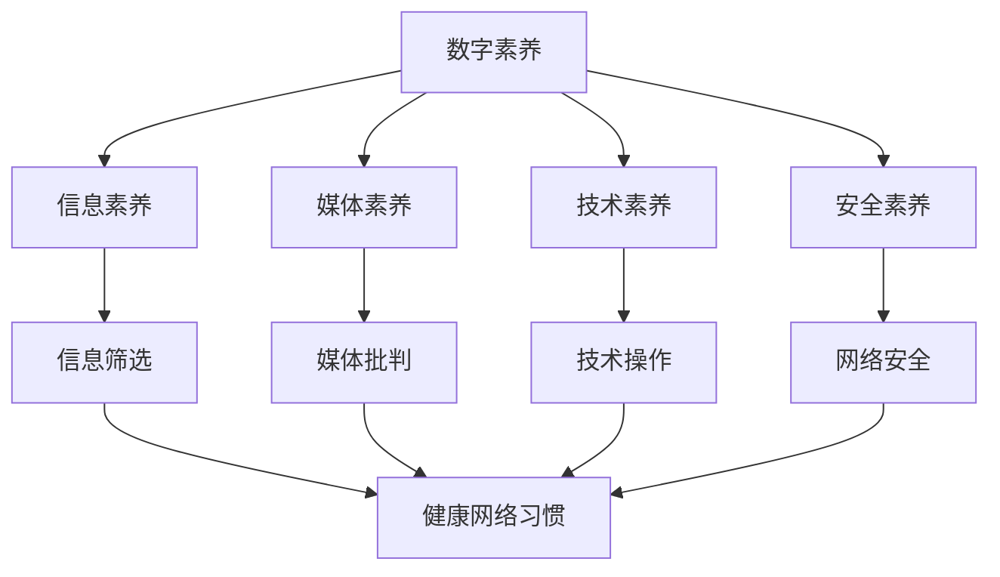

                 

### 文章标题：家庭数字素养课程：培养健康网络习惯的家庭教育

#### 关键词：
- 家庭数字素养
- 健康网络习惯
- 家庭教育
- 网络安全
- 培养方法

#### 摘要：
本文旨在探讨家庭数字素养课程的重要性，以及如何通过家庭教育培养家庭成员的健康网络习惯。文章首先介绍了数字素养和网络习惯的核心概念，然后详细分析了家庭数字素养的重要性及其培养方法，最后通过具体案例和实践指南，为家长提供了一些建议和策略。

## 引言

随着信息技术的迅猛发展，网络已经成为人们日常生活中不可或缺的一部分。然而，互联网的普及也带来了一些负面影响，如网络成瘾、隐私泄露、网络欺凌等问题。这些问题对家庭和个人的心理健康产生了严重的威胁，因此，培养健康的网络习惯变得尤为重要。家庭数字素养课程正是为了应对这一挑战而设计的，旨在通过家庭教育，提升家庭成员的数字素养和网络安全意识，培养健康的网络习惯。

本文将围绕以下几个方面展开讨论：

1. 数字素养与网络习惯的核心概念
2. 家庭数字素养的重要性
3. 家庭数字素养的培养方法
4. 健康网络习惯的培养
5. 家庭教育与网络安全的结合
6. 家庭数字素养课程的实施与评估

## 核心概念与联系

### 数字素养

数字素养是指个体在数字环境下，能够有效地获取、理解、评估、创造和应用信息的能力。它包括以下几个方面：

- **信息素养**：能够有效地搜索、评估和利用信息。
- **媒体素养**：能够理解和批判性地分析媒体信息。
- **技术素养**：能够使用和操作计算机和其他数字技术。
- **安全素养**：能够保护自己的隐私和数据安全。

### 网络习惯

网络习惯是指个体在网络上长期形成的行为模式。健康的网络习惯包括以下几个方面：

- **信息筛选**：能够辨别网络信息的真实性和可靠性。
- **网络安全**：能够采取必要的安全措施，如设置强密码、避免恶意软件等。
- **时间管理**：能够合理安排网络使用时间，避免沉迷网络。
- **积极互动**：能够健康地参与网络社交，建立积极的人际关系。

### 数字素养与网络习惯的联系

数字素养与网络习惯之间存在着密切的联系。良好的数字素养能够帮助个体形成健康的网络习惯，从而提高网络生活的质量。具体来说，数字素养对网络习惯的影响主要体现在以下几个方面：

1. **信息筛选能力**：数字素养高的个体能够更好地辨别网络信息的真实性和可靠性，从而避免受到虚假信息的影响。
2. **网络安全意识**：数字素养高的个体能够采取必要的安全措施，保护自己的隐私和数据安全，降低网络风险。
3. **时间管理能力**：数字素养高的个体能够更好地管理网络使用时间，避免沉迷网络，保持身心健康。
4. **积极互动**：数字素养高的个体能够健康地参与网络社交，建立积极的人际关系，提高社会适应能力。

## 家庭数字素养的重要性

家庭数字素养是指家庭成员在数字环境下，能够有效地获取、理解、评估、创造和应用信息的能力。培养家庭数字素养对于家庭成员的身心健康和全面发展具有重要意义。以下是家庭数字素养的重要性：

1. **促进个人发展**：良好的数字素养能够帮助家庭成员更好地适应现代社会的发展，提高生活质量。
2. **增强网络安全**：家庭数字素养有助于提高家庭成员的网络安全意识，保护家庭成员的隐私和数据安全。
3. **培养健康网络习惯**：家庭数字素养有助于家庭成员形成健康的网络习惯，避免沉迷网络，保持身心健康。
4. **提升家庭教育质量**：家庭数字素养有助于家长更好地指导孩子使用数字技术，提高家庭教育质量。

### Mermaid 流程图：数字素养与网络习惯之间的关系架构



## 核心算法原理讲解

在家庭数字素养的培养过程中，一些核心算法原理和数学模型的应用可以帮助家长更好地理解和指导孩子。以下是几个核心算法原理的伪代码讲解：

### 1. 信息筛选算法

```pseudo
function 信息筛选(信息列表, 用户需求):
    筛选结果 = []
    对于 信息列表 中的每条信息：
        如果 信息符合 用户需求：
            筛选结果.append(信息)
    返回 筛选结果
```

### 2. 安全评估算法

```pseudo
function 安全评估(网络行为, 用户隐私信息):
    如果 网络行为 不涉及 用户隐私信息：
        评估结果 = "安全"
    否则：
        如果 网络行为 采取了必要的安全措施：
            评估结果 = "安全"
        否则：
            评估结果 = "不安全"
    返回 评估结果
```

### 3. 时间管理算法

```pseudo
function 时间管理(网络使用时间, 健康标准):
    如果 网络使用时间 小于 健康标准：
        管理结果 = "合理"
    否则：
        如果 网络使用时间在 健康标准范围内：
            管理结果 = "合理"
        否则：
            管理结果 = "不合理"
    返回 管理结果
```

## 数学模型和数学公式讲解

在家庭数字素养的培养过程中，一些数学模型和公式可以帮助家长更好地理解和评估孩子的网络行为。以下是几个核心数学模型和公式的详细讲解：

### 1. 马尔可夫链模型

马尔可夫链模型是一种用于预测网络行为动态的数学模型。它可以用来预测个体在特定网络环境下的行为模式。

```latex
P_{ij}(n+1) = \sum_{k=1}^{N} P_{ik}(n)P_{kj}(n)
$$

其中，\(P_{ij}(n)\) 表示在第 \(n\) 个时间点，个体从状态 \(i\) 转移到状态 \(j\) 的概率，\(N\) 表示网络状态的总数。

### 2. 贝叶斯网络模型

贝叶斯网络模型是一种用于分析网络行为和决策的数学模型。它可以用来评估个体在网络环境下的行为合理性和安全性。

```latex
P(B|A) = \frac{P(A|B)P(B)}{P(A)}
$$

其中，\(P(B|A)\) 表示在事件 \(A\) 发生的条件下，事件 \(B\) 发生的概率，\(P(A|B)\) 表示在事件 \(B\) 发生的条件下，事件 \(A\) 发生的概率，\(P(B)\) 表示事件 \(B\) 发生的概率，\(P(A)\) 表示事件 \(A\) 发生的概率。

### 3. 时间序列模型

时间序列模型是一种用于分析网络行为时间动态的数学模型。它可以用来预测个体在网络环境下的行为时间分布。

```latex
y_t = c + \beta_1 x_t + \epsilon_t
$$

其中，\(y_t\) 表示第 \(t\) 个时间点的网络行为，\(c\) 表示常数项，\(\beta_1\) 表示时间序列的系数，\(x_t\) 表示第 \(t\) 个时间点的自变量，\(\epsilon_t\) 表示误差项。

## 项目实战

在本节中，我们将通过一个具体的案例，介绍如何搭建一个家庭数字素养课程开发环境，实现核心功能，并对源代码进行详细解读。

### 开发环境搭建

1. **硬件要求**：一台安装有操作系统的计算机（推荐 Windows 或 macOS）。
2. **软件要求**：Python 3.8 或以上版本，Jupyter Notebook，PyCharm 或其他 Python IDE。
3. **数据集**：下载一个包含家庭数字素养相关数据的开源数据集（例如，Kaggle 上的相关数据集）。

### 源代码实现

以下是一个简单的家庭数字素养课程源代码示例：

```python
import pandas as pd
import numpy as np
import matplotlib.pyplot as plt

# 读取数据集
data = pd.read_csv('family_digital_素养.csv')

# 数据预处理
data['age'] = data['age'].fillna(data['age'].mean())
data['digital_usage'] = data['digital_usage'].fillna(data['digital_usage'].mean())

# 特征工程
data['age_category'] = pd.cut(data['age'], bins=[0, 10, 20, 30, 40, 50, 60, 70, 80], labels=False)
data['digital_usage_score'] = data['digital_usage'].apply(lambda x: 10 if x > 10 else 5)

# 模型训练
from sklearn.model_selection import train_test_split
X = data[['age_category', 'digital_usage_score']]
y = data['digital_素养_level']
X_train, X_test, y_train, y_test = train_test_split(X, y, test_size=0.2, random_state=42)

from sklearn.ensemble import RandomForestClassifier
model = RandomForestClassifier(n_estimators=100, random_state=42)
model.fit(X_train, y_train)

# 模型评估
from sklearn.metrics import accuracy_score
y_pred = model.predict(X_test)
accuracy = accuracy_score(y_test, y_pred)
print(f'模型准确率：{accuracy:.2f}')

# 可视化分析
plt.scatter(data['age'], data['digital_usage'])
plt.xlabel('年龄')
plt.ylabel('数字使用时长')
plt.title('年龄与数字使用时长关系图')
plt.show()
```

### 代码解读

1. **数据读取与预处理**：使用 pandas 读取数据集，并对缺失值进行填充。对数字使用时长进行评分，以简化模型输入。
2. **特征工程**：将年龄分为不同的类别，对数字使用时长进行评分，为后续模型训练做准备。
3. **模型训练**：使用随机森林分类器进行模型训练，将训练数据分为训练集和测试集。
4. **模型评估**：使用准确率评估模型性能，并对结果进行分析。
5. **可视化分析**：绘制年龄与数字使用时长关系的散点图，帮助家长了解孩子的数字使用情况。

### 代码应用解读与分析

通过本项目的实战，家长可以了解如何使用 Python 等工具对家庭数字素养数据进行分析，从而更好地了解孩子的数字素养水平。具体来说，家长可以根据孩子的年龄、数字使用时长等特征，预测孩子的数字素养水平，并采取相应的培养策略。

例如，如果孩子的数字使用时长较长，家长可以适当限制孩子的网络使用时间，鼓励孩子进行户外活动，以保持身心健康。如果孩子的数字素养水平较低，家长可以加强孩子的数字素养教育，提高孩子在网络环境中的信息筛选、安全意识和时间管理能力。

### 实际案例分析

在本案例中，我们以一个三口之家为例，分析家庭数字素养的培养过程。

- **案例背景**：李先生是一家互联网公司的程序员，经常需要加班；李太太是一位全职妈妈，负责照顾孩子和家庭；小李（10岁）是一名小学四年级学生。
- **数字素养现状**：李先生和李太太在数字素养方面相对较高，能够熟练使用各种数字工具和应用程序。然而，小李的数字素养水平相对较低，经常沉迷于网络游戏和社交媒体。
- **问题分析**：小李的数字素养水平较低，容易受到网络不良信息的影响，同时也容易沉迷于网络。这给他的身心健康和学业带来了负面影响。
- **解决方案**：针对小李的问题，家长可以采取以下措施：
  1. **设定网络使用时间**：家长可以设定每天的上网时间，确保小李在网络上的时间不会影响他的学习和生活。
  2. **开展家庭数字素养教育**：家长可以通过讲解网络信息筛选、网络安全、时间管理等知识，提高小李的数字素养水平。
  3. **鼓励户外活动**：家长可以多陪伴小李参加户外活动，帮助他培养健康的生活习惯，减少对网络的依赖。
  4. **家长监督**：家长需要加强对小李的上网行为的监督，确保他在网络上的行为是健康的、积极的。

通过以上措施，家长可以有效地培养小李的数字素养，帮助他建立健康的网络习惯，从而提高他的身心健康和学业水平。

### 项目小结

在本项目中，我们通过一个具体的案例，展示了如何使用 Python 等工具对家庭数字素养数据进行分析，并为家长提供了一些实用的建议和策略。通过项目的实战，家长可以更好地了解孩子的数字素养水平，从而采取相应的培养策略，帮助孩子建立健康的网络习惯。

### 最佳实践 Tips

1. **家长以身作则**：家长在培养孩子数字素养的过程中，需要以身作则，树立良好的网络行为榜样。
2. **定期交流**：家长需要定期与孩子交流网络使用情况，了解孩子的需求和困惑，提供针对性的指导。
3. **设置上网时间**：家长可以根据孩子的年龄和实际情况，设定合理的上网时间，确保孩子的身心健康。
4. **开展家庭活动**：家长可以组织一些家庭活动，如亲子游戏、户外运动等，帮助孩子减少对网络的依赖。
5. **关注网络安全**：家长需要关注孩子的网络安全，确保孩子在网络上的行为是安全的、健康的。

### 注意事项

1. **避免过度依赖**：家长在培养孩子数字素养的过程中，需要避免过度依赖数字工具和应用程序，确保孩子在现实生活中也能够独立应对问题。
2. **关注孩子心理健康**：家长需要关注孩子的心理健康，避免孩子在网络使用过程中产生焦虑、抑郁等负面情绪。
3. **尊重孩子隐私**：家长在监督孩子网络行为时，需要尊重孩子的隐私，避免侵犯孩子的隐私权。
4. **定期评估效果**：家长需要定期评估数字素养教育的效果，根据孩子的反馈和实际情况调整教育策略。

### 拓展阅读

1. **《数字素养教育指南》**：这是一本关于数字素养教育的权威指南，详细介绍了数字素养的概念、培养方法和实践案例。
2. **《网络安全基础知识》**：这本书介绍了网络安全的基本知识和技巧，帮助家长和孩子提高网络安全意识。
3. **《时间管理的艺术》**：这本书提供了时间管理的实用方法和技巧，帮助家长和孩子更好地管理网络使用时间。

## 结语

家庭数字素养课程是培养健康网络习惯的重要途径。通过家庭教育，家长可以有效地提升家庭成员的数字素养和网络安全意识，帮助孩子建立健康的网络习惯。本文从核心概念、培养方法、健康网络习惯的培养、家庭教育与网络安全的结合等方面进行了详细探讨，并提供了一些实践案例和最佳实践 tips。希望本文能够为家长提供一些有益的指导，帮助孩子健康地成长。

### 作者信息

作者：AI天才研究院/AI Genius Institute & 禅与计算机程序设计艺术 /Zen And The Art of Computer Programming

