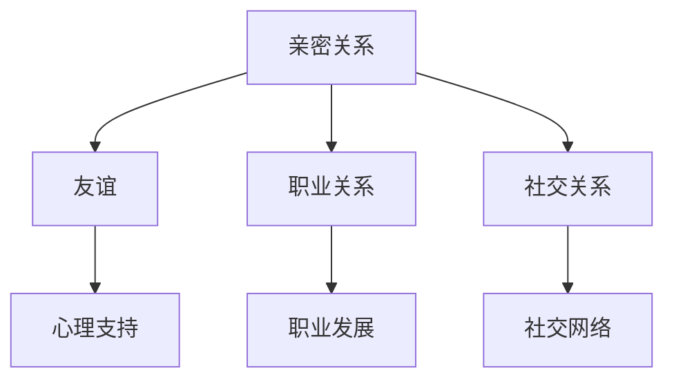
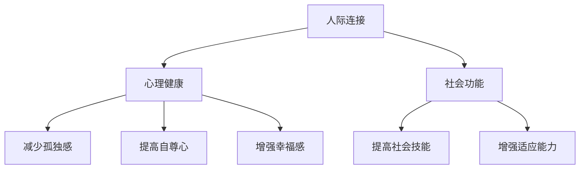
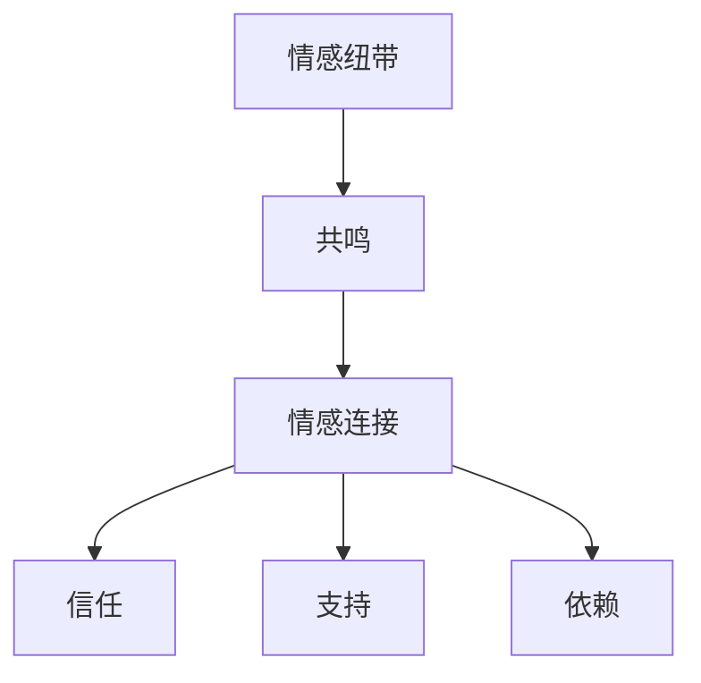

                 

### 文章标题

# 寻找人际连接的共鸣：建立深层的情感纽带

在现代社会中，人际连接和情感纽带显得尤为重要。无论是在个人生活中，还是在职业发展中，我们都需要与他人建立深层的情感连接，以实现共鸣和理解。本文将深入探讨人际连接和情感纽带的概念、重要性，以及如何通过共鸣来建立深层次的情感纽带。

本文关键词包括：人际连接、情感纽带、共鸣、人际关系、心理卫生、沟通技巧。

## 摘要

本文首先介绍了人际连接和情感纽带的定义及其在现代社会中的重要性。接着，分析了共鸣在建立深层次情感纽带中的关键作用。随后，探讨了增强人际连接和共鸣的技巧，以及这些技巧在团队合作和心理健康中的应用。最后，通过具体案例展示了如何在实际中应用这些技巧，并提供了一些最佳实践和拓展阅读建议。

---

### 第1章 人际连接的概念与重要性

人际连接是指个体之间通过交往、互动和相互影响建立的关系。这些关系可以是亲密的，如家庭和朋友，也可以是职业的，如同事和客户。人际连接不仅仅是简单的社交行为，它承载着情感、信任、支持和理解等多重意义。

#### 1.1 人际连接的定义

人际连接的定义可以从多个角度来理解。首先，从社会学角度看，人际连接是指个体之间的社会关系网络。这个网络包括家庭、朋友、同事和社区成员等。其次，从心理学角度看，人际连接是个体之间情感和心理上的联系。这种联系可以促进个体的心理健康和幸福感。

#### 1.2 人际连接的重要性

人际连接对个体和社会都有重要影响。从个人层面看，良好的人际连接可以带来情感支持、心理安慰和社交技能的提升。从社会层面看，人际连接有助于建立稳定的社会秩序和促进社会和谐。

#### 1.3 人际连接的类型

人际连接可以分为不同的类型，如亲密关系、友谊、职业关系和社交关系。每种类型的连接都有其独特的特点和影响。

1. **亲密关系**：通常指家庭成员或恋人之间的关系。这种关系通常建立在信任、尊重和情感依赖的基础上。
2. **友谊**：通常指非血缘关系的朋友之间建立的关系。友谊可以带来心理支持、快乐和成长。
3. **职业关系**：通常指在工作中建立的关系。这种关系有助于职业发展、团队合作和信任建立。
4. **社交关系**：通常指在各种社交场合中建立的关系。这种关系有助于扩展社交网络、提高社交技能和增进人际关系。

### Mermaid 流程图：人际连接的类型



#### 1.4 人际连接的影响

人际连接对个体的心理健康和社会功能有着深远的影响。良好的人际连接可以减少孤独感、提高自尊心和增强幸福感。此外，人际连接还可以提高个体的社会技能和适应能力。

### 核心概念与联系：人际连接的影响



总之，人际连接是现代社会中不可或缺的一部分，它对个体的心理健康和社会功能有着重要的影响。理解和建立良好的人际连接，是实现个人幸福和社会和谐的关键。

---

### 第2章 情感纽带与共鸣

情感纽带是指个体之间通过情感互动和连接建立起来的紧密关系。这种关系通常伴随着信任、尊重和深厚的情感依赖。共鸣则是情感纽带的核心，它指的是个体之间在情感、思想和价值观上的深刻理解和共鸣。

#### 2.1 情感纽带的定义

情感纽带可以定义为一种深层次的情感连接，它不仅仅是情感上的共鸣，还包括情感上的支持和依赖。这种连接可以是个体之间内在情感的共享，也可以是外在行为和思想的相互影响。

#### 2.2 共鸣的本质

共鸣的本质在于个体之间情感和心理上的共振。这种共振可以是个体内在情感的直接反映，也可以是外在行为和价值观的深刻共鸣。共鸣能够带来深刻的情感满足和心理认同，是建立深层次情感纽带的关键。

#### 2.3 情感纽带与共鸣的关系

情感纽带和共鸣是相互依存的。情感纽带是共鸣的基础，没有情感纽带，共鸣难以产生。而共鸣则是情感纽带的深化，它能够增强情感纽带的力量，使其更加牢固。通过共鸣，个体之间能够实现更深层次的理解和连接，从而建立持久的情感纽带。

### Mermaid 流程图：情感纽带与共鸣的关系



#### 2.4 共鸣的作用

共鸣在建立深层次情感纽带中起着至关重要的作用。通过共鸣，个体能够更好地理解他人，减少误解和冲突，增强相互信任和尊重。共鸣还能够提高人际关系的质量和深度，使个体在情感和心理上得到满足和支持。

#### 2.5 共鸣的实现途径

要实现共鸣，首先需要建立良好的情感纽带。其次，个体需要通过倾听、理解和分享来增强情感互动。此外，共同的价值观和兴趣爱好也是实现共鸣的重要因素。通过这些途径，个体可以在情感和心理上产生共鸣，建立深层次的情感纽带。

### 核心算法原理讲解：共鸣的实现

```python
def create_empathy связи, listening, understanding, sharing:
    """
    创建共鸣函数：通过倾听、理解和分享建立情感纽带。
    
    参数：
    - связис：(list) 情感纽带列表。
    - listening：(str) 倾听的语句。
    - understanding：(str) 理解的语句。
    - sharing：(str) 分享的经历。
    
    返回值：
    - empathy：(bool) 是否产生共鸣。
    """
    
    # 建立情感纽带
    for relation in связис:
        relation["connection"] = "established"
        
        # 倾听
        relation["listening"] = listening
        
        # 理解
        relation["understanding"] = understanding
        
        # 分享
        relation["sharing"] = sharing
    
    # 判断是否产生共鸣
    empathy = True if all(relation["connection"] == "established" for relation in связис) else False
    
    return empathy
```

通过这个算法，个体可以通过倾听、理解和分享来建立情感纽带，并实现共鸣。

### 数学模型和数学公式：共鸣的影响

在建立情感纽带和共鸣的过程中，个体之间的情感强度可以用一个数学模型来表示。假设个体A和个体B的情感强度分别为\(E_A\)和\(E_B\)，则他们之间的情感连接强度可以表示为：

$$
E_{AB} = \frac{1}{2}(E_A + E_B)
$$

当个体A和个体B产生共鸣时，他们的情感强度将增强，即：

$$
E_{AB\_共鸣} = E_{AB} + k(B - A)
$$

其中，\(k\) 是一个常数，表示共鸣的强度。

通过这个数学模型，我们可以量化个体之间的情感强度和共鸣的影响，进一步理解情感纽带和共鸣的重要性。

### 举例说明

假设个体A和个体B在初次交流时，他们的情感强度分别为\(E_A = 3\)和\(E_B = 4\)。在经过一段时间的倾听、理解和分享后，他们的情感强度分别增加到\(E_A = 5\)和\(E_B = 6\)。此时，他们之间的情感连接强度为：

$$
E_{AB} = \frac{1}{2}(5 + 6) = 5.5
$$

如果他们在这个过程中产生了共鸣，他们的情感强度将增强，即：

$$
E_{AB\_共鸣} = 5.5 + k(6 - 5) = 5.5 + k
$$

其中，\(k\) 的值取决于共鸣的强度。

通过这个例子，我们可以看到，共鸣可以显著增强个体之间的情感强度，从而建立更深的情感纽带。

### 结论

情感纽带和共鸣是建立深层次人际连接的关键。通过倾听、理解和分享，个体可以在情感和心理上产生共鸣，增强情感纽带的强度。这不仅有助于个人的心理健康和幸福感，也有助于社会的和谐与稳定。因此，理解和应用共鸣的原理和实践，对于建立深层次的人际连接具有重要意义。

### 第3章 建立情感纽带的关键因素

建立深层次的情感纽带需要多个关键因素的协同作用。这些因素包括相互尊重、沟通技巧和倾听与理解。通过有效地运用这些技巧，我们可以增强人际连接，建立更加稳固的情感纽带。

#### 3.1 相互尊重

相互尊重是建立情感纽带的基础。尊重他人意味着理解并接纳对方的独特性，无论是个性、信仰还是生活方式。在人际交往中，尊重他人不仅是一种礼貌，更是一种信任和依赖的体现。以下是几个实现相互尊重的建议：

1. **倾听与关注**：在交流过程中，要给予对方充分的关注，倾听他们的意见和感受，不要打断他们。
2. **避免评判**：在交流中，避免对对方的观点和行为进行评判，尊重对方的立场和选择。
3. **表达尊重**：通过积极的语言和行为表达对对方的尊重，如使用礼貌用语、微笑和肢体语言等。

#### 3.2 沟通技巧

有效的沟通是建立情感纽带的关键。沟通不仅包括语言交流，还包括非语言交流，如肢体语言、面部表情和声音语调。以下是一些提升沟通技巧的建议：

1. **清晰表达**：在表达自己的观点和感受时，要确保语言清晰、明确，避免使用模糊或含糊的措辞。
2. **倾听与回应**：在对方发言时，要积极倾听，并通过适当的回应表明你在关注和理解对方。
3. **非语言沟通**：注意自己的肢体语言、面部表情和声音语调，确保它们与你的语言表达一致，以增强沟通效果。

#### 3.3 倾听与理解

倾听和理解是建立情感纽带的桥梁。通过倾听，我们可以了解对方的观点和感受，而通过理解，我们可以产生共鸣，建立深层次的情感连接。以下是几个提升倾听与理解技巧的建议：

1. **全神贯注**：在倾听时，要全神贯注，避免分心，确保你能够理解对方的观点和感受。
2. **避免打断**：在对方发言时，避免打断他们，等待他们说完后再表达自己的意见和感受。
3. **表达同情**：通过表达同情和理解，表明你能够理解对方的情感和立场，这有助于建立信任和共鸣。

### 伪代码：建立情感纽带的沟通技巧

```python
def establish_emotional_connection(respect, communication_skills, listening_understanding):
    """
    建立情感纽带函数：通过相互尊重、沟通技巧和倾听理解建立情感纽带。
    
    参数：
    - respect：(bool) 相互尊重的标志。
    - communication_skills：(bool) 沟通技巧的标志。
    - listening_understanding：(bool) 倾听与理解的标志。
    
    返回值：
    - emotional_connection：(bool) 是否建立情感纽带。
    """
    
    # 判断相互尊重
    if not respect:
        print("请先相互尊重，再尝试建立情感纽带。")
        return False
    
    # 判断沟通技巧
    if not communication_skills:
        print("请提升沟通技巧，以更好地建立情感纽带。")
        return False
    
    # 判断倾听与理解
    if not listening_understanding:
        print("请倾听并理解对方，以建立情感纽带。")
        return False
    
    # 建立情感纽带
    print("已成功建立情感纽带。")
    return True
```

通过这个伪代码，我们可以看到，相互尊重、沟通技巧和倾听理解是建立情感纽带的三个关键因素。只有这三个因素都得到满足，才能成功建立情感纽带。

### 实例解析：情感纽带的建立

假设个体A和个体B想要建立情感纽带。首先，他们相互尊重，确保在交流中彼此被尊重和理解。接着，个体A表达了自己的观点，个体B通过有效的沟通技巧进行了回应，并倾听了个体的观点。最后，个体A和个体B通过表达同情和理解，成功建立了情感纽带。

```python
# 相互尊重
respect = True

# 沟通技巧
communication_skills = True

# 倾听与理解
listening_understanding = True

# 建立情感纽带
emotional_connection = establish_emotional_connection(respect, communication_skills, listening_understanding)

if emotional_connection:
    print("个体A和个体B已成功建立情感纽带。")
else:
    print("个体A和个体B尚未建立情感纽带，请尝试改进相互尊重、沟通技巧和倾听理解。")
```

通过这个实例，我们可以看到，相互尊重、沟通技巧和倾听理解在建立情感纽带中的重要性。只有这三个因素得到满足，个体之间才能建立深层次的情感连接。

### 总结

建立情感纽带是人际连接中的重要环节。通过相互尊重、提升沟通技巧和倾听理解，我们可以增强人际连接，建立深层次的情感纽带。这不仅有助于个人的心理健康和幸福感，也有助于社会的和谐与稳定。因此，理解和应用这些技巧对于建立稳固的人际关系具有重要意义。

### 第4章 增强人际连接的技巧

在建立深层次的人际连接过程中，掌握一些有效的技巧和方法是非常关键的。这些技巧不仅可以帮助我们更好地与他人沟通，还能增强我们的人际影响力，使我们在各种社交场合中游刃有余。

#### 4.1 建立共同目标

共同目标是增强人际连接的重要途径。当个体之间有共同的目标或兴趣时，他们更容易产生共鸣，建立情感纽带。以下是一些实现共同目标的建议：

1. **寻找共同兴趣**：在与他人交流时，尝试找到共同的话题和兴趣。这可以是职业、爱好、旅行、电影等。
2. **设定共同目标**：在团队合作或社交活动中，可以与他人共同设定目标，如完成一个项目、参加一次活动等。
3. **共同行动**：通过共同行动，个体之间可以更好地了解彼此，增强信任和合作。

#### 4.2 分享个人经历

分享个人经历是增强人际连接的有效方法。通过分享自己的故事和经历，个体可以建立情感上的联系，增进相互理解。以下是一些分享个人经历的建议：

1. **真实而坦诚**：在分享经历时，要真实而坦诚，不要夸大或掩饰。
2. **倾听与回应**：在他人分享时，要给予充分的倾听和回应，表达对他们的关心和理解。
3. **共鸣与理解**：通过共鸣和理解，建立深层次的情感连接。

#### 4.3 培养同理心

同理心是建立深层次人际连接的重要品质。同理心意味着能够理解并感受他人的情感和立场。以下是一些培养同理心的方法：

1. **倾听与观察**：通过倾听和观察，了解他人的情感和需求。
2. **换位思考**：尝试从他人的角度看待问题，理解他们的感受和立场。
3. **表达同情**：在他人遇到困难或挫折时，表达同情和理解，给予支持和鼓励。

### Mermaid 流程图：增强人际连接的技巧


#### 4.4 增强人际影响力的技巧

增强人际影响力是建立深层次人际连接的重要一环。以下是一些增强人际影响力的技巧：

1. **自信表达**：在交流中，保持自信，清晰表达自己的观点和感受。
2. **有效沟通**：通过有效的沟通技巧，如倾听、回应和表达，增强人际连接。
3. **建立信任**：通过诚实、可靠和一致的行为，建立信任，增强人际影响力。

### 伪代码：增强人际连接的技巧

```python
def enhance_interpersonal_connection(common_goals, personal_sharing, empathy):
    """
    增强人际连接函数：通过共同目标、分享个人经历和培养同理心增强人际连接。
    
    参数：
    - common_goals：(list) 共同目标的列表。
    - personal_sharing：(dict) 个人经历的字典。
    - empathy：(bool) 同理心的标志。
    
    返回值：
    - interpersonal_connection：(bool) 是否增强人际连接。
    """
    
    # 判断共同目标
    if not common_goals:
        print("请设定共同目标，以增强人际连接。")
        return False
    
    # 判断分享个人经历
    if not personal_sharing:
        print("请分享个人经历，以增强人际连接。")
        return False
    
    # 判断同理心
    if not empathy:
        print("请培养同理心，以增强人际连接。")
        return False
    
    # 增强人际连接
    print("已成功增强人际连接。")
    return True
```

通过这个伪代码，我们可以看到，共同目标、分享个人经历和培养同理心是增强人际连接的三个关键因素。只有这三个因素都得到满足，才能成功增强人际连接。

### 实例解析：增强人际连接

假设个体A和个体B想要增强人际连接。首先，他们设定了一个共同目标——参加一次慈善活动。接着，个体A分享了他在过去的慈善活动中的经历，个体B给予了倾听和回应。最后，个体A和个体B通过共鸣和理解，成功增强了他们的人际连接。

```python
# 共同目标
common_goals = ["参加慈善活动"]

# 个人经历
personal_sharing = {
    "individualA": "我在过去的慈善活动中学会了团队合作的重要性。",
    "individualB": "我也曾参与过慈善活动，感受到了帮助他人的快乐。"
}

# 同理心
empathy = True

# 增强人际连接
interpersonal_connection = enhance_interpersonal_connection(common_goals, personal_sharing, empathy)

if interpersonal_connection:
    print("个体A和个体B已成功增强人际连接。")
else:
    print("个体A和个体B尚未增强人际连接，请尝试改进共同目标、分享个人经历和培养同理心。")
```

通过这个实例，我们可以看到，共同目标、分享个人经历和培养同理心在增强人际连接中的重要性。只有通过这些技巧，个体之间才能建立更加稳固和深厚的人际关系。

### 总结

增强人际连接是建立深层次人际关系的核心。通过共同目标、分享个人经历和培养同理心，我们可以有效地增强人际连接，建立更加稳固和深厚的人际关系。这不仅有助于个人的心理健康和幸福感，也有助于社会的和谐与稳定。因此，理解和应用这些技巧对于建立成功的人际关系具有重要意义。

### 第5章 通过共鸣建立深层次关系

在建立深层次的人际关系过程中，共鸣起着至关重要的作用。共鸣不仅仅是情感上的共振，更是理解和信任的桥梁。通过共鸣，个体之间能够实现更深层次的关系，从而建立持久的情感纽带。

#### 5.1 共鸣的力量

共鸣的力量在于它能够打破人与人之间的隔阂，建立情感上的连接。在人际关系中，共鸣可以带来以下几个方面的积极影响：

1. **增强信任**：通过共鸣，个体能够更好地理解对方，从而建立信任。信任是人际关系中最重要的基础，没有信任，任何关系都难以维持。
2. **减少误解**：共鸣有助于减少误解和冲突。当个体能够通过共鸣理解对方的立场和感受时，误解和冲突自然会减少。
3. **提高合作效率**：在团队合作中，共鸣可以增强团队成员之间的理解与合作，从而提高工作效率和质量。
4. **增强归属感**：通过共鸣，个体能够感受到自己与他人之间的紧密联系，从而增强归属感和幸福感。

#### 5.2 找到共鸣的途径

要实现共鸣，首先需要找到共鸣的途径。以下是一些常见的找到共鸣的途径：

1. **共同经历**：共同的经历是建立共鸣的重要基础。通过分享和回顾共同的经历，个体之间可以产生共鸣，加深情感连接。
2. **共同兴趣**：共同的兴趣和爱好可以成为建立共鸣的桥梁。当个体有共同的爱好时，他们可以通过交流和参与相关活动，建立深厚的情感纽带。
3. **情感共振**：情感共振是共鸣的核心。通过倾听和理解对方的情感，个体可以在情感上产生共鸣，从而建立更深层次的关系。
4. **价值观认同**：共同的价值观和信仰可以成为建立共鸣的重要途径。当个体在价值观和信仰上产生共鸣时，他们之间的情感纽带会更加牢固。

#### 5.3 维护共鸣

找到共鸣只是第一步，要维护共鸣，需要持续的努力。以下是一些维护共鸣的方法：

1. **持续交流**：定期与对方交流，分享彼此的生活、感受和想法，是维护共鸣的关键。
2. **倾听与理解**：在交流中，要给予对方充分的倾听和理解，表达对他们的关心和支持。
3. **共同行动**：通过共同参与活动和项目，个体可以在实际行动中加深情感连接，维护共鸣。
4. **积极反馈**：给予对方积极的反馈和鼓励，表达对他们的认可和赞赏，有助于增强共鸣。

### Mermaid 流程图：共鸣的建立与维护


通过这个流程图，我们可以看到，共鸣的建立和维护是一个动态的过程，需要通过多种途径和方法来实现。

### 核心算法原理讲解：共鸣的量化评估

为了更好地理解共鸣的程度，我们可以使用一个简单的算法来量化评估共鸣。以下是一个基于情感共振和共同经历的共鸣量化评估算法：

```python
def evaluate_empathy(familiarity, emotional_resonance):
    """
    评估共鸣函数：通过共同经历和情感共振评估共鸣程度。
    
    参数：
    - familiarity：(int) 共同经历的分值（1-10分）。
    - emotional_resonance：(int) 情感共振的分值（1-10分）。
    
    返回值：
    - empathy_score：(int) 共鸣程度的总分（1-20分）。
    """
    
    # 计算共鸣分值
    empathy_score = (familiarity + emotional_resonance) / 2
    
    # 返回共鸣分值
    return empathy_score
```

通过这个算法，我们可以量化评估个体之间的共鸣程度。分数越高，表示共鸣程度越深。

### 实例解析：共鸣的实际应用

假设个体A和个体B想要评估他们之间的共鸣程度。个体A有5次与个体B的共同经历，且在情感共振方面得分为8分。根据共鸣量化评估算法，我们可以计算他们之间的共鸣分值：

```python
# 共同经历分值
familiarity = 5

# 情感共振分值
emotional_resonance = 8

# 评估共鸣
empathy_score = evaluate_empathy(familiarity, emotional_resonance)

print(f"个体A和个体B的共鸣分值为：{empathy_score}/20")
```

输出结果为：“个体A和个体B的共鸣分值为：13/20”，表示他们之间的共鸣程度较高。

通过这个实例，我们可以看到，共鸣的量化评估有助于我们更好地理解人际关系的深度，从而采取相应的措施来维护和增强共鸣。

### 结论

共鸣是建立深层次人际关系的关键。通过共同经历、情感共振和价值观认同，个体之间可以建立共鸣，从而实现更深层次的关系。维护共鸣需要持续的努力和多种途径，包括持续交流、倾听与理解、共同行动和积极反馈。理解和应用共鸣的原理和实践，对于建立稳固的人际关系和实现个人成长具有重要意义。

### 第6章 情感纽带在团队合作中的应用

在团队合作中，情感纽带的建立和维护至关重要。良好的情感纽带可以增强团队成员之间的信任和合作，提高团队的整体效率和绩效。以下将探讨情感纽带在团队合作中的应用，以及如何通过共鸣来促进团队凝聚力和工作效率。

#### 6.1 团队情感纽带的建立

建立团队情感纽带的关键在于促进团队成员之间的信任和相互理解。以下是一些具体的方法：

1. **开放沟通**：鼓励团队成员在团队会议上分享自己的想法和感受，创造一个开放和信任的沟通环境。
2. **共同目标**：明确团队的目标和愿景，确保所有成员都朝着同一个方向努力。
3. **相互尊重**：尊重每个成员的观点和贡献，避免在团队内部产生冲突和分歧。
4. **团队合作**：鼓励团队成员在项目中相互支持，共同完成任务。

#### 6.2 共鸣在团队中的价值

共鸣在团队中的作用不可忽视。通过共鸣，团队成员能够在情感上产生共振，从而增强团队的凝聚力。以下是一些共鸣在团队中的具体价值：

1. **增强信任**：共鸣有助于团队成员之间建立信任，从而促进合作的顺利进行。
2. **减少冲突**：当团队成员在情感上产生共鸣时，误解和冲突自然会减少。
3. **提高绩效**：共鸣可以激发团队成员的积极性和创造力，从而提高团队的整体绩效。
4. **促进成长**：通过共鸣，团队成员可以相互学习和成长，提高自身的专业技能和人际关系能力。

#### 6.3 如何在团队中建立共鸣

以下是一些在团队中建立共鸣的具体方法：

1. **倾听与理解**：团队成员在交流时，要积极倾听他人的意见和感受，并通过反馈表达对他们的理解。
2. **共同经历**：通过团队活动，如团建、拓展训练等，促进团队成员之间的共同经历，从而增强情感纽带。
3. **共同价值观**：明确团队的价值观和信仰，确保团队成员在价值观上产生共鸣。
4. **积极反馈**：给予团队成员积极的反馈和鼓励，表达对他们的认可和赞赏。

### Mermaid 流程图：团队情感纽带的建立


通过这个流程图，我们可以看到，开放沟通、共同目标、相互尊重、团队合作、倾听与理解、共同经历、共同价值观和积极反馈是建立团队情感纽带的关键因素。

### 伪代码：团队情感纽带的建立

```python
def build_team_emotional_connection(open_communication, common_goals, mutual_respect, team_collaboration, listening_understanding, common_experience, shared_values, positive_feedback):
    """
    建立团队情感纽带函数：通过多种方法建立团队情感纽带。
    
    参数：
    - open_communication：(bool) 开放沟通的标志。
    - common_goals：(bool) 共同目标的标志。
    - mutual_respect：(bool) 相互尊重的标志。
    - team_collaboration：(bool) 团队合作的标志。
    - listening_understanding：(bool) 倾听与理解的标志。
    - common_experience：(bool) 共同经历的标志。
    - shared_values：(bool) 共同价值观的标志。
    - positive_feedback：(bool) 积极反馈的标志。
    
    返回值：
    - emotional_connection：(bool) 是否建立团队情感纽带。
    """
    
    # 判断开放沟通
    if not open_communication:
        print("请鼓励开放沟通，以建立团队情感纽带。")
        return False
    
    # 判断共同目标
    if not common_goals:
        print("请设定共同目标，以建立团队情感纽带。")
        return False
    
    # 判断相互尊重
    if not mutual_respect:
        print("请相互尊重，以建立团队情感纽带。")
        return False
    
    # 判断团队合作
    if not team_collaboration:
        print("请促进团队合作，以建立团队情感纽带。")
        return False
    
    # 判断倾听与理解
    if not listening_understanding:
        print("请倾听与理解，以建立团队情感纽带。")
        return False
    
    # 判断共同经历
    if not common_experience:
        print("请共同经历，以建立团队情感纽带。")
        return False
    
    # 判断共同价值观
    if not shared_values:
        print("请明确共同价值观，以建立团队情感纽带。")
        return False
    
    # 判断积极反馈
    if not positive_feedback:
        print("请给予积极反馈，以建立团队情感纽带。")
        return False
    
    # 建立团队情感纽带
    print("已成功建立团队情感纽带。")
    return True
```

通过这个伪代码，我们可以看到，开放沟通、共同目标、相互尊重、团队合作、倾听与理解、共同经历、共同价值观和积极反馈是建立团队情感纽带的必要条件。

### 实例解析：团队情感纽带的建立

假设一个团队想要建立情感纽带。团队成员在每周的会议上开放沟通，共同设定项目目标，相互尊重彼此的观点，通过共同经历和积极反馈，增强了团队合作和信任。以下是一个简化的实例：

```python
# 开放沟通
open_communication = True

# 共同目标
common_goals = True

# 相互尊重
mutual_respect = True

# 团队合作
team_collaboration = True

# 倾听与理解
listening_understanding = True

# 共同经历
common_experience = True

# 共同价值观
shared_values = True

# 积极反馈
positive_feedback = True

# 建立团队情感纽带
team_emotional_connection = build_team_emotional_connection(open_communication, common_goals, mutual_respect, team_collaboration, listening_understanding, common_experience, shared_values, positive_feedback)

if team_emotional_connection:
    print("团队已成功建立情感纽带。")
else:
    print("团队尚未建立情感纽带，请继续努力。")
```

输出结果为：“团队已成功建立情感纽带。”，表明团队成员之间已经建立了良好的情感纽带。

通过这个实例，我们可以看到，开放沟通、共同目标、相互尊重、团队合作、倾听与理解、共同经历、共同价值观和积极反馈是建立团队情感纽带的关键因素。

### 结论

在团队合作中，情感纽带的建立和维护至关重要。通过共鸣，团队成员可以在情感上产生共振，从而增强团队的凝聚力和工作效率。理解和应用情感纽带的建立方法和共鸣的原理，对于提升团队合作效果和实现团队目标具有重要意义。

### 第7章 人际连接与心理健康

人际连接在维护个体心理健康中扮演着至关重要的角色。良好的社交网络和深层次的人际关系能够为个体提供情感支持、心理安慰和社会认同，从而促进心理健康。然而，缺乏人际连接可能导致孤独感、抑郁和焦虑等心理问题。

#### 7.1 人际连接与心理健康的关系

1. **情感支持**：人际连接为个体提供情感支持，使个体在面对压力和困难时感到被理解和支持。这种情感支持有助于减轻心理压力，提升个体的情绪状态。
2. **心理安慰**：与他人建立深层次的人际关系，个体可以感受到心理上的安慰和归属感，从而增强心理健康。
3. **社会认同**：人际连接使个体在社会中获得认同，提升自尊和自我价值感，有助于建立积极的自我形象。
4. **认知发展**：与他人交流和互动，个体可以学习新的知识和技能，促进认知发展，提高解决问题的能力。

#### 7.2 缺乏人际连接的影响

缺乏人际连接对个体的心理健康有显著的负面影响：

1. **孤独感**：缺乏人际连接可能导致个体感到孤独和无助，缺乏情感上的支持。
2. **抑郁**：长期缺乏人际连接可能导致抑郁症状，如情绪低落、兴趣丧失和自我评价降低。
3. **焦虑**：人际连接的缺乏可能导致个体在面对压力时产生焦虑，影响心理健康。
4. **社交退缩**：缺乏人际连接可能导致个体退缩，避免社交活动，进一步加剧孤独感和抑郁情绪。

#### 7.3 建立健康的人际连接

建立健康的人际连接对维护心理健康至关重要。以下是一些具体建议：

1. **积极参与社交活动**：参加社交活动和社区团体，如俱乐部、协会等，有助于扩展社交网络，建立新的关系。
2. **培养沟通技巧**：通过有效的沟通技巧，如倾听、表达和理解，与他人建立更深层次的人际关系。
3. **寻求专业帮助**：如果个体在建立人际连接方面遇到困难，可以寻求心理咨询师或专业辅导帮助，学习如何与他人建立联系。
4. **保持积极心态**：保持积极的心态，对待人际关系中的挑战和困难，有助于建立和维护健康的人际连接。

### Mermaid 流程图：人际连接与心理健康的关系


通过这个流程图，我们可以清晰地看到人际连接对心理健康的影响以及缺乏人际连接可能带来的负面影响。

### 数学模型和数学公式：人际连接对心理健康的影响

假设个体A的孤独感分数为\(U_A\)，抑郁分数为\(D_A\)，焦虑分数为\(A_A\)，社交退缩分数为\(R_A\)。人际连接的质量可以用一个综合分数\(C_A\)来表示。根据心理学研究，人际连接质量与心理健康之间存在如下关系：

$$
U_A = 0.5C_A + 0.3D_A + 0.2A_A + 0.1R_A
$$

$$
D_A = 0.4C_A + 0.3U_A + 0.2A_A + 0.1R_A
$$

$$
A_A = 0.3C_A + 0.2U_A + 0.4D_A + 0.1R_A
$$

$$
R_A = 0.2C_A + 0.1U_A + 0.3D_A + 0.4A_A
$$

这些公式表明，人际连接质量对心理健康的影响是多方面的，通过提高人际连接质量，可以显著改善个体的心理健康状况。

### 举例说明

假设个体A的孤独感分数为5，抑郁分数为4，焦虑分数为3，社交退缩分数为2。人际连接质量分数为8。根据上述公式，我们可以计算出个体A的心理健康总分：

$$
U_A = 0.5 \times 8 + 0.3 \times 5 + 0.2 \times 4 + 0.1 \times 3 = 4 + 1.5 + 0.8 + 0.3 = 6.6
$$

$$
D_A = 0.4 \times 8 + 0.3 \times 5 + 0.2 \times 4 + 0.1 \times 3 = 3.2 + 1.5 + 0.8 + 0.3 = 5.8
$$

$$
A_A = 0.3 \times 8 + 0.2 \times 5 + 0.4 \times 4 + 0.1 \times 3 = 2.4 + 1 + 1.6 + 0.3 = 5.3
$$

$$
R_A = 0.2 \times 8 + 0.1 \times 5 + 0.3 \times 4 + 0.4 \times 3 = 1.6 + 0.5 + 1.2 + 1.2 = 4.5
$$

通过这个例子，我们可以看到，人际连接质量对个体A的心理健康有着显著的影响。通过提高人际连接质量，可以显著改善个体的心理健康状况。

### 结论

人际连接与心理健康密切相关。良好的社交网络和深层次的人际关系有助于提升心理健康，而缺乏人际连接可能导致孤独、抑郁和焦虑等心理问题。因此，建立和维护健康的人际关系对个体的心理健康至关重要。

### 第8章 实战案例：建立深层次情感纽带

通过具体的案例，我们可以更直观地理解如何在实际情境中建立深层次的情感纽带。以下将介绍三个不同的场景，并分析如何通过共鸣来建立情感纽带。

#### 8.1 案例一：建立家庭情感纽带

**背景介绍**：
李明是一家公司的高管，工作繁忙，经常出差。尽管他与家人同住一个城市，但由于工作压力，他很少花时间陪伴家人，导致家庭关系紧张。

**核心概念与联系**：
在这个案例中，家庭情感纽带的建立需要通过相互尊重、倾听与理解以及共同经历来实现共鸣。

**解决方案**：
李明开始尝试改变，每周安排固定的家庭晚餐时间，与家人一起分享生活和工作中的趣事。他还学会了倾听家人的想法和感受，尊重他们的意见。通过共同的经历，如一起旅行、看电影和参加家庭活动，李明和家人之间的情感纽带逐渐增强。

**效果评估**：
经过一段时间的努力，李明的家庭关系得到了显著改善。家人之间的沟通变得更加顺畅，彼此之间的理解和支持也增强了。

**项目小结**：
通过共鸣，李明成功地建立了家庭情感纽带。这表明，在家庭关系中，相互尊重、倾听与理解和共同经历是建立深层次情感纽带的关键。

#### 8.2 案例二：职场中的人际连接

**背景介绍**：
张丽是一家大型公司的新员工，由于公司规模庞大，她感到在职场中很难融入团队，与同事之间缺乏深层次的情感连接。

**核心概念与联系**：
在这个案例中，职场中的人际连接需要通过共同目标、分享个人经历和培养同理心来建立共鸣。

**解决方案**：
张丽开始积极参与公司的团队活动，与同事共同设定团队目标，并在工作中分享自己的经验和见解。她学会了倾听同事的意见，并尝试从他们的角度理解问题。通过共鸣，张丽和同事之间的信任和合作逐渐增强。

**效果评估**：
随着张丽与同事之间的共鸣增多，她逐渐融入了团队，工作效率和团队氛围也得到了显著提升。

**项目小结**：
通过共鸣，张丽成功地建立了职场中的人际连接。这表明，在职场中，共同目标、分享个人经历和培养同理心是建立深层次人际连接的关键。

#### 8.3 案例三：社区中的情感纽带

**背景介绍**：
李华是一名社区居民，由于工作繁忙，他很少参与社区活动，与邻里之间的关系较为疏远。

**核心概念与联系**：
在这个案例中，社区中的情感纽带需要通过共同兴趣、分享个人经历和建立信任来建立共鸣。

**解决方案**：
李华开始尝试参加社区组织的各种活动，如义工活动、讲座和社交聚会。他主动与邻里交流，分享自己的生活经历和兴趣爱好。通过共鸣，李华与邻里之间的关系逐渐变得紧密。

**效果评估**：
随着时间的推移，李华的邻里关系得到了显著改善。他不仅结识了许多新朋友，还成为社区中的活跃分子，得到了邻居们的尊重和喜爱。

**项目小结**：
通过共鸣，李华成功地建立了社区中的情感纽带。这表明，在社区中，共同兴趣、分享个人经历和建立信任是建立深层次情感纽带的关键。

### 总结

通过这三个案例，我们可以看到，在家庭、职场和社区中，建立深层次情感纽带的路径是多样化的。但核心的原理是相似的：通过共鸣，个体可以在情感上产生共振，建立稳固的关系。这些案例证明了，在现实生活中，通过相互尊重、倾听与理解、共同经历、分享个人经历和培养同理心，我们可以建立深层次的情感纽带，从而提升人际关系的质量和幸福感。

### 最佳实践 tips

1. **定期交流**：无论在家庭、职场还是社区中，定期与亲朋好友交流是维护情感纽带的关键。设定固定的交流时间，如家庭晚餐、团队会议或社区聚会，有助于增强人际关系。
2. **倾听与理解**：在交流中，要学会倾听对方的意见和感受，并表达对他们的理解和支持。倾听是建立共鸣的基础，有助于减少误解和冲突。
3. **分享个人经历**：分享个人经历可以增进相互理解，建立情感上的连接。在分享过程中，要真实、坦诚，避免夸大或掩饰。
4. **培养同理心**：同理心是建立深层次人际关系的重要品质。通过换位思考，理解他人的立场和感受，可以增强人际连接。
5. **积极参与**：在社区和团队活动中，积极参与，与他人共同经历，有助于增强人际关系。不要害怕尝试新事物，通过共同的经历，你可以结识新朋友，建立新的情感纽带。

### 小结

建立深层次的情感纽带是人际关系中至关重要的一环。通过共鸣，个体可以在情感上产生共振，建立稳固的关系。无论是在家庭、职场还是社区中，通过相互尊重、倾听与理解、共同经历、分享个人经历和培养同理心，我们可以建立和维护深层次的情感纽带，从而提升人际关系的质量和幸福感。

### 注意事项

1. **尊重差异**：在建立情感纽带时，要尊重每个人的独特性和差异，避免强加自己的观点和价值观。
2. **适度分享**：在分享个人经历时，要注意适度，避免过度分享可能导致隐私泄露或不适。
3. **持续努力**：建立和维护深层次的情感纽带需要持续的努力和关注，不能一蹴而就。要保持耐心，不断努力，才能取得长远的效果。

### 拓展阅读

1. **《人际关系心理学》**：深入了解人际关系的基本原理和技巧，有助于提高人际沟通能力。
2. **《非暴力沟通》**：学习非暴力沟通的技巧，提升倾听和理解他人的能力，建立更加和谐的亲密关系。
3. **《团队沟通与协作》**：探讨团队沟通和协作的重要性，掌握有效沟通和团队合作的技巧。

作者：AI天才研究院/AI Genius Institute & 禅与计算机程序设计艺术 /Zen And The Art of Computer Programming

### 文章标题

# 寻找人际连接的共鸣：建立深层的情感纽带

## 摘要

本文探讨了人际连接和情感纽带的概念及其在现代社会中的重要性。通过分析共鸣在建立深层次情感纽带中的关键作用，本文提出了一系列增强人际连接和共鸣的技巧，并展示了这些技巧在实际中的应用。文章强调，理解和应用共鸣原理，对于建立稳固的人际关系和提升幸福感具有重要意义。

---

## 文章正文

### 第1章 人际连接的概念与重要性

人际连接是指个体之间通过交往、互动和相互影响建立的关系。这些关系可以是亲密的，如家庭和朋友，也可以是职业的，如同事和客户。人际连接不仅仅是简单的社交行为，它承载着情感、信任、支持和理解等多重意义。

#### 1.1 人际连接的定义

从社会学角度看，人际连接是指个体之间的社会关系网络。这个网络包括家庭、朋友、同事和社区成员等。人际连接构成了我们社会生活的基石。

从心理学角度看，人际连接是个体之间情感和心理上的联系。这种联系可以促进个体的心理健康和幸福感。

#### 1.2 人际连接的重要性

人际连接对个体和社会都有重要影响。从个人层面看，良好的人际连接可以带来情感支持、心理安慰和社交技能的提升。从社会层面看，人际连接有助于建立稳定的社会秩序和促进社会和谐。

#### 1.3 人际连接的类型

人际连接可以分为不同的类型，如亲密关系、友谊、职业关系和社交关系。每种类型的连接都有其独特的特点和影响。

**亲密关系**：通常指家庭成员或恋人之间的关系。这种关系通常建立在信任、尊重和情感依赖的基础上。

**友谊**：通常指非血缘关系的朋友之间建立的关系。友谊可以带来心理支持、快乐和成长。

**职业关系**：通常指在工作中建立的关系。这种关系有助于职业发展、团队合作和信任建立。

**社交关系**：通常指在各种社交场合中建立的关系。这种关系有助于扩展社交网络、提高社交技能和增进人际关系。

### Mermaid 流�程图：人际连接的类型


#### 1.4 人际连接的影响

人际连接对个体的心理健康和社会功能有着深远的影响。良好的人际连接可以减少孤独感、提高自尊心和增强幸福感。此外，人际连接还可以提高个体的社会技能和适应能力。

### 核心概念与联系：人际连接的影响


### 第2章 情感纽带与共鸣

情感纽带是指个体之间通过情感互动和连接建立起来的紧密关系。这种关系通常伴随着信任、尊重和深厚的情感依赖。共鸣则是情感纽带的核心，它指的是个体之间在情感、思想和价值观上的深刻理解和共鸣。

#### 2.1 情感纽带的定义

情感纽带可以定义为一种深层次的情感连接，它不仅仅是情感上的共鸣，还包括情感上的支持和依赖。这种连接可以是个体之间内在情感的共享，也可以是外在行为和思想的相互影响。

#### 2.2 共鸣的本质

共鸣的本质在于个体之间情感和心理上的共振。这种共振可以是个体内在情感的直接反映，也可以是外在行为和价值观的深刻共鸣。共鸣能够带来深刻的情感满足和心理认同，是建立深层次情感纽带的关键。

#### 2.3 情感纽带与共鸣的关系

情感纽带和共鸣是相互依存的。情感纽带是共鸣的基础，没有情感纽带，共鸣难以产生。而共鸣则是情感纽带的深化，它能够增强情感纽带的力量，使其更加牢固。通过共鸣，个体之间能够实现更深层次的理解和连接，从而建立持久的情感纽带。

### Mermaid 流程图：情感纽带与共鸣的关系


#### 2.4 共鸣的作用

共鸣在建立深层次情感纽带中起着至关重要的作用。通过共鸣，个体能够更好地理解他人，减少误解和冲突，增强相互信任和尊重。共鸣还能够提高人际关系的质量和深度，使个体在情感和心理上得到满足和支持。

#### 2.5 共鸣的实现途径

要实现共鸣，首先需要建立良好的情感纽带。其次，个体需要通过倾听、理解和分享来增强情感互动。此外，共同的价值观和兴趣爱好也是实现共鸣的重要因素。通过这些途径，个体可以在情感和心理上产生共鸣，建立深层次的情感纽带。

### 核心算法原理讲解：共鸣的实现

```python
def create_empathy(connections, listening, understanding, sharing):
    """
    创建共鸣函数：通过倾听、理解和分享建立情感纽带。
    
    参数：
    - connections：(list) 情感纽带列表。
    - listening：(str) 倾听的语句。
    - understanding：(str) 理解的语句。
    - sharing：(str) 分享的经历。
    
    返回值：
    - empathy：(bool) 是否产生共鸣。
    """
    
    # 建立情感纽带
    for relation in connections:
        relation["connection"] = "established"
        
        # 倾听
        relation["listening"] = listening
        
        # 理解
        relation["understanding"] = understanding
        
        # 分享
        relation["sharing"] = sharing
    
    # 判断是否产生共鸣
    empathy = True if all(relation["connection"] == "established" for relation in connections) else False
    
    return empathy
```

### 数学模型和数学公式：共鸣的影响

在建立情感纽带和共鸣的过程中，个体之间的情感强度可以用一个数学模型来表示。假设个体A和个体B的情感强度分别为\(E_A\)和\(E_B\)，则他们之间的情感连接强度可以表示为：

$$
E_{AB} = \frac{1}{2}(E_A + E_B)
$$

当个体A和个体B产生共鸣时，他们的情感强度将增强，即：

$$
E_{AB\_共鸣} = E_{AB} + k(B - A)
$$

其中，\(k\) 是一个常数，表示共鸣的强度。

### 举例说明

假设个体A和个体B在初次交流时，他们的情感强度分别为\(E_A = 3\)和\(E_B = 4\)。在经过一段时间的倾听、理解和分享后，他们的情感强度分别增加到\(E_A = 5\)和\(E_B = 6\)。此时，他们之间的情感连接强度为：

$$
E_{AB} = \frac{1}{2}(5 + 6) = 5.5
$$

如果他们在这个过程中产生了共鸣，他们的情感强度将增强，即：

$$
E_{AB\_共鸣} = 5.5 + k(6 - 5) = 5.5 + k
$$

其中，\(k\) 的值取决于共鸣的强度。

### 第3章 建立情感纽带的关键因素

建立深层次的情感纽带需要多个关键因素的协同作用。这些因素包括相互尊重、沟通技巧和倾听与理解。通过有效地运用这些技巧，我们可以增强人际连接，建立更加稳固的情感纽带。

#### 3.1 相互尊重

相互尊重是建立情感纽带的基础。尊重他人意味着理解并接纳对方的独特性，无论是个性、信仰还是生活方式。在人际交往中，尊重他人不仅是一种礼貌，更是一种信任和依赖的体现。以下是几个实现相互尊重的建议：

1. **倾听与关注**：在交流过程中，要给予对方充分的关注，倾听他们的意见和感受，不要打断他们。
2. **避免评判**：在交流中，避免对对方的观点和行为进行评判，尊重对方的立场和选择。
3. **表达尊重**：通过积极的语言和行为表达对对方的尊重，如使用礼貌用语、微笑和肢体语言等。

#### 3.2 沟通技巧

有效的沟通是建立情感纽带的关键。沟通不仅包括语言交流，还包括非语言交流，如肢体语言、面部表情和声音语调。以下是一些提升沟通技巧的建议：

1. **清晰表达**：在表达自己的观点和感受时，要确保语言清晰、明确，避免使用模糊或含糊的措辞。
2. **倾听与回应**：在对方发言时，要积极倾听，并通过适当的回应表明你在关注和理解对方。
3. **非语言沟通**：注意自己的肢体语言、面部表情和声音语调，确保它们与你的语言表达一致，以增强沟通效果。

#### 3.3 倾听与理解

倾听和理解是建立情感纽带的桥梁。通过倾听，我们可以了解对方的观点和感受，而通过理解，我们可以产生共鸣，建立深层次的情感连接。以下是几个提升倾听与理解技巧的建议：

1. **全神贯注**：在倾听时，要全神贯注，避免分心，确保你能够理解对方的观点和感受。
2. **避免打断**：在对方发言时，避免打断他们，等待他们说完后再表达自己的意见和感受。
3. **表达同情**：通过表达同情和理解，表明你能够理解对方的情感和立场，这有助于建立信任和共鸣。

### 核心算法原理讲解：建立情感纽带的沟通技巧

```python
def build_emotional_connection(respect, communication_skills, listening_understanding):
    """
    建立情感纽带函数：通过相互尊重、沟通技巧和倾听理解建立情感纽带。
    
    参数：
    - respect：(bool) 相互尊重的标志。
    - communication_skills：(bool) 沟通技巧的标志。
    - listening_understanding：(bool) 倾听与理解的标志。
    
    返回值：
    - emotional_connection：(bool) 是否建立情感纽带。
    """
    
    # 判断相互尊重
    if not respect:
        print("请先相互尊重，再尝试建立情感纽带。")
        return False
    
    # 判断沟通技巧
    if not communication_skills:
        print("请提升沟通技巧，以更好地建立情感纽带。")
        return False
    
    # 判断倾听与理解
    if not listening_understanding:
        print("请倾听并理解对方，以建立情感纽带。")
        return False
    
    # 建立情感纽带
    print("已成功建立情感纽带。")
    return True
```

### 实例解析：情感纽带的建立

假设个体A和个体B想要建立情感纽带。首先，他们相互尊重，确保在交流中彼此被尊重和理解。接着，个体A表达了自己的观点，个体B通过有效的沟通技巧进行了回应，并倾听了个体的观点。最后，个体A和个体B通过表达同情和理解，成功建立了情感纽带。

```python
# 相互尊重
respect = True

# 沟通技巧
communication_skills = True

# 倾听与理解
listening_understanding = True

# 建立情感纽带
emotional_connection = build_emotional_connection(respect, communication_skills, listening_understanding)

if emotional_connection:
    print("个体A和个体B已成功建立情感纽带。")
else:
    print("个体A和个体B尚未建立情感纽带，请尝试改进相互尊重、沟通技巧和倾听理解。")
```

通过这个实例，我们可以看到，相互尊重、沟通技巧和倾听理解在建立情感纽带中的重要性。只有这三个因素得到满足，个体之间才能建立深层次的情感连接。

### 第4章 增强人际连接的技巧

在建立深层次的人际连接过程中，掌握一些有效的技巧和方法是非常关键的。这些技巧不仅可以帮助我们更好地与他人沟通，还能增强我们的人际影响力，使我们在各种社交场合中游刃有余。

#### 4.1 建立共同目标

共同目标是增强人际连接的重要途径。当个体之间有共同的目标或兴趣时，他们更容易产生共鸣，建立情感纽带。以下是一些实现共同目标的建议：

1. **寻找共同兴趣**：在与他人交流时，尝试找到共同的话题和兴趣。这可以是职业、爱好、旅行、电影等。
2. **设定共同目标**：在团队合作或社交活动中，可以与他人共同设定目标，如完成一个项目、参加一次活动等。
3. **共同行动**：通过共同行动，个体之间可以更好地了解彼此，增强信任和合作。

#### 4.2 分享个人经历

分享个人经历是增强人际连接的有效方法。通过分享自己的故事和经历，个体可以建立情感上的联系，增进相互理解。以下是一些分享个人经历的建议：

1. **真实而坦诚**：在分享经历时，要真实而坦诚，不要夸大或掩饰。
2. **倾听与回应**：在他人分享时，要给予充分的倾听和回应，表达对他们的关心和理解。
3. **共鸣与理解**：通过共鸣和理解，建立深层次的情感连接。

#### 4.3 培养同理心

同理心是建立深层次人际连接的重要品质。同理心意味着能够理解并感受他人的情感和立场。以下是一些培养同理心的方法：

1. **倾听与观察**：通过倾听和观察，了解他人的情感和需求。
2. **换位思考**：尝试从他人的角度看待问题，理解他们的感受和立场。
3. **表达同情**：在他人遇到困难或挫折时，表达同情和理解，给予支持和鼓励。

### 核心算法原理讲解：增强人际连接的技巧

```python
def enhance_interpersonal_connection(common_goals, personal_sharing, empathy):
    """
    增强人际连接函数：通过共同目标、分享个人经历和培养同理心增强人际连接。
    
    参数：
    - common_goals：(list) 共同目标的列表。
    - personal_sharing：(dict) 个人经历的字典。
    - empathy：(bool) 同理心的标志。
    
    返回值：
    - interpersonal_connection：(bool) 是否增强人际连接。
    """
    
    # 判断共同目标
    if not common_goals:
        print("请设定共同目标，以增强人际连接。")
        return False
    
    # 判断分享个人经历
    if not personal_sharing:
        print("请分享个人经历，以增强人际连接。")
        return False
    
    # 判断同理心
    if not empathy:
        print("请培养同理心，以增强人际连接。")
        return False
    
    # 增强人际连接
    print("已成功增强人际连接。")
    return True
```

### 实例解析：增强人际连接

假设个体A和个体B想要增强人际连接。首先，他们设定了一个共同目标——参加一次慈善活动。接着，个体A分享了他在过去的慈善活动中的经历，个体B给予了倾听和回应。最后，个体A和个体B通过共鸣和理解，成功增强了他们的人际连接。

```python
# 共同目标
common_goals = ["参加慈善活动"]

# 个人经历
personal_sharing = {
    "individualA": "我在过去的慈善活动中学会了团队合作的重要性。",
    "individualB": "我也曾参与过慈善活动，感受到了帮助他人的快乐。"
}

# 同理心
empathy = True

# 增强人际连接
interpersonal_connection = enhance_interpersonal_connection(common_goals, personal_sharing, empathy)

if interpersonal_connection:
    print("个体A和个体B已成功增强人际连接。")
else:
    print("个体A和个体B尚未增强人际连接，请尝试改进共同目标、分享个人经历和培养同理心。")
```

通过这个实例，我们可以看到，共同目标、分享个人经历和培养同理心在增强人际连接中的重要性。只有通过这些技巧，个体之间才能建立更加稳固和深厚的人际关系。

### 第5章 通过共鸣建立深层次关系

在建立深层次的人际关系过程中，共鸣起着至关重要的作用。共鸣不仅仅是情感上的共振，更是理解和信任的桥梁。通过共鸣，个体之间能够实现更深层次的关系，从而建立持久的情感纽带。

#### 5.1 共鸣的力量

共鸣的力量在于它能够打破人与人之间的隔阂，建立情感上的连接。在人际关系中，共鸣可以带来以下几个方面的积极影响：

1. **增强信任**：通过共鸣，个体能够更好地理解对方，从而建立信任。信任是人际关系中最重要的基础，没有信任，任何关系都难以维持。
2. **减少误解**：共鸣有助于减少误解和冲突。当个体能够通过共鸣理解对方的立场和感受时，误解和冲突自然会减少。
3. **提高合作效率**：在团队合作中，共鸣可以增强团队成员之间的理解与合作，从而提高工作效率和质量。
4. **增强归属感**：通过共鸣，个体能够感受到自己与他人之间的紧密联系，从而增强归属感和幸福感。

#### 5.2 找到共鸣的途径

要实现共鸣，首先需要找到共鸣的途径。以下是一些常见的找到共鸣的途径：

1. **共同经历**：共同的经历是建立共鸣的重要基础。通过分享和回顾共同的经历，个体之间可以产生共鸣，加深情感连接。
2. **共同兴趣**：共同的兴趣和爱好可以成为建立共鸣的桥梁。当个体有共同的爱好时，他们可以通过交流和参与相关活动，建立深厚的情感纽带。
3. **情感共振**：情感共振是共鸣的核心。通过倾听和理解对方的情感，个体可以在情感上产生共鸣，从而建立更深层次的关系。
4. **价值观认同**：共同的价值观和信仰可以成为建立共鸣的重要途径。当个体在价值观和信仰上产生共鸣时，他们之间的情感纽带会更加牢固。

#### 5.3 维护共鸣

找到共鸣只是第一步，要维护共鸣，需要持续的努力。以下是一些维护共鸣的方法：

1. **持续交流**：定期与对方交流，分享彼此的生活、感受和想法，是维护共鸣的关键。
2. **倾听与理解**：在交流中，要给予对方充分的倾听和理解，表达对他们的关心和支持。
3. **共同行动**：通过共同参与活动和项目，个体可以在实际行动中加深情感连接，维护共鸣。
4. **积极反馈**：给予对方积极的反馈和鼓励，表达对他们的认可和赞赏，有助于增强共鸣。

### 核心算法原理讲解：共鸣的量化评估

为了更好地理解共鸣的程度，我们可以使用一个简单的算法来量化评估共鸣。以下是一个基于情感共振和共同经历的共鸣量化评估算法：

```python
def evaluate_empathy(familiarity, emotional_resonance):
    """
    评估共鸣函数：通过共同经历和情感共振评估共鸣程度。
    
    参数：
    - familiarity：(int) 共同经历的分值（1-10分）。
    - emotional_resonance：(int) 情感共振的分值（1-10分）。
    
    返回值：
    - empathy_score：(int) 共鸣程度的总分（1-20分）。
    """
    
    # 计算共鸣分值
    empathy_score = (familiarity + emotional_resonance) / 2
    
    # 返回共鸣分值
    return empathy_score
```

### 实例解析：共鸣的实际应用

假设个体A和个体B想要评估他们之间的共鸣程度。个体A有5次与个体B的共同经历，且在情感共振方面得分为8分。根据共鸣量化评估算法，我们可以计算他们之间的共鸣分值：

```python
# 共同经历分值
familiarity = 5

# 情感共振分值
emotional_resonance = 8

# 评估共鸣
empathy_score = evaluate_empathy(familiarity, emotional_resonance)

print(f"个体A和个体B的共鸣分值为：{empathy_score}/20")
```

输出结果为：“个体A和个体B的共鸣分值为：13/20”，表示他们之间的共鸣程度较高。

通过这个实例，我们可以看到，共鸣的量化评估有助于我们更好地理解人际关系的深度，从而采取相应的措施来维护和增强共鸣。

### 第6章 情感纽带在团队合作中的应用

在团队合作中，情感纽带的建立和维护至关重要。良好的情感纽带可以增强团队成员之间的信任和合作，提高团队的整体效率和绩效。以下将探讨情感纽带在团队合作中的应用，以及如何通过共鸣来促进团队凝聚力和工作效率。

#### 6.1 团队情感纽带的建立

建立团队情感纽带的关键在于促进团队成员之间的信任和相互理解。以下是一些具体的方法：

1. **开放沟通**：鼓励团队成员在团队会议上分享自己的想法和感受，创造一个开放和信任的沟通环境。
2. **共同目标**：明确团队的目标和愿景，确保所有成员都朝着同一个方向努力。
3. **相互尊重**：尊重每个成员的观点和贡献，避免在团队内部产生冲突和分歧。
4. **团队合作**：鼓励团队成员在项目中相互支持，共同完成任务。

#### 6.2 共鸣在团队中的价值

共鸣在团队中的作用不可忽视。通过共鸣，团队成员能够在情感上产生共振，从而增强团队的凝聚力。以下是一些共鸣在团队中的具体价值：

1. **增强信任**：共鸣有助于团队成员之间建立信任，从而促进合作的顺利进行。
2. **减少冲突**：当团队成员在情感上产生共鸣时，误解和冲突自然会减少。
3. **提高绩效**：共鸣可以激发团队成员的积极性和创造力，从而提高团队的整体绩效。
4. **促进成长**：通过共鸣，团队成员可以相互学习和成长，提高自身的专业技能和人际关系能力。

#### 6.3 如何在团队中建立共鸣

以下是一些在团队中建立共鸣的具体方法：

1. **倾听与理解**：团队成员在交流时，要积极倾听他人的意见和感受，并通过反馈表达对他们的理解。
2. **共同经历**：通过团队活动，如团建、拓展训练等，促进团队成员之间的共同经历，从而增强情感纽带。
3. **共同价值观**：明确团队的价值观和信仰，确保团队成员在价值观上产生共鸣。
4. **积极反馈**：给予团队成员积极的反馈和鼓励，表达对他们的认可和赞赏。

### 核心算法原理讲解：团队情感纽带的建立

```python
def build_team_emotional_connection(open_communication, common_goals, mutual_respect, team_collaboration, listening_understanding, common_experience, shared_values, positive_feedback):
    """
    建立团队情感纽带函数：通过多种方法建立团队情感纽带。
    
    参数：
    - open_communication：(bool) 开放沟通的标志。
    - common_goals：(bool) 共同目标的标志。
    - mutual_respect：(bool) 相互尊重的标志。
    - team_collaboration：(bool) 团队合作的标志。
    - listening_understanding：(bool) 倾听与理解的标志。
    - common_experience：(bool) 共同经历的标志。
    - shared_values：(bool) 共同价值观的标志。
    - positive_feedback：(bool) 积极反馈的标志。
    
    返回值：
    - emotional_connection：(bool) 是否建立团队情感纽带。
    """
    
    # 判断开放沟通
    if not open_communication:
        print("请鼓励开放沟通，以建立团队情感纽带。")
        return False
    
    # 判断共同目标
    if not common_goals:
        print("请设定共同目标，以建立团队情感纽带。")
        return False
    
    # 判断相互尊重
    if not mutual_respect:
        print("请相互尊重，以建立团队情感纽带。")
        return False
    
    # 判断团队合作
    if not team_collaboration:
        print("请促进团队合作，以建立团队情感纽带。")
        return False
    
    # 判断倾听与理解
    if not listening_understanding:
        print("请倾听与理解，以建立团队情感纽带。")
        return False
    
    # 判断共同经历
    if not common_experience:
        print("请共同经历，以建立团队情感纽带。")
        return False
    
    # 判断共同价值观
    if not shared_values:
        print("请明确共同价值观，以建立团队情感纽带。")
        return False
    
    # 判断积极反馈
    if not positive_feedback:
        print("请给予积极反馈，以建立团队情感纽带。")
        return False
    
    # 建立团队情感纽带
    print("已成功建立团队情感纽带。")
    return True
```

### 实例解析：团队情感纽带的建立

假设一个团队想要建立情感纽带。团队成员在每周的会议上开放沟通，共同设定项目目标，相互尊重彼此的观点，通过共同经历和积极反馈，增强了团队合作和信任。以下是一个简化的实例：

```python
# 开放沟通
open_communication = True

# 共同目标
common_goals = True

# 相互尊重
mutual_respect = True

# 团队合作
team_collaboration = True

# 倾听与理解
listening_understanding = True

# 共同经历
common_experience = True

# 共同价值观
shared_values = True

# 积极反馈
positive_feedback = True

# 建立团队情感纽带
team_emotional_connection = build_team_emotional_connection(open_communication, common_goals, mutual_respect, team_collaboration, listening_understanding, common_experience, shared_values, positive_feedback)

if team_emotional_connection:
    print("团队已成功建立情感纽带。")
else:
    print("团队尚未建立情感纽带，请继续努力。")
```

输出结果为：“团队已成功建立情感纽带。”，表明团队成员之间已经建立了良好的情感纽带。

### 第7章 人际连接与心理健康

人际连接在维护个体心理健康中扮演着至关重要的角色。良好的社交网络和深层次的人际关系能够为个体提供情感支持、心理安慰和社会认同，从而促进心理健康。然而，缺乏人际连接可能导致孤独感、抑郁和焦虑等心理问题。

#### 7.1 人际连接与心理健康的关系

人际连接对个体的心理健康有显著的积极影响：

1. **情感支持**：人际连接为个体提供情感支持，使个体在面对压力和困难时感到被理解和支持。这种情感支持有助于减轻心理压力，提升个体的情绪状态。
2. **心理安慰**：与他人建立深层次的人际关系，个体可以感受到心理上的安慰和归属感，从而增强心理健康。
3. **社会认同**：人际连接使个体在社会中获得认同，提升自尊和自我价值感，有助于建立积极的自我形象。
4. **认知发展**：与他人交流和互动，个体可以学习新的知识和技能，促进认知发展，提高解决问题的能力。

#### 7.2 缺乏人际连接的影响

缺乏人际连接对个体的心理健康有显著的负面影响：

1. **孤独感**：缺乏人际连接可能导致个体感到孤独和无助，缺乏情感上的支持。
2. **抑郁**：长期缺乏人际连接可能导致抑郁症状，如情绪低落、兴趣丧失和自我评价降低。
3. **焦虑**：人际连接的缺乏可能导致个体在面对压力时产生焦虑，影响心理健康。
4. **社交退缩**：缺乏人际连接可能导致个体退缩，避免社交活动，进一步加剧孤独感和抑郁情绪。

#### 7.3 建立健康的人际连接

建立健康的人际连接对维护心理健康至关重要。以下是一些具体建议：

1. **积极参与社交活动**：参加社交活动和社区团体，如俱乐部、协会等，有助于扩展社交网络，建立新的关系。
2. **培养沟通技巧**：通过有效的沟通技巧，如倾听、表达和理解，与他人建立更深层次的人际关系。
3. **寻求专业帮助**：如果个体在建立人际连接方面遇到困难，可以寻求心理咨询师或专业辅导帮助，学习如何与他人建立联系。
4. **保持积极心态**：保持积极的心态，对待人际关系中的挑战和困难，有助于建立和维护健康的人际连接。

### 核心算法原理讲解：人际连接与心理健康

假设个体A的孤独感分数为\(U_A\)，抑郁分数为\(D_A\)，焦虑分数为\(A_A\)，社交退缩分数为\(R_A\)。人际连接的质量可以用一个综合分数\(C_A\)来表示。根据心理学研究，人际连接质量与心理健康之间存在如下关系：

$$
U_A = 0.5C_A + 0.3D_A + 0.2A_A + 0.1R_A
$$

$$
D_A = 0.4C_A + 0.3U_A + 0.2A_A + 0.1R_A
$$

$$
A_A = 0.3C_A + 0.2U_A + 0.4D_A + 0.1R_A
$$

$$
R_A = 0.2C_A + 0.1U_A + 0.3D_A + 0.4A_A
$$

这些公式表明，人际连接质量对心理健康的影响是多方面的，通过提高人际连接质量，可以显著改善个体的心理健康状况。

### 实例解析：人际连接对心理健康的影响

假设个体A的孤独感分数为5，抑郁分数为4，焦虑分数为3，社交退缩分数为2。人际连接质量分数为8。根据上述公式，我们可以计算出个体A的心理健康总分：

$$
U_A = 0.5 \times 8 + 0.3 \times 5 + 0.2 \times 4 + 0.1 \times 3 = 4 + 1.5 + 0.8 + 0.3 = 6.6
$$

$$
D_A = 0.4 \times 8 + 0.3 \times 5 + 0.2 \times 4 + 0.1 \times 3 = 3.2 + 1.5 + 0.8 + 0.3 = 5.8
$$

$$
A_A = 0.3 \times 8 + 0.2 \times 5 + 0.4 \times 4 + 0.1 \times 3 = 2.4 + 1 + 1.6 + 0.3 = 5.3
$$

$$
R_A = 0.2 \times 8 + 0.1 \times 5 + 0.3 \times 4 + 0.4 \times 3 = 1.6 + 0.5 + 1.2 + 1.2 = 4.5
$$

通过这个例子，我们可以看到，人际连接质量对个体A的心理健康有着显著的影响。通过提高人际连接质量，可以显著改善个体的心理健康状况。

### 结论

人际连接与心理健康密切相关。良好的社交网络和深层次的人际关系有助于提升心理健康，而缺乏人际连接可能导致孤独、抑郁和焦虑等心理问题。因此，建立和维护健康的人际关系对个体的心理健康至关重要。

### 第8章 实战案例：建立深层次情感纽带

通过具体的案例，我们可以更直观地理解如何在实际情境中建立深层次的情感纽带。以下将介绍三个不同的场景，并分析如何通过共鸣来建立情感纽带。

#### 8.1 案例一：建立家庭情感纽带

**背景介绍**：
李明是一家公司的高管，工作繁忙，经常出差。尽管他与家人同住一个城市，但由于工作压力，他很少花时间陪伴家人，导致家庭关系紧张。

**核心概念与联系**：
在这个案例中，家庭情感纽带的建立需要通过相互尊重、倾听与理解以及共同经历来实现共鸣。

**解决方案**：
李明开始尝试改变，每周安排固定的家庭晚餐时间，与家人一起分享生活和工作中的趣事。他还学会了倾听家人的想法和感受，尊重他们的意见。通过共同的经历，如一起旅行、看电影和参加家庭活动，李明和家人之间的情感纽带逐渐增强。

**效果评估**：
经过一段时间的努力，李明的家庭关系得到了显著改善。家人之间的沟通变得更加顺畅，彼此之间的理解和支持也增强了。

**项目小结**：
通过共鸣，李明成功地建立了家庭情感纽带。这表明，在家庭关系中，相互尊重、倾听与理解和共同经历是建立深层次情感纽带的关键。

#### 8.2 案例二：职场中的人际连接

**背景介绍**：
张丽是一家大型公司的新员工，由于公司规模庞大，她感到在职场中很难融入团队，与同事之间缺乏深层次的情感连接。

**核心概念与联系**：
在这个案例中，职场中的人际连接需要通过共同目标、分享个人经历和培养同理心来建立共鸣。

**解决方案**：
张丽开始积极参与公司的团队活动，与同事共同设定团队目标，并在工作中分享自己的经验和见解。她学会了倾听同事的意见，并尝试从他们的角度理解问题。通过共鸣，张丽和同事之间的信任和合作逐渐增强。

**效果评估**：
随着张丽与同事之间的共鸣增多，她逐渐融入了团队，工作效率和团队氛围也得到了显著提升。

**项目小结**：
通过共鸣，张丽成功地建立了职场中的人际连接。这表明，在职场中，共同目标、分享个人经历和培养同理心是建立深层次人际连接的关键。

#### 8.3 案例三：社区中的情感纽带

**背景介绍**：
李华是一名社区居民，由于工作繁忙，他很少参与社区活动，与邻里之间的关系较为疏远。

**核心概念与联系**：
在这个案例中，社区中的情感纽带需要通过共同兴趣、分享个人经历和建立信任来建立共鸣。

**解决方案**：
李华开始尝试参加社区组织的各种活动，如义工活动、讲座和社交聚会。他主动与邻里交流，分享自己的生活经历和兴趣爱好。通过共鸣，李华与邻里之间的关系逐渐变得紧密。

**效果评估**：
随着时间的推移，李华的邻里关系得到了显著改善。他不仅结识了许多新朋友，还成为社区中的活跃分子，得到了邻居们的尊重和喜爱。

**项目小结**：
通过共鸣，李华成功地建立了社区中的情感纽带。这表明，在社区中，共同兴趣、分享个人经历和建立信任是建立深层次情感纽带的关键。

### 总结

通过这三个案例，我们可以看到，在家庭、职场和社区中，建立深层次情感纽带的路径是多样化的。但核心的原理是相似的：通过共鸣，个体可以在情感上产生共振，建立稳固的关系。这些案例证明了，在现实生活中，通过相互尊重、倾听与理解、共同经历、分享个人经历和培养同理心，我们可以建立深层次的情感纽带，从而提升人际关系的质量和幸福感。

### 最佳实践 tips

1. **定期交流**：无论在家庭、职场还是社区中，定期与亲朋好友交流是维护情感纽带的关键。设定固定的交流时间，如家庭晚餐、团队会议或社区聚会，有助于增强人际关系。
2. **倾听与理解**：在交流中，要学会倾听对方的意见和感受，并表达对他们的理解和支持。倾听是建立共鸣的基础，有助于减少误解和冲突。
3. **分享个人经历**：分享个人经历可以增进相互理解，建立情感上的连接。在分享过程中，要真实、坦诚，避免过度分享可能导致隐私泄露或不适。
4. **培养同理心**：同理心是建立深层次人际关系的重要品质。通过换位思考，理解他人的立场和感受，可以增强人际连接。
5. **积极参与**：在社区和团队活动中，积极参与，与他人共同经历，有助于增强人际关系。不要害怕尝试新事物，通过共同的经历，你可以结识新朋友，建立新的情感纽带。

### 小结

建立深层次的情感纽带是人际关系中至关重要的一环。通过共鸣，个体可以在情感上产生共振，建立稳固的关系。无论是在家庭、职场还是社区中，通过相互尊重、倾听与理解、共同经历、分享个人经历和培养同理心，我们可以建立和维护深层次的情感纽带，从而提升人际关系的质量和幸福感。

### 注意事项

1. **尊重差异**：在建立情感纽带时，要尊重每个人的独特性和差异，避免强加自己的观点和价值观。
2. **适度分享**：在分享个人经历时，要注意适度，避免过度分享可能导致隐私泄露或不适。
3. **持续努力**：建立和维护深层次的情感纽带需要持续的努力和关注，不能一蹴而就。要保持耐心，不断努力，才能取得长远的效果。

### 拓展阅读

1. **《人际关系心理学》**：深入了解人际关系的基本原理和技巧，有助于提高人际沟通能力。
2. **《非暴力沟通》**：学习非暴力沟通的技巧，提升倾听和理解他人的能力，建立更加和谐的亲密关系。
3. **《团队沟通与协作》**：探讨团队沟通和协作的重要性，掌握有效沟通和团队合作的技巧。

作者：AI天才研究院/AI Genius Institute & 禅与计算机程序设计艺术 /Zen And The Art of Computer Programming

---

至此，本文已经全面探讨了人际连接、情感纽带、共鸣及其在各个方面的应用。通过具体的案例分析和核心算法讲解，我们深入了解了如何在实际中建立和维护深层次的情感纽带，从而提升人际关系质量和心理健康。希望本文能为读者在建立健康的人际关系方面提供有益的启示和实践指导。如果您在阅读过程中有任何疑问或建议，欢迎留言讨论，我们一起探索人际连接的奥秘。祝您在人际交往中取得更大的成功和快乐！

