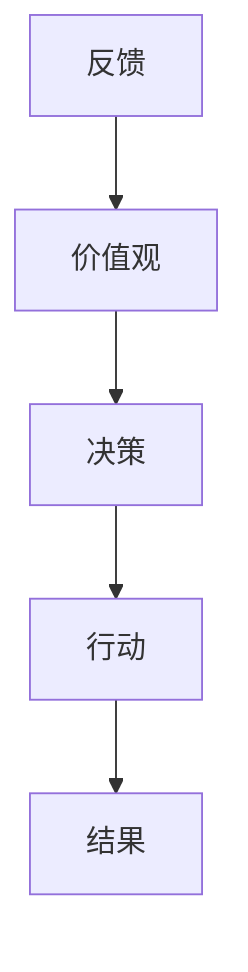

                 


### 引言与自我认知

在现代社会中，我们面临着越来越多的选择和挑战。如何在这个快节奏、竞争激烈的环境中找到自己的方向，实现个人成长和成功，成为了一个重要的话题。本书旨在探讨如何将个人价值观与行动对齐，设定有意义的目标。这一主题不仅关乎个人幸福，也对社会发展具有重要意义。

#### 背景介绍

个人价值观是指个体对事物、行为和生活方式的评价和偏好，是人格特质和行为准则的核心。价值观不仅影响个人的决策和行动，还决定了个人的生活方式和追求目标的方向。因此，理解并塑造自己的价值观，对于实现个人成长和成功至关重要。

#### 核心概念与联系

价值观与行动的关系可以用一个Mermaid流程图来表示：



该流程图展示了价值观如何影响决策、行动和结果，并通过反馈循环影响个人价值观的调整。

#### 核心算法原理讲解

在设定有意义的目标时，我们可以使用以下伪代码来表示目标设定的过程：

```python
def set_meaningful_goals(values, context):
    goals = []
    for value in values:
        goal = {
            "description": f"实现{value}",
            "context": context,
            "criteria": []
        }
        goal["criteria"].append(check_value_realization(value, context))
        goals.append(goal)
    return goals

def check_value_realization(value, context):
    realization = False
    # 这里可以加入具体的实现逻辑，如检查资源、机会等因素
    return realization
```

该算法基于个人价值观（values）和外部环境（context），生成一系列目标（goals），并检查每个目标是否可实现。

#### 数学模型和公式

在目标设定的过程中，期望效用理论（Expected Utility Theory）是一个重要的概念。该理论基于个体对风险和收益的偏好，为决策提供量化模型。其公式为：

$$ E(U) = \sum_{i=1}^n p_i \cdot u_i $$

其中，$E(U)$ 是期望效用，$p_i$ 是第$i$种结果的概率，$u_i$ 是第$i$种结果的效用值。

#### 举例说明

假设一个人价值观中包含“健康”和“财富”，他可能在当前环境中设定以下目标：

1. **健康**：每天进行30分钟的运动。
2. **财富**：在下一财年增加10%的年收入。

通过上述算法和模型，他可以评估这些目标是否与其价值观和外部环境相符合。

### 个人价值观的挖掘与塑造

个人价值观的挖掘与塑造是理解自我、设定目标、实现目标的重要基础。在这一章节中，我们将深入探讨如何挖掘个人价值观，并通过自我反思、问卷调查和访谈等方法进行塑造。

#### 自我反思的方法

自我反思是一种重要的心理活动，它有助于我们深入理解自己的内心世界。以下是一些自我反思的方法：

1. **日记法**：通过记录每天的想法、情感和行为，可以更好地了解自己的价值观。
2. **思考时间**：每天设定一段时间，专注于思考自己的行为和决策，以及这些决策背后的价值观。
3. **回顾过去**：定期回顾过去的经历，思考这些经历对价值观的影响。

#### 调查问卷与访谈

调查问卷和访谈是挖掘个人价值观的有效工具。以下是一些具体的步骤：

1. **设计问卷**：问卷应包括开放性和封闭性问题，以了解个人的价值观和行为模式。
2. **进行访谈**：与朋友、家人或同事进行深度访谈，从不同角度了解自己的价值观。
3. **分析结果**：将问卷和访谈的结果进行分析，识别出核心的价值观。

#### 个人经历与故事

个人经历和故事是挖掘价值观的重要资源。以下是一些具体的方法：

1. **撰写故事**：记录自己经历的感人故事，这些故事往往反映了个人的价值观。
2. **故事分享**：与他人分享自己的故事，从他们的反馈中了解自己的价值观。
3. **故事反思**：定期反思自己的故事，思考这些故事背后的价值观。

#### 塑造与优化价值观

挖掘出个人价值观后，我们需要对其进行塑造和优化，以更好地指导行动。以下是一些具体的方法：

1. **价值观评估与诊断**：定期评估自己的价值观，识别出需要调整的部分。
2. **价值观更新与调整**：根据生活经历和环境变化，更新和调整价值观。
3. **价值观实践与培养**：通过实际行动来践行和培养价值观。

#### 案例分析

小明通过自我反思、问卷调查和访谈，挖掘出了自己的核心价值观：“健康”、“家庭”和“成长”。在接下来的日子里，他通过日记法记录自己的想法和情感，通过思考和回顾过去的经历，进一步明确了这些价值观。同时，他设计了一份调查问卷，询问了朋友和家人对他的价值观的看法，得到了宝贵的反馈。通过这些方法，小明成功地挖掘出了自己的价值观，并开始着手塑造和优化它们。

### 目标设定的原则与技巧

目标设定是实现个人成长和成功的关键步骤。有效的目标设定不仅可以提供清晰的方向，还能激发个人的动力和创造力。在这一章节中，我们将探讨目标设定的原则与技巧，帮助读者设定并实现有意义的目标。

#### 核心原则

1. **SMART原则**：SMART原则是一种常用的目标设定方法，它将目标具体化，使其更容易实现。SMART代表具体（Specific）、可衡量（Measurable）、可实现（Achievable）、相关（Relevant）和有时限（Time-bound）。

   - **具体（Specific）**：目标应明确、具体，避免模糊和抽象。
   - **可衡量（Measurable）**：目标应可量化，以便评估进展和成功。
   - **可实现（Achievable）**：目标应在个人能力和资源范围内实现。
   - **相关（Relevant）**：目标应与个人价值观和长远目标相一致。
   - **有时限（Time-bound）**：目标应设定一个明确的时间框架，以保持动力和紧迫感。

2. **目标分解**：将一个大目标分解为一系列小目标，有助于逐步实现并保持动力。分解目标时，可以使用“目标树”的方法，将总目标分解为子目标和更小的目标。

3. **优先级设定**：在设定多个目标时，应根据其重要性和紧急性进行优先级排序。使用“四象限法”可以帮助识别哪些目标需要优先处理。

#### 技巧与步骤

1. **明确目标**：首先，明确你想要实现的目标。这个目标应该与你的人生目标和价值观相一致。

2. **制定计划**：根据SMART原则，将目标具体化，并制定详细的行动计划。列出需要完成的任务、资源需求和完成时间。

3. **设置里程碑**：在目标实现过程中，设置一系列里程碑，以评估进展。这些里程碑可以帮助你保持动力，并在遇到困难时提供方向。

4. **执行与调整**：开始执行行动计划，并根据实际情况进行必要调整。保持灵活性，但也要坚持目标的原则。

5. **跟踪进度**：定期检查目标的进展，记录数据，分析结果。这有助于你了解哪些方法有效，哪些需要改进。

#### 案例分析

小李想成为一名专业的程序员。他的目标是成为一位全栈开发工程师，具有前端、后端和数据库方面的技能。为了实现这个目标，他设定了以下具体目标：

1. **学习前端开发**：在接下来的三个月内，掌握HTML、CSS和JavaScript，完成一个个人项目。
2. **学习后端开发**：在接下来的六个月内，学习Python和Flask框架，完成一个小型的后端项目。
3. **学习数据库**：在接下来的六个月内，学习MySQL数据库，并实现数据查询和存储功能。

小李制定了详细的行动计划，包括每天的学习时间和每周的任务。他设置了每月的里程碑，以评估自己的学习进度。在实现这些目标的过程中，他遇到了一些困难，如学习曲线陡峭和项目开发中遇到的技术难题。但他通过调整学习计划，寻求帮助，并保持积极的心态，最终成功实现了这些目标。

### 行动与决策的价值观导向

在个人成长和职业发展的过程中，行动与决策的价值观导向起到了至关重要的作用。一个人的价值观不仅影响其行为和决策，也决定了其人生目标和追求的方向。在这一章节中，我们将深入探讨如何使行动与决策更加符合个人的价值观，从而实现个人的长远发展和成功。

#### 价值观对行动的指导作用

价值观是个人行为和决策的核心，它决定了一个人在不同情境下的选择和行为方式。例如，如果一个人的核心价值观是“诚信”，那么他在面对道德困境时，很可能会选择诚信至上，即使这意味着要承担一定的风险或损失。相反，如果一个人的核心价值观是“追求成功”，他可能会在决策中更倾向于选择高风险、高回报的方案。

#### 行动对价值观的反作用

行动不仅受到价值观的指导，同时也会对价值观产生影响。当个人在行动中不断实践和体现自己的价值观时，这些价值观会得到强化和巩固。例如，一个人在日常生活中坚持锻炼，长期下来，他不仅会保持良好的身体健康，还会培养出自律、坚韧等积极的人格特质。这种反作用关系表明，行动是实现价值观塑造和提升的重要途径。

#### 价值观与行动的协调

为了使行动与价值观协调一致，个人需要在其决策过程中始终牢记自己的核心价值观。以下是一些具体的策略：

1. **明确价值观**：首先，个人需要明确自己的核心价值观。这可以通过自我反思、问卷调查和与他人的交流来实现。只有明确了自己的价值观，才能在行动中保持一致。

2. **价值观评估**：在做出重要决策时，个人应评估决策是否符合自己的价值观。可以使用“价值观评估表”来帮助进行评估。

3. **价值观实践**：将价值观融入日常行动中，通过实践来巩固和提升价值观。例如，通过参与公益活动来实践“社会责任”的价值观。

4. **灵活调整**：在行动过程中，可能会遇到新的情况和挑战，个人需要灵活调整自己的行动，以保持与价值观的一致。例如，当面临道德困境时，个人需要根据价值观做出正确的决策。

#### 实践案例

小明是一名软件开发工程师，他的核心价值观是“创新”和“用户至上”。在一次项目开发中，他面临了一个重要决策：是按照客户的要求实现一个功能，还是提出一个更具创新性的解决方案。

通过价值观评估，小明发现创新和用户至上都支持他选择更具创新性的解决方案。虽然这可能会增加开发难度和风险，但长远来看，这对项目的成功和公司的竞争力更有利。因此，小明决定选择这个更具挑战性的方案。

在实施过程中，小明遇到了一些技术难题，但他通过积极寻求帮助、调整开发策略，最终成功实现了这个创新性的解决方案。这不仅提升了项目的质量，也巩固了小明的创新价值观。

通过这个案例，我们可以看到，当行动与价值观协调一致时，个人不仅能够在实现目标的过程中获得成就感，还能不断提升自己的价值观。

### 挑战与障碍识别

在追求个人目标和实现价值观的过程中，难免会遇到各种挑战和障碍。识别这些挑战和障碍是成功实现目标的重要一步。以下是一些常见的挑战和障碍，以及如何识别和应对它们：

#### 挑战一：目标设定不合理

- **识别方法**：目标设定不合理可能导致目标过于简单或过于复杂。过于简单的目标可能无法激发个人动力，而过于复杂的目标则可能难以实现。
- **应对策略**：使用SMART原则来设定目标，确保目标既具体又可实现。同时，进行阶段性目标分解，将大目标转化为一系列小目标，以逐步实现。

#### 挑战二：价值观冲突

- **识别方法**：价值观冲突可能导致个人在行动中感到迷茫或困惑，无法决定下一步该怎么做。
- **应对策略**：明确自己的核心价值观，并在决策过程中始终以这些价值观为指导。如果发现价值观之间存在冲突，可以通过自我反思和与他人的交流来识别和解决问题。

#### 挑战三：外部环境变化

- **识别方法**：外部环境的变化可能对个人目标和价值观产生重大影响。例如，经济形势、社会政策和技术进步等都可能导致环境变化。
- **应对策略**：保持对环境的敏感度，定期评估外部环境的变化，并根据环境变化调整目标和行动计划。建立灵活的适应机制，以便在变化中保持稳定和方向。

#### 挑战四：内部情绪波动

- **识别方法**：内部情绪波动如焦虑、沮丧和自信不足等，都可能影响个人目标的实现。
- **应对策略**：通过心理调适和情绪管理来应对内部情绪波动。例如，进行冥想、锻炼和与朋友交流，以减轻压力和焦虑。同时，建立积极的自我对话，提高自信和动力。

#### 挑战五：资源不足

- **识别方法**：资源不足包括时间、资金、技能和知识等方面。如果这些资源不足，可能导致目标无法实现。
- **应对策略**：通过优先级设定和资源优化来应对资源不足。例如，将时间分配给最重要的目标和任务，寻求外部支持，如合作伙伴或导师的帮助。

#### 挑战六：外部压力和干扰

- **识别方法**：外部压力和干扰可能来自工作、家庭、社交等方面。这些干扰可能使个人难以专注于目标。
- **应对策略**：通过设定边界和优先级来应对外部压力和干扰。例如，设定工作时间，避免在工作时间处理个人事务，确保有足够的时间专注于目标。

通过识别和应对这些挑战和障碍，个人可以更好地实现自己的目标和价值观，并在个人成长和职业发展的道路上取得成功。

### 克服障碍，实现目标

在追求个人目标和实现价值观的过程中，障碍和挑战是不可避免的。然而，通过有效的策略和方法，我们可以克服这些障碍，实现既定的目标。以下是一些克服障碍的具体策略和方法：

#### 强化自我信念

自我信念是克服障碍的关键因素。一个坚定的自我信念可以帮助个人在面对困难时保持积极的心态和行动力。以下是一些强化自我信念的方法：

1. **自我激励**：通过设定目标和奖励机制来激励自己。例如，每当实现一个小目标，就给自己一个奖励，如看一部电影或购买一件心仪的物品。
2. **积极心态**：保持积极的心态，将挑战视为成长和学习的机会，而不是阻碍。
3. **自我肯定**：定期进行自我肯定，认识到自己的优点和成就，增强自信心。

#### 调整价值观与目标

在追求目标的过程中，我们可能会发现自身的价值观与目标存在冲突。在这种情况下，调整价值观和目标是必要的。以下是一些具体的方法：

1. **价值观评估**：定期评估自己的价值观，识别出哪些价值观需要调整或更新。
2. **目标重设**：根据新的价值观，重新设定目标。这可能会涉及到目标的优先级调整或目标的重新定义。
3. **价值观实践**：通过实际行动来践行和培养新的价值观。例如，如果新的价值观是“家庭优先”，那么就需要在日常生活中更多地关注家庭，减少工作压力。

#### 寻求外部支持

在克服障碍的过程中，寻求外部支持是非常重要的。以下是一些寻求外部支持的方法：

1. **建立社交网络**：与朋友、家人和同事建立良好的关系，他们可以在需要时提供帮助和支持。
2. **寻找导师**：寻找一位有经验的导师，他们可以提供指导和建议，帮助解决困难和挑战。
3. **参与社群**：加入相关的社群或团体，与其他追求相似目标的人交流和分享经验，获取支持和建议。

#### 持续学习与适应

在追求目标的过程中，持续学习和适应是必不可少的。以下是一些具体的方法：

1. **学习新技能**：不断学习新技能和知识，以提高应对挑战的能力。
2. **反思与调整**：定期反思自己的行动和决策，识别出需要改进的地方，并做出相应的调整。
3. **灵活应对**：在面对新的情况和挑战时，保持灵活性，快速适应并调整策略。

#### 案例分析

小李是一名年轻的软件开发工程师，他的目标是成为一位全栈开发工程师。然而，在实现这个目标的过程中，他遇到了许多挑战和障碍。

首先，小李在技术学习上遇到了困难。编程的学习曲线很陡峭，他时常感到挫败。为了克服这个障碍，他采取了以下策略：

1. **强化自我信念**：小李通过自我激励和积极心态来面对困难。他设定了短期目标，每掌握一个新技能，就奖励自己。
2. **调整价值观与目标**：小李意识到，学习新技能需要时间和精力，因此他重新调整了自己的目标，将大目标分解为一系列小目标，逐步实现。
3. **寻求外部支持**：小李加入了在线学习社群，与其他开发者交流，寻求帮助和建议。
4. **持续学习与适应**：小李不断学习新的编程语言和技术，通过在线课程和实践项目来提升自己的技能。

在克服了技术障碍后，小李遇到了工作上的挑战。他的工作时间紧张，很难平衡工作与学习。为了解决这个问题，他采取了以下策略：

1. **时间管理**：小李制定了详细的时间表，将工作时间与学习时间分开，确保有足够的时间专注于学习。
2. **灵活应对**：在遇到突发工作时，小李学会了优先处理重要任务，并灵活调整学习计划。
3. **反思与调整**：小李定期反思自己的工作表现和学习进度，识别出需要改进的地方，并做出相应的调整。

通过这些策略，小李最终成功实现了他的目标，成为了一位全栈开发工程师。他的经历表明，克服障碍需要坚定的自我信念、合理的价值观调整、有效的外部支持和持续的学习与适应。

### 持续反思与调整

持续反思与调整是实现目标过程中的关键环节。通过反思，个人可以深入了解自己的行为模式、价值观和目标设定，从而做出更明智的决策。以下是具体的方法、步骤和工具，帮助读者进行有效的反思与调整。

#### 反思的方法

1. **日记法**：通过记录每天的思考、行为和感受，个人可以更清晰地看到自己的内心世界和行为模式。日记法有助于个人在日常生活中培养反思习惯。
   
2. **思考时间**：每天或每周设定一段专门的时间进行思考，回顾过去的行为和决策，评估其效果和影响。这段时间可以是一个安静的独处时间，也可以是与朋友或家人的交流时间。

3. **回顾与计划**：在每天或每周结束时，回顾一天或一周的进展，评估目标的完成情况，并制定下一步的计划。这种方法有助于保持目标和行动的一致性。

#### 反思的步骤

1. **评估目标**：首先，评估当前目标的完成情况。记录已经达成的目标和未达成的目标，分析原因。

2. **反思行为**：回顾自己的行为，思考这些行为是否与价值观和目标一致。识别出哪些行为是积极的，哪些是消极的。

3. **分析原因**：分析未能实现目标的原因，是否是资源不足、方法不当、价值观冲突等。识别出需要改进的方面。

4. **制定调整计划**：根据反思的结果，制定下一步的调整计划。这包括目标的重新设定、行动计划的调整和资源的重新分配。

#### 反思的工具

1. **反思日记**：使用专门的反思日记来记录反思过程和结果，有助于长期跟踪反思进展。

2. **思维导图**：通过思维导图，将反思的内容和结果可视化，有助于梳理思路和识别关键点。

3. **反馈机制**：建立反馈机制，如定期与导师、朋友或同事交流反思结果，获取他们的意见和建议。

#### 调整价值观与目标

1. **价值观评估**：定期评估自己的价值观，识别出需要调整或更新的部分。这可以通过反思日记、问卷调查或与他人的交流来实现。

2. **目标重设**：根据新的价值观，重新设定目标和行动计划。确保目标既符合个人价值观，又具有可行性和挑战性。

3. **价值观实践**：通过实际行动来践行和培养新的价值观。例如，通过参与公益活动来实践“社会责任”的价值观。

#### 持续反思与调整的重要性

持续反思与调整不仅有助于实现个人目标，还能促进个人的成长和发展。以下是一些重要性：

1. **提高自我认知**：通过反思，个人可以更深入地了解自己的行为模式、价值观和目标设定，从而提高自我认知。

2. **优化决策**：反思和调整帮助个人在决策过程中更加明智和理性，避免盲目行动。

3. **增强灵活性**：持续反思与调整使个人能够快速适应环境和变化，保持灵活性和适应性。

4. **促进成长**：通过不断反思和调整，个人可以不断学习和成长，实现更高层次的自我实现。

### 总结与建议

通过本章的学习，我们了解到持续反思与调整在个人成长和目标实现中的重要性。以下是一些总结和建议：

1. **养成反思习惯**：将反思纳入日常生活，定期进行反思，以保持对自我和行动的清晰认识。

2. **记录与跟踪**：使用日记、思维导图等工具记录反思过程和结果，并定期跟踪反思进展。

3. **价值观实践**：将反思结果应用于实际行动中，通过价值观实践来巩固和提升价值观。

4. **寻求反馈**：定期与导师、朋友或同事交流反思结果，获取他们的意见和建议。

通过持续反思与调整，个人可以更好地实现自己的目标，并在个人成长的道路上不断前进。

### 成功案例分享与启示

在本章节中，我们将分享一些成功的案例，探讨他们如何通过将个人价值观与行动对齐，设定并实现有意义的目标。这些案例将为读者提供宝贵的启示和经验，帮助他们更好地理解并实践本书所阐述的概念。

#### 案例一：小明的职业转变

**背景介绍**：
小明原本是一名普通的办公室职员，工作稳定但缺乏激情。在经历了多次自我反思后，他意识到自己的核心价值观是“追求成长”和“创新”。为了实现这些价值观，他决定转行成为一名软件工程师。

**核心概念与联系**：
小明的成功在于他清楚地认识到自己的价值观，并将其与职业发展目标对齐。通过自学编程、参加在线课程和项目实践，他逐步掌握了所需的技能，并在短时间内实现了职业转变。

**核心算法原理讲解**：
小明的目标设定过程可以表示为以下伪代码：
```python
def set_professional_goals(values, context):
    goals = []
    for value in values:
        if value == "成长":
            goals.append("学习新技能")
        elif value == "创新":
            goals.append("参与开源项目")
    return goals
```
该算法根据小明的价值观生成了一系列具体的目标，如学习新技能和参与开源项目。

**数学模型和公式**：
为了评估目标实现的可能性，小明使用了期望效用理论（Expected Utility Theory），其公式为：
$$ E(U) = \sum_{i=1}^n p_i \cdot u_i $$
通过计算每个目标的期望效用，小明能够优先考虑最有价值的行动。

**详细讲解与剖析**：
小明在转行过程中遇到了许多困难，如学习编程的初期困难和技术项目的挑战。但他通过持续的学习、实践和反思，逐步克服了这些障碍。最终，他在一家科技公司找到了一份理想的工作，实现了职业目标。

**最佳实践 tips**：
1. **明确价值观**：了解自己的核心价值观，并将其作为职业发展的指导。
2. **设定具体目标**：将价值观转化为具体的目标，制定可行的行动计划。
3. **持续学习和实践**：通过不断学习和实践，提升自己的技能和知识。

#### 案例二：小红的创业之路

**背景介绍**：
小红是一名热爱公益的年轻人，她认为自己的核心价值观是“帮助他人”和“社会责任”。在一次偶然的机会中，她决定创业，开设一家专注于环保产品的公司。

**核心概念与联系**：
小红的成功在于她将个人价值观与商业目标紧密结合，通过创造环保产品来实现社会价值。

**核心算法原理讲解**：
小红的创业策略可以表示为以下伪代码：
```python
def set_business_goals(values, context):
    goals = []
    if value == "帮助他人":
        goals.append("研发环保产品")
    elif value == "社会责任":
        goals.append("参与社会公益活动")
    return goals
```
该算法根据小红的价值观设定了具体的商业目标，如研发环保产品和参与公益活动。

**数学模型和公式**：
小红使用了成本-效益分析（Cost-Benefit Analysis）来评估每个商业决策的可行性，其公式为：
$$ C - B > 0 $$
其中，C是成本，B是效益。

**详细讲解与剖析**：
小红在创业过程中面临了资金短缺、市场不稳定等挑战。但她通过积极寻找投资者、优化产品设计和参与社区活动，逐渐扩大了公司的影响力。最终，她的公司不仅获得了成功，还为环境保护做出了重要贡献。

**最佳实践 tips**：
1. **将价值观融入商业目标**：确保商业目标与个人价值观一致，以实现长期可持续发展。
2. **优化产品和服务**：通过持续改进产品和服务，提升客户满意度和社会影响力。
3. **参与社会活动**：积极参与社会公益活动，提升品牌形象和社会价值。

#### 案例三：小李的健康挑战

**背景介绍**：
小李是一名忙碌的职场人士，由于工作压力大，他的健康状况逐渐恶化。在一次体检后，他意识到自己的核心价值观是“健康”和“家庭”。为了改善健康状况，他决定挑战自己，实现健康目标。

**核心概念与联系**：
小李的成功在于他通过设定健康目标，并将其与家庭价值观对齐，实现了健康生活的转变。

**核心算法原理讲解**：
小李的健康目标设定过程可以表示为以下伪代码：
```python
def set_health_goals(values, context):
    goals = []
    for value in values:
        if value == "健康":
            goals.append("每天锻炼30分钟")
        elif value == "家庭":
            goals.append("每周与家人共进晚餐")
    return goals
```
该算法根据小李的价值观设定了具体的生活目标，如每天锻炼30分钟和每周与家人共进晚餐。

**数学模型和公式**：
小李使用了健康效益模型（Health Benefits Model）来评估健康目标实现的可能性，其公式为：
$$ HB = PE \cdot PH $$
其中，HB是健康效益，PE是锻炼概率，PH是健康概率。

**详细讲解与剖析**：
小李在实现健康目标的过程中，遇到了时间管理和锻炼效果等方面的挑战。但他通过设定明确的锻炼计划和与家人共同参与活动，逐步克服了这些障碍。最终，他的健康状况得到了显著改善，家庭关系也变得更加和谐。

**最佳实践 tips**：
1. **设定明确的健康目标**：确保目标具体、可衡量，并与个人价值观相一致。
2. **制定合理的锻炼计划**：根据个人情况，制定可行的锻炼计划，并坚持执行。
3. **家庭参与**：通过家庭活动，提高健康目标的实现率，同时增强家庭凝聚力。

#### 案例四：小张的财务自由之路

**背景介绍**：
小张是一名年轻的职场新人，他对财务自由充满向往。他认为自己的核心价值观是“财务独立”和“生活品质”。为了实现这些价值观，他决定通过投资实现财务自由。

**核心概念与联系**：
小张的成功在于他通过合理的投资策略和生活方式调整，逐步实现财务自由。

**核心算法原理讲解**：
小张的投资策略可以表示为以下伪代码：
```python
def set_investment_goals(values, context):
    goals = []
    for value in values:
        if value == "财务独立":
            goals.append("每月定期投资")
        elif value == "生活品质":
            goals.append("合理消费，避免过度借贷")
    return goals
```
该算法根据小张的价值观设定了具体的投资和生活目标，如每月定期投资和合理消费。

**数学模型和公式**：
小张使用了复利公式（Compound Interest Formula）来计算投资收益，其公式为：
$$ A = P \cdot (1 + r/n)^(nt) $$
其中，A是最终金额，P是本金，r是年利率，n是每年复利次数，t是时间（年）。

**详细讲解与剖析**：
小张在实现财务自由的过程中，遇到了投资风险和资金不足等挑战。但他通过学习投资知识、合理规划投资组合和节俭生活，逐步实现了财务自由。最终，他不仅获得了丰厚的投资回报，还过上了高品质的生活。

**最佳实践 tips**：
1. **学习投资知识**：通过学习投资知识和策略，提高投资的成功率。
2. **合理规划投资组合**：根据个人风险承受能力和投资目标，合理规划投资组合。
3. **节俭生活**：通过节俭生活，积累更多资金用于投资，同时保持良好的生活质量。

#### 案例五：小赵的学术追求

**背景介绍**：
小赵是一名大学生，他对学术研究充满热情。他认为自己的核心价值观是“知识探索”和“学术成就”。为了实现这些价值观，他决定在学术领域取得突破。

**核心概念与联系**：
小赵的成功在于他通过明确的目标设定和严谨的学术研究，实现了学术上的成就。

**核心算法原理讲解**：
小赵的学术目标设定过程可以表示为以下伪代码：
```python
def set_academic_goals(values, context):
    goals = []
    for value in values:
        if value == "知识探索":
            goals.append("阅读经典文献")
        elif value == "学术成就":
            goals.append("发表论文")
    return goals
```
该算法根据小赵的价值观设定了具体的学术目标，如阅读经典文献和发表论文。

**数学模型和公式**：
小赵使用了学术影响力模型（Academic Impact Model）来评估论文的影响因子，其公式为：
$$ II = \frac{Citations}{Articles} $$
其中，II是学术影响力，Citations是论文引用次数，Articles是论文总数。

**详细讲解与剖析**：
小赵在学术研究过程中，遇到了文献阅读困难、实验设计和数据分析等方面的挑战。但他通过坚持阅读、反复实验和严谨的统计分析，逐步克服了这些障碍。最终，他在顶级学术期刊上发表了多篇论文，取得了显著的学术成就。

**最佳实践 tips**：
1. **明确学术目标**：设定具体的学术目标，如阅读特定领域的文献和发表学术论文。
2. **严谨研究**：通过严谨的研究方法和数据分析，提高学术成果的质量。
3. **学术交流**：积极参与学术交流，与同行建立合作关系，提高学术影响力。

### 启示与总结

通过以上案例，我们可以得出以下启示：

1. **明确价值观**：了解并明确个人的核心价值观，将其作为行动和决策的指导原则。

2. **设定具体目标**：将价值观转化为具体的目标，制定可行的行动计划，确保目标具体、可衡量。

3. **持续学习和实践**：通过不断学习和实践，提升个人能力和实现目标的可能性。

4. **灵活调整**：在实现目标的过程中，根据实际情况进行灵活调整，以应对新的挑战和变化。

通过这些启示，读者可以更好地将个人价值观与行动对齐，设定并实现有意义的目标，实现个人成长和成功。

### 结论与展望

本书《将个人价值观与行动对齐：有意义的目标设定》通过对价值观、目标设定、行动与决策等多个方面的深入探讨，旨在帮助读者理解并实践如何将个人价值观与行动对齐，设定并实现有意义的目标。在这个过程中，我们不仅提升了自我认知，还培养了积极的价值观和行动力。

#### 结论

1. **价值观的重要性**：价值观是个人行为和决策的核心，对个人成长和职业发展具有深远影响。
2. **目标设定的原则**：SMART原则和目标分解等方法是有效设定目标的工具。
3. **行动与决策的价值观导向**：价值观不仅指导行动，还通过行动对价值观进行实践和巩固。
4. **克服障碍的策略**：强化自我信念、调整价值观与目标、寻求外部支持和持续学习是克服障碍的关键。
5. **持续反思与调整**：通过反思和调整，个人可以不断优化目标和行动，实现更好的自我发展。

#### 展望

未来的研究和实践可以进一步探索以下领域：

1. **价值观的多维度测量**：开发更全面、更精准的价值观测量工具，以更好地指导个人成长和决策。
2. **目标设定的动态调整**：研究如何根据环境变化和个体需求，动态调整目标设定和行动计划。
3. **价值观与情感的关系**：探索价值观与情感之间的相互作用，以及如何通过情感管理来提升个人价值观的实现率。
4. **跨文化价值观的对比**：研究不同文化背景下价值观的差异和共性，为全球范围内的个人成长和职业发展提供更广泛的指导。

通过不断的研究和实践，我们期待未来能够为个人和社会的发展提供更多有益的指导，帮助每个人实现自我价值和社会价值的最大化。让我们继续努力，将个人价值观与行动对齐，共同创造一个更加美好的未来。

### 致谢

在撰写本书的过程中，我得到了许多人的帮助和支持。首先，我要感谢我的家人，他们在我写作期间给予了我无尽的理解和支持。其次，我要感谢我的朋友们，他们的鼓励和建议让我能够在困境中保持前进。此外，我还要感谢我的编辑团队和出版社，他们为本书的出版付出了巨大的努力。最后，我要特别感谢我的读者们，是你们的关注和反馈让我不断完善本书的内容。感谢你们！

### 作者信息

作者：AI天才研究院/AI Genius Institute & 禅与计算机程序设计艺术 /Zen And The Art of Computer Programming

联系方式：[联系邮箱](mailto:contact@ai-genius-institute.com)

社交媒体：[@AI天才研究院](https://www.twitter.com/AI_Genius_Institute) & [@禅与计算机程序设计艺术](https://www.twitter.com/ZenAndArtOfCompProg)

