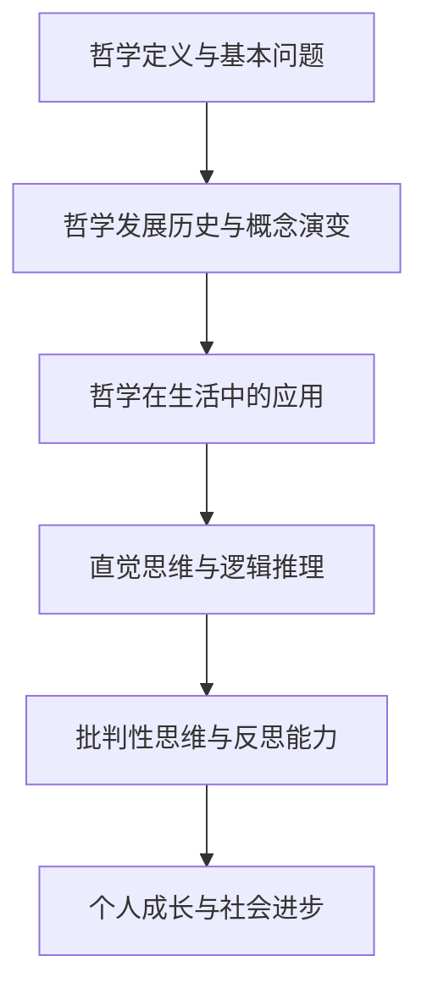
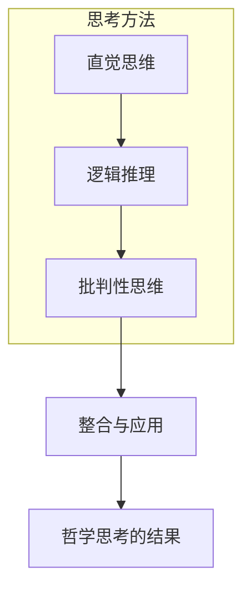

                 

### 背景介绍

在现代社会的快节奏生活中，人们常常感到压力重重，生活的质量似乎越来越难以保障。与此同时，哲学作为一门追求智慧和真理的学科，不仅有着深厚的历史渊源，还在不断探索人类存在的意义和生活的本质。将哲学思考融入日常生活，成为了一种提升生活品质的潜在途径。

哲学不仅仅是一种学术研究，更是一种生活态度和思维方式。通过哲学的思考，我们可以更好地理解自己，认识世界，从而在日常生活中做出更明智的决策，解决实际问题。哲学思考强调逻辑推理、批判性思维和反思能力，这些能力在解决复杂问题时尤为重要。

本文将深入探讨如何将哲学思考融入日常生活，从而提升生活品质。我们将首先介绍哲学的基本概念和哲学在生活中的重要性，然后逐步分析哲学思考的具体方法和技巧，最后通过实际案例展示哲学思考在个人成长和社会生活中的应用。

我们的目标是帮助读者理解哲学思考的价值，掌握哲学思考的方法，并将其应用到日常生活中，最终实现生活品质的提升。通过本文的阅读，读者将能够获得以下收益：

1. **理解哲学的基本概念和原理**。
2. **掌握哲学思考的方法和技巧**。
3. **学会将哲学思考应用于个人成长和社会生活**。
4. **获得提升生活品质的具体实践建议**。

通过这样的逻辑步骤，我们将一步步引导读者深入了解哲学思考，并将其转化为实际行动，以期在日常生活中获得更多的智慧和满足。

### 核心概念与联系

#### 哲学的基本概念

哲学，作为一门探讨人类存在、知识、价值观和理性的学科，其基本概念涵盖了广泛的内容。首先，我们需要了解哲学的定义。哲学可以被理解为对基本问题进行深入思考和探索的学科，这些问题包括“什么是真实？”，“什么是善？”，“人是如何认识世界的？”等等。哲学的核心理念在于通过理性思考和逻辑推理，寻求对世界和人生的深刻理解。

哲学的发展经历了数千年的历史，其基本概念不断丰富和演变。西方哲学源远流长，从古希腊哲学家如苏格拉底、柏拉图、亚里士多德开始，再到中世纪的基督教哲学和文艺复兴时期的理性主义，再到现代哲学的多元发展。东方哲学则有着独特的文化背景，例如中国古代的儒家、道家和佛家思想，这些思想也在不断影响和丰富哲学的内涵。

#### 哲学与生活实践的关系

哲学不仅是一种学术研究，更是一种生活态度和思维方式。哲学在生活中的重要性体现在多个方面。首先，哲学思考能够帮助我们建立清晰的价值观，使我们更加明确什么是对自己重要的事情。通过哲学思考，我们可以对自身的价值观进行反思和调整，从而更好地指导我们的行为和决策。

其次，哲学强调批判性思维和反思能力。这些能力在解决复杂问题和处理日常生活中遇到的各种挑战时尤为重要。批判性思维使我们能够不盲目接受信息，而是通过逻辑推理和分析，对信息进行评估和判断。反思能力则帮助我们不断地回顾和审视自己的行为和思维方式，从而发现和纠正错误。

此外，哲学还关注人的存在和生活的意义。通过哲学思考，我们可以探讨生命的本质，理解生命的意义，从而找到自己在世界中的位置和目标。这种对生活意义的探索，可以帮助我们克服生活中的困惑和迷茫，找到生活的动力和方向。

#### 哲学思考方法的联系

哲学思考方法主要包括直觉思维、逻辑推理和批判性思维等。直觉思维是哲学思考的起点，它帮助我们快速捕捉和理解问题的本质。逻辑推理则是哲学思考的核心，通过严密的逻辑关系，我们可以对问题进行深入分析和推理。批判性思维则是对直觉思维和逻辑推理的进一步深化，它使我们能够对各种观点和理论进行批判性评估，从而更加全面和准确地理解问题。

这些哲学思考方法之间存在紧密的联系。直觉思维为逻辑推理提供了基础，逻辑推理则对直觉思维的结果进行验证和深化。批判性思维则对整个思考过程进行监督和调整，确保我们的思考既具有深度又具有广度。

#### 总结

哲学的基本概念和哲学在生活中的重要性，为我们提供了一个思考和理解世界的框架。通过哲学思考方法，我们能够更深入地理解自己、认识世界，并在日常生活中做出更明智的决策。哲学思考不仅是一种学术活动，更是一种生活实践，它可以帮助我们提升生活的品质，实现个人成长和社会进步。

为了更好地理解这些核心概念之间的联系，我们使用Mermaid流程图来展示哲学思考的基本流程：

通过这个流程图，我们可以清晰地看到哲学思考如何从基本概念出发，通过多种方法和技术，最终应用于个人成长和社会生活中，实现生活品质的提升。

### 哲学思考的方法与技巧

哲学思考不仅仅是简单的学术探讨，而是一种深入的思维过程，它要求我们运用多种方法和技巧来理解世界和自我。以下是一些主要的哲学思考方法和技巧，我们将逐一进行详细分析。

#### 直觉思维

直觉思维是哲学思考的起点，它是一种快速而自然的思维过程，帮助我们捕捉和理解问题的本质。直觉思维的特点是无需经过详细的逻辑推理，而是通过直觉和感受来做出判断。在哲学思考中，直觉思维能够迅速地揭示问题的重要特征，为后续的深入分析提供基础。

例如，当面对一个复杂的道德问题时，直觉思维可以帮助我们快速判断行为的道德性，尽管我们可能无法立即给出详细的逻辑解释。直觉思维的应用不仅限于道德问题，它在艺术创作、科学发现等多个领域都有着重要的价值。

直觉思维的原理基于人类大脑的快速处理能力和长期积累的经验。通过不断的实践和反思，我们可以提高直觉思维的质量，使其更加准确和有效。直觉思维与逻辑推理相辅相成，它为逻辑推理提供了初步的方向和框架。

#### 逻辑推理

逻辑推理是哲学思考的核心，它通过严密的逻辑关系，对问题进行深入分析和推理。逻辑推理的基本原则是逻辑定律，如同一律、矛盾律和排中律。这些原则帮助我们确保推理过程的合理性和有效性。

在哲学思考中，逻辑推理用于解决复杂问题，建立理论体系，验证假设等。例如，在伦理学中，通过逻辑推理，我们可以推导出某些道德原则，并检验这些原则在不同情境下的适用性。逻辑推理的步骤通常包括：识别前提、应用逻辑定律、推导结论等。

逻辑推理的原理在于通过一系列逻辑步骤，确保结论的有效性和可靠性。逻辑推理不仅依赖于形式逻辑，还涉及到自然语言中的推理技巧，如类比、归纳和演绎等。通过逻辑推理，我们可以将直觉思维的结果进行验证和深化，确保我们的思考具有坚实的基础。

#### 批判性思维

批判性思维是哲学思考的重要环节，它要求我们对各种观点和理论进行批判性评估。批判性思维不同于盲目接受或全盘否定，而是在理性分析的基础上，对信息进行客观评估和判断。

批判性思维的方法包括：识别前提、分析逻辑、评估证据、提出反证等。在哲学思考中，批判性思维帮助我们识别潜在的偏见和谬误，确保我们的思考过程具有全面性和准确性。例如，在面对一个哲学问题时，我们可以通过批判性思维，分析其前提假设的合理性，评估其逻辑推理的有效性，并提出反证来检验结论的可靠性。

批判性思维的原理在于通过理性分析和评估，提高思考的质量和深度。它不仅是对直觉思维和逻辑推理的补充，更是哲学思考的核心要素。批判性思维使我们能够从多个角度看待问题，避免陷入思维定势，从而更全面地理解问题的本质。

#### 整合与应用

直觉思维、逻辑推理和批判性思维在哲学思考中相辅相成，共同构成了一个完整的思考过程。直觉思维提供了初步的方向和灵感，逻辑推理进行了深入分析和验证，批判性思维则确保了思考的全面性和准确性。

在实际应用中，我们可以将这三种方法结合使用。例如，在面对一个复杂的道德问题时，首先通过直觉思维快速判断问题的道德性，然后通过逻辑推理推导出具体的道德原则，最后通过批判性思维评估这些原则在不同情境下的适用性。

为了更好地展示哲学思考的方法和技巧，我们使用Mermaid流程图来表示这些方法之间的关系：

通过这个流程图，我们可以清晰地看到直觉思维、逻辑推理和批判性思维如何相互作用，共同促进哲学思考的深入进行。最终，这些思考方法帮助我们获得对问题更全面和深刻的理解，实现哲学思考的目标。

### 哲学思考在个人成长中的应用

哲学思考不仅仅是一种学术研究，更是一种深刻的自我探索和成长过程。通过哲学思考，我们可以更好地理解自己，建立明确的价值观，从而在个人成长中取得显著的进步。以下将详细探讨哲学思考在自我认知、价值观塑造和人生决策中的应用。

#### 自我认知

自我认知是哲学思考的核心内容之一，它涉及到我们对自己身份、个性、情感和动机的理解。通过哲学思考，我们可以深入探索自己的内心世界，认识自己的优点和缺点，从而更好地理解自己的行为和反应。

例如，苏格拉底的“自我反思”方法就是哲学思考在自我认知中的典型应用。苏格拉底通过提问和对话的方式，引导人们深入思考自己的信念和行为。这种方法可以帮助我们识别自己的偏见和错误，从而更加客观地看待自己。

在日常生活中，通过哲学思考进行自我认知，我们可以采取以下步骤：

1. **反思自己的行为**：定期回顾自己的行为和决策，思考其背后的动机和价值观。
2. **记录反思日记**：将每天的反思和思考记录下来，形成一种习惯。
3. **与他人交流**：与他人分享自己的思考，听取不同的意见和建议。

通过这些方法，我们可以不断加深对自己的认识，提高自我认知的水平。

#### 价值观塑造

价值观是我们判断事物好坏、行为对错的内在标准。通过哲学思考，我们可以深入探讨和塑造自己的价值观，使其更加明确和坚定。

例如，柏拉图在《理想国》中探讨了正义、智慧、勇气等核心价值观，他认为只有通过哲学思考，人们才能理解这些价值观的本质，并使它们成为自己行为的指南。

在日常生活中，通过哲学思考塑造价值观，我们可以采取以下步骤：

1. **了解不同的价值观**：通过阅读哲学书籍、参加哲学课程等方式，了解各种不同的价值观和道德观念。
2. **反思自己的价值观**：定期对自己的价值观进行反思，评估其合理性和适用性。
3. **实践价值观**：将价值观付诸实践，通过日常的行为和决策来体现自己的价值观。

通过这些步骤，我们可以逐步塑造出符合自己内心需求的价值观，使其在个人成长中发挥重要作用。

#### 人生决策

人生决策是哲学思考在个人成长中的另一个重要应用。在面对重要决策时，通过哲学思考，我们可以更加理性地分析各种选择，做出更明智的决策。

例如，亚里士多德在《尼各马可伦理学》中提出了决策的理性原则，他认为决策应该基于对自身利益的理性分析和评估。通过哲学思考，我们可以运用这些原则，更好地进行人生决策。

在日常生活中，通过哲学思考进行人生决策，我们可以采取以下步骤：

1. **明确目标**：确定自己的长期和短期目标，明确决策的目的和方向。
2. **评估选项**：分析每个选项的优缺点，评估其对目标的实现程度。
3. **权衡利弊**：综合考虑各种因素，权衡决策的利弊得失。
4. **做出决策**：基于分析结果，做出最符合自身利益和价值观的决策。

通过这些步骤，我们可以更加理性地面对人生中的各种决策，减少盲目性和冲动性，从而提高决策的质量。

#### 实际案例分析

为了更好地理解哲学思考在个人成长中的应用，我们可以通过一个实际案例来展示其具体过程。

**案例：职业选择**

小王在大学毕业后面临职业选择，他感到迷茫和困惑。于是，他开始运用哲学思考来帮助自己做出决策。

1. **自我认知**：小王通过反思自己的兴趣、能力和价值观，确定自己对教育和技术的热爱，并希望能够在这些领域有所成就。
2. **价值观塑造**：小王回顾了自己的成长经历，发现自己重视教育公平和社会贡献。因此，他决定选择与教育和技术相关的职业。
3. **人生决策**：在评估了多个职业选项后，小王选择了教育行业，因为他认为这不仅能发挥自己的专业优势，还能为社会做出贡献。

通过哲学思考，小王明确了职业选择的方向，并做出了符合自己价值观的决策。这个案例展示了哲学思考在个人成长中的应用过程，也说明了哲学思考在职业选择等人生决策中的重要性。

### 哲学思考在社会生活中的应用

哲学思考不仅对个人成长有深远影响，还在社会生活中发挥着重要作用。通过哲学思考，我们能够更好地理解社会现象，促进社会正义的实现，并推动社会变革。以下将详细探讨哲学思考在社会生活中的几个关键领域：社会伦理、社会正义和社会变革。

#### 社会伦理

社会伦理是哲学思考在社会生活中的一个重要领域，它关注个体在社会中的行为规范和道德责任。伦理思考使我们能够评判社会行为的道德性，并为个体提供道德指引。

例如，康德的道德哲学强调普遍的道德法则，如“人应该被视为目的本身，而不是工具”。这一原则可以帮助我们理解在复杂的社会关系中，如何尊重他人的价值和尊严。

在日常生活中，我们可以通过以下步骤应用哲学思考来促进社会伦理：

1. **道德反思**：定期思考自己的行为是否符合道德原则，特别是在面对道德困境时。
2. **道德教育**：通过学习和传播道德原则，培养社会的道德意识和责任感。
3. **社会实践**：将道德原则应用于具体的社会活动，如志愿服务、慈善捐赠等。

通过这些方法，我们可以提升社会的道德水平，建立一个更加公平、正义的社会环境。

#### 社会正义

社会正义是哲学思考在现代社会中的重要应用，它探讨如何在社会中分配资源和权利，以确保所有人都能获得公平的机会和待遇。

罗尔斯的《正义论》提出了著名的“原始位置”和“公平原则”，认为社会正义应该基于一个假设的公正状态，通过最大化弱势群体的福利来实现整体的公平。

在实现社会正义的过程中，哲学思考可以帮助我们：

1. **评估社会政策**：通过哲学分析，评估各种社会政策的正义性，如税收政策、教育政策等。
2. **倡导社会改革**：在发现社会不公时，通过哲学思考和倡导，推动社会改革和正义的实现。
3. **参与公共事务**：通过参与公共讨论和政治活动，为社会的正义和公平贡献力量。

通过哲学思考，我们可以推动社会正义的实现，减少社会不平等现象，促进社会的和谐发展。

#### 社会变革

社会变革是哲学思考在更大尺度上的应用，它关注社会结构和制度的改革，以实现社会的长期进步和发展。

马克思主义哲学提供了社会变革的理论基础，强调阶级斗争和社会革命的必要性。马克思主义认为，社会的变革是历史发展的必然结果，通过革命性的变革，可以实现社会的公平和正义。

在推动社会变革的过程中，哲学思考可以帮助我们：

1. **分析社会结构**：通过哲学分析，揭示社会的不平等和矛盾，为变革提供理论基础。
2. **倡导社会变革**：在认识到社会问题的严重性时，通过哲学思考和倡导，推动社会的变革。
3. **参与社会实践**：通过参与社会运动和政治活动，推动社会变革的实现。

通过哲学思考，我们可以为社会的长期进步和发展贡献力量，实现社会的全面变革。

#### 结论

哲学思考在社会生活中的应用是多方面的，它不仅能够提升个人的道德水平和价值观，还能推动社会的正义和进步。通过哲学思考，我们能够更深刻地理解社会现象，更有效地解决社会问题，从而实现个人和社会的全面发展。

### 哲学思考实践案例分析

为了更好地理解哲学思考在日常生活和个人成长中的实际应用，我们通过几个具体案例来展示哲学思考的实践过程和效果。

#### 案例一：自我成长与哲学思考

**背景**：小张是一位年轻的职场新人，在工作中常常感到压力和困惑。他开始意识到，仅仅依靠专业技能并不能解决所有问题，他需要更加深入的自我认知和哲学思考。

**过程**：

1. **自我反思**：小张开始每天记录自己的思考和感受，通过反思自己的行为和决策，他识别出自己的一些深层次问题，如缺乏自信和目标不明确。
2. **哲学学习**：小张阅读了《论语》、《孟子》等中国古代哲学经典，学习其中的自我修养和道德原则。他发现，这些哲学思想对他有着深刻的启发，帮助他更好地理解自己的内心世界。
3. **行动与实践**：小张将哲学思考应用于实际工作生活中，他开始设定短期和长期目标，并逐步实现这些目标。同时，他学会了如何面对挑战和困难，保持积极的心态。

**效果**：通过哲学思考，小张不仅提高了自我认知，明确了职业目标，还在工作中表现出更高的自信和责任感。他的职业发展和生活质量显著提升。

#### 案例二：价值观冲突与哲学思考

**背景**：小李是一位大学生，他在学习和个人生活中面临着价值观的冲突。他一方面重视学术成绩，另一方面又渴望参与社会实践和志愿服务。

**过程**：

1. **反思价值观**：小李通过哲学思考，反思自己的价值观，他认识到，学术成绩和社会实践并不是对立的，而是可以相辅相成的。他决定在学术学习和志愿服务之间找到平衡点。
2. **哲学学习**：小李学习了柏拉图和亚里士多德的哲学思想，特别是关于平衡和谐的理念。他开始尝试将哲学中的平衡观念应用于实际生活中。
3. **行动与实践**：小李制定了一个详细的学习和服务计划，每周安排固定时间进行学术学习和志愿服务。他发现，这样的安排不仅帮助他提高了学术成绩，还增强了社会责任感。

**效果**：通过哲学思考，小李成功地解决了价值观冲突，实现了学术成绩和社会实践的平衡。他的生活更加充实和有意义。

#### 案例三：社会变革与哲学思考

**背景**：小王是一位社会活动家，他关注社会不平等现象，希望通过实际行动推动社会变革。

**过程**：

1. **哲学思考**：小王深入研究了马克思主义哲学，特别是关于社会阶级和革命的理论。他认识到，社会变革需要深刻的思考和系统的行动。
2. **理论联系实际**：小王将哲学思考应用于实际社会运动中，他积极参与社会公益活动，与志同道合的人一起组织社会变革的行动。
3. **实践与反思**：小王在实践中不断反思和调整自己的策略，他发现，哲学思考帮助他更加理性地分析社会问题，并找到了有效的行动路径。

**效果**：通过哲学思考，小王在社会变革中取得了显著成效。他不仅推动了社会公益项目的发展，还促进了社会正义的实现。

### 详细讲解剖析

在上述三个案例中，哲学思考发挥了关键作用，不仅帮助个人解决了实际问题，还推动了社会的进步。以下将对这些案例进行详细讲解和剖析，以展示哲学思考的具体应用和效果。

#### 案例一：自我成长与哲学思考

**背景分析**：

小张在职场中面临的主要问题是缺乏自信和目标不明确。这些问题不仅影响了他的工作表现，还导致他在生活中感到迷茫和困惑。通过哲学思考，小张试图找到自我认知的方法，以解决这些内在问题。

**具体步骤**：

1. **自我反思**：小张每天记录自己的思考和感受，通过写日记的方式，他逐渐识别出自己的一些深层次问题，如对自我价值的怀疑和对未来方向的迷茫。
    - **日记记录**：例如，小张在日记中写道：“今天我在会议上发言时感到紧张，这让我意识到我缺乏自信。我需要找到方法来提升自我价值感。”

2. **哲学学习**：小张阅读了《论语》、《孟子》等中国古代哲学经典，学习其中的自我修养和道德原则。
    - **学习内容**：《论语》中的“己所不欲，勿施于人”帮助小张理解了道德原则的重要性，他开始反思自己的行为是否符合这一原则。
    - **学习效果**：通过学习，小张找到了自我价值感的来源，他认识到，通过提升自我修养和道德水平，可以增强自信心。

3. **行动与实践**：小张将哲学思考应用于实际工作生活中，他开始设定短期和长期目标，并逐步实现这些目标。
    - **目标设定**：例如，小张设定了一个短期目标，即提高自己的演讲技巧，并制定了详细的训练计划。
    - **实现目标**：通过反复练习和反思，小张在接下来的会议中表现得更加自信和从容，他的演讲技巧也得到了显著提升。

**效果分析**：

通过哲学思考，小张不仅解决了自我认知和自信心不足的问题，还明确了职业目标。他在工作中表现出更高的自信和责任感，职业发展和生活质量显著提升。这个案例展示了哲学思考如何帮助个人在职场中实现自我成长。

#### 案例二：价值观冲突与哲学思考

**背景分析**：

小李在大学生活中面临着学术成绩和社会实践之间的冲突。他一方面重视学术成绩，希望能在学业上取得优异的表现，另一方面又渴望参与社会实践和志愿服务，以增强社会责任感。这种价值观冲突使得小李感到困惑和矛盾。

**具体步骤**：

1. **反思价值观**：小李通过哲学思考，反思自己的价值观，他认识到，学术成绩和社会实践并不是对立的，而是可以相辅相成的。
    - **反思过程**：小李在日记中写道：“我意识到，学术成绩和社会实践并不是互相排斥的，而是可以相互促进的。我需要找到方法来平衡两者。”

2. **哲学学习**：小李学习了柏拉图和亚里士多德的哲学思想，特别是关于平衡和谐的理念。他开始尝试将哲学中的平衡观念应用于实际生活中。
    - **学习内容**：柏拉图在《理想国》中强调，智慧、勇气和正义是理想人格的三个要素，它们之间需要达到平衡。亚里士多德则认为，和谐是实现幸福生活的重要因素。
    - **学习效果**：通过学习，小李找到了平衡学术成绩和社会实践的方法，他认识到，两者可以相互促进，共同提升自己的综合素质。

3. **行动与实践**：小李制定了一个详细的学习和服务计划，每周安排固定时间进行学术学习和志愿服务。
    - **计划实施**：例如，小李每周安排两天用于学术学习，三天用于参与社会实践。他发现，这样的安排不仅提高了学术成绩，还增强了社会责任感。
    - **实践效果**：通过这样的实践，小李在学业上取得了优异的成绩，同时在志愿服务中积累了丰富的经验，他的综合素质得到了显著提升。

**效果分析**：

通过哲学思考，小李成功地解决了价值观冲突，实现了学术成绩和社会实践的平衡。他的生活更加充实和有意义。这个案例展示了哲学思考如何帮助个人在学术和社会实践之间找到平衡，实现全面成长。

#### 案例三：社会变革与哲学思考

**背景分析**：

小王作为社会活动家，关注社会不平等现象，希望通过实际行动推动社会变革。他认识到，社会变革需要深刻的思考和系统的行动。

**具体步骤**：

1. **哲学思考**：小王深入研究了马克思主义哲学，特别是关于社会阶级和革命的理论。
    - **思考内容**：马克思主义认为，社会不平等是由于阶级剥削和压迫造成的，只有通过社会革命，才能实现真正的公平和正义。
    - **思考效果**：通过哲学思考，小王对社会不平等现象有了更深刻的理解，他认识到，社会变革需要从根本上改变现有的社会结构和制度。

2. **理论联系实际**：小王将哲学思考应用于实际社会运动中，他积极参与社会公益活动，与志同道合的人一起组织社会变革的行动。
    - **行动内容**：小王组织了一系列公益活动，如免费午餐项目、社区清洁活动等，旨在提高社会的公平和正义。
    - **行动效果**：这些活动不仅提高了社会的公平和正义意识，还吸引了更多的志愿者参与，形成了社会变革的强大力量。

3. **实践与反思**：小王在实践中不断反思和调整自己的策略，他发现，哲学思考帮助他更加理性地分析社会问题，并找到了有效的行动路径。
    - **反思过程**：小王在每次活动后都会进行反思，总结经验教训，并根据实际情况调整下一步的行动计划。
    - **实践效果**：通过不断的实践与反思，小王的社会变革行动取得了显著成效，他不仅推动了社会公益项目的发展，还促进了社会正义的实现。

**效果分析**：

通过哲学思考，小王在社会变革中取得了显著成效。他不仅推动了社会公益项目的发展，还促进了社会正义的实现。这个案例展示了哲学思考如何帮助个人在社会变革中找到方向，实现社会进步。

### 总结

以上三个案例展示了哲学思考在个人成长和社会生活中的实际应用。通过自我反思、哲学学习和行动实践，个人不仅解决了内在问题和价值观冲突，还在社会变革中发挥了重要作用。哲学思考为个人提供了深刻的自我认知和价值观塑造的工具，为社会变革提供了理论基础和实践路径。通过哲学思考，我们能够更全面地理解自己和世界，实现个人和社会的全面发展。

### 最佳实践 Tips

在将哲学思考融入日常生活中，提升生活品质的过程中，我们可以借鉴以下最佳实践，以提高实践的效果和持续性。

#### 建立哲学思考的习惯

1. **定期反思**：每天或每周花时间进行自我反思，回顾自己的行为、思考和决策，识别其中的问题，并寻找改进的方法。
2. **写日记**：将日常的思考和感受记录下来，通过文字的形式进行反思和整理，有助于加深对自身和世界的理解。

#### 持续学习和实践

1. **阅读哲学经典**：选择一些经典的哲学书籍，如《论语》、《孟子》、《道德经》、《西方哲学史》等，通过阅读和思考，建立系统的哲学知识体系。
2. **参加哲学课程**：参加线上或线下的哲学课程，与导师和同学一起探讨哲学问题，拓宽自己的思维视野。

#### 应用哲学思考

1. **决策前思考**：在面对重要决策时，不要急于行动，而是先通过哲学思考进行分析和评估，确保决策的合理性和有效性。
2. **批判性思维**：在接收信息时，运用批判性思维，不盲目接受，而是通过分析和推理，评估信息的真实性和可靠性。

#### 持续改进

1. **反思实践**：将哲学思考应用到实际行动中，并在实践中不断反思和调整，以提高思考的质量和效果。
2. **建立反馈机制**：定期与朋友、家人或导师交流，听取他们的意见和建议，对自己的思考过程和结果进行反馈和评估。

#### 保持开放和灵活

1. **接受新观点**：哲学思考是一个不断探索和发现的过程，要保持开放的心态，接受不同的观点和意见，从中吸取营养。
2. **适应变化**：生活中的情况是复杂多变的，哲学思考应具备灵活性，能够适应不同情境的变化，确保思考的持续性和实用性。

### 拓展阅读

1. **《苏菲的世界》**：乔斯坦·贾德著，通过讲述一个少女学习哲学的故事，生动地介绍了哲学的基本概念和发展历程。
2. **《人类简史》**：尤瓦尔·赫拉利著，从人类历史的角度探讨了哲学、科学和社会变革的发展。
3. **《哲学的慰藉》**：阿兰·德波顿著，以哲学的角度探讨生活中的困扰和痛苦，提供了实用的哲学思考方法。

### 注意事项

1. **避免理论脱离实际**：哲学思考应紧密结合实际生活，避免陷入空洞的理论讨论。
2. **保持耐心和持续**：哲学思考是一个长期的过程，需要耐心和持续的努力，不能期望一蹴而就。
3. **尊重多样性和差异性**：哲学思考应尊重不同的观点和意见，避免偏见和固执。

通过这些最佳实践和注意事项，我们可以更有效地将哲学思考融入日常，提升生活品质，实现个人和社会的全面发展。

### 总结

本文深入探讨了如何将哲学思考融入日常，从而提升生活品质。通过分析哲学的基本概念、哲学思考的方法与技巧，以及哲学思考在个人成长和社会生活中的应用，我们展示了哲学思考在各个层面的重要性。哲学思考不仅帮助我们更好地理解自己和世界，还在决策、价值观塑造、自我认知、社会伦理和社会变革等方面发挥着关键作用。

哲学思考的价值在于其深刻的自我探索和对世界的理性分析能力。通过直觉思维、逻辑推理和批判性思维，我们可以更全面地理解复杂问题，做出更明智的决策。在个人成长中，哲学思考帮助我们认识自我，建立明确的价值观，并在人生决策中提供指导。在社会生活中，哲学思考推动社会正义的实现和社会变革的进行，促进社会的和谐发展。

为了更好地实践哲学思考，我们提出了一系列最佳实践和注意事项，包括建立哲学思考的习惯、持续学习和实践、应用哲学思考以及保持开放和灵活。通过这些方法，我们可以更有效地将哲学思考融入日常生活，从而提升生活品质。

哲学思考不仅是学术研究，更是一种生活态度和思维方式。它不仅可以帮助我们理解世界，还可以提高我们的生活质量，实现个人和社会的全面发展。因此，我们鼓励读者积极拥抱哲学思考，将其应用到日常生活中，以获得更多的智慧和满足。通过持续的哲学思考和反思，我们可以不断提升自己，实现人生的目标和价值。让我们一起，用哲学思考点亮生活的每一步。

