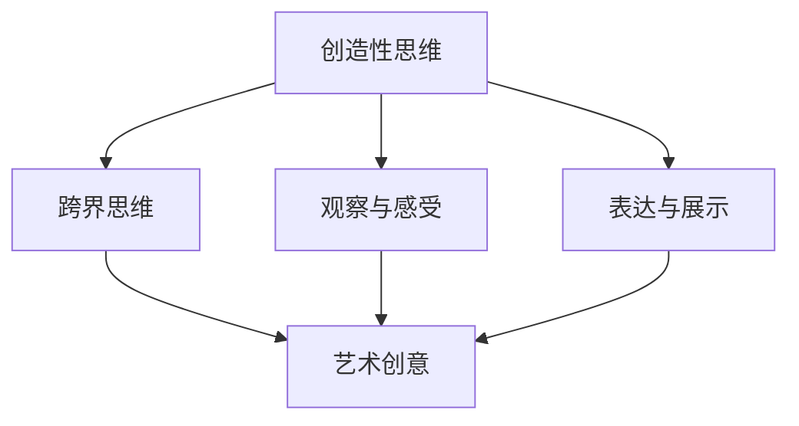

                 

### 背景介绍

在当今高速发展的社会，人们对艺术的追求已经不仅仅局限于高雅的殿堂，而是逐渐渗透到了日常生活的方方面面。这种转变不仅丰富了人们的业余生活，更激发了大众对艺术创作的热情。从家居装饰、美食创作到旅行中的艺术发现，日常生活中充满了无穷的创意可能性。然而，如何将这些平凡的场景和活动转化为具有艺术价值的表现形式，成为了一个值得探讨的问题。

艺术创意不仅仅是艺术家们的专属领域，它同样适用于普通人。日常生活与艺术之间的界限越来越模糊，每个人都可以在日常生活中发现美的元素，并用艺术的方式表达出来。这种创意表达不仅提升了生活的质量，更使得平凡的生活充满了色彩和意义。本文旨在探讨如何将日常生活转化为艺术，分享一些实用的方法和技巧，帮助读者在平凡中发现艺术，用创意点亮生活。

我们将从理论基础、思维方式、实践方法以及日常生活中的艺术创作等多个角度进行分析和讲解，旨在帮助读者理解艺术创意的本质，掌握创意表达的技巧，从而在日常生活中创造出独特的艺术作品。

### 核心概念与联系

在日常生活的艺术创作中，有几个核心概念需要明确，以便我们更好地理解和运用艺术创意的原理。这些核心概念包括创造性思维、跨界思维、观察与感受、表达与展示等。

首先，创造性思维是艺术创意的基础。创造性思维指的是在面对问题时，能从不同的角度、以新颖独特的方式思考问题并提出解决方案的能力。它不仅包括逻辑思维，还涵盖直觉思维、想象力和联想能力。在日常生活中，我们可以通过多种方式提升创造性思维，如进行头脑风暴、跨界学习、多角度观察等。

其次，跨界思维在艺术创意中具有重要意义。跨界思维是指将不同领域的知识、技能和思维方式相结合，创造出新的创意和作品。通过跨界思维，我们可以将艺术与科学、艺术与生活等不同领域融合，从而创造出更加丰富多样的艺术作品。例如，艺术家将科技元素融入作品中，或者设计师将传统文化元素与现代审美相结合，都是跨界思维的体现。

观察与感受是艺术创意的重要环节。艺术家通过敏锐的观察力和丰富的感受力，捕捉生活中的美好瞬间，将这些瞬间转化为艺术作品。观察不仅包括对物体的形状、色彩、纹理的感知，还包括对社会现象、文化背景的深入理解。感受则是对观察到的现象进行内心的体验和情感表达。

最后，表达与展示是艺术创意的最终目标。艺术家通过艺术作品将自己的创意和感受传达给观众。表达不仅包括视觉形式，如绘画、摄影、雕塑等，还包括听觉形式，如音乐、戏剧等。展示则是将艺术作品呈现给公众，让观众感受和体验艺术家的创意和情感。

这些核心概念之间存在着密切的联系。创造性思维是艺术创意的动力源泉，跨界思维为创造性思维提供了广阔的空间，观察与感受则为创造性思维提供了丰富的素材，而表达与展示则是创造性思维和跨界思维的最终体现。通过这些核心概念的综合运用，我们可以在日常生活中发现并创造出独特的艺术作品，从而丰富我们的生活体验。

为了更清晰地展示这些核心概念之间的关系，我们可以使用 Mermaid 流程图来描述：

这个流程图表明，创造性思维是艺术创意的核心，跨界思维、观察与感受、表达与展示都是创造性思维的延伸和应用。通过这些核心概念和关系的理解，我们可以在日常生活中更好地进行艺术创作，将平凡转化为非凡。

### 艺术创意的概念与特征

艺术创意是一种将日常生活中的普通事物转化为具有艺术价值的作品的能力。它不仅需要丰富的想象力和创造力，还需要对生活的敏锐观察和对审美价值的深刻理解。艺术创意的特点主要体现在以下几个方面。

首先，艺术创意具有独特性。每个艺术家都有自己独特的视角和表达方式，这使得他们的作品与众不同。在日常生活中，艺术创意通过独特的手法、风格和视角，将平凡的事物赋予新的意义。例如，一位摄影师可以通过独特的构图和光影处理，将一幅普通的风景照片转化为极具艺术感的作品。

其次，艺术创意具有创新性。创新是艺术创意的灵魂，它体现在艺术形式、内容以及表达方式的不断突破。艺术家们往往敢于尝试新的材料、技法、风格和主题，从而创造出前所未有的艺术作品。在日常生活中，创新可以通过实验性的创作、跨界融合的方式实现。例如，一位家居设计师可以将科技元素融入传统家具设计，创造出独特的现代家居风格。

再次，艺术创意具有情感性。艺术作品是艺术家情感的载体，它们通过视觉、听觉、触觉等感官途径，传达出艺术家的内心感受和情感体验。在日常生活中，艺术创意通过生动的表达，让人们感受到艺术的温度和情感的力量。例如，一幅画作可能通过细腻的笔触和色彩，传达出艺术家的喜悦、悲伤或其他情感。

此外，艺术创意具有实用性。艺术创意不仅体现在艺术作品中，还可以融入日常生活，提升生活的品质。例如，家居装饰的艺术化、美食的艺术创作、旅行中的艺术发现等，都是将艺术创意应用到实际生活中的例子。这些艺术化的生活元素，不仅丰富了人们的生活体验，还提高了生活的美学价值。

最后，艺术创意具有传播性。随着互联网和社交媒体的普及，艺术作品的传播变得更加便捷和广泛。艺术创意可以通过各种平台和渠道，迅速传播到世界各地，让更多的人欣赏和体验。在日常生活中，人们可以通过分享艺术作品、参与艺术活动等方式，传播和推广艺术创意。

总的来说，艺术创意是一种将平凡转化为非凡的能力，它体现在独特性、创新性、情感性、实用性和传播性等多个方面。通过理解艺术创意的概念和特征，我们可以更好地在日常生活中发现和创作艺术作品，从而提升生活的艺术价值。

### 艺术创意与日常生活的影响关系

艺术创意与日常生活之间的互动关系深远且复杂，它们不仅相互影响，还共同塑造了现代社会的文化景观。艺术创意不仅丰富了人们的精神世界，也深刻改变了日常生活的质感和体验。

首先，艺术创意为日常生活带来了美学提升。通过艺术家的创意表达，普通的物品、场景和活动被赋予了新的视觉和情感价值。例如，一位艺术家可以将废旧物品改造为艺术品，这不仅赋予了这些物品新的生命，还使人们重新审视日常生活中常见的物品，从而提升了生活的美学品质。家居装饰中的艺术品、独特的服装设计、个性化的生活方式等，都是艺术创意在日常生活中体现的例子。

其次，艺术创意促进了社会文化的多样性。随着全球化和文化交流的加剧，不同的艺术形式和风格不断融入日常生活，丰富了人们的文化体验。这种多样性不仅体现在艺术创作本身，还反映在日常生活中人们的生活方式、价值观念和审美偏好上。例如，旅行中的艺术体验、国际美食的引入、跨国文化交流活动等，都为日常生活注入了新的文化元素，促进了社会文化的多元发展。

此外，艺术创意也改变了人们的生活态度和思维方式。艺术作品常常以独特的视角和深刻的内涵激发观众的思考，引导人们从不同的角度看待世界和生活。例如，一幅抽象画作可能引发人们对生命、宇宙和自我的深层思考，一首音乐作品可能触动人们对情感和记忆的回忆。这种艺术体验不仅丰富了人们的情感世界，还培养了人们的创造力和批判性思维。

艺术创意对日常生活的影响还体现在实用性和功能性上。许多艺术作品不仅仅是装饰品，还具有实用性。例如，设计师创作的家具和家居用品不仅美观，还具有功能性，能够提升生活的舒适度。艺术创意通过这种实用性的体现，使艺术与生活更加紧密地结合在一起。

最后，艺术创意促进了社会的创新和发展。许多科技产品、设计理念和商业模式都受到了艺术创意的启发。例如，许多科技公司通过艺术化的设计理念，提升了产品的用户体验；许多设计师通过艺术创意，开发了新颖的产品和商业模式。这种创新不仅推动了艺术和设计领域的发展，也对整个社会产生了积极的影响。

总之，艺术创意与日常生活之间的互动关系是双向的。艺术创意不仅丰富了日常生活，提升了人们的生活质量，也通过日常生活的体验和反馈，不断激发和丰富艺术创意。通过理解这种互动关系，我们可以在日常生活中更好地发现和创作艺术作品，从而实现艺术与生活的和谐统一。

### 创造性思维的基础

创造性思维是艺术创意的核心，它决定了我们在日常生活中能否发现和创作出具有独特性和创新性的艺术作品。要理解创造性思维，首先需要了解其基础要素和培养方法。

#### 基础要素

1. **想象力**：想象力是创造性思维的基础，它使人们能够突破现实的束缚，进入一个充满无限可能性的世界。艺术家通过丰富的想象力，将平凡的事物赋予新的意义和形式。例如，达芬奇通过丰富的想象力，创作出了许多令人惊叹的艺术作品。

2. **联想能力**：联想能力是指将不同的事物和概念联系起来，从而产生新的想法。这种能力使艺术家能够从多个角度思考问题，从而创造出独特的作品。例如，现代艺术家通过将传统元素与现代元素结合，创造出新颖的艺术形式。

3. **直觉**：直觉是创造性思维的重要组成部分，它帮助艺术家在解决问题时迅速做出决策。直觉往往来源于长期的经验积累和对事物的深刻理解。例如，许多画家在创作时，往往能凭借直觉选择最佳的构图和色彩。

4. **问题解决能力**：创造性思维不仅体现在艺术创作中，还体现在解决现实问题中。艺术家通过创造性思维，能够找到独特的解决方案，解决日常生活中的各种难题。

#### 培养方法

1. **多学科学习**：跨学科学习是培养创造性思维的有效方法。通过学习不同领域的知识，人们能够拓宽视野，发现新的创意灵感。例如，一位艺术家通过学习物理学，可能会从微观世界中获得灵感，创作出具有新意的艺术作品。

2. **实践与实验**：实践是培养创造性思维的重要途径。通过不断尝试和实验，人们能够积累经验，提高解决问题的能力。例如，一位设计师通过实践和实验，可能会发现新的设计理念，从而创作出更具有创意的作品。

3. **反思与总结**：反思是创造性思维的重要环节。通过反思自己的创作过程和结果，人们能够发现不足，从而不断提高。例如，艺术家通过反思自己的作品，可能会找到改进的方法，从而创作出更优秀的作品。

4. **开放心态**：开放心态是培养创造性思维的关键。拥有开放心态的人能够接受新的观点和想法，从而激发更多的创意。例如，一位艺术家在创作过程中，如果能够接受观众的反馈和批评，可能会从中学到新的创意灵感。

5. **持续学习**：创造性思维不是一成不变的，它需要通过持续学习来保持活力。通过不断学习新的知识和技能，人们能够不断提高自己的创造性思维能力。例如，一位艺术家通过学习新的绘画技巧和理论，可能会在创作中运用这些新的元素，从而创作出更具有创意的作品。

通过理解和掌握这些基础要素和培养方法，我们可以在日常生活中更好地培养创造性思维，从而创造出更多的艺术作品，提升生活的艺术价值。

### 提升创造性思维的技巧

要提升创造性思维，我们需要掌握一系列有效的技巧和方法，这些方法不仅可以帮助我们更好地发现创意，还能让我们在创作过程中更加流畅和高效。以下是一些实用的技巧：

#### 1. 头脑风暴

头脑风暴是一种有效的集体创造性思维工具，它通过在短时间内自由地产生和记录各种想法，从而激发创意。以下是一个简单的头脑风暴步骤：

1. **明确目标**：在开始头脑风暴前，明确要解决的问题或创作的主题。
2. **自由联想**：让参与者不受任何限制地提出自己的想法，不论这些想法是否合理或可行。
3. **记录想法**：将每个想法都记录下来，即使它们看起来很离奇。
4. **分组讨论**：将相似或相关的想法分组讨论，进一步发展和完善这些想法。

#### 2. 模拟演练

模拟演练是一种通过实际操作来锻炼创造性思维的方法。以下是一个简单的模拟演练步骤：

1. **设定场景**：选择一个具体的场景，可以是日常生活中的一个实际问题或创作中的某个难题。
2. **角色扮演**：让参与者扮演不同的角色，从不同的角度来思考问题。
3. **记录结果**：在演练结束后，记录每个角色的思考过程和结果，分析哪些方法最有效。
4. **总结经验**：总结演练中的成功经验和失败教训，为今后的创作提供参考。

#### 3. 多学科学习

多学科学习是通过学习不同领域的知识来拓宽视野，从而激发创意的方法。以下是一些多学科学习的步骤：

1. **选择领域**：选择与你的创作主题相关的领域，如艺术、科技、文学等。
2. **深入研究**：深入学习所选领域的知识，了解其基本原理和前沿动态。
3. **跨界融合**：尝试将不同领域的知识融合到创作中，创造出新的作品。
4. **反思总结**：在创作过程中，不断反思如何将所学知识应用到实际中，总结经验。

#### 4. 持续练习

持续练习是提升创造性思维的关键。以下是一些持续练习的建议：

1. **每日练习**：每天花一定时间进行创作或思考，即使是最简单的练习也能逐渐提高创造性思维。
2. **反思与改进**：每次练习后，反思创作过程中的优点和不足，并尝试改进。
3. **多样化练习**：通过不同类型的练习，如绘画、写作、编程等，提高思维的灵活性。
4. **挑战自我**：设定一些具有挑战性的创作任务，逼迫自己跳出舒适区，从而激发更多的创意。

#### 5. 寻找灵感

寻找灵感是提升创造性思维的重要方法。以下是一些寻找灵感的技巧：

1. **观察生活**：从日常生活中寻找灵感，关注周围的事物和现象。
2. **阅读书籍**：阅读不同类型的书籍，特别是那些能激发想象力和创造力的作品。
3. **交流讨论**：与不同领域的人交流，听取他们的观点和经验，从而激发新的创意。
4. **旅行探索**：通过旅行，体验不同的文化和风景，从中获取灵感。

通过以上技巧和方法，我们可以不断提升创造性思维，从而在日常生活中更好地发现和创作艺术作品。记住，创造性思维不是一蹴而就的，它需要持续的努力和实践。

### 跨界思维在艺术创意中的应用

跨界思维是艺术创意中至关重要的一环，它使艺术家能够将不同领域的知识、技能和思维方式融合，创造出独特且富有创新性的作品。在日常生活中，跨界思维的应用不仅拓宽了艺术创作的边界，还为我们的生活带来了新的可能性和视角。

#### 跨界思维的定义

跨界思维，顾名思义，是指将不同领域或不同行业之间的知识、技能和思维方式进行整合和交叉运用。它不同于传统思维中的线性或单一领域思维，而是强调跨领域的交融和碰撞。跨界思维不仅要求艺术家具备广博的知识面，还需要有能够打破传统束缚、勇于尝试新事物的勇气和决心。

#### 跨界思维在艺术创意中的应用

1. **科技与艺术的结合**：

在当代艺术中，科技与艺术的结合是一个重要的趋势。艺术家通过运用计算机编程、虚拟现实（VR）、增强现实（AR）等技术，创造出全新的艺术形式。例如，一些艺术家利用计算机程序生成复杂的几何图案和动画，这些作品不仅在视觉效果上令人惊叹，还蕴含了深厚的数学和科学原理。另一例子是VR艺术展览，观众通过VR设备可以进入一个虚拟的艺术空间，体验与实体展览不同的艺术体验。

2. **传统文化与现代审美的融合**：

传统文化与现代审美的融合是跨界思维在艺术创意中的另一个应用。许多艺术家在创作时，会将传统元素与现代审美相结合，创造出既有历史底蕴又符合现代审美的作品。例如，一些艺术家会将传统的剪纸、刺绣等工艺与现代设计理念结合，创作出兼具传统特色和现代感的家居装饰品。此外，一些音乐家也会将传统乐器与现代音乐元素结合，创作出独特的音乐作品。

3. **多学科知识的整合**：

跨界思维在艺术创意中的应用还体现在多学科知识的整合。艺术家通过学习不同领域的知识，将科学、文学、哲学等领域的理论融入到艺术创作中，从而创造出更加丰富和多元的作品。例如，一些艺术家在创作时，会结合物理学中的光学原理，创造出具有特殊视觉效果的作品；另一些艺术家则会通过文学作品的启发，创作出富有故事性和情感深度的艺术作品。

#### 跨界思维的案例

1. **艺术家Banksy**：

Banksy是一位世界著名的街头艺术家，他的作品以其独特的方式挑战传统艺术和道德观念。Banksy的作品常常结合政治、社会议题，通过涂鸦和装置艺术的形式，表达他对社会现象的批判和反思。他的跨界思维体现在将艺术与政治、社会议题的紧密结合，使他的作品具有强烈的批判性和社会影响力。

2. **设计师Philippe Starck**：

Philippe Starck是一位世界著名的工业设计师，他的作品以其独特的设计风格和跨界思维著称。Starck的设计涵盖了家具、建筑、家居用品等多个领域，他不仅将艺术元素融入到设计中，还通过跨界整合，将不同领域的元素结合在一起，创造出独特的作品。例如，他的设计作品“Juicy Salif”鱼缸，将简约主义和自然元素相结合，形成了独特的美学风格。

3. **音乐家Björk**：

Björk是一位著名的冰岛歌手和音乐家，她的音乐作品以其前卫和创新著称。Björk在她的音乐创作中，经常结合科技元素，如虚拟现实、人工智能等，创造出独特的音乐体验。她的跨界思维体现在将科技与音乐相结合，创造出前所未有的音乐形式和艺术体验。

通过以上案例，我们可以看到，跨界思维在艺术创意中的应用，不仅丰富了艺术作品的内涵和形式，还推动了艺术领域的发展。跨界思维鼓励艺术家们跳出传统框架，勇于探索和尝试，从而创造出更加独特和创新的艺术作品。

总之，跨界思维在艺术创意中的应用，不仅为艺术家提供了更多的创作可能性，也为观众带来了全新的艺术体验。通过跨界思维，艺术家能够在不同领域之间搭建桥梁，创造出具有深度和广度的艺术作品，从而推动艺术和生活的融合与发展。

### 观察与感受

观察与感受是艺术创意过程中不可或缺的环节，它们不仅决定了我们能否发现生活中的美好，还直接影响艺术作品的质量。艺术家通过敏锐的观察力和深刻的感受力，将日常生活中的普通事物转化为具有艺术价值的作品。

首先，观察是艺术创意的基础。艺术家需要具备细致入微的观察能力，这包括对色彩、形状、线条、纹理等视觉元素的感知，以及对声音、气味、触感等感官体验的捕捉。例如，一位画家在创作风景画时，需要观察天空的颜色、树木的形态和地面的纹理，从而将视觉元素有机地结合在一起，形成一幅动人的艺术作品。同样，一位摄影师在拍摄时，通过观察光影的变化、人物的姿态和场景的布局，能够捕捉到生活中的瞬间美。

其次，感受是艺术创意的动力。艺术家在观察事物的过程中，会产生情感上的共鸣和内心的体验。这种感受力不仅来源于视觉和感官的刺激，还涉及到对文化背景、历史传承和人类共通情感的深刻理解。例如，当一位艺术家看到一片凋零的树叶，他可能会感受到季节更迭和生命轮回的哀愁，从而激发创作灵感，将这一情感转化为艺术作品。同样，一位音乐家在听到一段旋律时，可能会感受到某种情感或回忆，从而创作出一首动人的乐曲。

为了提升观察与感受的能力，我们可以采取以下几种方法：

#### 1. 细心观察

在日常生活中的每个细节中寻找美。例如，在散步时，仔细观察树叶的形状、天空的颜色、建筑的风格等；在旅行中，留意当地的文化氛围、人们的表情和动作等。通过细心观察，我们可以培养对生活的敏锐感知力。

#### 2. 感受环境

在创作过程中，将自己完全沉浸在环境中。例如，在创作自然风景画时，可以到户外亲身感受大自然的美妙，呼吸新鲜的空气，聆听自然的声音；在创作音乐时，可以置身于宁静的环境中，用心感受音符带来的情感共鸣。通过感受环境，我们可以更深刻地理解和表达情感。

#### 3. 多角度思考

从不同的角度和视角观察事物，寻找独特的视觉和感官体验。例如，在拍摄照片时，可以尝试不同的拍摄角度和构图方式，以捕捉到最动人的瞬间；在写作时，可以从不同的角色和视角来叙述故事，从而丰富作品的内涵。通过多角度思考，我们可以拓宽视野，激发创意。

#### 4. 反思与总结

在观察和感受后，进行反思和总结。例如，在创作结束后，回顾整个创作过程，思考哪些观察和感受对创作有重要影响，哪些方面还有待改进。通过反思与总结，我们可以不断提高观察和感受的能力。

总之，观察与感受是艺术创意的核心要素，它们不仅决定了艺术作品的质量，还直接影响我们与生活的连接。通过细心观察、感受环境、多角度思考和反思总结，我们可以提升观察与感受的能力，从而在日常生活中发现更多的艺术灵感，创作出更加出色的艺术作品。

### 表达与展示

表达与展示是艺术创意过程中不可或缺的重要环节，它们不仅体现了艺术家的创作意图，还直接影响观众对艺术作品的感受和理解。成功的表达与展示能够使艺术作品从平面或虚拟空间中走出来，与观众产生深刻的共鸣。

#### 表达的方式

1. **视觉表达**：视觉艺术，如绘画、雕塑、摄影等，最直接的展示方式是通过视觉元素来传达艺术家的意图。例如，一位画家可以通过色彩、线条、形状等元素，表达出对自然景观的感受或对某种情绪的描绘。在视觉表达中，构图和光影的运用至关重要，它们能够增强作品的视觉冲击力和表现力。

2. **听觉表达**：音乐和表演艺术通过声音和动作来表达情感和故事。例如，一位音乐家可以通过旋律、节奏和音色的变化，传达出内心的情感波动。在表演艺术中，动作和表情的协调配合，可以增强观众的代入感和沉浸感。

3. **文字表达**：文学和书法等艺术形式通过文字和符号来表达思想和情感。例如，一首诗可以通过文字的排列和节奏，传达出作者的情感和哲思。在书法中，笔画的力度、速度和转折，都能够体现出书法家的个性和情感。

#### 展示的方法

1. **线上展示**：随着互联网和社交媒体的普及，线上展示成为艺术创作和分享的重要平台。艺术家可以通过博客、Instagram、YouTube等平台，展示自己的作品和创作过程。线上展示具有传播速度快、受众广泛的优势，但也需要注重内容的创意和视觉吸引力。

2. **实体展览**：实体展览是艺术作品最传统的展示方式，它能够在特定的空间和时间，为观众提供直观的观展体验。实体展览可以通过画廊、博物馆、艺术节等场所进行，能够最大程度地展示艺术家的创作意图和作品细节。在实体展览中，展览策划、展示设计和观众互动都是关键因素。

3. **多媒体展示**：多媒体展示是将多种艺术形式结合，通过视频、音频、互动装置等手段，为观众提供更加丰富的艺术体验。例如，虚拟现实（VR）和增强现实（AR）技术的应用，可以使观众在虚拟空间中体验艺术作品，从而增强观展的互动性和沉浸感。

#### 成功的案例

1. **艺术家草间弥生**：草间弥生的作品以其独特的视觉风格和强烈的个人风格著称。她的代表作《无限镜室》通过无数镜子和光影的反射，营造出无限延伸的空间感，让观众在视觉和心理上产生强烈的共鸣。草间弥生的成功在于她独特的视觉表达和多媒体展示的结合，使她的作品在全球范围内受到广泛关注。

2. **音乐家Björk**：Björk是一位富有创意的音乐家和视觉艺术家，她的音乐作品和艺术表演常常结合视觉元素，创造出独特的艺术体验。她的专辑《Biophilia》不仅包含音乐作品，还附带了多种互动装置和应用程序，使观众可以通过多种方式体验音乐和艺术。Björk的成功在于她跨界的创意思维和多媒体展示的结合，使她的作品在音乐和艺术领域都取得了巨大成功。

3. **设计师菲利普·斯塔克**：菲利普·斯塔克是现代设计领域的杰出代表，他的设计作品既具有功能性的实用性，又具有艺术性。他的设计作品，如《Juicy Salif》鱼缸和《Pegaso》椅子，通过简洁的线条和独特的造型，传达出强烈的视觉冲击力。斯塔克的成功在于他跨界的设计理念和视觉表达的结合，使他的作品成为现代设计的经典之作。

总之，成功的表达与展示需要艺术家具备丰富的创意思维和多方面的技能，同时还需要考虑观众的感受和互动。通过多种展示方式的应用，艺术家可以更好地传达自己的创作意图，与观众产生深刻的共鸣。无论是在视觉、听觉还是文字表达上，通过精心的策划和展示，艺术作品都能够走出平面和虚拟空间，与观众产生真正的互动和情感连接。

### 家居装饰的艺术化

家居装饰不仅是生活空间的布置，更是一种艺术表达方式。通过艺术化的家居装饰，我们不仅能够提升生活品质，还能在平凡的生活中发现和创造美。以下是一些具体的家居装饰艺术化方法，以及一些实用的技巧和工具推荐。

#### 方法一：色彩搭配

色彩是家居装饰中最重要的元素之一。合适的色彩搭配能够营造出和谐、温馨的空间氛围。以下是一些色彩搭配的技巧：

1. **同色系搭配**：选择相近色调的颜色进行搭配，能够创造出统一且富有层次感的空间效果。例如，浅蓝色和淡紫色可以搭配出宁静舒适的卧室环境。
2. **互补色搭配**：选择互补色（如红色与绿色、黄色与紫色）进行搭配，能够创造出强烈的视觉对比，增添空间的活力和动态感。例如，将橙色和蓝色的窗帘搭配在一起，可以为客厅带来明亮的氛围。
3. **渐变色搭配**：渐变色能够营造出视觉上的流动感，使空间显得更加灵动。例如，在儿童房中使用渐变色的墙面装饰，可以营造出梦幻般的氛围。

#### 方法二：材质运用

材质的选择和使用能够为家居装饰带来丰富的视觉和触觉体验。以下是一些常用的材质：

1. **木材**：木材具有天然的质感和温暖的色彩，适用于地板、家具和墙面装饰。例如，在客厅中使用木质地板和家具，能够营造出自然、舒适的氛围。
2. **玻璃**：玻璃具有透明、光滑的特点，适用于窗户、隔断和装饰品。例如，在厨房中安装玻璃门和玻璃隔断，不仅能够增加空间的通透性，还能让光线更加明亮。
3. **金属**：金属材料（如铁艺、不锈钢）具有现代感和质感，适用于家具和装饰品。例如，在卧室中使用金属框架的床和床头柜，能够增添空间的时尚感。

#### 方法三：艺术装饰品

艺术装饰品是家居艺术化的重要元素。以下是一些常用的艺术装饰品：

1. **油画**：油画具有丰富的色彩和细腻的笔触，适合挂在客厅、餐厅等空间。选择一幅与房间风格相协调的油画，能够为空间增添艺术氛围。
2. **雕塑**：雕塑是一种立体的艺术形式，能够为空间带来独特的视觉焦点。例如，在客厅的一角放置一尊雕塑，能够提升空间的品味和艺术感。
3. **工艺品**：工艺品（如陶瓷、玻璃器皿）不仅具有实用功能，还能作为装饰品。例如，在书桌上摆放几个精致的陶瓷杯和碟子，可以为空间增添温馨和雅致的氛围。

#### 工具和材料推荐

1. **调色板**：调色板可以帮助我们选择和搭配颜色，确保家居装饰的色彩协调。
2. **画笔和颜料**：高质量的画笔和颜料是进行家居装饰创作的基础，适合用于绘制油画和墙面装饰。
3. **木材切割工具**：木材切割工具（如电锯、切割机）适用于木材的切割和加工，能够帮助我们制作木质家具和装饰品。
4. **玻璃切割工具**：玻璃切割工具（如玻璃刀、切割机）适用于玻璃的切割和加工，能够帮助我们制作玻璃门窗和装饰品。
5. **金属加工工具**：金属加工工具（如电焊机、切割机）适用于金属的焊接和切割，能够帮助我们制作金属家具和装饰品。

通过以上方法，我们可以将家居空间艺术化，创造出充满个性和美感的居住环境。无论是在色彩搭配、材质运用还是艺术装饰品的选择上，只要我们用心去发现和创造，平凡的生活空间就能焕发出独特的艺术魅力。

### 美食的艺术创作

美食不仅是人们日常生活中的必需品，更是艺术创作的重要素材。将美食与艺术相结合，不仅能提升味觉享受，还能为视觉带来无尽的乐趣。以下是一些将美食转化为艺术创作的具体方法，以及一些创意美食的制作技巧和艺术展示方式。

#### 方法一：色彩运用

在美食创作中，色彩是最直接的视觉元素。通过巧妙的色彩搭配，可以创造出丰富多彩的艺术效果。以下是一些色彩运用的技巧：

1. **自然色彩**：利用新鲜食材的自然色彩，如红色番茄、黄色玉米、紫色茄子等，可以制作出色彩鲜艳的美食作品。例如，利用番茄和玉米制作一道色彩斑斓的沙拉，既能提供营养，又能带来视觉享受。
2. **对比色彩**：对比色彩（如红色与绿色、黄色与紫色）能够增强美食的艺术感。例如，将煎蛋卷和蓝莓酱搭配，形成鲜明的色彩对比，使美食更具吸引力。
3. **渐变色彩**：通过色彩的渐变，可以创造出具有层次感和立体感的艺术作品。例如，利用不同深浅的橙色彩拉，制作出渐变色的蛋糕，使美食呈现出艺术感。

#### 方法二：形状设计

形状设计是美食艺术创作中的重要元素。通过巧妙的形状设计，可以创造出独特的视觉效果。以下是一些形状设计的技巧：

1. **几何形状**：利用模具和工具，可以制作出各种几何形状的美食。例如，使用圆形模具制作蛋糕，再用切刀切割成三角形或正方形，创造出几何图形的艺术效果。
2. **自然形状**：利用食材的自然形状，如蘑菇、洋葱、西兰花等，可以制作出自然形状的美食。例如，将蘑菇和西兰花摆放在盘子上，形成自然的图案，增加美食的艺术感。
3. **组合形状**：通过将不同形状的食材组合在一起，可以创造出复杂的形状设计。例如，将圆形的土豆块和长条形的胡萝卜丝组合，制作出一幅复杂的拼贴画。

#### 方法三：纹理表现

纹理是美食艺术创作中的另一个重要元素。通过巧妙的纹理表现，可以增加美食的层次感和立体感。以下是一些纹理表现的技巧：

1. **切割纹理**：通过切割和雕刻食材，可以创造出各种纹理效果。例如，将水果切成薄片或雕刻出图案，增加美食的纹理层次。
2. **涂鸦纹理**：利用酱料和调料在食材表面进行涂鸦，可以创造出独特的纹理效果。例如，在面包上用番茄酱绘制图案，增加面包的艺术感。
3. **打印纹理**：利用打印技术，可以将各种图案和纹理打印在食材上。例如，使用3D打印技术，将复杂的图案和纹理打印在巧克力或蛋糕上。

#### 艺术展示方式

1. **照片拍摄**：通过专业摄影技术，可以将美食制作成照片，展示其艺术魅力。拍摄时，可以利用光线、角度和背景，增强照片的视觉效果。
2. **社交媒体分享**：利用社交媒体平台，如Instagram、微博等，可以分享美食创作的过程和作品。通过图片和短视频的形式，展示美食的艺术创作，吸引更多的关注和互动。
3. **实体展览**：在餐厅、画廊或艺术展览中，可以举办美食艺术展览。通过实体展示，让观众近距离感受美食的艺术魅力，并分享创作灵感。

通过以上方法，我们可以将美食转化为独特的艺术作品，提升味觉和视觉的双重享受。无论是色彩运用、形状设计还是纹理表现，只要我们用心创作，平凡的食物就能焕发出无穷的艺术魅力。

### 旅行中的艺术发现

旅行不仅是探索世界的方式，也是发现和创作艺术的重要途径。在旅行中，我们能够体验到不同的文化、自然景观和人文风情，这些体验和感受都是丰富的艺术灵感来源。以下是一些旅行中的艺术发现方法，以及如何收集和展示这些艺术作品的技巧。

#### 方法一：文化体验

1. **参观博物馆和美术馆**：旅行中，参观博物馆和美术馆是获取艺术灵感的重要途径。在这些场所，我们可以欣赏到世界各地的艺术珍品，了解不同文化和艺术风格。通过这些体验，我们可以汲取灵感，将艺术元素融入自己的创作中。
2. **参观艺术展览**：旅行中，参加当地的艺术展览也是一个很好的选择。展览中展出的作品不仅展示了艺术家们的创作成果，还反映了当地的艺术氛围和文化特色。通过参观展览，我们可以开阔视野，获得新的艺术灵感。
3. **体验当地艺术活动**：一些地方会举办各种形式的艺术活动，如艺术市集、街头艺术表演等。参与这些活动，我们可以近距离感受到艺术的活力，了解当地艺术家的创作方式和作品风格。

#### 方法二：自然景观

1. **摄影**：旅行中的自然景观是摄影艺术创作的重要素材。利用摄影技巧，我们可以捕捉到美丽的风景，如日出日落、云海、山川等。在拍摄过程中，我们可以运用构图、光线和色彩等技巧，创作出具有艺术感的摄影作品。
2. **写生**：在自然环境中写生是一种直接的艺术创作方式。通过绘画或素描，我们可以记录下眼前的美景，表达对自然景观的感悟和情感。写生不仅能够提升我们的绘画技巧，还能让我们更加敏锐地观察和感受大自然。
3. **声音记录**：自然景观不仅包括视觉元素，还包括听觉元素。通过记录自然声音，如溪水声、鸟鸣声、风声等，我们可以创作出独特的声音艺术作品。

#### 方法三：人文风情

1. **街头艺术**：在旅行中，街头艺术是一个重要的艺术发现点。街头艺术家们的作品不仅展示了他们的才华和创造力，还反映了当地的社会文化氛围。通过观察和记录街头艺术，我们可以发现独特的艺术风格和创作手法。
2. **手工艺品**：许多地方都有独特的手工艺品，如刺绣、陶瓷、木雕等。这些手工艺品不仅是艺术创作的素材，还承载着当地的文化和历史。购买或制作这些手工艺品，可以将旅行中的艺术体验带回家。
3. **建筑和雕塑**：旅行中的建筑和雕塑也是艺术创作的灵感来源。古老的建筑和雕塑不仅展示了人类文明的进步，还体现了艺术家的创意和技巧。通过观察和拍摄建筑和雕塑，我们可以从中汲取艺术灵感。

#### 收集与展示

1. **数字保存**：通过摄影、视频和音频记录的方式，将旅行中的艺术作品数字化保存。将这些数字作品整理成电子相册或视频，便于日后回顾和分享。
2. **实体展示**：将旅行中收集到的艺术作品进行实体展示。在家中或办公室的墙壁上挂上旅行拍摄的摄影作品，或摆放旅行中的手工艺品和纪念品，让旅行记忆在日常生活中得到延续。
3. **艺术展览**：在适当的时候，可以举办一次旅行艺术展览，展示旅行中的创作成果。通过展览，我们可以与他人分享旅行中的艺术体验和灵感，进一步激发艺术创作的热情。

通过旅行中的艺术发现，我们可以拓宽视野，丰富艺术创作的内容和形式。无论是在自然景观、人文风情还是街头艺术中，只要我们用心去发现和创作，旅行将不仅仅是一次探索，更是一次充满艺术魅力的旅程。

### 日常生活中的创意摄影

创意摄影是日常生活中的一个有趣且富有挑战性的艺术形式，通过独特的视角和技巧，我们可以捕捉到生活中的美好瞬间，将其转化为具有艺术感染力的摄影作品。以下是一些创意摄影的技巧和案例分析，帮助我们在日常生活中发现和创作独特的摄影作品。

#### 技巧一：视角创新

1. **低角度拍摄**：通过低角度拍摄，我们可以将拍摄对象放大，使其成为画面的焦点。例如，拍摄花朵时，将相机贴近地面，用低角度捕捉花朵的细节，可以让花朵显得更加生机勃勃。
2. **高角度拍摄**：高角度拍摄可以创造出独特的视觉效果，使观众感受到不同的视角和空间感。例如，拍摄建筑时，可以从高楼顶部俯瞰，将建筑物和周围环境纳入同一画面，形成壮观的视觉效果。

#### 技巧二：光影运用

1. **逆光拍摄**：逆光拍摄可以创造出美丽的轮廓光和光晕效果。在逆光环境下，通过调整曝光补偿，可以使主体清晰，同时背景呈现出丰富的光影变化。例如，拍摄树木时，逆光可以使树叶呈现出透明的效果，营造出梦幻的氛围。
2. **侧光拍摄**：侧光拍摄可以突出物体的立体感和质感。在侧光环境下，通过调整拍摄角度，可以使物体的阴影和明暗对比更加明显，从而增强画面的立体感和艺术感。

#### 技巧三：构图创新

1. **对称构图**：对称构图可以使画面显得稳定且富有节奏感。在拍摄风景时，可以使用对称构图，将水面、桥梁或建筑等元素纳入画面，形成对称的美感。例如，拍摄湖泊时，可以将远处的山峦和近处的水面对称安排，形成宁静的画面。
2. **框架构图**：框架构图可以通过前景的框架结构，引导观众的视线。例如，使用窗户、门框、桥梁等作为框架，可以增强画面的层次感和深度感。

#### 案例分析

1. **案例一：街头摄影**：

街头摄影是一种富有生活气息和创意的摄影形式。通过捕捉街头的瞬间，我们可以记录下人们的日常生活和城市的文化风貌。案例中，一位摄影师在街角捕捉到一个孩子玩耍的瞬间，通过低角度拍摄和逆光处理，使孩子的笑容和背景的光影形成了美丽的对比，让观众感受到快乐和温馨。

2. **案例二：自然摄影**：

自然摄影是捕捉自然美景的一种艺术形式。通过运用光影和构图技巧，我们可以将大自然的美丽瞬间定格在画面中。案例中，一位摄影师在森林中捕捉到了夕阳下的树木和水面，通过高角度拍摄和侧光处理，使画面呈现出丰富的光影变化和立体感，让观众仿佛置身于自然之中。

3. **案例三：美食摄影**：

美食摄影是近年来非常流行的摄影形式，它不仅需要技巧，还需要对美食和视觉美感的深刻理解。案例中，一位摄影师通过创意构图和光影运用，将一道简单的沙拉拍得如同艺术品。通过低角度拍摄和逆光处理，使沙拉的每一片食材都显得立体且充满质感，让观众食欲大增。

通过以上技巧和案例分析，我们可以发现，创意摄影不仅需要技巧，还需要对生活的敏锐观察和对美的深刻理解。在日常生活中，只要我们用心去发现和创作，就能捕捉到那些美丽的瞬间，将其转化为独特的摄影作品，分享给更多的人。

### 手工艺品创作与设计

手工艺品创作与设计是艺术创意的重要组成部分，它不仅体现了艺术家的创作才华，还传递了独特的文化价值和生活美学。以下将详细探讨手工艺品创作与设计的材料、工具以及创意设计的过程，并辅以具体的案例分析。

#### 材料选择

手工艺品的创作离不开合适的材料。不同的材料具有不同的质感和表现力，能够为作品带来独特的视觉效果和触感。

1. **木材**：木材是传统手工艺品常用的材料之一，具有天然纹理和温暖的质感。常见的木材有橡木、柚木、松木等。木材适用于制作家具、雕刻品和装饰品。
   
2. **陶瓷**：陶瓷材料包括粘土、釉料和彩料。通过烧制过程，陶瓷可以呈现出丰富的色彩和光滑的质感。陶瓷适用于制作餐具、装饰品和雕塑。

3. **金属**：金属材料如铜、铁、铝等，具有独特的光泽和质感。金属工艺品包括铁艺品、铜器、银器等，这些材料适用于制作家具、装饰品和日用品。

4. **玻璃**：玻璃材料通过切割、雕刻和烧制，可以创造出丰富多彩的视觉效果。玻璃适用于制作灯具、装饰品和餐具。

5. **纤维材料**：纤维材料如棉、麻、丝等，适用于制作纺织品、编织品和刺绣品。这些材料不仅具有良好的质感，还可以通过不同的编织和绣花技巧，创造出独特的图案和纹理。

#### 工具介绍

创作手工艺品需要一系列专业工具，以下是一些常用的工具及其用途：

1. **锯子**：用于切割木材、金属和玻璃等材料。常见的锯子类型有手锯、电锯和玻璃锯。

2. **雕刻工具**：包括雕刻刀、凿子、刻刀等，用于雕刻木材、石头和金属等材料。

3. **打磨工具**：如砂纸、打磨机等，用于打磨木材、金属和陶瓷等材料，使其表面光滑。

4. **纺织工具**：如织机、编织针、刺绣针等，用于编织和刺绣纤维材料。

5. **烧制工具**：如窑炉、炉具和烧制温度计等，用于烧制陶瓷材料。

#### 创意设计过程

手工艺品的设计过程通常包括以下几个阶段：

1. **构思阶段**：在这一阶段，艺术家或设计师需要明确创作意图和作品的主题。构思可以是抽象的，也可以是具体的，如自然元素、几何图形、文化符号等。

2. **草图设计**：根据构思，艺术家或设计师会绘制草图，以初步确定作品的形状、尺寸和布局。草图设计是表达创意的重要步骤，可以通过手绘或数字化工具完成。

3. **材料选择**：根据草图设计，选择合适的材料。材料的选择不仅影响作品的表现力，还影响创作的可行性和成本。

4. **制作阶段**：在制作阶段，艺术家或设计师会根据草图进行具体的制作。这一阶段需要熟练掌握不同材料的加工和制作技巧。

5. **细节处理**：在作品制作完成后，进行细节处理，如打磨、抛光、上釉等，使作品更加精美和耐用。

6. **展示与推广**：将完成的手工艺品进行展示和推广，可以通过实体展览、线上平台和社交媒体等方式，让更多的人欣赏和了解作品。

#### 案例分析

1. **案例一：陶瓷花瓶设计**：

艺术家李明设计了一款陶瓷花瓶，灵感来源于自然景观中的山川河流。他在草图设计中，通过抽象的手法，将山川的线条和曲线融入花瓶的形状中。在材料选择上，他选择了细腻的粘土和透明的釉料，以展现花瓶的质感和光泽。经过烧制和细节处理，这款陶瓷花瓶呈现出自然的美感和艺术价值。

2. **案例二：编织毛衣设计**：

设计师张丽设计了一款独特的编织毛衣，灵感来源于传统的中国刺绣图案。她在草图设计中，将传统的刺绣图案重新编排和简化，以适应现代审美。在材料选择上，她使用了柔软的羊毛和多种颜色的线，通过编织技巧，将图案栩栩如生地表现出来。这款毛衣不仅具有传统韵味，还充满了现代时尚感。

通过以上探讨，我们可以看到，手工艺品创作与设计是一个充满创意和挑战的过程。通过合适材料和工具的选择，以及精心的设计过程，艺术家和设计师可以创造出独特的艺术作品，为我们的生活增添色彩和美感。

### 文字与图像的结合

在艺术创作中，文字与图像的结合是一种独特的表现形式，它不仅能够丰富作品的内容，还能增强作品的表达力和艺术感染力。文字与图像的结合不仅局限于文学和视觉艺术领域，还广泛应用于设计、插画、漫画等多个领域。以下，我们将探讨文字与图像结合的基本方法，以及具体案例分析和创作技巧。

#### 基本方法

1. **图像解释文字**：在这种方法中，图像充当文字的补充和解释，帮助观众更好地理解文字内容。例如，在儿童读物中，图像常常用来解释复杂的文字内容，帮助孩子们理解故事情节。这种结合方式强调图像的直观性和文字的叙述性。

2. **文字诠释图像**：与此相反，文字在这种情况下用来解释图像的内涵和意义。图像作为视觉元素，而文字则提供深层次的解释和背景信息。例如，在艺术展览中，作品的标题和说明文字可以帮助观众理解艺术家的创作意图和作品背后的故事。

3. **文字与图像相互呼应**：在这种结合方式中，文字和图像相互补充，形成一种互动关系。图像和文字共同传达一种信息，通过彼此的呼应，增强作品的整体效果。例如，在插画中，图像的构图和色彩可以与文字的节奏和情感相呼应，创造出和谐的视觉效果。

4. **文字与图像交替展示**：在这种方法中，文字和图像交替出现，使作品呈现出一种动态感。例如，在漫画中，文字和图像交替展示，通过文字解释和图像展示，推动故事情节的发展。

#### 案例分析

1. **案例一：漫画《龙珠》**：

《龙珠》是一部经典的漫画作品，其中文字与图像的紧密结合是其成功的关键。在《龙珠》中，图像通过生动的画面和动态的构图，展现出了故事中的动作和情节；而文字则通过对话和旁白，解释了角色的情感和动机。文字和图像相互补充，使故事更加生动和引人入胜。

2. **案例二：插画《小王子》**：

《小王子》是另一部经典的文学作品，其插画也是作品的重要组成部分。在这部作品中，插画通过简洁的线条和鲜明的色彩，形象地表现了文字中的场景和角色。文字和图像相互呼应，共同传达了小王子的故事和哲理，使读者在阅读过程中感受到深刻的情感共鸣。

#### 创作技巧

1. **统一风格**：在创作中，确保文字和图像的风格保持一致，以增强整体效果。无论是绘画风格、色彩搭配还是构图形式，都应该相互协调，营造出和谐的氛围。

2. **强调互动性**：在文字和图像的安排上，要注重互动性，使观众能够在阅读和观看的过程中产生共鸣。通过文字和图像的互动，使作品更加生动和有趣。

3. **合理布局**：在创作过程中，合理布局文字和图像，确保它们在画面中的位置和比例适当。通过巧妙的布局，增强作品的空间感和层次感。

4. **注重细节**：无论是文字还是图像，都要注重细节的处理。通过细腻的笔触和精准的文字表达，使作品更加丰富和真实。

5. **情感共鸣**：在创作过程中，要注重情感的表达。通过文字和图像的细腻描绘，使观众在阅读和观看的过程中产生情感共鸣，从而增强作品的艺术感染力。

通过以上方法和技术，我们可以将文字与图像巧妙地结合在一起，创作出具有独特魅力的艺术作品。无论是文学作品、插画、漫画还是设计作品，文字与图像的结合都能为作品增添新的维度和深度，使观众在视觉和情感上得到更加丰富的体验。

### 艺术创意资源推荐

为了帮助读者更好地进行艺术创作，以下推荐了一些优秀的艺术创意资源，包括网站、书籍和活动，这些资源将为艺术创作提供丰富的灵感和实用的技巧。

#### 网站推荐

1. **Pinterest**：一个充满创意和灵感的图片分享平台，用户可以在这里发现各种艺术作品和创意设计，激发创作灵感。
   
2. **Behance**：一个专业的创意作品展示平台，设计师和艺术家可以在这里展示自己的作品，获取反馈和灵感。

3. **DeviantArt**：一个面向艺术家的社区平台，涵盖了绘画、摄影、设计等多个艺术领域，用户可以在这里分享和欣赏各种创意作品。

4. **ArtStation**：一个专为游戏、电影和动画行业的艺术创作者设计的平台，提供了丰富的艺术资源和教程。

5. **YouTube**：一个视频分享平台，许多艺术家和设计师在这里分享他们的创作过程和技巧，用户可以免费学习各种艺术技能。

#### 书籍推荐

1. **《创意思考的秘密：如何像天才一样思考》**：作者迈克尔·米歇尔·巴克，这本书介绍了如何通过创新思维方法，提升创造性思维能力。

2. **《设计思维：如何通过设计思维创新解决问题》**：作者大卫·凯利，这本书详细介绍了设计思维的方法和应用，为艺术创作提供了宝贵的启示。

3. **《创意的源泉：如何激发和培养创造力》**：作者史蒂芬·贝利，这本书探讨了创造力的本质和激发方法，帮助读者在日常生活中培养创意。

4. **《艺术的力量：如何创作动人的艺术作品》**：作者大卫·霍克尼，这本书通过丰富的实例和案例分析，介绍了艺术创作的基本原理和技巧。

5. **《创意写作手册》**：作者达恩·韦伯，这本书涵盖了创意写作的各个方面，包括构思、写作技巧和编辑方法，适合想要提高写作水平的读者。

#### 活动推荐

1. **创意工作坊**：许多城市和艺术机构会定期举办创意工作坊，为参与者提供艺术创作的实践机会和指导。这些工作坊涵盖了绘画、摄影、设计等多个领域，适合不同水平的艺术家和创作者。

2. **艺术展览**：参加艺术展览不仅能够欣赏到优秀的艺术作品，还能与艺术家进行交流，获取创作灵感。许多知名艺术机构和画廊都会举办定期展览，如巴黎的蓬皮杜艺术中心、纽约的大都会艺术博物馆等。

3. **线上讲座**：许多知名艺术家和设计师会在线上举办讲座和研讨会，分享他们的创作经验和技巧。这些讲座通常可以通过官方网站或社交媒体平台免费观看。

4. **艺术比赛**：参加艺术比赛是一种激发创意和展示作品的好方法。许多艺术机构和组织会举办各种类型的艺术比赛，如绘画比赛、摄影比赛、设计比赛等。

通过这些艺术创意资源，读者可以不断学习和探索，提升自己的艺术创作能力，从而在日常生活中创造出更多具有独特艺术价值的作品。

### 创意艺术工具介绍

在艺术创作中，选择合适的工具能够极大地提升创作的效率和作品的质量。以下介绍几种常见的创意艺术工具，包括摄影工具、手工艺品制作工具和创意写作工具，帮助读者在艺术创作中更加得心应手。

#### 摄影工具

1. **相机**：相机是摄影的基础工具。根据预算和需求，可以选择单反相机、微单相机或手机相机。单反相机和微单相机通常提供更高的画质和更多的手动调节功能，适用于专业摄影。手机相机则方便携带，适用于日常拍摄。

2. **三脚架**：三脚架用于稳定相机，防止拍摄时出现抖动。特别是在长时间曝光或拍摄夜景时，三脚架尤为重要。选择坚固且可调节的三脚架，可以确保拍摄效果。

3. **镜头**：不同类型的镜头适用于不同的拍摄场景。例如，广角镜头适合拍摄风景，长焦镜头适合拍摄远处的物体。根据创作需求，选择合适的镜头，可以提升作品的视觉效果。

4. **闪光灯**：闪光灯用于在光线不足的情况下补光或创造特殊效果。外置闪光灯通常提供更高的调节性和更多的附件选择，适用于专业摄影。

5. **滤镜**：滤镜可以改变光线的效果，如渐变镜、偏振镜等。渐变镜可以平衡天空与地面的亮度，偏振镜可以减少反光和增强色彩。

#### 手工艺品制作工具

1. **画笔和颜料**：画笔和颜料是绘画的基本工具。选择适合自己风格的画笔和颜料，可以提升绘画的效果。例如，油画笔适合厚涂，水彩笔适合薄涂。

2. **雕刻工具**：雕刻工具包括雕刻刀、凿子和磨刀石等。这些工具适用于木材、石头和金属等材料的雕刻。

3. **编织工具**：编织工具包括织机、编织针和钩针等。这些工具适用于编织和刺绣。

4. **陶瓷工具**：陶瓷工具包括窑炉、泥料、釉料和彩料等。陶瓷创作需要这些工具来完成泥料的制作、烧制和彩绘。

5. **金属加工工具**：金属加工工具包括电焊机、切割机和打磨机等。这些工具适用于金属材料的焊接、切割和打磨。

#### 创意写作工具

1. **笔记本电脑**：笔记本电脑是现代写作的重要工具，它提供了便捷的写作环境和丰富的功能。选择一款轻便且性能良好的笔记本电脑，可以提升写作效率。

2. **平板电脑**：平板电脑适用于移动写作和绘画。许多平板电脑配备了触控屏和高质量的压力感应笔，可以像使用纸张一样进行书写和绘画。

3. **写作软件**：写作软件如Microsoft Word、Google Docs和Scrivener等，提供了丰富的文本编辑功能和协作工具，适合长篇写作和多人协作。

4. **笔记应用**：笔记应用如Evernote、OneNote和Notion等，可以方便地记录灵感和创作思路，支持文本、图片、音频等多种形式的笔记。

5. **思维导图软件**：思维导图软件如MindManager、XMind和MindMeister等，可以帮助创作者整理思路，构建创意框架。

通过了解和使用这些创意艺术工具，读者可以更好地进行艺术创作，提升作品的质量和表现力。选择合适的工具，不仅能提高创作效率，还能激发更多的创作灵感，使艺术创作更加顺利和有趣。

### 总结与展望

综上所述，本文从多个角度探讨了如何将日常生活转化为艺术，分享了艺术创意的理论基础、思维方式、实践方法以及日常生活中的艺术创作技巧。通过这些探讨，我们认识到，艺术创意不仅是专业艺术家的专属领域，普通人也可以通过学习和实践，在日常生活中发现和创作出独特的艺术作品。

在创造性思维的基础上，我们学习了如何通过观察与感受、表达与展示来提升艺术创作的质量。同时，跨界思维的应用，使艺术家能够将不同领域的知识融合，创造出更加丰富多样的艺术作品。家居装饰、美食创作、旅行艺术发现以及创意摄影和手工艺品设计，都是将平凡转化为艺术的有效途径。

此外，本文还介绍了艺术创意资源推荐和创意艺术工具的使用，帮助读者在创作过程中获取灵感和提升技能。通过这些方法，读者不仅能够提升自己的生活品质，还能在平凡中发现美的元素，创作出具有艺术价值的作品。

展望未来，随着科技的进步和全球化的发展，艺术创意将会有更多的创新和突破。新的媒介、技术和工具将不断涌现，为艺术创作提供更多的可能性。我们鼓励读者持续学习和探索，勇于尝试和挑战，不断丰富自己的艺术创作经验。

总之，艺术创意是一种提升生活质量和精神体验的重要方式。通过在日常生活中发现和创作艺术作品，我们不仅能够丰富自己的内心世界，还能为社会带来更多的美好。让我们携手同行，共同在平凡中创造出非凡的艺术，点亮生活的每一个角落。

### 注意事项

在艺术创作过程中，需要注意以下几点，以确保创作效果和安全性：

1. **安全第一**：在进行艺术创作时，如使用刀具、电焊机等工具，务必注意安全。确保工作环境整洁，避免使用未经训练的情况下操作危险工具，以免造成意外伤害。

2. **材料选择**：选择合适的材料和工具是创作成功的关键。例如，在摄影时，应选择适合的相机和镜头；在绘画时，应选择适合的画笔和颜料。确保材料无毒无害，以避免对健康造成影响。

3. **创意保护**：在创作过程中，保护自己的创意和知识产权至关重要。对于摄影、写作和设计作品，可以通过版权登记等方式保护自己的权益。

4. **环保意识**：在创作过程中，应注重环保，减少对环境的污染。例如，在处理废弃物时，应遵循环保规定，尽量使用可回收材料。

5. **合理安排时间**：艺术创作是一个持续的过程，需要投入大量时间和精力。合理安排时间，避免过度劳累，保证创作过程的连续性和稳定性。

6. **版权尊重**：在使用他人作品或素材时，应尊重原创作者的版权，不得未经授权擅自使用他人的创意和作品。

通过遵守这些注意事项，我们可以在艺术创作中确保安全、高效和有创意，同时保护自己的权益，为艺术创作营造良好的环境。

### 拓展阅读

为了进一步提升读者在艺术创作方面的知识和技能，以下推荐一些拓展阅读资源，涵盖艺术理论、创意技巧、艺术史以及相关书籍和期刊：

1. **《创意思考的秘密：如何像天才一样思考》**：作者迈克尔·米歇尔·巴克，深入探讨创造性思维的原理和技巧，为读者提供实用的创意方法。

2. **《设计思维：如何通过设计思维创新解决问题》**：作者大卫·凯利，详细介绍了设计思维的方法和应用，帮助读者在实际生活中运用设计思维解决问题。

3. **《艺术的力量：如何创作动人的艺术作品》**：作者大卫·霍克尼，通过丰富的实例和案例分析，介绍了艺术创作的基本原理和技巧。

4. **《创意写作手册》**：作者达恩·韦伯，涵盖了创意写作的各个方面，包括构思、写作技巧和编辑方法，适合想要提高写作水平的读者。

5. **《创意思维：从零到一的创新之路》**：作者史蒂夫·布兰克，探讨如何通过创意思维实现从零到一的创新，为读者提供了实用的创新策略。

6. **《艺术史：人类艺术的发展历程》**：作者爱德华·卢西恩·博伊尔，系统地介绍了艺术史的发展过程，帮助读者了解艺术的历史背景和演变。

7. **《艺术与设计期刊》**：推荐阅读《艺术家杂志》、《设计 quartely》和《艺术评论》等期刊，这些期刊涵盖了艺术和设计的最新动态、研究成果和行业趋势。

通过阅读这些资源，读者可以进一步拓展自己的艺术视野，提升创意技能，从而在艺术创作中取得更大的成就。同时，这些资源也为艺术爱好者提供了丰富的灵感和学习机会。

