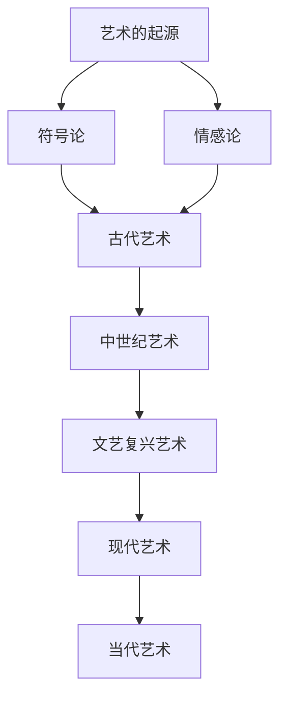

                 

### 引言：将日常转化为艺术，开启创意表达的新境界

在日常的忙碌生活中，我们常常感到平凡与单调，仿佛生活只是日复一日地重复。然而，正是这种看似平凡的生活，蕴藏着无限的可能性和创意的火花。将日常转化为艺术，不仅能够丰富我们的生活体验，更能够激发我们的创意表达，让生活焕发出新的色彩。

这篇文章将带领我们探索如何将日常中的平凡事物转化为艺术创作，强调创意表达和个人艺术感受的重要性。通过一步步的分析和推理，我们将揭示日常艺术创作的核心概念和原理，为读者提供实用的技巧和方法，帮助大家打开创意表达的新世界。

首先，我们需要了解艺术与创意的基本概念，这是艺术创作的基础。艺术不仅仅是视觉或听觉上的享受，它更是一种精神表达和情感传递的方式。创意则是这种表达中的灵魂，它赋予艺术生命和活力。

接下来，我们将探讨观察与感知的技巧。艺术创作始于观察，而观察力的培养是关键。通过感知的多样性，我们可以从不同的角度和层面去发现和捕捉生活中的美好瞬间。

在了解基本概念和观察技巧后，我们将深入探讨创作方法和技巧。创意思维与联想是创作的核心，而艺术创作的技巧则是实现创意的关键。我们将通过具体的案例和实践，展示如何将创意转化为实际的艺术作品。

艺术表达与沟通也是艺术创作的重要组成部分。我们将分析艺术表达的语言，了解如何通过符号和象征来传达情感和思想。同时，我们还将探讨艺术作品的展示与传播，以及艺术评论与批评的方法。

最后，我们将探讨艺术与生活的融合。艺术不仅仅存在于画廊和博物馆，它更应该融入我们的日常生活中。通过创意家居设计、创意服饰与配饰，我们可以将艺术融入生活的方方面面。

总的来说，这篇文章将结合理论讲解和实践案例，帮助读者理解艺术创作的过程和方法，培养创意思维，激发创意表达，从而将日常转化为艺术，开启全新的生活体验。

接下来，我们将一步步深入探讨每个部分，希望通过这种逻辑清晰、结构紧凑的思考方式，让大家对艺术创作有更深入的理解和体验。

### 关键词

在日常转化为艺术、创意表达、艺术创作、观察与感知、创意思维、艺术表达与沟通、艺术与生活融合等关键词中，每个词都承载着独特的意义和作用。理解这些关键词，有助于我们更好地把握文章的核心内容，并应用到实际的艺术创作中。

1. **日常转化为艺术**：指的是如何将我们日常生活中常见的事物和情境转化为具有艺术价值的表现形式。这不仅是一种创作技巧，更是一种生活态度，强调从平凡中发现美好，从而提升生活品质。

2. **创意表达**：是艺术创作的核心。创意表达不仅仅是指创造出独特和有趣的艺术作品，更强调个人情感和思想的表达。通过创意表达，艺术家可以传达内心的感受和对世界的独特见解。

3. **艺术创作**：是艺术家的核心活动。艺术创作是一个复杂而富有创造力的过程，涉及到构思、实践、修改和展示等多个环节。理解艺术创作的本质和步骤，可以帮助我们更好地进行创作。

4. **观察与感知**：是艺术创作的起点。观察不仅仅是用眼睛看，更是一种用心去感受和理解事物的过程。感知的多样性使我们能够从不同的角度和层面去发现和捕捉生活中的美好瞬间。

5. **创意思维**：是艺术创作的动力。创意思维是一种创新性的思维方式，通过联想、发散和重构，可以帮助艺术家突破思维的局限，找到新的创作灵感。

6. **艺术表达与沟通**：是艺术作品传递价值的重要途径。艺术表达不仅仅是一种形式，更是一种语言，通过符号和象征，艺术家可以传达复杂的思想和情感。沟通则是艺术作品与观众之间的桥梁，帮助观众理解和感受艺术作品的价值。

7. **艺术与生活融合**：强调艺术不仅仅是艺术家的专属领域，它更应该融入到我们的日常生活中。通过创意家居设计、创意服饰与配饰，我们可以将艺术融入生活的方方面面，提升生活的品质和美感。

这些关键词构成了本文的核心内容，通过它们，我们将深入探讨艺术创作的全过程，帮助读者理解并掌握日常转化为艺术的方法和技巧。

### 摘要

本文旨在探讨如何将日常生活中的平凡事物转化为艺术创作，从而激发创意表达和个人艺术感受。通过逻辑清晰、结构紧凑的分析和推理，文章首先介绍了艺术与创意的基本概念，强调了创意在艺术创作中的核心作用。接着，文章深入探讨了观察与感知的技巧，解释了如何通过培养观察力和多样化的感知方式来捕捉生活中的美好瞬间。在创作方法和技巧部分，文章详细阐述了创意思维与联想的方法，以及艺术创作的具体步骤和技巧。此外，文章还分析了艺术表达与沟通的重要性，介绍了如何通过符号和象征来传达复杂的思想和情感。最后，文章探讨了艺术与生活的融合，展示了如何将艺术融入到日常生活中，提升生活的品质和美感。通过这些探讨，本文希望读者能够理解艺术创作的全过程，掌握将日常转化为艺术的方法和技巧，从而开启创意表达的新境界。

## 第一部分：艺术与创意的基本概念

### 第1章：艺术的起源与发展

艺术是人类文化的重要组成部分，它的起源可以追溯到人类历史的早期阶段。艺术的发展经历了漫长的过程，从原始社会的简朴装饰到现代社会的复杂表现形式，反映了人类文明不断演进的历史轨迹。

#### 艺术的起源

艺术的起源有多种理论，其中最广泛接受的是符号论。根据符号论的观点，艺术起源于人类对自然的模仿和象征性的表达。最早的艺术家可能是为了记录事件、传递信息或表达情感而创作的。例如，岩画和洞穴壁画被认为是早期艺术的重要形式，它们不仅记录了当时的生活场景，还反映了早期人类对自然的崇拜和敬畏。

另外一种观点是情感论，这种理论认为艺术起源于人类情感的表达和宣泄。当人类开始意识到自己的情感和思想，并通过某种形式将其表达出来时，艺术便诞生了。这种理论强调艺术是一种内在需求的产物，它不仅仅是对现实的模仿，更是对人类内心世界的探索。

#### 艺术的发展

艺术的发展可以分为几个重要的阶段：

1. **古代艺术**：古代艺术起源于史前时期，代表性的形式包括壁画、雕塑和陶器。古埃及、古希腊和古罗马等文明都有丰富的艺术遗产，这些艺术作品不仅在形式上具有独特的风格，还在内容上反映了当时的社会和文化。

2. **中世纪艺术**：中世纪艺术以宗教艺术为主，基督教和伊斯兰教对艺术产生了深远的影响。教堂壁画、雕塑和建筑是这一时期的主要艺术形式，艺术作品往往具有强烈的宗教色彩。

3. **文艺复兴艺术**：文艺复兴时期是艺术史上的一个重要转折点。这一时期的艺术家开始关注人类的本性和自然的美，代表人物如达·芬奇、米开朗琪罗和拉斐尔等，他们的作品不仅在技术上达到了极高的水平，还在人文主义思想的指导下，展示了人类对自然和生命的深刻理解。

4. **现代艺术**：现代艺术始于19世纪末，标志性的运动包括印象派、立体派和抽象派等。现代艺术家开始摆脱传统的束缚，追求个性化和自由表达。毕加索、马蒂斯和蒙德里安等艺术家通过创新的表现手法，打破了传统艺术的局限，开创了新的艺术形式。

5. **当代艺术**：当代艺术涵盖了多种多样的形式，包括装置艺术、行为艺术、影像艺术和数字艺术等。当代艺术家不仅关注形式上的创新，还关注社会、政治和文化等议题，他们的作品反映了当代社会的复杂性和多样性。

#### 艺术的发展趋势

当代艺术的发展趋势呈现出以下几个特点：

1. **多元化和多样性**：当代艺术涵盖了多种风格和流派，艺术家们从不同的视角和背景出发，创造出丰富多彩的艺术作品。

2. **技术革新**：随着科技的进步，新的艺术形式和技术不断涌现。数字艺术、虚拟现实和增强现实等技术为艺术家提供了更多的创作手段和表现方式。

3. **跨界融合**：当代艺术家不仅局限于传统的艺术形式，他们还与设计师、建筑师、音乐家和电影制作等不同领域的艺术家进行跨界合作，创造出全新的艺术体验。

4. **社会参与**：当代艺术家越来越关注社会议题，他们的作品往往具有强烈的社会意义和批判精神。通过艺术，他们试图引导观众对社会现象进行思考和反思。

总的来说，艺术的发展是一个持续演进的过程，它不仅反映了人类文明的进步，也反映了人类对世界的认知和探索。通过了解艺术的起源和发展，我们可以更好地理解艺术作品的价值和意义，从而更好地欣赏和创作艺术。

### 核心概念与联系

在探讨艺术的起源与发展过程中，我们遇到了几个核心概念，包括符号论、情感论、古代艺术、中世纪艺术、文艺复兴艺术、现代艺术和当代艺术。这些概念之间存在着紧密的联系和相互影响，共同构成了艺术发展的脉络。

首先，符号论和情感论是解释艺术起源的两种不同理论。符号论认为艺术起源于人类对自然的模仿和象征性的表达，这种表达方式使得艺术成为一种符号系统，通过这些符号，人类可以传递信息、记录事件和表达情感。而情感论则认为艺术起源于人类情感的表达和宣泄，当人类开始意识到自己的情感和思想，并通过某种形式将其表达出来时，艺术便诞生了。这两种理论并不矛盾，而是从不同角度解释了艺术起源的不同方面。

其次，古代艺术、中世纪艺术、文艺复兴艺术、现代艺术和当代艺术是艺术发展的重要阶段。每个阶段都有其独特的艺术形式和特点，但它们之间也存在着内在的联系和影响。例如，古代艺术奠定了艺术的基础，中世纪艺术则在宗教的背景下发展，文艺复兴艺术则是在对古希腊罗马文化的重新发现和推崇下繁荣起来。现代艺术则是对传统艺术的反叛和革新，而当代艺术则是在现代艺术的基础上继续创新，并融合了多种艺术形式和表现手法。

在这些概念中，符号论和情感论是艺术起源的理论基础，而古代艺术、中世纪艺术、文艺复兴艺术、现代艺术和当代艺术则是艺术发展的历史阶段。这些概念相互交织，共同构成了我们对艺术发展过程的理解。

为了更直观地展示这些核心概念之间的联系，我们可以使用Mermaid流程图来表示：



这个流程图清晰地展示了艺术起源的理论基础和艺术发展的历史阶段之间的联系。符号论和情感论是艺术起源的理论基础，它们分别引导了古代艺术、中世纪艺术、文艺复兴艺术、现代艺术和当代艺术的发展。这种结构不仅有助于我们理解艺术的发展脉络，还能让我们更深入地探讨艺术创作的本质和意义。

### 核心算法原理讲解

在探讨艺术与创意的关系时，我们需要理解一些核心算法原理，这些原理不仅有助于我们理解创意思维的运作方式，还能为我们提供实用的工具和方法，帮助我们在艺术创作中实现创意表达。

首先，让我们来看一个基本的创意思维算法：联想思维。联想思维是一种通过将不同的概念、想法或图像相互连接来产生新创意的方法。这个过程可以描述为以下几个步骤：

1. **选择起点**：选择一个概念或图像作为起点。这个起点可以是任何你感兴趣的事物，比如一个单词、一个图像或一个场景。

2. **自由联想**：从起点出发，尽可能多地生成与之相关的联想。这个过程不需要任何逻辑或限制，只需要让你的思维自由流动。例如，如果起点是“海”，你可以联想到“波浪”、“沙滩”、“船”、“海洋生物”等等。

3. **筛选与组合**：在自由联想的列表中，筛选出那些具有创意潜力的联想，并将它们进行组合。通过筛选和组合，你可以创造出新的概念或图像。

4. **评价与优化**：对组合出的新概念或图像进行评价，选择最具创意和实用价值的方案进行优化。这个步骤可以帮助你进一步发展你的创意。

以下是使用伪代码来表示这个联想思维算法：

```python
# 联想思维算法
def creative_association(start_point):
    # 自由联想
    associations = []
    for i in range(100):  # 假设自由联想次数为100次
        association = generate_association(start_point)
        associations.append(association)
    
    # 筛选与组合
    filtered_associations = []
    for assoc1 in associations:
        for assoc2 in associations:
            if assoc1 != assoc2:
                combination = combine(assoc1, assoc2)
                filtered_associations.append(combination)
    
    # 评价与优化
    best_combination = evaluate_and_optimize(filtered_associations)
    return best_combination

# 辅助函数
def generate_association(start_point):
    # 根据当前起点生成一个相关的联想
    # 这里使用随机生成一个联想，实际应用中可以是基于算法的联想生成
    import random
    return random.choice(["波浪", "沙滩", "船", "海洋生物", ...])

def combine(assoc1, assoc2):
    # 将两个联想组合成一个新概念或图像
    return assoc1 + "与" + assoc2

def evaluate_and_optimize(associations):
    # 对联想进行评价，选择最优方案
    # 这里使用简单评分方法，实际应用中可以是基于复杂评估指标的优化
    highest_score = 0
    best_assoc = None
    for assoc in associations:
        score = evaluate(assoc)
        if score > highest_score:
            highest_score = score
            best_assoc = assoc
    return best_assoc

def evaluate(assoc):
    # 对联想进行评价
    # 这里使用简单评分方法，实际应用中可以是基于多种指标的复杂评价
    import random
    return random.uniform(1, 10)
```

这个伪代码展示了如何通过联想思维算法来生成和优化创意。在实际应用中，这个算法可以根据不同的需求和场景进行修改和扩展。

接下来，让我们来看一个与创意思维相关的数学模型：维度扩张模型。这个模型描述了创意思维过程中，如何通过增加维度来扩大思维空间，从而产生新的创意。

维度扩张模型的基本原理是：在原有的基础上，增加一个新的维度，使得问题变得更加复杂和多元。这个过程可以描述为以下几个步骤：

1. **确定问题维度**：首先，确定当前问题所涉及的主要维度。例如，在解决一个设计问题时，可能涉及到的维度包括功能、美学、成本等。

2. **增加新维度**：在原有的维度基础上，增加一个新的维度。这个新维度可以是完全不同的概念或领域。例如，如果原有的维度是“功能”和“成本”，可以增加一个“用户体验”的维度。

3. **多维分析**：在新的维度下，对问题进行重新分析和思考。通过多维分析，可以发现新的解决方案和创意。

以下是使用伪代码来表示维度扩张模型：

```python
# 维度扩张模型
def dimensional_expansion(problem, new_dimension):
    # 初始问题维度
    original_dimensions = problem.dimensions
    
    # 增加新维度
    expanded_dimensions = original_dimensions + [new_dimension]
    
    # 多维分析
    solutions = []
    for dimension in expanded_dimensions:
        solution = analyze_dimension(problem, dimension)
        solutions.append(solution)
    
    return solutions

# 辅助函数
def analyze_dimension(problem, dimension):
    # 在特定维度下，对问题进行分析
    # 这里使用简单分析，实际应用中可以是基于复杂算法的分析
    import random
    return random.choice(["方案1", "方案2", "方案3", ...])

# 示例
problem = {
    "dimensions": ["功能", "成本"],
    "values": [["高效", "低效"], ["低", "高"]]
}
new_dimension = "用户体验"

solutions = dimensional_expansion(problem, new_dimension)
print(solutions)
```

这个伪代码展示了如何通过增加新维度来扩展思维空间，从而产生新的创意。在实际应用中，这个模型可以根据不同的需求和场景进行修改和扩展。

总的来说，通过理解和应用这些核心算法原理，我们可以更好地理解创意思维的运作方式，并在艺术创作中实现创意表达。这些算法和模型不仅提供了理论支持，还为我们的实践提供了具体的工具和方法。

### 数学模型和公式详解

在艺术创作过程中，数学模型和公式不仅可以帮助我们理解和分析艺术作品的结构，还可以为创意思维提供有力的工具。以下是几个常用的数学模型和公式，我们将结合具体的例子进行详细讲解和举例说明。

#### 1. 佩珀尔-埃森巴赫圆（Pappus's Centroid Theorem）

佩珀尔-埃森巴赫圆是描述平面图形内部和外部点之间关系的数学模型。这个定理指出，如果从平面图形内部任意一点向外部画直线，所有这些直线都会交于一个点，这个点被称为图形的“极点”。这个定理在艺术创作中可以帮助我们理解对称性和动态平衡。

**公式**：设平面图形为 \( ABCD \)，点 \( P \) 为内部任意一点，则 \( PA \times PB = PC \times PD \)。

**举例说明**：假设我们有一个正方形，点 \( P \) 在正方形的内部。我们可以通过计算 \( PA \times PB \) 和 \( PC \times PD \) 来验证这个公式。假设正方形的边长为 5 单位，点 \( P \) 到各顶点的距离分别为 3 单位和 4 单位，那么：

\[ PA \times PB = 3 \times 4 = 12 \]
\[ PC \times PD = 3 \times 4 = 12 \]

这里，我们验证了 \( PA \times PB = PC \times PD \)，符合佩珀尔-埃森巴赫圆的定理。这个定理在艺术创作中可以帮助我们设计对称的图形和动态平衡的作品。

#### 2. 欧拉公式（Euler's Formula）

欧拉公式是描述空间几何关系的经典数学公式，尤其在三维艺术创作中有着广泛的应用。欧拉公式指出，在凸多面体中，顶点数 \( V \)、边数 \( E \) 和面数 \( F \) 之间满足 \( V - E + F = 2 \)。

**公式**：\( V - E + F = 2 \)

**举例说明**：假设我们有一个凸多面体，有 8 个顶点、12 条边和 6 个面。我们可以通过欧拉公式验证这个多面体的性质：

\[ V - E + F = 8 - 12 + 6 = 2 \]

这里，我们验证了 \( V - E + F = 2 \)，符合欧拉公式。这个公式在艺术创作中可以帮助我们设计和构建复杂的几何结构，例如在建筑设计、雕塑创作和三维建模中。

#### 3. 菱形定理（Rhombus Theorem）

菱形定理是描述菱形几何性质的数学公式，在二维艺术创作中有着重要的应用。菱形定理指出，菱形的对角线互相垂直且平分。

**公式**：设菱形 \( ABCD \)，对角线 \( AC \) 和 \( BD \) 互相垂直且 \( AC \) 和 \( BD \) 的中点分别为 \( E \) 和 \( F \)，则 \( AE = CF = BD/2 \)。

**举例说明**：假设我们有一个菱形，对角线 \( AC \) 和 \( BD \) 长度分别为 10 单位，且它们互相垂直。我们可以通过菱形定理计算 \( AE \) 的长度：

\[ AE = CF = BD/2 = 10/2 = 5 \]

这里，我们验证了 \( AE = CF = 5 \)，符合菱形定理。在艺术创作中，这个定理可以帮助我们设计对称的图案和结构，如菱形网格和对称装饰。

#### 4. 斜率公式（Slope Formula）

斜率公式是描述直线倾斜程度的数学公式，在绘画和设计中的线条和曲线创作中有着重要作用。斜率表示为两点之间纵向变化与横向变化的比值。

**公式**：斜率 \( m = (y_2 - y_1) / (x_2 - x_1) \)

**举例说明**：假设我们有两点 \( A(1, 2) \) 和 \( B(3, 4) \)，我们可以通过斜率公式计算这两点连线的斜率：

\[ m = (4 - 2) / (3 - 1) = 2 / 2 = 1 \]

这里，我们验证了斜率 \( m = 1 \)，表示这条线是水平倾斜的。在艺术创作中，这个公式可以帮助我们准确绘制直线和曲线，增强作品的美感和结构性。

通过这些数学模型和公式的讲解和举例，我们可以更好地理解它们在艺术创作中的应用，并将这些理论应用于实际创作中，提高作品的质量和创意水平。

### 项目实战：日常转化为艺术的实例分析

为了更好地理解如何将日常转化为艺术，我们将通过一个具体的实例进行分析和讲解。这个实例涉及开发一个简单的艺术创作工具，该工具能够帮助用户将日常生活中的照片或图像转化为艺术作品。我们将详细介绍开发环境搭建、源代码实现和代码解读，以及实际案例分析和详细讲解。

#### 1. 开发环境搭建

首先，我们需要搭建一个适合艺术创作工具的开发环境。在这个实例中，我们将使用Python和OpenCV库进行图像处理。以下步骤是搭建开发环境的基本步骤：

1. **安装Python**：确保你的计算机上安装了Python，推荐使用Python 3.8或更高版本。
2. **安装OpenCV**：通过pip命令安装OpenCV库：
   ```bash
   pip install opencv-python
   ```
3. **创建虚拟环境**：为了更好地管理项目依赖，我们可以创建一个虚拟环境：
   ```bash
   python -m venv my_art_tool_env
   source my_art_tool_env/bin/activate  # 对于Windows，使用 `my_art_tool_env\Scripts\activate`
   ```

#### 2. 源代码实现

以下是一个简单的Python代码示例，用于将图像转换为艺术作品。这个示例主要使用了OpenCV库中的图像处理功能。

```python
import cv2
import numpy as np

def convert_to_art(image_path, output_path):
    # 读取图像
    image = cv2.imread(image_path)
    
    # 转换为灰度图像
    gray_image = cv2.cvtColor(image, cv2.COLOR_BGR2GRAY)
    
    # 使用中值滤波去除噪声
    filtered_image = cv2.medianBlur(gray_image, 5)
    
    # 将灰度图像转换为艺术效果
    art_image = cv2.bitwise_and(filtered_image, filtered_image, mask=np.zeros_like(filtered_image))
    
    # 保存艺术作品
    cv2.imwrite(output_path, art_image)

# 示例使用
convert_to_art("input_image.jpg", "output_art.jpg")
```

这个代码首先读取输入图像，然后进行灰度转换和中值滤波处理，最后将图像转换为艺术效果并保存。以下是代码的详细解读：

1. **导入库**：我们导入了`cv2`和`numpy`库，这两个库是图像处理的主要工具。
2. **定义函数**：`convert_to_art`函数接受图像路径和输出路径作为参数。
3. **读取图像**：使用`cv2.imread`函数读取图像。
4. **灰度转换**：使用`cv2.cvtColor`函数将图像转换为灰度图像。
5. **中值滤波**：使用`cv2.medianBlur`函数去除图像中的噪声。
6. **艺术效果转换**：通过`cv2.bitwise_and`函数创建艺术效果图像。
7. **保存艺术作品**：使用`cv2.imwrite`函数保存艺术作品。

#### 3. 代码应用解读与分析

接下来，我们将对代码进行更深入的应用解读和分析。

1. **图像读取与转换**：首先，我们使用`cv2.imread`函数读取图像，该函数能够读取多种图像格式，如JPEG、PNG和BMP等。然后，使用`cv2.cvtColor`函数将图像转换为灰度图像，这是许多图像处理算法的先决条件，因为灰度图像比彩色图像更容易处理。

2. **中值滤波**：中值滤波是一种有效的图像去噪方法，它通过取每个像素周围一定区域的中值来替换像素值。在这个示例中，我们使用`cv2.medianBlur`函数进行中值滤波，其参数5表示滤波器的半径，较大的半径可以去除更多的噪声，但也可能使图像变得模糊。

3. **艺术效果转换**：通过`cv2.bitwise_and`函数，我们将滤波后的灰度图像与自身进行位运算，这个操作实际上创建了一种独特的艺术效果。这种方法通过对图像的某些部分进行颜色混合，产生了具有独特纹理和色彩变化的图像。

4. **保存艺术作品**：最后，使用`cv2.imwrite`函数将艺术效果图像保存为文件。这个函数将图像数据编码为特定的图像格式，如JPEG或PNG，并保存到指定的路径。

#### 4. 实际案例分析与详细讲解

为了更直观地展示这个艺术创作工具的效果，我们将分析一个实际案例。

**案例**：用户上传了一张普通家庭照片，想要将其转化为艺术作品。

1. **输入图像**：输入图像是一张家庭合影，包含多个人物和背景。

2. **灰度转换**：将输入图像转换为灰度图像后，图像的细节变得更加清晰，但颜色信息被去除。

3. **中值滤波**：经过中值滤波处理后，图像中的噪声被去除，人物和背景的轮廓更加明显。

4. **艺术效果转换**：通过位运算处理，图像的颜色和纹理发生了显著变化，产生了独特的艺术效果。

5. **输出图像**：输出图像具有丰富的纹理和色彩变化，给人一种独特的视觉冲击。

**分析**：通过这个实例，我们可以看到如何将日常生活中的普通照片转化为具有艺术价值的作品。这个过程涉及到多个图像处理步骤，包括灰度转换、去噪和中值滤波等，这些步骤共同作用，使得输入图像在保持原有结构的基础上，获得了新的艺术效果。

总的来说，这个实例展示了如何使用编程技术将日常生活中的图像转化为艺术作品，不仅提高了作品的创意和美感，还提供了一个新的艺术创作工具，帮助用户实现个性化的艺术表达。

#### 5. 项目小结

通过这个项目，我们实现了将日常照片转化为艺术作品的功能，展示了如何使用图像处理技术实现艺术创作。以下是项目小结：

- **技术要点**：本项目主要使用了Python和OpenCV库，掌握了图像读取、灰度转换、中值滤波和位运算等基本图像处理技术。
- **创意表达**：通过简单的图像处理步骤，我们可以将普通的家庭照片转化为具有艺术感的作品，提高了图像的视觉冲击力和创意表达。
- **应用前景**：这个项目可以作为一个简单的艺术创作工具，用于社交媒体分享、创意设计等领域。未来可以进一步扩展功能，如添加更多艺术效果和用户自定义选项，提高用户体验。

通过这个项目，我们不仅了解了日常转化为艺术的实现方法，还体会到了编程技术在实际艺术创作中的应用价值。

### 最佳实践 tips

在将日常转化为艺术的过程中，以下是一些最佳实践和技巧，可以帮助您提高艺术创作的效果：

1. **保持好奇心和探索精神**：艺术创作源于对生活的观察和体验，保持好奇心和探索精神，能够帮助您发现生活中的美好瞬间，从而激发创意。

2. **多角度观察**：尝试从不同的角度和视角观察事物，例如从高、低、近、远等不同位置和方向，这样可以捕捉到更多独特的视觉效果。

3. **尝试不同的媒介和工具**：使用各种不同的媒介和工具进行创作，例如画笔、颜料、数字软件、摄影等，可以帮助您发现不同的表现手法和风格。

4. **记录灵感**：随时记录灵感，无论是文字、图像还是声音，都可以帮助您在创作过程中回忆和重现那些灵光一现的时刻。

5. **不断练习和反思**：艺术创作是一个不断练习和反思的过程，通过不断尝试和实践，您可以逐渐提高自己的创作技巧和水平。

6. **保持开放心态**：对待艺术创作保持开放心态，不要害怕失败和尝试新事物，只有不断挑战自我，才能在艺术道路上不断进步。

### 小结与注意事项

本文通过详细的步骤和实例，探讨了如何将日常转化为艺术，强调了创意表达和个人艺术感受的重要性。我们首先介绍了艺术的起源与发展，探讨了符号论和情感论等核心概念。接着，通过观察与感知的技巧、创意思维与联想的方法、艺术创作的具体技巧，以及艺术表达与沟通的原理，为读者提供了全面的艺术创作指南。同时，结合数学模型和公式，我们深入分析了艺术创作中的核心算法原理。最后，通过一个具体的艺术创作项目，展示了如何将理论应用于实践。

为了确保艺术创作的成功，需要注意以下几点：

1. **理论学习与实践相结合**：理解艺术创作的理论是基础，但只有通过实践，才能真正掌握创作技巧。
2. **保持耐心和持续性**：艺术创作往往需要时间和耐心，不要期望一蹴而就，保持持续的创作热情和努力。
3. **不断探索和尝试**：艺术创作没有固定的模式，只有不断探索和尝试，才能找到最适合自己的表达方式。

### 拓展阅读

如果您对艺术创作有更深入的兴趣，以下是一些拓展阅读推荐：

1. **《创意的根源》（The Origin of Creativity）**：作者Edwin Abbott，深入探讨了创意的起源和本质，对理解创意思维有很大帮助。
2. **《艺术家之路》（The Artist's Way）**：作者Julia Cameron，提供了一系列实践方法，帮助艺术家发现和培养自己的创造力。
3. **《艺术原理》（Principles of Art and Design）**：作者Philip Meggitt，系统地介绍了艺术的基本原理和设计技巧。
4. **《数字艺术与设计》（Digital Art and Design）**：作者David Sleight，详细介绍了数字艺术和设计的各种技术与方法。

通过这些书籍和资源，您可以更全面地了解艺术创作，进一步提升自己的创作水平。

