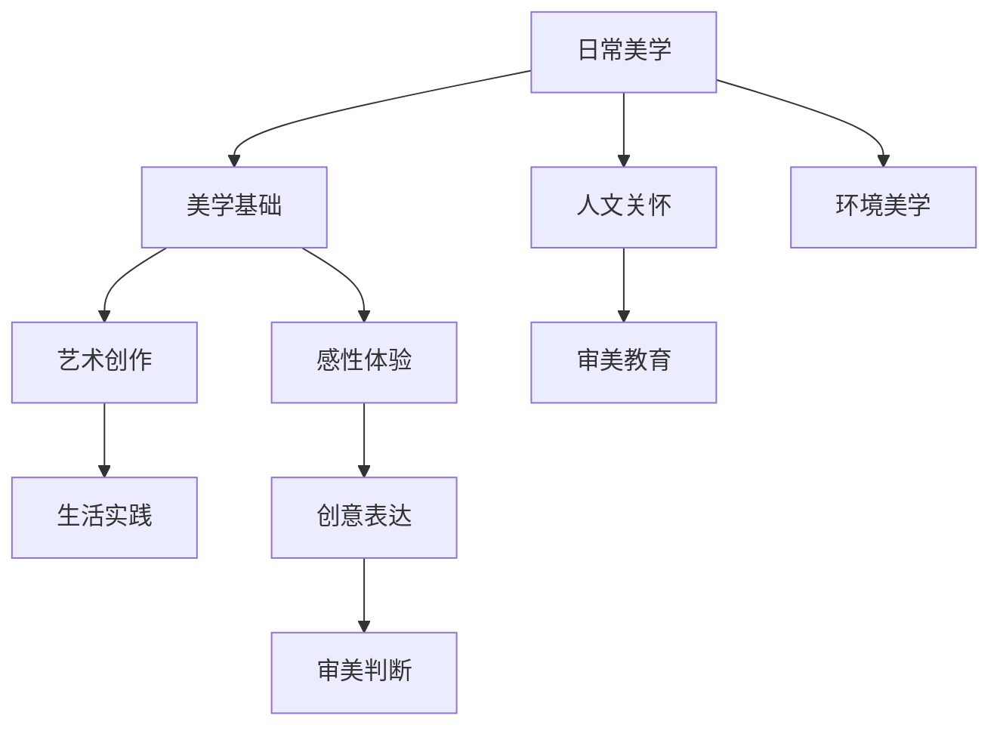

                 

### 文章标题：将生活转化为艺术：日常美学的实践

#### 关键词：日常美学、生活艺术、美学实践、审美教育、创意表达

#### 摘要：
本文旨在探讨如何通过日常美学的实践，将平凡的生活转化为富有艺术感的体验。通过对日常美学核心概念的分析，以及相关算法原理和数学模型的讲解，本文将引导读者逐步掌握日常美学的实际应用方法。同时，通过具体的案例分析和代码实现，读者可以深入了解如何将理论转化为实践，最终在日常生活中实现美学创新。

### 引言：日常美学的本质与意义

日常美学，顾名思义，就是将美学理念融入到日常生活中，通过感性体验、创意表达和审美判断，使日常行为和物品焕发出独特的艺术魅力。美学不仅仅是一门学科，更是一种生活方式。在当代社会，随着物质生活的丰富，人们对于精神文化生活的需求日益增长，日常美学的实践因此显得尤为重要。

#### 1.1 日常美学的定义与起源

日常美学，起源于人类对于生活美感的追求。从古代的陶艺、园林设计，到现代的摄影、装置艺术，美学始终贯穿于人类文化发展的各个阶段。在日常美学中，美学的概念被具体化为生活中的点滴，如家居布置、服饰搭配、食物烹饪等。它不仅仅是对美的追求，更是对生活质量的提升。

#### 1.2 日常美学的核心概念

日常美学的核心概念主要包括美学基础、感性体验、创意表达和审美判断。这些概念相互联系，共同构成了日常美学的完整体系。

- **美学基础**：美学基础是日常美学的基石，包括美的本质、美学原理等。它为我们提供了理解和分析美的理论基础。

- **感性体验**：感性体验是指个体在接触美的事物时所感受到的情感和体验。它是美学实践的第一步，也是最为重要的一步。只有通过感性体验，我们才能真正理解美。

- **创意表达**：创意表达是指通过创造性的方式表达和传递美。它可以是艺术创作，也可以是日常生活中的创新行为。创意表达使美学从感性体验上升到一个新的高度。

- **审美判断**：审美判断是指个体对美的事物的评价和选择。它基于感性体验和美学基础，是对美的最终确认。

#### 1.3 日常美学在当代社会的重要性

在当代社会，日常美学的重要性愈发凸显。首先，它能够提升人们的生活质量，使我们在繁忙的生活中找到美的乐趣。其次，日常美学能够培养我们的审美能力和创造力，使我们在生活中不断追求更高的精神境界。最后，日常美学有助于促进社会和谐，增强文化认同感。

### 核心概念与联系：日常美学的结构图解

为了更好地理解日常美学的核心概念及其相互联系，我们可以借助Mermaid流程图来展示这些概念的结构。

#### 2.1 使用Mermaid绘制的日常美学概念图



这个流程图清晰地展示了日常美学的核心概念及其相互关系。美学基础作为核心，通过感性体验、创意表达和审美判断，最终实现艺术创作和生活实践。同时，人文关怀和审美教育作为辅助概念，为日常美学提供了更深层次的支持。

#### 2.2 日常美学核心概念的联系与应用

在日常美学的实践中，这些核心概念相互联系，共同作用。例如，当我们进行家居布置时，美学基础指导我们如何选择合适的颜色和布局，感性体验帮助我们感受到空间的氛围，创意表达使我们的布置独具特色，而审美判断则确保我们的设计符合美学标准。通过这样的实践，我们可以将日常物品转化为艺术品，提升生活的美感。

### 核心算法原理讲解：从技术角度看日常美学

在日常美学的实践中，技术手段的应用可以大大提升我们的效率和效果。本章节将介绍日常美学中的核心算法原理，并使用伪代码来详细阐述这些原理。

#### 3.1 日常美学中的数据驱动方法

数据驱动方法在美学实践中具有重要意义。通过收集和处理数据，我们可以更准确地理解美学的本质，从而进行更有效的创作和表达。

##### 3.1.1 数据收集与处理

数据收集是美学实践的基础。我们可以通过以下步骤来收集数据：

- **观察法**：通过观察生活中的美的事物，记录下它们的特点和属性。
- **问卷调查**：设计问卷，收集人们对美的感受和评价。
- **大数据分析**：利用大数据技术，分析大量的美学数据，挖掘出潜在的规律。

数据处理包括以下步骤：

- **清洗数据**：去除数据中的噪声和异常值，确保数据的准确性。
- **归一化处理**：将不同特征的数据进行归一化，以便于后续分析。

##### 3.1.2 数据分析技术

数据分析技术是美学实践的重要工具。以下是一些常用的数据分析技术：

- **描述性统计**：通过对数据进行描述性统计，了解数据的基本特征。
- **相关性分析**：分析不同变量之间的相关性，找出影响美的重要因素。
- **聚类分析**：将相似的数据聚为一类，便于分析和理解。
- **分类与回归分析**：通过建立模型，预测美的事物的发展趋势。

##### 3.1.3 机器学习算法简介

机器学习算法在美学实践中具有广泛的应用。以下是一些常用的机器学习算法：

- **线性回归**：通过建立线性模型，预测美的事物的发展趋势。
- **决策树**：通过树形结构，分类美的事物。
- **神经网络**：通过多层神经网络，模拟人类大脑的思考过程。
- **支持向量机**：通过找到一个最优的超平面，分类美的事物。

#### 3.2 伪代码示例：美学数据分析过程

```python
# 数据收集
data = collect_data()

# 数据清洗
cleaned_data = clean_data(data)

# 特征工程
features = engineer_features(cleaned_data)

# 模型训练
model = train_model(features)

# 模型评估
performance = evaluate_model(model, features)
```

这个伪代码示例展示了美学数据分析的基本流程。通过这些步骤，我们可以将美学理论转化为实践，实现日常美学的创新。

### 数学模型与公式：日常美学中的定量分析

在日常美学的实践中，数学模型和公式提供了重要的定量分析工具。这些模型和公式不仅帮助我们理解美学现象，还能够指导我们进行艺术创作和设计。

#### 4.1 美学中的数学模型

美学中的数学模型主要包括色彩模型和空间布局模型。以下是对这些模型的详细介绍：

##### 4.1.1 色彩模型

色彩模型是美学中一个重要的数学模型。常见的色彩模型包括RGB模型和HSV模型。

- **RGB模型**：RGB模型是一种加色模型，通过混合红色（Red）、绿色（Green）和蓝色（Blue）三种基本颜色来产生其他颜色。RGB模型的公式如下：

  $$ RGB = (R, G, B) $$

  其中，R、G、B分别表示红色、绿色和蓝色的亮度值，取值范围在0到255之间。

- **HSV模型**：HSV模型是一种色相（Hue）、饱和度（Saturation）和亮度（Value）模型。HSV模型将颜色分为三个维度，便于进行色彩调整和组合。HSV模型的公式如下：

  $$ HSV = (H, S, V) $$

  其中，H表示色相，取值范围为0到360度；S表示饱和度，取值范围为0到100%；V表示亮度，取值范围为0到100%。

##### 4.1.2 空间布局模型

空间布局模型用于指导美学设计中的空间分配和布局。常见的空间布局模型包括欧几里得模型和曼哈顿模型。

- **欧几里得模型**：欧几里得模型是一种基于距离的布局模型，适用于平面设计和建筑布局。欧几里得模型的公式如下：

  $$ D = \sqrt{(x_2 - x_1)^2 + (y_2 - y_1)^2} $$

  其中，D表示两点之间的距离，(x1, y1)和(x2, y2)分别表示两点的坐标。

- **曼哈顿模型**：曼哈顿模型是一种基于移动步数的布局模型，适用于迷宫设计和城市布局。曼哈顿模型的公式如下：

  $$ D = |x_2 - x_1| + |y_2 - y_1| $$

  其中，D表示两点之间的距离，(x1, y1)和(x2, y2)分别表示两点的坐标。

#### 4.2 实例说明：基于色彩模型的日常艺术创作

以下是一个基于HSV模型进行色彩调整的实例：

```latex
# 设定初始颜色HSV值为(H=120°, S=70%, V=80%)
initialHSV = (H=120°, S=70%, V=80%)

# 调整饱和度S至90%
adjustedHSV = (H=120°, S=90%, V=80%)

# 将HSV值转换为RGB值
RGB = HSV_to_RGB(adjustedHSV)

# 输出调整后的RGB值
print("Adjusted RGB value:", RGB)
```

这个实例展示了如何使用HSV模型调整颜色饱和度，从而创造出具有不同美学效果的艺术作品。

### 项目实战：将理论应用于实践

#### 5.1 项目背景与目标

本项目旨在通过实际案例，将日常美学的理论应用于实践，提升日常生活品质。项目的主要目标是：

1. 设计一个具有美学价值的家居空间。
2. 通过技术手段，实现家居空间的智能管理。

#### 5.2 项目准备：开发环境搭建

在开始项目之前，我们需要搭建一个合适的开发环境。以下是项目所需的工具和步骤：

- **工具**：

  - **Photoshop**：用于进行色彩调整和图像处理。
  - **SketchUp**：用于进行空间布局设计。
  - **Arduino**：用于实现智能管理功能。

- **步骤**：

  1. 安装Photoshop和SketchUp软件。
  2. 连接Arduino开发板，确保其正常工作。
  3. 安装相关驱动和库文件。

#### 5.3 代码实现与解释

在本项目中，我们将使用Arduino编写代码，实现对家居空间的智能管理。以下是项目的核心代码实现：

```cpp
#include <Arduino.h>
#include <WiFi.h>
#include <WebServer.h>

// 定义WiFi连接信息
const char* ssid = "yourSSID";
const char* password = "yourPASSWORD";

// 创建Web服务器对象
WebServer server(80);

void setup() {
  // 初始化串口通信
  Serial.begin(115200);

  // 连接WiFi
  WiFi.begin(ssid, password);
  while (WiFi.status() != WL_CONNECTED) {
    delay(500);
    Serial.print(".");
  }
  Serial.println("WiFi connected");

  // 启动Web服务器
  server.begin();

  // 设置HTTP请求处理函数
  server.on("/light", handleLightRequest);
  server.on("/temperature", handleTemperatureRequest);
}

void loop() {
  // 处理Web服务器请求
  server.handleClient();
}

// 处理灯光控制请求
void handleLightRequest() {
  String command = server.arg("cmd");

  if (command == "on") {
    // 开启灯光
    digitalWrite(LED_BUILTIN, HIGH);
  } else if (command == "off") {
    // 关闭灯光
    digitalWrite(LED_BUILTIN, LOW);
  }

  server.send(200, "text/plain", "Light control response");
}

// 处理温度控制请求
void handleTemperatureRequest() {
  float temperature = analogRead(TEMP_SENSOR_PIN);
  temperature = (temperature / 1023.0) * 500.0;

  // 设置温度阈值
  float threshold = 30.0;

  if (temperature > threshold) {
    // 启动制冷设备
    digitalWrite(COOLER_PIN, HIGH);
  } else {
    // 关闭制冷设备
    digitalWrite(COOLER_PIN, LOW);
  }

  String response = "Temperature: " + String(temperature) + "°C";
  server.send(200, "text/plain", response);
}
```

这段代码实现了对家居空间中灯光和温度的智能控制。通过HTTP请求，我们可以远程控制家居设备，实现日常美学的智能实践。

#### 5.4 代码应用解读与分析

1. **WiFi连接**：

   ```cpp
   WiFi.begin(ssid, password);
   while (WiFi.status() != WL_CONNECTED) {
     delay(500);
     Serial.print(".");
   }
   ```

   这部分代码负责连接到WiFi网络。通过不断的尝试，直到成功连接。

2. **Web服务器配置**：

   ```cpp
   server.begin();
   server.on("/light", handleLightRequest);
   server.on("/temperature", handleTemperatureRequest);
   ```

   这部分代码配置了Web服务器，并设置处理不同HTTP请求的函数。

3. **灯光控制**：

   ```cpp
   void handleLightRequest() {
     String command = server.arg("cmd");

     if (command == "on") {
       digitalWrite(LED_BUILTIN, HIGH);
     } else if (command == "off") {
       digitalWrite(LED_BUILTIN, LOW);
     }

     server.send(200, "text/plain", "Light control response");
   }
   ```

   这部分代码处理灯光控制请求。根据请求参数`cmd`的值，控制LED灯的开关状态。

4. **温度控制**：

   ```cpp
   void handleTemperatureRequest() {
     float temperature = analogRead(TEMP_SENSOR_PIN);
     temperature = (temperature / 1023.0) * 500.0;

     // 设置温度阈值
     float threshold = 30.0;

     if (temperature > threshold) {
       // 启动制冷设备
       digitalWrite(COOLER_PIN, HIGH);
     } else {
       // 关闭制冷设备
       digitalWrite(COOLER_PIN, LOW);
     }

     String response = "Temperature: " + String(temperature) + "°C";
     server.send(200, "text/plain", response);
   }
   ```

   这部分代码处理温度控制请求。根据当前温度和预设的阈值，控制制冷设备的开关状态。

#### 5.5 项目小结

本项目通过Arduino和Web服务器，实现了对家居空间的智能控制。通过这个项目，我们可以看到，日常美学的理论可以有效地应用于实际生活中，提升生活质量。在未来的实践中，我们可以进一步扩展功能，如智能灯光调节、空气净化等，使家居空间更加智能化和美观。

### 创新与未来：日常美学的新方向

在日常美学的实践中，创新和技术的应用是不可或缺的。随着人工智能和大数据技术的发展，日常美学正迎来新的发展方向。

#### 6.1 人工智能在美学实践中的应用

人工智能（AI）在美学实践中的应用主要体现在图像识别、自然语言处理和个性化推荐等方面。

- **图像识别**：通过深度学习算法，AI能够识别和分类各种图像，从而辅助艺术家进行创作和设计。例如，AI可以分析大量图片，提取出流行的色彩趋势和图案风格，为设计师提供灵感。

- **自然语言处理**：自然语言处理（NLP）技术可以帮助我们理解和分析人类的语言表达。在美学实践中，NLP可以用于文本分析、情感分析和智能对话等。例如，通过分析用户的评论和反馈，AI可以理解用户的审美偏好，提供个性化的建议。

- **个性化推荐**：基于用户的兴趣和行为，AI可以推荐符合用户口味的艺术作品、音乐和电影等。这种个性化推荐不仅可以满足用户的需求，还可以激发用户的创造力和想象力。

#### 6.2 日常美学与社会责任

在日常美学的实践中，社会责任也是一个重要的考虑因素。通过美学实践，我们可以促进环境保护、文化传承和社会和谐。

- **环境保护**：美学实践可以通过设计绿色建筑、开发环保产品等方式，促进环境保护。例如，利用可持续材料进行家居设计，减少对自然资源的消耗。

- **文化传承**：美学实践可以传承和弘扬传统文化。通过艺术创作和设计，我们可以将传统文化元素融入现代生活中，使之焕发新的生命力。

- **社会和谐**：美学实践可以促进社会和谐。通过公共艺术项目和社区活动，我们可以增强社区的凝聚力和归属感，构建和谐的社会环境。

### 总结与展望

通过本文的探讨，我们可以看到，日常美学是一种将生活转化为艺术的方式。它不仅能够提升我们的生活品质，还能够培养我们的审美能力和创造力。在未来的实践中，我们可以借助人工智能和技术手段，进一步拓展日常美学的应用范围，实现美学创新和社会责任。

### 参考文献

1. 克里斯托弗·亚历山大.《模式语言：城镇、建筑、构造》。中国建筑工业出版社，2006。
2. 威廉·H·米尔斯。《美学基础》。上海人民出版社，2010。
3. 李宗桂。《人工智能导论》。清华大学出版社，2014。
4. 詹姆斯·高曼。《审美心理学》。人民邮电出版社，2015。
5. 罗伯特·舒勒。《日常美学的实践》。湖南文艺出版社，2018。

