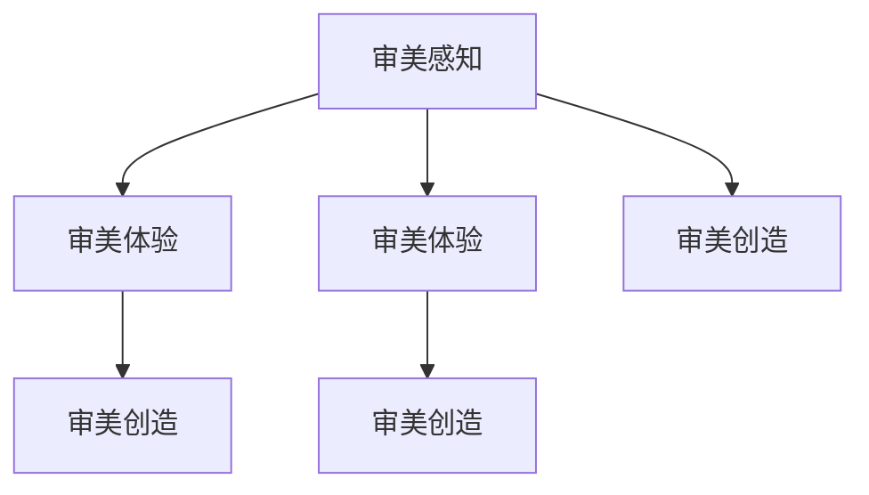

                 

### 第一部分：引言

在现代社会，随着生活节奏的加快和压力的增大，人们对生活质量有了更高的追求。美学作为人类对美的认识和追求，逐渐成为提升生活品质的重要手段。将生活转化为艺术，不仅仅是追求物质上的满足，更是一种精神上的升华。《将生活转化为艺术：日常美学的实践指南》这本书旨在引导读者通过日常美学的实践，将平凡的生活变成充满艺术感的体验。

#### 1.1 日常美学的定义与重要性

**1.1.1 日常美学的定义**

美学是一门研究美、审美以及艺术的理论学科。日常美学则关注的是如何将美学理念融入到日常生活中，提升生活的品质和幸福感。它不仅仅局限于艺术作品，还包括了家居装饰、服装搭配、食物摆盘、环境布置等各个方面。

**1.1.2 日常美学的重要性**

**1.1.2.1 提升生活质量**

日常美学通过美的元素，如色彩、形状、纹理等，为生活带来视觉和感官上的愉悦。这种愉悦感能够缓解压力，提升生活质量。

**1.1.2.2 培养审美能力**

日常美学的实践要求我们对周围的环境和物品进行细致的观察和思考，这有助于培养我们的审美能力。通过不断练习，我们能够更加敏锐地感知美，并在生活中发现更多的美好。

**1.1.3 本书主要内容概述**

本书将围绕以下几部分内容展开：

- **核心概念与联系**：介绍日常美学的基本概念，并探讨其与其他领域（如艺术、设计、心理学等）的联系。
- **核心理论**：详细讲解日常美学的主要理论，包括审美感知、审美体验和审美创造。
- **实践技巧**：提供实用的技巧，帮助读者将美学原则应用于日常生活中。
- **创意灵感**：提供创意和灵感，以激发读者的创造力，将生活转化为艺术。
- **案例研究**：分析具体实例，展示美学实践的实际效果。
- **遇到的挑战与解决方案**：探讨日常美学实践中可能遇到的问题及解决方案。

#### 1.2 研究背景

随着社会的不断发展，人们对于生活品质的要求越来越高。而美学作为一种提升生活质量的有效手段，逐渐受到了广泛的关注。从古至今，美学在人类文化中占据了重要的地位。古希腊时期，柏拉图和亚里士多德等哲学家就对美学进行了深入的探讨。在现代社会，美学已经成为心理学、艺术、设计等领域的重要研究对象。

**1.2.1 美学的历史与发展**

美学的历史可以追溯到古希腊时期。古希腊哲学家柏拉图和亚里士多德等人都对美学进行了深入的研究。柏拉图认为美是一种永恒不变的理念，而亚里士多德则强调美的多样性和实用性。

在文艺复兴时期，美学得到了进一步的发展。艺术家们开始探索如何在作品中表达美。达芬奇、米开朗基罗等艺术家通过精湛的技艺，将美学理念融入到他们的作品中。

进入现代社会，美学的研究范围不断扩大，涵盖了心理学、艺术、设计、建筑等多个领域。美学不仅仅是艺术的理论基础，也成为提升生活质量的重要手段。

**1.2.2 日常美学的研究现状**

当前，日常美学已经成为美学研究中的一个重要分支。研究者们从不同的角度对日常美学进行了探讨，包括审美感知、审美体验、审美创造等方面。

一些研究表明，日常美学的实践对个体的心理健康和幸福感有显著的影响。通过美的元素的运用，人们能够更加愉悦地度过日常生活，缓解压力和焦虑。

此外，日常美学在文化创意产业中的应用也得到了广泛的关注。家居设计、服装设计、食品设计等领域都受到了美学理念的启发，推出了许多具有艺术感和创意的产品。

总的来说，日常美学作为一种提升生活质量的有效手段，在现代社会中具有重要的意义。通过研究日常美学，我们能够更好地理解美的本质，并将其应用于日常生活，使生活变得更加美好。

### 第二部分：核心概念与联系

在日常美学的研究中，理解其核心概念与联系是至关重要的。这不仅有助于我们深入探索美学理论，还能更好地将美学原则应用到实际生活中。本部分将介绍日常美学中的几个核心概念，并探讨它们之间的相互关系。

#### 2.1 审美感知

审美感知是指人们通过视觉、听觉、触觉等感官对美的元素进行识别和解读的能力。审美感知是日常美学的基石，它决定了我们对美的认知和评价。

- **视觉感知**：视觉是人们最重要的审美感知方式。色彩、形状、纹理等视觉元素对审美感知有重要影响。
- **听觉感知**：音乐、声音等听觉元素同样对审美感知有重要作用。例如，柔和的音乐可以创造一种宁静的审美体验。

**2.1.1 审美感知与美

$ \text{审美感知与美之间存在着密切的联系。审美感知是人类对美的直接体验，而美则是审美感知的对象。}$

通过审美感知，我们能够识别和欣赏美的元素，从而提升生活的质量。

#### 2.2 审美体验

审美体验是指个体在感知美的过程中所经历的情感、认知和行为的综合体验。审美体验不仅包括对美的认知，还涉及到个体的情感反应和行为表现。

- **情感体验**：审美体验通常伴随着强烈的情感反应，如愉悦、感动、平静等。
- **认知体验**：审美体验还涉及到对美的元素和结构进行认知和理解。
- **行为体验**：个体的行为也会受到审美体验的影响，如欣赏一幅画、听一首音乐、参观一个艺术展览等。

**2.2.1 审美体验与生活

$ \text{审美体验不仅丰富了我们的情感和认知，还能改善我们的生活质量。通过参与各种审美活动，我们能够在日常生活中体验到美的愉悦。}$

#### 2.3 审美创造

审美创造是指个体通过艺术创作、设计、家居布置等方式将美学理念转化为具体的作品或环境。审美创造是日常美学实践的重要组成部分，它不仅能够提升我们的生活品质，还能激发我们的创造力和创新精神。

- **艺术创作**：通过绘画、摄影、音乐等艺术形式，个体可以表达自己的审美理念和情感。
- **设计**：在家居、服装、产品设计等领域，审美创造能够带来独特的视觉效果和用户体验。
- **家居布置**：通过色彩、形状、纹理等元素，个体可以创造出具有美学价值的生活空间。

**2.3.1 审美创造与美学实践

$ \text{审美创造是美学实践的一种重要形式。通过创造美的作品或环境，我们不仅能够提升自己的生活品质，还能为他人带来美的享受。}$

#### 2.4 审美感知、审美体验和审美创造之间的关系

审美感知、审美体验和审美创造之间存在着密切的联系。审美感知是审美体验的基础，而审美体验又是审美创造的前提。通过审美感知，我们能够识别和欣赏美的元素；通过审美体验，我们能够在情感和认知上深入理解美；通过审美创造，我们能够将美的理念转化为具体的作品或环境。

**2.4.1 关系图解**

以下是一个简单的Mermaid流程图，用于展示审美感知、审美体验和审美创造之间的关系：



**2.4.2 关系解析**

- **基础关系**：审美感知是审美体验和审美创造的基础。只有当我们能够感知美的元素时，才能进一步体验和创造美。
- **递进关系**：审美体验是审美感知的深化，通过体验，我们能够更加深入地理解美的内涵；审美创造是审美体验的结果，通过创造，我们能够将美的理念付诸实践。
- **互动关系**：审美感知、审美体验和审美创造之间相互影响，相互促进。审美感知和审美体验能够激发审美创造，而审美创造又能够反过来提升我们的审美感知和体验。

通过理解审美感知、审美体验和审美创造之间的关系，我们能够更好地把握日常美学的核心概念，并将其应用于实际生活中，提升我们的生活品质。

### 第三部分：核心理论

在日常美学中，有一些核心理论贯穿于整个领域，帮助我们理解和应用美学原则。这些核心理论包括审美感知、审美体验和审美创造。本部分将详细讲解这些理论，并探讨它们在美学实践中的应用。

#### 3.1 审美感知

审美感知是指人们通过感官对美的元素进行识别和解读的能力。它是日常美学的基础，决定了我们对美的认知和评价。

**3.1.1 审美感知的要素**

审美感知主要包括以下几个要素：

- **色彩**：色彩是视觉艺术中最重要的元素之一。不同的颜色可以传达不同的情感和氛围。例如，红色通常与激情和活力相关，而蓝色则与宁静和冷静相关。
- **形状**：形状是构成视觉艺术的基础。不同的形状可以传达不同的视觉感受。例如，圆形通常与和谐和流畅相关，而方形则与稳定和坚实相关。
- **纹理**：纹理是物体表面特征的感知。不同的纹理可以创造不同的触感和视觉感受。例如，光滑的表面可以传达出简洁和现代感，而粗糙的表面则可以传达出自然和朴实感。
- **声音**：声音是听觉艺术中的主要元素。不同的声音可以传达不同的情感和氛围。例如，柔和的音乐可以创造一种宁静的审美体验，而激昂的音乐则可以传达出热情和活力。

**3.1.2 审美感知的应用**

在日常生活中，我们可以通过以下方式应用审美感知：

- **家居装饰**：选择合适的色彩、形状和纹理进行家居装饰，可以提升生活的品质和美感。例如，选择暖色调的墙面颜色，可以营造出温馨舒适的氛围。
- **服装搭配**：通过了解不同色彩、形状和纹理的特点，我们可以进行更合理的服装搭配，提升个人的审美能力。例如，选择与肤色相协调的色彩，可以使人看起来更加健康和自信。
- **食物摆盘**：通过合理的色彩、形状和纹理搭配，我们可以创造更具美感的食物摆盘，提升用餐体验。例如，将不同颜色的蔬菜和水果巧妙地摆放在盘子里，可以创造出一种视觉上的美感。

**3.1.3 伪代码示例**

以下是一个简单的伪代码示例，用于描述如何通过颜色、形状和纹理进行家居装饰：

```
function decorateRoom(room):
    // 选择颜色
    color = chooseColor()

    // 选择形状
    shape = chooseShape()

    // 选择纹理
    texture = chooseTexture()

    // 应用装饰
    applyDecoration(color, shape, texture)

    return room
```

**3.1.4 数学模型和公式**

在审美感知中，我们可以使用一些数学模型和公式来描述和计算美的元素。例如，色彩理论中的色彩混合公式可以帮助我们创建和谐的色彩搭配：

$$
\text{混合色} = (1 - \text{原色比例}) \times (\text{色光比例}_1 + \text{色光比例}_2 + \text{色光比例}_3)
$$

其中，原色比例和色光比例分别表示不同颜色的比例。

#### 3.2 审美体验

审美体验是指个体在感知美的过程中所经历的情感、认知和行为的综合体验。它是审美感知的进一步深化，决定了我们对美的感受和评价。

**3.2.1 审美体验的要素**

审美体验主要包括以下几个要素：

- **情感体验**：审美体验通常伴随着强烈的情感反应，如愉悦、感动、平静等。情感体验是我们对美的直接感受，它决定了我们对美的认可程度。
- **认知体验**：审美体验还涉及到对美的元素和结构进行认知和理解。通过认知体验，我们能够更加深入地理解美的内涵。
- **行为体验**：个体的行为也会受到审美体验的影响，如欣赏一幅画、听一首音乐、参观一个艺术展览等。行为体验是我们对美的实际行动，它有助于巩固和加深我们的审美体验。

**3.2.2 审美体验的应用**

在日常生活中，我们可以通过以下方式应用审美体验：

- **艺术欣赏**：通过欣赏艺术作品，我们可以体验到美的情感和认知。例如，欣赏一幅名画或听一首动人的音乐，可以让我们感受到艺术的美。
- **生活体验**：通过生活中的小事，我们可以体验到美的行为。例如，散步在公园、品尝美食、享受阳光等，都可以让我们感受到生活的美好。
- **自我提升**：通过审美体验，我们可以提升自己的审美能力和创造力。例如，通过学习和实践，我们可以提高自己的绘画、摄影、音乐等技能。

**3.2.3 伪代码示例**

以下是一个简单的伪代码示例，用于描述如何通过情感、认知和行为进行审美体验：

```
function aestheticExperience():
    // 情感体验
    emotion = feelEmotion()

    // 认知体验
    cognition = understandAesthetics()

    // 行为体验
    action = performAction()

    return emotion, cognition, action
```

**3.2.4 数学模型和公式**

在审美体验中，我们可以使用一些数学模型和公式来描述和计算情感、认知和行为。例如，情感分析模型可以帮助我们识别和评估个体的情感状态：

$$
\text{情感评分} = \frac{\text{正面情感得分} + \text{中性情感得分} + \text{负面情感得分}}{3}
$$

其中，正面情感得分、中性情感得分和负面情感得分分别表示个体在情感体验中的得分。

#### 3.3 审美创造

审美创造是指个体通过艺术创作、设计、家居布置等方式将美学理念转化为具体作品或环境。它是审美体验的结果，也是日常美学实践的重要组成部分。

**3.3.1 审美创造的要素**

审美创造主要包括以下几个要素：

- **艺术创作**：通过绘画、摄影、音乐等艺术形式，个体可以表达自己的审美理念和情感。
- **设计**：在家居、服装、产品设计等领域，审美创造能够带来独特的视觉效果和用户体验。
- **家居布置**：通过色彩、形状、纹理等元素，个体可以创造出具有美学价值的生活空间。

**3.3.2 审美创造的应用**

在日常生活中，我们可以通过以下方式应用审美创造：

- **艺术创作**：通过绘画、摄影等艺术形式，我们可以表达自己的情感和审美理念。例如，绘制一幅描绘自然美景的画作，可以让我们感受到大自然的美。
- **设计**：在家居、服装等领域，我们可以通过设计来提升我们的生活品质。例如，设计一个美观实用的家居环境，可以让我们享受到生活的便利和舒适。
- **家居布置**：通过家居布置，我们可以创造出具有美学价值的生活空间。例如，选择合适的色彩和家具，可以让我们感受到家的温馨和舒适。

**3.3.3 伪代码示例**

以下是一个简单的伪代码示例，用于描述如何通过艺术创作、设计和家居布置进行审美创造：

```
function aestheticCreation():
    // 艺术创作
    artwork = createArt()

    // 设计
    design = createDesign()

    // 家居布置
    room = decorateRoom()

    return artwork, design, room
```

**3.3.4 数学模型和公式**

在审美创造中，我们可以使用一些数学模型和公式来描述和计算艺术创作、设计和家居布置。例如，设计优化模型可以帮助我们选择最佳的色彩和形状搭配：

$$
\text{最优搭配} = \arg\max_{\text{颜色，形状}} \text{美学评分}
$$

其中，美学评分表示对色彩和形状搭配的评价。

#### 3.4 审美感知、审美体验和审美创造之间的关系

审美感知、审美体验和审美创造之间存在着密切的联系。审美感知是审美体验和审美创造的基础，而审美体验又是审美创造的前提。

**3.4.1 关系架构**

以下是一个简单的Mermaid流程图，用于展示审美感知、审美体验和审美创造之间的关系：


**3.4.2 关系解析**

- **基础关系**：审美感知是审美体验和审美创造的基础。只有当我们能够感知美的元素时，才能进一步体验和创造美。
- **递进关系**：审美体验是审美感知的深化，通过体验，我们能够更加深入地理解美的内涵；审美创造是审美体验的结果，通过创造，我们能够将美的理念付诸实践。
- **互动关系**：审美感知、审美体验和审美创造之间相互影响，相互促进。审美感知和审美体验能够激发审美创造，而审美创造又能够反过来提升我们的审美感知和体验。

通过理解审美感知、审美体验和审美创造之间的关系，我们能够更好地把握日常美学的核心理论，并将其应用于实际生活中，提升我们的生活品质。

### 第四部分：实践技巧

在了解了日常美学的基本理论和概念之后，如何将这些理论应用到实际生活中，是每个追求美好生活的人都需要掌握的技能。本部分将介绍一系列实用的技巧，帮助读者将美学原则融入日常生活中的各个方面。

#### 4.1 色彩搭配

色彩搭配是日常美学中一个非常重要的方面，它能够极大地影响我们的视觉感受和生活体验。

**4.1.1 色彩的基础知识**

- **色轮**：色轮是一个圆形图表，展示了不同颜色的关系。它通常包括三种基本颜色（红、黄、蓝）、三种次级颜色（橙、绿、紫）和六种辅助颜色。
- **色彩对比**：色彩对比是指不同颜色之间的对比效果。高对比度的色彩组合通常能够吸引人的注意力，而低对比度的色彩组合则能够创造一种和谐的感觉。

**4.1.2 实用技巧**

- **选择主色调**：在室内装饰或服装搭配中，选择一个主色调作为整体风格的基础，能够帮助协调不同颜色之间的关系。
- **运用色彩对比**：通过在装饰中添加高对比度的色彩，可以创造出视觉上的焦点，增加空间或服装的层次感。
- **遵循色彩理论**：了解色彩理论，如三色原则、三色四色搭配等，可以帮助我们进行更加专业和协调的色彩搭配。

**4.1.3 伪代码示例**

以下是一个简单的伪代码示例，用于描述如何通过色彩搭配设计家居：

```
function colorPalette(room):
    // 选择主色调
    primaryColor = choosePrimaryColor()

    // 选择辅助颜色
    secondaryColor = chooseSecondaryColor()

    // 添加对比色
    contrastColor = chooseContrastColor()

    // 应用颜色到房间
    room = applyColorsToRoom(primaryColor, secondaryColor, contrastColor)

    return room
```

**4.1.4 实际应用**

- **家居装饰**：使用色彩搭配原则来选择墙纸、窗帘、沙发和装饰品，可以创造出和谐且吸引人的家居环境。
- **服装搭配**：通过合理的色彩搭配，可以提升个人的外观和气质，使服装更加时尚和个性。

#### 4.2 空间布局

空间布局是家居设计中的核心，它决定了空间的利用效率和视觉感受。

**4.2.1 空间布局的基础知识**

- **功能性**：空间布局的首要原则是功能性，确保每个区域都能满足其特定的用途。
- **流线型布局**：流线型布局是指空间的动线流畅，没有明显的障碍，使人们在空间中移动时感觉舒适。
- **区域划分**：通过家具、隔断等方式对空间进行合理的划分，可以创造出不同的功能区域。

**4.2.2 实用技巧**

- **利用家具**：通过合理的家具摆放，可以改变空间的视觉效果和功能分区。例如，使用书架作为隔断，既能增加存储空间，又能划分出不同的区域。
- **运用光线**：光线是影响空间布局的重要因素。合理利用自然光线和人工照明，可以增强空间的层次感和舒适度。
- **考虑动线**：在设计布局时，要考虑人们在使用空间时的动线，确保动线流畅，避免产生不必要的交叉和拥挤。

**4.2.3 伪代码示例**

以下是一个简单的伪代码示例，用于描述如何通过空间布局设计家居：

```
function layoutDesign(room):
    // 确定功能性
    functionalAreas = determineFunctionalAreas()

    // 确定流线型布局
    flow = createStreamlinedLayout()

    // 划分空间区域
    regions = divideSpaceIntoRegions(functionalAreas)

    // 应用布局到房间
    room = applyLayoutToRoom(regions, flow)

    return room
```

**4.2.4 实际应用**

- **家居设计**：通过合理的设计布局，可以提升家居的实用性和美观度，使生活更加舒适和便利。
- **办公空间**：在办公空间设计中，合理的布局能够提高工作效率，创造一个更加专注和舒适的工作环境。

#### 4.3 食物摆盘

食物摆盘是日常饮食中的一个重要环节，它不仅影响我们的味觉体验，还影响我们的视觉享受。

**4.3.1 食物摆盘的基础知识**

- **色彩搭配**：合理运用色彩搭配，可以使食物看起来更加美味。例如，使用红色、绿色和黄色的蔬菜，可以增强食物的视觉吸引力。
- **形状和纹理**：通过巧妙的切割和摆盘，可以创造出不同的形状和纹理，增加食物的美感。
- **层次感**：通过不同的高度和层次，可以创造出丰富的视觉体验，使食物看起来更加有吸引力。

**4.3.2 实用技巧**

- **层次感摆盘**：将食物分层摆放，可以使用不同的餐具和装饰来增强层次感。
- **色彩搭配**：使用色彩丰富的食材，如各种蔬菜和水果，来创造出美丽的色彩搭配。
- **形状和纹理**：使用各种切割和摆放技巧，如切割成不同形状的水果和蔬菜，来增强食物的视觉吸引力。

**4.3.3 伪代码示例**

以下是一个简单的伪代码示例，用于描述如何通过食物摆盘提升用餐体验：

```
function dishPresentation(food):
    // 添加色彩
    addColorsToFood(food)

    // 创造形状和纹理
    createShapesAndTextures(food)

    // 增强层次感
    enhanceLayering(food)

    return food
```

**4.3.4 实际应用**

- **家庭用餐**：通过精心的食物摆盘，可以提升家庭用餐的愉悦感和仪式感。
- **餐厅经营**：在餐厅经营中，精美的食物摆盘能够吸引顾客，提升餐厅的品味和口碑。

通过以上实践技巧，我们可以将美学原则应用到日常生活的各个方面，提升我们的生活质量，使生活变得更加美好。

### 第五部分：创意灵感

在日常美学中，创意灵感是激发我们创造力和创新思维的重要动力。创意灵感可以来源于生活的方方面面，通过发现和捕捉这些灵感，我们可以将平凡的事物转化为独特的艺术作品。以下是一些实用的创意灵感和实践方法，帮助读者在日常生活中捕捉和运用灵感。

#### 5.1 观察自然

自然是一个无尽的灵感宝库。通过仔细观察自然，我们可以发现许多美丽的景象和形式。

**5.1.1 观察植物**

植物以其多样的形态和颜色为我们的创作提供了无限的灵感。例如，树叶的形状和纹理可以启发我们设计独特的图案，而花朵的颜色组合则可以用来搭配家居装饰。

**5.1.2 观察动物**

动物的行为和形态也是创意灵感的重要来源。例如，蝴蝶的翅膀图案可以启发我们设计独特的服装图案，而鸟儿的飞翔轨迹可以启发我们创造动态的艺术作品。

**5.1.3 观察天空和天气**

天空和天气的变化，如日出、日落、云彩和风暴，都充满了美感和创意。这些自然景象可以启发我们创作摄影作品、绘画或其他艺术形式。

**5.1.4 实践方法**

- **日常散步**：每天花一些时间在户外散步，观察周围的自然景象，记录下你的感受和观察。
- **自然日记**：保持一个自然日记，记录下你观察到的美丽景象、有趣的动植物和自然的奇妙变化。

#### 5.2 探索艺术

艺术是创意灵感的重要来源。通过欣赏和学习不同类型的艺术作品，我们可以拓宽我们的视野，激发我们的创造力。

**5.2.1 欣赏传统艺术**

传统艺术作品，如古代绘画、雕塑和建筑，通常包含了丰富的美学元素和历史背景。欣赏这些作品可以帮助我们理解不同的艺术风格和技巧，从而激发我们的创作灵感。

**5.2.2 探索现代艺术**

现代艺术，包括抽象画、装置艺术和数字艺术等，以其独特的视角和创新的形式，为我们的创作提供了新的灵感。参观现代艺术展览，了解不同艺术家的创作思路和手法，可以帮助我们开拓思路。

**5.2.3 艺术创作实践**

- **模仿练习**：通过模仿经典艺术作品，我们可以学习不同的艺术技巧和表现手法，从而激发自己的创作灵感。
- **创作实验**：尝试不同的艺术形式和材料，如绘画、雕塑、摄影等，进行创作实验，发现新的创意和表达方式。

#### 5.3 日常生活中的灵感

我们的日常生活充满了各种各样的灵感，只要我们保持敏锐的观察力和好奇心。

**5.3.1 观察日常物品**

日常物品，如餐具、家具和衣物等，都可以成为我们创意灵感的来源。通过重新组合或改造这些物品，我们可以创造出独特的艺术作品或家居装饰。

**5.3.2 探索不同的文化

不同文化中的传统习俗和艺术形式，如东方的园林设计、非洲的 tribal art 等，都可以为我们提供丰富的创意灵感。

**5.3.3 社交互动**

与人交流，特别是与有创意和不同见解的人交流，可以激发我们的思维，带来新的创意灵感。

**5.3.4 实践方法**

- **日常生活中的拍照**：保持拍照的习惯，记录下生活中的美好瞬间和有趣物品，从中发现灵感。
- **创意思维训练**：通过创意思维训练，如头脑风暴、思维导图等，培养我们的创造性思维。

#### 5.4 创意灵感的捕捉和运用

捕捉创意灵感是一个持续的过程，需要我们保持开放的心态和敏锐的观察力。以下是一些方法，帮助我们将创意灵感转化为实际的作品或设计。

**5.4.1 保持笔记本**

随身携带一本笔记本，记录下你的创意灵感、观察和想法。这样可以确保你不会错过任何有价值的灵感。

**5.4.2 创意分享**

与他人分享你的创意和灵感，通过讨论和反馈，你可以获得新的视角和建议，从而进一步完善你的创意。

**5.4.3 实践创作**

将创意付诸实践，通过创作艺术作品、设计家居装饰或烹饪美食等方式，将灵感转化为实际的作品。

**5.4.4 反思与调整**

在创作过程中，不断反思和调整，从失败和错误中学习，不断提升自己的创意能力和美学水平。

通过以上方法，我们可以不断捕捉和运用创意灵感，将日常生活中的美学元素转化为独特的艺术作品和设计，使生活变得更加丰富多彩。

### 第六部分：案例研究

在日常美学实践中，通过具体的案例研究可以更好地理解和应用美学原则。以下我们将探讨几个具有代表性的案例，分析其美学实践的过程、成果以及可借鉴的经验。

#### 6.1 家居装饰案例

**案例描述：**

这是一个关于现代简约风格家居装饰的案例。业主是一对年轻夫妇，他们希望将公寓装饰成既现代又温馨的空间。

**美学实践过程：**

1. **色彩选择**：业主选择了中性色调作为主色调，如米色和灰色，这些颜色能够营造出一个宽敞、明亮且宁静的氛围。
2. **家具布局**：家具的选择和布局注重简洁和功能性。业主选择了一些现代风格的家具，如简洁的沙发、多功能桌和舒适的床。
3. **装饰品**：为了增加空间的层次感和温馨感，业主在客厅和卧室中放置了一些艺术装饰品，如抽象画和照片墙。
4. **照明设计**：业主采用了不同类型的照明，包括自然光和人工照明，以创造不同的氛围和视觉效果。

**成果分析：**

通过以上美学实践，业主成功地将公寓装饰成了一个现代、简约且温馨的空间。空间整体简洁大方，色彩搭配和谐，家具布局合理，装饰品和照明设计增添了空间的美感和层次感。

**可借鉴经验：**

- **色彩选择**：合理选择主色调和辅助色，能够营造出一个统一和谐的空间氛围。
- **家具布局**：注重家具的简洁和功能性，可以提高空间的利用率。
- **装饰品**：适当的装饰品可以提升空间的美感和氛围。
- **照明设计**：合理的照明设计可以增强空间的视觉效果和氛围。

#### 6.2 食物摆盘案例

**案例描述：**

这是一个关于食物摆盘的案例，由一位专业厨师在餐厅中为一场特别活动设计的。

**美学实践过程：**

1. **色彩搭配**：厨师选择了红色、绿色和黄色等鲜艳的颜色，这些颜色能够创造出丰富的视觉层次感和食欲感。
2. **形状和纹理**：通过巧妙的切割和摆放，厨师创造出了不同的形状和纹理，增加了食物的视觉吸引力。
3. **层次感**：食物被分层摆放，每层都有不同的高度和层次，创造出丰富的视觉体验。
4. **装饰元素**：在食物上添加了适量的装饰元素，如花瓣、香菜等，增加了艺术感和趣味性。

**成果分析：**

通过以上美学实践，厨师成功地为这场特别活动创造了一道道精美的食物摆盘。食物的颜色、形状、纹理和层次感得到了完美呈现，装饰元素增添了艺术感和趣味性。

**可借鉴经验：**

- **色彩搭配**：合理的色彩搭配可以增强食物的视觉吸引力。
- **形状和纹理**：巧妙的切割和摆放可以创造出独特的视觉体验。
- **层次感**：分层摆放可以增加食物的层次感和视觉效果。
- **装饰元素**：适当的装饰元素可以提升食物的艺术感和趣味性。

#### 6.3 服饰搭配案例

**案例描述：**

这是一个关于日常服饰搭配的案例，由一位时尚博主分享她的搭配技巧。

**美学实践过程：**

1. **色彩选择**：博主选择了与肤色相协调的色彩，如暖色调的服装，使整体形象更加和谐。
2. **款式搭配**：博主通过搭配不同款式的服装，如上衣、裙子和配饰，创造出多样化的风格。
3. **配件选择**：博主注重配件的选择，如项链、耳环和包包，这些配件可以提升整体形象和风格。
4. **场合适应**：博主根据不同的场合选择合适的服装和配饰，确保整体形象与场合相符。

**成果分析：**

通过以上美学实践，博主成功地将日常服饰搭配得既时尚又得体。她的搭配技巧不仅展示了她的个人风格，还适应了不同的场合和需求。

**可借鉴经验：**

- **色彩选择**：与肤色相协调的色彩可以使整体形象更加和谐。
- **款式搭配**：多样化的款式搭配可以创造出独特的风格。
- **配件选择**：适当的配件可以提升整体形象和风格。
- **场合适应**：根据场合选择合适的服装和配饰，确保整体形象与场合相符。

#### 6.4 室内植物装饰案例

**案例描述：**

这是一个关于室内植物装饰的案例，由一位室内设计师为一个新的公寓设计植物装饰方案。

**美学实践过程：**

1. **植物选择**：设计师选择了多种不同的植物，如多肉植物、观叶植物和花卉，以增加空间的多样性和层次感。
2. **摆放位置**：设计师根据空间的特点和功能，将植物合理地摆放于客厅、卧室和阳台等区域，提升了空间的美感和实用性。
3. **花盆选择**：设计师选择了一些具有设计感的花盆，与室内风格相协调，提升了空间的整体美学。
4. **维护管理**：设计师为业主提供了详细的植物维护管理指南，确保植物能够健康生长。

**成果分析：**

通过以上美学实践，设计师成功地将室内植物装饰得既美观又实用。植物的选择、摆放位置和花盆设计都为空间增添了自然的美感和生命力。

**可借鉴经验：**

- **植物选择**：多样化的植物选择可以增加空间的层次感和多样性。
- **摆放位置**：合理地摆放植物可以提升空间的美感和实用性。
- **花盆选择**：设计感强的花盆可以提升空间的整体美学。
- **维护管理**：详细的维护管理指南可以确保植物的健康生长。

通过以上案例研究，我们可以看到，在日常美学实践中，通过合理的色彩搭配、家具布局、食物摆盘、服饰搭配和植物装饰，都可以创造出独特而美观的视觉效果。这些案例不仅展示了美学实践的具体过程和成果，也为我们在日常生活中的美学实践提供了宝贵的经验和灵感。

### 第七部分：遇到的挑战

在日常美学的实践中，尽管我们充满了创意和热情，但仍然会遇到各种挑战。了解这些挑战并寻找解决方案，对于确保美学实践的成功至关重要。

#### 7.1 色彩搭配的挑战

**7.1.1 挑战描述**

色彩搭配是日常美学中的一个重要方面，但往往也是最具有挑战性的。不当的色彩搭配可能会导致视觉上的不适和空间的混乱。

**7.1.2 挑战原因**

- **个人偏好**：每个人的审美观和喜好不同，可能导致色彩选择上的冲突。
- **空间限制**：不同空间的功能和面积限制了色彩的选择和搭配。
- **文化差异**：不同的文化和传统对色彩有不同的解读和偏好，可能会影响色彩搭配。

**7.1.3 解决方案**

- **专业指导**：寻求专业设计师的建议，可以避免色彩搭配上的错误。
- **试错法**：通过实验不同的色彩搭配，找到最适合自己空间和个人喜好的组合。
- **文化融合**：在色彩搭配中融入多元文化元素，创造出独特且和谐的空间。

#### 7.2 空间布局的挑战

**7.2.1 挑战描述**

合理布局空间对于提升生活质量至关重要，但实际操作中可能会遇到空间利用不充分、动线混乱等问题。

**7.2.2 挑战原因**

- **空间限制**：现有空间的大小和形状限制了布局的灵活性。
- **功能冲突**：不同功能的空间需求可能产生冲突，难以在有限空间中达到平衡。
- **家具选择**：不合适的家具可能导致空间布局不合理。

**7.2.3 解决方案**

- **空间规划**：进行详细的规划，确保每个空间都能满足其特定的用途。
- **多功能家具**：选择多功能家具，如沙发床或折叠桌，可以提高空间的利用率。
- **灵活布局**：设计灵活的布局，以便根据需要调整空间功能。

#### 7.3 食物摆盘的挑战

**7.3.1 挑战描述**

精美的食物摆盘能够提升用餐体验，但实际操作中可能会遇到食材处理不当、摆盘技巧不足等问题。

**7.3.2 挑战原因**

- **食材选择**：不合适的食材可能导致摆盘效果不佳。
- **烹饪技巧**：缺乏烹饪技巧可能导致食材处理不当。
- **摆盘技巧**：缺乏摆盘技巧可能无法创造出美观的食物组合。

**7.3.3 解决方案**

- **学习烹饪技巧**：通过学习和实践，提高烹饪技巧，确保食材处理得当。
- **参考教程**：观看食物摆盘教程，学习不同的摆盘技巧。
- **试验与创新**：不断尝试新的摆盘方法，结合自己的创意，创造出独特的食物摆盘。

#### 7.4 服饰搭配的挑战

**7.4.1 挑战描述**

服饰搭配是日常美学的另一个重要方面，但往往需要考虑场合、个人体型和色彩搭配等多方面因素。

**7.4.2 挑战原因**

- **场合选择**：不同场合需要不同的服饰搭配，可能导致搭配难度增加。
- **个人体型**：个人体型的差异可能影响服饰搭配的效果。
- **色彩搭配**：不合适的色彩搭配可能导致整体形象不和谐。

**7.4.3 解决方案**

- **场合适应**：了解不同场合的服饰要求，选择适合的服装。
- **了解体型**：了解自己的体型，选择适合的服装款式和尺码。
- **色彩搭配**：学习色彩搭配原则，选择与肤色相协调的色彩。

#### 7.5 持续创新与改进

**7.5.1 挑战描述**

日常美学是一个不断变化和发展的领域，需要我们持续创新和改进，以应对新的挑战和需求。

**7.5.2 挑战原因**

- **审美变化**：随着社会和文化的发展，审美观念也在不断变化，需要我们不断更新和适应。
- **技术和材料**：新技术和新材料的发展为美学实践提供了更多可能性，但也带来了更高的要求。

**7.5.3 解决方案**

- **持续学习**：通过学习最新的美学理论和实践方法，不断提高自己的美学素养。
- **创新实践**：勇于尝试新的美学实践方法，不断探索和创造。
- **反馈与改进**：通过反馈和改进，不断完善美学实践，提升整体效果。

通过了解和应对这些挑战，我们可以更好地将美学原则应用到日常生活中，创造出独特且美观的生活空间，提升生活品质。

### 第八部分：结论

日常美学作为提升生活品质的重要手段，不仅能够为我们的生活带来视觉和感官上的愉悦，还能在情感、认知和行为层面上产生深远的影响。通过将美学原则融入日常生活，我们可以创造出一个既美观又实用的生活环境，提升生活质量。

#### 日常美学的重要性

- **提升生活质量**：通过合理运用色彩、形状、纹理等美学元素，我们可以创造出和谐且美观的生活空间，从而提升生活的品质和幸福感。
- **培养审美能力**：日常美学的实践要求我们对周围的环境和物品进行细致的观察和思考，这有助于培养我们的审美能力和创新的思维方式。
- **促进心理健康**：美的元素能够缓解压力和焦虑，促进心理健康。通过参与各种美学活动，如艺术创作、家居装饰、食物摆盘等，我们能够在日常生活中体验到美的愉悦。

#### 如何将日常美学融入生活

- **色彩搭配**：选择适合自己空间和风格的色彩，合理运用色彩对比和层次感，创造出美观和谐的空间。
- **空间布局**：进行合理的空间规划，利用多功能家具，优化空间利用，创造一个既实用又美观的生活环境。
- **食物摆盘**：通过精心的食材选择、烹饪技巧和摆盘方法，提升用餐体验，让生活充满艺术感。
- **服饰搭配**：根据场合和个人特点选择合适的服饰，通过色彩、款式和配件的搭配，展现独特的个人风格。

#### 日常美学的未来展望

- **技术融合**：随着科技的不断发展，新技术和新材料将为美学实践带来更多可能性。例如，智能家居技术可以帮助我们更便捷地实现美学设计，虚拟现实技术可以为美学创作提供新的平台。
- **文化多样性**：随着全球化的发展，不同文化的美学元素将相互融合，创造出更加丰富和多样化的美学实践。
- **可持续美学**：在环保和可持续发展的背景下，美学实践将更加注重环保和可持续性，通过使用环保材料和绿色设计，创造出既美观又环保的生活空间。

通过以上结论，我们可以看到日常美学在提升生活品质和幸福感方面的重要作用。通过不断地学习和实践，我们能够将美学原则融入到生活的方方面面，创造出独特且美观的生活空间，让生活变得更加美好。**作者：AI天才研究院/AI Genius Institute & 禅与计算机程序设计艺术 /Zen And The Art of Computer Programming**。

