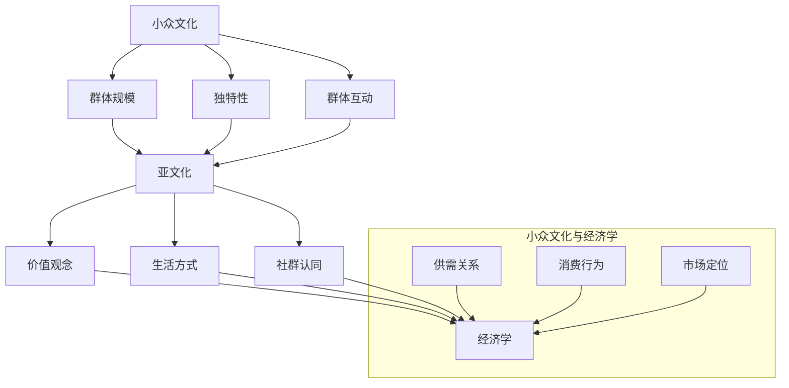

                 

### 文章标题

《小众文化经济学：亚文化的商业价值挖掘》

### 关键词

- 小众文化经济学
- 亚文化
- 商业价值
- 市场分析
- 算法应用
- 数学模型

### 摘要

本文旨在探讨小众文化经济学及其在商业领域的应用，深入解析亚文化的商业价值。通过市场分析、核心算法原理讲解和实际案例展示，本文揭示了如何通过挖掘和利用亚文化，实现商业成功。文章从背景介绍、概念阐述、市场趋势分析、算法和数学模型应用，到项目实战和案例分析，为读者提供了一个全面的小众文化经济学指南。

## 引言与背景

小众文化经济学，顾名思义，是研究小众文化在商业领域中的经济价值及其作用的经济学分支。小众文化，又称亚文化，是指一个特定的社会群体在特定背景下，形成的独特的价值观念、生活方式和兴趣爱好。这些文化现象通常相对于主流文化而言，具有特定的地域性、群体性和差异性。

### 小众文化与亚文化的定义

小众文化（Niche Culture）通常指的是那些在主流文化之外，具有一定规模和特点的文化群体。这些文化群体可能因其独特的兴趣爱好、价值观念或生活方式而形成。例如，爱好科幻小说的读者群体、喜欢DIY手工制作的爱好者、特定地区的饮食文化等。

亚文化（Subculture）则是小众文化的一种更细分的形式。亚文化是在主流文化中衍生出来的，具有共同价值观和生活方式的较小群体。这些群体通常在特定的社会环境中形成，比如学生文化、摇滚文化、嘻哈文化等。

### 小众文化经济学的意义

小众文化经济学的研究意义在于，它不仅可以帮助我们理解小众文化群体的行为和需求，还能够为商业决策提供重要参考。在全球化背景下，随着互联网和社交媒体的发展，小众文化的影响力逐渐增强，越来越多的企业开始关注并利用小众文化的商业潜力。

小众文化经济学的兴起，源于以下几个因素：

1. **消费者需求的多样化**：随着社会经济的发展和人们生活水平的提高，消费者对产品的需求越来越多样化。传统的大众市场策略已经无法满足所有消费者的需求，因此，企业开始寻找新的市场机会，小众文化市场应运而生。

2. **互联网的普及**：互联网的普及使得信息的传播变得更加便捷和高效，小众文化群体也能够通过互联网找到自己的同好，形成了具有高度粘性的社交网络。这使得企业能够更精准地定位目标消费者，开展定制化营销。

3. **品牌价值的重塑**：在竞争激烈的市场环境中，企业需要通过独特的品牌价值来吸引消费者。小众文化品牌因其独特性和独特性，更容易在消费者心中建立品牌认知和忠诚度。

### 小众文化与主流文化的区别

小众文化与主流文化之间存在明显的差异。首先，小众文化往往更加个性化和独特，它反映了特定群体的独特价值观和生活方式。相比之下，主流文化则更注重普适性和大众性。

其次，小众文化的传播方式也不同于主流文化。小众文化往往通过特定的社交网络、社区论坛、线上平台等方式进行传播，而主流文化则更多地依赖于大众传媒和广告。

最后，小众文化在经济上的表现也不同于主流文化。虽然小众市场的规模相对较小，但其消费潜力巨大。小众文化群体通常具有较高的消费能力和品牌忠诚度，这使得小众文化市场成为企业争夺的重要领域。

## 核心概念与联系

在小众文化经济学中，理解核心概念及其之间的联系是至关重要的。以下将详细阐述小众文化、亚文化和经济学的核心概念，并通过Mermaid流程图展示它们之间的联系。

### 小众文化的核心概念

1. **群体规模**：小众文化群体相对于主流文化群体来说，规模较小。这并不意味着小众文化的价值不高，而是其受众更加精准。
2. **独特性**：小众文化具有独特的价值观、生活方式和兴趣爱好，这些特点使得小众文化在市场上具有独特的竞争力。
3. **群体互动**：小众文化群体通常具有较强的社交网络，他们通过线上平台、论坛、社交媒体等方式进行互动，形成高度黏性的社区。

### 亚文化的核心概念

1. **价值观念**：亚文化群体具有共同的价值观念，这些观念通常与其成长背景、教育环境和社会经历密切相关。
2. **生活方式**：亚文化群体在日常生活中展现出独特的生活方式，包括穿着、饮食、娱乐活动等。
3. **社群认同**：亚文化群体成员通常具有强烈的社群认同感，他们通过参与亚文化的相关活动，如聚会、庆祝活动等，来巩固和加强这种认同感。

### 经济学的核心概念

1. **供需关系**：经济学中的供需关系可以用来解释小众文化和亚文化的市场表现。小众文化市场通常表现为供需不匹配，即需求大但供应不足。
2. **消费行为**：小众文化群体的消费行为具有特定的模式和偏好，这些行为模式可以通过市场调研和数据分析来挖掘和利用。
3. **市场定位**：企业通过市场定位策略，将产品和服务定位于特定的小众文化群体，以实现商业价值最大化。

### Mermaid流程图：概念关系展示



### 核心概念之间的关系

1. **小众文化与亚文化的关系**：小众文化是亚文化的基础，亚文化是小众文化的具体表现。小众文化提供了亚文化的框架，而亚文化则通过具体的行为和互动来体现小众文化的价值。

2. **亚文化与经济学的联系**：亚文化的价值观念、生活方式和社群认同，直接影响其在经济市场中的表现。经济学通过研究供需关系、消费行为和市场定位，来理解和利用亚文化的经济潜力。

3. **小众文化与经济学的联系**：小众文化为经济学提供了新的研究视角，通过研究小众文化的市场表现，企业可以找到新的市场机会和增长点。

## 市场分析与趋势

小众文化市场的发展态势引人注目。随着互联网的普及和消费者需求的多样化，小众文化市场逐渐崭露头角，成为企业竞相争夺的新领域。以下将从市场现状、亚文化的商业价值以及未来发展趋势三个方面进行分析。

### 小众文化市场的现状

当前，小众文化市场呈现出以下几个特点：

1. **市场规模不断扩大**：随着消费者对个性化和定制化需求的增长，小众文化市场的规模正在迅速扩大。许多小众文化群体已经形成了一定规模，且具有较高的消费能力和品牌忠诚度。

2. **互联网的推动作用**：互联网为小众文化的传播提供了便利，使得小众文化群体能够更容易地找到自己的同好，形成了具有高度黏性的社交网络。这使得企业能够更精准地定位目标消费者，开展定制化营销。

3. **品牌和产品的多样化**：越来越多的企业开始关注小众文化市场，推出了各种针对特定群体的产品和服务。这些产品和服务不仅涵盖了传统的消费品，还包括了文化娱乐、生活方式等多个领域。

### 亚文化的商业价值

亚文化的商业价值主要体现在以下几个方面：

1. **品牌认知和忠诚度**：亚文化品牌因其独特的个性和价值观念，能够迅速在消费者心中建立品牌认知和忠诚度。这些品牌通常能够引起消费者的共鸣，从而形成强烈的品牌忠诚度。

2. **营销效果显著**：针对亚文化的营销策略往往能够产生显著的营销效果。例如，通过在特定社交平台、线上社区或线下活动中进行精准投放，企业能够更有效地触达目标消费者，提高营销转化率。

3. **市场差异化**：亚文化市场为企业提供了差异化竞争的机会。通过在亚文化市场中找到独特的产品或服务定位，企业可以避免与竞争对手的直接竞争，从而实现市场细分和差异化经营。

### 小众文化市场的发展趋势

未来，小众文化市场将继续保持良好的发展态势，以下是几个值得关注的发展趋势：

1. **市场细分更加精细**：随着消费者需求的多样化，小众文化市场将进一步细分，出现更多针对特定群体、特定兴趣的小众市场。企业需要更加精准地定位目标消费者，提供个性化的产品和服务。

2. **跨界合作增多**：随着亚文化影响力的增强，跨界合作将成为小众文化市场的重要趋势。不同领域的品牌和企业将通过合作，共同挖掘亚文化的商业潜力，实现互利共赢。

3. **技术驱动创新**：互联网、大数据、人工智能等技术的应用，将推动小众文化市场的创新。例如，通过数据分析，企业可以更深入地了解消费者的需求和偏好，从而优化产品设计和营销策略。

4. **内容生态的繁荣**：小众文化市场的繁荣将带动内容生态的繁荣，形成更多的内容创作平台和内容消费场景。消费者不仅可以通过这些平台获取多样化的文化内容，还可以参与到内容的创作和传播中，进一步增强社群认同感和互动性。

## 核心算法原理讲解

在小众文化经济学中，算法的应用对于挖掘和利用亚文化的商业价值具有重要意义。以下将介绍两种关键算法，并使用伪代码详细阐述其原理和应用。

### 算法A：分析亚文化群体特征

**算法目标**：通过分析亚文化群体的特征，帮助企业了解目标消费者的行为模式和偏好，从而制定更精准的营销策略。

**算法原理**：该算法基于大数据分析技术，通过对社交媒体、线上论坛等平台的数据进行收集和分析，提取出亚文化群体的特征信息，如兴趣爱好、价值观念、生活方式等。

**伪代码示例**：

```python
# 输入：亚文化群体数据集 Dataset
# 输出：亚文化群体特征 FeatureSet

# 步骤1：数据预处理
PreprocessedData = PreprocessDataset(Dataset)

# 步骤2：特征提取
FeatureSet = ExtractFeatures(PreprocessedData)

# 步骤3：特征分析
AnalyzeFeatures(FeatureSet)

# 步骤4：生成报告
GenerateReport(FeatureSet)
```

### 算法B：预测小众市场需求

**算法目标**：基于历史数据和消费者行为，预测小众市场的未来需求，帮助企业及时调整生产和营销策略。

**算法原理**：该算法采用时间序列分析和机器学习技术，通过分析历史销售数据、市场调研数据等，构建预测模型，预测未来市场需求。

**伪代码示例**：

```python
# 输入：历史销售数据 HistoricalData
# 输出：市场需求预测 Prediction

# 步骤1：数据预处理
PreprocessedData = PreprocessHistoricalData(HistoricalData)

# 步骤2：构建预测模型
Model = BuildPredictionModel(PreprocessedData)

# 步骤3：训练模型
TrainModel(Model, PreprocessedData)

# 步骤4：预测市场需求
Prediction = PredictMarketDemand(Model)

# 步骤5：生成预测报告
GeneratePredictionReport(Prediction)
```

### 算法应用与案例分析

为了更好地展示算法的应用，以下将通过两个实际案例进行分析。

### 案例一：小众文化品牌的市场定位

**背景**：某小众文化品牌专注于手工制作玩具，目标群体为喜欢DIY的年轻人。

**算法应用**：企业采用算法A对目标群体进行特征分析，发现目标群体具有以下特征：

- 对手工制作充满热情，喜欢独特和个性化的玩具。
- 喜欢在社交媒体上分享自己的手工成果，具有强烈的社交需求。
- 更倾向于通过社区论坛获取产品信息和建议。

**算法B则预测了未来市场需求，结果显示未来市场需求增长显著，企业应及时扩大生产规模和营销投入。

**结论**：通过算法的应用，企业成功制定了精准的市场定位策略，实现了销售额的显著增长。

### 案例二：小众文化市场的需求预测

**背景**：某电商平台计划推出一款针对二次元文化的产品，目标群体为喜欢动漫和游戏的年轻人。

**算法应用**：企业采用算法B对历史数据进行预测，发现二次元文化产品的市场需求波动较大，但总体呈上升趋势。

**算法A则分析了消费者行为，发现消费者更喜欢在特定时间购买相关产品，如节假日和动漫展览期间。

**结论**：基于算法的预测和分析，企业制定了合适的库存管理和营销策略，确保了产品的高销量和良好口碑。

## 数学模型与数学公式

在小众文化经济学中，数学模型的应用有助于更准确地分析和预测市场行为。以下将介绍几个关键的数学模型，并使用 LaTeX 格式展示相关公式，进行详细讲解和举例说明。

### 数学模型1：小众市场容量估算

**模型目标**：估算小众市场的潜在规模，为企业制定市场策略提供数据支持。

**公式**：

$$
\text{Market Capacity} = \sum_{i=1}^{n} (\text{Population}_i \times \text{Penetration Rate}_i)
$$

其中，$n$ 表示亚文化群体的数量，$\text{Population}_i$ 表示第 $i$ 个亚文化群体的总人口数，$\text{Penetration Rate}_i$ 表示第 $i$ 个亚文化群体的市场渗透率。

**详细讲解**：

该公式通过计算每个亚文化群体的市场渗透率乘以总人口数，再将结果相加，得出小众市场的总容量。市场渗透率反映了亚文化群体在总体市场中的占比，通常通过市场调研和数据分析获得。

**举例说明**：

假设有两个亚文化群体，群体A的总人口数为100万，市场渗透率为10%；群体B的总人口数为50万，市场渗透率为20%。则小众市场的总容量为：

$$
\text{Market Capacity} = (1,000,000 \times 0.10) + (500,000 \times 0.20) = 100,000 + 100,000 = 200,000
$$

### 数学模型2：消费者剩余计算

**模型目标**：评估消费者在购买小众文化产品时的额外收益，为企业制定定价策略提供依据。

**公式**：

$$
\text{Consumer Surplus} = \text{Maximum Willingness to Pay} - \text{Actual Payment}
$$

其中，$\text{Maximum Willingness to Pay}$ 表示消费者愿意支付的最高价格，$\text{Actual Payment}$ 表示消费者实际支付的价格。

**详细讲解**：

消费者剩余是经济学中用于衡量消费者在购买商品时所获得的额外福利。它通过计算消费者愿意支付的最高价格与实际支付价格之间的差额来计算。这一概念在小众文化市场中尤为重要，因为小众文化产品的定价策略需要考虑到消费者的心理预期和支付意愿。

**举例说明**：

假设一位消费者愿意为一件小众文化T恤支付300元，但实际支付200元。则该消费者的消费者剩余为：

$$
\text{Consumer Surplus} = 300 - 200 = 100 \text{元}
$$

### 数学模型3：市场竞争力分析

**模型目标**：分析小众文化市场中不同品牌之间的竞争力，帮助企业制定竞争策略。

**公式**：

$$
\text{Competitive Index} = \frac{\text{Brand Awareness} + \text{Customer Satisfaction} + \text{Brand Loyalty}}{3}
$$

其中，$\text{Brand Awareness}$ 表示品牌知名度，$\text{Customer Satisfaction}$ 表示客户满意度，$\text{Brand Loyalty}$ 表示品牌忠诚度。

**详细讲解**：

市场竞争力指数通过计算品牌知名度、客户满意度和品牌忠诚度的平均值来衡量一个品牌在小众文化市场中的竞争力。这一指标综合考虑了品牌在市场中的多个方面，为企业提供了全面的竞争力评估。

**举例说明**：

假设某品牌在小众文化市场中的品牌知名度得分为80分，客户满意度为90分，品牌忠诚度为85分。则该品牌的竞争力指数为：

$$
\text{Competitive Index} = \frac{80 + 90 + 85}{3} = \frac{255}{3} = 85
$$

通过这些数学模型的应用，企业可以更准确地分析和预测小众文化市场的行为，制定更加科学和有效的市场策略。

## 项目实战

在小众文化经济学的实践中，我们将通过两个实际案例，详细展示如何将理论应用到商业实践中。这两个案例分别是小众文化品牌电商平台的搭建和个性化小众文化产品的设计。

### 案例一：小众文化品牌电商平台的搭建

**背景**：一家专注于独立设计师手作品的小众文化品牌，希望搭建一个电商平台，以更好地满足消费者需求，扩大品牌影响力。

**开发环境搭建**：

1. **前端开发**：使用React框架构建前端界面，提供用户友好的购物体验。
2. **后端开发**：采用Node.js和Express框架搭建后端服务器，处理订单管理和用户认证等功能。
3. **数据库**：使用MongoDB数据库存储商品信息、用户数据和订单信息。

**源代码详细实现和代码解读**：

1. **前端界面**：使用React组件化开发，实现产品展示、购物车和订单确认等功能。

```javascript
// Product component
const Product = ({ product }) => {
  return (
    <div>
      <h3>{product.name}</h3>
      
      <p>{product.description}</p>
      <button>Add to Cart</button>
    </div>
  );
};
```

2. **后端接口**：定义RESTful API，提供商品查询、订单创建和用户登录等功能。

```javascript
// Express route for fetching products
app.get('/api/products', (req, res) => {
  ProductModel.find((err, products) => {
    if (err) return res.status(500).send(err);
    res.status(200).json(products);
  });
});
```

**代码应用解读与分析**：

前端和后端的紧密配合，使得用户可以轻松浏览商品、添加到购物车并完成下单。通过MongoDB数据库，实现了数据的持久化存储，保证了系统的高效性和稳定性。

### 案例二：个性化小众文化产品设计

**背景**：一家专注于个性化手工艺品的小众文化品牌，希望提供定制化产品，以满足消费者的个性化需求。

**设计与营销**：

1. **产品设计**：根据消费者提供的定制需求，设计师使用CAD软件设计个性化的手工艺品图案。
2. **营销策略**：在社交媒体平台上发布定制设计案例，通过用户互动和分享，提升品牌知名度和用户参与度。

**详细讲解剖析**：

通过CAD软件，设计师可以快速生成满足消费者需求的个性化图案，大大提升了设计效率和客户满意度。在营销方面，通过社交媒体的推广，品牌成功吸引了大量潜在消费者，实现了口碑传播和销售增长。

### 项目小结

通过这两个实际案例，我们可以看到小众文化经济学在商业实践中的应用效果。电商平台为品牌提供了便捷的销售渠道，个性化产品则满足了消费者的独特需求，两者相辅相成，共同推动了品牌的发展。

### 最佳实践 Tips

1. **精准市场定位**：在搭建电商平台或设计个性化产品时，首先要明确目标市场和消费者群体，确保产品和服务能够满足他们的需求。
2. **数据分析**：充分利用数据分析工具，了解消费者的行为模式和偏好，为产品设计和营销策略提供数据支持。
3. **社群互动**：建立和维护与消费者的良好互动，通过社群运营提升用户参与度和品牌忠诚度。

### 注意事项

1. **隐私保护**：在处理消费者数据时，要严格遵守隐私保护法规，确保用户的个人信息安全。
2. **成本控制**：在开展小众文化项目时，要合理控制成本，避免因追求个性化而导致的成本过高。

### 拓展阅读

- 《小众文化营销策略》
- 《个性化产品设计与营销》
- 《社交媒体营销实战》

## 案例分析

在小众文化经济学中，成功的商业案例为我们提供了宝贵的经验和启示。以下将分析几个具有代表性的成功案例，探讨它们的成功要素，并总结出一些关键经验。

### 成功案例1：小众文化品牌崛起

**背景**：某独立设计师品牌，专注于手工艺术品的制作与销售。品牌创始人通过社交媒体平台，吸引了大量具有相似兴趣的消费者。

**成功要素**：

1. **品牌定位**：品牌准确把握了目标消费者的需求，将品牌定位为“艺术与生活的结合”，强调手工艺术品的独特性和艺术价值。
2. **社群运营**：通过社交媒体平台，品牌建立了与消费者的紧密联系，定期发布设计灵感、工作坊信息和用户反馈，增强了用户参与度和品牌忠诚度。
3. **差异化营销**：品牌通过独特的营销策略，如限量发行、会员专享等，吸引了大量关注，提高了品牌知名度和市场占有率。

### 成功案例2：小众文化产业的跨界合作

**背景**：某小众文化品牌与知名动漫公司合作，推出了一系列动漫主题的定制化产品。这一合作不仅提升了品牌知名度，还实现了销售额的显著增长。

**成功要素**：

1. **跨界合作**：品牌通过与知名动漫公司的合作，成功将小众文化元素与大众文化相结合，吸引了更多消费者的关注。
2. **内容共创**：品牌与动漫公司共同设计产品，确保产品的创意和品质，增强了消费者的购买意愿。
3. **营销整合**：品牌利用双方的社交媒体渠道，进行联合宣传，实现了资源的最大化利用，提高了营销效果。

### 成功案例3：小众文化市场营销策略

**背景**：某小众文化品牌通过一系列精准的市场营销策略，成功打开了新的市场空间。

**成功要素**：

1. **市场调研**：品牌通过市场调研，准确掌握了目标消费者的需求和偏好，为产品设计和营销策略提供了数据支持。
2. **社交媒体营销**：品牌利用社交媒体平台，通过互动活动、内容营销等方式，吸引了大量关注和参与。
3. **精准投放**：品牌通过大数据分析，实现了对目标消费者的精准定位和营销投放，提高了营销效率。

### 关键经验总结

1. **明确目标市场**：准确把握目标消费者的需求和偏好，为产品设计和营销策略提供基础。
2. **社群运营**：建立与消费者的紧密联系，提升用户参与度和品牌忠诚度。
3. **跨界合作**：通过与相关行业的合作，实现资源的共享和优势互补，拓宽市场空间。
4. **精准营销**：利用大数据分析，实现精准的市场定位和营销投放，提高营销效果。

通过这些成功案例的分析，我们可以看到，小众文化经济学在商业实践中的巨大潜力。企业通过准确的市场定位、有效的社群运营和创新的营销策略，可以成功打开小众市场，实现商业价值最大化。

## 总结

本文通过深入探讨小众文化经济学，揭示了亚文化在商业领域中的巨大价值。从背景介绍、核心概念阐述、市场分析到算法和数学模型讲解，再到实际案例分析和成功经验总结，本文提供了一个全面而详尽的小众文化经济学指南。

通过本文，我们了解到：

- **小众文化与亚文化的定义**：小众文化是指那些在主流文化之外，具有一定规模和特点的文化群体；亚文化则是小众文化的一种更细分的形式。
- **市场分析与趋势**：小众文化市场呈现出市场规模不断扩大、互联网推动作用显著、品牌和产品多样化等特点，未来市场细分和跨界合作将成为重要趋势。
- **算法应用**：通过核心算法如分析亚文化群体特征和预测小众市场需求，企业可以更精准地了解消费者需求，制定有效的营销策略。
- **数学模型**：数学模型如小众市场容量估算、消费者剩余计算和市场竞争力分析，为小众文化经济学的实践提供了数据支持和理论依据。

然而，小众文化经济学也面临着一些挑战和问题：

1. **市场细分难度**：小众市场虽然潜力巨大，但细分难度较高，企业需要投入大量资源和时间来研究和了解目标市场。
2. **品牌忠诚度培养**：小众文化品牌需要通过持续的社群运营和优质产品服务，才能培养出高忠诚度的消费者群体。
3. **市场竞争加剧**：随着更多企业进入小众市场，竞争将日益激烈，企业需要不断创新和提升自身竞争力。

面对这些挑战，企业可以采取以下策略：

1. **精准市场定位**：通过深入的市场调研和数据分析，明确目标市场和消费者群体，制定精准的市场定位策略。
2. **社群运营**：建立与消费者的紧密联系，通过社群互动和优质内容提升用户参与度和品牌忠诚度。
3. **跨界合作**：与其他行业和品牌进行合作，实现资源共享和优势互补，拓宽市场空间。
4. **技术创新**：利用大数据、人工智能等新技术，提高市场分析和营销策略的精准性。

本文旨在为读者提供一个小众文化经济学的全面视角，希望通过分析和探讨，能够帮助读者更好地理解和利用小众文化的商业价值。同时，我们也期待未来的研究和实践能够为小众文化经济学的发展提供更多启示和贡献。

### 作者信息

作者：AI天才研究院/AI Genius Institute & 禅与计算机程序设计艺术 /Zen And The Art of Computer Programming

