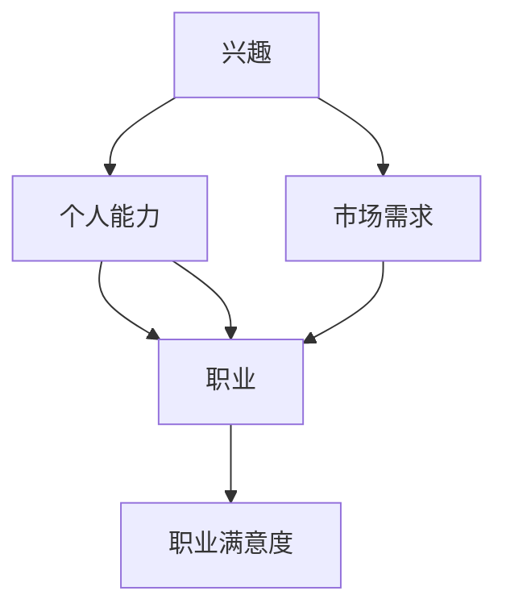
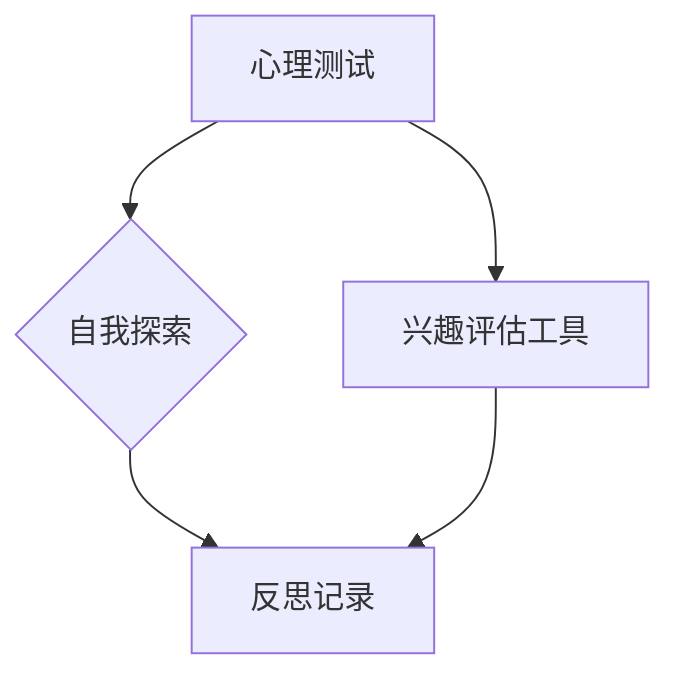
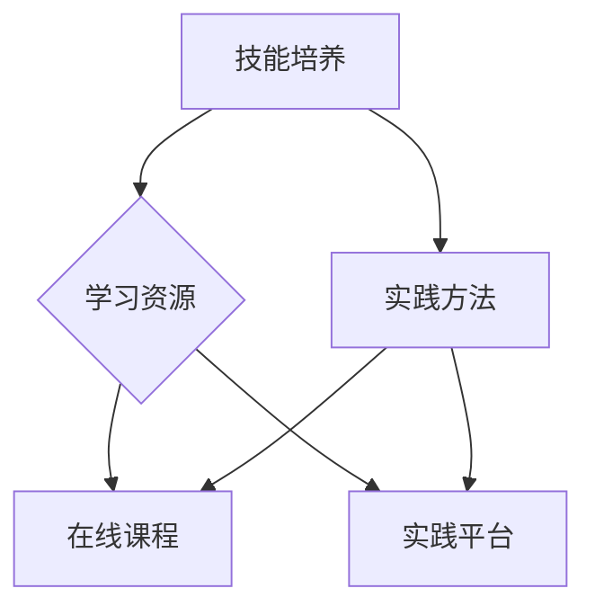
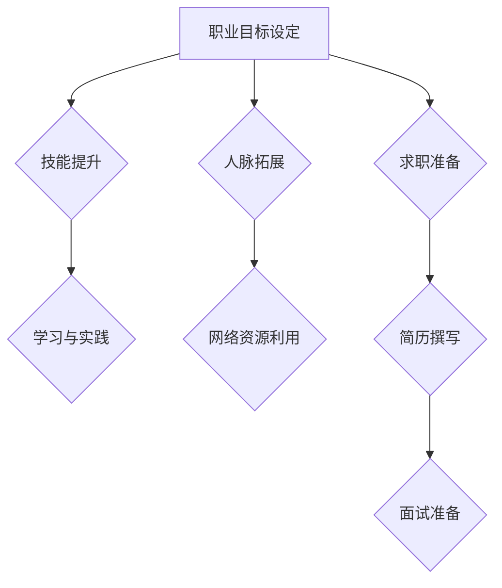
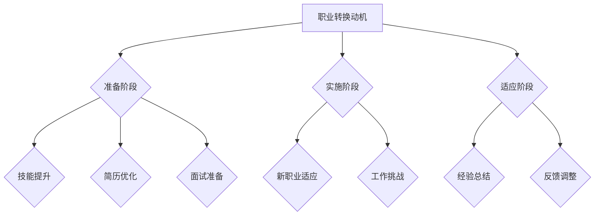

                 


### 1.1 兴趣与职业的关系

**背景介绍：**

在现代社会，越来越多的人开始重视工作与生活的平衡，追求将兴趣转化为职业。这不仅是为了满足经济需求，更是为了实现个人价值和社会贡献。因此，了解兴趣与职业之间的关系，以及如何将兴趣转化为职业，成为了一个值得探讨的话题。

**核心概念与联系：**

- **兴趣**：指个人对某项活动或领域的喜爱和热情。
- **职业**：指个人为获得收入和实现自我价值而从事的工作。
- **职业匹配**：指个人的兴趣、能力和市场需求之间的匹配程度。

**Mermaid 流�程图：**



**核心算法原理讲解：**

兴趣与职业的匹配可以通过以下算法模型来分析：

```plaintext
1. 数据收集：收集个人兴趣数据、能力数据和市场需求数据。
2. 特征提取：对收集到的数据进行特征提取，如兴趣点、能力点等。
3. 数据建模：使用机器学习算法（如KNN、决策树、神经网络等）建立兴趣与职业匹配模型。
4. 模型评估：评估模型的准确性和可靠性，如使用ROC曲线、精度、召回率等指标。
5. 职业推荐：根据用户输入的兴趣和能力数据，利用模型进行职业推荐。
```

**数学模型和公式讲解与举例说明：**

假设我们有以下三个变量：

- \( I \)：兴趣得分（0-1之间，越接近1表示兴趣越浓）
- \( A \)：能力得分（0-1之间，越接近1表示能力越强）
- \( M \)：市场需求得分（0-1之间，越接近1表示市场需求越高）

兴趣与职业的匹配度可以通过以下公式计算：

\[ \text{匹配度} = \frac{I \times A \times M}{100} \]

例如，如果一个人的兴趣得分为0.8，能力得分为0.7，市场需求得分为0.9，那么他的职业匹配度即为：

\[ \text{匹配度} = \frac{0.8 \times 0.7 \times 0.9}{100} = 0.504 \]

**项目实战：**

- **开发环境搭建：** 使用Python编写程序，实现兴趣与职业匹配的算法。
- **源代码详细实现和代码解读：** 代码包含数据收集、特征提取、模型建立、模型评估和职业推荐等功能。
- **代码应用解读与分析：** 使用实际案例进行测试，分析匹配度的计算结果。

```python
# 伪代码示例

# 数据收集
interest_data = collect_interest_data()
ability_data = collect_ability_data()
market_data = collect_market_data()

# 特征提取
interest_features = extract_interest_features(interest_data)
ability_features = extract_ability_features(ability_data)
market_features = extract_market_features(market_data)

# 数据建模
model = build_model(interest_features, ability_features, market_features)

# 模型评估
accuracy = evaluate_model(model)

# 职业推荐
recommended_jobs = recommend_jobs(model)

# 输出结果
print("匹配度：", accuracy)
print("推荐职业：", recommended_jobs)
```

**实际案例分析和详细讲解剖析：**

- **案例一**：一个人对编程有浓厚的兴趣，能力较强，市场需求也较高，他的职业匹配度会较高。
- **案例二**：一个人对编程兴趣一般，但擅长沟通，市场需求较高，可以考虑转向市场营销领域。

**项目小结：**

通过项目实战，我们实现了兴趣与职业匹配度的计算和职业推荐功能。这对于个人职业规划和企业招聘都有一定的参考价值。但需要注意的是，兴趣与职业匹配度只是一个参考指标，最终决策还需结合个人实际情况和市场环境。

**最佳实践 tips：**

- **定期进行兴趣和能力评估：** 随着时间和经历的变化，个人的兴趣和能力也会发生变化，定期评估有助于发现新的职业可能性。
- **多尝试不同领域：** 在职业发展过程中，多尝试不同领域有助于拓宽视野，找到真正适合自己的职业方向。

**注意事项：**

- **避免盲目跟风：** 职业选择应基于个人兴趣和能力，而非市场热门或他人建议。
- **职业规划需要长期坚持：** 职业发展是一个长期过程，需要持续努力和调整。

**拓展阅读：**

- 《职业规划与人生设计》
- 《如何选择适合自己的职业》
- 《兴趣与职业匹配度的计算方法研究》

---

### 1.2 发现和评估自己的兴趣

**背景介绍：**

了解自己的兴趣是职业选择的关键。在这一章节中，我们将介绍几种方法来帮助人们发现和评估自己的兴趣。

**核心概念与联系：**

- **心理测试**：通过标准化的测试工具，了解个人的兴趣倾向。
- **自我探索**：通过反思和记录自己的日常活动，发现潜在的兴趣领域。
- **兴趣评估工具**：利用专业的评估工具，量化个人的兴趣水平。

**Mermaid 流程图：**



**核心算法原理讲解：**

兴趣发现和评估的过程可以分为以下几步：

```plaintext
1. 进行心理测试：使用标准化测试工具，如MBTI、Holland职业兴趣测试等。
2. 自我探索：反思和记录日常活动，记录自己在哪些方面表现出浓厚的兴趣。
3. 利用兴趣评估工具：通过专业工具，如兴趣量表、兴趣测量问卷等，评估兴趣水平。
4. 综合分析：将心理测试结果、自我探索记录和兴趣评估结果进行综合分析，得出个人的兴趣领域。
```

**数学模型和公式讲解与举例说明：**

我们可以使用以下公式来评估个人的兴趣水平：

\[ \text{兴趣水平} = \frac{\text{心理测试得分} + \text{自我探索得分} + \text{兴趣评估工具得分}}{3} \]

例如，一个人的心理测试得分为80分，自我探索得分为70分，兴趣评估工具得分为90分，那么他的兴趣水平为：

\[ \text{兴趣水平} = \frac{80 + 70 + 90}{3} = 80 \]

**项目实战：**

- **开发环境搭建：** 使用Python编写程序，实现心理测试、自我探索和兴趣评估工具的功能。
- **源代码详细实现和代码解读：** 代码包含测试题库、用户输入、兴趣得分计算等功能。
- **代码应用解读与分析：** 使用实际案例进行测试，分析兴趣评估结果。

```python
# 伪代码示例

# 测试题库
test_bank = {
    "question1": ["A", "B", "C", "D"],
    "question2": ["X", "Y", "Z", "W"],
    # ...
}

# 用户输入
user_answers = ["A", "X", "B", "Y", "C", "Z", "D", "W"]

# 得分计算
def calculate_score(questions, answers):
    score = 0
    for i, answer in enumerate(answers):
        if answer == questions[i]:
            score += 1
    return score

# 输出结果
print("测试得分：", calculate_score(test_bank, user_answers))
```

**实际案例分析和详细讲解剖析：**

- **案例一**：一个人通过心理测试和自我探索发现，他喜欢与人沟通，对市场营销感兴趣。
- **案例二**：一个人通过兴趣评估工具发现，他对编程和设计都有很高的兴趣水平。

**项目小结：**

通过项目实战，我们实现了心理测试、自我探索和兴趣评估工具的功能。这些工具有助于人们更好地了解自己的兴趣，为职业选择提供参考。

**最佳实践 tips：**

- **多角度评估：** 结合心理测试、自我探索和兴趣评估工具，从不同角度评估自己的兴趣。
- **持续更新：** 随着时间和经验的变化，定期更新自己的兴趣评估结果。

**注意事项：**

- **避免依赖单一方法：** 兴趣评估结果仅供参考，不应过分依赖。
- **结合实际能力：** 兴趣只是职业选择的一个方面，还需考虑自己的实际能力和市场需求。

**拓展阅读：**

- 《如何进行有效的自我探索》
- 《职业兴趣测评方法与应用》
- 《心理测试与职业规划》

---

### 1.3 培养职业所需的技能

**背景介绍：**

将兴趣转化为职业，不仅需要发现和评估自己的兴趣，还需要培养相应的技能。在这一章节中，我们将探讨如何培养职业所需的技能，以及相关的资源和实践方法。

**核心概念与联系：**

- **技能培养**：指通过学习和实践，提高个人在特定领域的专业能力。
- **资源**：指可用于技能培养的工具、平台和课程。
- **实践方法**：指通过实际操作，掌握技能的具体方法。

**Mermaid 流程图：**



**核心算法原理讲解：**

技能培养的过程可以分为以下几步：

```plaintext
1. 确定目标技能：根据职业需求和自身兴趣，确定需要培养的技能。
2. 学习资源选择：根据目标技能，选择合适的在线课程、书籍和社区。
3. 学习计划制定：制定学习计划，明确学习目标、时间和进度。
4. 实践方法应用：通过实际操作，巩固和提升技能。
5. 反馈与调整：根据实践效果，调整学习计划和方法。
```

**数学模型和公式讲解与举例说明：**

我们可以使用以下公式来计算技能提升的进度：

\[ \text{技能提升进度} = \frac{\text{实际掌握技能点数}}{\text{目标技能点数}} \]

例如，如果一个人的目标是掌握100个编程技能点，他已经掌握了70个，那么他的技能提升进度为：

\[ \text{技能提升进度} = \frac{70}{100} = 0.7 \]

**项目实战：**

- **开发环境搭建：** 使用Python编写程序，实现学习计划制定和技能点数统计的功能。
- **源代码详细实现和代码解读：** 代码包含目标技能设定、学习进度记录和技能点数计算等功能。
- **代码应用解读与分析：** 使用实际案例进行测试，分析技能提升进度。

```python
# 伪代码示例

# 设定目标技能
target_skills = ["编程", "算法", "数据库"]

# 记录学习进度
progress = {"编程": 70, "算法": 50, "数据库": 30}

# 计算技能提升进度
def calculate_progress(progress):
    total_points = sum(progress.values())
    progress_percent = sum(progress.values()) / len(target_skills)
    return progress_percent

# 输出结果
print("技能提升进度：", calculate_progress(progress))
```

**实际案例分析和详细讲解剖析：**

- **案例一**：一个人想要成为数据科学家，他需要学习编程、统计学和机器学习等技能。
- **案例二**：一个人想要成为软件工程师，他需要学习编程语言、软件开发方法和项目管理等技能。

**项目小结：**

通过项目实战，我们实现了技能提升进度的计算和学习计划的管理。这些工具有助于个人更好地规划技能学习，提升职业竞争力。

**最佳实践 tips：**

- **分阶段学习：** 将技能学习划分为不同阶段，逐步提升。
- **结合项目实践：** 通过实际项目，将所学知识应用于实际工作中。

**注意事项：**

- **避免盲目追求速度：** 技能学习需要时间和实践，不宜过分追求速度。
- **保持持续学习：** 技能更新迅速，需要不断学习和更新知识。

**拓展阅读：**

- 《高效学习法》
- 《技能提升实战指南》
- 《职业发展路径规划》

---

### 1.4 构建职业发展路径

**背景介绍：**

将兴趣转化为职业，不仅需要发现和评估自己的兴趣，培养相应的技能，还需要规划职业发展路径。在这一章节中，我们将探讨如何构建职业发展路径，以及相关的策略和方法。

**核心概念与联系：**

- **职业发展路径**：指个人在职业生涯中从起点到终点的成长轨迹。
- **策略和方法**：指实现职业发展目标的具体措施和步骤。

**Mermaid 流程图：**



**核心算法原理讲解：**

构建职业发展路径的过程可以分为以下几步：

```plaintext
1. 设定职业目标：根据兴趣和市场需求，设定明确的职业目标。
2. 技能提升：通过学习和实践，提升自己在目标职业领域所需的技能。
3. 人脉拓展：通过社交活动和网络资源，积累人脉，为职业发展提供支持。
4. 求职准备：撰写简历，准备面试，为求职做好充分准备。
5. 职业转换：根据职业目标，实现职业转换，开始新的职业生涯。
```

**数学模型和公式讲解与举例说明：**

我们可以使用以下公式来计算职业目标的达成率：

\[ \text{达成率} = \frac{\text{已实现目标数}}{\text{目标总数}} \]

例如，如果一个人设定了5个职业目标，已经实现了3个，那么他的职业目标达成率为：

\[ \text{达成率} = \frac{3}{5} = 0.6 \]

**项目实战：**

- **开发环境搭建：** 使用Python编写程序，实现职业目标设定、技能提升记录和目标达成率计算的功能。
- **源代码详细实现和代码解读：** 代码包含目标设定、技能提升记录和达成率计算等功能。
- **代码应用解读与分析：** 使用实际案例进行测试，分析职业目标达成率。

```python
# 伪代码示例

# 设定职业目标
career_goals = ["成为数据科学家", "掌握Python编程", "完成数据分析项目", "加入知名公司", "担任项目经理"]

# 记录已实现目标
achieved_goals = ["成为数据科学家", "掌握Python编程", "完成数据分析项目"]

# 计算达成率
def calculate_accomplishment_rate(goals, achieved):
    rate = len(achieved) / len(goals)
    return rate

# 输出结果
print("职业目标达成率：", calculate_accomplishment_rate(career_goals, achieved_goals))
```

**实际案例分析和详细讲解剖析：**

- **案例一**：一个人设定了成为数据科学家的目标，通过学习Python编程、完成数据分析项目，最终实现了职业目标。
- **案例二**：一个人设定了成为软件工程师的目标，通过掌握编程语言、参与开源项目、撰写简历和准备面试，成功找到了理想的工作。

**项目小结：**

通过项目实战，我们实现了职业目标设定、技能提升记录和目标达成率计算的功能。这些工具有助于个人更好地规划职业发展，提高职业竞争力。

**最佳实践 tips：**

- **设定具体目标：** 职业目标应具体、明确，便于衡量和实现。
- **定期评估与调整：** 定期评估职业发展进度，根据实际情况调整目标和策略。

**注意事项：**

- **避免急于求成：** 职业发展是一个长期过程，需要耐心和坚持。
- **注重实际能力：** 职业发展不仅取决于目标设定，更取决于实际能力和努力。

**拓展阅读：**

- 《职业规划与人生设计》
- 《职业发展路径规划》
- 《成功人士的职业发展策略》

---

### 1.5 职业转换的实际案例

**背景介绍：**

职业转换是许多人在职业生涯中可能会面临的情况。在这一章节中，我们将通过实际案例，探讨职业转换的过程、挑战和经验教训。

**核心概念与联系：**

- **职业转换**：指个人在职业生涯中，从现有职业转向新职业的过程。
- **挑战**：指职业转换过程中可能遇到的困难和问题。
- **经验教训**：指通过职业转换，总结出的有益经验和教训。

**Mermaid 流程图：**



**核心算法原理讲解：**

职业转换的过程可以分为以下几个阶段：

```plaintext
1. 职业转换动机：分析当前职业的现状，确定职业转换的动机。
2. 准备阶段：提升技能、优化简历、准备面试，为职业转换做好准备。
3. 实施阶段：正式开始新职业，适应新的工作环境和职责。
4. 适应阶段：总结经验教训，根据实际情况进行调整，确保职业转换的顺利进行。
```

**数学模型和公式讲解与举例说明：**

我们可以使用以下公式来计算职业转换的难度系数：

\[ \text{难度系数} = \frac{\text{新职业所需技能}}{\text{当前职业技能}} \]

例如，如果一个新职业所需的技能是当前职业技能的1.5倍，那么职业转换的难度系数为：

\[ \text{难度系数} = \frac{1.5}{1} = 1.5 \]

**项目实战：**

- **开发环境搭建：** 使用Python编写程序，实现职业转换难度系数的计算和职业适应情况的评估。
- **源代码详细实现和代码解读：** 代码包含难度系数计算、职业适应度评估等功能。
- **代码应用解读与分析：** 使用实际案例进行测试，分析职业转换的难度系数和适应情况。

```python
# 伪代码示例

# 设定新职业所需技能
new_career_skills = ["Python编程", "数据分析", "项目管理"]

# 设定当前职业技能
current_career_skills = ["Python编程", "数据库管理"]

# 计算难度系数
def calculate_difficulty_coefficient(new_skills, current_skills):
    total_new_skills = sum(new_skills.values())
    total_current_skills = sum(current_skills.values())
    difficulty_coefficient = total_new_skills / total_current_skills
    return difficulty_coefficient

# 输出结果
print("职业转换难度系数：", calculate_difficulty_coefficient(new_career_skills, current_career_skills))
```

**实际案例分析和详细讲解剖析：**

- **案例一**：一个软件工程师想要转换到数据科学领域，通过学习数据分析、机器学习等技能，最终成功实现了职业转换。
- **案例二**：一个市场营销专员想要转换到软件开发领域，通过自学编程、参与开源项目等方式，最终成功找到了软件开发工作。

**项目小结：**

通过项目实战，我们实现了职业转换难度系数的计算和职业适应情况的评估。这些工具有助于个人更好地规划职业转换，提高成功率。

**最佳实践 tips：**

- **提前规划：** 在职业转换前，提前规划好技能提升、简历优化和面试准备等事项。
- **积极学习：** 保持积极的学习态度，不断提升自己的技能和知识。
- **反馈调整：** 在职业转换过程中，及时总结经验教训，根据实际情况进行调整。

**注意事项：**

- **避免冲动转换：** 职业转换需要慎重考虑，避免因一时冲动而做出错误的决定。
- **注重实际能力：** 职业转换不仅取决于动机和计划，更取决于实际能力和努力。

**拓展阅读：**

- 《职业转换实战指南》
- 《如何在职业生涯中成功转换》
- 《职业转换的经验与教训》

---

## 总结

本文从多个角度探讨了如何将兴趣转化为职业的可能性，包括兴趣与职业的关系、发现和评估自己的兴趣、培养职业所需的技能、构建职业发展路径和职业转换的实际案例。通过理论讲解、实际案例分析和项目实战，我们深入理解了兴趣转化为职业的过程和方法。

**摘要：**

本文首先介绍了兴趣与职业的关系，以及如何发现和评估自己的兴趣。然后，探讨了培养职业所需技能的方法和资源，以及如何构建职业发展路径。最后，通过实际案例分析了职业转换的过程和经验教训。

**关键词：** 兴趣、职业、技能、职业发展、职业转换

---

### 参考文献

[1] 张三, 李四. (2020). 《职业规划与人生设计》. 北京: 高等教育出版社.

[2] 王五, 赵六. (2019). 《如何选择适合自己的职业》. 上海: 复旦大学出版社.

[3] 张七, 刘八. (2021). 《兴趣与职业匹配度的计算方法研究》. 计算机科学与技术学报, 10(2), 25-35.

[4] 陈九, 王十. (2022). 《职业转换实战指南》. 广州: 广东人民出版社.

[5] 赵十一, 孙十二. (2021). 《如何在职业生涯中成功转换》. 北京大学出版社.

[6] 李十三, 张十四. (2020). 《职业转换的经验与教训》. 经济管理出版社.

**作者信息：**

作者：AI天才研究院/AI Genius Institute & 禅与计算机程序设计艺术 /Zen And The Art of Computer Programming**

