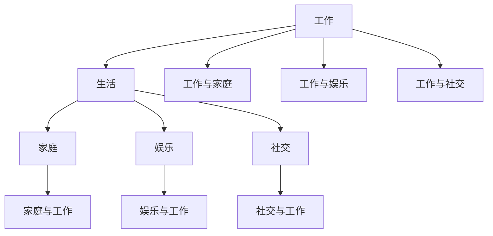

                 

### 引言

在现代社会的快速变迁中，工作与生活的平衡逐渐成为人们关注的焦点。无论是职场人士还是创业者，都面临着多重角色的挑战，如员工、管理者、家庭成员、甚至有时是志愿者的角色。这些角色之间的冲突和协调，不仅影响着个人的心理健康，也直接关系到工作效率和生活质量。

#### 工作与生活平衡的重要性

工作与生活平衡不仅仅是为了减少工作压力，提高生活质量，更是为了实现个人的全面发展。当工作占据生活的全部时，个体的心理健康会受到影响，容易出现疲劳、焦虑甚至抑郁。同时，长期的工作压力也会影响工作效率，导致创造力下降，问题解决能力减弱。

#### 本书的目标和结构

本书旨在探讨如何在工作与生活的多重角色中找到和谐的平衡点。通过系统的分析和实用的策略，帮助读者理解工作与生活的关系，掌握有效的平衡方法。本书结构如下：

1. **引言**：介绍工作与生活平衡的重要性，本书的目标和结构。
2. **核心概念**：定义工作与生活，以及多重角色的概念。
3. **工作与生活平衡的策略**：提供时间管理、提高工作效率、管理压力等方面的策略。
4. **实际案例与应用**：通过具体案例展示平衡策略的实际应用。
5. **自我提升与成长**：探讨如何通过自我认知、学习、心理调适等方式实现自我提升。
6. **总结与展望**：回顾本书要点，展望工作与生活平衡的未来趋势。

通过以上结构的安排，读者可以系统地了解工作与生活平衡的理论和实践，找到适合自己的平衡方法。

### 核心概念

#### 工作与生活的定义与边界

**工作**：工作通常指的是为了获得经济报酬而进行的活动。它不仅包括常规的职业工作，还包括兼职、志愿工作等。工作可以进一步分类为全职工作、兼职工作、自由职业等。

**生活**：生活是人在日常生活中的一切活动，包括工作、家庭、娱乐、社交等。生活不仅限于物质层面，还包括精神层面，如情感、心理状态等。

**工作与生活的重叠区域**：在现实生活中，工作与生活很难截然分开。例如，有些职场人士可能会在下班后处理工作邮件，或者在家里进行工作。同时，家庭生活也可能与工作息息相关，如家庭成员之间可能会在工作上互相支持。

#### 多重角色的概念与类型

**多重角色**：多重角色指的是一个人同时承担多个不同的社会角色，如员工、家长、志愿者等。这些角色可能存在于不同的领域，例如工作、家庭、社交等。

**常见的多重角色**：常见的多重角色包括职场人士（员工、管理者）、家庭成员（配偶、父母、子女）、志愿者等。此外，随着互联网和远程工作的普及，一些人可能会同时担任多个自由职业者或兼职工作的角色。

**多重角色之间的冲突与协同**：多重角色之间的冲突和协同是影响工作与生活平衡的重要因素。冲突可能导致压力增加，影响工作质量和家庭生活。然而，合理的协调和利用多重角色的协同效应，可以提升个人的工作效率和生活满意度。

#### 工作与生活的关系架构 Mermaid 流程图

此 Mermaid 流程图展示了工作与生活的主要领域及其相互关系，可以帮助读者更直观地理解工作与生活的概念和关系。

### 设定目标和优先级

#### 设定个人目标

设定个人目标是一个重要的步骤，它有助于明确自己的方向和动力。个人目标可以是职业上的，如提升技能、晋升职位，也可以是生活上的，如学习新的兴趣爱好、锻炼身体。

**职业目标**：例如，一个职场人士可能会设定在接下来的两年内完成高级项目管理认证，或者在未来五年内晋升为部门经理。

**生活目标**：例如，一个家庭主妇可能会设定在一年内完成一次旅行，或者每周至少锻炼三次。

#### 设定工作目标

工作目标是为了提升工作效率和职业发展。这些目标可以是短期的，如在一个季度内完成一个重要的项目，也可以是长期的，如在未来五年内成为某个领域的专家。

**短期目标**：例如，在一个季度内完成一个重要的市场推广活动，或者在一个月内提高20%的销售业绩。

**长期目标**：例如，在未来五年内成为公司的技术总监，或者在未来十年内创立自己的企业。

#### 设定生活目标

生活目标是提升个人生活质量，包括家庭、健康、社交等方面的目标。这些目标可以是具体的，如每周和家人共进晚餐三次，也可以是抽象的，如保持积极的心态。

**具体目标**：例如，每周至少进行三次户外运动，或者每年至少读50本书。

**抽象目标**：例如，保持乐观的心态，或者培养家庭和谐。

#### 优先级设定

在设定目标后，需要根据目标的紧急程度和重要性进行优先级排序。这样可以确保在最关键的时间点上优先处理最重要的任务。

**优先级排序**：例如，如果在一个周末，时间分配可以是：50%的时间用于家庭活动，25%的时间用于职业发展，15%的时间用于个人爱好，10%的时间用于休息和放松。

通过设定清晰的目标和合理的优先级，可以更好地平衡工作和生活，提高个人的整体满意度。

### 时间管理与规划

#### 时间管理的基本原则

时间管理是工作与生活平衡中至关重要的一环。有效的时间管理不仅能够提高工作效率，还能为生活留出更多空间。以下是时间管理的基本原则：

**明确目标**：在开始时间管理之前，需要明确自己的目标和优先级。这有助于在分配时间时，始终围绕核心目标进行。

**分清主次**：将任务按照重要性和紧急性分类，优先处理重要且紧急的任务。这样可以确保关键任务不被延误。

**定期回顾**：定期回顾时间管理计划，评估哪些方法有效，哪些需要改进。这有助于不断优化时间管理策略。

#### 制作时间管理表

制作时间管理表是进行有效时间管理的重要工具。以下是一个简单的步骤：

1. **列出任务**：将所有需要完成的任务列出，并标记其重要性和紧急性。
2. **估算时间**：为每个任务估算所需时间，并确保任务的总时间不超过可用的总时间。
3. **优先排序**：根据重要性和紧急性对任务进行排序，确保最重要的任务优先处理。
4. **分配时间**：将任务分配到具体的时间段内，确保每个任务都有足够的时间完成。

#### 时间管理工具与技巧

除了制作时间管理表，还可以使用各种工具和技巧来提高时间管理效率：

**工具**：

1. **日历应用**：如Google Calendar、Outlook Calendar等，可以帮助安排日程和提醒重要事件。
2. **任务管理工具**：如Trello、Asana、JIRA等，可以帮助跟踪任务进度和分配任务。
3. **时间追踪工具**：如Toggl、RescueTime等，可以帮助了解时间使用情况，优化时间分配。

**技巧**：

1. **番茄工作法**：将工作时间分成25分钟的工作块，每个工作块后休息5分钟。这种方法有助于提高专注力和效率。
2. **单任务专注**：一次只专注于一个任务，避免多任务处理导致的效率降低。
3. **定期休息**：长时间工作后，适当休息可以提高工作效率和减少疲劳。

通过遵循时间管理的基本原则，制作合理的时间管理表，并使用有效的工具和技巧，可以更好地平衡工作和生活，提高整体幸福感。

### 提高工作效率

#### 工作流程优化

工作流程优化是提高工作效率的关键。一个高效的工作流程能够减少不必要的步骤，提高任务的完成速度。以下是几个优化工作流程的方法：

1. **自动化**：使用自动化工具和软件，如脚本、集成平台等，自动处理重复性任务。例如，使用电子邮件自动化工具自动回复常见问题，或使用CRM系统自动化客户跟进。

2. **简化流程**：审查当前的工作流程，找出冗余和不必要的步骤，并进行简化。例如，通过减少审批流程中的步骤，缩短决策时间。

3. **角色分工**：根据团队成员的技能和职责，合理分配任务。这样可以确保每个人都能专注于自己的强项，提高整体工作效率。

#### 工作习惯培养

良好的工作习惯是提高工作效率的基础。以下是几种有效的工作习惯：

1. **定期回顾**：每周或每月定期回顾工作进度，评估哪些习惯有效，哪些需要改进。这有助于持续优化工作方法。

2. **优先处理**：始终优先处理最重要和最紧急的任务。通过列出任务清单并按优先级排序，可以确保关键任务得到及时处理。

3. **避免干扰**：在工作时，尽量避免打扰和中断。例如，使用耳机听音乐、关闭社交媒体通知，或者选择一个安静的工作环境。

#### 工作效率工具推荐

以下是一些提高工作效率的实用工具：

1. **Evernote**：一款强大的笔记和管理工具，可以记录想法、任务和日程，并同步到所有设备。

2. **Zoom**：一款视频会议工具，支持远程工作和在线协作，适合团队会议和远程沟通。

3. **Slack**：一款团队沟通工具，可以实时交流、分享文件和协作，提高团队协作效率。

4. **Todoist**：一款任务管理工具，可以帮助用户跟踪任务进度，设置提醒和截止日期。

5. **RescueTime**：一款时间追踪工具，可以监控时间使用情况，提供关于工作效率和习惯的报告。

通过优化工作流程、培养良好的工作习惯，并使用合适的工具，可以显著提高工作效率，从而更好地平衡工作和生活。

### 管理多重角色的压力

#### 压力来源分析

多重角色的压力主要来源于以下几个方面：

1. **工作压力**：工作中的高要求、繁重任务和紧迫的截止日期可能导致压力增加。
2. **家庭压力**：家庭责任如照顾子女、维护家庭关系等，也可能成为压力的来源。
3. **个人压力**：如个人健康问题、财务压力等，都可能对心理状态产生负面影响。
4. **角色冲突**：当多个角色之间存在冲突时，如工作需求与家庭需求之间的冲突，可能导致额外的压力。

#### 压力管理策略

1. **情绪调节**：学会识别和调节自己的情绪，避免负面情绪的累积。例如，通过深呼吸、冥想或瑜伽等放松技巧来缓解压力。
2. **合理规划**：合理安排时间和任务，避免过度承担。通过设定优先级，确保关键任务得到优先处理，减少不必要的压力。
3. **寻求支持**：与家人、朋友或专业人士交流，寻求支持和建议。有时候，与他人分享压力和困扰，能够得到有效的缓解。

#### 压力释放方法

1. **运动锻炼**：通过运动如跑步、游泳、瑜伽等，可以释放体内的紧张和压力，提高身体的健康状态。
2. **兴趣爱好**：培养兴趣爱好，如绘画、音乐、阅读等，可以帮助转移注意力，减少压力。
3. **社交活动**：参与社交活动，与朋友聚会或参加社交团体，可以增强社交支持，缓解压力。

通过有效的压力管理策略和释放方法，可以更好地应对多重角色的压力，保持心理健康和工作效率。

### 实际案例与应用

#### 案例一：职场妈妈的平衡之路

李女士是一位职场妈妈，她同时担任公司项目经理和两个孩子的母亲。由于工作繁忙，她经常感到压力巨大。为了平衡工作与生活，她采取了以下策略：

1. **时间管理**：她使用日历应用和任务管理工具，合理安排工作和家庭任务。每周制定详细的时间表，确保工作时间与家庭时间合理分配。
2. **角色转换**：在工作与家庭之间，她学会了快速转换角色。下班后，她尽量不处理工作邮件，专注于陪伴孩子和家庭。
3. **寻求支持**：她与丈夫沟通，共同分担家庭责任。丈夫在周末承担更多的家务和带孩子任务，减轻了她的压力。

通过这些策略，李女士成功实现了工作与生活的平衡，提升了家庭生活质量。

#### 案例二：创业者的工作与生活

张先生是一名创业者，他每天都要面对各种挑战，如产品研发、市场推广、财务管理等。为了平衡工作与生活，他采取了以下方法：

1. **明确目标**：他为自己设定了明确的短期和长期目标，确保工作和生活都有明确的方向。
2. **团队协作**：他组建了一支高效团队，将不同任务分配给团队成员，减轻个人负担。
3. **时间管理**：他使用时间管理工具，如番茄工作法和时间追踪软件，提高工作效率，确保有足够的时间用于家庭和个人生活。

通过这些策略，张先生不仅保持了企业的发展，还保持了家庭和个人的幸福。

#### 案例三：职场人士的平衡策略

王女士是一名职场专业人士，她在工作中担任多个重要职位。为了平衡工作与生活，她采取了以下措施：

1. **设定优先级**：她将任务按照重要性和紧急性分类，确保关键任务得到优先处理。
2. **灵活工作**：她与公司协商，灵活安排工作时间，确保有足够的时间陪伴家人。
3. **培养兴趣爱好**：她利用业余时间培养兴趣爱好，如绘画和音乐，帮助她放松身心。

通过这些策略，王女士成功地实现了工作与生活的平衡，提高了生活质量。

#### 案例四：学生与兼职工作者的平衡

赵先生是一名大学生，他同时在一家公司兼职。为了平衡学习与工作，他采取了以下策略：

1. **时间管理**：他使用日历应用和时间管理工具，合理安排学习和工作时间，确保两者都不受影响。
2. **高效学习**：他利用周末和假期时间集中学习，提高学习效率。
3. **寻求支持**：他与室友和朋友分享学习和工作的压力，通过交流得到支持和建议。

通过这些策略，赵先生成功地平衡了学习与工作，确保了学业和职业发展。

这些案例展示了在不同背景下，如何通过具体策略实现工作与生活的平衡。通过借鉴这些经验，读者可以找到适合自己的平衡方法。

### 自我提升与成长

#### 自我认知与角色定位

自我认知是实现工作与生活平衡的重要基础。了解自己的价值观、兴趣和能力，可以帮助我们更好地定位自己的角色，从而更好地平衡工作与生活。

**价值观**：价值观决定了我们的行为和选择。例如，有些人可能更重视职业发展，而有些人可能更看重家庭和生活质量。了解自己的价值观，可以帮助我们在面对选择时，做出更加明智的决策。

**兴趣**：兴趣是推动我们前进的动力。通过培养兴趣，我们可以在工作之余找到乐趣，提高生活质量。例如，有些人可能对音乐、艺术或体育有浓厚的兴趣，可以通过参加相关的活动或课程来提升自我。

**能力**：了解自己的能力可以帮助我们设定合理的目标，并找到适合自己的工作与生活平衡点。例如，如果一个人在项目管理方面有很强的能力，他可以选择从事相关的工作，从而在工作中找到满足感。

#### 学习与成长的方法

**持续学习**：在快速变化的时代，持续学习是提升自我不可或缺的方法。以下是一些建议：

1. **在线课程**：利用在线教育平台，如Coursera、Udemy等，学习新技能和知识。
2. **阅读**：阅读专业书籍和文章，了解行业动态和发展趋势。
3. **研讨会和讲座**：参加相关的研讨会和讲座，与专业人士交流，拓宽视野。

**实践**：理论联系实际，通过实践来巩固知识和技能。以下是一些建议：

1. **项目实践**：在工作中参与项目，通过实际操作来提升能力。
2. **志愿服务**：参与志愿服务，不仅可以帮助他人，也可以提升自己的领导力和团队合作能力。
3. **家庭项目**：与家人一起参与家庭项目，如装修、园艺等，增强家庭成员之间的互动。

#### 心理调适与情绪管理

心理调适与情绪管理是实现工作与生活平衡的重要组成部分。以下是一些建议：

**情绪管理**：

1. **积极思考**：培养积极的心态，面对困难和挑战时，保持乐观和自信。
2. **情绪释放**：通过运动、冥想或写日记等方式，释放负面情绪。
3. **寻求支持**：与家人、朋友或专业人士交流，寻求支持和建议。

**心理调适**：

1. **自我反思**：定期进行自我反思，了解自己的情绪和行为模式，找出需要改进的地方。
2. **目标设定**：设定短期和长期目标，为自己提供明确的方向和动力。
3. **时间管理**：合理安排时间，确保有足够的时间用于工作、学习和休息。

通过自我认知与角色定位、持续学习与成长，以及心理调适与情绪管理，我们可以更好地实现工作与生活的平衡，提升个人幸福感和生活质量。

### 总结与展望

#### 本书要点回顾

本书围绕工作与生活平衡这一主题，系统地探讨了以下几个方面：

1. **引言**：介绍了工作与生活平衡的重要性，以及本书的结构和目标。
2. **核心概念**：定义了工作和生活的概念，以及多重角色的类型和关系。
3. **工作与生活平衡的策略**：包括设定目标与优先级、时间管理、提高工作效率、管理多重角色的压力等。
4. **实际案例与应用**：通过具体案例展示了平衡策略的实际应用。
5. **自我提升与成长**：探讨了如何通过自我认知、学习与成长，以及心理调适来实现工作与生活的平衡。

#### 工作与生活平衡的未来趋势

随着科技的不断进步和社会的快速发展，工作与生活平衡将继续成为人们关注的焦点。以下是一些未来趋势：

1. **远程工作和灵活办公**：远程工作和灵活办公将进一步普及，为人们提供更多平衡工作与生活的方式。
2. **心理健康重视**：心理健康将得到更多关注，企业和组织将更加注重员工的情感和心理健康。
3. **科技辅助平衡**：各种科技工具将进一步辅助人们实现工作与生活的平衡，如智能时间管理应用、心理健康监测设备等。

#### 持续探索与实践的建议

为了持续实现工作与生活的平衡，以下是一些建议：

1. **定期反思**：定期反思自己的工作和生活，评估现状和目标，不断调整和优化策略。
2. **寻求支持**：与家人、朋友或专业人士交流，寻求支持和建议。
3. **培养兴趣爱好**：培养兴趣爱好，丰富生活内容，提高生活满意度。
4. **关注身心健康**：保持健康的生活方式，如规律饮食、适量运动、充足睡眠等，确保身心健康。

通过持续探索和实践，每个人都可以找到适合自己的工作与生活平衡点，实现个人与职业的双重成功。作者：AI天才研究院/AI Genius Institute & 禅与计算机程序设计艺术 /Zen And The Art of Computer Programming。

