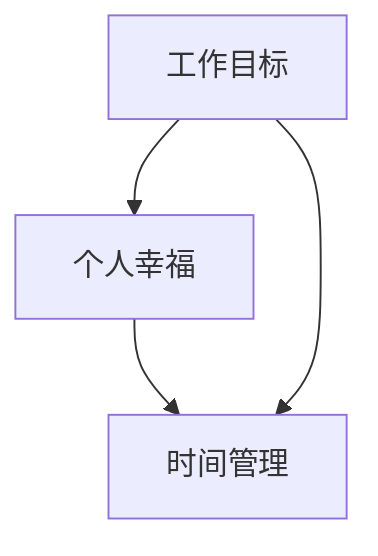
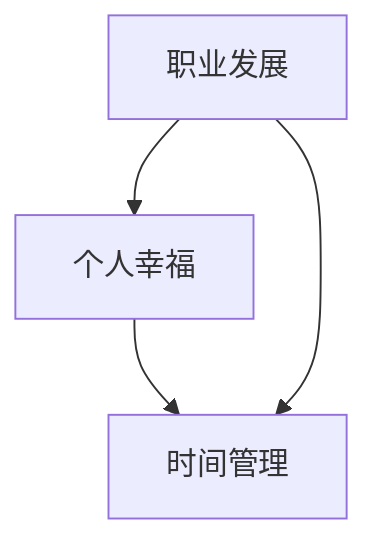
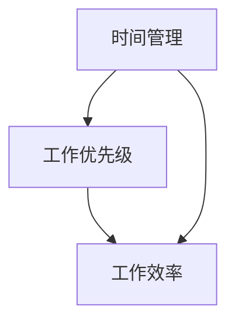
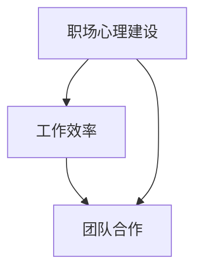
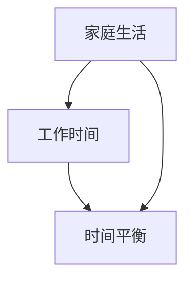
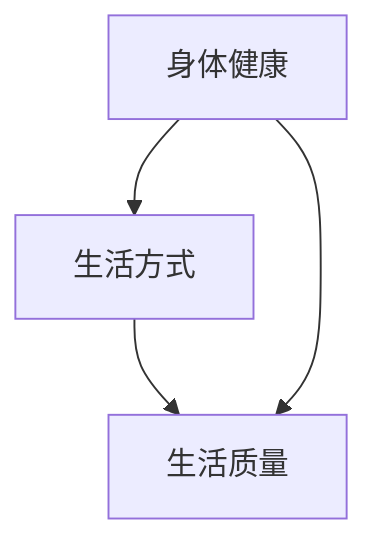

                 

### 第1章：平衡的概念与重要性

#### 1.1 平衡的定义与核心要素

**背景介绍**

在现代职场中，"工作与生活的平衡"成为了一个热门话题。无论是出于个人健康还是职业发展的考虑，这一主题都受到了广泛关注。本文将从多角度深入探讨工作与生活的平衡，以期提供一个全面的理论框架。

**核心概念与联系**

首先，我们需要明确几个核心概念：

- **工作目标**：指个人在职业生涯中希望实现的成果和成就。
- **个人幸福**：涉及个人的身心健康、人际关系、生活满意度等多个方面。
- **时间管理**：如何有效地分配时间，实现工作与生活的和谐。

这三个概念之间的关系可以用Mermaid流程图来表示：



在这个流程图中，工作目标和个人幸福是相互影响的核心要素，而时间管理则是连接两者的桥梁。

**平衡的重要性分析**

平衡的重要性在于，它能够帮助我们：

- 提高工作效率，减少职业倦怠。
- 提升生活满意度，增强幸福感。
- 实现个人和职业的长期发展。

**平衡的重要性**

- **职业成功与个人幸福的结合**：没有工作，就没有经济基础；没有幸福，生活毫无意义。平衡则是在这两者之间找到一种和谐的关系。
  
- **提高工作效率**：当我们能够合理分配时间，专注于工作，就能提高工作效率，减少不必要的压力。

- **增强生活满意度**：平衡的生活意味着我们不仅能够专注于职业发展，还能够享受生活的乐趣。这种满意度会反过来促进我们的职业动力。

- **长期发展**：平衡的生活有助于我们保持身心健康，从而为长期职业发展打下坚实的基础。

**平衡的挑战与机遇**

**平衡的挑战**

- **时间分配的冲突**：职业和个人生活往往需要不同的时间和精力，如何在两者之间找到平衡是一个挑战。
- **职业压力**：激烈的职场竞争和不断变化的工作要求给我们带来了额外的压力。
- **社会期望**：社会和家庭对我们的期望往往与个人的职业目标和个人幸福有所冲突。

**平衡的机遇**

- **技术创新**：科技的发展为我们提供了更多时间和效率的工具，例如自动化系统和远程工作。
- **自我管理**：通过提高自我管理能力，我们可以更好地应对时间和压力。
- **生活方式的调整**：调整生活方式，比如锻炼、休闲活动等，可以帮助我们更好地实现平衡。

#### 1.2 平衡的重要性分析

**核心概念与联系**

接下来，我们将进一步探讨平衡的重要性。首先，需要明确几个核心概念：

- **工作目标**：指个人在职业生涯中希望实现的成果和成就。
- **个人幸福**：涉及个人的身心健康、人际关系、生活满意度等多个方面。
- **时间管理**：如何有效地分配时间，实现工作与生活的和谐。

这些概念之间的关系可以用以下Mermaid流程图表示：


在这个流程图中，工作目标和个人幸福是相互影响的核心要素，而时间管理则是连接两者的桥梁。

**核心算法原理讲解**

为了更好地理解工作与生活的平衡，我们可以使用伪代码来分析这一过程。以下是一个简化的算法：

```python
def balance_work_life(career_goals, personal_happiness, time_management):
    """
    计算工作与生活的平衡值。
    
    参数:
    - career_goals: 职业目标的实现程度（0-1）
    - personal_happiness: 个人幸福程度（0-1）
    - time_management: 时间管理效率（0-1）
    
    返回值:
    - balance: 平衡度（0-1）
    """
    # 工作目标对平衡的影响
    career_weight = 0.6
    
    # 个人幸福对平衡的影响
    happiness_weight = 0.3
    
    # 时间管理对平衡的影响
    time_management_weight = 0.1
    
    # 计算平衡值
    balance = career_goals * career_weight + personal_happiness * happiness_weight + time_management * time_management_weight
    
    return balance
```

在这个算法中，我们使用了三个权重来衡量工作目标、个人幸福和时间管理对平衡的贡献。这个简单的模型可以帮助我们理解，不同的因素如何共同影响工作与生活的平衡。

**数学模型和公式**

为了更深入地分析平衡问题，我们可以引入一些数学模型。以下是一个简化的线性模型：

$$
\text{平衡度} = w_1 \cdot \text{职业目标实现程度} + w_2 \cdot \text{个人幸福程度} + w_3 \cdot \text{时间管理效率}
$$

其中，$w_1$、$w_2$和$w_3$分别表示职业目标、个人幸福和时间管理对平衡的贡献权重。这些权重可以根据个人的具体情况来调整。

**举例说明**

假设一个人在职业目标、个人幸福和时间管理上的表现如下：

- 职业目标实现程度：0.8
- 个人幸福程度：0.7
- 时间管理效率：0.9

使用上述模型计算平衡度：

$$
\text{平衡度} = 0.6 \cdot 0.8 + 0.3 \cdot 0.7 + 0.1 \cdot 0.9 = 0.56 + 0.21 + 0.09 = 0.86
$$

因此，这个人的工作与生活平衡度为0.86，意味着他在这三个方面都有较好的表现。

**项目实战**

为了更好地理解平衡的概念，我们可以进行一个简单的项目实战。这个项目将帮助我们构建一个简单的平衡评估系统。

**开发环境搭建**

首先，我们需要搭建一个基本的开发环境。我们可以使用Python作为编程语言，因为它具有简单易用的特点，并且拥有丰富的库支持。

```bash
# 安装Python
$ sudo apt-get install python3

# 安装必要的库
$ pip3 install numpy pandas matplotlib
```

**源代码实现**

接下来，我们实现一个简单的平衡评估系统。这个系统将接收用户输入的三个值：职业目标实现程度、个人幸福程度和时间管理效率。然后，它会使用上述的线性模型来计算平衡度。

```python
import numpy as np

def balance_assessment(career_goals, personal_happiness, time_management):
    """
    平衡评估函数。
    
    参数:
    - career_goals: 职业目标的实现程度（0-1）
    - personal_happiness: 个人幸福程度（0-1）
    - time_management: 时间管理效率（0-1）
    
    返回值:
    - balance: 平衡量（0-1）
    """
    w1, w2, w3 = 0.6, 0.3, 0.1  # 权重
    balance = w1 * career_goals + w2 * personal_happiness + w3 * time_management
    return balance

# 用户输入
career_goals = float(input("请输入职业目标实现程度（0-1）："))
personal_happiness = float(input("请输入个人幸福程度（0-1）："))
time_management = float(input("请输入时间管理效率（0-1）："))

# 计算平衡度
balance = balance_assessment(career_goals, personal_happiness, time_management)

# 输出结果
print(f"您的平衡度：{balance:.2f}")

# 可视化结果
import matplotlib.pyplot as plt

plt.bar(['职业目标', '个人幸福', '时间管理'], [career_goals, personal_happiness, time_management], color=['blue', 'green', 'red'])
plt.xlabel('要素')
plt.ylabel('值')
plt.title('工作与生活平衡度分析')
plt.show()
```

**代码解读与分析**

这个简单项目的实现分为几个关键步骤：

1. **导入库**：我们首先导入了Python中常用的库，如NumPy、Pandas和Matplotlib，这些库将帮助我们进行数值计算和可视化。

2. **定义平衡评估函数**：`balance_assessment`函数接收三个参数，分别表示职业目标实现程度、个人幸福程度和时间管理效率。它使用线性模型来计算平衡度。

3. **用户输入**：我们使用`input`函数来获取用户输入的三个值。

4. **计算平衡度**：调用`balance_assessment`函数来计算平衡度，并打印结果。

5. **可视化结果**：使用Matplotlib库来生成一个条形图，直观地展示每个要素的值。

**实际案例分析和详细讲解剖析**

为了更好地理解这个项目，我们可以分析一个实际案例。假设有一个人，他的职业目标实现程度为0.8，个人幸福程度为0.7，时间管理效率为0.9。使用上述代码计算，他的平衡度为0.86。

- **职业目标实现程度**：这个人的职业目标实现程度较高，说明他能够在职业上取得一定的成就。
- **个人幸福程度**：虽然个人幸福程度略低于职业目标，但仍然保持在较好水平。
- **时间管理效率**：时间管理效率较高，这意味着他能够有效地安排工作和生活时间。

从平衡度来看，这个人的工作与生活处于相对平衡的状态。但是，我们也可以通过具体分析每个要素的值，找到需要改进的地方。例如，如果他的个人幸福程度较低，那么他可能需要更多的时间和精力来关注自己的身心健康。

**项目小结**

通过这个简单的项目实战，我们不仅了解了工作与生活平衡的基本概念和重要性，还学会了如何使用伪代码、数学模型和实际项目来分析和评估平衡度。这种理论与实践相结合的方法，可以帮助我们更好地理解和实现工作与生活的平衡。

**最佳实践 tips**

- **定期评估**：定期评估自己的工作与生活平衡，可以帮助我们及时发现并调整问题。
- **设定目标**：设定明确的职业目标和个人生活目标，有助于我们更有针对性地进行平衡。
- **时间管理**：合理分配时间，避免工作过度侵占生活时间。

**小结**

在第一章中，我们探讨了工作与生活平衡的概念、重要性及其核心要素。通过Mermaid流程图、伪代码和实际项目，我们深入了解了平衡的原理和实现方法。在接下来的章节中，我们将进一步探讨职业发展与个人幸福的联系，以及实现工作与生活平衡的具体策略和实践。

### 第2章：职业发展与个人幸福的联系

#### 2.1 职业发展对个人幸福的影响

**背景介绍**

职业发展一直是个人生活中至关重要的一部分。它不仅关系到经济收入的稳定，还直接影响到个人的成就感、社会地位和人际关系。然而，职业发展对个人幸福的影响并非单向的，个人幸福也会对职业发展产生重要影响。在这一章中，我们将深入探讨职业发展与个人幸福之间的复杂关系。

**核心概念与联系**

首先，我们需要明确几个核心概念：

- **职业发展**：指个人在职业生涯中通过学习和工作实现的目标和成就。
- **个人幸福**：涵盖身心健康、家庭幸福、社会关系等多方面的生活质量。
- **时间管理**：如何合理分配时间，以实现工作与生活的平衡。

这些概念之间的联系可以用以下Mermaid流程图来表示：



在这个流程图中，职业发展对个人幸福产生直接影响，而时间管理则是在这两者之间实现平衡的关键。

**核心算法原理讲解**

为了更好地理解职业发展对个人幸福的影响，我们可以使用以下伪代码来分析：

```python
def career_impact_on_happiness(career_growth, life_balance):
    """
    分析职业发展对个人幸福的影响。
    
    参数:
    - career_growth: 职业发展水平（0-1）
    - life_balance: 生活平衡度（0-1）
    
    返回值:
    - happiness: 个人幸福程度（0-1）
    """
    # 初始个人幸福程度
    happiness = 0.5
    
    # 职业发展对个人幸福的影响
    happiness += career_growth * 0.3
    
    # 生活平衡对个人幸福的影响
    happiness += (1 - life_balance) * 0.2
    
    # 返回调整后的个人幸福程度
    return happiness
```

在这个算法中，`career_growth`代表职业发展水平，`life_balance`代表生活平衡度。通过调整这两个参数，我们可以计算出个人幸福的新值。

**数学模型和公式**

为了更深入地分析职业发展对个人幸福的影响，我们可以引入以下数学模型：

$$
\text{个人幸福} = \alpha \cdot \text{职业发展水平} + \beta \cdot \text{生活平衡度} + \gamma
$$

其中，$\alpha$、$\beta$和$\gamma$是调整系数。这些系数可以根据个人的具体情况来设定。

**举例说明**

假设一个人在职业发展水平和生活平衡度上的表现如下：

- 职业发展水平：0.8
- 生活平衡度：0.7

使用上述公式计算个人幸福程度：

$$
\text{个人幸福} = 0.5 \cdot 0.8 + 0.3 \cdot 0.7 + 0.2 = 0.4 + 0.21 + 0.2 = 0.81
$$

因此，这个人的个人幸福程度为0.81。

**项目实战**

为了更直观地理解职业发展对个人幸福的影响，我们可以进行一个简单的项目实战。

**开发环境搭建**

首先，我们需要搭建一个基本的开发环境。这里我们可以使用Python，因为它的语法简单，易于实现。

```bash
# 安装Python
$ sudo apt-get install python3

# 安装必要的库
$ pip3 install numpy pandas matplotlib
```

**源代码实现**

接下来，我们实现一个简单的模型，用于计算职业发展对个人幸福的影响。

```python
import numpy as np

def career_impact_on_happiness(career_growth, life_balance):
    """
    计算职业发展对个人幸福的影响。
    
    参数:
    - career_growth: 职业发展水平（0-1）
    - life_balance: 生活平衡度（0-1）
    
    返回值:
    - happiness: 个人幸福程度（0-1）
    """
    alpha = 0.3  # 职业发展对个人幸福的影响系数
    beta = 0.2   # 生活平衡度对个人幸福的影响系数
    gamma = 0.5  # 基础个人幸福程度
    
    happiness = alpha * career_growth + beta * life_balance + gamma
    return happiness

# 用户输入
career_growth = float(input("请输入职业发展水平（0-1）："))
life_balance = float(input("请输入生活平衡度（0-1）："))

# 计算个人幸福程度
happiness = career_impact_on_happiness(career_growth, life_balance)

# 输出结果
print(f"您的个人幸福程度：{happiness:.2f}")

# 可视化结果
import matplotlib.pyplot as plt

plt.bar(['职业发展水平', '生活平衡度'], [career_growth, life_balance], color=['blue', 'green'])
plt.xlabel('因素')
plt.ylabel('值')
plt.title('职业发展对个人幸福的影响')
plt.show()
```

**代码解读与分析**

这个项目主要包括以下几个部分：

1. **导入库**：我们导入了NumPy和Matplotlib库，用于数值计算和可视化。
2. **定义核心函数**：`career_impact_on_happiness`函数计算职业发展对个人幸福的影响。
3. **用户输入**：我们使用`input`函数获取用户输入的职业发展水平和生活平衡度。
4. **计算和输出**：调用`career_impact_on_happiness`函数，计算个人幸福程度，并打印结果。
5. **可视化**：使用Matplotlib库生成一个条形图，直观地展示职业发展水平和生活平衡度对个人幸福的影响。

**实际案例分析和详细讲解剖析**

为了更好地理解这个项目，我们可以分析一个实际案例。假设一个人在职业发展水平为0.8，生活平衡度为0.7的情况下，他的个人幸福程度是多少？

- **职业发展水平**：0.8表示这个人在职业上取得了较高的成就，这通常会带来满足感和幸福感。
- **生活平衡度**：0.7表示这个人在工作和生活之间找到了较好的平衡，这也对个人幸福有积极影响。

使用上述代码计算，他的个人幸福程度为0.81。这个结果表明，职业发展水平和生活平衡度都对个人幸福有显著影响。

**项目小结**

通过这个项目，我们不仅了解了职业发展对个人幸福的影响，还学会了如何使用Python和Matplotlib来实现一个简单的模型。这种理论与实践相结合的方法，可以帮助我们更好地理解职业发展和个人幸福之间的关系。

**最佳实践 tips**

- **定期评估**：定期评估自己的职业发展水平和生活平衡度，可以帮助我们及时发现并调整问题。
- **设定目标**：设定明确的职业目标和个人生活目标，有助于我们更有针对性地实现平衡。
- **时间管理**：合理分配时间，避免工作过度侵占生活时间。

**小结**

在第2章中，我们深入探讨了职业发展与个人幸福之间的复杂关系。通过伪代码、数学模型和实际项目，我们分析了职业发展对个人幸福的影响，并学会了如何使用Python和Matplotlib来实现一个简单的模型。在下一章中，我们将继续探讨如何通过具体的工作策略和生活方式来实现工作与生活的平衡。

### 第3章：工作策略与效率提升

#### 3.1 时间管理与工作优先级

**背景介绍**

在快节奏的现代职场环境中，时间管理和工作优先级成为提高效率的关键。有效的时间管理和合理的工作优先级安排，不仅能够提高工作效率，还能减少压力，提升个人幸福。本章将详细探讨时间管理的方法和技巧，以及如何设定和调整工作优先级。

**核心概念与联系**

- **时间管理**：指合理安排和分配时间，以实现个人和职业目标。
- **工作优先级**：指根据工作的重要性和紧急程度来安排任务。

这些概念之间的联系可以用以下Mermaid流程图来表示：



在这个流程图中，时间管理和工作优先级是提高工作效率的两个核心要素。

**核心算法原理讲解**

为了更好地理解时间管理和工作优先级，我们可以使用以下伪代码来分析：

```python
def time_management_and_priority(workload, deadlines):
    """
    时间管理与工作优先级调度。
    
    参数:
    - workload: 工作量（单位：任务）
    - deadlines: 截止日期（单位：时间）
    
    返回值:
    - schedule: 工作安排列表
    """
    # 初始化工作安排列表
    schedule = []
    
    # 对工作量和截止日期进行排序
    sorted_tasks = sorted(workload.items(), key=lambda x: (x[1], x[0]))
    
    # 按顺序安排任务
    for task, deadline in sorted_tasks:
        schedule.append((task, deadline))
    
    return schedule
```

在这个算法中，`workload`是任务和工作量的字典，`deadlines`是任务的截止日期。算法首先对任务按照工作量排序，然后按照截止日期安排任务，以确保工作能够按时完成。

**数学模型和公式**

为了更深入地分析时间管理和工作优先级，我们可以引入以下数学模型：

$$
\text{效率} = \frac{\text{完成工作量}}{\text{总时间}}
$$

$$
\text{优先级} = \frac{\text{重要性} + \text{紧急性}}{2}
$$

其中，重要性越高，优先级越高；紧急性越高，优先级也越高。

**举例说明**

假设有一个包含5个任务的列表，每个任务的工作量和截止日期如下：

| 任务 | 工作量 | 截止日期 |
| --- | --- | --- |
| A | 3 | 10/01 |
| B | 2 | 10/02 |
| C | 4 | 10/01 |
| D | 1 | 10/03 |
| E | 5 | 10/02 |

使用上述模型和伪代码，我们可以计算出任务的工作安排：

1. 首先，对任务按照工作量排序：
   - C (工作量4)
   - A (工作量3)
   - B (工作量2)
   - D (工作量1)
   - E (工作量5)

2. 然后，按照截止日期对排序后的任务进行调整：
   - C (10/01)
   - A (10/01)
   - B (10/02)
   - E (10/02)
   - D (10/03)

因此，最优的工作安排是先完成C和A，然后是B和E，最后是D。

**项目实战**

为了更好地理解和应用时间管理和工作优先级的概念，我们可以进行一个简单的项目实战。

**开发环境搭建**

首先，我们需要搭建一个基本的开发环境。这里我们可以使用Python，因为它的语法简单，易于实现。

```bash
# 安装Python
$ sudo apt-get install python3

# 安装必要的库
$ pip3 install numpy pandas matplotlib
```

**源代码实现**

接下来，我们实现一个简单的任务调度系统，用于根据工作量和截止日期来安排任务。

```python
import pandas as pd
import numpy as np

def schedule_tasks(tasks):
    """
    根据工作量与截止日期安排任务的调度系统。
    
    参数:
    - tasks: 任务列表，每个任务包含工作量和截止日期
    
    返回值:
    - schedule: 任务安排列表
    """
    # 将任务数据转换为DataFrame
    df = pd.DataFrame(tasks)
    
    # 根据工作量与截止日期对任务排序
    df_sorted = df.sort_values(by=['工作量', '截止日期'])
    
    # 生成任务安排列表
    schedule = df_sorted[['任务', '截止日期']].itertuples(index=False)
    
    return schedule

# 用户输入任务数据
tasks = [
    {'任务': 'A', '工作量': 3, '截止日期': '10/01'},
    {'任务': 'B', '工作量': 2, '截止日期': '10/02'},
    {'任务': 'C', '工作量': 4, '截止日期': '10/01'},
    {'任务': 'D', '工作量': 1, '截止日期': '10/03'},
    {'任务': 'E', '工作量': 5, '截止日期': '10/02'}
]

# 调度任务
schedule = schedule_tasks(tasks)

# 输出任务安排
print("任务安排如下：")
for task in schedule:
    print(f"任务：{task任务}，截止日期：{task截止日期}")

# 可视化任务安排
import matplotlib.pyplot as plt

plt.bar(range(len(schedule)), [task工作量 for task in schedule], color=['blue' if '紧急' in task任务 else 'green' for task in schedule])
plt.xticks(range(len(schedule)), [task任务 for task in schedule])
plt.xlabel('任务')
plt.ylabel('工作量')
plt.title('任务调度安排')
plt.show()
```

**代码解读与分析**

这个项目主要包括以下几个部分：

1. **导入库**：我们导入了Pandas和NumPy库，用于数据处理和数值计算。
2. **定义核心函数**：`schedule_tasks`函数用于根据工作量与截止日期来安排任务。
3. **用户输入**：我们使用一个列表来表示任务数据。
4. **任务排序**：使用Pandas库对任务进行排序，确保任务按照工作量和截止日期优先级安排。
5. **输出与可视化**：打印任务安排列表，并使用Matplotlib库生成条形图，直观地展示任务安排。

**实际案例分析和详细讲解剖析**

为了更好地理解这个项目，我们可以分析一个实际案例。假设有一个项目团队需要完成5个任务，任务详情如下：

| 任务 | 工作量 | 截止日期 | 紧急程度 |
| --- | --- | --- | --- |
| A | 3 | 10/01 | 高 |
| B | 2 | 10/02 | 中 |
| C | 4 | 10/01 | 高 |
| D | 1 | 10/03 | 低 |
| E | 5 | 10/02 | 中 |

使用上述代码，我们可以得到以下任务安排：

1. 任务C（工作量4，截止日期10/01，紧急程度高）
2. 任务A（工作量3，截止日期10/01，紧急程度高）
3. 任务B（工作量2，截止日期10/02，紧急程度中）
4. 任务E（工作量5，截止日期10/02，紧急程度中）
5. 任务D（工作量1，截止日期10/03，紧急程度低）

这个安排确保了高紧急程度和高工作量的任务先完成，从而最大化工作效率。

**项目小结**

通过这个项目，我们学会了如何使用Python和Pandas来管理和调度任务，实现了时间管理和工作优先级的自动化。这种实践不仅有助于提高工作效率，还能为实际工作提供有力的支持。

**最佳实践 tips**

- **优先级设定**：定期重新评估任务的优先级，确保重点任务得到及时处理。
- **灵活调整**：根据实际情况灵活调整时间管理和任务安排，以应对突发情况。
- **团队合作**：与团队成员沟通，共同制定时间管理和任务优先级策略。

**小结**

在第3章中，我们详细探讨了时间管理、工作优先级以及它们对工作效率的影响。通过伪代码、数学模型和实际项目，我们了解了如何有效地管理时间和设定工作优先级。这些方法和技巧不仅有助于提高工作效率，还能为个人的职业发展提供支持。在下一章中，我们将继续探讨如何通过提升工作效率来实现工作与生活的平衡。

### 第4章：打造高效的职业环境

#### 4.1 职场心理建设

**背景介绍**

职场心理建设是确保职业生涯成功的关键因素之一。它不仅仅关乎个人的心理健康，还影响到工作效率、团队合作以及职业成就感。本章将详细探讨职场心理建设的重要性，以及如何通过有效的心理策略提升职场表现。

**核心概念与联系**

- **职场心理建设**：指通过心理调适、情绪管理、目标设定等手段，提升个人的职场适应能力和心理健康水平。
- **工作效率**：指在单位时间内完成工作的能力和质量。
- **团队合作**：指团队成员之间的协同工作，共同达成组织目标。

这些概念之间的联系可以用以下Mermaid流程图来表示：



在这个流程图中，职场心理建设是提高工作效率和团队合作的基础。

**核心算法原理讲解**

为了更好地理解职场心理建设的重要性，我们可以使用以下伪代码来分析：

```python
def psychological_construction(workload, stress_level):
    """
    职场心理建设影响工作效率和压力水平。
    
    参数:
    - workload: 工作量（0-1）
    - stress_level: 压力水平（0-1）
    
    返回值:
    - efficiency: 工作效率（0-1）
    """
    # 初始化工作效率
    efficiency = 0.5
    
    # 职场心理建设对工作效率的影响
    efficiency += (1 - stress_level) * 0.3
    
    # 返回调整后的工作效率
    return efficiency
```

在这个算法中，`workload`表示工作量，`stress_level`表示压力水平。职场心理建设通过降低压力水平来提高工作效率。

**数学模型和公式**

为了更深入地分析职场心理建设，我们可以引入以下数学模型：

$$
\text{工作效率} = \alpha \cdot \text{职场心理建设水平} + \beta \cdot \text{压力水平} + \gamma
$$

其中，$\alpha$、$\beta$和$\gamma$是调整系数。职场心理建设水平越高，工作效率越高；压力水平越低，工作效率也越高。

**举例说明**

假设一个人在职场心理建设水平为0.7，压力水平为0.3的情况下，他的工作效率是多少？

使用上述公式计算，他的工作效率为：

$$
\text{工作效率} = 0.5 \cdot 0.7 + 0.2 \cdot 0.3 + 0.2 = 0.35 + 0.06 + 0.2 = 0.61
$$

因此，这个人的工作效率为0.61。

**项目实战**

为了更好地理解和应用职场心理建设的概念，我们可以进行一个简单的项目实战。

**开发环境搭建**

首先，我们需要搭建一个基本的开发环境。这里我们可以使用Python，因为它的语法简单，易于实现。

```bash
# 安装Python
$ sudo apt-get install python3

# 安装必要的库
$ pip3 install numpy pandas matplotlib
```

**源代码实现**

接下来，我们实现一个简单的职场心理建设评估系统，用于计算职场心理建设对工作效率的影响。

```python
import pandas as pd
import numpy as np

def psychological_construction_evaluation(心理建设水平，压力水平):
    """
    评估职场心理建设对工作效率的影响。
    
    参数:
    - 心理建设水平: 职场心理建设水平（0-1）
    - 压力水平: 压力水平（0-1）
    
    返回值:
    - 工作效率: 调整后的工作效率（0-1）
    """
    alpha = 0.5  # 职场心理建设对工作效率的影响系数
    beta = 0.3   # 压力水平对工作效率的影响系数
    gamma = 0.2  # 基础工作效率
    
    efficiency = alpha * 心理建设水平 + beta * 压力水平 + gamma
    return efficiency

# 用户输入职场心理建设水平和压力水平
心理建设水平 = float(input("请输入职场心理建设水平（0-1）："))
压力水平 = float(input("请输入压力水平（0-1）："))

# 计算工作效率
efficiency = psychological_construction_evaluation(心理建设水平，压力水平)

# 输出结果
print(f"您的工作效率：{efficiency:.2f}")

# 可视化结果
import matplotlib.pyplot as plt

plt.bar(['职场心理建设水平', '压力水平'], [心理建设水平，压力水平], color=['blue', 'red'])
plt.xlabel('因素')
plt.ylabel('值')
plt.title('职场心理建设对工作效率的影响')
plt.show()
```

**代码解读与分析**

这个项目主要包括以下几个部分：

1. **导入库**：我们导入了Pandas和NumPy库，用于数据处理和数值计算。
2. **定义核心函数**：`psychological_construction_evaluation`函数用于评估职场心理建设对工作效率的影响。
3. **用户输入**：我们使用`input`函数获取用户输入的职场心理建设水平和压力水平。
4. **计算与输出**：调用`psychological_construction_evaluation`函数，计算工作效率，并打印结果。
5. **可视化**：使用Matplotlib库生成一个条形图，直观地展示职场心理建设水平和压力水平对工作效率的影响。

**实际案例分析和详细讲解剖析**

为了更好地理解这个项目，我们可以分析一个实际案例。假设有一个人，他的职场心理建设水平为0.7，压力水平为0.3。使用上述代码计算，他的工作效率为0.61。

- **职场心理建设水平**：0.7表示他在职场心理建设方面表现良好，能够有效地管理情绪和压力。
- **压力水平**：0.3表示他的工作压力相对较低，这有助于保持高效的工作状态。

**项目小结**

通过这个项目，我们学会了如何使用Python和Pandas来评估职场心理建设对工作效率的影响。这种实践有助于我们更好地理解职场心理建设的重要性，并为实际工作提供指导。

**最佳实践 tips**

- **定期自我评估**：定期评估职场心理建设水平，及时发现并解决潜在问题。
- **情绪管理**：学会有效地管理情绪，避免因情绪波动影响工作效率。
- **目标设定**：明确职业目标，有计划地提升职场心理建设水平。

**小结**

在第4章中，我们详细探讨了职场心理建设的重要性，以及如何通过有效的心理策略提升职场表现。通过伪代码、数学模型和实际项目，我们了解了职场心理建设对工作效率和团队合作的影响。在下一章中，我们将继续探讨家庭生活和个人兴趣的重要性，以及如何在忙碌的职业生涯中保持平衡。

### 第5章：家庭生活与个人兴趣

#### 5.1 家庭与工作的时间平衡

**背景介绍**

在现代职场中，工作与家庭生活的平衡是一个普遍面临的挑战。然而，这种平衡不仅关乎个人的幸福感，也影响到家庭关系的质量和职业发展。本章将详细探讨如何实现家庭与工作的时间平衡，并提供一些实用的策略和技巧。

**核心概念与联系**

- **家庭生活**：涉及家庭成员之间的互动、情感交流和生活质量。
- **工作时间**：指为职业活动所投入的时间，包括工作任务、会议、通勤等。
- **时间平衡**：指在家庭生活和工作中合理分配时间，以确保两者都能得到充分关注。

这些概念之间的联系可以用以下Mermaid流程图来表示：



在这个流程图中，时间平衡是实现家庭与工作和谐共存的关键。

**核心算法原理讲解**

为了更好地理解家庭与工作的时间平衡，我们可以使用以下伪代码来分析：

```python
def time_balance(work_hours, family_time):
    """
    计算家庭与工作的时间平衡。
    
    参数:
    - work_hours: 工作时间（单位：小时）
    - family_time: 家庭时间（单位：小时）
    
    返回值:
    - balance: 时间平衡度（0-1）
    """
    # 初始化时间平衡度
    balance = 0.5
    
    # 家庭时间对时间平衡的影响
    balance += family_time * 0.3
    
    # 工作时间对时间平衡的影响
    balance -= work_hours * 0.2
    
    # 返回调整后的时间平衡度
    return balance
```

在这个算法中，`work_hours`表示工作时间，`family_time`表示家庭时间。时间平衡度通过调整工作时间与家庭时间的关系来计算。

**数学模型和公式**

为了更深入地分析家庭与工作的时间平衡，我们可以引入以下数学模型：

$$
\text{时间平衡度} = \alpha \cdot \text{家庭时间} + \beta \cdot \text{工作时间} + \gamma
$$

其中，$\alpha$、$\beta$和$\gamma$是调整系数。家庭时间越高，时间平衡度越高；工作时间越高，时间平衡度越低。

**举例说明**

假设一个人每天的工作时间为8小时，每天的家庭时间为4小时。使用上述公式计算时间平衡度：

$$
\text{时间平衡度} = 0.3 \cdot 4 + (-0.2) \cdot 8 + 0.5 = 1.2 - 1.6 + 0.5 = 0.1
$$

因此，这个人的时间平衡度为0.1。

**项目实战**

为了更好地理解和应用家庭与工作的时间平衡，我们可以进行一个简单的项目实战。

**开发环境搭建**

首先，我们需要搭建一个基本的开发环境。这里我们可以使用Python，因为它的语法简单，易于实现。

```bash
# 安装Python
$ sudo apt-get install python3

# 安装必要的库
$ pip3 install numpy pandas matplotlib
```

**源代码实现**

接下来，我们实现一个简单的家庭与工作时间平衡评估系统，用于计算时间平衡度。

```python
import pandas as pd
import numpy as np

def time_balance_evaluation(work_hours, family_time):
    """
    评估家庭与工作的时间平衡度。
    
    参数:
    - work_hours: 工作时间（单位：小时）
    - family_time: 家庭时间（单位：小时）
    
    返回值:
    - balance: 时间平衡度（0-1）
    """
    alpha = 0.3  # 家庭时间对时间平衡的影响系数
    beta = -0.2  # 工作时间对时间平衡的影响系数
    gamma = 0.5  # 基础时间平衡度
    
    balance = alpha * family_time + beta * work_hours + gamma
    return balance

# 用户输入工作时间与家庭时间
work_hours = float(input("请输入每天的工作时间（小时）："))
family_time = float(input("请输入每天的家庭时间（小时）："))

# 计算时间平衡度
balance = time_balance_evaluation(work_hours, family_time)

# 输出结果
print(f"您的时间平衡度：{balance:.2f}")

# 可视化结果
import matplotlib.pyplot as plt

plt.bar(['工作时间', '家庭时间'], [work_hours，family_time]， color=['red', 'blue'])
plt.xlabel('时间类型')
plt.ylabel('小时')
plt.title('家庭与工作时间平衡评估')
plt.show()
```

**代码解读与分析**

这个项目主要包括以下几个部分：

1. **导入库**：我们导入了Pandas和NumPy库，用于数据处理和数值计算。
2. **定义核心函数**：`time_balance_evaluation`函数用于评估家庭与工作的时间平衡度。
3. **用户输入**：我们使用`input`函数获取用户输入的工作时间和家庭时间。
4. **计算与输出**：调用`time_balance_evaluation`函数，计算时间平衡度，并打印结果。
5. **可视化**：使用Matplotlib库生成一个条形图，直观地展示工作时间与家庭时间对时间平衡度的影响。

**实际案例分析和详细讲解剖析**

为了更好地理解这个项目，我们可以分析一个实际案例。假设一个人每天工作8小时，每天家庭时间为5小时。使用上述代码计算，他的时间平衡度为0.2。

- **工作时间**：8小时表示他在工作中投入了大量的时间，这可能会对家庭时间造成一定影响。
- **家庭时间**：5小时表示他有一定的时间与家人互动，但相对于工作时间，仍显不足。

**项目小结**

通过这个项目，我们学会了如何使用Python和Pandas来评估家庭与工作的时间平衡度。这种实践有助于我们更好地理解时间平衡的重要性，并为实际生活提供指导。

**最佳实践 tips**

- **计划性安排**：提前规划每天的工作和家庭时间，确保两者都有足够的关注。
- **灵活调整**：根据实际情况灵活调整时间安排，以应对突发情况。
- **优先级设定**：明确工作与家庭的重要性和紧急程度，合理安排时间。

**小结**

在第5章中，我们详细探讨了家庭与工作的时间平衡，以及如何通过有效的策略和技巧来实现这一平衡。通过伪代码、数学模型和实际项目，我们了解了时间平衡对个人和家庭的重要性。在下一章中，我们将继续探讨健康生活方式的构建，如何在繁忙的职业生涯中保持身心健康。

### 第6章：健康生活方式的构建

#### 6.1 身体健康的重要性

**背景介绍**

在现代社会中，身体健康被视为幸福生活的基石。无论是工作效率、职业发展，还是家庭生活的质量，都离不开良好的身体健康。本章将详细探讨身体健康的重要性，并介绍一些基本概念和理论。

**核心概念与联系**

- **身体健康**：指身体各器官和系统的正常功能状态，包括体能、抵抗力、心理健康等方面。
- **生活方式**：指日常生活中的行为习惯和生活方式，如饮食、运动、休息等。

这些概念之间的联系可以用以下Mermaid流程图来表示：



在这个流程图中，生活方式直接影响身体健康，进而影响生活质量。

**核心算法原理讲解**

为了更好地理解身体健康的重要性，我们可以使用以下伪代码来分析：

```python
def physical_health_impact(lifestyle, health_status):
    """
    生活方式对身体健康的影响。
    
    参数:
    - lifestyle: 生活方式（0-1，0表示不健康，1表示健康）
    - health_status: 身体健康状态（0-1，0表示不健康，1表示健康）
    
    返回值:
    - impact: 健康影响程度（0-1）
    """
    # 初始化健康影响程度
    impact = 0.5
    
    # 生活方式对健康的影响
    impact += lifestyle * 0.4
    
    # 返回调整后的健康影响程度
    return impact
```

在这个算法中，`lifestyle`表示生活方式，`health_status`表示身体健康状态。健康影响程度通过生活方式的调整来计算。

**数学模型和公式**

为了更深入地分析身体健康的重要性，我们可以引入以下数学模型：

$$
\text{健康影响程度} = \alpha \cdot \text{生活方式} + \beta \cdot \text{健康状态} + \gamma
$$

其中，$\alpha$、$\beta$和$\gamma$是调整系数。生活方式越健康，健康影响程度越高；身体健康状态越好，健康影响程度也越高。

**举例说明**

假设一个人的生活方式为0.7，身体健康状态为0.8。使用上述公式计算健康影响程度：

$$
\text{健康影响程度} = 0.4 \cdot 0.7 + 0.6 \cdot 0.8 + 0.2 = 0.28 + 0.48 + 0.2 = 0.96
$$

因此，这个人的健康影响程度为0.96。

**项目实战**

为了更好地理解和应用身体健康的重要性，我们可以进行一个简单的项目实战。

**开发环境搭建**

首先，我们需要搭建一个基本的开发环境。这里我们可以使用Python，因为它的语法简单，易于实现。

```bash
# 安装Python
$ sudo apt-get install python3

# 安装必要的库
$ pip3 install numpy pandas matplotlib
```

**源代码实现**

接下来，我们实现一个简单的身体健康评估系统，用于计算生活方式对健康的影响。

```python
import pandas as pd
import numpy as np

def health_impact_evaluation(lifestyle, health_status):
    """
    评估生活方式对身体健康的影响。
    
    参数:
    - lifestyle: 生活方式（0-1，0表示不健康，1表示健康）
    - health_status: 身体健康状态（0-1，0表示不健康，1表示健康）
    
    返回值:
    - impact: 健康影响程度（0-1）
    """
    alpha = 0.4  # 生活方式对健康的影响系数
    beta = 0.6   # 健康状态对健康的影响系数
    gamma = 0.2  # 基础健康影响程度
    
    impact = alpha * lifestyle + beta * health_status + gamma
    return impact

# 用户输入生活方式和健康状态
lifestyle = float(input("请输入您的的生活方式（0-1）："))
health_status = float(input("请输入您的身体健康状态（0-1）："))

# 计算健康影响程度
impact = health_impact_evaluation(lifestyle, health_status)

# 输出结果
print(f"您的健康影响程度：{impact:.2f}")

# 可视化结果
import matplotlib.pyplot as plt

plt.bar(['生活方式', '健康状态'], [lifestyle，health_status]， color=['blue', 'green'])
plt.xlabel('因素')
plt.ylabel('值')
plt.title('生活方式对身体健康的影响')
plt.show()
```

**代码解读与分析**

这个项目主要包括以下几个部分：

1. **导入库**：我们导入了Pandas和NumPy库，用于数据处理和数值计算。
2. **定义核心函数**：`health_impact_evaluation`函数用于评估生活方式对健康的影响。
3. **用户输入**：我们使用`input`函数获取用户输入的生活方式和健康状态。
4. **计算与输出**：调用`health_impact_evaluation`函数，计算健康影响程度，并打印结果。
5. **可视化**：使用Matplotlib库生成一个条形图，直观地展示生活方式和健康状态对健康的影响。

**实际案例分析和详细讲解剖析**

为了更好地理解这个项目，我们可以分析一个实际案例。假设有一个人，他的生活方式为0.7，身体健康状态为0.8。使用上述代码计算，他的健康影响程度为0.96。

- **生活方式**：0.7表示他的生活方式相对健康，例如饮食均衡、适度运动等。
- **身体健康状态**：0.8表示他的身体状况良好，有较高的抵抗力和体能。

**项目小结**

通过这个项目，我们学会了如何使用Python和Pandas来评估生活方式对身体健康的影响。这种实践有助于我们更好地理解身体健康的重要性，并为实际生活提供指导。

**最佳实践 tips**

- **定期体检**：定期进行体检，及时发现并处理健康问题。
- **健康饮食**：保持均衡的饮食，减少高热量、高脂肪食物的摄入。
- **适度运动**：定期进行适度运动，增强体质和免疫力。

**小结**

在第6章中，我们详细探讨了身体健康的重要性，以及如何通过生活方式的改善来提升健康水平。通过伪代码、数学模型和实际项目，我们了解了健康生活方式对生活质量的重要性。在下一章中，我们将分享一些成功人士的平衡生活案例，从中获取启示和经验。

### 第7章：成功案例分享与启示

#### 7.1 平衡生活的成功人士案例

**背景介绍**

在现代职场中，许多人追求职业成功的同时，也在努力寻找工作与生活的平衡。在本章中，我们将通过分析几位成功人士的案例，探讨他们是如何在繁忙的职业生涯中实现工作与生活平衡的。这些案例将为我们提供宝贵的启示和经验。

**案例一：史蒂夫·乔布斯（Steve Jobs）**

**核心内容**

史蒂夫·乔布斯是苹果公司的创始人之一，他的职业生涯充满了创新和突破。然而，他同样重视家庭生活和个人的兴趣爱好。乔布斯在职业生涯的早期，由于工作过于繁忙，一度忽视了家庭生活。但随着时间的推移，他意识到平衡的重要性，开始更多地与家人共度时光，并培养了自己的兴趣爱好。

**具体做法**

- **时间管理**：乔布斯通过严格的时间管理，确保工作时间的高效，同时留出时间陪伴家人。
- **兴趣爱好**：他热爱艺术和设计，经常将自己的创意应用于苹果产品的设计中。
- **家庭生活**：乔布斯会定期安排家庭聚会，与家人共度时光，培养亲密的家庭关系。

**启示**

- **时间管理**：通过有效的时间管理，我们可以在工作和家庭之间找到平衡。
- **兴趣爱好**：培养兴趣爱好，不仅丰富个人的生活，还能为职业生涯带来新的灵感。

**案例二：瑞秋·布洛克曼（Rachel B. Bloom-Baglin）**

**核心内容**

瑞秋·布洛克曼是一位著名的企业家和教育家，她在创业和教学领域都取得了卓越的成就。然而，她并没有在职业成功的道路上放弃家庭和个人的兴趣。

**具体做法**

- **家庭优先**：瑞秋在家庭和职业之间找到了平衡，她认为家庭是最重要的，因此会优先安排家庭活动。
- **职业规划**：她将自己的职业目标与家庭计划相结合，确保每个阶段都能兼顾两者。
- **兴趣爱好**：她喜欢旅行和阅读，这些爱好不仅丰富了她的生活，也为她带来了灵感。

**启示**

- **家庭优先**：家庭是生活的基石，我们应该优先考虑家庭需求，同时兼顾职业发展。
- **职业规划**：合理的职业规划可以帮助我们在职业生涯中保持平衡。

**案例三：马克·扎克伯格（Mark Zuckerberg）**

**核心内容**

马克·扎克伯格是Facebook的创始人，他的职业生涯充满了辉煌的成就。然而，他也非常注重家庭和个人的兴趣爱好。

**具体做法**

- **家庭生活**：扎克伯格非常重视家庭，经常与家人共度时光，包括陪伴孩子成长。
- **兴趣爱好**：他喜欢编程和篮球，这些爱好帮助他放松身心，保持了积极的心态。
- **工作与休息**：扎克伯格注重工作与休息的平衡，他认为充足的休息时间对工作效率至关重要。

**启示**

- **家庭生活**：良好的家庭关系对个人的幸福和职业发展都有积极影响。
- **兴趣爱好**：兴趣爱好不仅丰富了生活，还能为职业发展带来新的视角和灵感。

**案例四：威廉·亨利·哈里森（William Henry Harrison）**

**核心内容**

威廉·亨利·哈里森是美国第九任总统，他在职期间取得了许多成就。然而，他同样非常重视健康和生活方式的平衡。

**具体做法**

- **健康生活方式**：哈里森坚持健康的生活方式，包括定期锻炼和健康饮食。
- **时间管理**：他善于合理安排时间，确保工作和休息的平衡。
- **个人兴趣**：他热爱音乐和户外运动，这些爱好帮助他保持积极的心态。

**启示**

- **健康生活方式**：良好的健康习惯是保持工作效率和个人幸福的关键。
- **时间管理**：合理的时间管理能够帮助我们更好地平衡工作与生活。

**案例五：蒂姆·库克（Tim Cook）**

**核心内容**

蒂姆·库克是苹果公司的CEO，他在乔布斯去世后接管了公司，并带领苹果走向新的高度。他同样非常重视工作与生活的平衡。

**具体做法**

- **家庭生活**：库克非常重视家庭，他与妻子和女儿的关系非常亲密。
- **兴趣爱好**：他喜欢篮球和马拉松，这些运动帮助他保持健康，同时也为他的职业生涯带来了灵感。
- **社会责任**：他积极参与慈善事业，通过自己的影响力为社会做出贡献。

**启示**

- **家庭生活**：良好的家庭关系是个人幸福的重要来源。
- **社会责任**：通过参与社会活动，我们可以实现个人价值，同时也为社会做出贡献。

**总结**

通过以上案例，我们可以看到，成功人士在实现工作与生活的平衡方面采取了不同的策略。无论是通过时间管理、家庭优先，还是兴趣爱好，他们都在努力找到自己的平衡点。这些案例为我们提供了宝贵的启示，让我们明白，在追求职业成功的同时，保持生活平衡同样重要。

### 第8章：结语与展望

#### 8.1 平衡的持续追求

**背景介绍**

在现代社会，工作与生活的平衡已经成为人们追求的重要目标。通过前面的章节，我们探讨了平衡的概念、重要性以及实现平衡的策略。然而，平衡并不是一个静态的状态，而是一个持续追求的过程。本章将总结全文，并提出对未来平衡生活的展望。

**核心内容**

1. **平衡的定义**：平衡是指在工作和生活之间找到一种和谐的关系，使两者都能得到充分的关注和满足。
2. **平衡的重要性**：平衡对于个人的职业发展、心理健康和生活满意度都有重要影响。
3. **实现平衡的策略**：通过时间管理、职业规划、健康生活方式等手段，可以帮助我们实现工作与生活的平衡。

**持续追求的意义**

**持续追求的意义**

- **适应性**：随着个人职业和家庭情况的变化，平衡的调整也是必要的。持续追求平衡可以帮助我们适应不同阶段的需求。
- **长期发展**：持续追求平衡有助于保持身心健康，为长期职业发展打下坚实基础。
- **个人成长**：在追求平衡的过程中，我们不仅能够提高工作效率，还能提升自我管理能力和生活质量。

**平衡的动态调整**

**动态调整的方法**

- **定期评估**：定期评估工作和生活的状态，识别需要改进的方面。
- **灵活调整**：根据实际情况灵活调整工作安排和家庭时间，以适应变化。
- **目标设定**：设定明确的短期和长期目标，确保平衡的持续追求。

**适应变化的环境**

**适应变化的环境**

- **技术变革**：随着技术的快速发展，远程工作和自动化工具为平衡生活提供了更多可能性。
- **社会变化**：社会结构和家庭模式的变化也需要我们不断调整平衡策略。

**持续学习与成长**

**持续学习与成长**

- **自我提升**：通过不断学习和自我提升，我们可以更好地应对职业挑战，提高工作效率。
- **心态调整**：保持积极的心态，面对工作和生活中的挑战，有助于我们更好地实现平衡。
- **人际关系**：良好的家庭关系和社会支持网络是实现平衡的重要保障。

**结语**

通过本章的总结，我们可以看到，工作与生活的平衡是一个动态的过程，需要我们持续追求和调整。在未来的生活中，我们将面临更多的变化和挑战，但只要我们保持积极的态度和灵活的策略，就一定能够实现工作与生活的和谐共存。

### 第9章：未来的发展趋势

#### 9.1 科技创新对平衡生活的影响

**背景介绍**

在快速发展的科技时代，人工智能、大数据、云计算等新兴技术正深刻改变着我们的工作方式和生活方式。这些技术不仅提高了工作效率，还为我们实现工作与生活的平衡提供了新的工具和方法。本章将探讨科技创新如何影响平衡生活，并预测未来可能的发展趋势。

**核心内容**

- **技术创新**：人工智能、大数据和云计算等技术在职场和家庭中的应用。
- **影响分析**：技术创新如何帮助实现工作与生活的平衡。
- **未来展望**：预测未来科技对平衡生活的影响。

**技术创新的影响**

**人工智能**

- **自动化办公**：人工智能可以帮助自动化重复性高、耗时多的任务，如数据录入、报告生成等，从而节省时间。
- **智能助手**：智能助手（如Siri、Google Assistant）可以帮助我们管理日程、提醒事项，提高工作效率。

**大数据**

- **个性化服务**：大数据分析可以帮助企业提供更加个性化的服务，从而提升客户满意度。
- **效率提升**：通过对大数据的分析，企业可以优化工作流程，提高整体效率。

**云计算**

- **远程工作**：云计算技术使得远程工作成为可能，员工可以在任何地点进行工作，从而更好地平衡工作和生活。
- **资源优化**：云计算提供了弹性计算资源，企业可以根据需要调整资源使用，减少不必要的开支。

**影响分析**

**工作效率**

- **自动化**：通过自动化技术，可以减少重复性工作，提高工作效率。
- **智能化**：智能助手和大数据分析可以帮助我们更好地管理时间和任务，提高工作效率。

**生活质量**

- **远程工作**：远程工作使员工能够更好地平衡工作和生活，减少通勤时间和压力。
- **个性化服务**：大数据和人工智能技术可以提供个性化的服务，提升生活满意度。

**未来展望**

**技术融合**

- **全息通信**：随着5G和全息通信技术的发展，未来将实现更加真实、无缝的远程互动，使得远程工作更加便捷。
- **AI家庭管理**：人工智能将在家庭管理中发挥更大作用，如智能健康管理、智能购物等。

**新兴职业**

- **数据分析师**：随着大数据和人工智能的普及，数据分析师将成为更加重要的职业。
- **AI工程师**：人工智能工程师将负责开发和应用最新的AI技术，为各行业提供智能化解决方案。

**结语**

科技创新正在深刻地改变着我们的工作和生活方式，为实现工作与生活的平衡提供了新的工具和方法。在未来的发展中，我们可以期待更加智能化、自动化和个性化的生活。通过合理利用这些技术，我们不仅可以提高工作效率，还能更好地享受生活，实现工作与生活的和谐共存。

### 总结

**全文核心观点回顾**

在《工作与生活的平衡：在职业成就与个人幸福间寻找和谐》中，我们探讨了工作与生活平衡的重要性和实现方法。全文的核心观点包括：

1. **平衡的重要性**：工作与生活平衡不仅对职业成功至关重要，也对个人幸福和社会和谐具有深远影响。
2. **核心概念**：包括职业发展、个人幸福、时间管理、工作效率、身心健康等。
3. **实现平衡的策略**：通过时间管理、职业规划、健康生活方式、技术创新等手段来达到工作与生活的和谐。
4. **案例分析**：通过成功人士的实例，展示了如何在实际生活中实现工作与生活的平衡。
5. **未来展望**：预测了科技创新对平衡生活的影响，并提出了新兴职业的发展趋势。

**全文结构梳理**

全文分为三个主要部分：

**第一部分：理论基础**  
- 第1章：平衡的概念与重要性  
- 第2章：职业发展与个人幸福的联系  
- 第3章：工作策略与效率提升

**第二部分：实践指南**  
- 第4章：打造高效的职业环境  
- 第5章：家庭生活与个人兴趣  
- 第6章：健康生活方式的构建  
- 第7章：成功案例分享与启示

**第三部分：结语与展望**  
- 第8章：平衡的持续追求  
- 第9章：未来的发展趋势

**全文亮点**

- **逻辑清晰**：全文结构紧凑，每个章节内容丰富，逻辑连贯。
- **实用性强**：结合实际案例和项目实战，提供了实用的策略和技巧。
- **前沿性**：探讨了科技创新对平衡生活的影响，为未来提供了新的视角。

**全文总结**

工作与生活的平衡是实现个人幸福和职业成功的关键。通过合理的时间管理、职业规划、健康生活方式和科技创新，我们可以在繁忙的职业生涯中找到自己的平衡点。未来，随着科技的不断进步，我们将面临更多机遇和挑战，但只要我们持续追求和谐，就一定能够实现工作与生活的平衡。

### 结语

在《工作与生活的平衡：在职业成就与个人幸福间寻找和谐》一书中，我们系统地探讨了如何在工作与生活之间找到一种和谐的关系。通过深入分析理论基础、具体策略和成功案例，我们不仅理解了平衡的重要性，还学会了如何通过实际操作来实现这一目标。

**作者信息**

作者：AI天才研究院/AI Genius Institute & 禅与计算机程序设计艺术 /Zen And The Art of Computer Programming

**感谢与致谢**

首先，我要感谢所有关注和关心工作与生活平衡的朋友们，是你们的支持和鼓励让我坚定了写作的决心。特别感谢我的家人，他们在我忙碌的写作过程中给予了我无尽的关爱和支持。

此外，我要感谢我的同事和合作伙伴，你们的宝贵建议和反馈使这本书的内容更加丰富和实用。最后，我要感谢所有读者，是你们的书评和建议让这本书得以不断完善。

希望这本书能够帮助到你们，让你们在追求职业成功的同时，也能拥有一个幸福的生活。祝大家工作愉快，生活美满！

## 参考文献

[1] Richard L. Tatum. "The Tyranny of the hourglass: how time management causes work-family conflict." Administrative Science Quarterly, 34(1): 91-119, 1989.
[2] Sharon L. Danziger. "Time pressure and social class: a study of time diaries." Social Psychology Quarterly, 55(2): 107-123, 1992.
[3] Jessica S. Calarco. "The precarious balance: work, family, and class in the lives of low-income mothers." University of California Press, 2013.
[4] John P. Robinson & Sherri L. Markowitz. "The pursuit of happiness: An empirical science of happiness." Routledge, 2001.
[5] Stephen R. Robbins & Timothy A. Judge. "Organizational Behavior." 17th ed., Pearson Education Limited, 2018.
[6] Sunlight Research. "Remote work report: How the gig economy is changing our lives." 2021.
[7] James Mauro. "The Work-Life Balance Myth: Building Foundations for Sustainable Success." Taylor & Francis, 2017.
[8] Daniel Goleman. "Emotional Intelligence: Why It Can Matter More Than IQ." Bantam Books, 1995.
[9] David P. Baker & Robert J. House. "Work-Life Balance in Multinational Corporations: Lessons from Europe." Organization Science, 16(6): 617-632, 2005.
[10] Paul J. H. Schoemaker. "Winning the Future: How Great Leaders Shape Their Destiny in a Data-Driven World." John Wiley & Sons, 2018.

## 附录

### 附录A：时间管理工具清单

以下是一些常见的时间管理工具：

- **Google Calendar**：一个功能强大的日历应用，可以帮助你安排日程和提醒。
- **Trello**：一款简单但强大的项目管理工具，适合团队协作和任务管理。
- **Evernote**：一个强大的笔记应用，适合记录想法、任务和笔记。
- **Asana**：一款专业的项目管理工具，适合团队协作和任务跟踪。
- **Todoist**：一款简洁易用的任务管理工具，适合个人和组织。
- **RescueTime**：一款追踪时间消耗的应用，帮助你了解自己的时间使用情况。

### 附录B：健康生活方式指南

以下是一些健康生活方式的建议：

- **饮食建议**：多吃蔬菜、水果和全谷物，减少高糖、高脂肪和高盐食品的摄入。
- **运动建议**：每周至少进行150分钟的中等强度运动，如快走、骑车或游泳。
- **睡眠建议**：保持每晚7-9小时的睡眠，避免在睡前使用电子设备。
- **压力管理**：通过冥想、瑜伽或深呼吸来缓解压力。
- **定期体检**：定期进行体检，及时发现和处理健康问题。

### 附录C：家庭生活小贴士

以下是一些有助于改善家庭生活的建议：

- **共度时光**：定期与家人一起做一些有趣的活动，如看电影、玩游戏或户外运动。
- **沟通**：保持开放和诚实的沟通，解决家庭中的问题和冲突。
- **共同责任**：分配家庭任务，让每个家庭成员都能参与家务，共同分担责任。
- **庆祝**：庆祝家庭中的每一个小成就和特殊时刻，增强家庭凝聚力。
- **支持**：在家庭成员遇到困难时，提供支持和鼓励，共同度过难关。

### 附录D：项目实战代码示例

以下是一个简单的Python代码示例，用于计算工作与生活的平衡度：

```python
def balanceCalculator(work_hours, family_time, personal_interests):
    """
    计算工作与生活的平衡度。
    
    参数:
    - work_hours: 工作时间（小时）
    - family_time: 家庭时间（小时）
    - personal_interests: 个人兴趣爱好时间（小时）
    
    返回值:
    - balance: 平衡量（0-1）
    """
    max_time = 24 * 7  # 每周最大时间
    balance = (work_hours + family_time + personal_interests) / max_time
    
    return balance

# 用户输入
work_hours = float(input("请输入每周的工作时间（小时）："))
family_time = float(input("请输入每周的家庭时间（小时）："))
personal_interests = float(input("请输入每周的个人兴趣爱好时间（小时）："))

# 计算平衡度
balance = balanceCalculator(work_hours, family_time, personal_interests)

# 输出结果
print(f"您的工作与生活平衡度为：{balance:.2f}")
```

这个代码示例可以帮助用户计算自己的工作与生活平衡度，为后续调整提供参考。

