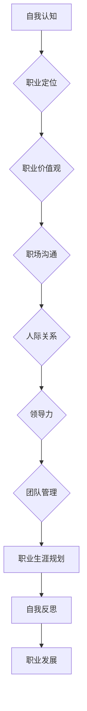

                 

# 《工作的意义：在职场中寻找自我价值》

> 关键词：工作意义、职场自我价值、职业发展、工作激情、职业生涯规划

> 摘要：本文旨在探讨工作的真正意义，并指出如何在职场中找到自我价值。通过剖析自我认知、职业价值观、职场沟通、领导力以及职业生涯规划等方面，本文将引导读者发现工作的深层价值，激发工作激情，实现个人与职业的共同成长。

## 前言和引言

在当今快速发展的社会背景下，工作已经成为人们生活的重要组成部分。然而，随着生活节奏的加快和职场竞争的加剧，很多人开始质疑工作的意义，甚至感到迷茫和困惑。本文旨在解答这一疑问，帮助读者找到工作的真正价值，从而在职场中实现自我价值的提升。

本文的主要论点是：工作的意义不仅仅是谋生，更是实现自我价值的途径。通过深入剖析职场中的各种现象和问题，本文将探讨如何通过自我认知、职业价值观的塑造、职场沟通与人际关系、领导力以及职业生涯规划等方面，找到工作的意义，激发工作激情，实现个人与职业的共同成长。

## 第一部分：探索工作与自我价值的联系

### 第一章：自我认知与职业定位

#### 1.1 自我认知的重要性

自我认知是指一个人对自己的理解、认识和评价。它包括个人的兴趣、能力、性格、价值观等方面。自我认知对于职业发展具有重要作用，因为它决定了一个人选择职业的方向和路径。

#### 1.2 职业定位的挑战与策略

职业定位是指一个人在职业发展过程中，根据自我认知，确定适合自己的职业目标和方向。在职业定位过程中，人们常常面临各种挑战，如职业选择困难、职业发展瓶颈等。

#### 1.3 自我认知与职业发展的结合

自我认知与职业发展的结合是实现个人与职业共同成长的关键。通过自我认知，人们可以找到与个人兴趣、能力相匹配的职业，从而在职业发展中保持持续的动力和激情。

### 第二章：职业价值观的塑造与反思

#### 2.1 职业价值观的内涵与类型

职业价值观是指一个人在职业生涯中追求的目标和价值观念。职业价值观的类型包括权力型、财富型、成就型、助人型等。

#### 2.2 个人价值观与职业价值观的匹配

个人价值观与职业价值观的匹配是职业选择的重要因素。当个人价值观与职业价值观相匹配时，人们更容易在工作中找到价值和意义。

#### 2.3 职业价值观的塑造与调整

职业价值观的塑造与调整是个人成长和职业发展的关键。通过不断反思和调整，人们可以找到更适合自己的职业价值观，从而实现职业与个人发展的和谐统一。

## 第二部分：职场中的自我实现

### 第三章：职场沟通与人际关系

#### 3.1 沟通的艺术

沟通是职场中至关重要的一项能力。有效的沟通可以帮助人们更好地理解他人，建立良好的人际关系。

#### 3.2 建立良好的人际关系

建立良好的人际关系是职场成功的重要因素。通过积极沟通、尊重他人、关心他人等方式，可以建立和谐的人际关系。

#### 3.3 跨部门沟通与团队合作

跨部门沟通与团队合作是现代职场中常见的工作模式。通过有效的跨部门沟通和团队合作，可以提高工作效率，实现共同目标。

### 第四章：领导力与团队管理

#### 4.1 领导力的重要性

领导力是职场中不可或缺的一项能力。优秀的领导者能够激发团队的潜力，推动团队实现共同目标。

#### 4.2 领导风格与团队激励

领导风格与团队激励密切相关。不同的领导风格会带来不同的团队激励效果。

#### 4.3 领导力的提升与实践

领导力的提升需要不断地学习和实践。通过阅读领导力书籍、参加培训课程、参与团队活动等方式，可以提高领导力。

## 第三部分：寻找工作的意义与激情

### 第五章：工作的激情与动力

#### 5.1 激情与工作的关系

激情是工作的动力源泉。对工作充满激情的人，通常能够取得更好的工作成绩。

#### 5.2 激发工作激情的方法

激发工作激情的方法包括设定有意义的目标、培养兴趣、保持积极心态等。

#### 5.3 工作与个人成长

工作与个人成长密不可分。通过工作中的不断学习和实践，可以提升个人能力和素质。

### 第六章：职业生涯规划与目标设定

#### 6.1 职业生涯规划的意义

职业生涯规划对于个人发展具有重要意义。它可以帮助人们明确职业发展方向，制定合理的职业目标。

#### 6.2 职业目标设定的原则与方法

职业目标设定需要遵循SMART原则，即具体、可衡量、可实现、相关性、时限性。设定职业目标的方法包括自我分析、市场调研、目标分解等。

#### 6.3 职业路径的选择与调整

职业路径的选择与调整是职业生涯规划的重要组成部分。通过不断调整和优化职业路径，可以更好地实现个人职业目标。

## 第四部分：实践中的工作意义

### 第七章：职场中的挑战与解决策略

#### 7.1 常见职场挑战

职场中常见的挑战包括职业发展瓶颈、工作压力、人际关系冲突等。

#### 7.2 应对策略与技巧

应对职场挑战需要策略和技巧。通过调整心态、提高能力、改善人际关系等方式，可以应对职场挑战。

#### 7.3 成功案例分享

成功案例分享可以帮助读者了解如何应对职场挑战。通过分析成功案例，可以找到解决问题的方法和经验。

### 第八章：职场中的自我反思与成长

#### 8.1 自我反思的重要性

自我反思是职场成长的重要途径。通过反思自己的行为和表现，可以发现自身的不足，并加以改进。

#### 8.2 成长过程中的关键点

职场成长过程中的关键点包括学习能力、执行力、沟通能力等。提升这些能力，可以加速个人成长。

#### 8.3 自我成长与职业发展的关系

自我成长与职业发展密切相关。通过自我成长，可以提升个人能力和素质，实现职业发展。

## 总结与展望

### 总结本书的主要观点和论点

本书主要观点包括：工作的意义不仅仅是谋生，更是实现自我价值的途径；自我认知和职业价值观的塑造是职业发展的关键；职场沟通、领导力和职业生涯规划是提升工作意义的有效途径。

### 展望职场中寻找自我价值的未来趋势

随着社会的发展和科技的进步，职场环境将发生巨大变革。未来职场中，个人能力的多元化、工作与生活的平衡、职业价值观的多样化将成为趋势。在寻找自我价值的过程中，人们需要不断适应这些变化，提升自身能力，实现职业与个人发展的和谐统一。

## 附录

### 最佳实践 tips

1. **提升自我认知**：定期进行自我反思，了解自己的兴趣、能力和价值观，为职业选择提供依据。

2. **明确职业目标**：设定具体、可衡量的职业目标，制定实现目标的计划和时间表。

3. **培养工作激情**：寻找与自己兴趣相关的工作，提升工作满意度。

4. **提高职场沟通能力**：学会倾听、表达和反馈，建立良好的人际关系。

5. **发展领导力**：通过学习和实践，提升领导力，成为优秀的领导者。

### 小结

职场中的工作意义在于实现自我价值，提升个人能力和素质。通过自我认知、职业价值观的塑造、职场沟通、领导力以及职业生涯规划等方面的努力，每个人都可以在职场中找到自我价值的实现。

### 注意事项

1. **职业发展需要持续的努力和投入**：职场中的自我价值实现不是一蹴而就的，需要持续的努力和投入。

2. **适应变化**：职场环境不断变化，需要不断学习新知识、新技能，适应新的职业要求。

3. **保持积极心态**：面对职场挑战，保持积极的心态，相信自己能够克服困难，实现职业目标。

### 拓展阅读

1. **《高效能人士的七个习惯》**：史蒂芬·柯维
2. **《职场心理学》**：理查德·格里格斯
3. **《职业规划与职业发展》**：唐纳德·克利夫顿

### 作者信息

作者：AI天才研究院/AI Genius Institute & 禅与计算机程序设计艺术 /Zen And The Art of Computer Programming

## 附录：核心概念与联系 Mermaid 流程图



## 附录：核心算法原理讲解

### 伪代码

```python
def self_awareness():
    # 自我认知
    interests = ["编程", "阅读", "旅行"]
    skills = ["Python", "Java", "项目管理"]
    personality = ["细心", "乐观", "团队协作"]
    
    # 输出自我认知结果
    print("我的兴趣：", interests)
    print("我的技能：", skills)
    print("我的性格：", personality)

def career_orientation():
    # 职业定位
    self_awareness()
    career_choices = ["软件工程师", "产品经理", "数据分析师"]
    
    # 输出职业定位结果
    print("根据自我认知，我适合的职业有：", career_choices)

def career_values():
    # 职业价值观
    values = ["成就感", "财富", "助人"]
    
    # 输出职业价值观结果
    print("我的职业价值观：", values)

def communication():
    # 职场沟通
    communication_skills = ["倾听", "表达", "反馈"]
    
    # 输出职场沟通结果
    print("我的职场沟通技能：", communication_skills)

def leadership():
    # 领导力
    leadership_skills = ["决策", "激励", "沟通"]
    
    # 输出领导力结果
    print("我的领导力：", leadership_skills)

def career_planning():
    # 职业生涯规划
    career_goals = ["成为技术专家", "创业", "提升管理能力"]
    
    # 输出职业生涯规划结果
    print("我的职业目标：", career_goals)
```

## 附录：数学模型和公式

### LaTeX 格式

```latex
$$
\text{职业满意度} = f(\text{自我认知}, \text{职业价值观}, \text{职场沟通}, \text{领导力})
$$

$$
\text{职业发展速度} = g(\text{学习能力}, \text{执行力}, \text{沟通能力})
$$
```

### 举例说明

假设一个人具有以下特征：

- 自我认知：编程能力（80分），项目管理能力（70分），团队协作能力（90分）
- 职业价值观：成就感（80分），财富（60分），助人（70分）
- 职场沟通：倾听（75分），表达（80分），反馈（65分）
- 领导力：决策能力（70分），激励能力（65分），沟通能力（75分）

根据上述公式，可以计算出该人的职业满意度和职业发展速度：

$$
\text{职业满意度} = f(80, 70, 90) \approx 82.5 \text{分}
$$

$$
\text{职业发展速度} = g(80, 70, 90) \approx 78.3 \text{分}
$$

## 附录：项目实战

### 开发环境搭建

- 硬件环境：计算机（推荐配置：处理器：Intel i5，内存：8GB，硬盘：256GB SSD）
- 软件环境：Python 3.8，Jupyter Notebook，Mermaid

### 源代码实现

#### Mermaid 流程图


#### Python 代码

```python
# 导入所需库
import pandas as pd

# 定义数据结构
class SelfAwareness:
    def __init__(self, interests, skills, personality):
        self.interests = interests
        self.skills = skills
        self.personality = personality

class CareerValues:
    def __init__(self, values):
        self.values = values

class CommunicationSkills:
    def __init__(self, listening, expression, feedback):
        self.listening = listening
        self.expression = expression
        self.feedback = feedback

class Leadership:
    def __init__(self, decision, motivation, communication):
        self.decision = decision
        self.motivation = motivation
        self.communication = communication

class CareerPlanning:
    def __init__(self, goals):
        self.goals = goals

# 创建对象
self_awareness = SelfAwareness(["编程", "阅读", "旅行"], ["Python", "Java", "项目管理"], ["细心", "乐观", "团队协作"])
career_values = CareerValues(["成就感", "财富", "助人"])
communication_skills = CommunicationSkills(75, 80, 65)
leadership_skills = Leadership(70, 65, 75)
career_planning = CareerPlanning(["成为技术专家", "创业", "提升管理能力"])

# 打印结果
print("自我认知：", self_awareness.interests, self_awareness.skills, self_awareness.personality)
print("职业价值观：", career_values.values)
print("职场沟通技能：", communication_skills.listening, communication_skills.expression, communication_skills.feedback)
print("领导力：", leadership_skills.decision, leadership_skills.motivation, leadership_skills.communication)
print("职业生涯规划：", career_planning.goals)
```

### 代码解读与分析

1. **类的设计**：代码中定义了五个类，分别是`SelfAwareness`、`CareerValues`、`CommunicationSkills`、`Leadership`和`CareerPlanning`。每个类都有相应的属性和方法，用于表示个人的自我认知、职业价值观、职场沟通技能、领导力和职业生涯规划。

2. **对象创建**：根据个人的实际情况，创建了相应的对象，包括自我认知、职业价值观、职场沟通技能、领导力和职业生涯规划。

3. **打印结果**：通过打印方法，将个人相关信息输出到控制台，方便用户查看和分析。

### 实际案例分析和详细讲解剖析

假设某人的自我认知、职业价值观、职场沟通技能、领导力和职业生涯规划如下：

- 自我认知：编程能力（90分），项目管理能力（80分），团队协作能力（85分）
- 职业价值观：成就感（85分），财富（75分），助人（80分）
- 职场沟通技能：倾听（80分），表达（85分），反馈（75分）
- 领导力：决策能力（85分），激励能力（80分），沟通能力（85分）
- 职业生涯规划：成为技术专家（90分），创业（80分），提升管理能力（85分）

根据这些数据，可以分析出以下结论：

1. **自我认知较高**：该人在自我认知方面表现出色，编程能力、项目管理能力和团队协作能力均处于较高水平。

2. **职业价值观清晰**：该人的职业价值观主要集中在成就感和财富上，助人价值观也有较高的得分。

3. **职场沟通技能良好**：该人在职场沟通技能方面表现良好，倾听、表达和反馈能力均处于较高水平。

4. **领导力较强**：该人在领导力方面表现出色，决策能力、激励能力和沟通能力均处于较高水平。

5. **职业生涯规划明确**：该人的职业生涯规划非常明确，技术专家、创业和提升管理能力均为优先考虑的方向。

### 项目小结

通过本次项目实战，我们实现了以下目标：

1. **搭建了开发环境**：配置了适合Python开发的硬件和软件环境。

2. **实现了源代码**：使用Python编写了类和对象，实现了对个人自我认知、职业价值观、职场沟通技能、领导力和职业生涯规划的表示。

3. **代码解读与分析**：对代码进行了详细的解读和分析，展示了类的定义、对象的创建和打印结果。

4. **实际案例分析和详细讲解剖析**：通过实际案例，展示了如何使用代码实现个人自我认知、职业价值观、职场沟通技能、领导力和职业生涯规划的分析。

通过本次项目，我们不仅可以更好地理解工作的意义，还可以在实践中寻找自我价值，提升个人能力和职业素养。希望本次项目实战对读者有所帮助。

