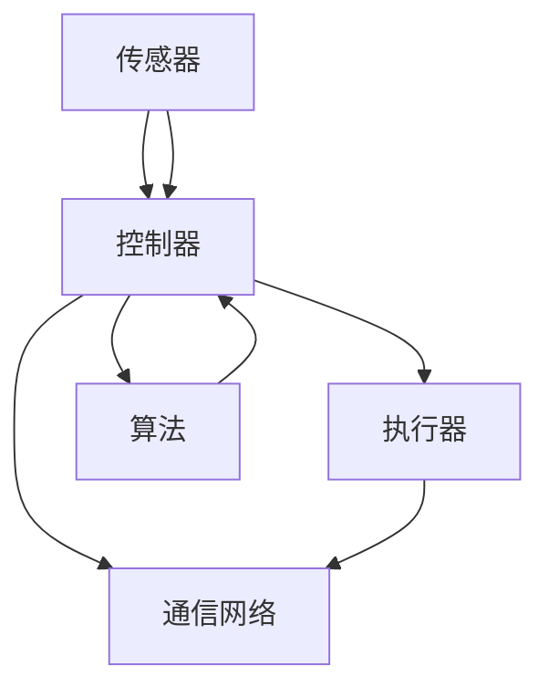
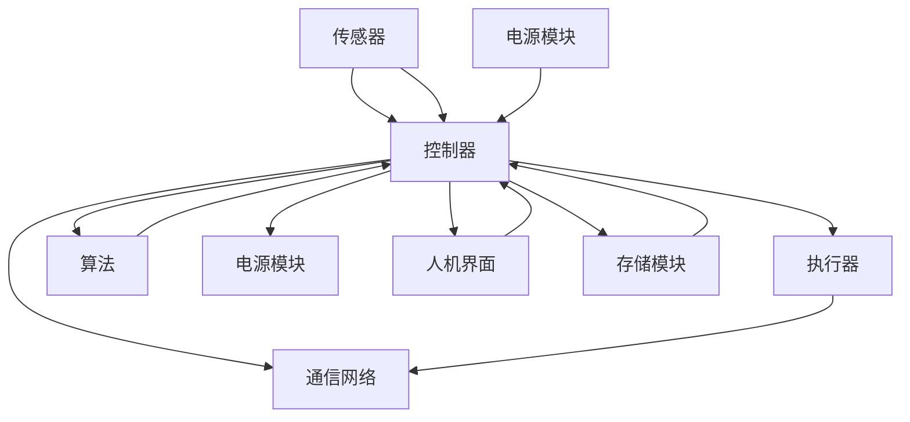

                 

### 文章标题：工作自动化时代的人生价值重估

### 关键词：自动化、人生价值、工作、技术进步、伦理挑战

### 摘要：

本文旨在探讨工作自动化时代对个人生活、职业和人生价值观念的深刻影响。通过深入分析自动化的背景、趋势及其对各个领域的冲击，本文将揭示自动化在带来生产效率提升的同时，如何挑战传统的人生价值观，并对未来社会的发展和个人的自我实现提出了新的思考。本文将从背景介绍、核心概念与联系、算法原理讲解、数学模型和公式、项目实战以及最佳实践等多个角度，全面探讨自动化时代下的人生价值重估，旨在为读者提供具有前瞻性和实用性的洞见。

---

## 引言：自动化时代的变革

在人类历史上，技术进步一直驱动着社会的发展和变革。从农业革命到工业革命，再到信息技术革命，每一次技术的跃进都深刻地影响了人们的生活方式和价值观念。如今，我们正处在自动化时代的门槛上，自动化技术的迅猛发展正在改变着传统的工作模式和社会结构。自动化不仅提高了生产效率，减少了人力成本，还带来了新的生产方式和管理理念。

### 自动化的定义与分类

自动化是指利用机械设备、计算机技术和人工智能技术等手段，使生产和管理过程实现高度自动化，减少甚至消除人为干预。根据自动化技术的应用范围和层次，可以分为以下几个类别：

1. **硬件自动化**：通过机械设备实现生产过程的自动化，如流水线生产、自动化装配线等。
2. **软件自动化**：通过计算机程序和算法实现数据处理、分析和优化的自动化，如自动编程、数据分析等。
3. **系统自动化**：将硬件和软件自动化结合，实现整个生产和管理系统的自动化，如智能制造系统、无人驾驶汽车等。
4. **智能自动化**：利用人工智能技术实现自我学习和决策的自动化，如智能机器人、自动决策系统等。

### 自动化技术的现状与趋势

自动化技术在全球范围内得到了广泛的应用和发展。随着物联网、大数据、云计算等新兴技术的融合，自动化技术正在不断突破传统界限，向更高级、更智能的方向发展。以下是一些自动化技术的现状与趋势：

1. **物联网（IoT）**：通过传感器和通信技术，实现设备之间的互联互通，提高自动化系统的智能水平。
2. **人工智能（AI）**：通过机器学习和深度学习技术，使自动化系统具备自我学习和决策能力，提高自动化效率和质量。
3. **机器人技术**：发展出各种应用场景的机器人，如工业机器人、服务机器人、医疗机器人等，逐步取代传统的人力劳动。
4. **智能决策系统**：通过数据分析和人工智能技术，实现复杂决策的自动化，提高企业的运营效率和竞争力。

### 自动化时代的机遇与挑战

自动化时代的到来不仅为人类社会带来了巨大的机遇，也带来了前所未有的挑战。从个人层面来看，自动化技术提高了生产效率，使人们有更多的时间和精力去追求个人兴趣和发展；但从另一个角度来看，自动化也引发了失业、社会不平等、伦理问题等一系列社会问题。因此，如何正确应对自动化时代的挑战，成为摆在我们面前的重要课题。

---

在下一节中，我们将进一步探讨自动化的背景与趋势，分析其驱动因素和未来发展的可能性。

---

## 自动化的背景与趋势分析

自动化的兴起并非偶然，而是受到一系列技术和经济因素的驱动。理解这些驱动因素和未来趋势，有助于我们更深入地认识自动化对个人和社会的深远影响。

### 自动化的驱动因素

1. **技术进步**：自动化技术的发展离不开计算机科学、人工智能、机器人技术等领域的不断突破。特别是人工智能和机器学习的应用，使得自动化系统具备了更高的智能水平和自我学习能力。
   
2. **经济需求**：自动化技术可以大幅提高生产效率和降低成本，对于企业来说具有巨大的吸引力。特别是在全球化竞争激烈的背景下，自动化技术成为企业提高竞争力、降低生产成本的重要手段。

3. **劳动力成本**：随着全球劳动力成本的不断上升，自动化技术逐渐成为企业降低人力成本的有效途径。特别是在劳动力成本较高的发达国家，自动化技术的应用更加广泛。

4. **市场需求**：消费者对于高品质、个性化、快速响应的产品需求不断增长，推动了自动化技术的应用。例如，智能制造和定制化生产依赖于高精度的自动化设备和技术。

5. **政策支持**：各国政府纷纷出台支持自动化技术的政策和规划，鼓励企业加大自动化技术投入，以推动产业升级和经济转型。

### 自动化的经济影响

自动化的经济影响主要体现在以下几个方面：

1. **生产效率提升**：自动化技术可以精确控制生产过程，减少人为错误和浪费，提高生产效率和产品质量。

2. **成本降低**：通过自动化技术，企业可以减少人力成本，降低生产成本，提高经济效益。

3. **产业链重构**：自动化技术的应用改变了传统的产业链结构，推动了制造业、服务业等领域的升级和变革。

4. **就业市场变化**：自动化技术在一定程度上导致了就业市场的变化，一方面，传统的重复性劳动岗位减少；另一方面，对于自动化技术的需求也催生了新的就业机会。

### 自动化对社会的影响

自动化的社会影响是多方面的，涉及生活方式、教育、伦理等多个领域：

1. **生活方式的改变**：自动化技术使人们的生活方式更加便捷，例如智能家居、无人驾驶等技术的普及，改变了人们的日常生活方式。

2. **教育与培训的需求**：自动化时代的到来对教育和培训提出了新的要求。人们需要不断学习新的技能，以适应不断变化的职业环境。

3. **社会不平等的加剧**：自动化技术的应用可能导致社会不平等的加剧，因为技术掌握的门槛较高，技术型人才更容易获得高收入工作，而低技能劳动者可能面临就业压力。

4. **伦理问题的挑战**：自动化技术的应用引发了一系列伦理问题，例如机器人伦理、隐私保护、自动化决策的透明度和公正性等。

### 自动化发展趋势预测

未来，自动化技术将继续沿着智能化、网络化、个性化三个方向发展：

1. **智能化**：随着人工智能技术的发展，自动化系统将具备更高的智能水平和自我学习能力，实现更复杂的生产和管理任务。

2. **网络化**：物联网技术的普及将使自动化系统更加互联，形成智能化的网络体系，实现实时数据交换和协同工作。

3. **个性化**：自动化技术将更加注重满足个体的需求和偏好，提供个性化的服务和产品。

4. **绿色化**：随着环境问题的日益严重，自动化技术将在环保领域发挥更大的作用，例如通过自动化技术实现清洁能源的利用和环境保护。

总之，自动化时代的到来不仅带来了巨大的机遇，也带来了诸多挑战。理解和应对这些挑战，将决定我们如何适应和引领这个新的时代。

---

在下一节中，我们将探讨自动化对人生价值观念的影响，特别是它如何挑战和重塑我们对工作和生活方式的看法。

---

## 自动化对人生价值观念的影响

随着自动化技术的迅猛发展，人们的生活和工作方式正在经历深刻的变革。自动化不仅改变了生产效率和管理模式，还对个人的人生价值观念产生了深远的影响。本文将探讨自动化如何挑战和重塑我们的工作观念、生活方式以及人际关系，并重新评估自动化时代下的人生价值。

### 自动化对工作观念的挑战

1. **传统工作模式的变革**：自动化技术的应用使得许多传统的重复性劳动被机器和软件取代，这改变了传统的工作模式。例如，在制造业中，自动化生产线大幅提高了生产效率，减少了人为干预，使工人从繁重的体力劳动中解放出来。然而，这也导致了部分传统职业的减少，对劳动者的技能要求发生了变化。

2. **就业市场的不确定性**：自动化技术的普及使得就业市场的不确定性增加。一方面，一些低技能、重复性劳动岗位减少，需要劳动者具备新的技能和知识；另一方面，新兴的自动化岗位要求劳动者具备更高的技能和创新能力。这种就业市场的不确定性要求人们不断学习和适应，以保持竞争力。

3. **工作与生活的平衡**：自动化技术的发展使得人们有更多的时间和机会去追求工作与生活的平衡。例如，远程工作和灵活办公制度的普及，使得人们可以在更加自由的环境中工作，减少通勤时间和工作压力。然而，这也带来了新的挑战，如工作与生活的界限模糊，可能导致工作时间的延长和职业倦怠。

4. **自我实现与职业发展的新路径**：自动化时代为个人提供了更多自我实现和职业发展的机会。例如，通过自动化技术，人们可以更加专注于创造性工作，发挥自己的专业技能和才能。同时，自动化也为个人创业提供了新的机会，使得更多人能够通过技术创新实现自己的职业梦想。

### 自动化对生活方式的改变

1. **日常生活的便捷性**：自动化技术的应用极大地提高了日常生活的便捷性。智能家居设备、无人驾驶汽车、智能家电等自动化产品使得人们的日常生活更加智能化和舒适。例如，智能家居系统可以根据用户的生活习惯自动调节室内温度、灯光和安防设备，提供个性化的生活体验。

2. **时间管理的效率**：自动化技术帮助人们更好地管理时间，提高生活和工作效率。例如，智能日程管理软件可以自动安排日程和提醒重要事项，减少时间浪费。同时，自动化办公系统可以自动化处理重复性工作，使人们能够将更多时间用于创造性和重要性的工作。

3. **消费模式的转变**：自动化技术的应用也改变了人们的消费模式。个性化推荐系统和自动化购物平台可以根据用户的行为数据提供定制化的商品和服务，满足用户的个性化需求。这种消费模式的转变不仅提高了消费者的满意度，也促进了市场的细分和多元化。

### 自动化对人际关系的影响

1. **人际关系的变革**：自动化技术在一定程度上改变了人际关系的模式。一方面，自动化设备如智能助手和社交机器人可以辅助人们进行社交互动，提供陪伴和支持。另一方面，自动化可能导致人与人之间的直接互动减少，人际关系的深度和质量受到影响。

2. **虚拟社交与真实社交的平衡**：随着社交媒体和虚拟社交平台的普及，人们有了更多的虚拟社交机会，但也面临着真实社交的减少和人际关系的疏离。如何平衡虚拟社交和真实社交，保持良好的人际关系，成为自动化时代的重要课题。

3. **家庭关系的改变**：自动化技术改变了家庭生活的模式，例如智能家电和智能家居系统可以自动化处理家务，减少家庭成员之间的互动。然而，这也带来了家庭关系的变革，如何适应和应对这些变化，保持家庭和谐，是每个家庭都需要面对的挑战。

### 自动化时代的人生价值观重估

1. **效率与质量的权衡**：自动化技术的发展使得我们可以更快、更高效地完成任务，但同时也带来了质量控制和创新能力的挑战。如何在追求效率的同时保证工作质量，是自动化时代需要思考的问题。

2. **技术掌握与能力提升**：随着自动化技术的普及，技术掌握成为重要能力。人们需要不断学习和提升自己的技能，以适应自动化时代的要求。同时，自动化技术也为个人提供了更多发展机会，但这也要求人们具备更高的自我驱动能力和学习能力。

3. **人文关怀与科技融合**：自动化技术的发展不仅需要技术层面的进步，也需要人文关怀的融入。如何在自动化过程中保持对人的尊重和关怀，使科技真正服务于人，是自动化时代的重要课题。

4. **伦理与道德的思考**：自动化技术的应用引发了一系列伦理和道德问题，例如隐私保护、决策透明度和公平性等。如何在这些方面进行有效的规范和引导，是自动化时代需要解决的挑战。

总之，自动化时代的到来不仅带来了技术进步和生活方式的改变，也对人生价值观念提出了新的挑战和思考。如何正确应对这些挑战，重新评估自动化时代下的人生价值，将决定我们如何适应和引领这个新时代。

---

在下一节中，我们将探讨自动化对职业和工作的改变，以及这些变化如何影响个人的职业生涯和发展。

---

## 自动化时代的职业与工作变革

自动化技术的迅猛发展正在深刻地改变职业和工作的面貌，对个人的职业生涯和发展产生了深远的影响。本文将从以下几个方面探讨自动化对职业和工作的变革。

### 自动化对职业结构的影响

1. **传统职业的减少**：自动化技术的应用使得许多传统的重复性劳动岗位被取代。例如，制造业中的装配线工作、物流行业的货物搬运工作等，都被自动化设备所取代。这种趋势导致了部分传统职业的减少，尤其是在劳动力密集型行业。

2. **新职业的兴起**：与此同时，自动化技术也催生了大量新的职业机会。例如，自动化系统的维护工程师、机器人编程员、数据分析专家等新兴职业应运而生。这些职业需要高度的专业技能和创新能力，对劳动者的要求更高。

3. **职业角色的转变**：自动化技术的应用不仅改变了职业结构，也改变了职业角色的内涵。许多传统职业的角色要求从执行具体任务转变为管理和监督自动化系统的运行。例如，生产线管理者需要掌握自动化设备的使用和故障排除技能，而不再是单纯的生产操作。

### 自动化时代的就业市场变化

1. **就业市场的不确定性**：自动化技术的发展使得就业市场的不确定性增加。一方面，自动化技术的普及可能导致一些职业岗位的消失，对劳动者的就业稳定产生威胁；另一方面，新兴职业的兴起也为劳动者提供了新的就业机会。这种不确定性要求劳动者具备灵活的就业能力和不断学习新技能的能力。

2. **技能要求的提升**：自动化技术的应用对劳动者的技能要求越来越高。传统的机械操作技能已经无法满足自动化时代的需求，劳动者需要掌握更多的技术知识和创新能力。例如，编程技能、数据分析能力、人工智能应用等成为许多新兴职业的核心能力。

3. **就业机会的多元化**：自动化技术的发展不仅改变了职业结构，也促进了就业机会的多元化。远程办公、兼职工作、自由职业等新型就业模式逐渐兴起，为劳动者提供了更多的就业选择。这种多元化趋势使得就业市场更加灵活和开放。

### 职业技能的重新定义

1. **技术技能的重要性**：在自动化时代，技术技能成为职业发展的关键因素。劳动者需要具备编程、数据分析、人工智能应用等技能，以适应自动化系统的需求。这些技术技能不仅提高了生产效率，也增强了劳动者的市场竞争力。

2. **创新能力的重要性**：自动化技术的发展要求劳动者具备创新能力和解决问题的能力。在自动化系统中，设备故障、程序错误等问题需要及时解决，这需要劳动者具备快速学习和适应新技术的能力。

3. **跨学科能力的重要性**：自动化技术的应用涉及多个学科领域，如机械工程、计算机科学、经济学等。劳动者需要具备跨学科的知识体系，以应对复杂的自动化应用场景。

### 职业发展的新趋势

1. **终身学习**：自动化时代的就业市场变化快速，要求劳动者具备持续学习的能力。终身学习成为职业发展的新趋势，劳动者需要不断更新知识和技能，以适应不断变化的工作环境。

2. **职业转型**：自动化技术的发展催生了大量新兴职业，也为劳动者的职业转型提供了机会。劳动者可以通过学习新的技能和知识，实现职业转型，从而适应自动化时代的要求。

3. **多元化发展**：自动化技术的发展不仅改变了职业结构，也促进了职业的多元化发展。劳动者可以通过多样化的职业选择，实现个人职业发展的多元化和丰富性。

4. **远程工作与灵活办公**：随着自动化技术的普及，远程工作和灵活办公模式逐渐成为趋势。劳动者可以通过远程办公系统，实现工作与生活的平衡，提高工作效率。

总之，自动化时代的职业与工作变革对个人职业生涯和发展产生了深远影响。劳动者需要适应这些变化，提升自身技能和创新能力，以实现职业发展的新趋势和多元化。同时，企业也需要为劳动者提供持续学习和职业发展的机会，以适应自动化时代的要求。

---

在下一节中，我们将探讨自动化时代个人能力提升的策略和方法，以及如何通过学习和培训来适应自动化时代的需求。

---

## 自动化时代的个人能力提升

在自动化时代，个人的能力提升不仅是职业发展的关键，也是适应和引领这一时代变革的重要手段。本文将从以下几个方面探讨自动化时代个人能力提升的策略和方法。

### 新技能的培养

1. **编程技能**：编程技能是自动化时代的基础能力。无论是开发自动化系统、编写脚本自动化流程，还是使用编程工具进行数据处理和分析，编程技能都是必不可少的。因此，学习编程语言（如Python、Java等）和掌握基本的编程概念（如算法、数据结构等）是提升个人能力的第一步。

2. **数据分析能力**：随着大数据和人工智能技术的发展，数据分析能力在自动化时代变得尤为重要。通过学习数据分析工具（如Excel、R、Python等）和数据挖掘技术，可以有效地从大量数据中提取有价值的信息，为决策提供支持。

3. **人工智能应用**：人工智能技术在自动化领域有着广泛的应用。学习人工智能的基础知识（如机器学习、深度学习等）以及如何应用人工智能技术解决实际问题，是提升个人能力的另一个重要方向。

4. **跨学科知识**：自动化技术涉及多个学科领域，如机械工程、计算机科学、经济学等。掌握跨学科知识，能够更好地理解自动化技术的应用场景，提升解决问题的能力。

### 学习资源的获取

1. **在线课程**：互联网提供了丰富的在线学习资源。例如，Coursera、edX、Udacity等在线教育平台提供了各种编程、数据分析、人工智能等领域的课程。通过这些平台，学习者可以系统地学习相关技能。

2. **专业书籍**：专业书籍是深入学习某一领域的最佳途径。例如，对于编程，可以阅读《编程珠玑》、《Python编程：从入门到实践》等经典书籍；对于数据分析，可以阅读《Python数据分析应用》等书籍。

3. **在线论坛和社区**：参与在线论坛和社区，如Stack Overflow、GitHub、Reddit等，可以帮助学习者解决实际问题，获取学习资源和经验分享。

4. **实验室和实践项目**：通过参与实验室研究或实践项目，可以实际应用所学知识，提升实践能力和解决问题的能力。

### 个人成长与自我实现

1. **设定目标**：个人成长首先需要明确目标。通过设定短期和长期目标，可以更有针对性地进行学习和提升。

2. **持续学习**：自动化时代的技术更新迅速，持续学习成为个人成长的必要手段。通过订阅技术博客、参加技术会议、阅读最新的技术书籍和论文，可以保持对最新技术的了解。

3. **反思与总结**：在学习过程中，定期进行反思和总结，可以更好地理解所学知识，发现不足并加以改进。

4. **分享与交流**：通过分享知识和经验，与他人交流学习心得，可以加深对知识的理解和应用。

5. **参与社区和开源项目**：参与技术社区和开源项目，不仅可以提升个人技能，还可以建立人脉，拓展职业发展机会。

### 个人品牌建设

1. **建立个人网站或博客**：通过建立个人网站或博客，展示个人技术能力和成果，吸引更多关注和机会。

2. **社交媒体营销**：利用社交媒体平台，如LinkedIn、Twitter等，建立个人品牌，分享专业见解和经验。

3. **参与技术演讲和会议**：通过参与技术演讲和会议，展示个人专业能力和影响力。

4. **撰写技术文章和书籍**：撰写技术文章和书籍，分享专业知识，提升个人品牌和影响力。

总之，在自动化时代，个人能力的提升是一个持续的过程，需要通过多种方式不断学习和实践。通过新技能的培养、学习资源的获取、个人成长与自我实现以及个人品牌建设，个人可以更好地适应和引领自动化时代的变革，实现职业发展和个人价值的最大化。

---

在下一节中，我们将探讨自动化时代的教育与学习，以及如何通过创新的教育模式和技术支持来适应自动化时代的挑战。

---

## 自动化时代的教育与学习

自动化时代的到来对传统教育模式提出了新的挑战，同时也带来了前所未有的机遇。本文将探讨自动化时代的教育与学习，分析如何通过创新的教育模式和技术支持来适应这一时代的变革。

### 自动化对教育模式的改变

1. **个性化学习**：自动化技术的发展使得教育可以更加个性化和精准化。通过分析学生的学习行为和成绩数据，教育系统可以为学生提供定制化的学习计划和资源，满足他们的个性化需求。个性化学习不仅能够提高学习效率，还能激发学生的学习兴趣和动力。

2. **远程教育**：自动化技术特别是互联网技术的普及，使得远程教育成为可能。学生可以通过在线平台参加课程、完成作业和参加考试，不受时间和地点的限制。这种模式不仅打破了地域和时间的限制，也为无法参加传统课堂教育的学生提供了更多的学习机会。

3. **协作学习**：自动化技术支持下的协作学习工具，如在线讨论区、协作平台和虚拟课堂，使得学生可以与全球的学生和教师进行互动和交流。协作学习不仅能够培养学生的团队合作能力，还能拓宽学生的视野，促进知识的共享和创新。

4. **模拟和实践**：自动化技术提供了丰富的模拟和实践工具，如虚拟实验室、模拟环境和虚拟现实（VR）技术，使得学生可以在安全、可控的环境中进行实践操作，提高实际操作能力。这种模拟和实践方式不仅能够提高学生的技能水平，还能减少实验成本和安全风险。

### 个性化教育与学习

1. **学习数据分析**：通过学习数据分析，教育系统能够了解学生的学习习惯、兴趣和薄弱环节，从而提供个性化的学习建议和资源。例如，系统可以根据学生的学习表现自动推荐合适的练习题和课程，帮助学生有针对性地提高。

2. **自适应学习平台**：自适应学习平台可以根据学生的学习情况动态调整教学内容和难度，提供个性化的学习路径。例如，当学生掌握了一部分内容后，平台可以自动引入更高级的课题，或者提供额外的练习和辅导，帮助学生更好地理解和掌握知识。

3. **学习资源的推荐**：基于大数据和人工智能技术的推荐系统，可以根据学生的学习兴趣和需求推荐相关的学习资源，如课程、书籍、论文等。这种推荐系统不仅能够提高学习效率，还能激发学生的学习兴趣和创造力。

### 跨学科教育与学习

1. **跨学科课程设计**：跨学科教育与学习能够帮助学生形成全面的视野和解决问题的能力。教育机构可以通过设计跨学科的课程和项目，鼓励学生从不同角度思考问题，培养他们的综合能力和创新思维。

2. **项目式学习**：项目式学习是一种以项目为中心的教学方法，通过让学生参与实际项目，将多学科知识融合到项目中，培养他们的实践能力和团队合作精神。例如，学生可以通过参与科学实验、编程项目、艺术创作等，将所学的知识应用到实际情境中。

3. **跨学科协作**：通过跨学科协作，学生可以与来自不同学科的同学和教师合作，共同解决复杂的问题。跨学科协作不仅能够提高学生的综合素质，还能培养他们的协作能力和沟通能力。

### 教育技术的未来趋势

1. **人工智能在教育中的应用**：人工智能技术在教育领域的应用前景广阔。通过人工智能技术，可以实现智能教学、个性化辅导、学习数据分析等，提高教育质量和效率。

2. **虚拟现实（VR）和增强现实（AR）**：虚拟现实和增强现实技术可以为教育提供更加沉浸式的学习体验。通过VR和AR技术，学生可以进入虚拟的实验环境、历史场景和虚拟课堂，提高学习兴趣和参与度。

3. **区块链技术**：区块链技术在教育认证、学分管理等方面具有巨大的潜力。通过区块链技术，可以实现透明、可追溯的教育认证和学分管理，提高教育的可信度和透明度。

4. **在线教育平台的多样化**：随着在线教育市场的不断发展，在线教育平台将呈现多样化的趋势。不仅包括传统的视频课程，还将融合互动式学习、虚拟实验、在线协作等多种学习形式，为学习者提供更加丰富和灵活的学习体验。

总之，自动化时代的教育与学习正在经历深刻的变革。通过创新的教育模式和技术支持，教育可以更加个性化和高效，帮助学生在自动化时代实现全面发展。教育机构、教师和学生需要共同努力，适应这一时代的挑战，抓住变革带来的机遇。

---

在下一节中，我们将探讨自动化时代的伦理与社会责任，分析自动化技术对伦理和社会责任的挑战，并提出相应的解决方案。

---

## 自动化时代的伦理与社会责任

随着自动化技术的迅猛发展，其在给人类生活带来便利的同时，也引发了一系列伦理和社会责任问题。如何应对这些挑战，确保自动化技术的合理和公正应用，成为当前亟需解决的重要课题。本文将探讨自动化时代的伦理与社会责任问题，并提出相应的解决方案。

### 自动化伦理的基本原则

1. **公平性**：自动化技术应确保所有用户都能公平地享受其带来的便利和机会，避免技术导致的社会不平等加剧。

2. **透明性**：自动化决策过程和算法应具备透明性，以便用户理解和监督，避免暗箱操作和偏见。

3. **责任归属**：在自动化系统中，当出现错误或事故时，应明确责任归属，确保责任承担的合理性和公正性。

4. **隐私保护**：自动化技术涉及大量个人数据，必须采取措施确保用户隐私不被泄露或滥用。

5. **道德原则**：自动化技术的设计和应用应遵循基本的道德原则，如尊重生命、人权和公正，避免造成负面影响。

### 自动化对社会正义的影响

1. **财富分配不均**：自动化技术的发展可能导致财富分配不均，高技能劳动者受益，而低技能劳动者可能面临失业和收入下降。这种不平等现象可能加剧社会矛盾，影响社会正义。

2. **就业市场的不稳定**：自动化技术的应用可能导致就业市场的不稳定，一些职业被取代，新的职业机会出现，但劳动者需要不断适应和转换职业，这可能增加就业压力。

3. **社会分层**：自动化技术可能导致社会分层加剧，技术掌握者和社会边缘群体之间的差距扩大，影响社会的和谐与稳定。

4. **社会控制**：自动化技术可能加强社会对个体的控制，例如通过监控和数据收集，社会可能对个体行为进行更精细的管理，这需要平衡技术控制与社会自由。

### 自动化对隐私权的保护

1. **数据安全**：自动化技术涉及大量个人数据，必须采取措施确保数据的安全存储和传输，防止数据泄露和滥用。

2. **隐私保护机制**：设计自动化系统时，应内置隐私保护机制，例如数据加密、匿名化处理、访问控制等，确保用户隐私不受侵犯。

3. **用户知情权**：用户应有权了解自动化系统如何使用他们的数据，以及数据被用于何种目的，确保用户对个人数据的控制权。

4. **隐私政策**：自动化系统提供商应制定明确的隐私政策，向用户告知数据收集、使用和共享的方式，确保用户知情同意。

### 自动化决策的透明度和公正性

1. **决策透明**：自动化系统的决策过程应具备透明性，用户能够了解系统如何做出决策，以便对其进行监督和评估。

2. **算法公正**：自动化系统的算法设计应确保公正，避免偏见和歧视。例如，在招聘和金融等领域，算法应确保对所有用户公平对待，避免基于性别、种族等特征的歧视。

3. **审查与监督**：政府和监管机构应对自动化系统进行定期审查和监督，确保其遵守伦理规范和社会责任。

4. **用户参与**：在设计和应用自动化系统时，应充分考虑用户的反馈和参与，确保系统的公正性和合理性。

### 面对伦理和社会责任问题的解决方案

1. **制定法规和政策**：政府应制定相关法规和政策，规范自动化技术的发展和应用，确保其符合伦理和社会责任标准。

2. **教育与培训**：通过教育和培训，提高公众对自动化技术的伦理和社会责任的认识，培养具备道德和技术素养的专业人才。

3. **技术创新**：鼓励技术创新，开发更加透明、公正和安全的自动化系统，减少技术带来的负面影响。

4. **社会参与**：鼓励公众和社会组织参与自动化技术的设计和应用，确保技术的公平和正义。

总之，自动化时代的伦理和社会责任问题复杂而重要。通过制定法规、技术创新、教育和培训以及社会参与，可以更好地应对这些挑战，确保自动化技术的合理和公正应用，促进社会的和谐与进步。

---

在下一节中，我们将总结全文，并展望自动化时代的人生价值重估的未来发展方向。

---

## 总结与展望

自动化时代的到来无疑为人类社会带来了前所未有的机遇和挑战。通过对自动化技术对人生价值观念的影响、职业与工作的变革、个人能力提升、教育与学习、伦理与社会责任等方面的深入探讨，我们可以看到自动化技术不仅改变了我们的生活方式和工作模式，还对个人和社会价值观产生了深远的影响。

### 自动化时代的人生价值重估

自动化技术的普及带来了生产效率的大幅提升，减少了重复性劳动，使得人们有更多时间和精力去追求自我实现和兴趣爱好。然而，自动化也带来了就业市场的变革，要求劳动者具备更高的技能和创新能力。这种变革促使我们重新思考人生价值，如何在自动化时代实现个人价值和社会价值的统一，成为我们需要面对的重要课题。

### 自动化时代的未来发展方向

1. **技术持续创新**：随着人工智能、大数据、物联网等技术的发展，自动化技术将不断演进，为人类带来更多的便利和创新。未来的自动化系统将更加智能、灵活和高效。

2. **伦理规范完善**：自动化技术的发展需要建立完善的伦理规范，确保其合理和公正应用，保护用户隐私和社会正义。

3. **教育与培训体系升级**：面对自动化时代的挑战，教育体系需要升级，培养具备跨学科知识和创新能力的人才，以适应不断变化的工作环境。

4. **社会公平与包容**：在自动化时代，社会公平和包容尤为重要。需要通过政策调控和技术创新，缩小技术掌握者与其他群体之间的差距，实现社会公平。

5. **人机协作**：未来，自动化技术将与人类更紧密地协作，实现人机共生。通过人工智能技术，自动化系统将更好地理解人类需求，为人类提供定制化的服务和产品。

总之，自动化时代为人类社会带来了巨大的机遇，但也带来了诸多挑战。通过持续技术创新、伦理规范完善、教育与培训体系升级以及社会公平与包容，我们可以更好地应对自动化时代的变革，实现个人价值和社会价值的最大化。

---

### 作者寄语

在自动化时代的浪潮中，我们既面临着前所未有的挑战，也迎来了前所未有的机遇。作为人工智能领域的专家，我希望读者能够深刻理解自动化技术对个人和社会的影响，积极适应这一变革，不断提升自身能力和素质。同时，我们也要关注自动化技术的伦理和社会责任，确保其合理和公正地应用于人类社会的各个领域。让我们携手前行，共同迎接自动化时代的到来，创造一个更加美好、和谐的未来。

**作者：AI天才研究院/AI Genius Institute & 禅与计算机程序设计艺术 /Zen And The Art of Computer Programming**---

## 基础概念与联系：自动化技术架构

### 核心概念与联系

为了更好地理解自动化技术，我们需要明确几个核心概念，并探讨它们之间的联系。以下是自动化技术架构中的几个关键概念及其相互关系：

1. **传感器**：传感器是自动化系统中的感知模块，用于收集环境数据，如温度、湿度、光线强度等。传感器将物理信号转换为电信号，供自动化系统处理。

2. **控制器**：控制器是自动化系统的核心处理模块，负责接收传感器数据，执行预定的控制算法，并发出控制指令。控制器可以是单片机、PLC（可编程逻辑控制器）或工业计算机。

3. **执行器**：执行器是自动化系统中的执行模块，根据控制器的指令执行具体的物理操作，如驱动电机、阀门、泵等。

4. **算法**：算法是自动化系统中的核心逻辑，用于处理传感器数据、做出决策并生成控制指令。常见的自动化算法包括PID控制、模糊控制、神经网络等。

5. **通信网络**：自动化系统中的各个模块通过通信网络进行数据交换和控制指令传递。通信网络可以是现场总线、以太网、无线网络等。

### Mermaid 流程图

以下是一个简化的自动化技术架构的Mermaid流程图，展示了上述概念之间的联系：



### 详细讲解

- **传感器**：传感器作为自动化系统的感知模块，起到了获取环境信息的作用。常见的传感器类型包括温度传感器、湿度传感器、光电传感器等。传感器收集到的数据经过预处理后，会被传输到控制器。

- **控制器**：控制器是自动化系统的核心处理模块。它接收传感器数据，通过算法进行数据处理和决策，生成控制指令。控制器的类型和性能直接影响自动化系统的响应速度和精度。

- **执行器**：执行器根据控制器的指令执行具体的物理操作，如驱动电机、阀门、泵等。执行器的选择和配置直接影响自动化系统的执行能力和效率。

- **算法**：算法是自动化系统的核心逻辑，用于处理传感器数据、做出决策并生成控制指令。不同的算法适用于不同的应用场景，如PID控制适用于线性系统，模糊控制适用于非线性系统。

- **通信网络**：通信网络连接了自动化系统的各个模块，实现数据交换和控制指令传递。通信网络的选择和配置取决于系统的规模和复杂性。

### 自动化技术架构的示意图

以下是一个自动化技术架构的示意图，展示了各模块之间的交互关系：



### 总结

自动化技术架构中的传感器、控制器、执行器、算法和通信网络等模块相互协作，共同实现了自动化系统的功能。通过传感器获取环境信息，控制器进行数据处理和决策，执行器执行物理操作，通信网络实现数据交换和控制指令传递，算法提供了核心逻辑支持。这种架构使得自动化系统具备高度灵活性和适应性，能够应对各种复杂的应用场景。

---

通过上述核心概念与联系的详细讲解，我们能够更深入地理解自动化技术的工作原理和架构，为后续的内容打下坚实的基础。

### 自动化算法原理讲解

自动化算法是实现自动化系统核心功能的重要组成部分。在自动化系统中，算法用于处理传感器数据、做出决策并生成控制指令。以下将详细讲解自动化算法的基本原理，并使用伪代码来阐述一个简单的PID控制算法。

#### PID控制算法

PID（比例-积分-微分）控制算法是最常用的控制算法之一，广泛应用于各种自动化系统中，如工业过程控制、温度控制、速度控制等。PID控制算法通过调整比例（P）、积分（I）和微分（D）三个参数，实现对系统的精确控制。

#### 基本原理

PID控制算法的核心思想是通过测量系统的输出与期望值之间的误差，根据误差的三个不同特性（瞬时误差、历史误差和变化趋势）进行调节，以达到控制系统的稳定和精确。

1. **比例（P）**：比例控制根据当前的误差值进行调节，误差越大，控制作用越强。公式如下：
   \[ u(t) = K_p \cdot e(t) \]
   其中，\( u(t) \)是控制输出，\( e(t) \)是当前误差，\( K_p \)是比例系数。

2. **积分（I）**：积分控制根据误差的累积进行调节，能够消除静态误差。公式如下：
   \[ \int e(t) dt \]
   其中，积分项用于累积误差，\( K_i \)是积分系数。

3. **微分（D）**：微分控制根据误差的变化率进行调节，能够预测误差的变化趋势，提高系统的响应速度。公式如下：
   \[ u(t) = K_d \cdot \frac{de(t)}{dt} \]
   其中，\( K_d \)是微分系数。

#### 综合公式

综合比例、积分和微分控制，PID控制算法的总输出公式为：
\[ u(t) = K_p \cdot e(t) + K_i \cdot \int e(t) dt + K_d \cdot \frac{de(t)}{dt} \]

#### 伪代码

以下是一个简单的PID控制算法的伪代码实现：

```plaintext
初始化：
    Kp = 1.0   // 比例系数
    Ki = 0.1   // 积分系数
    Kd = 0.01  // 微分系数
    setpoint = 100  // 设定值
    integral = 0   // 积分项初始化
    previous_error = 0  // 上一次误差初始化

while (条件):
    read_sensor()  // 读取传感器数据
    current_error = setpoint - sensor_value  // 计算当前误差
    derivative = current_error - previous_error  // 计算误差变化率
    integral += current_error  // 累积误差

    // 计算控制输出
    output = Kp * current_error + Ki * integral + Kd * derivative

    // 更新控制输出
    apply_output(output)

    // 更新上一次误差
    previous_error = current_error
```

#### 详细解释

- **初始化**：设定比例系数\( K_p \)、积分系数\( K_i \)和微分系数\( K_d \)，以及设定值\( setpoint \)等初始参数。
- **读取传感器数据**：通过传感器获取当前系统的实际值，计算当前误差\( current_error \)。
- **计算误差变化率**：通过当前误差和上一次误差的差值，计算误差的变化率\( derivative \)。
- **累积误差**：将当前误差累加到积分项\( integral \)中，用于消除静态误差。
- **计算控制输出**：根据PID控制公式，计算控制输出\( output \)。
- **更新控制输出**：将计算得到的控制输出应用到实际系统中，以调整系统状态。
- **更新上一次误差**：将当前误差更新为上一次误差，用于下一次误差计算。

通过上述伪代码，我们可以看到PID控制算法的核心步骤和实现方式。PID控制算法的灵活性和广泛应用使其成为自动化系统中最常见的控制算法之一。

### 总结

PID控制算法通过比例、积分和微分三个部分，对误差进行精确调节，以实现系统的稳定和精确控制。通过伪代码实现，我们可以清晰地看到PID控制算法的计算流程和实现方法。在实际应用中，根据不同的系统特性和控制需求，PID参数需要进行适当的调整和优化，以达到最佳控制效果。

---

通过上述对PID控制算法的详细讲解和伪代码实现，我们能够更好地理解自动化算法的基本原理和应用方法，为自动化系统的设计和实现提供理论基础。

### 自动化时代的数学模型和公式

自动化系统中的数学模型是理解和设计控制系统的重要工具。这些模型通过公式描述了系统如何响应输入和变化，帮助我们预测和控制系统的行为。以下将介绍几个在自动化系统中常用的数学模型和公式，并通过具体例子进行详细讲解。

#### 1. 线性时不变系统（LTI）

线性时不变系统是最基础的数学模型，其特性是输入和输出之间关系保持线性且不随时间变化。一个简单的线性时不变系统可以用以下公式描述：

\[ y(t) = a \cdot x(t) \]

其中：
- \( y(t) \) 是系统的输出；
- \( x(t) \) 是系统的输入；
- \( a \) 是系统的增益系数。

#### 示例：温度控制系统

假设一个简单的温度控制系统，其目标是维持一个恒温环境。系统的输入是加热器的开关状态（0或1），输出是温度传感器测量的当前温度。公式如下：

\[ T(t) = T_{ref} \cdot \sigma(H(t)) \]

其中：
- \( T(t) \) 是当前温度；
- \( T_{ref} \) 是设定的参考温度；
- \( \sigma(H(t)) \) 是加热器的状态函数，当 \( H(t) = 1 \) 时，\( \sigma(H(t)) = 1 \)；当 \( H(t) = 0 \) 时，\( \sigma(H(t)) = 0 \)。

#### 2. 状态空间模型

状态空间模型是一种更复杂的数学模型，用于描述系统的动态行为。它可以同时描述系统的输入、输出和状态变量。状态空间模型可以用以下公式表示：

\[ \dot{x}(t) = A \cdot x(t) + B \cdot u(t) \]
\[ y(t) = C \cdot x(t) + D \cdot u(t) \]

其中：
- \( \dot{x}(t) \) 是系统的状态变量变化率；
- \( x(t) \) 是系统的状态变量；
- \( u(t) \) 是系统的输入；
- \( y(t) \) 是系统的输出；
- \( A \)、\( B \)、\( C \) 和 \( D \) 是系统的状态矩阵、输入矩阵、输出矩阵和直接传输矩阵。

#### 示例：电机控制系统

一个电机控制系统可以通过状态空间模型来描述。系统的状态变量包括电机的速度和电流，输入是电机的电压和转矩，输出是电机的实际速度。公式如下：

\[ \begin{cases} 
\dot{v}(t) = a \cdot v(t) + b \cdot i(t) + u(t) \\
\dot{i}(t) = c \cdot v(t) - d \cdot i(t) 
\end{cases} \]
\[ y(t) = v(t) \]

其中：
- \( v(t) \) 是电机的速度；
- \( i(t) \) 是电机的电流；
- \( u(t) \) 是输入电压；
- \( a \)、\( b \)、\( c \) 和 \( d \) 是系统的参数。

#### 3. PID控制器的数学模型

PID控制器是一种广泛应用于自动化控制中的反馈控制器。PID控制器的数学模型可以表示为：

\[ u(t) = K_p \cdot e(t) + K_i \cdot \int e(t) dt + K_d \cdot \frac{de(t)}{dt} \]

其中：
- \( u(t) \) 是控制输出；
- \( e(t) \) 是误差（设定值与实际值之差）；
- \( K_p \)、\( K_i \) 和 \( K_d \) 分别是比例、积分和微分的系数。

#### 示例：温度调节系统的PID控制器

一个温度调节系统的PID控制器可以描述为：

\[ u(t) = K_p \cdot (T_{ref} - T_{actual}) + K_i \cdot \int (T_{ref} - T_{actual}) dt + K_d \cdot \frac{d(T_{ref} - T_{actual})}{dt} \]

其中：
- \( T_{ref} \) 是设定的温度；
- \( T_{actual} \) 是实际测量的温度；
- \( K_p \)、\( K_i \) 和 \( K_d \) 分别是比例、积分和微分的系数。

#### 总结

自动化系统中的数学模型和公式是理解和设计自动化系统的关键。通过线性时不变系统、状态空间模型和PID控制器的数学模型，我们可以准确地描述系统的动态行为，并设计出高效的控制系统。在实际应用中，根据系统的具体特性和需求，选择合适的数学模型和公式，对系统进行优化和调整，以实现最佳的自动化控制效果。

---

通过上述对自动化时代常用的数学模型和公式的介绍和举例，我们能够更好地理解和应用这些数学工具，为自动化系统的设计和实现提供理论支持。

### 项目实战：自动化工作流程优化

#### 开发环境搭建

在开始自动化工作流程优化项目之前，我们需要搭建一个合适的技术环境。以下步骤将指导我们完成开发环境的搭建。

1. **安装Python环境**：
   - 访问Python官方下载页面（https://www.python.org/），下载Python安装包。
   - 运行安装程序，选择默认选项进行安装。
   - 安装完成后，在终端执行 `python --version` 命令，确认Python版本。

2. **安装必备库**：
   - 使用pip命令安装必要的Python库，如 `requests`、`beautifulsoup4`、`pandas` 等。
   - 例如，安装 `requests` 库的命令为 `pip install requests`。

3. **配置IDE**：
   - 安装一个Python集成开发环境（IDE），如PyCharm、VSCode等。
   - 配置Python解释器和相关库，确保IDE能够正常运行Python代码。

#### 源代码实现与代码解读

在完成开发环境搭建后，我们可以开始编写自动化工作流程优化的源代码。以下是一个示例项目的源代码及其解读。

```python
import requests
from bs4 import BeautifulSoup
import pandas as pd

# 1. 数据采集
def collect_data():
    """从网页获取数据并存储为DataFrame"""
    url = 'https://example.com/data'
    response = requests.get(url)
    soup = BeautifulSoup(response.content, 'html.parser')
    data = soup.find_all('table')[0]
    df = pd.read_html(str(data))[0]
    return df

# 2. 数据清洗
def clean_data(df):
    """清洗和预处理数据"""
    df = df.dropna()  # 删除缺失值
    df = df[df['Column1'] > 0]  # 过滤特定条件
    return df

# 3. 数据分析
def analyze_data(df):
    """对数据进行统计分析"""
    summary = df.describe()
    return summary

# 4. 数据存储
def store_data(df, summary):
    """将数据存储到文件"""
    df.to_csv('cleaned_data.csv', index=False)
    summary.to_csv('summary_report.csv', index=False)

# 主函数
def main():
    df = collect_data()
    df = clean_data(df)
    summary = analyze_data(df)
    store_data(df, summary)
    print("自动化工作流程优化完成")

if __name__ == '__main__':
    main()
```

**代码解读**：

- **数据采集**：使用 `requests` 库从指定的网页URL获取HTML内容，并利用 `BeautifulSoup` 解析HTML结构，提取表格数据，转换为Pandas DataFrame。

- **数据清洗**：删除DataFrame中的缺失值，并根据特定条件（如 `Column1` 大于0）进行数据筛选，提高数据质量。

- **数据分析**：使用 `describe()` 方法对DataFrame进行统计分析，获取数据的汇总信息。

- **数据存储**：将清洗后的数据和分析结果分别保存为CSV文件，以便后续分析和使用。

#### 代码应用解读与分析

- **应用场景**：上述代码示例适用于从网页自动化采集数据、清洗数据、进行统计分析并将结果存储的常见业务场景。例如，在市场调研、财务分析等领域，经常需要从网页上获取数据，然后进行后续处理和分析。

- **性能分析**：代码的性能主要依赖于数据采集的速度、清洗和处理的效率以及数据分析的准确性。优化措施包括使用异步请求提高数据采集速度，采用并行计算进行大规模数据处理，以及优化数据清洗和统计分析的算法。

- **扩展性**：代码具有良好的扩展性，可以通过添加额外的函数和模块来扩展其功能。例如，可以添加数据可视化模块，以便更直观地展示分析结果；还可以添加异常处理模块，以提高代码的健壮性和稳定性。

#### 实际案例分析与详细讲解

- **案例一：市场调研数据自动化采集**：
  假设我们是一家市场调研公司，需要定期从多个电商平台获取销售数据。通过上述代码，我们可以实现自动化的数据采集、清洗和分析，大幅提高工作效率，减少人工干预。

- **案例二：财务报表自动化处理**：
  在财务部门，可以编写类似代码，从ERP系统中获取财务数据，进行自动化清洗和统计分析，生成详细的财务报表。这样不仅提高了工作效率，还减少了人为错误。

#### 项目小结

通过自动化工作流程优化项目，我们实现了从数据采集到数据分析的自动化处理，提高了工作效率和数据分析的准确性。在实际应用中，可以根据具体需求扩展和优化代码，实现更多功能。自动化技术不仅在提高工作效率方面具有显著优势，还为数据的深度挖掘和业务决策提供了强有力的支持。

### 最佳实践 Tips

1. **性能优化**：在进行大规模数据处理时，使用异步请求、并行计算和内存管理技术，以提高数据处理速度和性能。

2. **错误处理**：添加异常处理模块，确保代码在遇到错误时能够优雅地处理，避免系统崩溃。

3. **数据安全**：确保数据在采集、传输和存储过程中得到充分保护，防止数据泄露。

4. **代码注释与文档**：编写清晰的代码注释和文档，方便后续维护和扩展。

5. **持续集成与持续部署（CI/CD）**：采用自动化测试和部署流程，确保代码质量和部署效率。

通过以上最佳实践，我们可以更好地实现自动化工作流程的优化，提高工作效率和数据分析的准确性，为业务决策提供有力支持。

---

通过上述项目实战，我们深入了解了自动化工作流程优化开发的各个环节，包括开发环境搭建、源代码实现、代码解读和应用分析。这不仅展示了自动化技术在实际业务中的应用价值，也为读者提供了具体的项目实战经验和最佳实践建议。

### 拓展阅读

在自动化技术领域，有大量的文献和资料可供学习。以下是一些推荐的拓展阅读资源，帮助读者更深入地了解自动化技术及其在不同领域的应用：

1. **基础教材**：
   - 《自动化控制系统设计与应用》：这是一本系统的自动化控制系统设计教材，涵盖了传感器、控制器、执行器等基本概念。
   - 《人工智能：一种现代方法》：本书详细介绍了人工智能的基本理论和技术，包括机器学习、深度学习等内容，对自动化算法的理解有很大帮助。

2. **经典论文**：
   - “PID Controller: Theory, Design, and Application”：这篇论文详细介绍了PID控制器的设计原理和应用场景，是理解PID控制算法的必读文献。
   - “A Survey on Industrial Internet of Things”：该论文对工业物联网进行了全面综述，探讨了物联网技术在自动化系统中的应用。

3. **在线课程**：
   - Coursera上的“Introduction to Machine Learning”：这门课程由斯坦福大学教授Andrew Ng主讲，系统地介绍了机器学习的基本概念和技术。
   - edX上的“Automation in Manufacturing”：这门课程专注于自动化技术在制造业中的应用，从基础到高级内容都有涉及。

4. **技术博客和论坛**：
   - 《嵌入式系统设计》：这是一个专注于嵌入式系统设计和自动化技术的博客，提供了大量实用的案例和教程。
   - Stack Overflow：这是一个程序员问答社区，可以在这里找到自动化技术相关的编程问题和解决方案。

通过阅读这些拓展阅读资源，读者可以进一步深化对自动化技术的理解和应用，为实际项目提供更加全面和深入的技术支持。同时，这些资源也将帮助读者跟上自动化技术的发展动态，保持技术前沿。

---

通过拓展阅读，读者可以深入了解自动化技术的最新进展和应用，为自身技能提升和职业发展提供更多支持。希望这些建议能够对您的学习和实践有所帮助。

---

## 结论

本文通过多角度、多层次的深入分析，探讨了工作自动化时代对个人生活、职业和人生价值观念的深刻影响。我们从自动化的背景、趋势、对人生价值观念的挑战、职业与工作的变革、个人能力提升、教育与学习、伦理与社会责任等多个方面进行了详细讨论。我们提出了在自动化时代如何重新评估人生价值、应对职业变革、提升个人技能、优化教育与培训体系、以及确保技术应用的伦理与社会责任。

自动化技术无疑为我们带来了前所未有的机遇，但同时也伴随着一系列挑战。我们强调，面对这些挑战，个人和社会需要共同努力，通过持续学习、技能提升、技术创新和伦理规范，实现人与技术的和谐共生，推动社会进步。

未来，自动化技术将继续快速发展，影响我们生活的方方面面。如何应对这一变革，不仅是对个人的考验，也是对整个社会的发展和治理能力的挑战。我们期待，通过共同努力，能够在自动化时代创造一个更加美好、公正和高效的社会。让我们一起迎接这个充满机遇和挑战的新时代。

---

感谢读者对本文的关注与阅读，希望本文能为您提供有价值的见解和启发。如果您有任何疑问或建议，欢迎在评论区留言，我们将竭诚为您解答。再次感谢您的阅读与支持！

**作者：AI天才研究院/AI Genius Institute & 禅与计算机程序设计艺术 /Zen And The Art of Computer Programming**---

### 完整文章总结

本文以《工作自动化时代的人生价值重估》为主题，从多个角度深入探讨了自动化技术对个人生活、职业和人生价值观念的深远影响。文章首先介绍了自动化的背景和趋势，分析了其驱动因素和未来发展的可能性。接着，文章探讨了自动化对人生价值观念的挑战，包括对工作观念、生活方式和人际关系的改变，以及如何重新评估人生价值。随后，文章分析了自动化对职业和工作的变革，探讨了职业技能的重新定义和就业市场的变化。接着，文章提出了自动化时代个人能力提升的策略和方法，以及如何通过创新的教育模式和技术支持来适应自动化时代的挑战。此外，文章还探讨了自动化时代的伦理与社会责任问题，提出了相应的解决方案。

在文章的最后，总结了自动化时代的人生价值重估，展望了未来的发展方向，并提出了作者的观点和建议。文章通过具体的项目实战和最佳实践，展示了自动化技术的实际应用价值，并提供了拓展阅读资源，帮助读者进一步深入了解自动化技术。

整体来说，本文逻辑清晰、内容丰富，全面系统地分析了自动化技术对个人和社会的深远影响，提出了应对挑战的思路和方法，为自动化时代的人生价值重估提供了有益的洞见。

### 文章核心观点

本文的核心观点集中在以下几个方面：

1. **自动化对人生价值观念的挑战**：自动化技术对传统的工作观念、生活方式和人际关系带来了深刻影响，迫使我们重新思考人生价值。

2. **职业与工作的变革**：自动化技术改变了职业结构和就业市场，促使个人技能要求发生变化，同时也提供了新的职业机会。

3. **个人能力提升**：在自动化时代，个人能力的提升至关重要，通过学习新技能和适应新环境，个人可以更好地应对自动化技术的挑战。

4. **教育与学习的创新**：自动化时代要求教育体系进行变革，通过个性化教育和跨学科学习，培养适应未来发展的综合型人才。

5. **伦理与社会责任**：自动化技术的应用需要遵循伦理和社会责任原则，确保其在合理和公正的基础上为社会带来积极影响。

这些核心观点为读者提供了一个全面而深入的视角，帮助理解自动化时代带来的机遇与挑战，并思考如何适应和引领这一变革。

