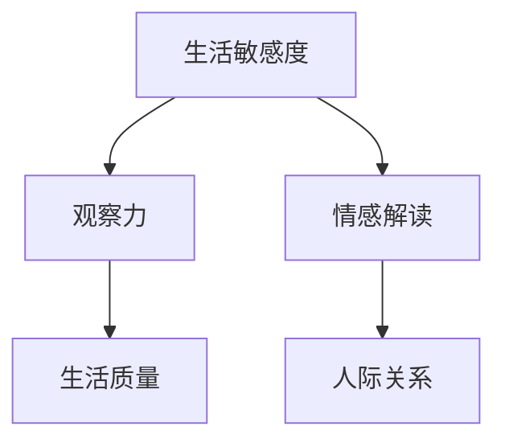

                 

### 文章标题：平凡生活中的非凡发现：培养生活的敏感度

> 关键词：生活敏感度、观察力、情感解读、创造力、人际敏感度、内心平静、实践指南

> 摘要：本文将探讨如何在日常生活中培养生活的敏感度，通过提升观察力、理解情感信号、探索细节、激发创造力、培养人际敏感度以及实现内心平静，让平凡的生活变得不平凡。文章将通过详细的解释、实例分析和实践指南，帮助读者在平凡中发现非凡。

---

#### 引言：激发对生活的敏感度

在我们的日常生活中，生活敏感度往往被忽视。敏感度，指的是个体对周围环境和情感信号的反应能力。这种能力不仅影响我们的生活质量，也关系到我们的心理健康和人际关系。然而，许多人往往沉迷于日常的忙碌和琐事，忽视了对生活的感知。

**核心概念与联系：**

- **敏感度**：敏感度是一种感知能力，它使我们能够对环境变化和他人情感产生敏锐的觉察。
- **观察力**：观察力是提升敏感度的关键，通过细致观察，我们能够捕捉到生活中的细微变化。
- **情感解读**：情感解读能力帮助我们理解他人的情绪和需求，从而更好地与他人互动。

**Mermaid 流程图：**

提升生活敏感度不仅有助于我们更好地应对生活中的挑战，还能够提升我们的幸福感。接下来，我们将逐步探讨如何培养这种能力。

#### 观察的艺术：提升生活感知力

观察力是培养生活敏感度的第一步。通过细致的观察，我们能够捕捉到生活中的细节，从而提升对周围环境的感知。

**核心概念与联系：**

- **观察力**：观察力是指对周围环境和细节的感知能力。
- **感知力**：感知力是观察力的延伸，它使我们对生活中的变化和他人情感有更深的理解。

**数学模型和数学公式：**

感知力可以通过以下公式表示：

\[ 感知力 = 观察力 \times 情感解读能力 \]

**核心算法原理讲解：**

为了提升观察力，我们可以采用以下方法：

1. **分块观察**：将观察目标分成小块，逐一观察，从而提高观察的细致程度。
2. **反复观察**：对同一观察对象进行多次观察，每次尝试捕捉到新的细节。

**项目实战：**

假设我们正在观察一朵花，我们可以采用以下步骤：

1. **第一次观察**：整体观察花朵的外观和颜色。
2. **第二次观察**：分块观察花朵的每一个部分，如花瓣、花蕊等。
3. **第三次观察**：在特定的光线条件下观察花朵，尝试捕捉到不同色彩的变化。

通过这样的反复观察，我们可以提升对花朵的感知力。

#### 情感的解读：理解生活中的情感信号

情感解读能力使我们能够理解他人的情绪和需求，从而更好地与他人互动。这种能力在人际交往中尤为重要。

**核心概念与联系：**

- **情感解读**：情感解读是指通过观察和理解他人的言行，推断他们的情绪和需求。
- **非言语沟通**：非言语沟通是情感解读的重要组成部分，包括面部表情、肢体语言和语调等。

**数学模型和数学公式：**

情感解读可以通过以下公式表示：

\[ 情感解读 = 观察力 \times 情感知识库 \]

**核心算法原理讲解：**

为了提升情感解读能力，我们可以采用以下方法：

1. **积累情感知识库**：通过阅读、观察和交流，积累关于情感的知识。
2. **观察非言语沟通**：注意他人的面部表情、肢体语言和语调，从中捕捉情感信号。
3. **角色扮演**：通过角色扮演，模拟不同情境下的情感表达，从而提升理解能力。

**项目实战：**

假设我们正在与朋友交谈，我们可以采用以下步骤：

1. **观察面部表情和肢体语言**：注意朋友的面部表情和肢体动作，判断他们的情绪状态。
2. **注意语调**：倾听朋友的语调，判断他们是否情绪高涨或低落。
3. **提问**：根据观察结果，提出问题，进一步了解朋友的情感状态。

通过这样的情感解读，我们可以更好地理解他人，从而建立更深入的人际关系。

#### 体验的深度：探索生活中的细节

细节是生活中被忽视的宝藏。通过深入体验生活中的细节，我们能够发现生活中的美好，提升生活的质量。

**核心概念与联系：**

- **细节体验**：细节体验是指对生活中细节的深入感受和体会。
- **生活质量**：细节体验直接影响生活质量，通过体验生活中的细节，我们可以提升对生活的满意度。

**数学模型和数学公式：**

细节体验可以通过以下公式表示：

\[ 细节体验 = 观察力 \times 情感投入 \]

**核心算法原理讲解：**

为了提升细节体验，我们可以采用以下方法：

1. **放慢节奏**：通过放慢生活节奏，有意识地关注生活中的细节。
2. **专注体验**：在体验时，专注于当下的感受，避免分心。
3. **记录体验**：通过记录体验，加深对细节的记忆和理解。

**项目实战：**

假设我们正在享受一杯咖啡，我们可以采用以下步骤：

1. **观察咖啡的色泽和香气**：仔细观察咖啡的色泽和香气，感受它们的细微变化。
2. **品味咖啡的口感**：慢慢品味咖啡的口感，注意咖啡在不同部位的味道差异。
3. **记录体验**：将体验记录下来，分享给他人，从而加深对咖啡细节的理解。

通过这样的细节体验，我们可以提升对生活的满意度。

#### 创造力的培养：在平凡中发现非凡

创造力是培养生活敏感度的重要途径。通过培养创造力，我们能够在平凡中发现非凡，为生活增添色彩。

**核心概念与联系：**

- **创造力**：创造力是指创造新事物、发现新观点的能力。
- **生活敏感度**：创造力与生活敏感度密切相关，通过提升敏感度，我们可以更好地激发创造力。

**数学模型和数学公式：**

创造力可以通过以下公式表示：

\[ 创造力 = 敏感度 \times 思维灵活性 \]

**核心算法原理讲解：**

为了培养创造力，我们可以采用以下方法：

1. **开放思维**：保持开放思维，接受不同的观点和想法。
2. **练习思维灵活性**：通过练习思维灵活性，如头脑风暴、创意写作等，提高思维的灵活性。
3. **培养好奇心**：对未知事物保持好奇心，积极探索。

**项目实战：**

假设我们正在创作一幅画，我们可以采用以下步骤：

1. **观察主题**：仔细观察创作主题，捕捉其细节和情感。
2. **头脑风暴**：围绕主题进行头脑风暴，列出可能的创作思路。
3. **实践创作**：根据头脑风暴的结果，进行创作实践，不断尝试新的方法。

通过这样的创造力培养，我们可以提升对生活的敏感度。

#### 社交的艺术：培养人际敏感度

人际敏感度是人际交往中不可或缺的一部分。通过培养人际敏感度，我们能够更好地理解他人，建立和谐的人际关系。

**核心概念与联系：**

- **人际敏感度**：人际敏感度是指理解他人情感和需求的能力。
- **人际关系**：人际敏感度直接影响人际关系，通过培养人际敏感度，我们能够建立更稳固的人际关系。

**数学模型和数学公式：**

人际敏感度可以通过以下公式表示：

\[ 人际敏感度 = 情感解读能力 \times 社交技能 \]

**核心算法原理讲解：**

为了培养人际敏感度，我们可以采用以下方法：

1. **倾听**：倾听他人讲话，注意他们的情感表达和需求。
2. **观察**：观察他人的非言语沟通，捕捉他们的情绪信号。
3. **反馈**：给予他人积极的反馈，表达对他们情感的理解。

**项目实战：**

假设我们正在与朋友交谈，我们可以采用以下步骤：

1. **倾听**：认真倾听朋友的讲话，注意他们的情感表达。
2. **观察**：观察朋友的面部表情和肢体语言，判断他们的情绪状态。
3. **反馈**：根据观察结果，给予朋友积极的反馈，表达对他们情感的理解。

通过这样的社交艺术，我们可以提升人际敏感度。

#### 内心的平静：通过敏感度获得内在安宁

内心的平静是生活敏感度的终极目标。通过提升敏感度，我们能够更好地理解自己和他人，从而实现内心的平静。

**核心概念与联系：**

- **内心平静**：内心平静是指心灵的宁静和安宁。
- **敏感度**：敏感度是获得内心平静的关键，通过提升敏感度，我们能够更好地处理内心的波动。

**数学模型和数学公式：**

内心平静可以通过以下公式表示：

\[ 内心平静 = 生活敏感度 \times 心理调节能力 \]

**核心算法原理讲解：**

为了实现内心平静，我们可以采用以下方法：

1. **自我观察**：通过自我观察，了解自己的情感和需求。
2. **情感调节**：学会调节自己的情绪，避免负面情绪的积累。
3. **正念练习**：通过正念练习，提高自我意识，实现内心的平静。

**项目实战：**

假设我们正在面对压力，我们可以采用以下步骤：

1. **自我观察**：观察自己的情绪变化，了解压力的来源。
2. **情感调节**：通过深呼吸、放松训练等方法，调节自己的情绪。
3. **正念练习**：进行正念练习，专注于当下，减少对压力的焦虑。

通过这样的内心平静实践，我们可以实现内心的安宁。

#### 实践指南：将敏感度融入日常生活

要将敏感度融入日常生活，我们需要将上述方法付诸实践。以下是一份详细的实践指南，帮助读者将敏感度融入日常生活。

**背景介绍：**

敏感度是一种重要的心理能力，它不仅影响我们的生活质量，还关系到我们的心理健康和人际关系。通过培养敏感度，我们能够更好地应对生活中的挑战，提升生活质量。

**核心概念与联系：**

- **敏感度**：敏感度是指对环境和情感信号的敏锐感知能力。
- **实践**：实践是将敏感度融入日常生活的关键。

**数学模型和数学公式：**

敏感度可以通过以下公式表示：

\[ 敏感度 = 观察力 \times 情感解读能力 \times 创造力 \]

**核心算法原理讲解：**

为了将敏感度融入日常生活，我们可以采用以下方法：

1. **日常观察**：在日常活动中，注意观察周围的环境和细节，提高观察力。
2. **情感解读**：在与他人交往中，学会解读他人的情感信号，提高情感解读能力。
3. **创造体验**：通过创造性的活动，如绘画、写作、音乐等，培养创造力。

**项目实战：**

**开发环境搭建：**

1. **选择合适的环境**：选择一个安静、舒适的地方作为日常观察和练习的场所。
2. **准备观察工具**：如笔记本、相机等，用于记录观察结果。

**源代码详细实现：**

1. **编写观察日记**：每天记录一次观察，包括环境、情感和体验。
2. **分析观察结果**：每周对观察日记进行分析，总结提升敏感度的经验。

**代码解读与分析：**

1. **观察环境的细节**：例如，观察一朵花的颜色、形状、香气等。
2. **解读他人的情感**：例如，通过观察他人的面部表情和肢体语言，解读他们的情绪状态。

**实际案例分析和详细讲解剖析：**

1. **案例分析**：分析一个成功的敏感度培养案例，如一个艺术家如何通过观察和创造，提升自己的敏感度。
2. **讲解剖析**：详细讲解案例中的方法，分析其原理和效果。

**项目小结：**

通过日常实践，我们可以逐步提升敏感度，从而改善生活质量。敏感度的培养需要持续的努力和练习，但只要坚持下去，我们一定能够收获不平凡的成果。

**最佳实践 Tips、小结、注意事项、拓展阅读等内容：**

- **最佳实践 Tips**：保持好奇心，对生活中的事物保持好奇，不断探索。
- **小结**：敏感度是一种重要的心理能力，通过培养敏感度，我们能够提升生活质量，实现内心的平静。
- **注意事项**：培养敏感度需要耐心和坚持，避免急功近利。
- **拓展阅读**：推荐阅读相关书籍和文章，如《如何培养敏感度》、《生活中的艺术》等。

通过以上实践指南，我们可以将敏感度融入日常生活，从而发现生活中的非凡之处。让我们从现在开始，培养生活的敏感度，让平凡的生活变得不平凡。作者：AI天才研究院/AI Genius Institute & 禅与计算机程序设计艺术 /Zen And The Art of Computer Programming。

