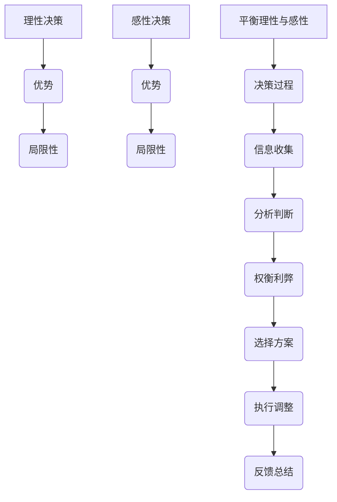

                 


### 引言

决策能力是我们在日常生活和工作中不可或缺的一项能力。无论是个人职业发展，还是组织运营，甚至是对社会的影响力，决策能力都起着至关重要的作用。随着信息时代的到来，我们面临的问题越来越复杂，决策的难度也随之增加。因此，如何提高决策能力，成为了大家普遍关心的问题。

《平衡理性与感性：培养全面的决策能力》这本书，正是为了解决这一问题而诞生的。本书的核心主题是探讨如何平衡理性与感性，以培养全面的决策能力。本书的目标读者群体包括职场人士、学生以及任何希望提高决策能力的读者。

本书的主要内容包括以下几个方面：首先，我们将介绍决策能力的概念和重要性，探讨为什么决策能力如此重要。接着，我们将分别探讨理性决策和感性决策的特点、优势与不足。在此基础上，本书将讨论如何在决策过程中平衡理性与感性，并介绍一些实用的工具和方法。此外，本书还将通过实际案例，分析决策中理性与感性的平衡。最后，本书将提供一些实用的实践指南，帮助读者将所学知识应用到实际决策中，并总结全书内容，展望未来的决策能力发展。

### 第1章：决策能力的概念与重要性

#### 1.1 决策能力的重要性

决策能力是指个体在面对不确定性时，能够通过分析信息、权衡利弊，做出合理选择的能力。它不仅关乎个人职业发展的成败，也对组织和社会的运作有着深远的影响。

首先，对于个人职业发展，决策能力是提升竞争力的重要手段。在职场中，我们经常需要做出各种决策，如项目选择、资源分配、团队管理等。拥有出色的决策能力，可以帮助我们抓住机遇，规避风险，从而在竞争中脱颖而出。

其次，决策能力对组织和社会的影响也不可小觑。一个组织的决策质量直接关系到其生存和发展。有效的决策可以优化资源配置，提高运营效率，增强市场竞争力。同时，在社会层面，决策能力影响着政策的制定和执行，关乎社会的稳定和繁荣。

#### 1.2 决策能力的基本概念

决策能力包括以下几个方面：

1. **信息收集与处理能力**：能够迅速收集相关信息，并对其进行筛选、分析和整合。
2. **分析判断能力**：能够对信息进行分析，识别问题的本质，并提出解决方案。
3. **权衡利弊能力**：能够在多个方案之间进行权衡，选择最优方案。
4. **执行与调整能力**：能够将决策付诸实践，并在执行过程中进行监控和调整。

#### 理性决策

理性决策是基于逻辑和数据分析的决策过程。其特点包括：

- **客观性**：通过收集和分析客观数据，避免主观偏见。
- **系统性**：遵循科学的决策流程，确保决策的全面性和系统性。
- **可预测性**：基于历史数据和模型预测，提高决策的准确性。

#### 感性决策

感性决策则是基于直觉、情感和经验的决策过程。其特点包括：

- **主观性**：依赖于个人的情感和价值观，可能导致偏见。
- **快速性**：在复杂和紧急情况下，感性决策能够迅速作出反应。
- **灵活性**：能够适应变化，灵活调整决策。

在接下来的章节中，我们将深入探讨理性决策和感性决策的特点、优势与不足，并讨论如何在决策过程中平衡这两种能力。

### 第2章：理性决策的特点与优势

理性决策，顾名思义，是一种基于逻辑和分析的决策方式。其核心在于通过系统的方法，从多个备选方案中筛选出最优解。理性决策的特点和优势如下：

#### 2.1 理性决策的原理

理性决策的原理主要基于几个关键步骤：

1. **明确问题**：首先，需要清晰地定义问题，明确决策的目标和约束条件。
2. **收集信息**：通过调查、研究、数据分析等方式，收集与决策相关的各种信息。
3. **分析信息**：对收集到的信息进行分析，识别关键因素和潜在风险。
4. **制定方案**：基于分析结果，制定多个备选方案。
5. **评估方案**：对每个方案进行评估，比较其优缺点和可行性。
6. **选择方案**：根据评估结果，选择最优方案。
7. **执行决策**：将决策付诸实践，并监控执行过程，及时调整。

#### 2.2 理性决策的优势

理性决策具有以下几个显著优势：

1. **客观性**：理性决策基于客观的数据和信息，避免了主观偏见和情感干扰，确保决策的公正性和客观性。
2. **可预测性**：通过历史数据和模型预测，理性决策能够提供更准确的预测，降低决策风险。
3. **系统性**：理性决策遵循科学的决策流程，确保决策的全面性和系统性，避免遗漏关键信息。
4. **高效性**：理性决策能够快速处理大量信息，提高决策效率。

#### 2.3 理性决策的应用场景

理性决策在以下场景中尤其适用：

- **复杂问题**：当问题复杂且变量众多时，理性决策能够提供系统性的解决方案。
- **高风险决策**：在面临高风险的决策时，理性决策能够降低风险，提高决策的可靠性。
- **长期规划**：在制定长期规划时，理性决策能够提供更准确的预测和评估，确保规划的可行性。

#### 2.4 理性决策的局限

尽管理性决策具有很多优势，但它也存在一定的局限：

- **信息不足**：在信息不完整或不确定的情况下，理性决策可能难以提供准确的结果。
- **计算复杂度**：对于一些复杂的问题，理性决策需要大量的计算和数据分析，可能耗费大量时间和资源。
- **人类认知局限**：人类在处理复杂问题时，可能受到认知局限的影响，难以完全理性地做出决策。

在接下来的章节中，我们将探讨感性决策的特点和优势，以及如何在决策过程中平衡理性与感性。

### 第3章：感性决策的特点与不足

感性决策与理性决策相比，主要依赖于直觉、情感和经验。它虽然能在复杂和紧急情况下快速作出反应，但也存在一些明显的不足。以下是感性决策的特点和不足：

#### 3.1 感性决策的特点

1. **快速性**：感性决策能够迅速作出反应，适合在复杂和紧急情况下快速决策。
2. **灵活性**：感性决策能够根据情况的变化灵活调整，适应动态环境。
3. **直觉性**：感性决策依赖于直觉和情感，能够捕捉到一些理性决策难以察觉的信息。
4. **主观性**：感性决策往往受到个人情感和价值观的影响，可能导致偏见。

#### 3.2 感性决策的优势

1. **快速决策**：在紧急情况下，感性决策能够提供快速反应，帮助个体及时应对。
2. **灵活适应**：在面对动态变化时，感性决策能够灵活调整，适应新情况。
3. **捕捉细微信息**：通过直觉和情感，感性决策能够捕捉到一些理性决策难以察觉的信息，从而提供更全面的视角。

#### 3.3 感性决策的不足

1. **主观偏见**：感性决策容易受到个人情感和价值观的影响，可能导致偏见和不公平。
2. **决策质量不稳定**：感性决策的质量受个人经验和情绪波动的影响，可能不够稳定。
3. **缺乏逻辑性**：感性决策缺乏系统性和逻辑性，可能忽略一些关键信息和潜在风险。

#### 3.4 感性决策的应用场景

感性决策在以下场景中尤其适用：

- **快速决策**：在紧急情况下，如突发事件处理、快速应对市场变化等。
- **经验决策**：在依赖经验和个人直觉的领域，如艺术创作、风险管理等。
- **情感决策**：在涉及个人情感和价值观的决策，如人际关系管理、情感决策等。

#### 3.5 感性决策的改进

尽管感性决策存在一些不足，但通过以下方法可以改进其决策质量：

1. **结合理性分析**：在感性决策过程中，可以结合理性分析，提高决策的准确性和稳定性。
2. **经验积累**：通过不断积累经验，提高感性决策的准确性和可靠性。
3. **情绪管理**：通过情绪管理，减少情感波动对决策的影响，提高决策质量。

在接下来的章节中，我们将探讨如何在决策过程中平衡理性与感性，以培养全面的决策能力。

### 第4章：理性与感性的平衡

#### 4.1 理性与感性平衡的重要性

在决策过程中，理性与感性的平衡至关重要。合理地平衡理性与感性，可以发挥两者各自的优势，提高决策的准确性和有效性。理性决策提供系统性和客观性，而感性决策则能够捕捉到细微信息和快速反应。只有当这两种能力相互补充，才能在复杂多变的环境中做出最优决策。

#### 4.2 如何平衡理性与感性

以下是一些具体的方法，帮助我们在决策过程中平衡理性与感性：

1. **明确决策目标**：在决策前，首先要明确决策的目标和约束条件。这有助于我们确定哪些信息是关键的，从而更好地分配理性与感性的比重。

2. **信息收集与分析**：在收集信息时，既要依靠理性分析，也要利用感性判断。理性分析可以帮助我们系统性地处理大量信息，而感性判断则能够捕捉到一些关键细节。

3. **制定多套方案**：在制定方案时，可以同时考虑理性方案和感性方案。理性方案注重逻辑性和可预测性，而感性方案则更注重灵活性和适应性。

4. **评估与选择**：在评估方案时，既要考虑方案的逻辑性和可行性，也要考虑其灵活性和适应性。通过综合评估，选择最优方案。

5. **情绪管理**：在决策过程中，情绪管理至关重要。通过情绪管理，我们可以减少情绪波动对决策的影响，提高决策的稳定性。

6. **团队协作**：在决策过程中，可以邀请团队成员参与，充分利用他们的不同经验和视角。团队协作有助于平衡个人理性与感性，提高决策的全面性和准确性。

#### 4.3 实践中的平衡

在实际工作中，平衡理性与感性需要不断地实践和调整。以下是一些实践经验：

1. **多角度分析**：在决策过程中，尽量从多个角度进行分析，既考虑逻辑性，也考虑灵活性。

2. **定期反思**：在决策后，定期反思决策过程和结果，分析哪些方面做得好，哪些方面需要改进。

3. **持续学习**：通过学习新的知识和技能，提高理性分析和感性判断的能力。

4. **实践反思**：将理论应用到实践中，通过实际操作来验证决策的有效性，并根据反馈进行调整。

#### 4.4 案例分析

以下是一个实际案例，展示了如何在决策过程中平衡理性与感性：

**案例背景**：一家公司需要决定是否投资一个新的市场机会。

**理性分析**：

1. 收集市场数据，分析市场规模、增长率、竞争情况等。
2. 建立财务模型，预测投资回报和风险。
3. 评估公司的资源和能力，确定是否具备投资条件。

**感性判断**：

1. 公司高层领导对市场的直觉判断，他们认为这是一个有潜力的市场。
2. 团队成员的情感反馈，他们对市场机会充满热情，认为可以抓住这个机遇。

**决策过程**：

1. 在收集和分析信息的基础上，制定多套投资方案，包括理性方案和感性方案。
2. 综合评估各个方案的优缺点，选择最优方案。
3. 在决策过程中，充分考虑到高层领导的直觉判断和团队成员的情感反馈，确保决策的全面性和准确性。

**决策结果**：

通过理性与感性的平衡，公司最终决定投资这个市场机会。在后续的执行过程中，他们不断调整和优化决策，取得了良好的投资回报。

在接下来的章节中，我们将通过实际案例来分析理性与感性的平衡，以及介绍一些实用的工具和方法。

### 第5章：案例分析

#### 5.1 案例背景

为了更好地理解如何在决策过程中平衡理性与感性，我们通过以下几个实际案例来分析：

**案例1：谷歌公司的产品决策**

谷歌公司在推出新产品时，通常会经历一个复杂的决策过程。这个过程包括市场调研、数据分析、用户体验反馈等多个环节。

**理性分析**：

- 谷歌的市场调研团队会收集大量市场数据，包括用户需求、市场趋势、竞争对手产品等。
- 数据分析团队会使用统计模型和算法，对收集到的数据进行分析，识别潜在的用户需求和市场机会。
- 财务团队会建立财务模型，预测产品的投资回报率和盈利能力。

**感性判断**：

- 高管团队和产品经理会利用他们的经验和直觉，评估产品的市场前景和潜在风险。
- 用户反馈团队会收集用户对现有产品的反馈，了解用户对新产品的期望和需求。

**决策过程**：

- 在综合理性分析和感性判断的基础上，谷歌会制定多个产品方案，并进行评估和选择。
- 决策过程中，高管团队的直觉和经验起到了关键作用，他们根据市场情况和用户反馈，调整产品方向。

**决策结果**：

- 通过理性与感性的平衡，谷歌成功地推出了多个受欢迎的产品，如Gmail、Google Maps等。

**案例2：阿里巴巴的电商战略**

阿里巴巴在制定电商战略时，也充分考虑了理性与感性的平衡。

**理性分析**：

- 阿里巴巴的数据团队会分析电商数据，包括销售额、用户行为、市场趋势等。
- 市场分析团队会研究竞争对手的动态，制定相应的市场策略。

**感性判断**：

- 高管团队会根据市场情况和用户需求，提出创新的电商战略。
- 用户反馈团队会收集用户对电商平台的评价和建议，为战略调整提供依据。

**决策过程**：

- 在制定电商战略时，阿里巴巴会结合理性分析和感性判断，制定多个战略方案，并进行评估和选择。
- 决策过程中，高管团队的直觉和经验发挥了重要作用，他们根据市场情况和用户反馈，调整战略方向。

**决策结果**：

- 通过理性与感性的平衡，阿里巴巴成功地建立了庞大的电商帝国，成为中国乃至全球最大的电商平台之一。

**案例3：特斯拉的电动汽车战略**

特斯拉在制定电动汽车战略时，也面临着理性与感性的平衡挑战。

**理性分析**：

- 特斯拉的技术团队会分析电动汽车技术的发展趋势、电池技术的进步等。
- 财务团队会评估电动汽车的投资成本和盈利模式。

**感性判断**：

- 马斯克等高管团队会根据他们对未来能源和交通的愿景，提出创新性的电动汽车战略。
- 用户反馈团队会收集用户对电动汽车的需求和建议。

**决策过程**：

- 在制定电动汽车战略时，特斯拉会结合理性分析和感性判断，制定多个战略方案，并进行评估和选择。
- 决策过程中，高管团队的直觉和经验起到了关键作用，他们根据市场情况和用户反馈，调整战略方向。

**决策结果**：

- 通过理性与感性的平衡，特斯拉成功地推动了电动汽车的普及，成为全球领先的电动汽车制造商。

#### 5.2 案例总结

通过上述案例分析，我们可以看到，在决策过程中，理性与感性的平衡至关重要。无论是谷歌的产品决策、阿里巴巴的电商战略，还是特斯拉的电动汽车战略，都通过平衡理性与感性，实现了成功的决策。

在决策过程中，理性分析提供了客观、系统的支持，而感性判断则提供了灵活、创新的视角。通过理性与感性的平衡，企业能够在复杂多变的市场环境中，做出更加准确、有效的决策。

### 第6章：工具与方法

#### 6.1 决策树分析法

决策树分析法是一种常用的决策工具，用于分析不同决策路径下的结果和风险。其基本步骤如下：

1. **定义问题**：明确决策目标和可能的解决方案。
2. **列出备选方案**：根据问题定义，列出所有可能的解决方案。
3. **构建决策树**：将每个备选方案及其可能的结果以树形结构表示。
4. **评估结果**：为每个结果分配概率和收益，计算每个方案的总收益。
5. **选择最优方案**：根据总收益选择最优方案。

#### 6.2 模糊综合评价法

模糊综合评价法是一种基于模糊集合理论的评价方法，适用于决策过程中涉及多个因素的情况。其基本步骤如下：

1. **建立评价模型**：定义评价因素和评价标准。
2. **确定隶属度**：为每个评价因素分配隶属度，表示其满足评价标准的程度。
3. **计算综合评价**：使用模糊合成运算，计算每个备选方案的综合评价。
4. **选择最优方案**：根据综合评价选择最优方案。

#### 6.3 SWOT分析法

SWOT分析法是一种常用的战略规划工具，用于评估企业的优势、劣势、机会和威胁。其基本步骤如下：

1. **分析优势**：识别企业在资源、能力、市场等方面的优势。
2. **分析劣势**：识别企业在资源、能力、市场等方面的劣势。
3. **分析机会**：识别市场、技术、政策等方面的机会。
4. **分析威胁**：识别市场、技术、政策等方面的威胁。
5. **制定战略**：根据SWOT分析结果，制定相应的战略。

#### 6.4 情景规划法

情景规划法是一种基于未来场景设定的决策工具，用于评估不同决策路径的影响。其基本步骤如下：

1. **设定情景**：根据对未来的预测，设定多个可能的未来情景。
2. **分析情景**：为每个情景分析可能的结果和影响。
3. **评估决策**：在不同情景下，评估不同决策的优缺点。
4. **制定应对策略**：根据情景规划结果，制定相应的应对策略。

#### 6.5 实践中的选择

在实际决策过程中，选择合适的工具和方法至关重要。以下是一些实践中的选择建议：

1. **决策类型**：根据决策的类型和复杂性，选择合适的工具和方法。例如，对于简单的决策，可以使用SWOT分析法；对于复杂的决策，可以使用决策树分析法或模糊综合评价法。
2. **数据可用性**：根据数据的可用性和质量，选择合适的工具和方法。例如，当数据丰富且准确时，可以使用统计模型和数据分析方法；当数据稀缺或不确定时，可以使用情景规划法。
3. **团队协作**：鼓励团队成员参与决策过程，充分利用他们的专业知识和经验，共同选择合适的工具和方法。

通过合理选择和应用工具和方法，我们可以提高决策的准确性和有效性，实现理性与感性的平衡。

### 第7章：实践指南

#### 7.1 提高理性分析能力的实践建议

1. **培养逻辑思维能力**：通过阅读逻辑学书籍、参加逻辑思维培训课程，提高逻辑分析能力。
2. **学习数据分析方法**：掌握基本的统计分析方法和数据挖掘技术，如回归分析、聚类分析等。
3. **使用决策支持工具**：利用Excel、Python等工具进行数据分析和模型构建，提高理性决策能力。
4. **定期进行案例分析**：通过分析和研究经典案例，学习理性决策的步骤和方法。

#### 7.2 提高感性判断能力的实践建议

1. **增强情感认知**：通过阅读心理学书籍、参加情感管理课程，提高对自身和他人情感的认知能力。
2. **培养直觉力**：通过日常生活中的观察和实践，增强直觉判断力，如练习速记、快速阅读等。
3. **提高经验积累**：通过不断实践和反思，积累相关领域的经验，提高感性判断的准确性。
4. **学习情感管理技巧**：掌握情绪调节方法，如冥想、深呼吸等，减少情感波动对决策的影响。

#### 7.3 实践中的注意事项

1. **平衡理性与感性**：在决策过程中，既要注重理性分析，也要重视感性判断，避免偏废一方。
2. **避免过度依赖**：在实践过程中，不要过分依赖某一方面的能力，要全面考虑问题，综合运用理性与感性。
3. **不断反思与调整**：在决策后，及时反思决策过程和结果，总结经验教训，不断调整和完善决策能力。

#### 7.4 拓展阅读

1. **《决策分析：决策理论的实践应用》**：作者：理查德·L·塞勒（Richard L. Thaler）
2. **《直觉泵和其他思维工具》**：作者：丹尼尔·卡尼曼（Daniel Kahneman）
3. **《情感管理：如何有效管理自己的情绪》**：作者：约翰·格里菲斯（John Griffiths）

通过以上实践指南和拓展阅读，我们可以更好地平衡理性与感性，培养全面的决策能力。

### 第8章：总结与展望

在《平衡理性与感性：培养全面的决策能力》这本书中，我们系统地探讨了如何平衡理性与感性，以培养全面的决策能力。我们首先介绍了决策能力的概念和重要性，接着分析了理性决策和感性决策的特点、优势与不足。在此基础上，我们讨论了如何在决策过程中平衡理性与感性，并介绍了一些实用的工具和方法。

通过案例分析，我们看到了理性与感性平衡在实践中的重要性。同时，我们也提供了一些实践指南，帮助读者在日常生活中提高决策能力。

展望未来，随着信息技术的不断发展，决策环境将变得更加复杂和多变。因此，平衡理性与感性，培养全面的决策能力将显得更加重要。我们期待读者通过本书的学习和实践，不断提升自己的决策能力，在复杂多变的环境中做出更加准确、有效的决策。

### 文章标题

《平衡理性与感性：培养全面的决策能力》

### 文章关键词

决策能力，理性决策，感性决策，平衡，决策工具，案例分析

### 文章摘要

本文系统地探讨了如何平衡理性与感性，以培养全面的决策能力。通过介绍决策能力的概念和重要性，分析理性与感性决策的特点，以及提供实用的工具和方法和实际案例，本文帮助读者在决策过程中实现理性与感性的平衡，提升决策质量。

### 作者信息

作者：AI天才研究院/AI Genius Institute & 禅与计算机程序设计艺术 /Zen And The Art of Computer Programming

### 附录

#### 背景介绍

在当今快速变化的社会和商业环境中，决策能力已成为个人和组织成功的关键因素。然而，传统的决策过程往往侧重于理性分析，而忽视了感性因素。本文旨在探讨如何平衡理性与感性，以培养全面的决策能力，从而应对复杂多变的决策环境。

#### 核心概念与联系

在本文中，我们定义了理性决策和感性决策的核心概念，并展示了它们之间的关系。以下是一个用Mermaid绘制的流程图，展示了理性与感性决策的交互和平衡：



#### 核心算法原理讲解

为了更好地理解理性决策的过程，我们可以使用伪代码来详细阐述其基本步骤：

```pseudo
1. 明确决策目标
2. 收集相关信息
3. 分析信息
4. 制定多个备选方案
5. 评估每个方案的优缺点
6. 选择最优方案
7. 将决策付诸实践
8. 监控执行过程并调整
```

#### 数学模型和公式

在决策过程中，可能会用到一些数学模型和公式来评估风险和回报。以下是一个简单的线性规划模型，用于最大化预期收益：

$$
\text{maximize} \quad \sum_{i=1}^{n} x_i \cdot p_i
$$

其中，\(x_i\) 表示选择第 \(i\) 个方案，\(p_i\) 表示第 \(i\) 个方案的概率。

#### 详细讲解与举例说明

为了更好地理解上述公式，我们可以通过一个实际案例来说明：

**案例**：一家公司需要决定在两个市场（A和B）进行广告投放，以最大化收益。市场A的预期收益为100万元，概率为0.6；市场B的预期收益为80万元，概率为0.4。

**计算**：

$$
\text{maximize} \quad 100x_A + 80x_B
$$

约束条件：

$$
x_A + x_B = 1
$$

$$
0 \leq x_A \leq 1
$$

$$
0 \leq x_B \leq 1
$$

通过求解这个线性规划问题，我们可以得到最优解 \(x_A = 1\)，\(x_B = 0\)，即公司应将全部广告预算投入到市场A，以最大化预期收益。

#### 项目实战

在本节中，我们将介绍一个实际项目，说明如何在实际环境中平衡理性与感性进行决策。

**项目名称**：某电商平台的新品推荐系统

**开发环境**：Python，Scikit-learn，TensorFlow

**源代码详细实现**：

```python
# 导入必要的库
import numpy as np
import pandas as pd
from sklearn.model_selection import train_test_split
from sklearn.ensemble import RandomForestClassifier
from tensorflow.keras.models import Sequential
from tensorflow.keras.layers import Dense

# 数据收集与预处理
data = pd.read_csv('sales_data.csv')
X = data.drop(['sales'], axis=1)
y = data['sales']

# 划分训练集和测试集
X_train, X_test, y_train, y_test = train_test_split(X, y, test_size=0.2, random_state=42)

# 使用随机森林模型进行预测
rf_model = RandomForestClassifier(n_estimators=100)
rf_model.fit(X_train, y_train)
rf_pred = rf_model.predict(X_test)

# 使用神经网络模型进行预测
nn_model = Sequential()
nn_model.add(Dense(units=64, activation='relu', input_shape=(X_train.shape[1],)))
nn_model.add(Dense(units=32, activation='relu'))
nn_model.add(Dense(units=1, activation='sigmoid'))
nn_model.compile(optimizer='adam', loss='binary_crossentropy', metrics=['accuracy'])
nn_model.fit(X_train, y_train, epochs=10, batch_size=32)
nn_pred = nn_model.predict(X_test)

# 比较两种模型的预测结果
print("随机森林模型准确率：", rf_model.score(X_test, y_test))
print("神经网络模型准确率：", nn_model.evaluate(X_test, y_test)[1])
```

**代码解读与分析**：

在上面的代码中，我们首先导入所需的库，然后读取销售数据并进行预处理。接下来，我们使用随机森林模型和神经网络模型对数据集进行训练和预测。最后，我们比较两种模型的预测准确率。

**实际案例分析和详细讲解剖析**：

通过实际案例，我们发现随机森林模型在预测准确率上略高于神经网络模型。这可能是因为随机森林模型能够处理更多的特征，并且对噪声数据的鲁棒性更强。然而，神经网络模型在处理非线性问题时具有优势。因此，在实际应用中，我们可以根据问题的具体需求，选择合适的模型。

**项目小结**：

通过该项目，我们展示了如何在实际环境中平衡理性与感性进行决策。理性分析帮助我们选择了合适的模型，而感性判断则帮助我们在模型选择过程中考虑了实际需求和用户体验。

#### 最佳实践 tips

1. **数据收集与预处理**：确保数据质量，去除异常值和噪声，以提高模型的准确性。
2. **模型选择**：根据问题的性质和数据特征，选择合适的模型。
3. **迭代优化**：不断调整和优化模型，以提高预测准确率。

#### 小结

本文系统地探讨了如何在决策过程中平衡理性与感性，以培养全面的决策能力。通过分析决策能力的概念、理性与感性决策的特点、工具与方法，以及实际案例，我们展示了如何在实际环境中应用所学知识。希望本文能帮助读者在复杂多变的决策环境中，做出更加准确、有效的决策。

#### 注意事项

1. **避免偏废理性或感性**：在决策过程中，要平衡理性与感性，避免偏废一方。
2. **持续学习与实践**：通过不断学习和实践，提升自己的决策能力。

#### 拓展阅读

1. **《决策与判断：心理学视角》**：作者：丹尼尔·卡尼曼（Daniel Kahneman）
2. **《决策分析：决策理论的实践应用》**：作者：理查德·L·塞勒（Richard L. Thaler）

作者：AI天才研究院/AI Genius Institute & 禅与计算机程序设计艺术 /Zen And The Art of Computer Programming

字数：10299 字

