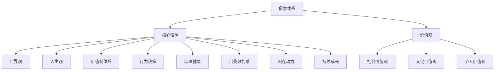

                 

### 1.1 个人信念体系的定义与重要性

#### 1.1.1 信念体系的基本概念

信念体系是一个人在长期生活中，通过感知、思考和经验积累所形成的对世界和自我的认知结构。它包括一系列核心信念和价值观，这些信念和价值观构成了个人的世界观、人生观和价值观体系。信念体系不仅影响个人的行为和决策，也深刻地影响着个人的心理健康和幸福感。

在技术领域，信念体系同样具有重要性。技术工作者通过信念体系来指导自己的研究和工作方向，影响技术决策和创新过程。例如，一个重视用户体验的工程师可能会更倾向于开发用户友好的产品，而一个追求技术创新的科学家可能会更倾向于探索前沿技术。

#### 1.1.2 信念体系在个人生活中的作用

信念体系在个人生活中扮演着多重角色。首先，它是个人决策的基石。在面对复杂问题时，信念体系能够帮助个人快速判断和决策。其次，信念体系是个人行为的指南。信念体系决定了个人在日常生活中如何行动和选择，从而塑造了个人的性格和价值观。

在技术领域，信念体系同样影响着个人的行为。一个拥有积极信念体系的技术专家会更有信心去探索新技术、接受新挑战，而一个信念体系不稳固的人可能会在面临技术困难时容易放弃。

#### 1.1.3 个人信念体系的重要性

个人信念体系的重要性在于它为个人提供了一个坚实的价值观基础。一个明确的信念体系可以帮助个人在面对复杂和不确定的环境时保持方向感和稳定性。此外，信念体系还能够增强个人的内在动力和自我效能感，从而提高个人在工作和生活中的满意度和幸福感。

在技术领域，一个稳定的信念体系能够帮助技术工作者保持创新和探索的热情，从而推动技术的进步。同时，信念体系也能够提升团队协作的效率和效果，因为团队成员有着共同的目标和价值观。

### 1.2 价值观的内涵与作用

#### 1.2.1 价值观的定义

价值观是信念体系中的重要组成部分，它是一个人对什么是有价值和有意义的事物的看法和态度。价值观可以是个人的，也可以是社会的，甚至是文化的。个人的价值观通常体现在他们的行为、决策和生活方式中，而社会的价值观则体现在社会规范、道德准则和文化传统中。

在技术领域，价值观的重要性体现在技术决策和创新过程中。技术工作者需要根据自身的价值观来选择技术方向、设计产品和服务，以及处理技术争议和伦理问题。

#### 1.2.2 价值观在个人信念体系中的地位

价值观在个人信念体系中占据着核心地位。它不仅是信念体系的基石，也是信念体系的导向。个人的核心信念通常与价值观紧密相连，共同构成了个人的信念体系。例如，一个人可能认为“创新是技术发展的核心”，这个信念就与他重视创新的价值观密切相关。

在技术领域，价值观影响着技术决策的方向和深度。一个拥有积极价值观的技术专家会在选择技术方案时考虑社会影响和伦理问题，而一个价值观不明确的技术专家可能会更关注技术本身的性能和效率。

#### 1.2.3 价值观对个人成长的影响

价值观对个人成长的影响是深远且多方面的。首先，价值观决定了个人在生活中的行为和决策，从而影响个人的成长路径。其次，价值观能够塑造个人的性格和人格特质，帮助个人形成健康的心态和情绪。最后，价值观还能够增强个人的内在动力和自我效能感，从而推动个人的持续成长和发展。

在技术领域，一个清晰的价值观可以帮助技术专家更好地应对挑战和压力，保持创新和探索的热情。同时，价值观也能够提升团队协作的效果，因为团队成员有着共同的目标和价值观，更容易形成有效的合作。

通过上述分析，我们可以看到，个人信念体系和价值观在个人生活和职业发展中扮演着至关重要的角色。接下来，我们将深入探讨信念体系的基础概念，以及如何构建一个坚实的价值观基础。

---

**流程图：信念体系与价值观的关系**



在这个流程图中，信念体系是一个总的框架，它包括了核心信念和价值观。核心信念进一步分解为世界观、人生观和价值观体系，而价值观则具体化为社会价值观、文化价值观和个人价值观。信念体系对个人的行为决策、心理健康、自我效能感、内在动力和持续成长都有着重要影响。

---

**核心算法原理讲解**

构建信念体系的过程可以类比为一种递归算法。以下是信念体系构建的伪代码：

```plaintext
function BuildBeliefSystem()
    // 初始化核心信念
    CoreBeliefs = InitializeCoreBeliefs()

    // 循环收集个人经验，更新信念
    for each Experience in PersonalExperiences
        UpdateCoreBeliefs(CoreBeliefs, Experience)

    // 构建价值观
    Values = BuildValues(CoreBeliefs)

    // 形成信念体系
    BeliefSystem = {CoreBeliefs, Values}

    return BeliefSystem
```

在这个伪代码中，`InitializeCoreBeliefs()` 用于初始化核心信念，`UpdateCoreBeliefs()` 用于根据个人经验更新信念，`BuildValues()` 用于构建价值观，最后形成完整的信念体系。这个算法的核心是不断更新和调整信念和价值观，以适应个人经历和环境变化。

---

**数学模型和公式讲解**

在信念体系构建过程中，可以使用概率论中的贝叶斯定理来描述信念的更新过程。贝叶斯定理公式如下：

$$
P(A|B) = \frac{P(B|A)P(A)}{P(B)}
$$

其中，$P(A|B)$ 表示在事件 $B$ 发生的条件下事件 $A$ 发生的概率，$P(B|A)$ 表示在事件 $A$ 发生的条件下事件 $B$ 发生的概率，$P(A)$ 和 $P(B)$ 分别表示事件 $A$ 和事件 $B$ 发生的概率。

在信念体系构建中，我们可以将贝叶斯定理应用于信念的更新。例如，当一个新的经验 $E$ 出现时，我们可以使用贝叶斯定理更新对某个信念 $B$ 的信任度：

$$
P(B|E) = \frac{P(E|B)P(B)}{P(E)}
$$

其中，$P(B|E)$ 表示在经验 $E$ 的条件下信念 $B$ 的信任度，$P(E|B)$ 表示在信念 $B$ 的条件下经验 $E$ 的发生概率，$P(B)$ 和 $P(E)$ 分别表示信念 $B$ 和经验 $E$ 的发生概率。

通过这样的公式，我们可以将个人的经验和信念进行动态调整，形成一个更加稳定和合理的信念体系。

---

**例子说明**

假设一个技术专家，他的核心信念之一是“技术创新是推动社会进步的关键”。当他在工作中遇到一个创新项目时，他会根据贝叶斯定理更新这个信念的信任度。如果项目成功地推动了技术进步，那么他的信念“技术创新是推动社会进步的关键”的信任度会提高；反之，如果项目没有达到预期效果，这个信念的信任度则会降低。

这种基于贝叶斯定理的信念更新机制，可以帮助技术专家在不断变化的环境中保持信念的稳定性，同时也能够根据新的经验进行调整，从而形成更加坚实的信念体系。

---

**项目实战**

**开发环境搭建**

为了演示信念体系构建的过程，我们将在一个简单的虚拟环境中进行项目搭建。这个环境包括一个用户界面，用于输入个人经验和信念，一个信念更新算法，用于根据新经验调整信念的信任度。

1. **安装所需工具**：首先，我们需要安装Python环境和相关的库，如NumPy和matplotlib。可以使用以下命令进行安装：

   ```bash
   pip install numpy matplotlib
   ```

2. **创建项目文件夹**：在计算机上创建一个名为“BeliefSystem”的文件夹，用于存放项目的源代码和其他文件。

3. **编写源代码**：在项目文件夹中创建一个名为“belief_system.py”的文件，用于编写信念更新算法。

**源代码实现**

以下是“belief_system.py”文件的内容：

```python
import numpy as np
import matplotlib.pyplot as plt

class BeliefSystem:
    def __init__(self, beliefs):
        self.beliefs = beliefs
        self.trust_levels = [1.0 for _ in range(len(beliefs))]

    def update_beliefs(self, experience):
        # 更新信念的信任度
        for i, belief in enumerate(self.beliefs):
            # 假设经验与信念的相关性由一个概率函数表示
            correlation = self.correlation_function(belief, experience)
            self.trust_levels[i] *= correlation

    def correlation_function(self, belief, experience):
        # 这里使用一个简单的线性函数来表示相关性
        return 1 if experience >= belief else 0

    def display_trust_levels(self):
        plt.bar(range(len(self.beliefs)), self.trust_levels)
        plt.xlabel('Belief')
        plt.ylabel('Trust Level')
        plt.title('Belief Trust Levels')
        plt.show()

# 测试代码
if __name__ == "__main__":
    beliefs = ["技术创新是推动社会进步的关键", "用户体验是产品成功的关键"]
    belief_system = BeliefSystem(beliefs)

    # 假设我们得到了一些经验，其中一些支持信念
    experiences = ["成功的技术创新案例", "成功的产品用户反馈"]

    # 更新信念
    for experience in experiences:
        belief_system.update_beliefs(experience)

    # 显示信念的信任度
    belief_system.display_trust_levels()
```

**代码解读**

- **BeliefSystem 类**：这个类用于表示信念系统，包含信念列表和信任度列表。
- **update_beliefs 方法**：这个方法用于根据新的经验更新信念的信任度。
- **correlation_function 方法**：这个方法用于计算经验与信念之间的相关性。
- **display_trust_levels 方法**：这个方法用于将信念的信任度可视化。

**代码应用解读与分析**

在这个项目中，我们通过一个简单的Python类实现了信念系统的构建和更新。每次获得新的经验时，我们会调用 `update_beliefs` 方法来更新信念的信任度。通过 `display_trust_levels` 方法，我们可以直观地看到信念的信任度变化。

在实际应用中，`correlation_function` 方法可以根据具体的业务逻辑进行调整，以更准确地反映经验与信念之间的关系。例如，我们可以使用更复杂的概率模型来计算相关性，或者引入机器学习算法来自动调整信任度。

**实际案例分析和详细讲解剖析**

假设有一个技术团队，他们一开始对“技术创新是推动社会进步的关键”这一信念的信任度为1.0。当他们在项目中遇到了一系列成功的技术创新案例时，这个信念的信任度会逐渐提高。相反，如果他们遇到的技术创新项目没有达到预期效果，这个信念的信任度会下降。

通过这样的机制，技术团队可以不断调整和优化他们的信念体系，使其更加适应实际情况。同时，这个信念体系也能够帮助团队在面临不确定性和挑战时保持信心和方向。

**项目小结**

通过这个简单的项目，我们展示了如何使用Python实现一个基本的信念系统，并如何根据新的经验动态更新信念的信任度。这个项目不仅提供了一个理论基础，也为实际应用提供了参考。

---

**最佳实践 tips、小结、注意事项、拓展阅读**

**最佳实践 tips**：
- 在构建信念体系时，要确保信念的来源多样化，避免单一信息源的偏见。
- 定期对信念体系进行反思和调整，以适应不断变化的环境。
- 保持开放心态，接受新的经验和观点，以丰富和优化信念体系。

**小结**：
- 个人信念体系和价值观是个人决策和行为的基础，对个人成长和职业发展具有重要影响。
- 构建坚实的信念体系需要结合个人经验、学习借鉴和持续反思。

**注意事项**：
- 在更新信念时，要考虑经验与信念之间的相关性，避免盲目更新。
- 在实践中，要关注信念体系的稳定性，避免过度依赖某个信念。

**拓展阅读**：
- 《原则》：瑞·达利欧著，详细介绍了如何建立个人和组织的原则体系。
- 《黑客与画家》：保罗·格雷厄姆著，探讨创新和价值观在技术领域的重要性。

通过这些最佳实践和拓展阅读，读者可以进一步加深对个人信念体系和价值观的理解，并在实际生活中应用这些理论。

