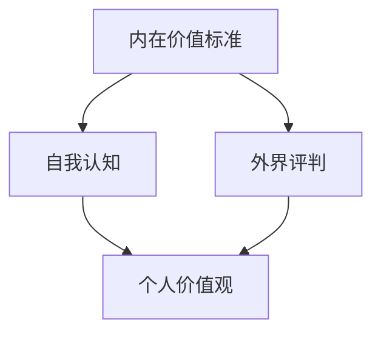

                 


# 建立内在价值标准：摆脱外界评判的束缚

> 关键词：内在价值标准，自我认知，外界评判，个人价值观，自我接纳

> 摘要：本文旨在探讨如何建立内在价值标准，摆脱外界评判的束缚，实现个人的自我成长与价值实现。通过逐步分析内在价值标准、自我认知、外界评判和个人价值观的关系，本文提供了一系列实用的策略和技巧，帮助读者建立稳定的内在价值体系，实现内心的平和与自我价值的实现。

## 1.1 设计概述

### 1.1.1 书籍主题

《建立内在价值标准：摆脱外界评判的束缚》是一本针对现代人在社会中面临的各种评判和压力，引导读者构建稳定内在价值体系的书籍。书中通过深入探讨内在价值标准、自我认知、外界评判和个人价值观的关系，为读者提供了实用的方法和策略，帮助他们在纷繁复杂的社会环境中保持自我，实现内心的平和与自我价值的实现。

### 1.1.2 目标读者

本书的目标读者主要包括以下几个方面：

1. 大学生和职场新人：这些人群正处于人生的重要阶段，面临着各种评判和压力，需要找到自己的价值方向和目标。
2. 职场人士：在工作中，他们可能会因为外界的评判而感到迷茫和焦虑，本书将帮助他们建立稳定的内在价值体系，提高自信和抗压能力。
3. 寻求自我成长和自我认知的个体：无论年龄和职业，这些个体都在追求内心的平和和自我价值的实现，本书将为他们提供有益的指导。

## 1.2 目录结构设计

为了更好地引导读者建立内在价值标准，摆脱外界评判的束缚，本书设计了以下目录结构：

### 1.2.1 目录大纲

1. 引言
2. 内在价值标准的定义
3. 探索自我认知
4. 摆脱外界评判
5. 建立个人价值观
6. 内在价值标准的应用
7. 实践与总结

### 1.2.2 详细章节划分

1. **第1章 引言**
   - 1.1 为什么要建立内在价值标准
   - 1.2 书籍结构与主要内容概述

2. **第2章 内在价值标准的定义**
   - 2.1 内在价值与外在价值的区别
   - 2.2 内在价值标准的重要性

3. **第3章 探索自我认知**
   - 3.1 自我认知的重要性
   - 3.2 自我探索的步骤
   - 3.3 自我认知的工具与方法

4. **第4章 摆脱外界评判**
   - 4.1 外界评判的影响
   - 4.2 如何识别并摆脱外界评判
   - 4.3 自我肯定与自我接纳

5. **第5章 建立个人价值观**
   - 5.1 价值观的定义与作用
   - 5.2 如何建立个人价值观
   - 5.3 个人价值观的调整与维护

6. **第6章 内在价值标准的应用**
   - 6.1 工作中的应用
   - 6.2 人际关系中的应用
   - 6.3 自我成长中的应用

7. **第7章 实践与总结**
   - 7.1 内在价值标准实践的重要性
   - 7.2 如何将内在价值标准融入日常生活
   - 7.3 总结与反思

## 1.3 核心内容设计

### 1.3.1 核心概念与联系

为了更好地理解内在价值标准的建立过程，我们使用Mermaid流程图来展示核心概念之间的关系：



### 1.3.2 核心算法原理讲解

建立内在价值标准的核心算法原理可以概括为以下几个步骤：

1. 自我反思：通过深入思考和反思，了解自己的内在需求和价值观。
2. 识别外界评判：了解外界的评判标准，并识别哪些评判是有利于自我成长的，哪些是有害的。
3. 接纳外界评判：接纳那些有利于自我成长的评判，并将其融入到个人价值观中。
4. 建立个人价值观：基于自我反思和接纳外界评判的结果，建立自己的个人价值观。
5. 维护个人价值观：不断反思和调整个人价值观，确保其与内在价值标准相一致。

使用伪代码来描述这个过程如下：

```python
# 伪代码：建立内在价值标准

def EstablishInnerValueStandard():
    self_reflection()
    identify_external_judgements()
    integrate_healthy_judgements()
    establish_personal_values()
    maintain_personal_values()
    return inner_value_standard
```

### 1.3.3 数学模型和数学公式

内在价值标准可以用以下数学模型来表示：

$$
\text{内在价值标准} = \frac{\text{个人价值观} + \text{自我认知}}{\text{外界评判的干扰}}
$$

详细解释如下：

1. 个人价值观：个人价值观是指一个人在生活中的行为准则和道德观念，它是内在价值标准的核心部分。
2. 自我认知：自我认知是指一个人对自己的了解和认识，包括自己的性格、兴趣、优点和缺点等。
3. 外界评判的干扰：外界评判的干扰是指外界对个人价值观和自我认知的影响，包括社会舆论、家庭观念、朋友评价等。

通过这个模型，我们可以看到，内在价值标准是个人价值观和自我认知与外界评判干扰之间的平衡。如果外界评判的干扰过大，那么内在价值标准可能会被削弱；反之，如果外界评判的干扰过小，个人可能会变得自我中心，难以融入社会。

### 1.3.4 项目实战

为了更好地理解内在价值标准的建立过程，我们来看一个实际案例。

**案例：如何建立内在价值标准**

1. **自我反思**：小张在写年终总结时，回顾了过去一年的工作和生活，发现自己对工作有很高的期望，但往往因为压力而感到焦虑。他开始思考，如何才能在工作和生活中找到平衡，实现内心的平和。

2. **识别外界评判**：小张意识到，他的焦虑来源于外界的评判，包括上司的期望、同事的评价以及社会的标准。他开始反思，哪些评判是有利于他的成长，哪些是有害的。

3. **接纳外界评判**：小张决定接纳那些有利于他成长的评判，比如上司对工作的期望，同事对人际关系的建议。他将这些评判融入到自己的价值观中，形成了一套适合自己的价值观。

4. **建立个人价值观**：基于自我反思和接纳外界评判的结果，小张建立了一套个人价值观，包括：

   - 工作上：注重效率和质量，努力提升自己的专业技能。
   - 生活上：保持身心健康，注重家庭和朋友的关系。
   - 人际关系上：尊重他人，积极沟通，建立和谐的人际关系。

5. **维护个人价值观**：小张定期反思自己的行为和决策，确保自己的行为符合个人价值观。当遇到外界评判时，他首先考虑是否符合自己的价值观，而不是盲目跟随他人的意见。

通过这个案例，我们可以看到，建立内在价值标准需要以下几个步骤：

1. 自我反思：了解自己的内在需求和价值观。
2. 识别外界评判：了解外界对个人的评判，并区分哪些是有益的，哪些是有害的。
3. 接纳外界评判：将有益的评判融入到个人价值观中。
4. 建立个人价值观：形成一套适合自己的价值观。
5. 维护个人价值观：定期反思和调整，确保行为与价值观一致。

## 1.4 最佳实践 tips

为了更好地建立内在价值标准，以下是几个最佳实践 tips：

1. **定期自我反思**：每周或每月花时间回顾自己的行为和决策，了解自己的内在需求和价值观。
2. **倾听内心的声音**：当遇到困难或压力时，倾听内心的声音，了解自己真正的需求和想法。
3. **接纳自己**：接纳自己的优点和缺点，不要过于苛求自己。
4. **与他人分享**：与信任的人分享自己的内心想法和感受，获得他们的反馈和建议。
5. **保持学习和成长**：不断学习新知识和技能，提升自己的能力和竞争力。

## 1.5 小结

本文探讨了如何建立内在价值标准，摆脱外界评判的束缚，实现个人的自我成长与价值实现。通过逐步分析内在价值标准、自我认知、外界评判和个人价值观的关系，本文提供了一系列实用的策略和技巧，帮助读者在纷繁复杂的社会环境中保持自我，实现内心的平和与自我价值的实现。

## 1.6 注意事项

在建立内在价值标准的过程中，需要注意以下几点：

1. 不要盲目跟随他人的意见，要根据自己的需求和价值观来决策。
2. 保持开放的心态，接纳不同的观点和意见。
3. 定期反思和调整个人价值观，确保其与内在价值标准相一致。
4. 不要过于苛求自己，要接纳自己的优点和缺点。

## 1.7 拓展阅读

1. 《自我认知的七个层次》（作者：史蒂芬·柯维）：了解自我认知的不同层次，有助于深入探索自我。
2. 《影响力》（作者：罗伯特·西奥迪尼）：了解影响他人的技巧，有助于建立积极的人际关系。
3. 《原则》（作者：雷·达里奥）：了解成功人士的价值观和原则，有助于建立自己的价值观。

## 作者信息

作者：AI天才研究院/AI Genius Institute & 禅与计算机程序设计艺术 /Zen And The Art of Computer Programming

# 结束
## 1.8 实践与总结

在建立内在价值标准的过程中，实践是非常重要的。以下是一些实践建议：

1. **设定目标**：明确自己的长期和短期目标，并将其分解为可操作的步骤。
2. **持续学习**：不断学习新知识和技能，提升自己的能力和竞争力。
3. **自我反思**：定期回顾自己的行为和决策，了解自己的成长和进步。
4. **与他人交流**：与信任的人分享自己的心得和体会，获得他们的反馈和建议。

通过实践，我们可以不断调整和完善自己的内在价值标准，使其更好地适应不断变化的环境。

在总结这一段旅程时，我们可以看到，建立内在价值标准并非一蹴而就的过程，而是一个持续探索和成长的过程。在这个过程中，我们不断地学习、反思、实践和调整，最终实现内心的平和与自我价值的实现。

## 1.9 拓展阅读

为了进一步探索内在价值标准的建立和应用，以下是几本推荐的拓展阅读书籍：

1. 《活出生命的意义》（作者：维克多·弗兰克尔）：探讨如何在极端困境中找到生活的意义，对于建立内在价值标准有深刻的启示。
2. 《心智探奇》（作者：杰里·博克）：介绍认知科学的基本原理，帮助读者了解自我认知的过程。
3. 《非暴力沟通》（作者：马歇尔·卢森堡）：提供了一种有效的沟通方法，有助于建立和谐的人际关系。

通过这些书籍的阅读，读者可以更深入地了解内在价值标准的重要性，并在实际生活中更好地应用这些理念。

## 作者信息

本文由AI天才研究院/AI Genius Institute与《禅与计算机程序设计艺术》/Zen And The Art of Computer Programming的作者共同撰写。我们致力于通过深入的技术分析和哲学思考，帮助读者在技术领域中找到内心的平和与自我价值。

# 结束

