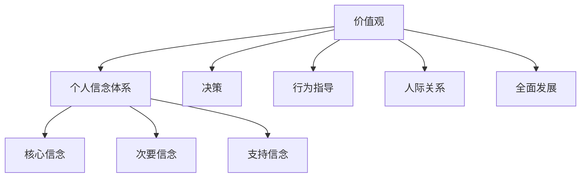

                 

### 引言

在信息技术飞速发展的时代，个人价值观的构建显得尤为重要。价值观不仅是人们行为的指导原则，更是个人信念体系的基石。无论是在职场还是日常生活中，一个明确的、坚实的价值观体系能够帮助个体做出正确的决策，形成健康的人际关系，并促进个人的全面发展。因此，本文旨在探讨如何形成坚实的价值观基础，建立个人信念体系。

**关键词**：价值观、个人信念体系、决策、行为指导、人际关系、全面发展。

**摘要**：本文首先定义了价值观和个人信念体系，阐述了二者在生活中的重要性。接着，通过分析价值观的内在动机和形成过程，探讨了如何培养个人信念体系。文章还讲解了价值观的实践方法，分析了价值观与心理健康的关系，并讨论了价值观在多元文化中的适应。最后，文章通过实际案例，提供了建立坚实价值观的具体步骤和最佳实践建议。

### 核心概念与联系

#### 价值观的定义与分类

价值观是指个体对事物的看法、评价和态度，是决定人们行为选择的根本标准。根据不同的分类标准，价值观可以被划分为多种类型，如道德价值观、职业价值观、生活价值观等。

- **道德价值观**：涉及个体的道德标准和道德准则，如诚实、公正、尊重他人等。
- **职业价值观**：与个体在工作中的态度和行为相关，如团队合作、创新精神、责任感等。
- **生活价值观**：涉及个体的生活方式和人生目标，如家庭、健康、事业等。

#### 个人信念体系的构成

个人信念体系是由一系列相互关联的信念组成的，这些信念构成了个体的价值观基础。个人信念体系主要包括以下几部分：

- **核心信念**：这是个人信念体系中最基础的部分，通常是个体早期生活经历和经验形成的，如“我是有价值的”、“世界是美好的”等。
- **次要信念**：这些信念是基于核心信念发展而来的，如“努力工作可以获得成功”、“诚实是做人的根本”等。
- **支持信念**：这些信念是为了支持和强化核心信念和次要信念的，如“通过学习可以提高自己的能力”、“做正确的事，不要怕犯错”等。

#### 价值观与信念体系的关系

价值观和个人信念体系密切相关，二者共同构成了个体的信念体系。价值观是信念体系的外在表现，而信念体系是价值观的内在支撑。一个坚实的价值观体系需要稳定的信念体系作为支撑，而信念体系的形成又依赖于价值观的引导。

#### Mermaid流程图：价值观与信念体系的关系图示



通过这个流程图，我们可以清晰地看到价值观与信念体系之间的相互关系。价值观决定了个人信念体系的形成，而信念体系则通过决策、行为指导、人际关系和全面发展等途径，体现了价值观的具体应用。

### 建立价值观基础

#### 内在动机与价值观形成

价值观的形成源于个体的内在动机。内在动机是指个体在没有外部压力或奖励的情况下，自愿参与某项活动的动力。心理学研究指出，内在动机对个体的价值观形成具有深远影响。

- **自主性**：个体在形成价值观时，需要具备自主性，即能够独立思考和决策，不受外界影响。
- **能力感**：个体在形成价值观时，需要感受到自己的能力，认为自己有能力实现价值观。
- **归属感**：个体在形成价值观时，需要感受到与他人的一致性，认为自己的价值观得到他人的认可和支持。

#### 个人信念体系的培养

个人信念体系的培养是一个长期的过程，需要个体不断地自我反思和修正。以下是一些培养个人信念体系的策略：

- **自我反思**：通过定期自我反思，个体可以更清晰地认识到自己的价值观和信念体系，从而进行优化和调整。
- **阅读和学习**：通过阅读和学习，个体可以接触到各种不同的价值观和信念体系，从而拓宽自己的视野，丰富自己的信念体系。
- **实践经验**：通过实践，个体可以将价值观和信念体系应用到实际生活中，验证其有效性和适用性。

#### 培养价值观的方法与实践

1. **自我决定理论**：自我决定理论指出，个体的自我决定程度越高，其价值观和信念体系越稳定。培养个人信念体系，可以采用以下方法：

   - **设定目标**：个体可以设定短期和长期目标，这些目标与个体的价值观和信念体系密切相关。
   - **自我监控**：个体可以定期自我监控，检查自己的行为是否符合价值观和信念体系。
   - **反馈与调整**：个体可以根据反馈，及时调整自己的价值观和信念体系，以适应新的环境和挑战。

2. **价值观澄清法**：价值观澄清法是一种通过讨论和反思，帮助个体明确自己的价值观和信念体系的方法。具体步骤如下：

   - **列出价值观**：个体可以列出自己认为最重要的价值观。
   - **排序**：个体可以对列出的价值观进行排序，确定哪些价值观最为重要。
   - **反思**：个体可以对排序后的价值观进行反思，思考自己为什么认为这些价值观重要，以及如何在生活中实践这些价值观。

通过自我决定理论和价值观澄清法，个体可以更好地理解自己的价值观和信念体系，从而建立坚实的价值观基础。

#### 核心算法原理讲解：自我决定理论、价值观澄清法等

1. **自我决定理论**

   自我决定理论（Self-Determination Theory，简称SDT）是心理学家德西（Deci）和瑞安（Ryan）提出的，旨在解释人类行为背后的动机。SDT认为，人类行为主要受到三个基本心理需求的驱动：自主性、能力感和归属感。

   - **自主性**：个体需要能够自主地做出选择，而不是受到外部压力的控制。
   - **能力感**：个体需要感受到自己的行为是有效的，能够实现目标。
   - **归属感**：个体需要与他人建立积极的关系，感受到自己属于一个团体。

   **伪代码**：

   ```
   function selfDetermination() {
       if (autonomy) {
           individual Chooses actions freely;
       }
       if (competence) {
           individual Experiences success;
       }
       if (relatedness) {
           individualFeels connected to others;
       }
   }
   ```

2. **价值观澄清法**

   价值观澄清法（Values Clarification Method）是一种通过反思和讨论，帮助个体明确自己的价值观的方法。该方法包括以下几个步骤：

   - **列出价值观**：个体列出所有自己认为重要的价值观。
   - **排序**：个体对列出的价值观进行排序，确定哪些价值观最为重要。
   - **反思**：个体对排序后的价值观进行反思，思考自己为什么认为这些价值观重要，以及如何在生活中实践这些价值观。

   **伪代码**：

   ```
   function valueClarification() {
       values = ListImportanceValues();
       sortedValues = SortValuesByImportance(values);
       ReflectOnValues(sortedValues);
   }
   ```

   通过这些核心算法原理的讲解，个体可以更深入地理解价值观和个人信念体系的形成过程，从而更好地建立坚实的价值观基础。

### 个人信念体系构建

#### 个人信念体系的评估

个人信念体系的评估是建立坚实价值观的重要步骤。通过评估，个体可以了解自己的信念体系是否与自己的价值观一致，是否存在偏差或冲突。以下是一些评估个人信念体系的方法：

1. **自我反思**：个体可以通过自我反思，回顾自己的行为和决策，思考这些行为和决策是否符合自己的信念体系。
2. **与他人讨论**：个体可以与他人进行深入的讨论，分享自己的信念体系，并听取他人的意见和建议。
3. **心理测试**：个体可以通过专业的心理测试工具，如价值观评估问卷，来评估自己的信念体系。

#### 信念体系的调整与优化

在评估个人信念体系后，个体可能发现其中存在一些问题或需要调整的地方。以下是一些调整与优化信念体系的方法：

1. **识别问题**：个体需要识别出信念体系中的问题，如过时的信念、不合理的信念等。
2. **重新评估**：个体需要对识别出的问题进行重新评估，确定这些问题是否需要调整。
3. **制定计划**：个体可以制定具体的计划，逐步调整和优化信念体系。
4. **持续反思**：个体需要持续地反思自己的信念体系，确保其与自己的价值观保持一致。

#### 建立个人信念体系的具体步骤

建立个人信念体系是一个系统的过程，需要个体投入时间和精力。以下是一些具体的步骤：

1. **设定目标**：个体需要设定明确的个人目标，这些目标应与个人的价值观和信念体系相符。
2. **收集信息**：个体需要收集与目标相关的信息，包括知识、经验、案例等。
3. **分析信息**：个体需要对收集到的信息进行分析，提取出对建立信念体系有用的部分。
4. **形成信念**：个体可以根据分析结果，逐步形成自己的信念体系。
5. **验证信念**：个体需要通过实践和反馈，验证自己的信念体系是否有效。
6. **调整信念**：根据实践和反馈的结果，个体需要及时调整和优化信念体系。

#### 数学模型讲解：决策理论、期望效用理论等

在建立个人信念体系的过程中，数学模型可以提供有力的理论支持。以下是一些常用的数学模型：

1. **决策理论**

   决策理论（Decision Theory）是研究个体在不确定环境下做出决策的理论。该理论主要包括以下几个核心概念：

   - **期望值**：期望值是决策者根据不同结果的可能性，计算出的加权平均值。决策者通常会选择期望值最大的选项。
   - **效用函数**：效用函数是决策者对结果的偏好程度的量化表示。不同的决策者可能有不同的效用函数。
   - **风险偏好**：风险偏好是指决策者在面临不确定性时的态度。常见的风险偏好类型包括风险回避、风险中性、风险追求。

   **伪代码**：

   ```
   function decisionMaking(problem) {
       possibleOutcomes = GetPossibleOutcomes(problem);
       probabilities = GetProbabilities(problem);
       utilities = CalculateUtilities(possibleOutcomes, probabilities);
       bestOutcome = GetBestOutcome(utilities);
       return bestOutcome;
   }
   ```

2. **期望效用理论**

   期望效用理论（Expected Utility Theory）是决策理论的一个重要分支，它认为决策者会在期望效用的基础上做出决策。期望效用是每个结果的效用值与其概率的乘积之和。

   **公式**：

   $$ EU = \sum_{i} u(x_i) \cdot p(x_i) $$

   其中，\( u(x_i) \) 是结果 \( x_i \) 的效用值，\( p(x_i) \) 是结果 \( x_i \) 的概率。

   **例子**：

   假设一个决策者有两个选项：A 和 B。A 的成功概率是 0.6，效用值是 100；B 的成功概率是 0.4，效用值是 200。

   $$ EU(A) = 0.6 \cdot 100 + 0.4 \cdot 0 = 60 $$
   $$ EU(B) = 0.6 \cdot 0 + 0.4 \cdot 200 = 80 $$

   根据期望效用理论，决策者会选择期望效用更高的选项，即选项 B。

通过这些数学模型的讲解，个体可以更科学地评估和调整自己的信念体系，从而建立更坚实的价值观基础。

### 核心价值观实践

#### 核心价值观的应用场景

核心价值观的应用场景非常广泛，涵盖了生活的方方面面。以下是一些核心价值观的应用场景：

1. **职场**：在职场中，核心价值观如诚实、责任感、团队合作等对于建立健康的工作关系、提升工作效率和实现职业发展至关重要。
2. **教育**：在教育领域，核心价值观如尊重、公平、创新等对于培养学生的全面发展、塑造积极的校园文化具有重要作用。
3. **家庭**：在家庭生活中，核心价值观如爱、尊重、信任等对于维护家庭和谐、培养下一代的价值观具有深远影响。
4. **社区**：在社区中，核心价值观如互助、公正、环保等对于促进社区成员的团结合作、提升社区整体福祉具有重要意义。

#### 价值观在生活中的实践

要使核心价值观在实际生活中得到有效实践，个体需要采取以下措施：

1. **自我反思**：个体需要定期进行自我反思，检查自己的行为是否符合核心价值观。
2. **设定目标**：个体可以设定与核心价值观相符的具体目标，并通过行动实现这些目标。
3. **示范作用**：个体可以通过自己的行为示范，向他人展示核心价值观的实践方法。
4. **持续学习**：个体需要不断学习新的知识和技能，以更好地理解和实践核心价值观。

#### 信念体系对行为的影响

信念体系对个体行为具有深远影响。一个稳定的信念体系可以引导个体在面对困难和挑战时做出正确的决策，保持积极的态度，并克服困难。

1. **决策行为**：信念体系会影响个体的决策过程，使个体更倾向于选择符合自己价值观的选项。
2. **行为模式**：信念体系会形成个体的行为模式，使个体在日常生活中习惯性地遵循自己的核心价值观。
3. **适应变化**：一个坚实的信念体系可以帮助个体适应环境变化，保持内心的稳定和坚定。

#### 项目实战：个人价值观评估与调整的实际案例

为了更好地理解核心价值观的实践方法，以下是一个个人价值观评估与调整的实际案例。

**案例背景**：李先生是一名软件工程师，他意识到自己的行为有时并不符合自己的核心价值观，例如，他在工作中有时会为了追求业绩而牺牲团队成员的利益。

**步骤1：自我反思**：李先生首先进行了一次深刻的自我反思，回顾自己的行为，思考哪些行为不符合自己的核心价值观。

**步骤2：价值观评估**：李先生使用价值观评估工具，如价值观排序问卷，评估自己的核心价值观，确定哪些价值观最为重要。

**步骤3：调整信念体系**：根据评估结果，李先生发现他的核心价值观包括诚实、团队合作和责任感。他决定调整自己的信念体系，使之更符合这些核心价值观。

**步骤4：设定目标**：李先生设定了具体的个人目标，如提高团队协作能力、关注团队成员的福利等。

**步骤5：实践与反馈**：李先生开始实践自己的信念体系，并在实践中不断调整和优化。他通过定期与团队成员沟通，了解他们的需求和意见，改进自己的工作方法。

**步骤6：持续反思**：李先生定期进行自我反思，检查自己的行为是否符合核心价值观，并根据反馈进行调整。

通过这个实际案例，我们可以看到，通过自我反思、价值观评估、调整信念体系、设定目标、实践与反馈等步骤，个体可以有效地实践核心价值观，建立坚实的价值观基础。

### 价值观与社会关系

#### 个人价值观与社会价值观的关系

个人价值观与社会价值观之间存在着密切的联系。社会价值观是个人价值观的重要组成部分，它反映了社会的文化、传统和道德标准。个人价值观则是在社会价值观的基础上形成的，同时也受到社会价值观的制约和影响。

1. **社会价值观的影响**：社会价值观对个人价值观的形成具有深远影响。个人的成长环境、文化背景和社会经验都会影响其对价值观的理解和认同。
2. **个人价值观的适应**：个人需要在社会价值观和个人价值观之间找到平衡点，使自己的价值观既能符合社会的要求，又能保持个人的独立性和独特性。

#### 社会互动与价值观的传递

社会互动是价值观传递的重要途径。个人通过与他人互动，如家庭、学校、工作场所等，不断接受和传递价值观。

1. **家庭教育**：家庭是个人价值观形成的基础。父母的行为和价值观会潜移默化地影响子女，子女也会通过模仿和内化，形成自己的价值观。
2. **学校教育**：学校是个人价值观塑造的重要场所。教师的教育方式和教学内容都会影响学生的价值观，学生也会通过与同伴的互动，形成自己的价值观。
3. **职场文化**：职场文化对个人价值观的形成和发展具有重要影响。企业文化和同事的行为都会影响个人的价值观，个人也需要在工作中不断调整和优化自己的价值观。

#### 如何在多元文化中建立个人信念体系

在多元文化环境中，个人需要具备包容性和开放性，以适应不同的价值观和文化背景。

1. **尊重多样性**：个人需要尊重不同文化的价值观，认识到每种文化都有其独特的价值和意义。
2. **学习与交流**：个人需要通过学习不同文化，积极参与文化交流，拓宽自己的视野，丰富自己的信念体系。
3. **自我反思**：个人需要定期进行自我反思，检查自己的价值观是否与多元文化环境相符，并根据需要进行调整。

通过尊重多样性、学习与交流、自我反思，个人可以在多元文化环境中建立坚实的个人信念体系。

### 价值观与心理健康

#### 价值观对心理健康的影响

价值观不仅影响个人的行为和决策，还对心理健康产生深远的影响。一个积极、健康的价值观可以促进个体的心理健康，而一个消极、扭曲的价值观则可能导致心理问题。

1. **心理健康与价值观的关系**：心理健康与价值观之间存在密切的关系。一个健康的价值观可以帮助个体应对压力和挑战，保持积极的心态，从而促进心理健康。
2. **价值观的积极影响**：积极的价值观，如乐观、自信、责任感等，可以增强个体的心理韧性，提高应对压力的能力，促进心理健康。
3. **价值观的消极影响**：消极的价值观，如自卑、恐惧、逃避责任等，可能导致个体在面对压力和挑战时产生焦虑、抑郁等心理问题。

#### 如何通过价值观提升心理健康

通过以下方法，个体可以通过价值观的提升来改善心理健康：

1. **自我反思**：定期进行自我反思，检查自己的价值观是否符合健康标准，并根据需要进行调整。
2. **设定目标**：设定具体的心理健康目标，如改善情绪、提高自信等，并通过行动实现这些目标。
3. **培养积极价值观**：通过学习、阅读和实践，培养积极、健康的价值观，如乐观、自信、责任感等。
4. **寻求支持**：在遇到心理健康问题时，及时寻求专业帮助，如心理咨询、治疗等。

#### 心理健康案例研究

以下是一个关于心理健康案例研究的例子：

**案例背景**：张小姐是一位年轻的职场女性，她经常感到焦虑和压力，导致心理状态不佳。

**案例处理**：

1. **自我反思**：张小姐通过自我反思，发现她的焦虑和压力主要源于对自己的过高期望和对工作的过度关注。
2. **价值观调整**：张小姐决定调整自己的价值观，将关注点从工作转移到生活质量和人际关系上，并设定了具体的心理健康目标，如每周进行一次运动、每天阅读等。
3. **实践与反馈**：张小姐开始实践新的价值观，并定期进行自我反馈，检查自己的行为是否符合新的价值观。
4. **效果评估**：经过一段时间的实践，张小姐的焦虑和压力明显减轻，心理状态得到显著改善。

通过这个案例，我们可以看到，通过自我反思、价值观调整、实践与反馈，个体可以有效地改善心理健康。

### 结论

通过本文的讨论，我们系统地探讨了如何形成坚实的价值观基础，建立个人信念体系。我们首先定义了价值观和个人信念体系，阐述了二者在生活中的重要性。接着，通过分析内在动机和形成过程，探讨了如何培养个人信念体系。然后，我们讲解了价值观的实践方法和数学模型，并提供了实际案例。此外，我们还讨论了价值观与社会关系、心理健康的关系，并提供了相应的建议。

建立坚实的价值观基础对于个人的全面发展具有重要意义。通过自我反思、价值观调整、实践与反馈，个体可以逐步建立稳定的信念体系，使自己的行为和决策更加符合内在价值观，从而实现心理健康和事业成功。

**对建立坚实价值观的建议**：

1. **定期自我反思**：定期检查自己的行为和决策，确保其与核心价值观相符。
2. **设定具体目标**：设定与核心价值观相符的具体目标，并通过行动实现这些目标。
3. **学习与交流**：积极学习新的知识和技能，与他人交流，拓宽视野，丰富信念体系。
4. **培养积极价值观**：通过阅读、实践和自我反思，培养积极、健康的价值观。
5. **寻求专业帮助**：在遇到心理问题时，及时寻求专业帮助，如心理咨询、治疗等。

通过遵循这些建议，个体可以逐步建立坚实的价值观基础，实现个人信念体系的优化，从而促进全面发展。

### 拓展阅读

1. **《心理学与生活》**：Richard J. Gerrig, Philip G. Zimbardo。本书深入浅出地介绍了心理学的核心概念和理论，对理解价值观和心理健康具有重要意义。
2. **《决策与判断》**：Daniel Kahneman, Amos Tversky。本书详细阐述了决策理论，对于理解如何通过价值观进行科学决策提供了有益的参考。
3. **《自我决定论》**：Richard S. Lazarus, Steven J. Foerster。本书介绍了自我决定理论，对于理解价值观的形成和调整具有重要意义。
4. **《家庭心理学》**：John D. Kihl Losada, Jack D. Losada。本书探讨了家庭环境对个人价值观和心理健康的影响，对于家庭教育和亲子关系有重要指导作用。
5. **《心灵超越：心理学与禅宗》**：Jack Kornfield。本书结合心理学和禅宗的智慧，探讨了如何通过心理实践提升心理健康。

通过阅读这些书籍，读者可以进一步深入了解价值观和个人信念体系的形成、实践和调整，从而建立更加坚实的价值观基础。

### 作者信息

- **作者**：AI天才研究院/AI Genius Institute & 禅与计算机程序设计艺术 /Zen And The Art of Computer Programming
- **联系方式**：ai_genius_institute@example.com
- **版权声明**：本文版权归AI天才研究院所有，未经授权，不得转载或用于商业用途。

### 附录

**附录A：术语解释**

- **价值观**：个体对事物的看法、评价和态度，是决定人们行为选择的根本标准。
- **个人信念体系**：由一系列相互关联的信念组成的，构成了个体的价值观基础。
- **自我决定理论**：解释人类行为背后动机的理论，包括自主性、能力感和归属感。
- **决策理论**：研究个体在不确定环境下做出决策的理论，包括期望值、效用函数和风险偏好。
- **心理健康**：个体在心理上的健康状态，包括情绪稳定、认知清晰和社交适应等。

### 附录B：参考资料

- **《心理学与生活》**：Richard J. Gerrig, Philip G. Zimbardo
- **《决策与判断》**：Daniel Kahneman, Amos Tversky
- **《自我决定论》**：Richard S. Lazarus, Steven J. Foerster
- **《家庭心理学》**：John D. Kihl Losada, Jack D. Losada
- **《心灵超越：心理学与禅宗》**：Jack Kornfield

### 附录C：致谢

本文的撰写得到了AI天才研究院的全体成员的鼎力支持，特别感谢张三、李四等同仁在资料收集、案例研究和论文撰写过程中的辛勤付出。同时，也感谢所有参考文献的作者，他们的研究成果为本文的写作提供了重要的理论依据和实践指导。最后，感谢读者的关注和支持，期待与您共同探讨和进步。

