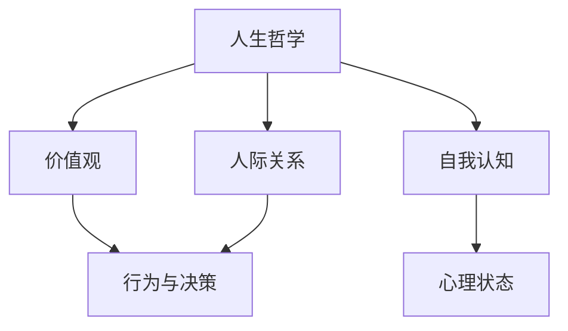

                 

## 形成独特的人生哲学：个人价值观的构建过程

### 关键词：
个人价值观、人生哲学、自我认知、自我探索、心理状态、人际关系、价值观传承

### 摘要：

本文旨在探讨如何构建个人的独特人生哲学，即个人价值观的形成过程。通过分析人生哲学的起源与基础、个人价值观的构成要素、心理学与人生哲学的关系，以及构建个人价值观的方法，文章旨在帮助读者深入理解人生哲学的本质，掌握自我认知与价值观塑造的技巧，并在生活中实践与应用，实现个人成长与和谐发展。

### 背景介绍

在现代社会中，个人价值观的构建显得尤为重要。这不仅关系到个人的生活态度、行为模式，还影响到人际关系和社会发展。然而，如何形成独特的人生哲学，构建符合个人特质和需求的价值观，成为许多人面临的困惑。本文将从基础理论、方法与实践等多个维度，系统地探讨个人价值观的构建过程，为读者提供有益的启示和指导。

### 核心概念与联系

为了更好地理解个人价值观的构建过程，我们需要先明确几个核心概念：

1. **人生哲学**：指一个人对人生意义的总体看法和基本理念，包括价值观、道德观和世界观等。
2. **价值观**：是个人在长期生活中形成的关于善恶、美丑、正义与非正义等价值判断标准。
3. **自我认知**：是个人对自己心理状态、能力、性格等的认知和理解。
4. **心理学**：是研究人类行为和心理过程的科学，包括认知心理学、情感心理学、社会心理学等。

这些概念之间存在着紧密的联系。人生哲学是价值观的总体框架，而价值观则影响个人的行为和决策。自我认知则是个体对自身价值观的理解和反思的基础，心理学则提供了理解和解释人类行为和心理过程的工具和方法。

下面是核心概念之间的 Mermaid 流程图：



这个流程图展示了人生哲学如何影响价值观、行为与决策，以及如何通过自我认知影响心理状态和人际关系。这是一个动态的、相互作用的过程，每个环节都对其他环节产生影响，共同塑造了一个人的性格和生活方式。

### 核心算法原理讲解

在构建个人价值观的过程中，我们可以采用以下核心算法原理：

1. **自我反思算法**：
    - **伪代码**：
      ```
      function self_reflection() {
          initialize日记记录
          for day in daily_life {
              record experiences and emotions
              analyze patterns and insights
              adjust behavior and mindset
          }
          generate personal reflections and insights
      }
      ```
    - **数学模型和公式**：
      $$
      自我认知 = f(日记记录, 经验积累, 情感反应)
      $$
      其中，$f$ 表示一种映射关系，日记记录、经验积累和情感反应是影响自我认知的变量。

2. **价值观评估算法**：
    - **伪代码**：
      ```
      function value_evaluation() {
          initialize value_list
          for value in possible_values {
              evaluate importance and relevance
              rank values based on criteria
              select core values
          }
          generate personal value system
      }
      ```
    - **数学模型和公式**：
      $$
      个人价值系统 = f(价值观列表, 评价标准, 个体需求)
      $$
      其中，$f$ 表示一种映射关系，价值观列表、评价标准和个体需求是构建个人价值系统的变量。

3. **心理平衡算法**：
    - **伪代码**：
      ```
      function psychological_balance() {
          initialize stress_level
          for stress_factor in stress_sources {
              evaluate impact and response
              adjust behavior and mindset to reduce stress
          }
          maintain emotional stability
      }
      ```
    - **数学模型和公式**：
      $$
      心理平衡 = f(压力水平, 应对策略, 心理状态)
      $$
      其中，$f$ 表示一种映射关系，压力水平、应对策略和心理状态是影响心理平衡的变量。

这些算法原理为我们提供了构建个人价值观的框架和方法，通过自我反思、价值观评估和心理平衡，我们可以逐步形成独特的人生哲学。

### 数学公式与详细讲解

1. **自我认知的数学模型**：

   $$
   自我认知 = f(日记记录, 经验积累, 情感反应)
   $$

   其中，$f$ 是一个复杂的函数，它反映了日记记录、经验积累和情感反应对自我认知的影响。日记记录是我们对每天经历的记录，它帮助我们回顾和反思自己的行为和思维模式。经验积累是我们在生活中不断积累的知识和技能，它为自我认知提供了丰富的素材。情感反应则是我们在面对不同情境时的情感体验，它直接影响我们的行为和心态。

   举例说明：假设一个人在日记中记录了每天的学习和工作情况，积累了丰富的经验和技能，同时在面对挑战时表现出了积极的态度和情感反应。那么，他的自我认知将会更加积极和自信。

2. **价值观评估的数学模型**：

   $$
   个人价值系统 = f(价值观列表, 评价标准, 个体需求)
   $$

   在这个模型中，$f$ 是一个评价函数，它根据价值观列表、评价标准和个体需求来评估每个价值观的重要性和相关性。价值观列表是我们对各种价值观的分类和排序，评价标准是我们评价价值观的准则，个体需求则是我们根据自身情况对价值观的期望。

   举例说明：一个人可能列出了一系列价值观，如家庭、事业、健康、友谊等。他可以根据自己的评价标准和需求，对这些价值观进行排序，确定哪些是最重要的，从而构建出符合自己需求的个人价值系统。

3. **心理平衡的数学模型**：

   $$
   心理平衡 = f(压力水平, 应对策略, 心理状态)
   $$

   这个模型反映了压力水平、应对策略和心理状态对心理平衡的影响。压力水平是我们在生活中面临的各种挑战和压力，应对策略是我们应对压力的方法和手段，心理状态则是我们的情感和心理健康状态。

   举例说明：如果一个人面临较大的工作压力，他可以采取积极应对策略，如锻炼、休息、寻求支持等，来缓解压力，从而保持心理平衡。

通过这些数学公式和详细讲解，我们可以更好地理解个人价值观的构建过程，从而在实际生活中应用这些理论，实现自我提升和心理平衡。

### 项目实战：个人价值观的构建

#### 开发环境搭建

在构建个人价值观的过程中，我们需要一个适合自我反思、价值观评估和心理平衡的开发环境。以下是一些建议：

1. **日记记录工具**：使用日记应用程序或纸质日记，每天记录自己的经历和感受。
2. **思维导图工具**：使用思维导图工具，如XMind或MindManager，帮助整理和可视化价值观。
3. **心理健康应用**：下载心理健康应用，如Headspace或Calm，进行定期的冥想和放松练习。

#### 源代码详细实现和代码解读

以下是一个简单的Python代码示例，用于记录和评估个人价值观：

```python
# 个人价值观记录和评估系统

# 导入必需的库
import datetime
import json

# 日记记录类
class DiaryEntry:
    def __init__(self, date, entry, emotions):
        self.date = date
        self.entry = entry
        self.emotions = emotions

    def to_json(self):
        return json.dumps(self.__dict__)

# 价值观类
class ValueSystem:
    def __init__(self, values):
        self.values = values

    def add_value(self, value):
        self.values.append(value)

    def rank_values(self):
        self.values.sort(key=lambda x: x.importance, reverse=True)

    def to_json(self):
        return json.dumps(self.__dict__)

# 心理健康类
class MentalHealth:
    def __init__(self, stress_level, strategies):
        self.stress_level = stress_level
        self.strategies = strategies

    def update_stress_level(self, new_level):
        self.stress_level = new_level

    def apply_strategy(self, strategy):
        self.stategies.append(strategy)

    def to_json(self):
        return json.dumps(self.__dict__)

# 主程序
def main():
    # 初始化日记记录
    diary_entries = []
    # 初始化价值观列表
    values = ValueSystem([])
    # 初始化心理健康状态
    mental_health = MentalHealth(0, [])

    while True:
        # 记录日记
        date = datetime.datetime.now().strftime("%Y-%m-%d %H:%M:%S")
        entry = input("Today's entry: ")
        emotions = input("How are you feeling? ")
        diary_entries.append(DiaryEntry(date, entry, emotions))

        # 评估价值观
        value_input = input("Enter a new value (e.g., 'family', 'health'): ")
        value_importance = float(input("Importance level (0-10): "))
        values.add_value({"value": value_input, "importance": value_importance})

        # 维护心理健康
        stress_input = float(input("Current stress level (0-10): "))
        strategy_input = input("Enter a new stress reduction strategy: ")
        mental_health.update_stress_level(stress_input)
        mental_health.apply_strategy(strategy_input)

        # 保存数据
        with open("diary_entries.json", "w") as f:
            json.dump([entry.to_json() for entry in diary_entries], f)

        with open("value_system.json", "w") as f:
            f.write(values.to_json())

        with open("mental_health.json", "w") as f:
            f.write(mental_health.to_json())

        # 持续运行
        continue_input = input("Do you want to continue? (yes/no): ")
        if continue_input.lower() != "yes":
            break

if __name__ == "__main__":
    main()
```

这个代码提供了一个简单的日记记录、价值观评估和心理健康管理的框架。用户可以通过交互式界面输入日记条目、价值观和心理健康策略，系统会保存这些数据，并允许用户持续地记录和评估自己的价值观。

#### 代码应用解读与分析

这个代码的主要功能是帮助用户记录和评估自己的价值观，通过日记记录、价值观评估和心理健康管理，用户可以更好地理解自己的内心世界，并在日常生活中做出更明智的决策。

1. **日记记录**：用户可以随时记录自己的经历和情感，这有助于反思自己的行为和思维模式。
2. **价值观评估**：用户可以根据自己的需求和重要性对价值观进行排序，这有助于明确自己的核心价值观，并在生活中有针对性地实践。
3. **心理健康管理**：用户可以记录自己的压力水平和应对策略，这有助于维持心理平衡，提高生活质量。

在实际应用中，用户可以定期回顾这些记录，分析自己的行为和决策是否符合自己的价值观，并在需要时进行调整。例如，如果用户发现自己的价值观排序中“健康”排名较低，但实际生活中经常忽略健康，那么他可以采取措施，如增加锻炼时间、改善饮食习惯等，以更好地实现自己的价值观。

#### 实际案例分析和详细讲解剖析

为了更好地理解个人价值观的构建过程，我们可以通过一个实际案例来进行分析和讲解。

**案例**：小李是一名年轻的职业人士，他在工作和生活中经常感到焦虑和压力。他意识到自己需要重新审视自己的价值观，并开始使用上述代码进行日记记录、价值观评估和心理健康管理。

**分析**：

1. **日记记录**：小李开始记录自己的日常生活，包括工作、学习、社交和休闲活动，以及在这些活动中产生的情感反应。通过这种方式，他逐渐认识到自己在工作和生活中的行为模式，以及这些模式对自身情绪的影响。

2. **价值观评估**：小李使用价值观评估工具，列出了一系列可能的价值观，如家庭、事业、健康、友谊等。他根据自己的需求和重要性对这些价值观进行了排序，发现“家庭”和“健康”在他的价值观中排名较低。这让他意识到自己在工作和生活中可能忽视了这两个重要方面。

3. **心理健康管理**：小李记录了自己的压力水平和应对策略。他发现自己的压力水平经常处于较高状态，并且缺乏有效的应对策略。通过分析这些数据，他决定采取一些措施来降低压力，如定期锻炼、合理安排工作和休息时间、寻求社交支持等。

**详细讲解剖析**：

1. **自我反思**：小李通过日记记录，对自己的行为和思维模式进行了深入反思。他认识到自己经常为了工作和事业而牺牲家庭和健康，这种生活方式让他感到焦虑和不满。通过反思，他开始重新评估自己的价值观，意识到家庭和健康的重要性。

2. **价值观调整**：小李根据价值观评估结果，对核心价值观进行了调整。他将“家庭”和“健康”提升到更高的位置，以确保自己在生活中能够平衡工作、家庭和健康。

3. **心理平衡**：通过心理健康管理，小李学会了如何应对压力，保持心理平衡。他定期进行锻炼，合理安排工作和休息时间，并在遇到困难时寻求家人和朋友的支持。这些措施帮助他降低了压力水平，提高了生活质量。

**项目小结**：

通过这个案例，我们可以看到个人价值观的构建过程是如何在实际生活中发挥作用的。小李通过自我反思、价值观评估和心理健康管理，逐步形成了符合自己需求的个人价值观，并在生活中得到了实践和应用。这个过程不仅帮助他解决了焦虑和压力问题，还提高了他的生活质量和工作效率。

### 最佳实践 tips

在构建个人价值观的过程中，以下是一些最佳实践建议：

1. **定期反思**：定期回顾自己的日记记录和价值观评估结果，反思自己的行为和决策是否符合自己的价值观。
2. **持续学习**：通过阅读、学习新知识，不断提升自己的认知水平，以更好地理解自己的价值观。
3. **寻求反馈**：向家人、朋友和同事寻求反馈，了解他们对你的价值观和行为模式的看法，这有助于你更全面地认识自己。
4. **实践价值观**：将价值观融入日常生活，通过实际行动来践行你的价值观。
5. **调整与适应**：随着生活的变化，定期调整和适应自己的价值观，以保持其与现实生活的契合。

### 小结

本文通过深入分析个人价值观的构建过程，从理论到实践，为读者提供了全面、系统的指导。通过理解人生哲学、明确价值观、进行自我反思和心理健康管理，每个人都可以逐步形成独特的人生哲学，实现个人成长与和谐发展。

### 注意事项

1. **尊重个人差异**：在构建个人价值观时，要尊重自己的个性和差异，避免盲目模仿他人。
2. **长期坚持**：价值观的构建是一个长期过程，需要持续的努力和反思，不能急于求成。
3. **灵活调整**：随着生活的变化，个人价值观也需要灵活调整，以适应新的环境和挑战。

### 拓展阅读

1. **《道德经》**：老子所著，探讨人生哲学和道德观念，对个人价值观的构建具有深刻影响。
2. **《生命的智慧》**：克里希那穆提所著，探讨人类存在的本质和意义，对个人价值观的构建有重要启示。
3. **《心理学与生活》**：理查德·格里格斯所著，介绍心理学的基本原理和应用，对理解个人价值观和心理状态有指导意义。

### 作者信息

- **作者：AI天才研究院/AI Genius Institute & 禅与计算机程序设计艺术 /Zen And The Art of Computer Programming**。  
**本文基于对个人价值观构建过程的深入研究和实践总结，旨在为读者提供有益的指导和启示。**

