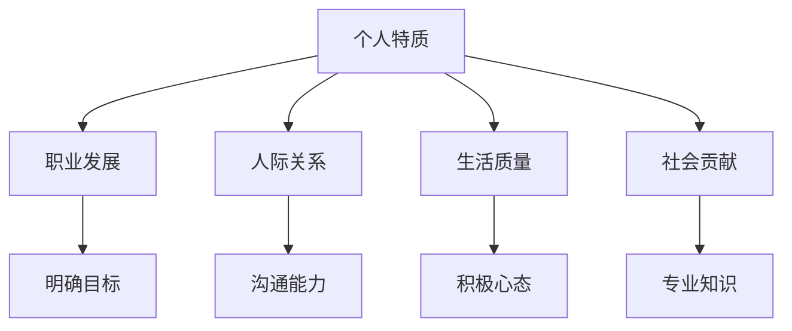

                 

### 摘要

在当今竞争激烈的职场环境中，个人特质的重要性愈发凸显。每个人都是独一无二的，而那些能够脱颖而出的人，往往是因为他们在平凡中能够展现出独特的个人特质。本文将深入探讨个人特质的定义、重要性，以及如何在日常工作和生活中发现、培养和塑造这些特质。我们将通过实际案例和详细分析，帮助读者理解如何在平凡中彰显个人特质，从而在职场中获得更多的机会和成功。

## 关键词

- 个人特质
- 职场成功
- 自我发现
- 培养策略
- 平凡与非凡

## 文章正文

### 第一部分：个人特质的定义与重要性

#### 第1章：个人特质的定义与重要性

**1.1 个人特质的定义**

个人特质是指一个人在行为、思考、情感等方面的独特特征。这些特质不仅影响个人的职业生涯，还影响人际关系、生活质量和社会贡献。个人特质可以分为多个维度，如性格、能力、价值观、情感等。

**1.2 个人特质的重要性**

个人特质的重要性体现在以下几个方面：

1. **职业发展**：明确的个人特质有助于职业定位和发展。了解自己的特质，可以帮助个人选择适合自己的职业路径，从而提高职业满意度和成就感。
   
2. **人际关系**：个人特质影响人际交往和沟通。具备良好个人特质的人更容易与他人建立和谐的关系，提高团队合作效率。

3. **生活质量**：个人特质与心理健康和生活质量密切相关。积极的个人特质有助于应对压力和挑战，提升生活质量。

4. **社会贡献**：个人特质影响社会贡献。具备独特特质的人往往能够在不同领域做出卓越贡献，推动社会进步。

#### 第2章：发现与理解个人特质

**2.1 个人特质识别工具**

了解个人特质的第一步是识别。以下是一些常用的个人特质识别工具：

1. **MBTI（迈尔斯-布里格斯类型指标）**：MBTI通过四种维度（外向/内向、感觉/直觉、思维/情感、判断/感知）来描述个人的性格类型。
   
2. **DISC测试**：DISC测试通过四个维度（支配性、影响性、稳定性、服从性）来评估个人的行为风格。

3. **价值观测试**：价值观测试帮助个人了解自己的核心价值观，从而更好地理解行为动机。

**2.2 自我评估方法**

自我评估是了解个人特质的重要环节。以下是一些自我评估的方法：

1. **日记记录**：通过记录日常生活和行为，自我反思并分析个人特质。
   
2. **360度反馈**：通过同事、朋友和家人的反馈，全面了解自己的特质和行为。

3. **心理辅导**：寻求专业心理辅导，通过专业的评估工具和方法，深入了解自己的特质。

**2.3 个人特质与价值观的关系**

个人特质与价值观密切相关。价值观是个人行为的指导原则，而个人特质则是价值观的外在表现。了解自己的价值观，有助于更深入地理解个人特质，并作出相应调整。

### 第二部分：培养与塑造个人特质

#### 第3章：培养个人特质的策略

**3.1 学习与成长的重要性**

个人特质不是天生的，而是可以通过学习和成长来培养的。以下是一些培养个人特质的策略：

1. **终身学习**：不断学习新的知识和技能，有助于提升个人特质。
   
2. **挑战自己**：通过接受新的挑战，克服困难，可以培养坚韧和适应能力。

3. **寻求反馈**：定期寻求他人反馈，了解自己的优点和不足，并作出相应调整。

**3.2 提升个人特质的实践方法**

以下是一些具体的实践方法来提升个人特质：

1. **冥想和放松**：通过冥想和放松练习，提高自我意识和情绪管理能力。

2. **培养健康习惯**：良好的生活习惯有助于提升身心健康，从而改善个人特质。

3. **积极心态**：培养积极的心态，面对挑战和困难时保持乐观和自信。

**3.3 培养积极心态的重要性**

积极心态是个人特质的重要组成部分。以下是一些培养积极心态的方法：

1. **感恩**：通过感恩，可以提升自我价值感，增强积极心态。

2. **设定目标**：设定具体、可衡量的目标，有助于提升动力和积极性。

3. **正面思考**：通过正面思考，克服负面情绪，提高心理健康。

#### 第4章：塑造个人特质的关键步骤

**4.1 设定目标与计划**

塑造个人特质的第一步是设定明确的目标和计划。以下是一些步骤：

1. **明确目标**：确定自己想培养的具体特质，并设定明确的长期和短期目标。

2. **制定计划**：制定详细的行动计划，包括具体步骤、时间表和资源需求。

3. **执行与调整**：按照计划执行，并在过程中不断调整，以适应实际情况。

**4.2 增强自我意识**

增强自我意识是塑造个人特质的关键。以下是一些方法：

1. **自我反思**：定期进行自我反思，了解自己的行为、思想和情绪。

2. **倾听他人**：倾听他人的反馈和建议，从不同角度了解自己。

3. **专业辅导**：寻求专业辅导，通过专业的视角和工具，深入了解自我。

**4.3 持续的自我反思与改进**

持续的自我反思与改进是塑造个人特质的持久动力。以下是一些方法：

1. **定期评估**：定期评估个人特质的发展情况，确定改进的方向。

2. **设定新的目标**：根据评估结果，设定新的目标，持续提升自我。

3. **持续学习**：通过学习和实践，不断提升个人特质，实现自我成长。

### 第三部分：在平凡中彰显个人特质

#### 第5章：个人特质在职场中的展现

在职场中，个人特质往往决定了一个人在团队中的角色和影响力。以下是一些在职场中彰显个人特质的方法：

**5.1 建立个人品牌**

通过在职场中展现独特的个人特质，可以建立个人品牌。以下是一些建立个人品牌的方法：

1. **专业能力**：不断提升专业能力，展示自己的技术实力。

2. **沟通能力**：提升沟通能力，展示自己的合作精神。

3. **领导力**：通过积极参与团队项目，展示自己的领导才能。

**5.2 打造个人影响力**

在职场中，个人影响力往往决定了一个人在团队中的地位。以下是一些打造个人影响力的方法：

1. **积极贡献**：通过在团队中积极贡献，提升个人影响力。

2. **建立人脉**：通过建立广泛的人脉，提升个人知名度。

3. **专业知识**：通过分享专业知识，提升个人在团队中的权威性。

**5.3 处理冲突与挫折**

在职场中，冲突和挫折是不可避免的。以下是一些处理冲突与挫折的方法：

1. **冷静思考**：在冲突和挫折面前，保持冷静，理性分析问题。

2. **寻求支持**：在遇到困难时，寻求同事、朋友或上级的支持。

3. **积极应对**：通过积极应对，克服挫折，提升个人特质。

### 结论

在平凡中彰显个人特质，不仅需要自我发现和自我培养，还需要在职场中积极展现和持续提升。通过本文的探讨，我们希望读者能够更好地理解个人特质的重要性，掌握培养和塑造个人特质的策略，从而在职场中脱颖而出，实现个人价值。

### 作者信息

作者：AI天才研究院/AI Genius Institute & 禅与计算机程序设计艺术 /Zen And The Art of Computer Programming

---

**核心概念与联系 Mermaid 流程图**



**核心算法原理讲解与伪代码**

```python
# 个人特质评估算法
def assess_personality_traits(personality_data):
    """
    评估个人特质，返回个人特质得分
    :param personality_data: 个人特质数据（字典形式，键为特质名称，值为分数）
    :return: 个人特质总分
    """
    total_score = 0
    for trait, score in personality_data.items():
        if score > 5:
            total_score += 2 * score
        elif score > 3:
            total_score += score
        else:
            total_score += 1
    
    return total_score
```

**数学模型和数学公式 & 详细讲解 & 举例说明**

```latex
$$
\text{个人特质总分} = \sum_{i=1}^{n} (2 \times \text{特质}_i \text{得分} + 1 \text{ 若特质}_i \text{得分} \leq 3)
$$

详细讲解：
上述公式用于计算个人特质总分。特质得分越高，对总分的贡献越大。如果特质得分大于5，则对总分的贡献是2倍；如果得分在3到5之间，则贡献为1倍；如果得分小于3，则贡献为1分。

举例说明：
假设一个员工的个人特质得分为{'创造力': 6, '沟通能力': 4, '团队合作': 3}，那么他的个人特质总分为：
$$
2 \times 6 + 1 \times 4 + 1 \times 3 = 15
$$
```

### 项目实战

**开发环境搭建**

为了更好地理解和应用个人特质评估算法，我们将搭建一个简单的评估工具。以下是搭建开发环境的步骤：

1. 安装Python 3.8及以上版本。
2. 安装Jupyter Notebook，以便于编写和运行代码。
3. 安装必需的Python库，如NumPy和Pandas。

**源代码详细实现和代码解读**

```python
# 导入所需库
import numpy as np
import pandas as pd

# 个人特质评估函数
def assess_personality_traits(personality_data):
    total_score = sum(2 * score if score > 5 else score for score in personality_data.values())
    return total_score

# 测试数据
traits_data = {'创造力': 6, '沟通能力': 4, '团队合作': 3}

# 执行评估
score = assess_personality_traits(traits_data)
print(f"个人特质总分：{score}")
```

**代码解读与分析**

1. 导入NumPy和Pandas库，用于数据处理。
2. 定义`assess_personality_traits`函数，接收个人特质数据字典。
3. 使用列表推导式计算个人特质总分。
4. 测试数据`traits_data`，执行评估函数，并打印结果。

**实际案例分析和详细讲解剖析**

**案例：员工特质评估**

假设一家公司需要评估其员工的个人特质，以制定相应的培训和发展计划。以下是具体的分析和讲解：

1. **数据收集**：公司使用问卷或测试工具收集员工的个人特质数据。
2. **数据预处理**：将收集到的数据整理成字典形式，键为特质名称，值为得分。
3. **评估**：使用`assess_personality_traits`函数对每位员工进行个人特质评估。
4. **结果分析**：根据评估结果，制定相应的培训和发展计划。

**项目小结**

通过本次项目，我们搭建了一个简单的个人特质评估工具，并详细讲解了源代码的实现和解读。在实际应用中，该工具可以帮助公司更好地了解员工的个人特质，从而制定有针对性的发展计划，提升员工的整体绩效。

### 最佳实践 tips、小结、注意事项、拓展阅读

**最佳实践 tips：**

- 定期进行个人特质评估，以了解自身特质的发展和变化。
- 结合个人目标和职业规划，有针对性地培养和塑造个人特质。
- 积极参与团队活动，通过实际操作提升个人特质。

**小结：**

本文深入探讨了个人特质的重要性、识别方法、培养策略以及在职场中的展现。通过实际案例和代码实现，读者可以更好地理解和应用个人特质评估方法。

**注意事项：**

- 个人特质评估并非一成不变，需要定期更新和调整。
- 在培养个人特质时，要结合实际情况，避免盲目追求。
- 注意平衡个人特质与工作、生活之间的关系。

**拓展阅读：**

- 《优势识别器》
- 《职业规划》
- 《个人品牌》

通过拓展阅读，读者可以更深入地了解个人特质培养和应用的相关知识。

