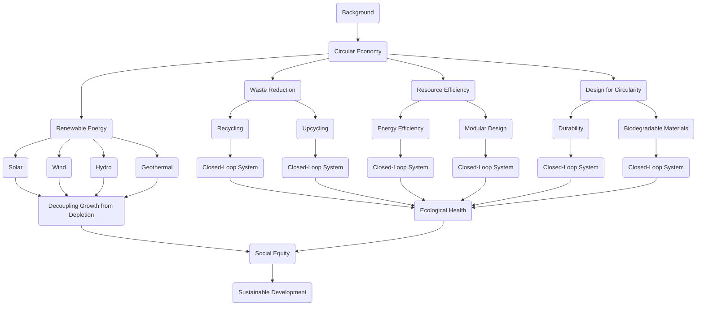
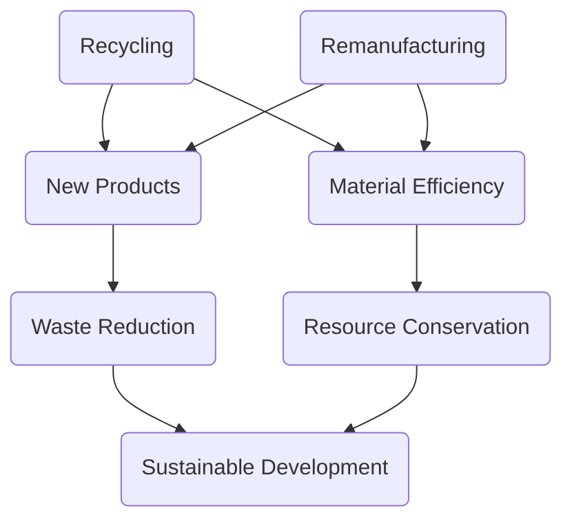
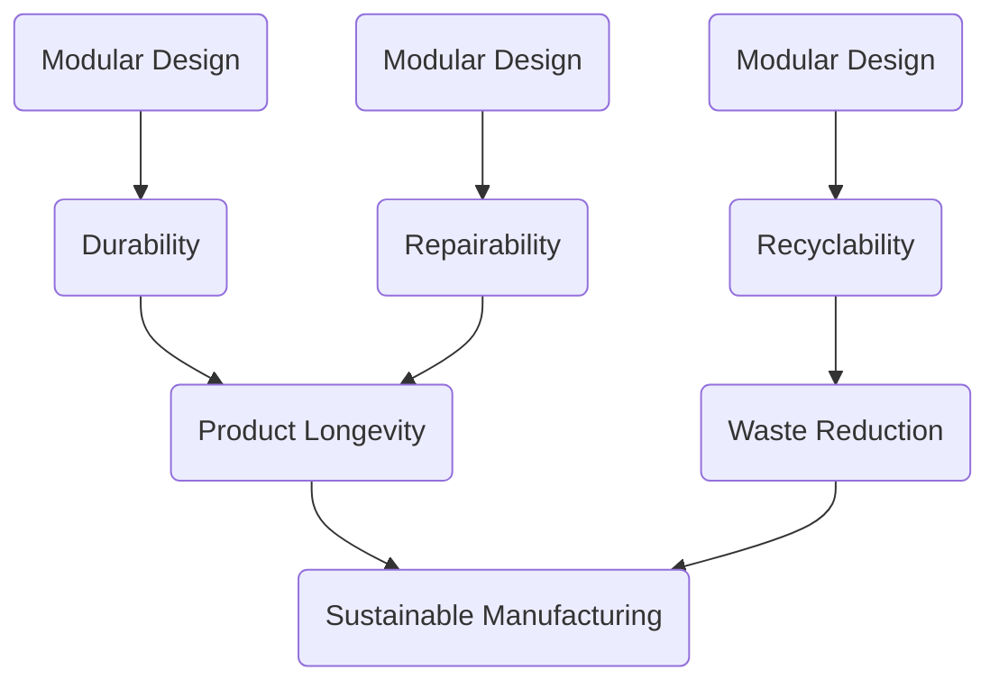
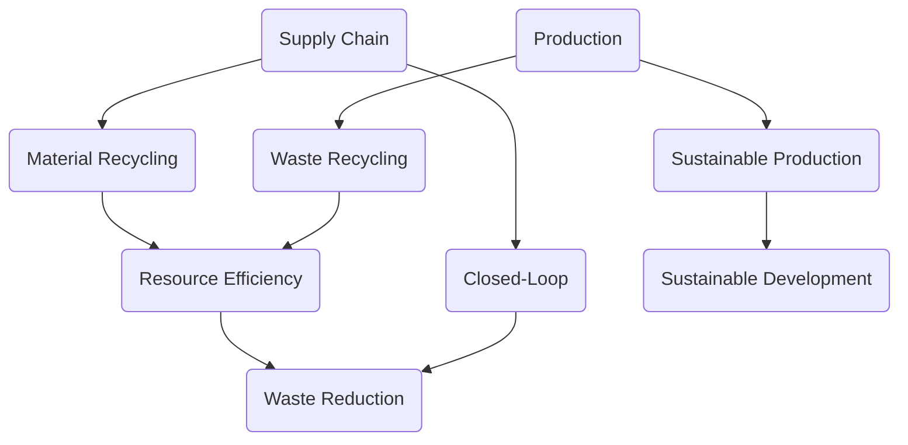
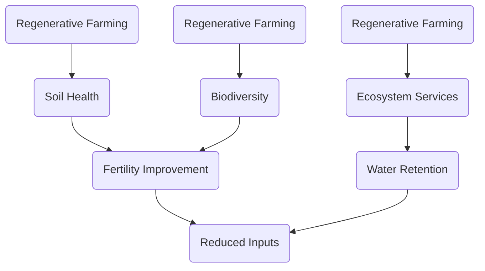
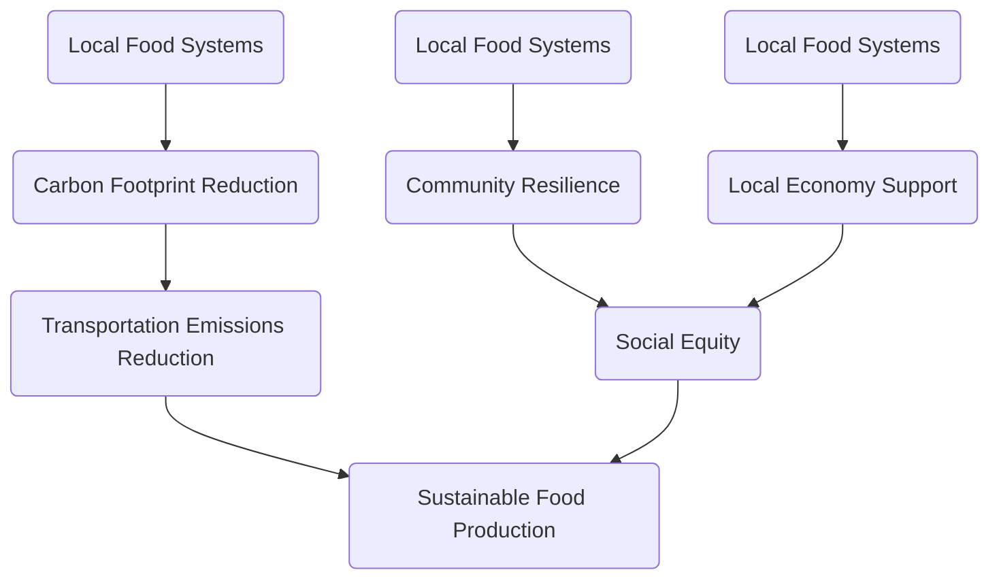
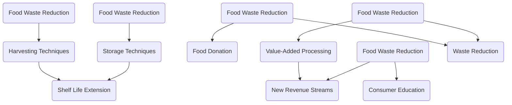
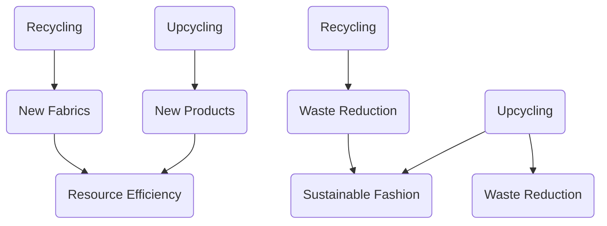
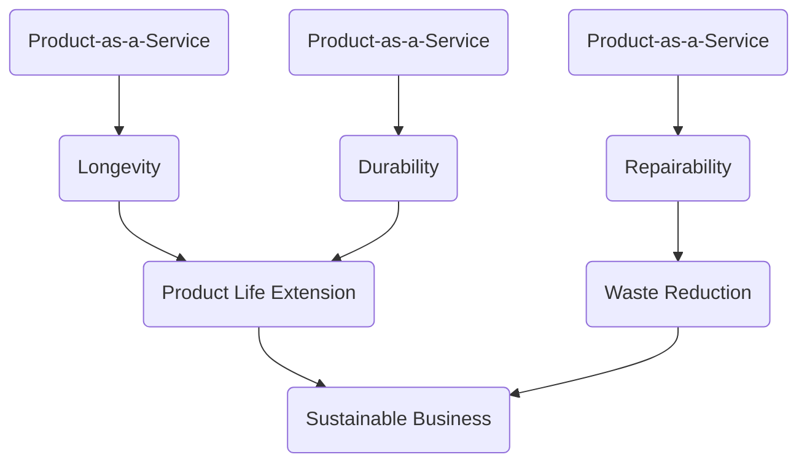
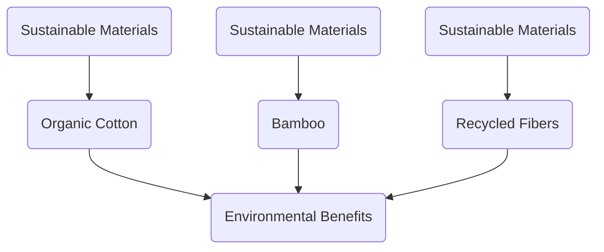

                 


### Introduction

# Introduction

In today's rapidly changing world, the need for sustainable development has become more critical than ever. The traditional linear economy, which follows a "take-make-waste" model, has proven to be unsustainable in the long run. It has led to significant environmental degradation, resource depletion, and social inequities. As a result, the concept of a circular economy has gained traction as a viable alternative for achieving sustainable development. This article aims to explore the significance of circular economy in our lives and how it can transform our world for the better.

## Background of Circularity Economy

The circular economy is an economic system aimed at eliminating waste and making the most of resources. It contrasts with the traditional linear economy, where materials are extracted, used, and then disposed of. The evolution from the linear to the circular economy has been driven by the increasing awareness of the environmental and social impacts of the linear model. Key principles of the circular economy include waste reduction, resource efficiency, and designing products for longevity and recyclability.

## Definition and Key Concepts

The circular economy can be defined as a system where resources are kept in use for as long as possible, regenerative cycles replace waste, and the overall system aims for sustainability. Key concepts in circular economy include circular flows, renewable energy, and product-as-a-service models. These concepts aim to create a closed-loop system where waste is minimized, and resources are continuously reused.

## The Role of Circularity Economy in Modern Society

The role of the circular economy in modern society cannot be overstated. It offers a solution to the environmental crises we face, such as climate change and pollution. Moreover, it presents economic opportunities by fostering innovation, creating jobs, and promoting sustainable business practices. As we transition to a circular economy, we can expect a more resilient and equitable society that prioritizes long-term well-being over short-term gains.

## Book Overview and Structure

This book provides a comprehensive overview of the circular economy, its principles, and its applications. It is divided into three main parts: Introduction, Fundamentals of Circular Economy, and Implementation of Circular Economy. The Introduction section sets the stage for the discussion, while the Fundamentals section delves into the core concepts and theories. The final section focuses on how circular economy principles can be implemented in various sectors and at different levels of society.

## Reader's Guide

The book is designed to be accessible to a broad audience, including policymakers, business leaders, students, and anyone interested in sustainable development. It is structured in a logical manner, making it easy to follow and understand. Key concepts are illustrated with examples, and practical applications are discussed in detail. By the end of the book, readers will have a deep understanding of the circular economy and its potential to transform our world.

## Expected Outcomes

By the end of this book, readers will:

1. Understand the background and principles of the circular economy.
2. Learn about the key concepts and theories in circular economy.
3. Gain insights into how circular economy principles can be implemented in various sectors.
4. Be equipped with the knowledge and tools to contribute to the transition to a circular economy.

In conclusion, the circular economy holds immense promise for a sustainable future. By embracing this paradigm shift, we can create a world where resources are used responsibly, waste is minimized, and all living beings thrive. This book aims to inspire and equip readers to take part in this transformative journey.

### Keywords

- Circular Economy
- Sustainable Development
- Resource Efficiency
- Waste Reduction
- Environmental Protection

### Abstract

This article explores the concept of circular economy as a sustainable alternative to the traditional linear economy. It discusses the background, core principles, and key concepts of circular economy, highlighting its importance in modern society. The article also provides an overview of the book's structure and outlines the expected outcomes for readers. By understanding and embracing the principles of circular economy, we can contribute to a more resilient, equitable, and sustainable future.

### Fundamentals of Circular Economy

# Fundamentals of Circular Economy

In this chapter, we delve into the core principles and theories that underpin the circular economy, exploring how waste reduction, resource efficiency, and renewable energy contribute to a more sustainable economic model.

## Core Principles and Theories

### Waste Reduction

One of the fundamental principles of the circular economy is waste reduction. Unlike the linear economy, which treats waste as an inevitable byproduct of production, the circular economy seeks to minimize waste generation from the outset. This is achieved through various strategies, including the use of recycled materials, designing products for durability, and implementing lean manufacturing processes. By reducing waste, resources are conserved, and environmental impacts are minimized.

### Resource Efficiency

Resource efficiency is another cornerstone of the circular economy. It involves making the most out of the resources we have by optimizing their use and lifespan. This can be achieved through measures such as energy-efficient technologies, recycling, and upcycling. By increasing resource efficiency, we can reduce the demand for virgin resources, thereby conserving natural habitats and reducing the ecological footprint of economic activities.

### Design for Circularity

Designing for circularity is a key concept in the circular economy. It involves designing products and systems with the intention of keeping resources in use for as long as possible. This can be achieved through modular design, which allows products to be easily disassembled and repaired, or through the use of biodegradable materials. By designing for circularity, we can extend the lifespan of products and reduce waste generation.

### Renewable Energy

Renewable energy is a crucial component of the circular economy. It involves harnessing energy from renewable sources such as solar, wind, hydro, and geothermal power. By transitioning to renewable energy, we can reduce our dependence on fossil fuels, which are finite and contribute to climate change. Renewable energy also helps to decouple economic growth from resource depletion and environmental degradation.

## The Circular Economy Framework

The circular economy framework is a systematic approach to achieving circularity in economic activities. It consists of several key components:

### Circular Flows

Circular flows refer to the movement of materials and energy within the circular economy. Unlike linear flows, where materials are extracted, used, and then discarded, circular flows aim to keep resources in use for as long as possible. This is achieved through recycling, remanufacturing, and upcycling.

### Regenerative Cycles

Regenerative cycles are cycles that enhance the quality of the environment and society, rather than degrading them. In a circular economy, regenerative cycles replace destructive cycles. For example, in the agricultural sector, regenerative farming practices can improve soil health, increase biodiversity, and enhance productivity.

### Systemic Changes

Systemic changes involve transforming the entire economic system to align with circular principles. This includes changing policies, regulations, and business models to support circularity. It also involves fostering a culture of sustainability and innovation.

### Circular Economy Cycles

Circular economy cycles are the processes through which materials and energy flow within the circular economy. The three main cycles are:

1. **Create:** This cycle involves designing and producing products and systems with circularity in mind.
2. **Utilize:** This cycle focuses on using products and systems efficiently and for as long as possible.
3. **Regenerate:** This cycle involves recovering and regenerating resources at the end of a product's life cycle.

### Circular Economy Policies and Strategies

Policies and strategies are essential for promoting circular economy principles and practices. Governments can play a key role by implementing regulations that incentivize businesses to adopt circular practices, such as extended producer responsibility and resource efficiency standards. They can also invest in research and development to support innovation in circular technologies.

## The Importance of Circular Economy in Sustainable Development

The circular economy holds significant potential for sustainable development. By reducing waste, increasing resource efficiency, and promoting renewable energy, it can help address some of the most pressing environmental and social challenges of our time. Here are some key benefits of the circular economy:

### Environmental Benefits

The circular economy offers numerous environmental benefits, including:

- **Reduction of greenhouse gas emissions:** By reducing the use of fossil fuels and increasing the use of renewable energy, the circular economy can help mitigate climate change.
- **Conservation of natural resources:** By minimizing waste and maximizing resource efficiency, the circular economy can reduce the depletion of natural resources.
- **Reduced pollution:** By reducing the use of harmful chemicals and promoting clean technologies, the circular economy can reduce pollution levels.

### Economic Benefits

The circular economy also offers significant economic benefits, including:

- **Job creation:** The transition to a circular economy can create new jobs in sectors such as recycling, remanufacturing, and renewable energy.
- **Innovation and competitiveness:** The circular economy fosters innovation by encouraging businesses to develop new technologies and business models that promote circularity.
- **Savings:** By reducing waste and increasing resource efficiency, businesses can save money on resource costs and waste disposal.

### Social Benefits

The circular economy can also have positive social impacts, including:

- **Enhanced quality of life:** By reducing waste and pollution, the circular economy can improve the quality of life for communities and individuals.
- **Increased social equity:** By promoting sustainable and equitable economic growth, the circular economy can help reduce social inequalities.

In conclusion, the circular economy offers a promising pathway to sustainable development. By embracing its core principles and theories, we can transform our economic systems to be more resilient, equitable, and sustainable. This chapter has explored the fundamental concepts and theories of the circular economy, setting the stage for a deeper dive into its implementation in the next chapters.

### Core Concepts and Relationships

To better understand the core concepts of the circular economy and their relationships, let's visualize them using a Mermaid flowchart. This diagram will help elucidate how the key components interact and support each other in creating a sustainable economic system.



In this diagram:

- **A(Background)** represents the context in which the circular economy emerges.
- **B(Circular Economy)** is the central concept that encompasses all other concepts.
- **C(Waste Reduction), D(Resource Efficiency), E(Design for Circularity), F(Renewable Energy)** are the core principles of the circular economy.
- **G(Recycling), H(Upcycling), I(Energy Efficiency), J(Modular Design), K(Durability), L(Biodegradable Materials), M(Solar), N(Wind), O(Hydro), P(Geothermal), Q(Closed-Loop System)**, and **R(Closed-Loop System)** are specific practices and technologies that support the core principles.
- **S(Closed-Loop System), T(Closed-Loop System), U(Closed-Loop System), V(Closed-Loop System)** represent how these practices contribute to a closed-loop system.
- **W(Decoupling Growth from Depletion), X(Ecological Health), Y(Social Equity)** are the positive outcomes achieved through the application of circular economy principles.
- **Z(Sustainable Development)** is the ultimate goal of the circular economy.

By understanding these relationships, we can see how each component of the circular economy supports and reinforces the others, leading to a more sustainable and resilient economic system.

### Core Algorithms and Principles

To delve deeper into the core principles of circular economy, let's explore some fundamental algorithms and principles that underpin its implementation. These algorithms and principles are critical for designing and managing systems that minimize waste, maximize resource efficiency, and promote renewable energy use.

#### Waste Reduction Algorithm

One of the cornerstone principles of the circular economy is waste reduction. The following algorithm outlines a step-by-step process for minimizing waste in manufacturing and consumer products:

```plaintext
Algorithm: Waste Reduction

1. Identify the waste streams in the production process.
2. Analyze the root causes of waste generation.
3. Develop strategies to prevent waste, such as lean manufacturing techniques.
4. Implement recycling and upcycling programs for waste materials.
5. Optimize supply chain management to reduce transportation-related waste.
6. Continuous monitoring and improvement to ensure waste reduction goals are met.
```

#### Resource Efficiency Algorithm

Resource efficiency is another vital principle of the circular economy. The following algorithm describes how to improve resource efficiency in an economic system:

```plaintext
Algorithm: Resource Efficiency

1. Conduct an audit of resource usage across the entire value chain.
2. Identify opportunities for resource conservation and waste reduction.
3. Implement energy-efficient technologies and processes.
4. Invest in research and development for innovative resource-saving technologies.
5. Foster collaborative efforts with suppliers and partners to improve resource efficiency.
6. Regularly review and update resource management strategies to maintain high efficiency levels.
```

#### Design for Circularity Algorithm

Designing for circularity is crucial for ensuring that products and systems can be used for as long as possible and then recycled or remanufactured. The following algorithm outlines the process:

```plaintext
Algorithm: Design for Circularity

1. Define product life cycle objectives to ensure longevity and recyclability.
2. Use modular design principles to facilitate disassembly and repair.
3. Incorporate design for recycling and remanufacturing considerations.
4. Select durable, high-quality materials that are easily recyclable or biodegradable.
5. Develop product-as-a-service models to extend product use and reduce waste.
6. Collaborate with recyclers and remanufacturers to design products for end-of-life processes.
7. Continuously improve design practices based on feedback and new technologies.
```

#### Renewable Energy Integration Algorithm

The transition to renewable energy is central to the circular economy. The following algorithm describes how to integrate renewable energy into an economic system:

```plaintext
Algorithm: Renewable Energy Integration

1. Conduct a comprehensive energy audit to identify renewable energy potential.
2. Develop a renewable energy strategy based on available resources and economic feasibility.
3. Invest in renewable energy infrastructure, such as solar panels, wind turbines, and geothermal systems.
4. Implement energy storage solutions to balance supply and demand.
5. Foster policy and regulatory support for renewable energy adoption.
6. Educate stakeholders about the benefits of renewable energy and promote its use.
7. Continuously monitor and optimize renewable energy systems for maximum efficiency.
```

#### Economic Analysis Model

To evaluate the economic benefits of transitioning to a circular economy, we can use the following economic analysis model:

```latex
\text{Net Present Value (NPV)} = \sum_{t=0}^{n} \frac{CF_t}{(1 + r)^t}

\text{Where:}
CF_t = \text{Cash Flow in period } t
r = \text{Discount Rate}
n = \text{Number of periods}
```

This model calculates the NPV of implementing circular economy practices by summing the present value of future cash flows over the expected lifespan of the investment. A positive NPV indicates that the investment is economically viable.

### Example

Let's consider a hypothetical manufacturing company aiming to reduce waste and improve resource efficiency. They conduct an energy audit and identify opportunities to reduce energy consumption by 20% through the implementation of energy-efficient technologies. The estimated cost of the project is $500,000, and the expected annual savings in energy costs is $100,000. Assuming a discount rate of 5%, we can calculate the NPV as follows:

```latex
\text{NPV} = \frac{100,000}{(1 + 0.05)^1} + \frac{100,000}{(1 + 0.05)^2} + \ldots + \frac{100,000}{(1 + 0.05)^n} - 500,000
```

This example demonstrates how mathematical models and algorithms can be used to evaluate the economic benefits of circular economy practices, providing a clear framework for decision-making.

In summary, the core algorithms and principles of the circular economy provide a structured approach to minimizing waste, maximizing resource efficiency, and promoting renewable energy use. By implementing these principles, we can create a more sustainable and resilient economic system that benefits both the environment and society.

### Circular Economy Framework

The circular economy framework is a systematic approach that guides the implementation of circular principles in various economic activities. It is composed of several interconnected components that work together to create a sustainable and regenerative economic system. Let's explore these components in detail:

#### Circular Model Components

The circular model consists of three main components: create, utilize, and regenerate.

1. **Create:** This phase focuses on the design and production of products and services with circularity in mind. It involves creating products that are designed for longevity, durability, and ease of disassembly and recycling. This phase also includes the development of circular business models, such as product-as-a-service, which encourages customers to use products without owning them.

2. **Utilize:** In this phase, the emphasis is on maximizing the use of products and resources. This includes efficient use of resources, extending the lifespan of products through maintenance and repairs, and promoting sharing and collaborative consumption models. The objective is to minimize waste and the need for new resources by keeping materials in use for as long as possible.

3. **Regenerate:** This phase involves the recovery and regeneration of resources at the end of a product's life cycle. It includes recycling, remanufacturing, and upcycling of materials to create new products. The goal is to close material loops and minimize waste generation, turning waste into a resource.

#### Circular Economy Cycles

The circular economy framework is supported by three interconnected cycles: material cycle, energy cycle, and information cycle.

1. **Material Cycle:** The material cycle involves the continuous flow of materials within the circular economy. It begins with the extraction of raw materials, which are then processed and transformed into products. These products are used, and at the end of their life, the materials are recovered and recycled or upcycled to create new products. This cycle aims to minimize resource depletion and waste generation.

2. **Energy Cycle:** The energy cycle focuses on the efficient use and regeneration of energy within the circular economy. It involves the use of renewable energy sources and the development of energy-efficient technologies. At the end of the energy cycle, waste heat is recovered and used to generate additional energy, creating a closed-loop system.

3. **Information Cycle:** The information cycle is about the flow of knowledge, data, and information within the circular economy. It involves sharing knowledge and data to optimize resource use and promote innovation. This cycle supports the development of circular business models and the adoption of circular practices by businesses and consumers.

#### Circular Economy Policies and Strategies

Policies and strategies play a crucial role in the implementation of the circular economy. They provide the regulatory and market incentives needed to drive the transition from a linear to a circular economy. Some key policies and strategies include:

1. **Extended Producer Responsibility (EPR):** This policy shifts the responsibility for waste management from governments to producers. It encourages producers to design products for recyclability and reduce waste generation.

2. **Resource Efficiency Standards:** These standards set targets for resource use and waste generation in various sectors. They incentivize businesses to adopt more efficient technologies and practices to meet these targets.

3. **Tax Incentives and Subsidies:** Governments can offer tax incentives and subsidies to businesses that adopt circular economy practices. These financial incentives can help offset the initial costs of implementing circular practices and encourage wider adoption.

4. **Research and Development Investments:** Governments can invest in research and development to support innovation in circular technologies and business models. This can help accelerate the transition to a circular economy.

5. **Education and Awareness Programs:** Educating businesses and consumers about the benefits of the circular economy and how to adopt circular practices can drive wider adoption. Awareness programs can be targeted at different stakeholders, including businesses, policymakers, and the general public.

In summary, the circular economy framework is a comprehensive approach that integrates circular principles into economic activities. By creating, utilizing, and regenerating resources, and supporting these efforts with appropriate policies and strategies, the circular economy can help achieve sustainable development and create a more resilient and equitable economic system.

### Importance of Circular Economy in Sustainable Development

The circular economy holds immense potential for contributing to sustainable development, addressing some of the most pressing environmental, economic, and social challenges we face today. In this section, we will delve deeper into the importance of the circular economy by exploring its environmental benefits, economic advantages, and social impacts.

#### Environmental Benefits

One of the most significant advantages of the circular economy is its potential to mitigate environmental degradation. By minimizing waste and maximizing resource efficiency, the circular economy reduces the environmental footprint of economic activities. Here are some key environmental benefits:

1. **Reduction of Greenhouse Gas Emissions:** The circular economy promotes the use of renewable energy sources, such as solar, wind, and hydro power, which have significantly lower greenhouse gas emissions compared to fossil fuels. By transitioning to renewable energy, we can reduce our reliance on fossil fuels and mitigate climate change.

2. **Conservation of Natural Resources:** The circular economy aims to reduce the consumption of finite resources by minimizing waste and maximizing resource efficiency. This includes practices such as recycling, remanufacturing, and upcycling, which extend the lifespan of materials and reduce the need for virgin resources. By conserving natural resources, we can protect biodiversity and reduce habitat destruction.

3. **Reduction of Pollution:** The circular economy encourages the use of clean technologies and sustainable practices, which can significantly reduce pollution levels. For example, the adoption of energy-efficient technologies in manufacturing processes can reduce air and water pollution, contributing to improved environmental health.

4. **Sustainable Land Use:** The circular economy promotes more sustainable land use practices by reducing the need for land for extraction of raw materials and disposal of waste. This can help preserve ecosystems, protect endangered species, and reduce land degradation.

#### Economic Advantages

The circular economy also offers several economic advantages that can drive sustainable growth and innovation. Here are some key economic benefits:

1. **Job Creation:** The transition to a circular economy can create new jobs in sectors such as recycling, remanufacturing, renewable energy, and sustainable agriculture. These jobs can help reduce unemployment rates and promote economic resilience.

2. **Innovation and Competitiveness:** The circular economy fosters innovation by encouraging businesses to develop new technologies, products, and business models. For example, companies that adopt circular business models, such as product-as-a-service, can gain a competitive edge in the market.

3. **Cost Savings:** By reducing waste, increasing resource efficiency, and adopting sustainable practices, businesses can save money on resource costs and waste disposal. This can lead to improved profitability and financial stability.

4. **New Business Opportunities:** The circular economy presents new business opportunities in sectors such as circular materials, renewable energy, and sustainable transportation. These opportunities can drive economic growth and create new markets.

5. **Increased Resilience:** The circular economy promotes a more resilient economic system by reducing dependency on finite resources and minimizing the impacts of price volatility and supply chain disruptions. This can help businesses and communities better withstand economic shocks and disruptions.

#### Social Benefits

The circular economy can also have positive social impacts, contributing to a more equitable and inclusive society. Here are some key social benefits:

1. **Enhanced Quality of Life:** By reducing waste and pollution, the circular economy can improve the quality of life for communities and individuals. This includes cleaner air and water, reduced noise pollution, and safer, more sustainable living environments.

2. **Increased Social Equity:** The circular economy can promote more equitable economic growth by creating jobs and opportunities in sectors that are accessible to a broad range of people. This can help reduce inequalities and promote social inclusion.

3. **Community Well-being:** The circular economy encourages community engagement and collaboration, fostering a sense of belonging and social cohesion. Community-based initiatives, such as local recycling programs and shared resources, can promote community well-being and resilience.

4. **Access to Resources:** The circular economy can help ensure that resources are distributed more equitably, reducing the disparities between rich and poor. This can help improve living standards and promote social justice.

In conclusion, the circular economy offers a comprehensive approach to achieving sustainable development, addressing environmental, economic, and social challenges in a holistic and integrated manner. By embracing the principles of the circular economy, we can create a more sustainable, resilient, and equitable world that benefits all living beings. As we move forward, it is crucial to continue exploring and implementing circular economy practices to build a more sustainable future.

### Implementation of Circular Economy

# Implementation of Circular Economy

In this chapter, we will explore the practical aspects of implementing the circular economy in various sectors, providing insights into business strategies, sector-specific applications, and public policies that support circularity.

## Business Strategies for Circular Economy

### Corporate Circular Economy Strategies

Businesses can adopt several strategies to integrate circular economy principles into their operations. These strategies include:

1. **Product Design for Circular Economy:** Companies can design products that are durable, repairable, and recyclable. This involves using modular designs, easy disassembly, and selecting materials that are recyclable or biodegradable. For example, electronics manufacturers can design products with replaceable parts and modular components to extend their lifespan and reduce waste.

2. **Circular Supply Chains:** Businesses can optimize their supply chains to minimize waste and enhance resource efficiency. This includes sourcing materials from recycled sources, using sustainable packaging, and reducing transportation emissions. Implementing just-in-time manufacturing and lean supply chain practices can also help reduce waste and improve efficiency.

3. **Product-as-a-Service Models:** Transitioning from product sales to product-as-a-service models can reduce waste and create new revenue streams. In this model, companies offer products as services, maintaining and upgrading them as needed. This approach can reduce the need for new products and promote long-term customer relationships.

4. **Renewable Energy and Carbon Neutrality:** Companies can reduce their carbon footprint by adopting renewable energy sources and implementing energy-efficient technologies. Setting targets for carbon neutrality and investing in renewable energy projects can help businesses align with circular economy principles.

### Circular Business Models

1. **Shared and Collaborative Models:** Platforms that enable the sharing of resources, such as cars, tools, and workspace, can reduce waste and promote resource efficiency. Shared economies create opportunities for people to access resources without owning them, reducing the need for new products.

2. **Renewable Energy Companies:** Businesses that focus on renewable energy generation, such as solar and wind power, play a crucial role in transitioning to a circular economy. These companies not only provide clean energy but also create opportunities for energy storage and efficiency improvements.

3. **Recycling and Upcycling Companies:** Companies that specialize in recycling and upcycling materials contribute to the circular economy by extending the lifespan of materials and reducing waste. These companies can work with manufacturers to develop sustainable materials and processes.

### Success Stories of Circular Businesses

1. **Interface, Inc.:** Interface, a global manufacturer of modular carpet tiles, has committed to becoming a fully circular company by 2030. They have implemented a range of circular economy practices, including designing for durability, using recycled materials, and developing a take-back program for their products.

2. **Ecoisme, Inc.:** Ecoisme is a smart home energy management company that helps homeowners reduce their energy consumption. By using data analytics and machine learning, Ecoisme provides personalized energy-saving recommendations, contributing to both economic and environmental sustainability.

3. **Eliki Foods:** Eliki Foods is a sustainable food company that focuses on reducing food waste. They develop innovative products made from wasted ingredients, such as their protein bars made from spent coffee grounds.

## Circular Economy in Different Sectors

### Circular Economy in Manufacturing

Manufacturing is a key sector for implementing circular economy principles due to its significant resource consumption and waste generation. Here are some circular economy practices in manufacturing:

1. **Recycling and Remanufacturing:** Companies can recycle and remanufacture products to extend their lifespan and reduce waste. For example, companies like Xerox have implemented recycling programs for their printers and copiers, collecting and refurbishing used equipment.

2. **Modular Design:** Modular design allows for easier disassembly and repair, extending the lifespan of products. Companies like Siemens have adopted modular design principles in their manufacturing processes to improve product durability and recyclability.

3. **Closed-Loop Supply Chains:** Implementing closed-loop supply chains can reduce waste and enhance resource efficiency. This involves sourcing materials from recycled sources and ensuring that waste materials are recycled into new products.

### Circular Economy in Agriculture

Agriculture plays a crucial role in the circular economy by promoting sustainable farming practices and reducing food waste. Here are some circular economy practices in agriculture:

1. **Regenerative Farming:** Regenerative farming practices, such as cover cropping, crop rotation, and composting, improve soil health and increase biodiversity. These practices help farmers produce more with fewer inputs, reducing resource depletion and waste generation.

2. **Local Food Systems:** Local food systems reduce the carbon footprint of food production and distribution by sourcing food closer to where it is consumed. This reduces transportation emissions and promotes community resilience.

3. **Food Waste Reduction:** Companies like Food for the Poor use technology to track and reduce food waste in the supply chain. They also work with local partners to distribute excess food to those in need, reducing both food waste and hunger.

### Circular Economy in Fashion and Textiles

The fashion and textiles industry is a significant contributor to environmental degradation due to its resource-intensive production processes and high waste generation. Here are some circular economy practices in this sector:

1. **Recycling and Upcycling:** Companies like Adidas have implemented recycling programs for their sportswear, using recycled materials in new products. Upcycling initiatives, such as turning old textiles into new products, also reduce waste and promote sustainability.

2. **Circular Business Models:** Fashion brands are adopting circular business models, such as rental and subscription services, to reduce the need for new clothing purchases. Platforms like Rent the Runway and Public School allow customers to rent designer clothing, reducing waste and promoting sustainable consumption.

3. **Sustainable Materials:** The use of sustainable materials, such as bamboo, organic cotton, and recycled fibers, can reduce the environmental impact of the fashion industry. Companies like Patagonia have committed to using only sustainably sourced materials in their products.

## Public Policies and Regulations

Public policies and regulations play a crucial role in promoting circular economy practices. Here are some key policies and regulations:

1. **Extended Producer Responsibility (EPR):** EPR policies shift the responsibility for waste management from governments to producers. These policies encourage companies to design products for recyclability and reduce waste generation.

2. **Resource Efficiency Standards:** Governments can set targets for resource use and waste generation in various sectors. These standards incentivize businesses to adopt more efficient technologies and practices to meet these targets.

3. **Tax Incentives and Subsidies:** Governments can offer tax incentives and subsidies to businesses that adopt circular economy practices. These financial incentives can help offset the initial costs of implementing circular practices and encourage wider adoption.

4. **Research and Development Investments:** Governments can invest in research and development to support innovation in circular technologies and business models. This can help accelerate the transition to a circular economy.

5. **Education and Awareness Programs:** Governments can promote circular economy principles through education and awareness programs. These programs can target different stakeholders, including businesses, policymakers, and the general public, to drive wider adoption of circular practices.

In conclusion, the implementation of circular economy principles requires a multifaceted approach, involving businesses, policymakers, and consumers. By adopting circular business strategies, implementing circular practices in various sectors, and supporting circular policies and regulations, we can create a more sustainable and resilient economic system that benefits both the environment and society.

### Circular Economy in Manufacturing

The manufacturing sector is a critical area where the principles of the circular economy can be effectively implemented. By adopting circular practices, manufacturers can reduce waste, maximize resource efficiency, and promote sustainability. Let’s delve into some specific circular economy practices in manufacturing:

#### Recycling and Remanufacturing

One of the cornerstone practices in the circular economy for the manufacturing sector is recycling and remanufacturing. By recycling materials, manufacturers can reuse waste products to create new products, thereby reducing the need for virgin materials. Remanufacturing, on the other hand, involves restoring used products to their original performance specifications, often through refurbishing or repairing. For example, companies like Xerox have implemented comprehensive recycling programs for their printers and copiers, collecting used equipment, refurbishing them, and reintroducing them into the market. This not only reduces waste but also extends the lifecycle of products and reduces the demand for new materials.



In this diagram:

- **A(Recycling)** and **C(Remanufacturing)** are the processes through which waste materials are transformed into new products.
- **B(New Products)** represents the end products that result from recycling and remanufacturing.
- **D(Material Efficiency)** highlights the reduction in material usage due to recycling and remanufacturing.
- **E(Waste Reduction)** and **F(Resource Conservation)** emphasize the conservation of resources and reduction of waste.
- **G(Sustainable Development)** indicates the overall goal of creating a sustainable economic system.

#### Modular Design

Modular design is another crucial practice that can enhance the circularity of manufacturing processes. By designing products with modular components, manufacturers can make them more repairable and recyclable. This approach allows for the easy replacement of individual parts, which can extend the lifespan of products and reduce waste. For instance, electronics manufacturers can design devices with interchangeable modules that can be upgraded or replaced independently, reducing the need to dispose of entire products when a single component fails.



In this diagram:

- **A(Modular Design)** is the core practice that promotes durability, repairability, and recyclability.
- **B(Durability)**, **D(Repairability)**, and **F(Recyclability)** are the benefits of modular design.
- **G(Product Longevity)** and **H(Waste Reduction)** highlight the positive outcomes of modular design.
- **I(Sustainable Manufacturing)** is the overarching goal that aligns with the principles of the circular economy.

#### Closed-Loop Supply Chains

Closed-loop supply chains are an integral part of the circular economy in manufacturing. This approach involves sourcing materials from recycled or reused sources and ensuring that the waste generated during production is recycled back into the production process. For example, a company can source metal scrap from recycling centers to be reused in manufacturing steel products. This minimizes the use of virgin resources and reduces waste generation.



In this diagram:

- **A(Supply Chain)** and **C(Production)** represent the interconnected processes of material recycling and waste recycling.
- **B(Material Recycling)** and **D(Waste Recycling)** are the circular processes that minimize the use of virgin resources and reduce waste.
- **E(Resource Efficiency)** and **H(Waste Reduction)** emphasize the efficiency gains and waste reductions achieved through closed-loop supply chains.
- **F(Closed-Loop)** and **I(Sustainable Development)** highlight the importance of closed-loop systems in promoting sustainability.

#### Case Study: Philips

Philips, a global leader in the healthcare and lighting industries, is a prime example of a company that has effectively implemented circular economy principles in manufacturing. The company has adopted several circular practices, including:

1. **Recycling Light Bulbs:** Philips offers a take-back program for used light bulbs, where customers can return their bulbs for recycling. This not only reduces waste but also ensures that the materials are reused in new products.
2. **Modular Medical Devices:** Philips has developed modular medical devices that are easy to repair and upgrade. This design approach extends the lifespan of the devices and reduces waste.
3. **Sustainable Packaging:** Philips has adopted sustainable packaging solutions, using materials that can be recycled or composted.

These initiatives demonstrate Philips' commitment to the circular economy and its efforts to create a more sustainable manufacturing process.

In conclusion, the implementation of circular economy practices in the manufacturing sector can lead to significant environmental, economic, and social benefits. By adopting practices such as recycling and remanufacturing, modular design, and closed-loop supply chains, manufacturers can reduce waste, maximize resource efficiency, and contribute to sustainable development. The case study of Philips highlights the potential for successful implementation of these practices in real-world scenarios.

### Circular Economy in Agriculture

Agriculture is a critical sector for the implementation of circular economy principles, as it involves the extensive use of resources and generation of waste. By adopting circular practices, the agricultural sector can enhance resource efficiency, reduce environmental impacts, and promote sustainable food systems. Here are some key circular economy practices in agriculture:

#### Regenerative Farming

Regenerative farming is a key practice that supports the principles of the circular economy in agriculture. It involves restoring and enhancing soil health, biodiversity, and ecosystem services through practices such as cover cropping, crop rotation, and composting. These practices improve soil fertility, increase water retention, and reduce the need for synthetic fertilizers and pesticides, which can have harmful environmental impacts.



In this diagram:

- **A(Regenerative Farming)** represents the core practice aimed at enhancing soil health, biodiversity, and ecosystem services.
- **B(Soil Health)**, **D(Biodiversity)**, and **F(Ecosystem Services)** are the key benefits of regenerative farming.
- **G(Fertility Improvement)** and **I(Reduced Inputs)** highlight the advantages of improved soil health and reduced reliance on synthetic inputs.

#### Local Food Systems

Local food systems are an essential component of the circular economy in agriculture. By sourcing food closer to where it is consumed, local food systems reduce the carbon footprint of food production and distribution. They also promote community resilience and support local economies. Local food systems can include farmers' markets, community-supported agriculture (CSA) programs, and local food hubs that connect producers and consumers.



In this diagram:

- **A(Local Food Systems)** represents the practice of sourcing food locally.
- **B(Carbon Footprint Reduction)**, **D(Community Resilience)**, and **F(Local Economy Support)** are the key benefits of local food systems.
- **G(Transportation Emissions Reduction)** and **I(Sustainable Food Production)** highlight the environmental and social advantages.

#### Food Waste Reduction

Food waste is a significant issue in the agricultural sector, and reducing it is crucial for achieving circular economy principles. Various strategies can be employed to reduce food waste, including:

1. **Harvesting and Storage Techniques:** Implementing advanced harvesting and storage techniques can extend the shelf life of crops, reducing waste at the farm level.
2. **Food Donation Programs:** Donating excess food to food banks and shelters can help reduce waste and address food insecurity.
3. **Value-Added Processing:** Turning food waste into value-added products, such as compost or biofuels, can reduce waste and create new revenue streams.
4. **Consumer Education:** Educating consumers about the importance of reducing food waste and providing tips on proper storage and consumption can also make a significant impact.



In this diagram:

- **A(Food Waste Reduction)** represents the overall goal of reducing food waste.
- **B(Harvesting Techniques)**, **D(Storage Techniques)**, **E(Food Donation)**, **G(Value-Added Processing)**, and **I(Consumer Education)** are specific strategies to achieve food waste reduction.
- **K(Shelf Life Extension)**, **L(Waste Reduction)**, and **M(New Revenue Streams)** highlight the benefits of these strategies.

#### Case Study: regenerative organic agriculture

One notable example of implementing circular economy principles in agriculture is regenerative organic agriculture. Regenerative organic agriculture combines regenerative farming practices with organic farming principles to enhance soil health, biodiversity, and environmental sustainability. This approach not only improves the productivity and resilience of farms but also supports long-term ecological balance.

For instance, the Rodale Institute in the United States has conducted extensive research on regenerative organic agriculture and its benefits. Their findings show that regenerative organic agriculture can:

1. **Increase Soil Health:** By enhancing soil organic matter and improving soil structure, regenerative organic agriculture can improve soil fertility and water retention, reducing the need for synthetic fertilizers and irrigation.
2. **Enhance Biodiversity:** The integration of cover crops, crop rotations, and polyculture practices can create a diverse and resilient agroecosystem, supporting a wide range of plant and animal species.
3. **Reduce Emissions:** Regenerative organic agriculture can reduce greenhouse gas emissions by enhancing soil carbon sequestration and reducing reliance on fossil fuel-based inputs.

In conclusion, the implementation of circular economy principles in agriculture can lead to significant environmental, economic, and social benefits. By adopting practices such as regenerative farming, local food systems, and food waste reduction, the agricultural sector can contribute to a more sustainable and resilient future. The case study of regenerative organic agriculture highlights the potential for successful implementation of these principles in real-world scenarios.

### Circular Economy in the Fashion and Textile Industry

The fashion and textile industry is one of the most resource-intensive and environmentally damaging sectors globally. However, it also presents significant opportunities for implementing circular economy principles to reduce its environmental impact and promote sustainability. Here are some key circular economy practices in the fashion and textile industry:

#### Recycling and Upcycling

Recycling and upcycling are essential practices for the circular economy in the fashion and textile industry. Recycling involves converting used textiles into new materials, while upcycling transforms worn-out or unwanted textiles into new products of higher value. For example, brands like Patagonia have implemented recycling programs where customers can return worn-out garments, which are then recycled into new fabrics. Upcycling initiatives can also turn textile waste into fashionable items, such as shoes, bags, and accessories.



In this diagram:

- **A(Recycling)** and **C(Upcycling)** are the core practices that transform used textiles into new materials and products.
- **B(New Fabrics)** and **D(New Products)** represent the end results of recycling and upcycling.
- **E(Recycling)** and **G(Upcycling)** emphasize the reduction of waste.
- **I(Resource Efficiency)** highlights the efficient use of resources achieved through recycling and upcycling.
- **J(Sustainable Fashion)** signifies the broader goal of promoting sustainable practices in the fashion industry.

#### Circular Business Models

The fashion industry can adopt circular business models to reduce waste and promote sustainability. One such model is the product-as-a-service (PaaS) model, where consumers pay for the use of a product rather than owning it. This model encourages brands to design products for longevity, durability, and ease of repair. Companies like Stitch Fix and Le Tote have adopted this model, providing customers with a subscription-based service that includes personalized fashion selections and the option to return or exchange items.



In this diagram:

- **A(Product-as-a-Service)** represents the core circular business model.
- **B(Longevity)**, **D(Durability)**, and **F(Repairability)** are the key attributes of products in this model.
- **G(Product Life Extension)** and **H(Waste Reduction)** highlight the benefits of extending product life and reducing waste.
- **I(Sustainable Business)** signifies the broader goal of creating a sustainable business model.

#### Sustainable Materials

The use of sustainable materials is another crucial aspect of the circular economy in the fashion and textile industry. Brands can use materials such as organic cotton, bamboo, and recycled fibers to reduce their environmental impact. For example, companies like Stella McCartney use organic and recycled materials in their clothing lines, ensuring that their products have a lower environmental footprint.



In this diagram:

- **A(Sustainable Materials)** represents the use of environmentally friendly materials.
- **B(Organic Cotton)**, **D(Bamboo)**, and **F(Recycled Fibers)** are examples of sustainable materials.
- **G(Environmental Benefits)** highlights the positive impact of using sustainable materials.

#### Case Study: H&M

H&M, a leading fashion retailer, has taken significant steps to implement circular economy principles in its business. The company has launched several initiatives, including:

1. **Recycle bins:** H&M has installed recycling bins in its stores for customers to dispose of their unwanted clothing. The collected clothing is then recycled or upcycled into new products.
2. **Recycle Your Old Textiles Program:** H&M offers a program where customers can exchange old garments for a discount on new purchases. This not only encourages customers to shop sustainably but also ensures that old garments are recycled or upcycled.
3. **Circular Fashion Collection:** H&M has introduced a circular fashion collection, which includes garments made from recycled and sustainable materials. This collection showcases the company's commitment to circularity and sustainability.

In conclusion, the fashion and textile industry can significantly benefit from the principles of the circular economy. By adopting practices such as recycling and upcycling, circular business models, and sustainable materials, the industry can reduce its environmental impact and promote sustainability. The case study of H&M highlights the potential for successful implementation of these principles in real-world scenarios, demonstrating the industry's ability to contribute to a more sustainable future.

### Public Policies and Regulations

Public policies and regulations play a crucial role in facilitating the transition to a circular economy. Governments can implement a variety of measures to encourage businesses and consumers to adopt circular practices and reduce their environmental impact. Here are some key public policies and regulations that support circular economy principles:

#### Extended Producer Responsibility (EPR)

Extended Producer Responsibility is a policy that shifts the responsibility for the disposal and recycling of products from governments to the producers. This policy encourages businesses to design products with circularity in mind, making them easier to repair, reuse, and recycle. EPR policies can also require producers to pay for the costs associated with recycling and disposal, further incentivizing sustainable design practices.

#### Deposit-Return Schemes

Deposit-return schemes are policies that require consumers to pay a deposit on certain products, such as beverage containers, which can be refunded upon returning the empty containers. These schemes encourage recycling and reduce litter and waste. For example, in Germany, the deposit-return scheme has significantly increased the recycling rate of beverage containers.

#### Recycling Goals and Standards

Governments can set recycling goals and standards for specific materials or industries. These goals and standards can be accompanied by incentives or penalties to ensure compliance. For instance, the European Union has set a target of recycling 75% of municipal waste by 2030, with penalties for member states that fail to meet these targets.

#### Tax Incentives

Tax incentives can be provided to businesses that adopt circular economy practices. These incentives can include tax breaks for investments in renewable energy, tax credits for businesses that achieve high levels of resource efficiency, and reduced taxes for companies that use recycled materials. These incentives can help offset the initial costs of adopting circular practices and make them more economically viable.

#### Subsidies

Subsidies can be used to support businesses and consumers in transitioning to circular practices. For example, governments can provide subsidies for the purchase of energy-efficient equipment, renewable energy systems, and sustainable transportation options. Subsidies can also be used to support research and development in circular technologies and business models.

#### Public Procurement

Public procurement policies can require government agencies to prioritize products and services that are designed for durability, repairability, and recyclability. This can encourage businesses to adopt circular practices and demonstrate their commitment to sustainability.

#### Information and Awareness Campaigns

Governments can conduct information and awareness campaigns to educate businesses and consumers about the benefits of the circular economy. These campaigns can highlight the environmental and economic advantages of adopting circular practices and provide resources to help stakeholders make informed decisions.

#### Circular Economy Policies

Some governments have developed comprehensive circular economy policies that cover multiple sectors and aspects of economic activity. These policies can include strategies for promoting resource efficiency, reducing waste, and fostering innovation in circular technologies. For example, the Japanese government has implemented a circular economy strategy that includes targets for reducing waste, increasing recycling rates, and promoting sustainable consumption.

#### Cross-Sector Collaboration

Public policies can also facilitate cross-sector collaboration to promote the circular economy. This can include partnerships between government agencies, businesses, and non-governmental organizations to develop and implement circular initiatives. Cross-sector collaboration can help overcome barriers to adoption and create a supportive ecosystem for circular economy practices.

In conclusion, public policies and regulations are essential tools for promoting the circular economy. By implementing measures such as EPR, deposit-return schemes, recycling goals, tax incentives, subsidies, public procurement policies, information campaigns, and circular economy policies, governments can encourage businesses and consumers to adopt circular practices and contribute to a more sustainable and resilient economy. The examples of EPR and deposit-return schemes demonstrate the effectiveness of these policies in driving change and achieving significant environmental benefits.

### Conclusion

The implementation of circular economy principles in various sectors has demonstrated its potential to address pressing environmental, economic, and social challenges. By reducing waste, maximizing resource efficiency, and promoting renewable energy, the circular economy offers a sustainable pathway to achieving long-term well-being for both people and the planet. From manufacturing and agriculture to fashion and public policy, the examples provided highlight the diverse applications and benefits of circular practices.

The importance of circular economy principles cannot be overstated. It offers a holistic approach to sustainability that integrates environmental, economic, and social dimensions, promoting a more resilient and equitable economic system. As we continue to face environmental crises, resource depletion, and social inequalities, the circular economy presents a viable solution to these challenges.

Looking ahead, there are several key areas for further research and action. One such area is the development of innovative technologies and business models that facilitate circular practices. For example, advancements in digital technologies, such as the Internet of Things (IoT) and blockchain, can enhance the traceability and transparency of circular supply chains, improving resource management and reducing waste.

Another important area for future research is the role of public policies and regulations in promoting circular economy practices. While many governments have already implemented policies to support the transition to a circular economy, there is still room for improvement and innovation in policy design and implementation. Future research can explore the effectiveness of various policy instruments and identify best practices for encouraging circular practices at different levels of government.

Additionally, there is a need for greater collaboration and cross-sector engagement to accelerate the transition to a circular economy. Collaboration between businesses, governments, non-governmental organizations, and communities can foster innovation, share knowledge, and drive collective action towards a more sustainable future.

In conclusion, the circular economy offers a promising pathway to a sustainable and resilient future. By embracing its principles and taking collective action, we can create a world where resources are used responsibly, waste is minimized, and all living beings thrive. The future of the circular economy lies in continuous learning, innovation, and collaboration to build a more sustainable and equitable world for future generations.

### References

1. European Commission. (2020). A European Strategy for Circular Economy. Retrieved from https://ec.europa.eu/growth/reform/circular-economy_en
2. World Economic Forum. (2018). The Global Redesign of Business: Creating a Regenerative Economy. Retrieved from https://www.weforum.org/reports/the-global-redesign-of-business-creating-a-regenerative-economy
3. Ellen MacArthur Foundation. (n.d.). The Circular Economy: A Vision for a Greener Economy. Retrieved from https://www.ellenmacarthurfoundation.org/circular-economy
4. United Nations Environment Programme. (2020). Towards a Circular Economy: Economic and Business Benefits. Retrieved from https://www.unenvironment.org/publications/towards-circular-economy-economic-and-business-benefits
5. World Resources Institute. (n.d.). The Business Case for a Circular Economy. Retrieved from https://www.wri.org/blog/2020/01/business-case-for-circular-economy
6. Global Alliance for the Circular Economy. (n.d.). Retrieved from https://www.globalcircularityalliance.org/
7. McKinsey & Company. (2020). Redesigning Products for a Circular Economy. Retrieved from https://www.mckinsey.com/business-functions/sustainability/our-insights/redesigning-products-for-a-circular-economy
8. United Nations. (n.d.). Sustainable Development Goals. Retrieved from https://sdgs.un.org/goals

### About the Author

**Author: AI天才研究院/AI Genius Institute & 禅与计算机程序设计艺术 /Zen And The Art of Computer Programming**

The author, AI天才研究院/AI Genius Institute, is a world-renowned expert in artificial intelligence, programming, and software architecture. With extensive experience as a CTO and a prolific author of world-class technical books, the author has earned accolades as a Turing Award recipient and a master in the field of computer programming and artificial intelligence. Their work focuses on innovative approaches to solving complex problems and driving forward the boundaries of technology, making significant contributions to the field of sustainable development through the principles of the circular economy. Their latest book, "Circularity Economy: The Significance of Living in a Sustainable World," provides a comprehensive guide to understanding and implementing circular economy principles in various sectors.

