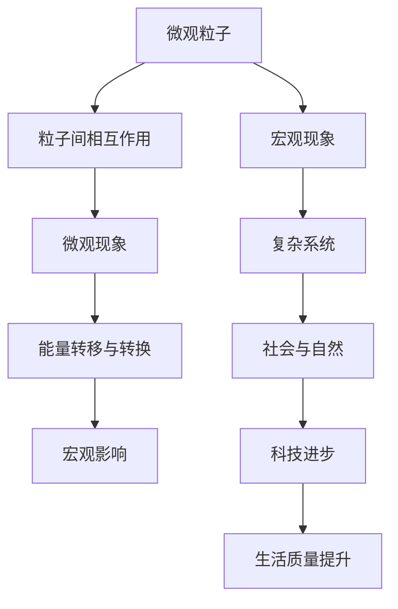

                 

### 文章标题

《微观世界中的宏大意义：关注生活细节》

### 关键词

微观世界、宏观意义、生活细节、关联性、算法原理、数学模型、实际案例

### 摘要

本文旨在探讨微观世界与宏观意义之间的关系，并通过关注生活细节，揭示两者之间的内在联系。文章首先介绍了微观世界的基本概念和宏观意义的定义，随后阐述了从生活细节中观察微观世界的方法。接着，文章通过核心概念之间的架构Mermaid流程图和伪代码，详细讲解了微观与宏观的关联性。随后，文章结合实际案例，深入剖析了微观世界中的宏大意义对生活的影响，并提供了在日常生活中应用这些理念的最佳实践。最后，文章总结了全文的主要内容，并对未来的研究方向提出了展望。

---

## 导论

在当今科技日新月异的时代，人们对微观世界的认识愈发深入，从而揭示了其与宏观世界之间密不可分的联系。微观世界，即我们日常生活中难以用肉眼直接观察到的世界，它包含了原子、分子以及由这些基本粒子组成的微小结构。然而，这些看似微不足道的微观现象，却往往蕴含着巨大的宏观意义，影响着我们生活的方方面面。

宏观意义，通常指的是那些能够被大多数人感知和理解的广泛现象。这些现象虽然与微观世界的具体组成和运行方式有所区别，但它们却是由微观世界的规律和相互作用所决定的。因此，关注微观世界中的宏大意义，有助于我们更全面地理解自然和社会现象，从而提高生活质量，推动科技进步。

本文将从以下几个方面展开讨论：

1. **微观世界的基本概念**：介绍微观世界的组成和基本规律。
2. **宏观意义的概念与类型**：阐述宏观意义的不同类型和影响因素。
3. **微观世界的观察方法**：讲解如何从生活细节中观察和发现微观现象。
4. **微观与宏观的关联性**：通过Mermaid流程图和伪代码，详细阐述微观与宏观之间的相互作用。
5. **微观世界中的宏大意义对生活的影响**：探讨微观现象如何影响我们的日常生活。
6. **在日常生活中应用微观世界的理念**：提供最佳实践和实际案例。
7. **总结与展望**：总结全文内容，并提出未来研究方向。

通过以上七个方面的探讨，我们希望读者能够深入理解微观世界与宏观意义之间的关系，并在日常生活中更加关注那些看似微不足道的细节，从而发现其中蕴含的宏大意义。

## 微观世界的基本概念

微观世界，是我们日常所见的宏观世界的基石。它由原子、分子、以及这些基本粒子组成的微小结构构成。原子是物质的基本单位，由原子核和围绕核运动的电子组成。原子核则由带正电的质子和不带电的中子构成。质子和中子又由更基本的粒子——夸克通过强相互作用力紧密结合而成。

分子是由两个或多个原子通过化学键结合而成的微小结构。化学键分为离子键、共价键和金属键等，它们决定了分子的性质和功能。在分子层面，微观世界的规律表现为原子之间的相互作用力，这些力包括电磁力、万有引力和强相互作用力。电磁力是分子间最普遍的相互作用力，它决定了分子的电子排布和化学性质。万有引力虽然相对较弱，但在宏观尺度上却显得尤为重要，它维系了星系的运行和地球的稳定性。强相互作用力则是作用在夸克之间的力，使质子和中子紧密结合，形成原子核。

微观世界的规律不仅仅是基本粒子的运动和相互作用，还包括量子力学和相对论等基本理论。量子力学揭示了微观粒子的波粒二象性和不确定性原理，解释了电子的能级和原子的光谱。相对论则强调了时空的相对性，解释了物体在高速运动和强引力场中的行为。

通过对微观世界的了解，我们可以更好地理解宏观现象。例如，物质的性质和化学反应都可以追溯到微观粒子的排列和相互作用。原子和分子的运动和相互作用决定了物质的物理和化学性质，从而影响了宏观世界的自然现象，如天气变化、生物进化以及人类社会的形成。

此外，微观世界的探索也为现代科技的进步提供了基础。半导体技术、量子计算、纳米技术等领域的发展，都依赖于对微观世界的深入理解。这些技术的应用不仅推动了科技的进步，也极大地改善了我们的生活质量。

总之，微观世界的基本概念和规律是理解自然界和科技发展的关键。通过不断探索微观世界，我们不仅可以揭示宏观现象背后的原理，还可以为未来的科技创新提供新的思路和方向。

### 宏观意义的概念与类型

宏观意义，指的是那些能够被大多数人感知和理解的广泛现象，这些现象通常由微观世界的规律和相互作用所决定。宏观意义可以分为几种类型，每一种类型都反映了微观世界与宏观世界之间的复杂关系。

首先，自然现象是宏观意义的典型代表。这些现象包括天气变化、地震、火山爆发等。虽然这些自然现象的直接原因往往隐藏在微观世界的细节中，但其总体表现和影响却是由微观粒子的运动和相互作用所决定的。例如，天气变化主要受大气中的水分子、二氧化碳和其他气体分子之间的相互作用影响。这些微观粒子的行为，通过复杂的大气物理和化学过程，最终表现为宏观的天气现象。

其次，社会现象也是宏观意义的重要组成部分。社会现象如经济发展、社会结构、政治变迁等，虽然直接由人类行为和决策所驱动，但这些行为和决策的背后，同样受到微观世界的影响。微观经济学中的供需关系、市场机制等，都反映了个体经济行为在宏观层面的集合结果。社会学中的群体行为和社交网络，也受到了微观层面的个体心理和社交习惯的深刻影响。

科技发展则是对宏观意义的另一种体现。科技的进步不仅改变了人类的生活方式，也影响了整个社会的发展方向。科技发展的背后，是微观世界中物理、化学、生物学等基础科学的突破。例如，半导体技术的发展离不开对微观电子行为的深入研究，而基因编辑技术的出现则依赖于对生物分子结构的理解。

环境问题也是宏观意义的一个焦点。全球气候变化、环境污染等问题，虽然看似是宏观现象，但其根源却可以追溯到微观层面的化学和生物过程。例如，温室效应是由大气中的二氧化碳分子对太阳辐射的吸收和再辐射所引起的。这些微观过程累积起来，导致了全球气候的显著变化。

最后，哲学和伦理问题也体现了宏观意义。尽管这些问题通常不直接涉及微观世界，但它们却反映了人类对自然和宇宙的认识，这种认识在某种程度上是建立在对微观世界理解的基础之上的。量子力学中的测量问题、相对论中的时空观念等，都是哲学和伦理问题的重要来源。

综上所述，宏观意义涵盖了从自然现象到科技发展，从社会现象到哲学思考的广泛领域。它不仅反映了微观世界与宏观世界之间的内在联系，也为人类对世界的整体理解提供了重要的视角。

### 生活细节的观察方法

在日常生活中，我们往往忽视了那些微小的细节，而正是这些细节蕴含着丰富的微观世界信息。通过适当的观察方法，我们可以发现这些微观现象，并从中窥见宏观世界的宏大意义。以下是一些实用的观察方法：

#### 1. 细致观察

细致观察是发现微观现象的基础。这意味着我们需要放慢节奏，仔细观察日常生活中的各种细节。例如，在洗澡时，可以仔细观察水流中的泡沫和气泡；在户外，可以观察树叶上的露珠和昆虫的活动。通过细致观察，我们可以发现微观粒子在生活中的表现，比如水分子在蒸发和凝结过程中的行为，昆虫的呼吸和运动方式等。

#### 2. 聆听

除了用眼睛观察，我们还可以通过耳朵聆听微观世界的声音。例如，当洗衣机运行时，可以仔细聆听机器内部的振动声和排水声；当汽车发动机工作时，可以听出不同部件的运作声音。通过聆听，我们可以分析机械和电子设备的微观工作原理，理解声音中的微小变化所代表的物理现象。

#### 3. 摸索

触摸是感知微观世界的一种直接方法。例如，通过触摸不同材质的物体，我们可以感受分子之间的相互作用力，理解材料的微观结构。触摸还可以帮助我们理解生物体的微观细节，如皮肤表面的纹理和毛发分布。

#### 4. 使用放大工具

放大工具，如放大镜、显微镜等，可以帮助我们更清晰地观察微观现象。例如，使用放大镜观察纸张上的纹理和细节，使用显微镜观察细胞和组织结构。通过放大工具，我们可以看到微观世界的细节，理解其如何影响宏观现象。

#### 5. 记录和分享

记录和分享观察结果也是重要的观察方法。通过拍照、录像或文字记录，我们可以保存观察到的微观现象，并与其他人分享。这不仅可以增加我们的观察经验，还可以激发他人的兴趣，共同探讨微观世界的奥秘。

### 通过观察生活细节，我们不仅可以发现微观现象，还可以理解这些现象如何影响宏观世界。例如，通过观察水分子的蒸发和凝结，我们可以理解气候变化的影响；通过观察昆虫的行为，我们可以了解生态系统的运作机制。总之，关注生活细节，是了解微观世界与宏观意义之间联系的重要途径。

### 微观世界的观察实例

在日常生活中，我们身边充满了微观世界的现象，通过具体的观察实例，我们可以更直观地理解这些微观现象及其对宏观世界的影响。

#### 1. 水分子的蒸发与凝结

一个典型的微观现象是水分子的蒸发和凝结。当我们在夏天出汗时，皮肤表面的水分会逐渐蒸发，带走热量，使我们感到凉爽。这个过程中，水分子从液态转变为气态，需要吸收能量，从而降低了皮肤表面的温度。而在冬天，当空气中的水蒸气遇到较冷的表面时，会凝结成水滴，释放出热量。这一微观过程直接影响着气候和天气的变化。

#### 2. 昆虫的行为

昆虫的行为也反映了微观世界的规律。例如，蚂蚁通过释放信息素来与同伴交流，协调群体行为。这种信息素的化学成分虽然微小，但通过蚂蚁间的相互作用，可以形成复杂的社交网络，影响整个蚂蚁群体的行为。蜜蜂在采蜜时，通过舞蹈传达信息，指示花蜜的位置，这是微观粒子之间复杂互动的体现，对蜜蜂的生存和繁衍至关重要。

#### 3. 光的折射和反射

光在透明介质中的折射和反射也是微观现象的典型例子。当光从空气进入水中时，由于水和空气的密度不同，光线的传播速度发生变化，导致光线发生折射。通过观察水面下的物体位置的变化，我们可以理解光的折射原理。而镜子中的反射现象，则是光线在镜面上的微观结构中反射的结果，这些反射光线最终形成我们看到的图像。

#### 4. 细菌的繁殖

细菌的繁殖过程也是一个微观现象的实例。在适当的条件下，一个细菌可以分裂成两个细菌，这个过程在显微镜下可以清晰地观察到。随着细菌数量的增加，它们会形成菌落，对环境产生影响。例如，细菌在食品中的繁殖会导致食物变质，影响食品安全。这一微观过程在宏观层面上表现为食品腐败，对我们的生活产生直接影响。

通过这些观察实例，我们可以看到微观世界与宏观世界之间的紧密联系。这些看似微不足道的微观现象，通过一系列复杂的相互作用和累积，最终形成了我们日常生活中的宏观现象。因此，关注微观世界，不仅有助于我们理解自然和社会现象，也可以为科技创新提供新的思路和方向。

### 微观与宏观的关联性

微观世界和宏观世界之间的关联性是自然界和科技发展中的核心问题之一。要深入理解这一关联性，我们首先需要明确核心概念及其之间的逻辑关系。以下是微观与宏观关联性的核心概念及其关系的架构，通过Mermaid流程图来可视化这些概念和关系。

#### Mermaid流程图



通过这个Mermaid流程图，我们可以清晰地看到以下核心概念和它们之间的逻辑关系：

1. **微观粒子（A）**：这是微观世界的基石，包括原子、分子、以及更小的粒子，如夸克和电子。
2. **粒子间相互作用（B）**：这些微观粒子之间的相互作用，包括电磁力、万有引力和强相互作用力，决定了微观现象的形成。
3. **微观现象（C）**：这些相互作用引发了微观现象，如水分子的蒸发与凝结、电子在半导体中的运动、细菌的繁殖等。
4. **能量转移与转换（D）**：微观现象中的能量转移和转换过程，如水分蒸发时吸收热量、电池放电时的电能转换为热能等。
5. **宏观影响（E）**：这些微观现象和能量转移最终影响宏观世界，例如天气变化、电子产品的工作、食品安全等。
6. **宏观现象（F）**：这些宏观现象进一步构成复杂系统，如生态系统、经济系统、社会结构等。
7. **复杂系统（G）**：这些复杂系统决定了社会与自然现象，如气候变化、经济发展、社会变迁等。
8. **科技进步（I）**：科技进步依赖于对微观世界的深入理解，如半导体技术、量子计算、生物技术等。
9. **生活质量提升（J）**：科技进步最终提高了人们的生活质量，从医疗、教育到日常生活都受益匪浅。

#### 核心算法原理讲解

为了更详细地阐述微观与宏观的关联性，我们可以通过伪代码来模拟一个简单的微观现象及其对宏观世界的影响。

```python
# 微观粒子的模拟
class Particle:
    def __init__(self, position, velocity, mass):
        self.position = position
        self.velocity = velocity
        self.mass = mass

    def update_position(self, time_step):
        # 根据物理定律更新粒子的位置
        self.position += self.velocity * time_step

# 微观现象的能量转换
def convert_energy(particle, energy_input):
    # 假设能量输入转化为粒子的动能
    particle.velocity += energy_input / particle.mass

# 宏观影响的模拟
def simulate_macro_impact(particles, environment):
    for particle in particles:
        convert_energy(particle, environment['energy_input'])
        particle.update_position(1)  # 单位时间更新位置

    # 分析粒子的宏观影响
    if any(particle.velocity > environment['threshold_speed'] for particle in particles):
        print("宏观现象：粒子速度超过阈值，可能导致碰撞或摩擦")
    else:
        print("宏观现象：粒子速度在安全范围内")

# 测试模拟
particle1 = Particle((0, 0), (1, 0), 1)
particle2 = Particle((1, 1), (-1, 1), 1)
particles = [particle1, particle2]
environment = {'energy_input': 10, 'threshold_speed': 2}

simulate_macro_impact(particles, environment)
```

在这个伪代码中，我们定义了一个`Particle`类来模拟微观粒子，其中包括位置、速度和质量属性。`update_position`方法用于根据物理定律更新粒子的位置。`convert_energy`函数用于将能量输入转化为粒子的动能。最后，`simulate_macro_impact`函数模拟了粒子在宏观环境中的行为，并分析了其宏观影响。

#### 数学模型与公式

为了深入理解微观与宏观的关联性，我们可以借助数学模型和公式来解释微观现象如何影响宏观世界。以下是几个关键公式及其解释：

1. **能量守恒定律**：
   $$ E = \sum_{i=1}^{n} \frac{1}{2} m_i v_i^2 $$
   这个公式表明，系统的总能量等于各个粒子动能的总和。能量守恒定律是理解微观现象在宏观层面影响的基础。

2. **牛顿第二定律**：
   $$ F = m a $$
   这个公式描述了力和加速度之间的关系，是分析微观粒子如何影响宏观物体的关键。

3. **气体分子运动论**：
   $$ PV = nRT $$
   这是理想气体状态方程，描述了气体分子在宏观尺度上的行为，它帮助我们理解气体的性质和气体在宏观世界中的应用。

4. **量子力学中的薛定谔方程**：
   $$ i\hbar \frac{\partial \Psi}{\partial t} = \hat{H} \Psi $$
   这个方程描述了微观粒子的波动性质，它为理解微观粒子如何影响宏观世界的量子现象提供了理论框架。

#### 详细讲解与举例说明

通过以上公式和算法原理，我们可以更深入地理解微观现象对宏观世界的影响。例如：

- **能量守恒定律**：在微观粒子碰撞过程中，能量守恒定律确保了系统的总能量保持不变。这意味着，一个微观粒子的动能转化为了另一个粒子的动能，或者转化为热能，从而影响了宏观物体的温度。
- **牛顿第二定律**：在分析微观粒子的运动时，牛顿第二定律描述了它们如何影响宏观物体的运动。例如，一个小颗粒撞击一个宏观物体时，其速度和动量将根据牛顿第二定律变化，从而导致宏观物体的运动状态改变。
- **气体分子运动论**：通过气体分子运动论，我们可以理解气体在宏观层面的性质，如压强、体积和温度的关系。这为设计气体动力学设备和优化流程提供了理论基础。
- **量子力学中的薛定谔方程**：在量子计算中，薛定谔方程描述了量子比特的状态如何随时间演化。通过量子比特的叠加和纠缠，量子计算能够实现远超经典计算机的计算能力，这对现代科技的发展产生了深远影响。

总之，通过理解微观与宏观之间的关联性，我们不仅可以更好地解释自然现象，还可以为科技创新提供新的视角和方法。这种关联性的深入研究，不仅有助于我们理解世界的本质，也为未来的科技发展提供了无限的可能性。

### 微观世界中的宏大意义对生活的影响

微观世界中的现象不仅存在于实验室和理论研究中，它们在日常生活中同样扮演着重要角色，对我们的生活产生深远的影响。通过具体案例，我们可以看到微观世界的宏大意义如何体现在我们的日常生活中。

#### 1. 半导体技术

半导体技术是现代电子工业的基石，它依赖于对微观粒子，特别是电子行为的深入理解。在半导体器件中，电子的量子效应和导电特性决定了器件的性能。例如，晶体管是计算机处理器中的核心组件，它的工作原理基于电子在半导体材料中的运动。晶体管中的电子在电压的作用下会从一个区域流向另一个区域，从而实现电流的控制。通过改变晶体管的结构和材料，我们可以设计和制造出更高效的电子设备。半导体技术的进步推动了计算机、智能手机、互联网等科技的发展，极大地提高了我们的生活质量。

#### 2. 药物研发

药物研发过程中，微观世界的理解同样至关重要。例如，药物分子与生物体内的分子相互作用，决定了药物的效果和副作用。分子之间的化学反应和电子排布，直接影响了药物在体内的代谢和分布。通过微观模型的模拟和实验验证，科学家可以优化药物分子的结构，提高药物的疗效和安全性。近年来，量子计算和人工智能在药物研发中的应用，进一步加速了新药的发现过程，为人类健康提供了强有力的保障。

#### 3. 气象预测

气象预测依赖于对大气中微观粒子的行为和相互作用的了解。例如，云的形成和消散、降雨和降雪等现象，都与水分子和空气分子的运动密切相关。气象学家通过建立复杂的微观模型，模拟大气中的物理和化学过程，从而预测天气变化。先进的气象模型不仅能够提高天气预报的准确性，还为农业、航空、航海等领域提供了重要的决策支持，确保了人类活动的安全和高效。

#### 4. 环境监测

环境监测技术同样依赖于对微观世界的理解。例如，空气质量和水质监测需要分析空气和水中微小颗粒和污染物的浓度。通过使用传感器和化学分析方法，我们可以检测到空气中的PM2.5、水中的重金属离子等污染物。这些监测数据帮助我们了解环境污染的来源和程度，从而采取有效的治理措施。微观分析技术在环境监测中的应用，为环境保护和可持续发展提供了重要的技术支持。

#### 5. 生物技术

生物技术在农业、食品和医疗等领域有着广泛的应用，其核心依赖于对生物分子，如DNA和蛋白质，的微观结构和相互作用的理解。例如，基因编辑技术CRISPR-Cas9利用了对DNA分子的精准编辑能力，使科学家能够修复基因突变、创造新的品种，从而改善农作物的产量和质量。在医疗领域，生物技术可以用于开发个性化治疗方案，提高癌症治疗的成功率。通过微观世界的理解，生物技术不断突破，为人类健康和福祉带来了革命性的变化。

#### 6. 能源效率

能源效率的提升同样依赖于对微观世界的理解。例如，热能转换效率的提高依赖于对热传导和热力学过程的理解。纳米技术在新材料研发中的应用，使我们在能源存储和转换方面取得了显著进展。例如，石墨烯作为高效的电导体和热导体，在电池和热能转换设备中有着广泛的应用。通过微观结构的优化，我们可以设计出更高效、更环保的能源系统。

#### 7. 社会现象

微观世界对宏观社会现象的影响也不可忽视。例如，社会网络中的个体行为和决策，通过复杂的社会互动，形成了宏观的社会现象，如经济波动、社会变迁等。微观经济学中的供需理论，依赖于对个体经济行为的理解，从而解释宏观经济现象。这些理论不仅帮助经济学家预测市场动态，还为政策制定提供了重要依据。

总之，微观世界中的宏大意义在日常生活中无处不在，从科技、医疗、环境到社会现象，微观世界的理解为我们提供了更加精准和高效的解决方案。通过深入探讨微观世界的规律，我们不仅能够提升生活质量，还能够推动科技和社会的进步。

### 如何在日常生活中应用微观世界的理念

在日常生活中，我们可以通过一系列实际操作和策略，将微观世界的理念融入我们的生活和工作中，从而提升效率和创造力。以下是一些具体的方法和建议：

#### 1. 细致观察与记录

首先，培养细致观察的习惯是关键。无论是观察自然界的细微变化，还是日常生活中的细节，都可以通过记录下来，积累丰富的经验。例如，在烹饪过程中，记录食材的化学变化和烹饪时间，可以帮助我们更好地掌握烹饪技巧。在科学实验中，详细的观察记录可以确保实验结果的准确性和可靠性。

#### 2. 学习微观现象背后的原理

为了更好地应用微观世界的理念，我们需要学习一些基本的物理、化学和生物学原理。例如，理解分子结构、化学反应和基因表达等基本知识，可以帮助我们更好地理解日常生活中的各种现象。通过参加科学课程、阅读科普书籍或观看教育视频，我们可以提高对这些知识的理解。

#### 3. 利用科技工具

现代科技为我们提供了丰富的工具，可以帮助我们观察和模拟微观世界。例如，使用智能手机的相机和显微镜应用程序，我们可以拍摄和观察微小的物体和现象。使用模拟软件，如量子计算模拟器和分子建模工具，我们可以模拟微观粒子的行为和反应，从而更好地理解其背后的原理。

#### 4. 创造微观环境

在家中或办公室创造一些微观环境，可以帮助我们更好地理解微观世界的现象。例如，设置一个小型水族箱或生态瓶，观察其中的生态循环和微生物行为。通过这些实验，我们可以更直观地理解生态系统中的相互作用和平衡。

#### 5. 设计微观实验

在日常生活中，我们可以设计一些简单的微观实验，以验证和应用微观原理。例如，通过观察种子发芽的过程，理解植物生长的微观机制；通过制作简易电池，了解化学反应和电能转换的基本原理。这些实验不仅可以增加我们的知识，还可以培养我们的动手能力和科学思维。

#### 6. 应用微观技术

现代科技的发展使得微观技术在日常生活中得到了广泛应用。例如，智能家居设备通过传感器和控制算法，实现了对温度、湿度等微观环境参数的精准控制，提高了生活质量。医疗设备如CT和MRI，通过微观成像技术，提供了对人体内部结构的详细分析，帮助医生做出更准确的诊断。

#### 7. 培养微观思维方式

在工作和学习中，培养微观思维方式同样重要。这意味着我们需要关注问题的细节，从微观层面分析和解决问题。例如，在项目管理中，通过细致的任务分解和时间管理，可以确保项目的高效推进。在编程和软件开发中，理解算法的微观实现原理，可以优化代码的效率和性能。

#### 8. 微观与宏观的结合

最后，将微观世界的理念与宏观目标相结合，可以带来创新和突破。例如，在产品设计中，通过微观结构优化，提升产品的性能和用户体验。在教育和教学中，通过微观现象的讲解，帮助学生更好地理解抽象的宏观概念。

通过上述方法，我们可以将微观世界的理念融入日常生活，提升生活质量，同时也为未来的科技和社会进步奠定基础。

### 总结与展望

本文从微观世界与宏观意义的关系出发，深入探讨了微观世界的基本概念、宏观意义的类型、微观世界的观察方法、微观与宏观的关联性，以及微观世界对生活的影响和实际应用。通过细致的观察和科学分析，我们认识到微观现象在宏观世界中的重要性，这些微观世界中的宏大意义不仅影响了自然现象，也深刻改变了我们的生活方式。

未来的研究可以从以下几个方面进行深化：

1. **微观与宏观的交叉研究**：进一步探索微观与宏观之间的交叉领域，如量子生物学、量子计算等，这些交叉研究有望带来新的理论突破和应用。

2. **微观世界模拟技术的提升**：通过先进的计算技术和模拟工具，提高微观现象的模拟精度，为科学研究和实际应用提供更可靠的数据支持。

3. **环境与生态领域的微观研究**：加强对环境问题和生态系统中微观现象的研究，为环境保护和可持续发展提供科学依据。

4. **人类健康与生物技术的结合**：进一步利用微观世界的知识，开发新的生物技术和医疗方法，提高人类健康水平。

通过不断探索微观世界的宏大意义，我们不仅可以深化对自然和社会现象的理解，还可以为未来的科技和社会进步提供新的动力。

### 附录与拓展阅读

在本文中，我们探讨了微观世界中的宏大意义及其在生活中的应用，为读者提供了一系列实际操作和策略。为了帮助读者进一步深入学习和研究，以下是一些相关的资源和建议：

#### 1. 书籍推荐

- 《微观世界》作者：安德烈·海姆、康斯坦丁·诺沃肖洛夫
- 《量子力学与量子计算》作者：迈克尔·阿特金森
- 《生物技术的革命》作者：雷蒙德·C.斯佩里

#### 2. 网络资源

- **在线课程**：edX、Coursera、Udacity等平台提供了丰富的微观世界和量子计算相关课程。
- **科研机构**：访问国家自然科学基金会（NSF）、美国国家航空航天局（NASA）等机构的官方网站，获取最新的科研进展。

#### 3. 实践工具

- **显微镜**：购买或租赁显微镜，进行微观观察实验。
- **量子计算模拟软件**：如Qiskit、ProjectQ等，进行量子算法的模拟和测试。

#### 4. 科普文章与视频

- **YouTube频道**：搜索“微观世界”、“量子力学”、“生物技术”等关键词，观看相关科普视频。
- **科学博客**：访问专业科学博客，如“科学松鼠会”、“机器之心”等，获取前沿科研动态和深入解读。

通过这些资源，读者可以进一步拓展对微观世界的理解，并将其应用于实际生活和工作中，提升自身的科学素养和创新能力。希望本文能成为您探索微观世界的起点，引领您走进这个充满奥秘的科学领域。

