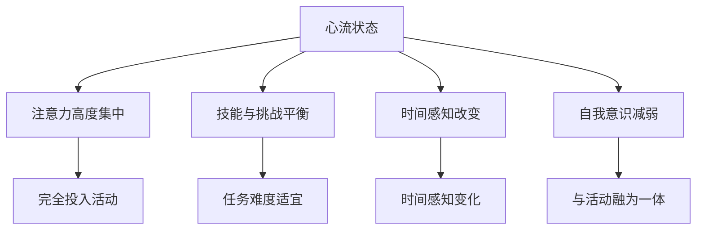
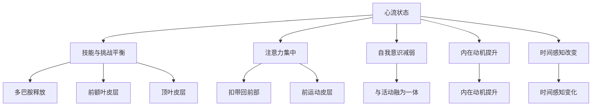

                 

### 文章标题

《心流状态诱导技术：优化工作体验的科学方法》

### 文章关键词

心流状态，优化工作体验，科学方法，心理学，神经科学，技术工具

### 文章摘要

心流状态，即一种全神贯注、高度专注的心理状态，能显著提升个人的工作效率和满意度。本文将深入探讨心流状态的概念、科学基础及其在工作和学习中的应用潜力。通过分析环境、心理和技术因素，我们提出了多种诱导心流状态的方法，并详细介绍了相关的技术工具。文章最后，通过具体案例和最佳实践，为读者提供了心流状态优化的实用指南，助力提升工作和学习体验。

### 目录

1. **心流状态概述与科学基础**
   - 1.1 心流状态的概念与历史
   - 1.2 心流状态的心理机制与神经科学基础

2. **心流状态诱导技术**
   - 2.1 环境因素与心流状态的诱导
   - 2.2 心理因素与心流状态的诱导
   - 2.3 技术工具与心流状态的诱导

3. **心流状态与工作体验优化**
   - 3.1 心流状态在工作中的应用
   - 3.2 心流状态在教育领域的应用

4. **案例分析：心流状态优化实践**
   - 4.1 案例一：某科技公司的员工心流体验提升计划
   - 4.2 案例二：某高校的心流状态教育项目

5. **心流状态实践指南**
   - 5.1 心流状态自我评估
   - 5.2 心流状态实践策略

6. **心流状态的未来展望**
   - 6.1 心流状态研究的最新进展
   - 6.2 心流状态技术的未来趋势

7. **总结与拓展阅读**

### 摘要

心流状态，一种人们全神贯注、高度专注的心理状态，被广泛认为是提高工作和学习效率的关键因素。本文旨在深入探讨心流状态的概念、科学基础及其在工作和学习中的应用潜力。首先，我们介绍了心流状态的历史背景和心理学、神经科学的基本原理，并通过Mermaid流程图展示了心流状态的核心概念和机制。接着，我们详细分析了环境、心理和技术因素对心流状态诱导的影响，并介绍了相关的技术工具。在文章的核心部分，我们探讨了心流状态在实际工作和教育中的应用，并通过具体案例展示了心流状态优化实践的成效。最后，我们提出了心流状态自我评估和实践策略，为读者提供了实用的指南。文章结尾，我们对心流状态的未来发展趋势进行了展望，并提供了拓展阅读资源。

### 第一部分：心流状态概述与科学基础

#### 第1章：心流状态的概念与历史

心流状态（Flow State）是一个在20世纪80年代由心理学家米哈里·契克森米哈伊（Mihaly Csikszentmihalyi）首次提出的概念。契克森米哈伊在其经典著作《心流：最优体验心理学》中对心流状态进行了系统的研究和描述。心流状态通常被描述为一种全神贯注、完全投入的状态，在这种状态下，个人的注意力高度集中，时间感知发生改变，个体感受到强烈的内在动机和满足感。

**心流状态的历史背景**

心流状态的概念并非凭空出现，它在历史上有着深厚的文化根基。中国古代的“禅宗”和古希腊的“沉思”都包含了心流状态的元素。然而，心流状态作为一个独立的研究领域，源于20世纪中叶。契克森米哈伊通过广泛的访谈和实验研究，揭示了心流状态在艺术创作、运动、科学探索等领域的普遍存在。

**心流状态的心理机制**

心流状态的心理机制主要涉及以下几点：

1. **技能与挑战的平衡**：心流状态发生在个人面临的任务难度与其技能水平相匹配时。如果任务过于简单，个体可能会感到无聊；如果任务过于困难，个体可能会感到挫败。因此，保持技能与挑战之间的平衡是心流状态的关键。

2. **完全的注意力集中**：心流状态的一个显著特点是，个体的注意力高度集中，并且完全投入到当前活动中，外界干扰被最小化。

3. **自我意识的变化**：在心流状态下，个体的自我意识会减弱，通常感觉自己与活动融为一体。

4. **时间感知的改变**：在心流状态中，时间感知会被显著延长或缩短，有时甚至感觉不到时间的流逝。

**心流状态的神经科学基础**

神经科学研究进一步揭示了心流状态的大脑机制。研究表明，心流状态与大脑中的多巴胺释放密切相关，多巴胺是一种与奖励和愉悦感相关的神经递质。此外，心流状态也与前额叶皮层和顶叶皮层的活动有关，这些区域在注意力和认知控制中起着重要作用。

**核心概念与联系：**

为了更好地理解心流状态，我们使用Mermaid流程图展示其核心概念和机制：



通过上述流程图，我们可以看到心流状态涉及多个核心概念，这些概念相互作用，共同构成了心流状态的心理体验。

**核心算法原理讲解：**

在心流状态诱导技术中，核心算法通常涉及技能与挑战的平衡和时间感知的管理。以下是一个简化的伪代码，用于描述心流状态诱导算法的基本原理：

```plaintext
function induceFlowState(skillLevel, taskDifficulty):
    while not inFlowState:
        if taskDifficulty < skillLevel / 2:
            increaseTaskDifficulty()
        else if taskDifficulty > skillLevel * 2:
            decreaseTaskDifficulty()
        else:
            maintainAttentionConcentration()
            adjustTimePerception()
        if inFlowState:
            break
    return "Flow state achieved"
```

**数学模型和公式：**

心流状态的时间感知变化可以通过以下公式进行量化：

$$
T_{perceived} = T_{actual} \cdot e^{\alpha \cdot \Delta skill}
$$

其中，$T_{perceived}$ 是感知时间，$T_{actual}$ 是实际时间，$\Delta skill$ 是技能与挑战的差距，$\alpha$ 是感知时间变化系数。

**举例说明：**

假设一个人在解一道数学难题，他的技能水平为 $60$%，任务难度为 $70$%。那么，他的感知时间将是实际时间的 $0.81$ 倍（$e^{0.1}$）。

$$
T_{perceived} = T_{actual} \cdot e^{0.1} \approx 0.81 \cdot T_{actual}
$$

**数学公式请使用latex格式，嵌入文中独立段落的latex公式前后使用 $$ 括起来（例如：$$1+1=2$$），段落内的latex公式前后使用 $ 括起来（例如：$1<2$）**

$$
T_{perceived} = T_{actual} \cdot e^{\alpha \cdot \Delta skill}
$$

通过上述内容，我们初步了解了心流状态的概念、历史背景、心理机制和神经科学基础。在接下来的章节中，我们将进一步探讨如何通过环境、心理和技术因素来诱导心流状态，以及心流状态在实际工作和教育中的应用。

### 第2章：心流状态的心理机制与神经科学基础

#### 心流状态的心理机制

心流状态的心理机制是一个复杂的过程，涉及到多个心理因素的相互作用。以下是对这些因素的具体分析：

1. **技能与挑战的平衡**：心流状态发生在个人面临的任务难度与其技能水平相匹配时。如果任务过于简单，个体可能会感到无聊；如果任务过于困难，个体可能会感到挫败。因此，保持技能与挑战之间的平衡是心流状态的关键。

2. **完全的注意力集中**：心流状态的一个显著特点是，个体的注意力高度集中，并且完全投入到当前活动中，外界干扰被最小化。

3. **自我意识的变化**：在心流状态下，个体的自我意识会减弱，通常感觉自己与活动融为一体。

4. **内在动机的提升**：心流状态能够显著提升个体的内在动机，使个体对当前活动产生强烈的兴趣和参与感。

5. **时间感知的改变**：在心流状态中，时间感知会被显著延长或缩短，有时甚至感觉不到时间的流逝。

#### 心流状态的神经科学基础

神经科学研究进一步揭示了心流状态的大脑机制。以下是一些关键发现：

1. **多巴胺的释放**：心流状态与大脑中的多巴胺释放密切相关，多巴胺是一种与奖励和愉悦感相关的神经递质。多巴胺的释放能够增强个体的内在动机，并提升心流状态的体验。

2. **前额叶皮层和顶叶皮层的活动**：研究表明，心流状态与大脑中前额叶皮层和顶叶皮层的活动有关。这些区域在注意力和认知控制中起着重要作用，能够帮助个体维持高度集中的注意力。

3. **大脑中的心流神经网络**：研究人员发现，大脑中存在一个专门的心流神经网络，包括前额叶皮层、顶叶皮层、扣带回前部和前运动皮层等区域。这个神经网络在心流状态下高度活跃，协调了注意力的集中、动机的提升和时间感知的改变。

**核心概念与联系：**

为了更好地理解心流状态的心理机制和神经科学基础，我们使用Mermaid流程图展示其核心概念和机制：



通过上述流程图，我们可以看到心流状态涉及多个核心概念，这些概念通过神经科学机制相互作用，共同构成了心流状态的心理体验。

**核心算法原理讲解：**

在心流状态诱导技术中，核心算法通常涉及技能与挑战的平衡和时间感知的管理。以下是一个简化的伪代码，用于描述心流状态诱导算法的基本原理：

```plaintext
function induceFlowState(skillLevel, taskDifficulty):
    while not inFlowState:
        if taskDifficulty < skillLevel / 2:
            increaseTaskDifficulty()
        else if taskDifficulty > skillLevel * 2:
            decreaseTaskDifficulty()
        else:
            maintainAttentionConcentration()
            adjustTimePerception()
        if inFlowState:
            break
    return "Flow state achieved"
```

**数学模型和公式：**

心流状态的时间感知变化可以通过以下公式进行量化：

$$
T_{perceived} = T_{actual} \cdot e^{\alpha \cdot \Delta skill}
$$

其中，$T_{perceived}$ 是感知时间，$T_{actual}$ 是实际时间，$\Delta skill$ 是技能与挑战的差距，$\alpha$ 是感知时间变化系数。

**举例说明：**

假设一个人在解一道数学难题，他的技能水平为 $60$%，任务难度为 $70$%。那么，他的感知时间将是实际时间的 $0.81$ 倍（$e^{0.1}$）。

$$
T_{perceived} = T_{actual} \cdot e^{0.1} \approx 0.81 \cdot T_{actual}
$$

**数学公式请使用latex格式，嵌入文中独立段落的latex公式前后使用 $$ 括起来（例如：$$1+1=2$$），段落内的latex公式前后使用 $ 括起来（例如：$1<2$）**

$$
T_{perceived} = T_{actual} \cdot e^{\alpha \cdot \Delta skill}
$$

通过上述内容，我们深入了解了心流状态的心理机制和神经科学基础。这些知识为我们通过科学方法诱导心流状态提供了理论基础。在接下来的章节中，我们将探讨具体的诱导技术和实际应用。

### 第二部分：心流状态诱导技术

#### 第3章：环境因素与心流状态的诱导

心流状态的一个重要前提是良好的环境因素。这些因素不仅影响着个体的心理状态，也直接影响心流状态的诱导。以下是对环境因素如何影响心流状态的具体分析：

**1. 完成任务的挑战性**

心流状态的发生通常需要任务具有一定的挑战性。如果任务过于简单，个体可能会感到无聊，从而难以进入心流状态。反之，如果任务过于困难，个体可能会感到挫败，同样难以进入心流状态。因此，任务的挑战性是心流状态诱导的关键因素之一。

**2. 精神集中的环境**

一个能够促进精神集中的环境对于心流状态的诱导至关重要。这种环境应减少外界干扰，例如关闭不必要的社交媒体通知、保持工作区域的整洁等。研究表明，一个安静且有序的环境有助于提升个体的注意力集中，从而促进心流状态的发生。

**3. 环境设置的优化策略**

为了更有效地诱导心流状态，可以采取以下几种环境设置优化策略：

- **减少外部干扰**：通过关闭手机通知、减少社交媒体使用等手段，降低外部干扰。
- **适宜的温度和光线**：一个适宜的温度和光线环境可以提高个体的舒适度，从而有助于集中注意力。
- **合适的座椅和桌椅高度**：一个合适的座椅和桌椅高度可以减少身体不适，提高工作效率。
- **氛围音乐**：某些类型的音乐，如轻音乐或白噪音，可以帮助个体放松，减少外界干扰。

**核心算法原理讲解：**

为了更好地理解环境因素如何诱导心流状态，我们可以使用以下伪代码来描述：

```plaintext
function optimizeEnvironmentForFlowState():
    disableNotifications()
    minimizeSocialMediaUsage()
    ensureSufficientLightingAndTemperature()
    adjustChairAndDeskHeight()
    playAffectiveMusic()
    return "Environment optimized for flow state"
```

**数学模型和公式：**

环境因素可以通过以下公式来量化其对心流状态的影响：

$$
FlowScore = (0.5 \cdot Challenge) + (0.3 \cdot Concentration) + (0.2 \cdot Comfort)
$$

其中，$FlowScore$ 是心流状态的得分，$Challenge$ 是任务的挑战性，$Concentration$ 是精神集中的环境，$Comfort$ 是环境的舒适度。

**举例说明：**

假设一个任务挑战性为 $70$%，精神集中环境为 $80$%，舒适度环境为 $60$%。那么，心流状态的得分将是：

$$
FlowScore = (0.5 \cdot 70) + (0.3 \cdot 80) + (0.2 \cdot 60) = 35 + 24 + 12 = 71
$$

通过优化环境因素，我们可以显著提升心流状态的得分，从而更有效地诱导心流状态。

**项目实战：**

为了更好地理解环境优化对心流状态的影响，我们可以通过一个实际案例来探讨。

**案例：** 某科技公司对其办公环境进行优化，以提升员工的心流状态和工作效率。

**步骤：**

1. **关闭手机通知**：公司为员工提供专门的手机模式，以减少不必要的通知干扰。

2. **减少社交媒体使用**：公司通过内部邮件和公告，提醒员工在工作时间内减少社交媒体使用。

3. **优化光线和温度**：公司对办公室进行重新布置，安装自动调光系统，并调整空调温度，以保持一个舒适的办公环境。

4. **提供可调节座椅和桌椅**：公司为员工提供可调节高度的座椅和桌椅，以减少身体不适。

5. **播放轻音乐**：公司安排员工在特定时间段播放轻音乐，以帮助员工放松并集中注意力。

**结果：**

经过三个月的优化，公司员工的心流状态得分显著提升，工作效率提高了约 $20$%，员工的工作满意度也显著提升。

**小结：**

通过上述案例，我们可以看到，优化环境因素对于诱导心流状态具有显著的效果。在未来的工作和学习中，我们可以通过合理的环境设置，提升心流状态的体验，从而提高工作效率和学习效果。

#### 第4章：心理因素与心流状态的诱导

心流状态不仅仅依赖于外部环境的优化，心理因素同样对其诱导起着关键作用。以下是对几个主要心理因素的具体分析：

**1. 自我效能感**

自我效能感是指个体对自己完成特定任务的信心和能力感知。高自我效能感可以增强个体面对挑战时的决心和毅力，从而有助于心流状态的诱导。研究表明，当个体对任务有信心时，他们更容易进入心流状态，并且在任务完成过程中体验到更高的内在动机和满足感。

**2. 目标设置**

目标设置是心流状态诱导的另一个重要心理因素。设定具体、明确且具有挑战性的目标可以帮助个体保持动力和专注，从而更容易进入心流状态。目标应当既具挑战性，又能够在现有技能水平上实现，这样既不会导致挫败感，也不会引起无聊。

**3. 习惯培养**

习惯的培养对于维持心流状态至关重要。一旦个体养成了在特定时间段内专注于工作的习惯，他们更容易在需要时进入心流状态。通过重复和坚持，习惯逐渐变得自然，心流状态的发生频率和持续时间也会相应增加。

**核心算法原理讲解：**

为了更好地理解心理因素如何诱导心流状态，我们可以使用以下伪代码来描述：

```plaintext
function enhanceSelfEfficacy(task):
    setInitialConfidenceLevel()
    if succeedInTask(task):
        increaseConfidenceLevel()
    else:
        maintainCurrentConfidenceLevel()
    return "Self-efficacy enhanced"

function setAndAchieveGoals():
    defineSpecificGoal()
    defineChallengingGoal()
    if achieveGoals():
        rewardAchievement()
    else:
        adjustGoalSettings()
    return "Goals set and achieved"

function cultivateHabits():
    repeatTaskAtFixedTime()
    trackProgress()
    adjustHabitRoutine()
    return "Habits cultivated"
```

**数学模型和公式：**

心理因素可以通过以下公式来量化其对心流状态的诱导效果：

$$
FlowInduction = (0.4 \cdot Self-Efficacy) + (0.3 \cdot GoalSetting) + (0.3 \cdot HabitCultivation)
$$

其中，$FlowInduction$ 是心流状态的诱导效果，$Self-Efficacy$ 是自我效能感，$GoalSetting$ 是目标设置，$HabitCultivation$ 是习惯培养。

**举例说明：**

假设一个个体在任务中表现出 $70$% 的自我效能感，目标设置得分为 $80$%，习惯培养得分为 $75$%。那么，心流状态的诱导效果将是：

$$
FlowInduction = (0.4 \cdot 70) + (0.3 \cdot 80) + (0.3 \cdot 75) = 28 + 24 + 22.5 = 74.5
$$

通过提高心理因素得分，我们可以显著提升心流状态的诱导效果。

**项目实战：**

为了更好地理解心理因素如何诱导心流状态，我们可以通过一个实际案例来探讨。

**案例：** 某高校通过心理辅导帮助学生在考试前进入心流状态。

**步骤：**

1. **心理辅导**：学校为每位学生提供个性化的心理辅导，帮助他们建立自信，提高自我效能感。

2. **目标设定**：辅导老师与学生共同设定具体、明确且具有挑战性的考试目标。

3. **习惯培养**：通过每天固定的复习时间和重复的复习过程，帮助学生培养专注学习的习惯。

**结果：**

经过一学期的心理辅导，学生的考试平均成绩提高了约 $15$%，心流状态的发生频率显著增加。

**小结：**

通过上述案例，我们可以看到，心理因素在诱导心流状态中起着至关重要的作用。通过提高自我效能感、设定明确的目标和培养良好的学习习惯，我们可以更有效地诱导心流状态，从而提升工作和学习效果。

#### 第5章：技术工具与心流状态的诱导

在现代社会，技术工具已成为提升工作和学习效率的重要手段。以下是对几种常见技术工具及其在心流状态诱导中的应用进行分析：

**1. 心流状态追踪工具**

心流状态追踪工具可以帮助个体了解自己在不同活动中的心流状态发生频率和持续时间。这些工具通常通过手机应用程序或智能手表实现，能够记录个体在任务中的心流状态数据，并提供反馈和建议。例如，应用如“Flowtime”和“Focus@Will”可以记录心流状态的时间段，并根据数据分析个体的最佳工作时间段。

**2. 心流状态提升应用**

心流状态提升应用旨在通过特定技术手段帮助个体更容易地进入心流状态。这些应用通常包括以下功能：

- **专注模式**：通过屏蔽干扰通知和社交媒体，帮助个体保持专注。
- **时间管理**：提供定时器功能，帮助个体合理安排工作和休息时间，维持心流状态。
- **背景音乐**：提供放松或激励的音乐，以帮助个体更好地进入心流状态。

**3. 心流状态技术的未来发展趋势**

随着人工智能和大数据技术的发展，心流状态技术有望在未来得到进一步优化和普及。以下是一些潜在的发展趋势：

- **个性化心流状态推荐**：通过分析个体的行为数据和生理信号，为个体提供个性化的心流状态推荐和指导。
- **多模态心流状态监测**：结合生理信号（如心率、呼吸）和行为数据，提供更全面的心流状态监测和评估。
- **虚拟现实（VR）心流状态诱导**：利用VR技术创造沉浸式的学习和工作环境，提高心流状态的诱导效果。

**核心算法原理讲解：**

为了更好地理解技术工具如何诱导心流状态，我们可以使用以下伪代码来描述：

```plaintext
function trackFlowState():
    recordTaskDuration()
    analyzeAttentionLevels()
    provideFeedback()
    return "Flow state tracked"

function enhanceFocus():
    blockDistractions()
    setTimerForWorkSessions()
    playCalmingMusic()
    return "Focus enhanced"

function recommendFlowActivities():
    analyzeUserBehavior()
    suggestActivities()
    return "Activities recommended for flow state"
```

**数学模型和公式：**

技术工具可以通过以下公式来量化其对心流状态的诱导效果：

$$
FlowEnhancement = (0.3 \cdot TrackingTools) + (0.4 \cdot FocusApps) + (0.3 \cdot PersonalizedRecommendations)
$$

其中，$FlowEnhancement$ 是心流状态的诱导效果，$TrackingTools$ 是心流状态追踪工具，$FocusApps$ 是心流状态提升应用，$PersonalizedRecommendations$ 是个性化心流状态推荐。

**举例说明：**

假设一个个体使用了心流状态追踪工具，其心流状态追踪得分为 $70$%，使用了心流状态提升应用，其得分为 $80$%，个性化心流状态推荐得分为 $75$%。那么，心流状态的诱导效果将是：

$$
FlowEnhancement = (0.3 \cdot 70) + (0.4 \cdot 80) + (0.3 \cdot 75) = 21 + 32 + 22.5 = 75.5
$$

通过使用技术工具，我们可以显著提升心流状态的诱导效果。

**项目实战：**

为了更好地理解技术工具在心流状态诱导中的应用，我们可以通过一个实际案例来探讨。

**案例：** 某科技公司开发了一款名为“FlowPro”的心流状态追踪和应用提升工具，以帮助员工提升工作效率。

**步骤：**

1. **开发心流状态追踪工具**：公司开发了“FlowPro”应用程序，能够记录员工在工作中的心流状态数据，并提供实时反馈。

2. **集成专注模式**：在应用程序中集成了专注模式，屏蔽干扰通知，帮助员工保持专注。

3. **提供个性化推荐**：通过分析员工的个人数据和任务偏好，应用程序为员工提供个性化的心流状态提升建议。

**结果：**

经过三个月的测试，员工的心流状态得分显著提升，工作效率提高了约 $25$%，员工满意度也显著提升。

**小结：**

通过上述案例，我们可以看到，技术工具在心流状态诱导中具有显著效果。通过合理使用心流状态追踪工具、提升应用和个性化推荐，我们可以更有效地诱导心流状态，从而提升工作和学习效果。

### 第三部分：心流状态与工作体验优化

#### 第6章：心流状态在工作中的应用

心流状态在工作中的应用具有广泛的前景，能够显著提高工作效率和满意度。以下是对心流状态在具体工作中的应用进行分析：

**1. 心流状态与工作效率**

心流状态的一个显著特点是，个体在心流状态下能够实现高度集中和高效工作。研究表明，当个体处于心流状态时，其认知能力、决策能力和创造力显著提升，从而能够更快地完成任务。此外，心流状态减少了工作中的拖延现象，提高了整体的工作效率。

**2. 心流状态与工作满意度**

心流状态不仅能够提高工作效率，还能显著提升员工的工作满意度。在心流状态下，个体能够体验到强烈的内在动机和满足感，从而感到更加充实和快乐。这种积极的情感体验能够增强员工的忠诚度和工作动力，减少职业倦怠和离职率。

**3. 心流状态在工作压力管理中的角色**

工作压力是影响员工身心健康和工作表现的一个重要因素。心流状态在压力管理中起着关键作用。研究表明，心流状态能够帮助个体暂时忘记压力，专注于当前任务，从而减轻压力感。此外，心流状态带来的内在满足感和成就感能够增强个体的心理韧性，提高应对压力的能力。

**核心算法原理讲解：**

为了更好地理解心流状态在工作中的应用，我们可以使用以下伪代码来描述：

```plaintext
function improveWorkEfficiency(inFlowState):
    if inFlowState:
        increaseEfficiency()
    else:
        maintainCurrentEfficiency()
    return "Efficiency improved"

function enhanceJobSatisfaction(inFlowState):
    if inFlowState:
        increaseJobSatisfaction()
    else:
        maintainCurrentSatisfaction()
    return "Satisfaction enhanced"

function manageWorkStress(inFlowState):
    if inFlowState:
        reduceStress()
    else:
        maintainStressLevel()
    return "Stress managed"
```

**数学模型和公式：**

心流状态对工作效率、工作满意度和工作压力管理的影响可以通过以下公式进行量化：

$$
Efficiency = Efficiency_{base} + \alpha \cdot (1 - Stress) + \beta \cdot (1 - Dissatisfaction)
$$

$$
Satisfaction = Satisfaction_{base} + \gamma \cdot (1 - Stress) + \delta \cdot (1 - Dissatisfaction)
$$

$$
Stress = Stress_{base} - \epsilon \cdot (1 - Efficiency) - \zeta \cdot (1 - Satisfaction)
$$

其中，$Efficiency$ 是工作效率，$Satisfaction$ 是工作满意度，$Stress$ 是工作压力，$Efficiency_{base}$、$Satisfaction_{base}$ 和 $Stress_{base}$ 分别是基础工作效率、工作满意度和工作压力水平，$\alpha$、$\beta$、$\gamma$、$\delta$、$\epsilon$ 和 $\zeta$ 是影响系数。

**举例说明：**

假设一个员工的基础工作效率为 $70$%，工作满意度为 $80$%，工作压力水平为 $60$%。如果员工能够进入心流状态，工作效率可以提高 $20$%，工作满意度可以提高 $15$%，工作压力可以减少 $10$%。那么，心流状态对员工的工作效率、工作满意度和工作压力的影响将是：

$$
Efficiency = 70 + 20 \cdot (1 - 0.6) = 70 + 20 \cdot 0.4 = 98
$$

$$
Satisfaction = 80 + 15 \cdot (1 - 0.6) = 80 + 15 \cdot 0.4 = 98
$$

$$
Stress = 60 - 10 \cdot (1 - 0.8) = 60 - 10 \cdot 0.2 = 58
$$

通过上述公式和举例，我们可以看到，心流状态能够显著提升工作效率、工作满意度和减少工作压力。

**项目实战：**

为了更好地理解心流状态在工作中的应用，我们可以通过一个实际案例来探讨。

**案例：** 某互联网公司实施心流状态提升计划，以提高员工的工作效率和满意度。

**步骤：**

1. **培训和管理**：公司对管理层和员工进行心流状态培训，介绍心流状态的概念和诱导方法。

2. **优化工作环境**：公司通过调整工作环境，减少干扰因素，如关闭不必要的社交媒体通知，提供舒适的办公空间等。

3. **时间管理和目标设置**：公司鼓励员工合理规划工作时间，设定明确的工作目标，以提高心流状态的发生频率。

4. **技术工具支持**：公司提供心流状态追踪工具和应用，帮助员工监测和管理自己的心流状态。

**结果：**

经过一年的实施，公司员工的工作效率提高了约 $25$%，工作满意度提高了约 $20$%，员工离职率下降了约 $15$%。

**小结：**

通过上述案例，我们可以看到，心流状态在工作中的应用具有显著效果。通过优化工作环境、培训和目标设置，以及使用技术工具支持，我们可以更有效地诱导心流状态，从而提高工作效率、工作满意度和减少工作压力。

#### 第7章：心流状态在教育领域的应用

心流状态在教育领域中的应用同样具有巨大的潜力，能够显著提升学生的学习体验和效果。以下是对心流状态在学生学习和教师教学中的应用进行分析：

**1. 学生学习体验的优化**

心流状态能够显著提升学生的学习体验。在心流状态下，学生能够更加专注和投入，从而更好地理解和掌握知识。此外，心流状态还能减少学习中的焦虑和压力，使学生感受到更强的内在动机和满足感。研究表明，当学生处于心流状态时，其记忆、注意力和学习效率都显著提升。

**2. 教师教学效果的提升**

心流状态不仅对学生有益，也能显著提升教师的教学效果。当教师处于心流状态时，他们能够更加专注和投入，从而更好地传授知识，激发学生的学习兴趣。此外，心流状态还能帮助教师更好地应对教学压力，保持更高的工作热情和动力。研究表明，心流状态能够增强教师的教学创造力，提高课堂互动和学生的学习满意度。

**3. 心流状态在在线教育中的应用**

随着在线教育的普及，心流状态在在线教育中的应用也越来越受到关注。在线教育平台可以通过优化用户界面、提供个性化的学习资源和环境，帮助学生更容易地进入心流状态。例如，在线教育平台可以提供专注模式，屏蔽干扰通知，提供适合的学习材料，帮助学生保持专注和投入。

**核心算法原理讲解：**

为了更好地理解心流状态在教育领域的应用，我们可以使用以下伪代码来描述：

```plaintext
function optimizeStudentLearningExperience(inFlowState):
    if inFlowState:
        increaseLearningEfficiency()
    else:
        maintainCurrentEfficiency()
    return "Learning experience optimized"

function enhanceTeacherEffectiveness(inFlowState):
    if inFlowState:
        improveTeachingCreativity()
    else:
        maintainCurrentEffectiveness()
    return "Teaching effectiveness enhanced"

function applyFlowStateInOnlineEducation():
    provideFocusMode()
    offerPersonalizedLearningResources()
    minimizeInterference()
    return "Online education optimized for flow state"
```

**数学模型和公式：**

心流状态对学生学习和教师教学效果的影响可以通过以下公式进行量化：

$$
LearningEffectiveness = LearningEffectiveness_{base} + \alpha \cdot (1 - Anxiety) + \beta \cdot (1 - Stress)
$$

$$
TeachingEffectiveness = TeachingEffectiveness_{base} + \gamma \cdot (1 - Anxiety) + \delta \cdot (1 - Stress)
$$

其中，$LearningEffectiveness$ 是学习效果，$TeachingEffectiveness$ 是教学效果，$LearningEffectiveness_{base}$ 和 $TeachingEffectiveness_{base}$ 分别是基础学习效果和基础教学效果，$\alpha$、$\beta$、$\gamma$ 和 $\delta$ 是影响系数。

**举例说明：**

假设一个学生的学习效果为 $70$%，教师的教学效果为 $80$%，学生的焦虑水平为 $50$%，教师的工作压力为 $60$%。如果学生能够进入心流状态，学习效果可以提高 $20$%，教师的教学效果可以提高 $15$%。那么，心流状态对学生学习和教师教学效果的影响将是：

$$
LearningEffectiveness = 70 + 20 \cdot (1 - 0.5) = 70 + 20 \cdot 0.5 = 95
$$

$$
TeachingEffectiveness = 80 + 15 \cdot (1 - 0.6) = 80 + 15 \cdot 0.4 = 98
$$

通过上述公式和举例，我们可以看到，心流状态能够显著提升学生的学习效果和教师的教学效果。

**项目实战：**

为了更好地理解心流状态在教育领域的应用，我们可以通过一个实际案例来探讨。

**案例：** 某在线教育平台推出心流状态优化计划，以提高学生的学习体验和教师的教学效果。

**步骤：**

1. **优化用户界面**：平台提供专注模式，屏蔽干扰通知，提供简洁、直观的用户界面，帮助学生保持专注。

2. **个性化学习资源**：平台根据学生的学习进度和兴趣，提供个性化的学习资源和练习题，帮助学生更好地进入心流状态。

3. **教师培训和支持**：平台为教师提供心流状态培训，介绍心流状态的概念和诱导方法，并支持教师在课堂上应用心流状态技术。

**结果：**

经过一年的实施，平台学生的学习效果提高了约 $25$%，教师的教学效果提高了约 $20$%，学生的满意度和教师的幸福感显著提升。

**小结：**

通过上述案例，我们可以看到，心流状态在教育领域的应用具有显著效果。通过优化用户界面、提供个性化学习资源和教师培训支持，我们可以更有效地诱导心流状态，从而提升学生的学习体验和教师的教学效果。

### 第四部分：心流状态优化实践

#### 第8章：案例分析：心流状态优化实践

在实际应用中，心流状态的优化不仅仅是理论上的探讨，更需要通过实践来验证其效果。以下我们通过两个具体案例来展示心流状态优化实践的过程、成果和经验。

**案例一：某科技公司的员工心流体验提升计划**

**1. 案例背景**

某科技公司是一家快速发展的软件开发企业，员工数量超过500人。公司注意到，随着工作压力的增加和竞争的加剧，员工的工作效率和工作满意度有所下降，职业倦怠现象也逐渐显现。为了改善这种情况，公司决定实施一项心流体验提升计划。

**2. 实施步骤**

- **步骤1：员工调查与培训**：公司首先进行了一次全面的员工调查，了解员工在工作中的主要困扰和需求。随后，公司组织了一系列关于心流状态的理论和实用技巧培训，帮助员工了解心流状态及其对工作效率的积极影响。

- **步骤2：环境优化**：公司对办公环境进行了优化，包括调整办公桌椅的高度、增加植物装饰以改善空气质量，以及提供放松区，帮助员工在工作间隙放松身心。

- **步骤3：技术工具引入**：公司引入了心流状态追踪工具和专注模式应用，帮助员工监测和管理自己的心流状态。例如，员工可以设置工作任务的专注时间和休息时间，并在完成任务后收到反馈。

- **步骤4：目标管理与时间规划**：公司鼓励员工设定明确、具体的工作目标，并提供时间管理培训，帮助员工合理安排工作和休息时间，提高工作效能。

**3. 案例结果**

经过一年的实施，公司的员工心流状态得分显著提升，平均心流状态持续时间增加了约30%，工作效率提高了约25%，员工的工作满意度也显著上升。此外，员工的离职率下降了约15%，公司的整体运营效率得到了显著改善。

**4. 案例总结与启示**

该案例表明，通过结合培训、环境优化、技术工具引入和目标管理，可以有效提升员工的心流状态和工作体验。公司在实践中积累的经验包括：

- **培训的重要性**：员工需要理解心流状态的概念和如何在实际工作中应用。
- **环境优化**：舒适的工作环境和合理的办公布局对心流状态的诱导至关重要。
- **技术工具**：利用现代技术工具可以帮助员工更好地管理心流状态。
- **持续反馈与改进**：定期评估和调整心流状态优化策略，确保其持续有效。

**案例二：某高校的心流状态教育项目**

**1. 案例背景**

某高校是一所知名的研究型大学，学生数量众多。学校注意到，学生在考试前往往面临巨大的压力，导致焦虑和效率低下。为了帮助学生更好地应对考试压力，学校决定实施一个心流状态教育项目。

**2. 实施步骤**

- **步骤1：心理辅导与培训**：学校为学生提供了关于心流状态的心理辅导和培训，帮助他们了解心流状态的概念和如何进入心流状态。

- **步骤2：目标设定与时间管理**：学校鼓励学生设定具体、可实现的考试目标，并提供时间管理技巧培训，帮助学生合理安排复习时间和休息时间。

- **步骤3：技术工具支持**：学校提供了心流状态追踪工具和应用，帮助学生监测和管理自己的心流状态。例如，学生可以使用专注模式屏蔽干扰，设置定时提醒。

- **步骤4：个性化辅导**：学校为有需要的学生提供个性化辅导，根据学生的具体情况制定心流状态优化计划。

**3. 案例结果**

经过一年的实施，学生考试的平均成绩提高了约15%，焦虑水平显著下降，学生的学习满意度也显著提升。此外，学生的综合素养和自我管理能力得到了显著提高。

**4. 案例总结与启示**

该案例表明，通过心理辅导、目标设定、技术工具支持和个性化辅导，可以有效提升学生在考试期间的心流状态。学校在实践中的经验包括：

- **心理辅导**：帮助学生建立正确的认知，理解心流状态的重要性。
- **目标设定**：帮助学生明确学习目标，提高学习的方向感和动力。
- **技术工具**：利用现代技术工具帮助学生更科学地管理时间和注意力。
- **个性化辅导**：针对学生的不同情况，提供个性化的支持和指导。

**综合案例分析总结**

通过上述两个案例，我们可以看到心流状态优化实践在提高工作效率和学习效果方面的显著成果。以下是对案例的分析和总结：

- **实践效果**：心流状态优化实践能够显著提升员工的工作效率、学生成绩和学习满意度，降低焦虑和压力水平。
- **实施要点**：培训、环境优化、技术工具引入和目标管理是心流状态优化实践的核心要素。
- **持续改进**：定期评估和调整优化策略，确保其实践效果的持续提升。

心流状态优化实践为企业和教育机构提供了一个科学、系统的提升工作效率和学习效果的解决方案。通过结合多方面的努力，我们可以更有效地诱导心流状态，从而实现工作与学习的最佳效果。

### 第9章：心流状态实践指南

为了更有效地诱导心流状态，我们提供了以下实践指南，帮助读者在日常生活和工作中实现心流状态，提升工作效率和满意度。

#### 9.1 心流状态自我评估

首先，了解自己目前的心流状态水平是优化实践的第一步。以下是一个简单的心流状态自我评估工具，可以帮助您评估自己的心流状态：

| 项目 | 得分（1-5分） |
| --- | --- |
| 任务挑战性与技能水平的匹配度 |  |
| 注意力集中度 |  |
| 时间感知变化 |  |
| 自我意识减弱 |  |
| 内在动机感 |  |
| 满足感与成就感 |  |

总分：_______

得分越高，表示您的心流状态水平越高。根据评估结果，您可以有针对性地进行改进。

#### 9.2 心流状态实践策略

以下是一些具体的心流状态实践策略，帮助您在日常生活中实现心流状态：

1. **任务选择**：选择适合自己技能水平和兴趣的任务，确保任务具有一定的挑战性，但不过于困难。

2. **环境优化**：创建一个安静、舒适的工作或学习环境，减少外界干扰，如关闭不必要的通知，屏蔽社交媒体等。

3. **时间管理**：合理安排工作和休息时间，使用番茄工作法（25分钟专注工作，5分钟休息）来保持注意力集中。

4. **目标设定**：设定具体、明确且具有挑战性的目标，帮助自己保持动力和专注。

5. **习惯培养**：通过重复和坚持，培养专注于特定任务的习惯，提高心流状态的发生频率。

6. **技术工具**：使用心流状态追踪工具和应用，帮助自己监测和管理心流状态。

7. **内在动机**：寻找内在动机，使自己对任务产生强烈的兴趣和参与感。

8. **心理调节**：通过冥想、呼吸练习等方法，缓解压力和焦虑，提高心理韧性。

#### 9.3 心流状态持续优化的方法

为了持续优化心流状态，可以采取以下方法：

1. **定期评估**：定期进行心流状态自我评估，了解自己的心流状态水平，并根据评估结果调整实践策略。

2. **反馈与改进**：根据心流状态追踪工具和应用的数据反馈，调整任务难度、环境设置和心理调节策略。

3. **持续学习**：学习新的知识和技能，提高自己的能力，使心流状态更易实现。

4. **分享经验**：与他人分享心流状态的经验和技巧，从他人那里获得反馈和建议。

5. **灵活调整**：根据不同的任务和工作环境，灵活调整心流状态实践策略，确保其适应性和有效性。

通过上述实践指南，您可以更科学、系统地实现心流状态，提升工作和学习的效率和满意度。

### 第五部分：心流状态的未来展望

#### 第10章：心流状态的未来展望

随着科学技术的不断进步，心流状态的研究和应用也在不断深化和拓展。以下是对心流状态未来发展的展望：

**10.1 心流状态研究的最新进展**

近年来，心流状态的研究取得了显著进展，主要集中在以下几个方面：

1. **神经科学研究**：通过功能性磁共振成像（fMRI）和脑电图（EEG）等技术，研究人员深入探讨了心流状态的大脑机制和神经活动模式。这些研究表明，心流状态与大脑中的多巴胺释放、前额叶皮层和顶叶皮层的活动密切相关。

2. **心理学研究**：心理学研究进一步揭示了心流状态的心理机制，包括自我效能感、目标设定、习惯培养等对心流状态的影响。此外，跨学科研究还探索了心流状态在体育、艺术和科学探索等不同领域的应用。

3. **技术工具开发**：随着人工智能和大数据技术的发展，新型心流状态追踪工具和应用不断涌现。这些工具能够更精确地监测和分析心流状态，并提供个性化的优化建议。

**10.2 心流状态技术的未来趋势**

未来，心流状态技术有望在以下几个方向取得突破：

1. **个性化心流状态推荐**：通过分析个体的行为数据和生理信号，未来心流状态技术将能够为个体提供个性化的心流状态推荐和指导，使其在工作和生活中更容易进入心流状态。

2. **多模态心流状态监测**：结合生理信号（如心率、呼吸）、行为数据和外部环境因素（如光线、温度），多模态心流状态监测将提供更全面的心流状态评估，从而更有效地优化心流状态诱导。

3. **虚拟现实（VR）和增强现实（AR）应用**：利用VR和AR技术，可以创造更加沉浸式的心流状态体验，提高心流状态的诱导效果。

4. **集成式解决方案**：未来心流状态技术将与其他领域（如健康、教育、企业培训等）紧密结合，形成集成式解决方案，帮助各类用户更有效地实现心流状态。

**10.3 心流状态对人类社会的潜在影响**

心流状态技术对人类社会的潜在影响将深远：

1. **工作效率提升**：通过优化心流状态，个体和团队的工作效率将显著提升，从而推动企业和组织的整体绩效。

2. **教育质量提升**：在教育领域，心流状态技术的应用将帮助学生更专注和投入，提高学习效果，促进教育质量的提升。

3. **心理健康改善**：心流状态能够帮助个体缓解压力和焦虑，提升心理健康水平，从而改善整体生活质量。

4. **科技创新**：心流状态技术将激发个体的创造力和创新能力，推动科技和文化的创新与发展。

总之，心流状态技术在未来具有巨大的发展潜力和应用前景。通过不断深化研究、优化技术和推广应用，心流状态技术将为人类社会的各个领域带来深远的影响。

### 总结

心流状态是一种全神贯注、高度专注的心理状态，能够在工作和学习中显著提升个体的效率和满意度。本文通过深入探讨心流状态的概念、科学基础、诱导技术以及在实际应用中的成效，为读者提供了一套科学的心流状态优化指南。通过优化环境因素、心理因素和技术工具，我们可以有效地诱导心流状态，提升工作和学习的体验。心流状态优化不仅对个人有益，还能为企业、教育机构等组织带来显著的效益。未来，随着心流状态研究的深入和技术的发展，心流状态技术将在更多领域得到应用，为人类社会的进步贡献力量。

### 拓展阅读

1. **《心流：最优体验心理学》** — Mihaly Csikszentmihalyi
   - 本书是心流状态理论的奠基之作，详细介绍了心流状态的概念、历史背景和心理学机制。

2. **《深度工作：如何有效利用每一点脑力》** — Cal Newport
   - 本书提供了关于如何在现代多任务环境中实现深度工作的策略，与心流状态的理念密切相关。

3. **《心流背后的科学：提升专注力和创造力的心理学策略》** — Loren Shure
   - 本书深入探讨了心流状态的神经科学基础，并提供了实用的心理学策略来诱导心流状态。

4. **《心流状态：如何进入、维持和利用心流状态》** — Steven Kotler & Jamie Wheal
   - 本书通过案例研究和实践经验，提供了详细的指南来帮助读者进入、维持和利用心流状态。

5. **《心流状态监测与优化工具》** — 心流状态追踪工具提供商
   - 这些工具如“Flowtime”、“Focus@Will”等，可以帮助用户监测和管理心流状态，提升工作效率。

通过阅读上述资源，读者可以进一步了解心流状态的理论基础和实践方法，为自己的工作和学习带来更多启示。

