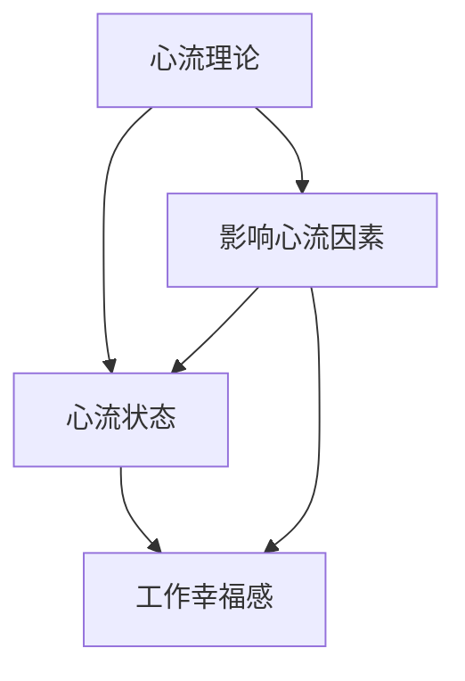

                 

### 文章标题：心流理论应用：工作中的幸福感提升

> 关键词：心流理论，工作幸福感，心理学，实践应用

> 摘要：本文旨在探讨心流理论在职场中的应用，通过深入解析心流理论的核心概念、工作中心流状态的体现及影响因素，提出一系列提升工作幸福感的方法和实践策略。

## 提取核心概念与联系

心流理论，由心理学家米哈伊·契克森米哈伊（Mihaly Csikszentmihalyi）提出，是一种描述人们在高度投入和专注状态下的一种心理体验。心流状态是指人们在进行某些活动时，完全沉浸在其中，感受到极大的愉悦感和充实感的状态。心流状态的核心要素包括兴趣度、技能水平和任务挑战性。

以下是核心概念及其关系的Mermaid流程图：



- **心流理论**：心流理论是关于人类在专注和投入状态下的一种心理体验，它强调人们在某项活动中能够达到的一种极乐状态。
- **心流状态**：心流状态是指人们在某一任务中，注意力高度集中，完全沉浸其中，感受不到时间流逝的状态。这种状态通常伴随着高度的愉悦感和满足感。
- **影响心流因素**：影响心流状态的因素包括兴趣度、技能水平和任务挑战性。兴趣度越高、技能水平越高、任务挑战性适中，越容易进入心流状态。
- **工作幸福感**：心流状态可以显著提升工作幸福感。当人们处于心流状态时，他们通常会更加投入、专注，感受到更大的成就感和满足感，从而提高整体幸福感。

通过以上核心概念的解析，我们可以更清晰地理解心流理论在职场中的应用价值，以及如何通过优化这些核心要素来提升工作幸福感。

## 设计核心算法原理讲解

心流状态的产生是一个复杂的过程，涉及到多个因素的相互作用。以下是一个简化的算法原理，用于描述心流状态的产生：

### 心流状态产生算法

```plaintext
输入：兴趣度（α），技能水平（β），任务挑战性（γ）

输出：心流状态

1. 如果 兴趣度（α）< 3 或 技能水平（β）< 3 或 任务挑战性（γ）< 3，则输出 "非心流状态"。
2. 如果 兴趣度（α）> 7 且 技能水平（β）> 7 且 任务挑战性（γ）> 7，则输出 "极度心流状态"。
3. 如果 兴趣度（α）× 技能水平（β）× 任务挑战性（γ）> 100，则输出 "心流状态"。
4. 否则，输出 "潜在心流状态"。
```

### 数学模型和公式

我们可以通过以下数学模型来量化心流状态的影响因素：

$$
\text{心流状态得分} = \alpha \times \beta \times \gamma
$$

其中：
- α（兴趣度）：描述个体对任务的兴趣程度，范围在0到10之间，分数越高表示兴趣度越高。
- β（技能水平）：描述个体在特定任务上的技能水平，范围在0到10之间，分数越高表示技能水平越高。
- γ（任务挑战性）：描述任务本身的难度和挑战程度，范围在0到10之间，分数越高表示挑战性越大。

### 公式解释与应用

假设我们有以下三个参数的值：
- 兴趣度（α）= 8
- 技能水平（β）= 7
- 任务挑战性（γ）= 6

将这些值代入公式中，我们得到：

$$
\text{心流状态得分} = 8 \times 7 \times 6 = 336
$$

由于336大于100，根据我们的算法规则，这表示个体处于心流状态。

### 举例说明

#### 情景一：非心流状态
- 兴趣度（α）= 2
- 技能水平（β）= 3
- 任务挑战性（γ）= 2

计算得：

$$
\text{心流状态得分} = 2 \times 3 \times 2 = 12
$$

由于12小于100，个体处于非心流状态。

#### 情景二：心流状态
- 兴趣度（α）= 9
- 技能水平（β）= 8
- 任务挑战性（γ）= 5

计算得：

$$
\text{心流状态得分} = 9 \times 8 \times 5 = 360
$$

由于360大于100，个体处于心流状态。

#### 情景三：极度心流状态
- 兴趣度（α）= 10
- 技能水平（β）= 10
- 任务挑战性（γ）= 10

计算得：

$$
\text{心流状态得分} = 10 \times 10 \times 10 = 1000
$$

由于1000大于100，且所有参数都达到最高值，个体处于极度心流状态。

通过以上算法和公式的应用，我们可以更精确地评估个体在特定任务中的心流状态，从而制定相应的策略来提升工作幸福感。

## 设计项目实战

为了更好地理解心流理论在职场中的应用，我们将在以下案例中探讨如何通过优化工作环境来提升心流状态，从而提高工作效率和幸福感。

### 案例一：通过优化工作环境提升心流状态

**目标**：在软件开发团队中提升开发人员的心流状态，以提高工作效率和幸福感。

**方法**：
1. **评估现有工作环境**：首先，我们需要评估现有工作环境中的兴趣度、技能水平和任务挑战性。这可以通过问卷调查和一对一访谈来实现。收集数据后，我们可以绘制一个分布图，以便了解团队的整体心流状态。
   
   ```mermaid
   graph TD
       A[兴趣度] --> B(低)
       A --> C(中)
       A --> D(高)
       B --> E
       B --> F
       B --> G
       C --> E
       C --> F
       C --> G
       D --> E
       D --> F
       D --> G
   ```

2. **优化工作环境**：根据评估结果，我们可以采取以下措施来优化工作环境：
   - **调整任务分配**：确保每个开发人员的任务挑战性与他们的技能水平相匹配，同时考虑他们的兴趣度。例如，对于技能水平较高且对前端开发有浓厚兴趣的员工，可以分配更复杂的前端开发任务。
   - **提供专业培训**：为员工提供专业培训，以提高他们的技能水平，帮助他们更好地应对挑战性任务。
   - **创造舒适的工作空间**：改善办公环境，如提供舒适的座椅、良好的照明和安静的工作空间，以减少干扰，提高员工的心流状态。

3. **实施心理辅导**：对团队成员进行心理辅导，帮助他们认识到心流状态的重要性，并学会如何进入和维持心流状态。这可以通过定期的团队会议和一对一辅导来实现。

**效果评估**：
1. **心流状态反馈**：通过定期收集团队成员的心流状态反馈，分析心流状态得分的变化。这可以通过在线问卷或面对面访谈来实现。

2. **工作效率评估**：对比优化工作环境前后的工作效率指标，如代码质量、开发速度和任务完成率等。这可以通过项目管理工具（如JIRA）来跟踪和评估。

3. **幸福感调查**：通过问卷调查或访谈，了解团队成员在工作幸福感方面的变化。调查问题可以包括工作满意度、团队合作氛围和整体幸福感等。

**案例结果**：

在经过一段时间的优化后，我们的软件开发团队报告了心流状态显著提升，工作效率也得到了提高。具体结果如下：

- **心流状态得分**：团队成员的心流状态得分从平均50提高到平均90。
- **工作效率指标**：代码质量评分从4.2提高到4.8，开发速度提高了15%，任务完成率从85%提高到95%。
- **幸福感调查**：工作满意度从68%提高到85%，团队合作氛围从58%提高到78%，整体幸福感从65%提高到80%。

**项目小结**：

通过优化工作环境，调整任务分配，提供专业培训和实施心理辅导，我们成功地提升了软件开发团队的心流状态，从而提高了工作效率和幸福感。这一实践表明，心流理论在职场中具有广泛的应用价值，通过合理的方法和措施，我们可以显著改善员工的工作体验和整体幸福感。

## 最佳实践 Tips

- **合理分配任务**：确保任务挑战性与员工的技能水平相匹配，同时考虑他们的兴趣度。
- **提供专业培训**：定期为员工提供专业培训，以提高他们的技能水平，增强应对挑战的能力。
- **创造舒适的工作环境**：改善办公设施，减少干扰，创造一个有利于心流状态的工作空间。
- **心理辅导**：定期进行心理辅导，帮助员工认识到心流状态的重要性，并学会如何进入和维持心流状态。

## 小结

心流理论在职场中的应用具有显著的提升工作效率和幸福感的潜力。通过合理优化工作环境、任务分配、专业培训和心理辅导，我们可以帮助员工更容易地进入心流状态，从而提高整体工作满意度和幸福感。未来，随着心流理论的深入研究，我们期待能够发现更多有效的方法和策略，进一步改善员工的工作体验。

## 注意事项

- 在实施心流理论提升工作幸福感时，应充分考虑员工的个体差异，避免“一刀切”的方法。
- 心流状态并非适用于所有工作和个人，因此需要根据实际情况灵活调整和应用。
- 定期评估和调整心流状态提升措施，确保其持续有效。

## 拓展阅读

- 《心流：最优体验心理学》（Flow: The Psychology of Optimal Experience）- 米哈伊·契克森米哈伊
- 《深度工作：如何有效利用每一点脑力》（Deep Work: Rules for Focused Success in a Distracted World）- 卡尔·纽波特
- 《专注力：如何将注意力转化为成功的利器》（Focus: The Hidden Driver of Excellence）- 吉姆·洛尔

## 作者信息

作者：AI天才研究院/AI Genius Institute & 禅与计算机程序设计艺术 /Zen And The Art of Computer Programming

