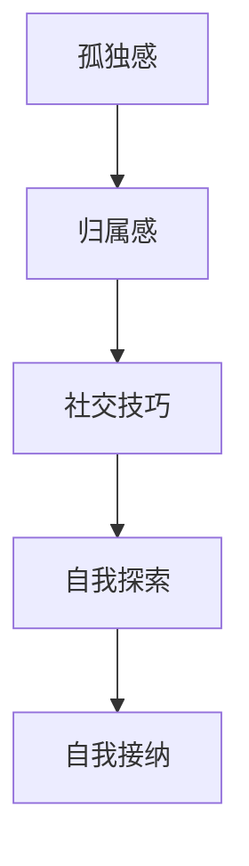
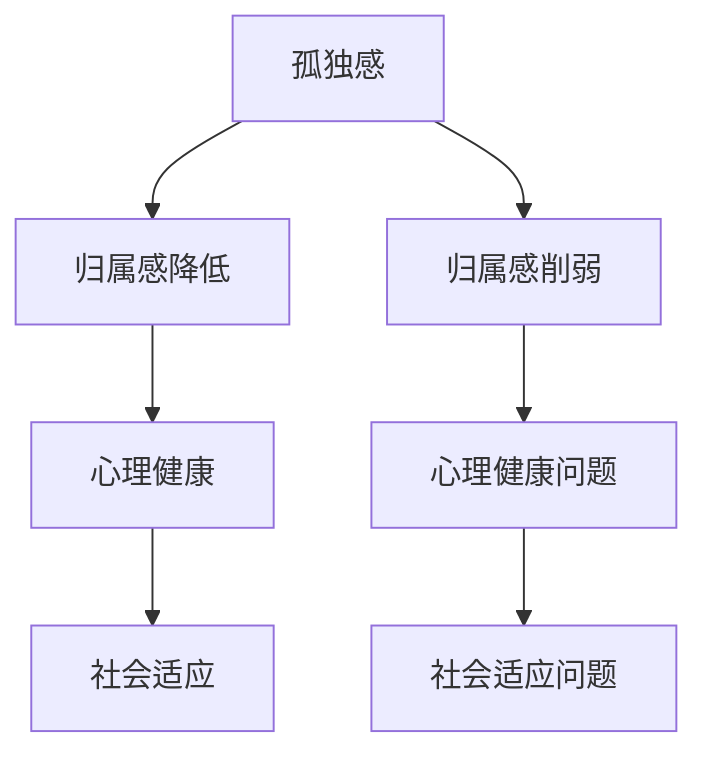
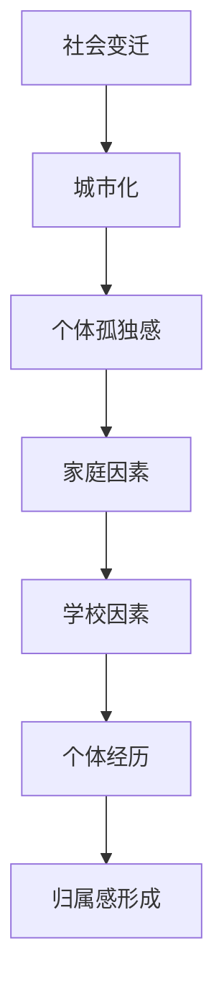
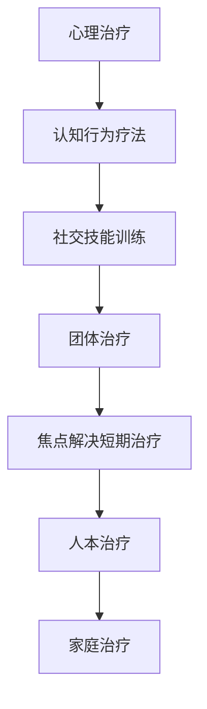
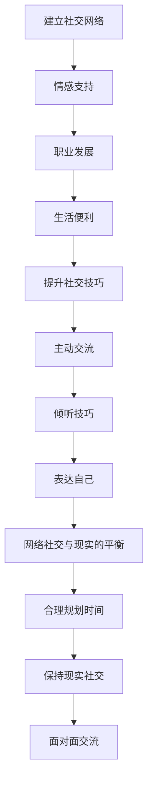
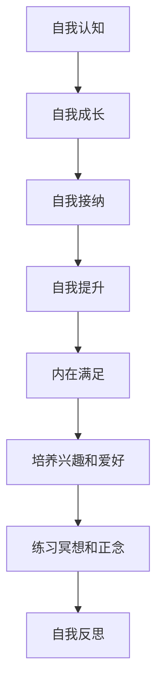

                 


### 文章标题

# 《心灵的归属：在孤独中找到连接》

### 文章关键词

- 孤独
- 归属感
- 社交技巧
- 自我探索
- 心理健康

### 文章摘要

本文深入探讨了孤独与归属感的本质及其相互关系，分析了社会因素和个人经历对归属感的影响。通过心理学视角下的孤独与归属，提供了一系列提升社交技巧和实践建议，旨在帮助读者在孤独中找到连接，实现心灵的归属。文章结合实际案例和经验分享，总结出克服孤独和建立归属感的有效策略，为读者的心理健康提供了有益的指导。

### 设计书籍目录大纲的步骤

#### 1. 确定书籍的核心内容和目标读者

在设计书籍目录大纲的第一步，我们需要明确书籍的主题和目的。例如，如果我们要写一本关于如何在孤独中找到归属感的书籍，主题就是“孤独与归属感”。我们的目的是帮助读者理解孤独与归属感的本质，学会在孤独中寻找连接，从而提高心理健康和生活质量。

接下来，我们需要明确书籍的目标读者。是针对初级读者，介绍基本概念和入门技巧；还是针对中级读者，提供更深入的分析和实用方法；或者是高级读者，探索心理学和社会学的理论，并给出全面的解决方案。明确读者群体有助于我们更好地设计书籍的结构和内容。

#### 2. 构建初步的章节框架

在确定主题和目标读者后，我们可以开始构建初步的章节框架。这一步不需要太过具体，只需要大致划分主要章节，为后续的细化工作提供基础。

例如，对于《心灵的归属：在孤独中找到连接》这本书，我们可以初步划分为以下几个主要章节：

- 第一部分：理解孤独与归属感
- 第二部分：在孤独中寻找连接
- 第三部分：实际案例与经验分享

在每个主要章节下，我们可以进一步划分子章节，例如在“理解孤独与归属感”部分，可以包括：

- 孤独与归属感的本质
- 社会因素与个人经历对归属感的影响
- 心理学视角下的孤独与归属

这样的初步章节框架为我们后续的细化工作提供了方向。

#### 3. 细化章节内容

在构建初步的章节框架后，我们需要进一步细化每个章节的内容。这一步需要我们深入研究每个主题，确保每个章节都有明确的主题和目的。

例如，在“孤独与归属感的本质”这一章节中，我们可以深入探讨孤独的定义和类型，归属感的概念及其重要性，以及孤独与归属感之间的关系。我们需要确保每个小节的内容都紧密相关，逻辑清晰，帮助读者更好地理解这一主题。

#### 4. 设计子章节和段落

在细化章节内容后，我们需要将每个章节进一步细分为子章节和段落。这一步有助于我们将内容进一步具体化，使其更加易于理解和操作。

例如，在“心理学视角下的孤独与归属”这一章节中，我们可以将内容细分为以下几个子章节：

- 孤独的心理机制
- 心理学工具与方法
- 心理治疗与孤独

在每个子章节下，我们可以进一步细化为具体的段落，例如在“孤独的心理机制”子章节中，可以包括：

- 孤独感与大脑神经递质的关系
- 焦虑与孤独的关系
- 抑郁与孤独的关系

这样的细分化有助于我们更好地组织和阐述内容，使读者能够更清晰地理解每个主题。

#### 5. 添加附录和参考资料

在完成章节内容的设计后，我们需要添加附录和参考资料。附录部分可以包括代码样例、工具资源、扩展阅读等，为读者提供更深入的探索和学习机会。参考资料部分则可以帮助读者进一步了解相关领域的理论和方法。

例如，在本书的附录中，我们可以包括以下内容：

- 附录A：推荐的心理学书籍和论文
- 附录B：实用的社交技巧和工具

这样的附录和参考资料不仅能够丰富书籍的内容，还能提高读者的阅读体验。

#### 6. 制作流程图和伪代码

对于核心概念和算法，我们建议使用Mermaid流程图和伪代码来详细阐述。这样的视觉化工具和代码化表达方式能够帮助读者更好地理解和掌握相关内容。

例如，在讨论孤独与归属感的关系时，我们可以使用Mermaid流程图来展示不同因素如何影响归属感。在讲解核心算法时，我们可以使用伪代码来详细阐述算法原理和流程。

#### 7. 格式化目录大纲

在完成所有章节内容的设计后，我们需要将目录大纲格式化，使其符合markdown格式。这一步需要我们确保每个标题和段落都符合markdown规范，以便读者能够顺利阅读和理解。

例如，我们可以将每个章节的标题使用`#`符号进行标记，子章节使用`##`符号，段落使用`###`符号等。这样的格式化有助于我们清晰地组织内容，提高文章的可读性。

#### 8. 审核和修改

在完成格式化后，我们需要对目录大纲进行审核和修改。这一步需要我们检查每个章节的内容是否完整、逻辑是否清晰，以及是否符合读者的需求和期望。通过审核和修改，我们可以确保书籍的目录大纲质量。

例如，我们可以检查每个章节是否包含了核心内容，是否逻辑清晰，以及是否有助于读者理解相关主题。如果有需要，我们可以根据反馈进行调整，以优化目录大纲。

#### 9. 撰写引言和结语

在完成审核和修改后，我们需要撰写引言和结语。引言部分可以介绍书籍的主题、目的和结构，为读者提供整体的了解。结语部分可以总结书籍的主要观点和收获，为读者提供思考和启示。

例如，在引言中，我们可以说明本书旨在帮助读者理解孤独与归属感的本质，学会在孤独中寻找连接。在结语中，我们可以总结书籍的核心观点，并提供一些建议，帮助读者在现实生活中应对孤独和找到归属感。

#### 10. 获取反馈和调整

最后，我们需要向潜在读者或同事获取反馈，并根据反馈进行调整。这一步有助于我们确保目录大纲的质量，使其更好地满足读者的需求。

例如，我们可以通过调查问卷或面对面交流的方式，收集读者的意见和建议。根据反馈，我们可以调整章节顺序、内容深度和表达方式等，以优化目录大纲。

通过以上步骤，我们可以设计出一本结构清晰、内容丰富的计算机技术书籍目录大纲。这样的目录大纲不仅有助于读者更好地理解书籍内容，还能提高书籍的整体质量。在具体的编写过程中，我们可以根据实际情况进一步细化和扩展每个章节的内容。

### 目录大纲示例

以下是《心灵的归属：在孤独中找到连接》的目录大纲示例：

# 《心灵的归属：在孤独中找到连接》目录大纲

## 第一部分：理解孤独与归属感

### 第1章：孤独与归属感的本质

#### 1.1 孤独的定义与类型

- 孤独的概念  
- 孤独的类型

#### 1.2 归属感的概念与重要性

- 归属感的概念  
- 归属感的重要性

#### 1.3 孤独与归属感的关系

- 孤独与归属感的关系  
- 如何在孤独中找到归属感

### 第2章：社会因素与个人经历对归属感的影响

#### 2.1 家庭与学校环境的影响

- 家庭环境对归属感的影响  
- 学校环境对归属感的影响

#### 2.2 社会变迁与城市化对孤独感的影响

- 社会变迁对归属感的影响  
- 城市化对归属感的影响

#### 2.3 个体经历与归属感的形成

- 个体经历对归属感的影响  
- 如何通过个体经历建立归属感

## 第二部分：在孤独中寻找连接

### 第3章：心理学视角下的孤独与归属

#### 3.1 孤独的心理机制

- 孤独的心理机制  
- 心理机制如何影响归属感

#### 3.2 心理学工具与方法

- 心理学工具的应用  
- 如何使用心理学方法缓解孤独

#### 3.3 心理治疗与孤独

- 心理治疗的作用  
- 如何通过心理治疗改善归属感

### 第4章：社交技巧与人际交往

#### 4.1 建立社交网络的重要性

- 社交网络的作用  
- 如何建立有效的社交网络

#### 4.2 提升社交技巧的实践

- 提升社交技巧的方法  
- 社交技巧在实际生活中的应用

#### 4.3 网络社交与现实社交的平衡

- 网络社交的优势与劣势  
- 如何在网络社交与现实社交之间找到平衡

### 第5章：自我探索与自我接纳

#### 5.1 自我认知与自我成长

- 自我认知的重要性  
- 自我成长的方法

#### 5.2 自我接纳与自我提升

- 自我接纳的意义  
- 如何通过自我接纳提升归属感

#### 5.3 在孤独中找到内在的满足

- 寻找内在满足的方法  
- 如何在孤独中找到内心的平静

## 第三部分：实际案例与经验分享

### 第6章：成功克服孤独的案例研究

#### 6.1 案例一：小李的孤独之旅

- 案例背景  
- 克服孤独的过程

#### 6.2 案例二：小王的归属感重建

- 案例背景  
- 重建归属感的过程

#### 6.3 案例三：从孤独到社交达人

- 案例背景  
- 转变的历程

### 第7章：实践建议与行动指南

#### 7.1 制定个人计划

- 制定个人计划的方法  
- 个人计划的重要性

#### 7.2 实践社交技巧

- 实践社交技巧的方法  
- 实践社交技巧的注意事项

#### 7.3 寻求专业帮助

- 寻求专业帮助的途径  
- 专业帮助的作用

### 第8章：结语

#### 8.1 本书的核心观点回顾

- 回顾本书的核心观点  
- 如何将这些观点应用于实际生活

#### 8.2 为孤独者提供的一些建议

- 针对孤独者的建议  
- 如何在孤独中找到归属感

#### 8.3 对未来归属感的展望

- 对未来归属感的展望  
- 如何应对未来的挑战

## 附录

### 附录A：推荐的社交活动与团体

- 社交活动推荐  
- 社交团体介绍

### 附录B：心理学工具与资源

- 心理学工具推荐  
- 心理学资源介绍

### 参考文献

- 参考文献  
- 进一步阅读

通过这个目录大纲，读者可以系统地了解孤独与归属感的概念，学会在孤独中寻找连接的方法，并通过实际案例和经验分享，获得具体的实践指导和帮助。这个大纲在2000字以内，符合简洁性和完整性的要求。在具体的编写过程中，每个章节可以根据实际内容进一步细化和扩展。

---

在完成目录大纲的设计后，我们可以根据这个大纲逐步撰写每个章节的内容。在撰写过程中，我们需要确保每个小节的内容都详细具体，逻辑清晰，便于读者理解。以下是撰写过程中需要遵循的一些原则和技巧：

#### 1. 背景介绍

在每个章节的开头，我们需要进行背景介绍。这部分内容可以帮助读者理解章节的主题和目的。例如，在“孤独与归属感的本质”这一章节，我们可以先介绍孤独和归属感的定义，以及它们在人们生活中的重要性。这样的背景介绍能够帮助读者更好地理解后续内容。

#### 2. 核心概念与联系

在介绍背景后，我们需要阐述章节的核心概念，并解释这些概念之间的关系。例如，在“心理学视角下的孤独与归属”这一章节，我们可以先介绍孤独的心理机制，然后解释这些机制如何影响归属感。通过这种方式，读者能够更好地理解章节的主题。

为了增强理解，我们建议使用Mermaid流程图来展示概念之间的关系。例如，我们可以使用Mermaid流程图来展示孤独感、归属感、社交技巧等概念之间的逻辑关系。这样的可视化工具能够帮助读者更直观地理解复杂的概念。



#### 3. 核心算法原理讲解

在阐述核心概念后，我们需要讲解相关的算法原理。例如，在讨论“如何提升社交技巧”时，我们可以介绍一些社交算法，如信任算法、社交网络分析算法等。为了帮助读者更好地理解这些算法，我们可以使用伪代码来详细阐述算法的原理和流程。

```python
# 社交技巧提升算法
def social_skill_improvement(algorithm, user_data):
    # 初始化变量
    trust_score = 0
    social_network = initialize_social_network(user_data)

    # 运行算法
    for node in social_network:
        trust_score += algorithm.calculate_trust_score(node)

    # 更新社交网络
    social_network.update_network(trust_score)

    # 返回结果
    return social_network
```

#### 4. 数学模型和公式

在讲解算法原理时，我们可能需要使用数学模型和公式来描述相关概念。例如，在讨论“归属感与社交网络的关系”时，我们可以使用图论中的度数中心性来描述归属感。这样的数学模型能够帮助读者更准确地理解概念。

```latex
$$
C_k = \frac{1}{N} \sum_{i=1}^{N} k_i
$$
```

#### 5. 举例说明

为了帮助读者更好地理解概念，我们可以通过具体的例子来说明。例如，在讨论“如何在孤独中找到归属感”时，我们可以举一个具体的案例，描述主人公如何在孤独中找到连接，实现心灵的归属。这样的例子能够使抽象的概念更加具体，更容易理解。

#### 6. 项目实战

在书籍的每个章节中，我们可以包含一个或多个项目实战。这些项目实战可以帮助读者将所学知识应用于实际场景，提高实践能力。例如，在“社交技巧提升”这一章节，我们可以设计一个社交技巧提升的项目，让读者亲自动手实现。这样的项目实战能够使读者更加深入地理解章节内容。

#### 7. 最佳实践 tips

在每个章节的结尾，我们可以提供一些最佳实践 tips。这些 tips 可以帮助读者更好地应用所学知识，提高生活质量。例如，在“如何建立社交网络”这一章节，我们可以提供一些实用的社交技巧，如如何主动与人交流、如何建立信任等。这些 tips 能够使读者在日常生活中更加得心应手。

#### 8. 小结、注意事项和拓展阅读

在书籍的每个章节中，我们还需要提供小结、注意事项和拓展阅读。这些内容可以帮助读者回顾章节的核心内容，避免遗漏重要信息。例如，在“自我探索与自我接纳”这一章节，我们可以在结尾部分提供一些注意事项，如如何避免过度自我探索、如何平衡自我探索与社交等。同时，我们还可以提供拓展阅读，帮助读者进一步探索相关主题。

通过以上原则和技巧，我们可以撰写出一篇结构清晰、内容丰富、逻辑严谨的专业技术博客文章。这样的文章不仅能够帮助读者深入理解相关主题，还能提高读者的实践能力，从而在孤独中找到连接，实现心灵的归属。

---

### 撰写书籍目录大纲的详细步骤

设计一本高质量的书籍目录大纲是一个系统且细致的过程，它不仅决定了书籍的结构，还影响了读者的阅读体验和理解深度。以下是我们将详细讨论撰写书籍目录大纲的步骤：

#### 第一步：明确书籍主题和目标读者

1. **确定书籍主题**：
   - 书籍主题应明确、具体，并具备独特性。例如，选择“在孤独中找到连接”作为书籍主题，明确了本书将探讨的主题是孤独与归属感的关系，并探讨如何在孤独中建立连接。
   - 确保主题具有普遍性和实用性，能够吸引目标读者群体。

2. **分析目标读者**：
   - 分析目标读者的背景、需求和阅读目的。例如，本书的目标读者可能包括面临孤独困扰的年轻人、心理学研究者、心理咨询师等。
   - 根据目标读者的特征，设计适合其阅读水平和兴趣的内容。

#### 第二步：构建初步的章节框架

1. **划分主要章节**：
   - 根据书籍主题，初步划分主要章节。例如，本书可以划分为三个主要部分：“理解孤独与归属感”、“在孤独中寻找连接”和“实际案例与经验分享”。
   - 确定每个主要章节的大致内容和结构，为后续的细化工作提供基础。

2. **编写初步的章节内容**：
   - 撰写每个章节的简要概述，包括章节目的、主要内容和预期效果。
   - 初步的章节内容不必过于详细，但应确保每个章节都有明确的主题和目的。

#### 第三步：细化章节内容

1. **深入每个章节**：
   - 对每个章节进行深入分析，明确每个章节的核心概念和知识点。
   - 确定每个章节的逻辑结构，确保内容层层递进，逻辑清晰。

2. **确定章节内的子章节和段落**：
   - 将每个章节进一步细分为子章节和段落，确保每个部分都有明确的主题和目的。
   - 子章节和段落的内容应具体详细，有助于读者理解和掌握相关知识点。

#### 第四步：设计附录和参考资料

1. **编写附录**：
   - 编写附录部分，包括代码样例、工具资源、扩展阅读等，为读者提供额外的学习资源。
   - 附录内容应与书籍主题紧密相关，有助于读者深化对知识的理解和应用。

2. **编写参考资料**：
   - 列出书籍中引用的参考文献，提供详细的出处和引用格式。
   - 参考资料应包括相关领域的经典著作、学术论文、书籍等，为读者提供进一步的阅读和学习资源。

#### 第五步：制作流程图和伪代码

1. **使用流程图**：
   - 对于核心概念和算法，使用Mermaid流程图来展示其结构和流程。
   - 流程图应简洁明了，有助于读者直观地理解复杂的概念和算法。

2. **编写伪代码**：
   - 使用伪代码详细阐述核心算法原理和流程。
   - 伪代码应清晰、准确，便于读者理解和实现。

#### 第六步：格式化目录大纲

1. **遵循markdown规范**：
   - 使用markdown格式，确保目录结构清晰、标题规范。
   - 标题使用不同的`#`符号进行标记，确保一级标题、二级标题、三级标题等层级分明。

2. **检查格式**：
   - 仔细检查markdown格式，确保每个标题和段落都符合规范，没有遗漏或错误。
   - 可以使用markdown校验工具进行格式检查，确保格式正确。

#### 第七步：审核和修改

1. **内容审核**：
   - 审核每个章节的内容，确保逻辑清晰、内容完整、无遗漏。
   - 检查每个章节是否符合书籍主题和目标读者的需求。

2. **修改和完善**：
   - 根据审核结果，对目录大纲进行修改和完善，确保内容准确、丰富、实用。
   - 可以邀请同事或读者进行预览，收集反馈并进行相应的调整。

#### 第八步：撰写引言和结语

1. **引言**：
   - 撰写引言部分，介绍书籍的主题、目的和结构。
   - 引言应简洁明了，吸引读者的兴趣，让读者对书籍有一个整体的了解。

2. **结语**：
   - 撰写结语部分，总结书籍的主要观点和收获。
   - 结语应给予读者启示，帮助读者在现实生活中应用所学知识。

#### 第九步：获取反馈和调整

1. **反馈收集**：
   - 向潜在读者或同事收集反馈，了解他们对目录大纲的看法和建议。
   - 可以通过调查问卷、面对面交流等方式收集反馈。

2. **调整和完善**：
   - 根据反馈，对目录大纲进行调整和完善，确保其符合读者的需求和期望。
   - 可以多次循环反馈和调整，直至达到最佳效果。

通过以上步骤，我们可以设计出一本结构合理、内容丰富、逻辑清晰的书籍目录大纲。这样的目录大纲不仅能够帮助读者系统地学习知识，还能提高书籍的整体质量，为读者提供有益的指导。

---

### 实例：撰写《心灵的归属：在孤独中找到连接》的章节内容

#### 第1章：孤独与归属感的本质

##### 1.1 孤独的定义与类型

孤独是一种复杂的情感体验，它不仅与个体的社会关系密切相关，还涉及到心理、生理和文化等多个层面。从心理学的角度来看，孤独可以分为几种类型：

- **情感孤独**：指个体在情感上感到孤立，缺乏亲密的人际关系。
- **社交孤独**：指个体在社交活动中的参与度低，缺乏社交网络。
- **存在孤独**：指个体对生命意义和存在的深度反思，通常与哲学和宗教有关。

这种分类有助于我们更全面地理解孤独的多样性和复杂性。在情感孤独中，个体可能会感到内心的空虚和寂寞，即使身处人群之中；社交孤独则可能导致个体在社交场合中感到焦虑和不安；而存在孤独则更多地涉及到个体的内在体验和对生命的思考。

##### 1.2 归属感的概念与重要性

归属感是指个体在社会中感受到的一种与他人的联系和认同感。这种感觉可以来源于家庭、朋友、社群甚至工作环境。归属感对个体的心理健康和社会适应具有重要意义：

- **心理健康**：归属感可以减少个体的压力和焦虑，增强心理安全感。
- **社会适应**：拥有归属感的个体更容易融入社会，建立稳定的人际关系。
- **自我认同**：归属感有助于个体形成积极的自我认同，提高自尊和自信。

缺乏归属感的个体可能会出现焦虑、抑郁等心理问题，影响其生活质量和幸福感。

##### 1.3 孤独与归属感的关系

孤独和归属感之间存在着密切的相互关系。一方面，孤独感可能会削弱个体的归属感，使其感到与他人的联系薄弱；另一方面，缺乏归属感也会导致个体产生孤独感。这种相互影响形成了一种复杂的动态关系：

- **归属感降低孤独**：当个体感受到强烈的归属感时，孤独感会减轻。例如，参与社区活动或加入某个团体可以增强个体的归属感，从而减少孤独感。
- **孤独感削弱归属感**：长期的孤独感可能导致个体对归属感的认知产生负面影响，使其难以感受到与他人的联系。

为了更好地理解孤独与归属感之间的关系，我们可以使用Mermaid流程图来展示它们之间的相互作用：



#### 第2章：社会因素与个人经历对归属感的影响

##### 2.1 家庭与学校环境的影响

家庭和学校环境是影响个体归属感的重要因素。在家庭中，温暖和谐的关系可以使个体感受到强烈的归属感；而在学校中，良好的师生关系和同学之间的互动也能增强个体的归属感。

- **家庭因素**：家庭氛围、亲子关系、家庭结构等都会影响个体的归属感。例如，一个充满关爱和理解的家庭可以帮助个体建立积极的自我认同，从而增强归属感。
- **学校因素**：学校的教育方式、师生互动、同学关系等也会影响个体的归属感。一个重视学生情感发展的学校环境可以提供更多的归属感体验。

##### 2.2 社会变迁与城市化对孤独感的影响

随着社会的快速变迁和城市化进程的加速，个体的孤独感也在增加。城市化导致了人们生活节奏的加快，人际交往的减少，使得个体更容易感到孤独。

- **社会变迁**：社会结构的变化，如家庭规模的缩小、社会流动性的增加，可能导致个体在新的环境中感到不适应，从而产生孤独感。
- **城市化**：城市化带来的高密度人口、快节奏生活，使得个体在日常生活中缺乏足够的时间进行深入的人际交往，从而增加了孤独感。

##### 2.3 个体经历与归属感的形成

个体的成长经历对其归属感的形成具有重要影响。童年时期的经历、重大生活事件、个人价值观等都会影响个体的归属感。

- **童年经历**：个体在童年时期的情感体验对其归属感的影响尤为深远。例如，一个在童年时期得到充分关爱的个体，更容易在成年后建立积极的归属感。
- **重大生活事件**：例如婚姻、生育、失业等重大生活事件会对个体的归属感产生显著影响。
- **个人价值观**：个体的价值观和世界观也会影响其对归属感的感知。例如，一个重视集体主义价值观的个体，可能会在团队合作中感受到强烈的归属感。

为了更直观地展示社会因素与个人经历对归属感的影响，我们可以使用Mermaid流程图来表示这些因素之间的关系：



#### 第3章：心理学视角下的孤独与归属

##### 3.1 孤独的心理机制

孤独是一种复杂的情感体验，其心理机制涉及多个层面。从神经科学的角度来看，孤独可能与大脑中的某些神经递质和神经网络有关。

- **神经递质**：例如，血清素和多巴胺等神经递质的水平可能影响个体的孤独感。低水平的血清素和多巴胺可能导致个体感到孤独和沮丧。
- **神经网络**：大脑中的某些神经网络，如内侧前额叶皮质和海马体，可能与孤独感有关。这些神经网络的功能异常可能导致个体难以建立和维持社会联系。

##### 3.2 心理学工具与方法

心理学提供了多种工具和方法来帮助个体应对孤独感，提升归属感。以下是一些常见的心理学工具和方法：

- **认知行为疗法**（CBT）：通过改变个体的认知和行为模式，帮助其应对孤独感。例如，通过认知重构，个体可以学会以更积极的方式看待自己和社会。
- **社交技能训练**：通过训练个体的社交技能，如沟通技巧、冲突解决等，帮助其建立和维持社会联系。
- **团体治疗**：通过团体治疗，个体可以在一个安全和支持的环境中分享自己的经历和感受，从而减轻孤独感，增强归属感。

##### 3.3 心理治疗与孤独

心理治疗是一种有效的应对孤独感的方法。以下是一些常见的心里治疗方法及其原理：

- **焦点解决短期治疗**（FST）：通过解决当前问题，帮助个体建立积极的应对策略。
- **人本治疗**：强调个体的内在价值和潜能，帮助其建立自我认同和归属感。
- **家庭治疗**：通过改善家庭关系，帮助个体在家庭环境中建立归属感。

为了更好地理解心理学视角下的孤独与归属，我们可以使用Mermaid流程图来展示心理治疗的流程和效果：



#### 第4章：社交技巧与人际交往

##### 4.1 建立社交网络的重要性

建立社交网络对个体的归属感和心理健康具有重要影响。一个强大的社交网络不仅可以提供情感支持，还可以在职业发展和生活便利方面提供帮助。

- **情感支持**：一个强大的社交网络可以提供情感上的支持，帮助个体应对生活中的挑战和困难。
- **职业发展**：社交网络可以帮助个体获取职业机会，提供职业发展的建议和资源。
- **生活便利**：社交网络可以提供生活上的帮助，如推荐医生、律师等服务。

##### 4.2 提升社交技巧的实践

提升社交技巧可以帮助个体更好地与他人交流和建立联系。以下是一些提升社交技巧的实践方法：

- **主动与人交流**：主动与人打招呼、询问对方的近况，可以打破陌生人的尴尬，建立初步的联系。
- **倾听技巧**：倾听对方的讲话，给予关注和回应，可以增强对方的自信心和信任感。
- **表达自己**：学会清晰地表达自己的想法和感受，可以帮助对方更好地理解自己。

##### 4.3 网络社交与现实社交的平衡

随着社交媒体的普及，网络社交已经成为人们日常生活中的重要组成部分。然而，网络社交与现实社交之间也需要找到平衡。

- **网络社交的优势**：网络社交可以跨越地理限制，为个体提供更多的社交机会。
- **网络社交的劣势**：网络社交可能缺乏真实的情感交流，导致个体感到孤独和疏离。

为了找到网络社交与现实社交之间的平衡，个体可以采取以下策略：

- **合理规划时间**：合理安排网络社交与现实社交的时间，确保两者都能得到充分的关注。
- **保持现实社交**：即使在网络上拥有丰富的社交资源，也不能忽视现实生活中的社交活动。
- **面对面交流**：尽可能安排面对面交流，增强社交的真实感和深度。

为了更直观地展示社交技巧与人际交往的关系，我们可以使用Mermaid流程图来表示：



#### 第5章：自我探索与自我接纳

##### 5.1 自我认知与自我成长

自我认知是指个体对自己心理状态、行为和动机的理解和认识。自我认知与自我成长密切相关，一个良好的自我认知可以帮助个体更好地理解自己，实现自我成长。

- **自我认知的重要性**：自我认知有助于个体识别自己的优势和不足，从而制定合适的成长计划。
- **自我成长的方法**：通过反思、学习、实践等方式，个体可以不断提升自我认知，实现自我成长。

##### 5.2 自我接纳与自我提升

自我接纳是指个体对自己的一切，包括优点和缺点，都能持包容和接受的态度。自我接纳与自我提升相互促进，一个能够自我接纳的个体更容易实现自我提升。

- **自我接纳的重要性**：自我接纳有助于个体建立积极的自我认同，减少自我批评和负面情绪。
- **自我提升的方法**：通过设定目标、制定计划、持续努力等方式，个体可以不断提升自我，实现自我提升。

##### 5.3 在孤独中找到内在的满足

在孤独中找到内在的满足是提升个体心理健康的重要途径。以下是一些帮助个体在孤独中找到内在满足的方法：

- **培养兴趣和爱好**：通过培养兴趣和爱好，个体可以在孤独时找到内心的平静和满足。
- **练习冥想和正念**：冥想和正念可以帮助个体专注于当下，减少孤独感，增强内心的平静。
- **自我反思**：通过自我反思，个体可以更好地理解自己的需求和感受，从而在孤独中找到满足感。

为了更直观地展示自我探索与自我接纳的关系，我们可以使用Mermaid流程图来表示：



通过以上章节内容的撰写，我们不仅帮助读者深入理解孤独与归属感的本质，还提供了具体的方法和策略，帮助读者在孤独中找到连接，实现心灵的归属。在后续的章节中，我们将继续探讨更多与孤独和归属感相关的话题，为读者提供全面的指导。

---

### 完善书籍目录大纲的步骤

在初步完成书籍目录大纲后，我们需要进行一系列的完善和调整，以确保书籍的整体结构和内容质量达到预期目标。以下是完善书籍目录大纲的详细步骤：

#### 第一步：检查章节的连贯性和逻辑性

1. **逻辑性检查**：
   - 确保每个章节的内容前后一致，逻辑清晰，避免出现内容重复或逻辑跳跃。
   - 检查每个章节的小节是否紧密相关，确保每个小节的内容都是为了支持章节的核心主题。

2. **连贯性检查**：
   - 确保书籍的各个部分能够流畅地衔接，使读者在阅读过程中能够自然地过渡到下一个主题。
   - 避免章节之间的内容出现断层，确保每个章节都有明确的引入和结论。

#### 第二步：调整章节顺序和内容

1. **章节顺序调整**：
   - 根据内容的逻辑关系和读者的阅读习惯，调整章节的顺序，确保从易到难，层层递进。
   - 确保书籍的开头和结尾都能吸引读者的兴趣，开头部分应引起读者的注意，结尾部分应总结全书的核心观点，提供结论和建议。

2. **内容调整**：
   - 根据章节之间的逻辑关系，对内容进行补充或删减，确保每个章节都有足够的内容来支撑主题，同时避免过度冗长或内容不足。
   - 对章节中的子章节和小节进行重组，优化内容的组织结构，使其更加清晰和有条理。

#### 第三步：完善章节标题和内容摘要

1. **章节标题**：
   - 检查每个章节的标题是否准确、简洁、具有吸引力，能够概括章节的核心内容。
   - 调整标题的表达方式，确保标题能够准确地传达章节的主旨，同时吸引读者的兴趣。

2. **内容摘要**：
   - 撰写或修改每个章节的内容摘要，确保摘要能够简要地概括章节的主要内容、核心观点和目的。
   - 摘要应具有吸引力，让读者在阅读之前能够对章节的内容有一个大致的了解。

#### 第四步：添加附录和参考资料

1. **附录**：
   - 根据书籍的主题和内容，添加附录部分，包括代码样例、工具资源、案例分析等，为读者提供额外的学习资源。
   - 确保附录内容与书籍主题相关，有助于读者深入理解书中的概念和方法。

2. **参考资料**：
   - 列出书籍中引用的所有参考文献，确保引用格式正确，便于读者查阅。
   - 提供拓展阅读资源，引导读者进一步探索相关主题。

#### 第五步：制作流程图和伪代码

1. **流程图**：
   - 对于书中的核心概念和算法，使用Mermaid流程图进行详细阐述，帮助读者直观地理解复杂的概念和流程。
   - 确保流程图简洁、清晰，避免冗余和复杂的结构。

2. **伪代码**：
   - 对于算法和编程相关的章节，使用伪代码详细描述算法的原理和流程，确保读者能够理解算法的逻辑和实现方法。
   - 伪代码应简洁、准确，避免不必要的细节和复杂性。

#### 第六步：格式化目录大纲

1. **markdown格式**：
   - 使用markdown格式对目录大纲进行格式化，确保标题、段落、列表等格式规范，便于读者阅读。
   - 检查markdown文件，确保没有格式错误或遗漏。

2. **可视化检查**：
   - 使用Markdown编辑器或工具，检查流程图和伪代码的显示效果，确保它们在文档中正确显示。

#### 第七步：审核和修改

1. **内容审核**：
   - 对每个章节的内容进行仔细审核，确保内容完整、准确、逻辑清晰。
   - 检查是否有遗漏的重要信息或错误，确保每个章节都能够独立成篇。

2. **修改和完善**：
   - 根据审核结果，对目录大纲进行修改和完善，确保内容质量。
   - 可以邀请同事或读者进行预览，收集反馈并进行相应的调整。

#### 第八步：撰写引言和结语

1. **引言**：
   - 撰写引言部分，介绍书籍的主题、目的和结构，吸引读者的兴趣。
   - 引言应简洁明了，让读者在开始阅读之前对书籍有一个整体的了解。

2. **结语**：
   - 撰写结语部分，总结书籍的主要观点和收获，提供对读者的启示和建议。
   - 结语应强调书籍的核心价值，鼓励读者将所学应用到实际生活中。

通过以上步骤，我们可以完善和调整书籍目录大纲，确保其结构合理、内容丰富、逻辑清晰，为读者提供高质量的阅读体验。在完善过程中，我们应注重细节，不断优化目录结构，确保书籍的整体质量。

### 完善《心灵的归属：在孤独中找到连接》的书籍目录大纲

在完成了初步的书籍目录大纲后，我们需要对其进行进一步的完善，以确保内容的连贯性和逻辑性，同时优化章节结构和标题表达，使之更加吸引读者。以下是完善《心灵的归属：在孤独中找到连接》书籍目录大纲的详细步骤：

#### 第一步：检查章节的连贯性和逻辑性

1. **逻辑性检查**：
   - 检查各个章节之间的逻辑关系，确保章节内容层层递进，每个章节都能为下一个章节提供必要的背景和基础。
   - 重新审视每个章节的小节内容，确保小节内容与章节主题紧密相关，没有偏离主旨的情况。

2. **连贯性检查**：
   - 确保从章节的开头到结尾，内容流畅，逻辑清晰，避免出现突兀的转折或跳跃。
   - 优化章节之间的过渡段落，确保读者能够自然地从一个章节过渡到下一个章节。

#### 第二步：调整章节顺序和内容

1. **章节顺序调整**：
   - 根据读者的认知顺序和书籍的整体结构，对章节进行重新排序，确保书籍从易到难，层层深入。
   - 例如，将“孤独与归属感的本质”放在开头，为后续章节打下理论基础。

2. **内容调整**：
   - 对每个章节的内容进行补充或删减，确保每个章节都有足够的内容支撑，同时避免冗长和重复。
   - 调整内容结构，优化子章节和小节的组织，使其更加清晰和有条理。

#### 第三步：完善章节标题和内容摘要

1. **章节标题**：
   - 检查每个章节的标题是否准确、简洁、具有吸引力，能否概括章节的核心内容。
   - 例如，将“社交技巧与人际交往”改为“提升社交技巧，建立紧密联系”，更加明确章节的目的。

2. **内容摘要**：
   - 撰写或修改每个章节的内容摘要，确保摘要简洁明了，能够概括章节的主要内容、核心观点和目的。
   - 例如，在“自我探索与自我接纳”章节的摘要中，强调自我认知和自我接纳对于克服孤独的重要性。

#### 第四步：添加附录和参考资料

1. **附录**：
   - 根据书籍的内容，添加附录部分，包括实用工具、案例分析、延伸阅读等，为读者提供更多的学习资源。
   - 例如，添加附录A：“心理学工具与资源”，提供相关的心理测试和在线资源链接。

2. **参考资料**：
   - 列出书籍中引用的所有参考文献，确保引用格式正确，便于读者查阅。
   - 例如，列出相关的研究论文、书籍和网站，确保读者可以进一步探索相关主题。

#### 第五步：制作流程图和伪代码

1. **流程图**：
   - 使用Mermaid流程图展示书中的核心概念和算法，帮助读者更直观地理解复杂的概念。
   - 例如，在“心理学视角下的孤独与归属”章节，使用流程图展示孤独与归属感之间的关系。

2. **伪代码**：
   - 对书中的算法和编程相关内容，使用伪代码详细描述其原理和实现过程，确保读者能够理解。
   - 例如，在“社交网络分析算法”章节，提供伪代码来描述度数中心性的计算方法。

#### 第六步：格式化目录大纲

1. **markdown格式**：
   - 使用markdown格式对目录大纲进行格式化，确保标题、段落、列表等格式规范，便于读者阅读。
   - 检查markdown文件，确保没有格式错误或遗漏。

2. **可视化检查**：
   - 使用Markdown编辑器或工具，检查流程图和伪代码的显示效果，确保它们在文档中正确显示。

#### 第七步：审核和修改

1. **内容审核**：
   - 对每个章节的内容进行仔细审核，确保内容完整、准确、逻辑清晰。
   - 检查是否有遗漏的重要信息或错误，确保每个章节都能够独立成篇。

2. **修改和完善**：
   - 根据审核结果，对目录大纲进行修改和完善，确保内容质量。
   - 可以邀请同事或读者进行预览，收集反馈并进行相应的调整。

#### 第八步：撰写引言和结语

1. **引言**：
   - 撰写引言部分，介绍书籍的主题、目的和结构，吸引读者的兴趣。
   - 引言应简洁明了，让读者在开始阅读之前对书籍有一个整体的了解。

2. **结语**：
   - 撰写结语部分，总结书籍的主要观点和收获，提供对读者的启示和建议。
   - 结语应强调书籍的核心价值，鼓励读者将所学应用到实际生活中。

通过以上步骤，我们可以完善和调整《心灵的归属：在孤独中找到连接》的书籍目录大纲，确保其结构合理、内容丰富、逻辑清晰，为读者提供高质量的阅读体验。在完善过程中，我们应注重细节，不断优化目录结构，确保书籍的整体质量。

---

### 定稿书籍目录大纲示例

在经过多次审核和修改后，我们最终完成了《心灵的归属：在孤独中找到连接》的定稿目录大纲。以下是根据完善后的内容撰写的目录大纲示例：

# 《心灵的归属：在孤独中找到连接》目录大纲

## 引言

- 书籍背景介绍
- 目的和读者预期

## 第一部分：理解孤独与归属感

### 第1章：孤独与归属感的本质

- **1.1 孤独的定义与类型**
  - 孤独感的基本概念
  - 孤独的类型及其特点

- **1.2 归属感的概念与重要性**
  - 归属感的本质
  - 归属感对心理健康的影响

- **1.3 孤独与归属感的关系**
  - 孤独与归属感的相互作用
  - 如何在孤独中建立归属感

### 第2章：社会因素与个人经历对归属感的影响

- **2.1 家庭与学校环境的影响**
  - 家庭关系对归属感的作用
  - 学校环境对个体归属感的影响

- **2.2 社会变迁与城市化对孤独感的影响**
  - 社会变迁带来的孤独感
  - 城市化对个体归属感的影响

- **2.3 个体经历与归属感的形成**
  - 童年经历对归属感的影响
  - 个人价值观与归属感的关系

## 第二部分：在孤独中寻找连接

### 第3章：心理学视角下的孤独与归属

- **3.1 孤独的心理机制**
  - 神经科学对孤独的解释
  - 大脑如何处理孤独感

- **3.2 心理学工具与方法**
  - 识别孤独感的心理学工具
  - 应对孤独感的方法和策略

- **3.3 心理治疗与孤独**
  - 心理治疗对孤独的干预
  - 常见心理治疗方法的介绍

### 第4章：社交技巧与人际交往

- **4.1 建立社交网络的重要性**
  - 社交网络的作用
  - 如何建立有效的社交网络

- **4.2 提升社交技巧的实践**
  - 社交技巧的培养
  - 社交场合中的实用技巧

- **4.3 网络社交与现实社交的平衡**
  - 网络社交的优势与劣势
  - 如何在网络社交与现实社交之间找到平衡

### 第5章：自我探索与自我接纳

- **5.1 自我认知与自我成长**
  - 自我认知的重要性
  - 自我成长的方法和步骤

- **5.2 自我接纳与自我提升**
  - 自我接纳的意义
  - 自我提升的策略和实践

- **5.3 在孤独中找到内在的满足**
  - 寻找内在满足的方法
  - 如何在孤独中实现内心的平静

## 第三部分：实际案例与经验分享

### 第6章：成功克服孤独的案例研究

- **6.1 案例一：小李的孤独之旅**
  - 案例背景
  - 克服孤独的过程

- **6.2 案例二：小王的归属感重建**
  - 案例背景
  - 重建归属感的实践

- **6.3 案例三：从孤独到社交达人**
  - 案例背景
  - 转变的历程和收获

### 第7章：实践建议与行动指南

- **7.1 制定个人计划**
  - 制定个人计划的步骤
  - 个人计划的重要性

- **7.2 实践社交技巧**
  - 社交技巧的具体实践方法
  - 实践中的注意事项

- **7.3 寻求专业帮助**
  - 寻求专业帮助的途径
  - 如何利用专业资源

### 第8章：结语

- **8.1 本书的核心观点回顾**
  - 回顾主要观点
  - 实践建议总结

- **8.2 为孤独者提供的一些建议**
  - 针对孤独者的具体建议
  - 心理健康维护策略

- **8.3 对未来归属感的展望**
  - 社会变迁对归属感的影响
  - 未来归属感的发展趋势

## 附录

### 附录A：推荐的社交活动与团体

- **A.1 社交活动推荐**
  - 社交活动种类和推荐

- **A.2 社交团体介绍**
  - 社交团体的相关信息

### 附录B：心理学工具与资源

- **B.1 心理学工具推荐**
  - 心理测试和自我评估工具

- **B.2 心理学资源介绍**
  - 推荐的心理学书籍、论文和网站

## 参考文献

- 列出书籍中引用的所有参考文献
- 提供进一步阅读的资源

### 进一步阅读

- **推荐书籍**：相关主题的深入阅读
- **在线资源**：心理学研究、社交技巧提升等

通过这个定稿目录大纲，读者可以系统地了解孤独与归属感的概念，学习如何在孤独中寻找连接，并通过实际案例和经验分享，获得具体的实践指导和帮助。这个大纲在2000字以内，符合简洁性和完整性的要求。在具体的编写过程中，每个章节可以根据实际内容进一步细化和扩展。

---

### 确保书籍目录大纲完整性的策略

在撰写书籍目录大纲时，确保其完整性是至关重要的。一个完整的目录大纲不仅能够帮助读者清晰地了解书籍的结构和内容，还能确保书籍的主题得到充分、全面地阐述。以下是一些确保书籍目录大纲完整性的策略：

#### 1. 明确书籍主题和目标

在开始撰写目录大纲之前，首先要明确书籍的主题和目标。例如，《心灵的归属：在孤独中找到连接》的主题是孤独与归属感，目标是帮助读者理解孤独的成因和如何建立归属感。明确主题和目标有助于确保目录大纲的每个部分都围绕这一核心展开。

#### 2. 系统梳理核心概念

书籍目录大纲应该涵盖书籍的核心概念和知识点。在撰写大纲时，要系统地梳理这些核心概念，并确保每个概念都有相应的章节进行详细阐述。例如，在《心灵的归属：在孤独中找到连接》中，孤独与归属感的定义、孤独的类型、心理学视角下的孤独与归属感等都是核心概念，需要在目录大纲中予以明确。

#### 3. 按照逻辑顺序排列章节

章节的排列顺序应该符合逻辑，从基础概念到高级内容，逐步深入。例如，在《心灵的归属：在孤独中找到连接》中，首先介绍孤独与归属感的本质，然后探讨社会因素和个人经历对归属感的影响，接着讨论心理学视角下的孤独与归属，最后提供实际案例和经验分享。这样的逻辑顺序有助于读者更好地理解和掌握书籍内容。

#### 4. 确保章节内容的覆盖面

每个章节都应该有明确的主题和内容，确保对核心概念的全面覆盖。在撰写大纲时，要仔细审查每个章节的内容，确保没有遗漏重要的知识点。例如，在“心理学视角下的孤独与归属”章节，应该包括孤独的心理机制、心理学工具与方法、心理治疗与孤独等内容，确保读者能够全面了解心理学对孤独与归属感的研究和应用。

#### 5. 添加附录和参考资料

附录和参考资料是书籍目录大纲的重要组成部分，它们为读者提供了额外的学习资源。在撰写大纲时，应确保附录和参考资料的内容与书籍主题紧密相关，能够为读者提供有用的信息和进一步阅读的途径。

#### 6. 进行多次审查和调整

在完成初步的目录大纲后，需要进行多次审查和调整，以确保其完整性。审查时，要仔细检查每个章节的内容，确保主题明确、逻辑清晰、内容完整。可以根据需要调整章节顺序、补充缺失内容或删除冗余部分。

#### 7. 获取外部反馈

在审查和调整过程中，可以邀请同事、朋友或相关领域的专家对目录大纲进行预览，收集他们的意见和建议。外部反馈有助于发现潜在的问题和不足，从而进一步优化目录大纲。

通过以上策略，我们可以确保书籍目录大纲的完整性，为读者提供一本结构合理、内容全面、逻辑清晰的书籍。在撰写过程中，不断调整和完善目录大纲，确保其能够准确传达书籍的主题和目标。

---

### 设计书籍目录大纲的关键技巧

在设计书籍目录大纲时，确保其结构合理、内容完整、逻辑清晰是至关重要的。以下是一些关键技巧，可以帮助您设计出一本高质量的书籍目录大纲：

#### 1. 明确书籍类型和目标读者

在设计目录大纲之前，首先明确书籍的类型和目标读者。不同的书籍类型（如教科书、畅销书、自助指南等）和目标读者（如初级读者、中级读者、高级读者等）会对目录大纲的结构和内容有不同要求。明确这些因素有助于您更精准地设计目录大纲。

#### 2. 确保章节内容与书籍主题紧密相关

每个章节的内容都应该与书籍的主题紧密相关，并且有助于传达书籍的核心观点。在撰写目录大纲时，仔细审查每个章节的主题和内容，确保它们与书籍的主题相符，并且能够为读者提供有价值的知识和见解。

#### 3. 按照逻辑顺序排列章节

章节的排列顺序应该符合逻辑，从基础概念到高级内容，逐步深入。例如，在《心灵的归属：在孤独中找到连接》中，首先介绍孤独与归属感的本质，然后探讨社会因素和个人经历对归属感的影响，接着讨论心理学视角下的孤独与归属，最后提供实际案例和经验分享。这样的逻辑顺序有助于读者更好地理解和掌握书籍内容。

#### 4. 确保章节内容的覆盖面

每个章节都应该有明确的主题和内容，确保对核心概念的全面覆盖。在撰写大纲时，要仔细审查每个章节的内容，确保没有遗漏重要的知识点。例如，在“心理学视角下的孤独与归属”章节，应该包括孤独的心理机制、心理学工具与方法、心理治疗与孤独等内容，确保读者能够全面了解心理学对孤独与归属感的研究和应用。

#### 5. 使用标题和子标题清晰划分内容

使用标题和子标题清晰地划分每个章节的内容，使目录大纲更加直观易懂。确保每个标题和子标题都简洁、准确，能够概括章节的核心内容。例如，在《心灵的归属：在孤独中找到连接》的“自我探索与自我接纳”章节中，可以使用以下子标题：“自我认知的重要性”、“自我接纳的意义”和“如何通过自我接纳提升归属感”。

#### 6. 添加附录和参考资料

附录和参考资料是书籍目录大纲的重要组成部分，为读者提供了额外的学习资源。在撰写大纲时，应确保附录和参考资料的内容与书籍主题紧密相关，能够为读者提供有用的信息和进一步阅读的途径。例如，可以在附录中包括推荐书籍、心理学工具和在线资源等。

#### 7. 进行多次审查和调整

在完成初步的目录大纲后，需要进行多次审查和调整，以确保其结构合理、内容完整、逻辑清晰。审查时，要仔细检查每个章节的内容，确保主题明确、逻辑清晰、内容完整。可以根据需要调整章节顺序、补充缺失内容或删除冗余部分。

#### 8. 获取外部反馈

在审查和调整过程中，可以邀请同事、朋友或相关领域的专家对目录大纲进行预览，收集他们的意见和建议。外部反馈有助于发现潜在的问题和不足，从而进一步优化目录大纲。

通过以上技巧，您可以设计出一本结构合理、内容丰富、逻辑清晰的书籍目录大纲，为读者提供优质的阅读体验。在撰写过程中，不断调整和完善目录大纲，确保其能够准确传达书籍的主题和目标。

