                 

## 《心灵的成长：从虚无到充实的转变过程》

### 关键词

- 心灵成长
- 转变过程
- 积极心态
- 人际关系
- 心理健康
- 生活质量

### 摘要

在现代社会中，许多人感到自己的生活缺乏意义，心灵陷入虚无与空虚。本文将从无聊与空虚的根源、自我认知的觉醒、心灵的探索、积极心态的培养、人际关系的建立与心理健康等方面，探讨心灵的成长过程。通过寻找生命的意义、实现自我价值以及提升生活质量，最终实现从虚无到充实的转变。

## 第一部分：虚无的觉醒

### 1.1 无聊与空虚的根源

#### 1.1.1 现代社会的无聊现象

在现代社会中，许多人感到无聊。这种现象不仅存在于年轻人中，也存在于中老年人中。无聊的原因有很多，例如工作压力大、缺乏兴趣和激情、生活单调乏味等。这些问题往往导致人们感到心灵空虚。

#### 1.1.2 空虚感的心理机制

空虚感源于自我认同的缺失。当一个人对自己的生活、工作、人际关系等感到不满意时，就会产生空虚感。此外，现代社会快节奏的生活方式，也使人们难以真正地放松和享受生活，从而加剧了空虚感。

#### 1.1.3 超越无聊与空虚的初步尝试

要超越无聊与空虚，首先需要认识到问题的存在。接下来，可以尝试以下方法：1）寻找兴趣爱好，充实自己的业余生活；2）培养积极心态，关注生活中的美好；3）进行自我反思，了解自己的需求和期望。

### 1.2 自我认知的觉醒

#### 1.2.1 自我认知的重要性

自我认知是心灵成长的基础。了解自己的性格、兴趣、价值观等，有助于我们更好地规划人生，找到自己的位置。

#### 1.2.2 如何进行自我反思

进行自我反思，可以从以下几个方面入手：1）回顾过去，分析自己的成功与失败；2）审视自己的行为和决策，了解自己的动机；3）与他人交流，听取他人的意见和建议。

#### 1.2.3 自我认知的工具与方法

为了更好地进行自我反思，可以使用以下工具和方法：1）心理测量工具，如MBTI、DISC等；2）日记，记录自己的感受和思考；3）心理咨询，寻求专业人士的帮助。

### 1.3 心灵的探索

#### 1.3.1 内心的矛盾与冲突

在心灵的探索过程中，我们常常会遇到内心的矛盾与冲突。这些冲突源于我们的价值观、信念和现实之间的冲突。

#### 1.3.2 情绪的觉察与调节

学会觉察自己的情绪，是心灵成长的重要一步。通过情绪调节技巧，如呼吸冥想、情绪释放等方法，可以帮助我们更好地处理情绪。

#### 1.3.3 心灵成长的路径

心灵成长的路径因人而异，但通常包括以下阶段：1）自我认知，了解自己；2）情绪调节，处理情绪；3）价值观的建立，明确人生目标；4）行动实践，将理念付诸实践。

## 第二部分：心灵的成长

### 2.1 培养积极心态

#### 2.1.1 积极心态的力量

积极心态对我们的生活有着重要的影响。它可以帮助我们更好地应对挑战，保持心理健康。

#### 2.1.2 如何培养积极心态

培养积极心态的方法包括：1）关注积极的事物，如美好的人际关系、成功的经历等；2）保持乐观的态度，相信自己能够克服困难；3）学会感恩，珍惜身边的美好。

#### 2.1.3 积极心态的应用场景

积极心态可以在各个场景中得到应用，如工作中面对压力、生活中应对挑战、人际关系中处理冲突等。

### 2.2 建立人际关系的桥梁

#### 2.2.1 人际关系的重要性

人际关系对我们的生活有着重要的影响。良好的关系可以带来支持、鼓励和快乐。

#### 2.2.2 人际关系的建立与维护

建立人际关系的关键在于真诚和沟通。我们需要学会倾听、表达自己的想法和感受，以及尊重他人的观点。

#### 2.2.3 人际冲突的处理策略

在人际关系中，冲突是不可避免的。处理冲突的策略包括：1）保持冷静，避免情绪化；2）坦诚沟通，表达自己的需求和感受；3）寻求妥协，寻找双方都能接受的解决方案。

### 2.3 心理健康与自我调适

#### 2.3.1 心理健康的定义与标准

心理健康是指个体在心理上保持良好状态，能够有效应对生活中的各种挑战。

#### 2.3.2 常见心理问题的识别与处理

常见心理问题包括焦虑、抑郁、强迫症等。识别和处理这些问题的方法包括：1）了解自己的情绪，寻求专业帮助；2）学习心理调适技巧，如冥想、放松训练等；3）建立良好的生活习惯，如规律作息、健康饮食等。

#### 2.3.3 自我调适的方法与技巧

自我调适的方法包括：1）心理测量工具，如自我评估问卷；2）心理咨询，寻求专业人士的帮助；3）心理自助工具，如心理书籍、APP等。

## 第三部分：充实的转变

### 3.1 寻找生命的意义

#### 3.1.1 生命的意义与价值观

生命的意义源于我们的价值观。价值观是指我们对于什么是有价值的事情的看法。

#### 3.1.2 寻找生命意义的路径

寻找生命意义的路径包括：1）审视自己的价值观，明确自己的人生目标；2）探索自己的兴趣和爱好，找到自己的热情所在；3）参与社会活动，为他人和社会做出贡献。

#### 3.1.3 为生命赋予意义的方法

为生命赋予意义的方法包括：1）设定短期和长期目标，实现自我价值；2）保持好奇心，不断学习和成长；3）与他人分享经验，传递正能量。

### 3.2 实现自我价值的实践

#### 3.2.1 自我价值的定义与认知

自我价值是指个体对于自己的认同和尊重。

#### 3.2.2 自我价值实现的策略

实现自我价值的策略包括：1）明确自己的优势和特长，发挥自己的潜力；2）建立积极的人际关系，获得他人的认可和支持；3）勇于承担责任，面对挑战。

#### 3.2.3 实现自我价值的案例分析

通过案例分享，我们可以看到，实现自我价值的关键在于找到自己的热情所在，并将其付诸实践。

### 3.3 生活质量的提升

#### 3.3.1 生活质量的多维度评价

生活质量可以从身心健康、家庭关系、职业发展、经济状况等多个维度进行评价。

#### 3.3.2 提升生活质量的实践方法

提升生活质量的实践方法包括：1）关注身心健康，如锻炼身体、保持良好的作息习惯；2）改善家庭关系，如增进亲子关系、维护夫妻关系；3）提升职业素养，如学习新技能、争取更好的职业发展机会；4）增加经济收入，如投资理财、创业等。

#### 3.3.3 生活质量提升的案例分析

通过案例分享，我们可以看到，提升生活质量的关键在于找到自己的需求，并付诸实践。

## 附录

### A.1 心灵成长资源推荐

#### A.1.1 书籍推荐

- 《活出生命的意义》（维克多·弗兰克）
- 《当下的力量》（埃克哈特·托勒）

#### A.1.2 影视作品推荐

- 《肖申克的救赎》
- 《阿甘正传》

#### A.1.3 心理咨询资源推荐

- 心理咨询机构名录
- 心理咨询热线

### A.2 心灵成长实用工具

#### A.2.1 心理测量工具

- MBTI
- DISC

#### A.2.2 心理辅导工具

- 日记
- 心理测试

#### A.2.3 心理自助工具

- 心理书籍
- 心理APP

## 作者信息

作者：AI天才研究院/AI Genius Institute & 禅与计算机程序设计艺术 /Zen And The Art of Computer Programming

### 总结

本文从虚无的觉醒、心灵的成长、充实的转变三个方面，探讨了心灵的成长过程。通过培养积极心态、建立人际关系、关注心理健康，我们可以逐步实现从虚无到充实的转变。在寻找生命的意义、实现自我价值和提升生活质量的过程中，我们能够找到属于自己的心灵家园。愿每个人都能在心灵的成长之路上，找到属于自己的光明。  

文章标题：《心灵的成长：从虚无到充实的转变过程》

关键词：心灵成长、转变过程、积极心态、人际关系、心理健康、生活质量

摘要：本文通过探讨无聊与空虚的根源、自我认知的觉醒、心灵的探索等方面，详细阐述了心灵的成长过程。同时，从培养积极心态、建立人际关系、关注心理健康等角度，探讨了如何实现从虚无到充实的转变。最后，本文提出了寻找生命的意义、实现自我价值以及提升生活质量的实践方法，为读者提供了心灵成长的具体指导。

### 目录大纲

## 第一部分：虚无的觉醒

### 1.1 无聊与空虚的根源

#### 1.1.1 现代社会的无聊现象

**核心概念与联系：**

- **无聊现象**：现代社会中，由于工作、生活压力，以及缺乏兴趣和激情，许多人感到无聊。
- **空虚感**：无聊感加剧了空虚感，源于自我认同的缺失。

**Mermaid 流程图：**

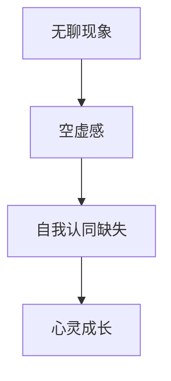

**核心算法原理讲解：**

- 无聊现象的产生原因：工作压力、生活单调、缺乏兴趣等。
- 空虚感的心理机制：自我认同缺失、价值观模糊等。

**数学模型和公式：**

$$
\text{无聊度} = \text{工作压力} \times \text{生活单调} \times \text{缺乏兴趣}
$$

**举例说明：**

一个长期从事重复性工作的人，由于工作压力较大、生活单调乏味，容易感到无聊和空虚。

### 1.2 自我认知的觉醒

#### 1.2.1 自我认知的重要性

**核心概念与联系：**

- **自我认知**：了解自己的性格、兴趣、价值观等，有助于我们更好地规划人生。
- **心灵成长**：自我认知是心灵成长的基础。

**Mermaid 流程图：**

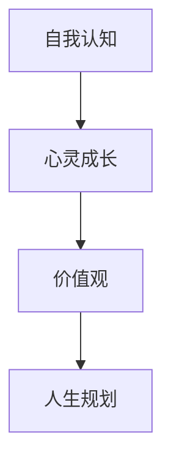

**核心算法原理讲解：**

- 自我认知的重要性：帮助我们了解自己的优势和不足，找到适合自己的发展方向。
- 自我认知的方法：心理测量工具、日记、心理咨询等。

**数学模型和公式：**

$$
\text{自我认知度} = \text{性格识别} + \text{兴趣识别} + \text{价值观识别}
$$

**举例说明：**

通过MBTI测试，一个人可以了解自己的性格类型，从而更好地规划自己的职业生涯。

### 1.3 心灵的探索

#### 1.3.1 内心的矛盾与冲突

**核心概念与联系：**

- **内心矛盾**：源于我们的价值观、信念和现实之间的冲突。
- **心灵成长**：通过解决内心矛盾，实现心灵的成长。

**Mermaid 流程图：**

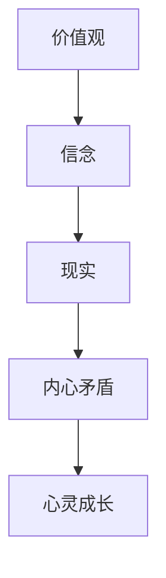

**核心算法原理讲解：**

- 内心矛盾的产生原因：价值观冲突、信念与现实不符等。
- 解决内心矛盾的方法：自我反思、心理咨询等。

**数学模型和公式：**

$$
\text{内心矛盾度} = \text{价值观冲突} + \text{信念与现实不符}
$$

**举例说明：**

一个人在职业选择上，可能面临价值观与现实之间的冲突，通过自我反思和咨询，找到自己的平衡点。

### 1.4 超越无聊与空虚的初步尝试

**核心概念与联系：**

- **超越无聊与空虚**：通过培养兴趣爱好、积极心态，实现心灵的觉醒。

**Mermaid 流程图：**

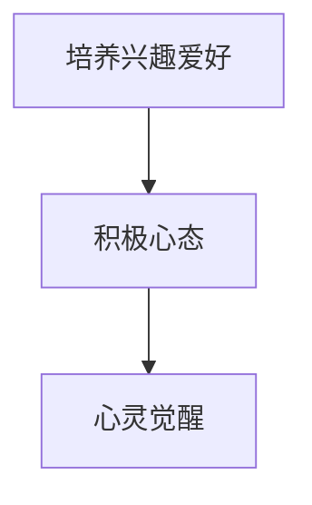

**核心算法原理讲解：**

- 培养兴趣爱好：找到自己感兴趣的事物，充实生活。
- 积极心态：关注生活中的美好，保持乐观。

**数学模型和公式：**

$$
\text{心灵觉醒度} = \text{兴趣爱好度} + \text{积极心态度}
$$

**举例说明：**

一个人通过参加音乐课程，培养了对音乐的兴趣，同时保持积极的心态，从而超越了无聊与空虚。

## 第二部分：心灵的成长

### 2.1 培养积极心态

#### 2.1.1 积极心态的力量

**核心概念与联系：**

- **积极心态**：对生活持积极态度，有助于应对挑战，保持心理健康。

**Mermaid 流程图：**

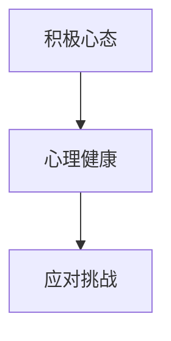

**核心算法原理讲解：**

- 积极心态的力量：增强抗压能力、提高幸福感、促进人际关系。

**数学模型和公式：**

$$
\text{心理健康度} = \text{积极心态度} \times \text{应对挑战度}
$$

**举例说明：**

一个面临工作压力的人，通过保持积极心态，更好地应对了挑战，提高了心理健康水平。

### 2.2 建立人际关系的桥梁

#### 2.2.1 人际关系的重要性

**核心概念与联系：**

- **人际关系**：对生活质量和心理健康具有重要影响。

**Mermaid 流程图：**

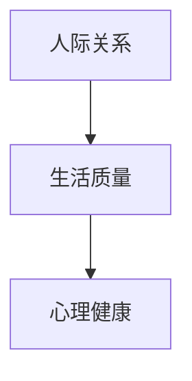

**核心算法原理讲解：**

- 人际关系的重要性：提供支持、鼓励和陪伴。
- 人际关系的建立与维护：真诚、沟通、尊重。

**数学模型和公式：**

$$
\text{生活质量度} = \text{人际关系度} \times \text{心理健康度}
$$

**举例说明：**

一个人通过真诚地与他人沟通，建立了良好的人际关系，从而提高了生活质量和心理健康水平。

### 2.3 心理健康与自我调适

#### 2.3.1 心理健康的定义与标准

**核心概念与联系：**

- **心理健康**：个体在心理上保持良好状态，能够有效应对生活中的各种挑战。

**Mermaid 流程图：**

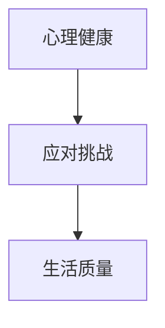

**核心算法原理讲解：**

- 心理健康的定义：心理健康是指个体在心理上保持良好状态，能够有效应对生活中的各种挑战。
- 心理健康的标准：情绪稳定、认知清晰、人际关系良好等。

**数学模型和公式：**

$$
\text{心理健康度} = \text{情绪稳定度} + \text{认知清晰度} + \text{人际关系良好度}
$$

**举例说明：**

一个情绪稳定、认知清晰、人际关系良好的人，具有较高的心理健康水平。

### 2.4 培养积极心态的方法

#### 2.4.1 如何培养积极心态

**核心概念与联系：**

- **培养积极心态**：通过关注积极事物、保持乐观态度，实现心灵的成长。

**Mermaid 流程图：**

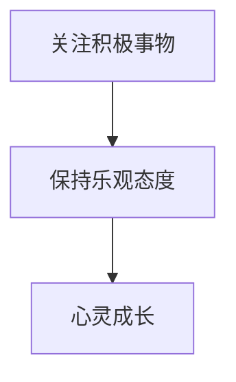

**核心算法原理讲解：**

- 关注积极事物：关注生活中的美好，减少负面情绪。
- 保持乐观态度：相信自己能够克服困难，提高抗压能力。

**数学模型和公式：**

$$
\text{心灵成长度} = \text{关注积极事物度} + \text{保持乐观态度度}
$$

**举例说明：**

一个人通过关注身边的美好事物，保持乐观态度，实现了心灵的成长。

### 2.5 建立人际关系的桥梁

#### 2.5.1 人际关系的重要性

**核心概念与联系：**

- **人际关系**：对生活质量和心理健康具有重要影响。

**Mermaid 流程图：**

**核心算法原理讲解：**

- 人际关系的重要性：提供支持、鼓励和陪伴。
- 人际关系的建立与维护：真诚、沟通、尊重。

**数学模型和公式：**

$$
\text{生活质量度} = \text{人际关系度} \times \text{心理健康度}
$$

**举例说明：**

一个人通过真诚地与他人沟通，建立了良好的人际关系，从而提高了生活质量和心理健康水平。

### 2.6 心理健康与自我调适

#### 2.6.1 心理健康的定义与标准

**核心概念与联系：**

- **心理健康**：个体在心理上保持良好状态，能够有效应对生活中的各种挑战。

**Mermaid 流程图：**

**核心算法原理讲解：**

- 心理健康的定义：心理健康是指个体在心理上保持良好状态，能够有效应对生活中的各种挑战。
- 心理健康的标准：情绪稳定、认知清晰、人际关系良好等。

**数学模型和公式：**

$$
\text{心理健康度} = \text{情绪稳定度} + \text{认知清晰度} + \text{人际关系良好度}
$$

**举例说明：**

一个情绪稳定、认知清晰、人际关系良好的人，具有较高的心理健康水平。

### 2.7 培养积极心态的方法

#### 2.7.1 如何培养积极心态

**核心概念与联系：**

- **培养积极心态**：通过关注积极事物、保持乐观态度，实现心灵的成长。

**Mermaid 流程图：**

**核心算法原理讲解：**

- 关注积极事物：关注生活中的美好，减少负面情绪。
- 保持乐观态度：相信自己能够克服困难，提高抗压能力。

**数学模型和公式：**

$$
\text{心灵成长度} = \text{关注积极事物度} + \text{保持乐观态度度}
$$

**举例说明：**

一个人通过关注身边的美好事物，保持乐观态度，实现了心灵的成长。

## 第三部分：充实的转变

### 3.1 寻找生命的意义

#### 3.1.1 生命的意义与价值观

**核心概念与联系：**

- **生命的意义**：源于我们的价值观。
- **价值观**：我们对于什么是有价值的事情的看法。

**Mermaid 流程图：**

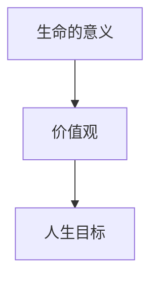

**核心算法原理讲解：**

- 生命的意义：生命的意义源于我们的价值观，是我们对于什么是有价值的事情的看法。
- 价值观：价值观是指我们对于什么是有价值的事情的看法，是我们行为和决策的依据。

**数学模型和公式：**

$$
\text{生命的意义度} = \text{价值观度} + \text{人生目标度}
$$

**举例说明：**

一个人通过明确自己的价值观和人生目标，找到了生命的意义。

### 3.2 实现自我价值的实践

#### 3.2.1 自我价值的定义与认知

**核心概念与联系：**

- **自我价值**：个体对于自己的认同和尊重。
- **认知**：了解自己的优势和特长，发挥自己的潜力。

**Mermaid 流程图：**

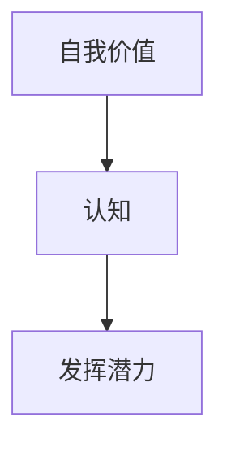

**核心算法原理讲解：**

- 自我价值的定义：自我价值是指个体对于自己的认同和尊重。
- 自我价值的认知：了解自己的优势和特长，发挥自己的潜力。

**数学模型和公式：**

$$
\text{自我价值度} = \text{自我认同度} + \text{发挥潜力度}
$$

**举例说明：**

一个人通过了解自己的优势和特长，找到了自我价值，并付诸实践。

### 3.3 生活质量的提升

#### 3.3.1 生活质量的多维度评价

**核心概念与联系：**

- **生活质量**：身心健康、家庭关系、职业发展、经济状况等多维度评价。

**Mermaid 流程图：**

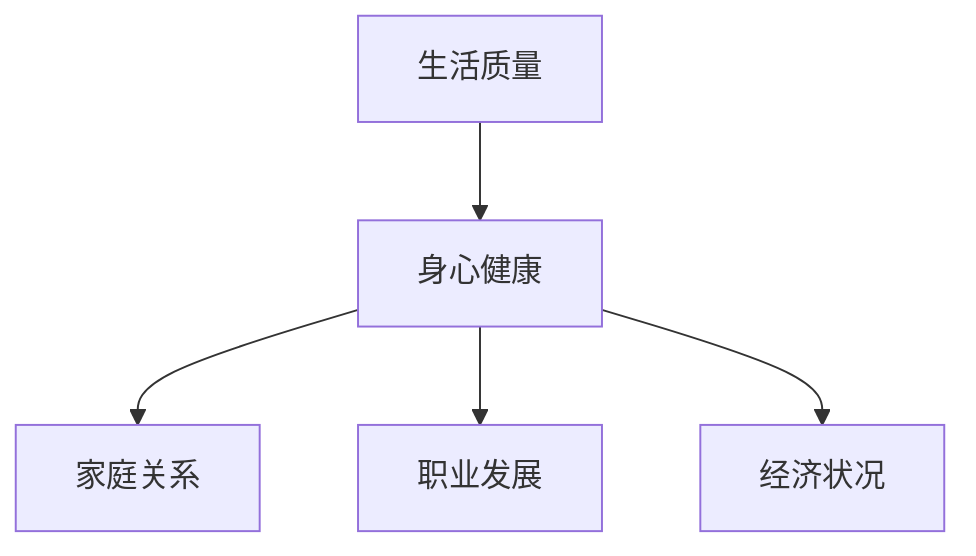

**核心算法原理讲解：**

- 生活质量的多维度评价：从身心健康、家庭关系、职业发展、经济状况等方面进行评价。
- 生活质量提升的方法：关注身心健康、改善家庭关系、提升职业素养、增加经济收入等。

**数学模型和公式：**

$$
\text{生活质量度} = \text{身心健康度} + \text{家庭关系度} + \text{职业发展度} + \text{经济状况度}
$$

**举例说明：**

一个人通过关注身心健康、改善家庭关系、提升职业素养、增加经济收入，提高了生活质量。

## 附录

### A.1 心灵成长资源推荐

#### A.1.1 书籍推荐

**核心概念与联系：**

- **书籍**：提供心灵的滋养和指导。

**Mermaid 流程图：**

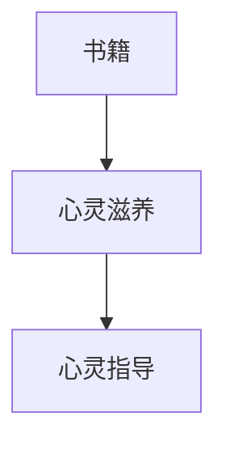

**核心算法原理讲解：**

- 书籍的重要性：提供丰富的知识和经验，帮助我们成长。
- 书籍的选择：根据个人需求和兴趣，选择适合自己的书籍。

**数学模型和公式：**

$$
\text{心灵滋养度} = \text{知识积累度} + \text{经验积累度}
$$

**举例说明：**

通过阅读《当下的力量》，一个人可以学会如何活在当下，提升心灵滋养度。

#### A.1.2 影视作品推荐

**核心概念与联系：**

- **影视作品**：通过故事和情节，传递正能量和人生智慧。

**Mermaid 流程图：**

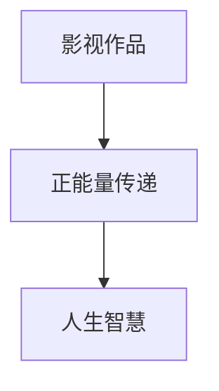

**核心算法原理讲解：**

- 影视作品的作用：通过故事和情节，激发人们的思考，传递正能量和人生智慧。
- 影视作品的选择：根据个人兴趣和需求，选择适合自己的影视作品。

**数学模型和公式：**

$$
\text{正能量传递度} = \text{故事感染力度} + \text{人生智慧度}
$$

**举例说明：**

通过观看《阿甘正传》，一个人可以学会坚持和勇气，提升正能量传递度。

#### A.1.3 心理咨询资源推荐

**核心概念与联系：**

- **心理咨询资源**：提供专业帮助，解决心理问题。

**Mermaid 流程图：**

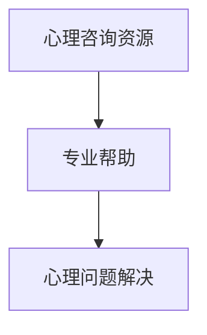

**核心算法原理讲解：**

- 心理咨询资源的作用：提供专业的心理支持和指导，帮助解决心理问题。
- 心理咨询资源的选择：根据个人需求和情况，选择合适的心理咨询资源。

**数学模型和公式：**

$$
\text{心理问题解决度} = \text{专业帮助度} + \text{心理支持度}
$$

**举例说明：**

通过寻求心理咨询师的帮助，一个人可以解决心理困扰，提升心理问题解决度。

### A.2 心灵成长实用工具

#### A.2.1 心理测量工具

**核心概念与联系：**

- **心理测量工具**：用于评估和了解个体的心理状态。

**Mermaid 流程图：**

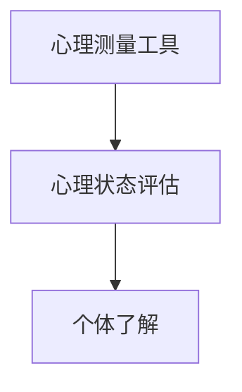

**核心算法原理讲解：**

- 心理测量工具的作用：通过测量和评估，了解个体的心理状态。
- 心理测量工具的选择：根据个人需求和目的，选择合适的心理测量工具。

**数学模型和公式：**

$$
\text{心理状态评估度} = \text{测量准确性度} + \text{个体了解度}
$$

**举例说明：**

通过使用MBTI测试，一个人可以了解自己的性格类型，更好地了解自己。

#### A.2.2 心理辅导工具

**核心概念与联系：**

- **心理辅导工具**：用于帮助个体进行心理调适和成长。

**Mermaid 流程图：**

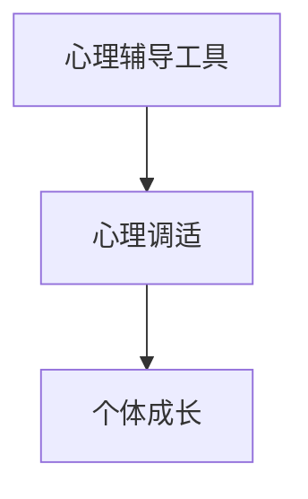

**核心算法原理讲解：**

- 心理辅导工具的作用：通过心理调适和辅导，帮助个体实现心灵成长。
- 心理辅导工具的选择：根据个人需求和情况，选择合适的心

