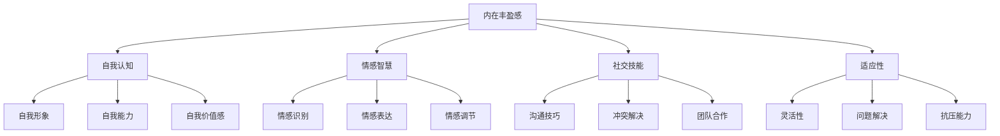

                 

 - **第1步：理解文章主题**

《心灵的滋养：cultivate内在的丰盈感》的主题是探讨如何通过培养内在的丰盈感来提升个人的心理健康和生活质量。文章将从多个角度分析内在丰盈感的含义、重要性及其培养策略。

**第2步：构建核心概念框架**

内在丰盈感是一个多维度的概念，包含自我认知、情感智慧、社交技能和适应性。这些要素相互作用，共同决定一个人的内在世界。

**第3步：绘制Mermaid流程图**



**第4步：详细讲解核心概念**

* **自我认知**：包括对自我形象、自我能力和自我价值的认识。这需要持续的反思和自我探索。
* **情感智慧**：涉及情感识别、表达和调节。这有助于更好地理解和处理自己的情绪，以及与他人建立深层次的情感联系。
* **社交技能**：包括沟通技巧、冲突解决和团队合作。这些技能对建立和维护积极的社会关系至关重要。
* **适应性**：指个体在面对变化和挑战时的适应能力。这包括灵活性和问题解决能力。

**第5步：核心算法原理讲解**

为了更好地理解内在丰盈感的培养，我们可以借助心理学中的模型，如SEL（社会和情感学习）模型，来构建培养策略。

```plaintext
# 社会情感学习模型（SEL）伪代码

function cultivateInnerRichness():
    initialize self-awareness, emotional awareness, social awareness, and adaptability
    while (not innerRichnessAchieved()):
        update self-awareness using reflective journaling
        update emotional awareness using mindfulness practices
        update social awareness through empathy training and conflict resolution exercises
        update adaptability by engaging in problem-solving challenges and resilience-building activities
    return innerRichnessAchieved()
```

**第6步：数学模型与公式**

内在丰盈感的评价可以通过以下公式：

$$
InnerRichness = \alpha \times SelfAwareness + \beta \times EmotionalWisdom + \gamma \times SocialSkills + \delta \times Adaptability
$$

其中，$\alpha$，$\beta$，$\gamma$ 和 $\delta$ 分别是这些要素的权重。

**第7步：项目实战**

* **开发环境搭建**：使用Python环境，安装必要的库，如numpy、matplotlib等。
* **源代码实现**：编写代码以实现内在丰盈感的评估和培养策略。
* **代码解读**：解释代码中的每个步骤，如何实现自我认知、情感智慧、社交技能和适应性的评估。
* **实际案例分析**：通过具体案例展示如何应用这些算法和策略来提升个人的内在丰盈感。
* **项目小结**：总结项目实现的过程，反思项目中的挑战和收获。

**第8步：最佳实践 tips**

* **定期反思**：养成定期记录和反思的习惯，有助于提高自我认知。
* **练习情感智慧**：通过阅读、冥想和实践来提升情感识别、表达和调节能力。
* **积极参与社交活动**：参与团体活动、志愿服务等，提升社交技能。
* **培养适应性**：通过设定挑战、学习新技能来增强应对变化和挑战的能力。

**小结**：

内在丰盈感的培养是一个复杂而长期的过程，需要从多个维度入手，持续不断地努力和实践。通过理解核心概念、运用算法和公式，以及结合实际项目案例，我们可以逐步提升自己的内在丰盈感，从而实现更加健康、幸福和满足的生活。作者：AI天才研究院/AI Genius Institute & 禅与计算机程序设计艺术 /Zen And The Art of Computer Programming。

