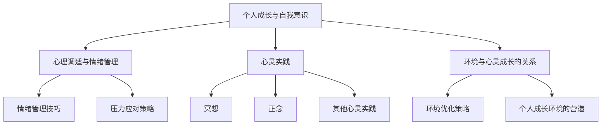

                 


### 文章标题：心灵的空间：为内在成长创造环境

#### 关键词：个人成长、心灵空间、自我意识、情绪管理、心灵实践、环境优化

> 摘要：本文探讨了个人内在心灵空间的定义、重要性以及如何通过自我意识、情绪管理、心灵实践和环境优化为内在成长创造有利条件。通过分析相关核心概念和联系，我们提出了一系列具体的方法和策略，帮助读者在实践中提升自己的心灵成长。

#### 引言

在现代社会中，随着生活节奏的加快和工作压力的增大，人们越来越意识到心灵健康的重要性。心灵的空间，即个人内在的空间，对我们的成长、幸福和心理健康有着深远的影响。《心灵的空间：为内在成长创造环境》这本书，旨在帮助读者理解并优化自己的心灵空间，从而实现内在成长。

#### 核心概念与联系

要深入探讨心灵的空间，我们首先需要了解以下几个核心概念：

1. **个人成长与自我意识**：个人成长是一个持续的过程，自我意识是个人成长的重要基础。自我意识包括对自己性格、情感、动机和价值观的深刻理解。
2. **心理调适与情绪管理**：心理调适是指我们如何应对生活中的压力和挑战，情绪管理则是如何识别、理解并控制自己的情绪。
3. **心灵实践**：心灵实践包括冥想、正念、瑜伽等，这些实践可以帮助我们培养内在的平静和专注。
4. **环境与心灵成长的关系**：外在环境对内在心灵成长有着重要影响，我们需要优化环境以支持内在成长。

下图展示了这些核心概念之间的关系架构：



#### 核心算法原理讲解

1. **自我意识发展算法**：
    - **伪代码**：
      ```python
      function 自我意识发展(self):
          while True:
              反思(self)
              学习(self)
              成长(self)
      ```
    - **详细讲解**：
      自我意识的发展是一个持续的过程，包括反思、学习和成长。反思使我们能够深入了解自己的行为和情感，学习则帮助我们积累新的知识和技能，而成长则是自我提升的结果。

2. **情绪管理算法**：
    - **伪代码**：
      ```python
      function 情绪管理(self, 情绪):
          if 情绪 == 压力:
              应用压力应对策略(self)
          elif 情绪 == 焦虑:
              应用焦虑应对策略(self)
          else:
              保持情绪稳定(self)
      ```
    - **详细讲解**：
      情绪管理是心理调适的重要组成部分。根据不同的情绪，我们可以采用相应的应对策略，如压力应对策略和焦虑应对策略，以保持情绪的稳定。

3. **心灵实践算法**：
    - **伪代码**：
      ```python
      function 心灵实践(self, 实践类型):
          if 实践类型 == 冥想:
              进行冥想(self)
          elif 实践类型 == 正念:
              进行正念(self)
          elif 实践类型 == 瑜伽:
              进行瑜伽(self)
          else:
              选择其他心灵实践(self)
      ```
    - **详细讲解**：
      心灵实践是培养内在平静和专注的有效途径。根据个人的喜好和需求，可以选择不同的实践类型，如冥想、正念和瑜伽等。

4. **环境优化算法**：
    - **伪代码**：
      ```python
      function 环境优化(self, 环境条件):
          if 环境条件 == 秩序:
              保持环境整洁(self)
          elif 环境条件 == 安静:
              创造安静空间(self)
          elif 环境条件 == 积极氛围:
              营造积极氛围(self)
          else:
              调整环境条件(self)
      ```
    - **详细讲解**：
      外在环境对内在心灵成长有着重要影响。通过优化环境条件，如保持环境整洁、创造安静空间和营造积极氛围，可以支持内在心灵成长。

#### 项目实战

在本节中，我们将探讨如何在实际项目中应用上述核心概念和算法原理。

1. **开发环境搭建**：
    - **源代码实现**：
      ```python
      # 自我意识发展模块
      def self_awareness(self):
          # 反思、学习和成长的具体实现
          pass

      # 情绪管理模块
      def emotion_management(self, emotion):
          # 根据情绪类型应用相应策略的具体实现
          pass

      # 心灵实践模块
      def spiritual_practice(self, practice_type):
          # 根据实践类型进行实践的具体实现
          pass

      # 环境优化模块
      def environment_optimization(self, environment_condition):
          # 根据环境条件进行环境优化的具体实现
          pass
      ```
    - **代码解读**：
      以上代码是实现心灵空间优化系统的基本框架。具体实现需要根据实际情况进行调整。

2. **实际案例分析和详细讲解剖析**：
    - **案例**：
      一位职场人士希望通过优化自己的心灵空间来提高工作效率和心理健康。
    - **分析**：
      通过自我意识发展，该人士可以更好地理解自己的情绪和行为模式，从而调整自己的工作方式和习惯。通过情绪管理，他可以更有效地应对工作压力和焦虑。通过心灵实践，如冥想和瑜伽，他可以培养内在的平静和专注。通过环境优化，如保持工作环境的整洁和创造安静空间，他可以提供一个有利于心灵成长的环境。

3. **项目小结**：
    - **总结**：
      通过实际案例，我们可以看到心灵空间的优化对于个人成长和心理健康具有重要意义。通过自我意识发展、情绪管理、心灵实践和环境优化，我们可以创造一个有利于内在成长的环境。

#### 最佳实践 tips

- **保持反思习惯**：定期反思自己的行为和情绪，有助于自我意识的发展。
- **积极寻求反馈**：从他人那里获得反馈，可以帮助我们更好地了解自己。
- **定期进行心灵实践**：如冥想、正念和瑜伽等，有助于培养内在的平静和专注。
- **优化生活环境**：保持环境整洁、创造安静空间和营造积极氛围，有助于支持内在心灵成长。

#### 小结

本文从个人成长、自我意识、情绪管理、心灵实践和环境优化等方面，探讨了心灵的空间和内在成长的关系。通过核心概念和算法原理的讲解，以及实际案例的分析，我们提出了一系列具体的方法和策略，帮助读者在实践中提升自己的心灵成长。

#### 拓展阅读

- **《禅与计算机程序设计艺术》**：探讨禅宗思想在计算机程序设计中的应用，提供一种全新的思维方式。
- **《正念：一种全新的生活方式》**：介绍正念的原理和实践，帮助读者培养内在的平静和专注。
- **《情绪智力》**：探讨情绪智力的重要性，提供情绪管理的策略和方法。

---

### 作者信息

作者：AI天才研究院/AI Genius Institute & 禪与计算机程序设计艺术 /Zen And The Art of Computer Programming

本文旨在为读者提供关于心灵空间和内在成长的专业见解和实践指导，希望对您有所启发和帮助。在追求技术卓越的同时，我们也应关注心灵的成长，以实现全面的发展。让我们共同探索心灵的空间，为内在成长创造环境。

### 附录

- **附录A：心灵实践资源**
  - 书籍推荐：《正念：一种全新的生活方式》、《冥想的奇迹》
  - 网络资源：Mindfulness.org、Headspace
  - 课程推荐：Coursera上的《正念冥想入门》课程

- **附录B：心灵成长工具**
  - 冥想应用程序：Insight Timer、Headspace
  - 情绪记录表：情绪日记、Mood Tracker

本文内容仅供参考，实际情况请根据个人需求进行调整。如果您在实践过程中遇到问题，欢迎随时咨询作者。祝您在心灵成长的道路上取得丰硕的成果！

