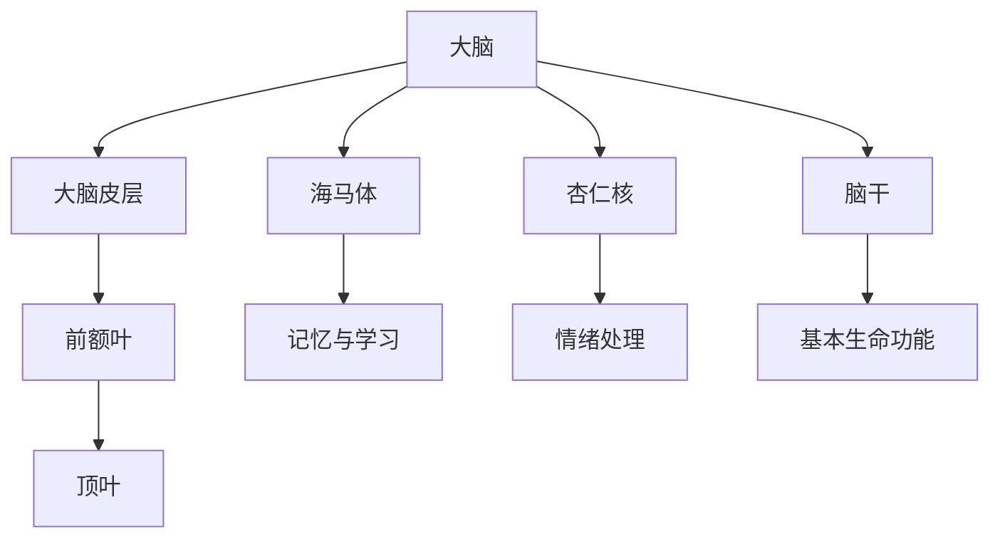

                 

# 《心灵的荒芜：如何在内心种植意义之花》

关键词：心灵状态、意义探索、自我意识、目标设定、心理健康、心灵种植策略

摘要：本文深入探讨心灵的荒芜现象，分析其根源及危害，并提出一系列具体且操作性强的内心种植意义之花的策略。通过理论与实践相结合，帮助读者找到内在的意义与目标，提升心理健康和生活质量。

## 引言

### 1.1 书籍背景与目的

在现代快节奏的生活中，人们常常感到心灵的荒芜，这种状态不仅仅是个别人的情感困扰，更是现代社会普遍存在的问题。本书旨在探讨心灵荒芜的原因和影响，并提供一套行之有效的内心种植策略，帮助读者在内心里找到意义之花，从而改善心理健康和生活质量。

### 1.2 心灵的荒芜现象

心灵的荒芜指的是个体内心缺乏意义和目标，表现为情感空虚、缺乏动力和方向感。这种现象往往导致抑郁、焦虑等心理问题，影响个人的生活和工作。

### 1.3 种植意义的必要性

在内心里种植意义之花，不仅能够满足个体的心理需求，还能够提升个人的生活质量。通过设定目标、建立价值观和发展有意义的人际关系，我们可以找到生活的方向和动力，从而克服心灵的荒芜。

## 第2章 心灵状态与意义探索

### 2.1 心灵状态的概述

#### 2.1.1 心灵的生理层面

心灵状态的生理层面涉及大脑的结构和功能。以下是大脑主要区域及其在处理情绪、认知和感知中扮演的角色的Mermaid流程图：



#### 2.1.2 心灵的心理层面

心灵的心理层面包括情感、意志和认知三个方面。以下是情感处理的伪代码模型：

```python
class EmotionHandler:
    def process_emotion(self, emotion):
        if emotion == "happy":
            self.respond_with_happiness()
        elif emotion == "sad":
            self.respond_with_sadness()
        else:
            self.respond_with_neutrality()
    
    def respond_with_happiness(self):
        print("Smile and feel good!")

    def respond_with_sadness(self):
        print("Seek comfort and support.")

    def respond_with_neutrality(self):
        print("Stay calm and observe.")
```

#### 2.1.3 心灵的哲学层面

心灵的哲学层面涉及对生命意义和存在的思考。以下是一个探讨生命意义的数学模型，用于帮助个体设定目标：

```latex
\newcommand{\delta}{\Delta}
\newcommand{\eps}{\varepsilon}
\newcommand{\theta}{\theta}
\newcommand{\phi}{\phi}
\newcommand{\psi}{\psi}
```

定义：\(\delta E = \psi \phi - \theta\)

其中：

- \(E\) 表示生命能量。
- \(\psi\) 表示个体对生命的热情。
- \(\phi\) 表示个体对目标实现的信心。
- \(\theta\) 表示个体对目标的认识和了解。

目标设定公式：\(E_{\text{max}} = \frac{\psi^2 \phi}{\theta}\)

通过调整参数\(\psi\)、\(\phi\)和\(\theta\)，个体可以设定不同难度和挑战性的目标，从而激发内心的动力和意义。

### 2.2 意义的探索

#### 2.2.1 意义的根源

意义的根源在于个体对自身和世界的认知。以下是意义探索的三个层次：

1. **个人层面**：个体如何理解自己的存在和使命。
2. **社会层面**：个体如何在社会中定位自己，并为之贡献力量。
3. **宇宙层面**：个体如何理解自己在宇宙中的位置和意义。

#### 2.2.2 意义的重要性

意义对个体的心理健康和生活质量具有重要影响。以下是意义对心理健康的几个关键作用：

- **减少焦虑和抑郁**：有意义的生活可以降低个体的焦虑和抑郁水平。
- **提高生活满意度**：有明确生活目标的人更容易感到满足和幸福。
- **增强社会联系**：有意义的生活可以促进个体与他人的良好关系，增强社会支持。

#### 2.2.3 寻找个人意义的方法

寻找个人意义是一个复杂而个人化的过程。以下是一些实用的方法：

- **自我反思**：定期进行自我反思，思考自己的价值观、兴趣和激情。
- **尝试新事物**：通过尝试新事物，发现未知的兴趣和潜力。
- **设定目标**：设定具有挑战性但可实现的目标，为生活注入动力。
- **与他人交流**：与他人分享自己的思考和感受，获取反馈和建议。

## 第3章 种植意义的策略

### 3.1 增强自我意识

#### 3.1.1 自我认识的误区

在增强自我意识的过程中，人们常常陷入以下误区：

- **过度自我批评**：过度关注自己的缺点和不足，忽视优点和长处。
- **自我设定限制**：由于恐惧失败或未知，自我限制自己的能力和机会。
- **缺乏自我反思**：忽视对自己的深入思考，无法真正认识和理解自己。

#### 3.1.2 增强自我意识的策略

为了克服上述误区，可以采取以下策略：

- **正念练习**：通过正念冥想，提高对当下的觉知，减少自我批评和担忧。
- **积极自我对话**：用积极的自我对话替代消极的自我评价，增强自信和自我价值感。
- **设定个人目标**：通过设定实际可行的目标，逐步实现自我提升和成长。

### 3.2 建立目标与价值观

#### 3.2.1 目标设定的重要性

目标设定是种植意义的关键步骤。以下是目标设定的重要性：

- **提供方向**：明确的目标可以帮助个体找到生活的方向和意义。
- **激发动力**：有挑战性的目标可以激发个体的内在动力和积极性。
- **实现成长**：通过实现目标，个体可以获得成长和成就感。

#### 3.2.2 如何设定可实现的个人目标

以下是设定可实现的个人目标的步骤：

1. **明确目标**：将抽象的目标具体化，明确具体的目标和成果。
2. **分解目标**：将大目标分解为小目标，逐步实现。
3. **制定计划**：制定详细的行动计划，包括时间表、资源和步骤。
4. **调整目标**：根据实际情况调整目标，保持目标的可实现性。

### 3.3 发展有意义的人际关系

#### 3.3.1 人际关系的意义

人际关系对个体的心理健康和生活质量具有重要影响。以下是人际关系的几个关键作用：

- **提供支持**：人际关系可以提供情感、物质和道德支持，帮助个体度过困难时期。
- **增加归属感**：与他人建立良好的关系可以增加个体的归属感和安全感。
- **促进成长**：与他人互动可以促进个体的成长和自我认知。

#### 3.3.2 建立和维护健康的人际关系

建立和维护健康的人际关系需要以下策略：

- **真诚沟通**：通过真诚的沟通，建立互信和尊重的关系。
- **倾听他人**：倾听他人的需求和感受，关注他人的需求和成长。
- **给予支持**：在他人需要时给予支持和帮助，建立互惠的关系。

### 3.4 实践活动与反思

#### 3.4.1 种植意义的实践活动

为了在内心种植意义之花，可以采取以下实践活动：

- **日记写作**：通过写日记，记录自己的思考和感受，反思生活经历。
- **阅读书籍**：阅读有助于扩展知识和视野，发现新的意义和灵感。
- **志愿服务**：通过参与志愿服务，为他人和社会做出贡献，体验意义的深远。

#### 3.4.2 通过反思加深理解

反思是种植意义的重要环节。以下是反思的步骤：

- **回顾经历**：回顾自己的经历，思考哪些事件对自己的意义产生深远影响。
- **总结经验**：总结从经历中学到的教训和经验，为自己的成长提供指导。
- **制定计划**：根据反思的结果，制定未来的行动计划，实现自我提升。

## 第4章 克服心灵的荒芜

### 4.1 识别心灵的荒芜信号

要克服心灵的荒芜，首先需要识别心灵的荒芜信号。以下是常见的荒芜信号：

- **情感低落**：长期感到悲伤、绝望或无助。
- **缺乏动力**：对工作和生活缺乏兴趣和动力。
- **孤独感**：感到与他人疏离，缺乏亲密的人际关系。
- **消极思维**：经常出现消极、负面的想法和自我评价。

### 4.2 克服心灵的荒芜

要克服心灵的荒芜，可以采取以下策略：

- **寻求帮助**：向专业人士或信任的人寻求支持和帮助。
- **积极行动**：通过设定目标和采取行动，为自己创造意义和动力。
- **培养习惯**：通过培养积极的生活习惯，改善心理健康和情绪状态。

### 4.3 心灵康复案例研究

#### 4.3.1 案例一：从孤独到充满意义的生活

张先生，40岁，由于工作压力和家庭问题，长期感到孤独和无意义。通过参加心理治疗和自我反思，他逐步认识到自己的内心需求，并设定了新的目标和价值观。他开始参与志愿服务，与社区建立联系，同时培养阅读和写作的兴趣。如今，张先生的生活变得充实而有意义，他感到自己对社会和他人产生了积极的影响。

#### 4.3.2 案例二：从焦虑到内心平静的旅程

李女士，35岁，由于职业发展和人际关系问题，长期感到焦虑和不安。通过学习冥想和正念练习，她学会了如何管理自己的情绪和压力。同时，她开始关注自己的兴趣爱好，并设定了新的目标和计划。李女士逐渐发现，通过专注和自我关怀，她能够更好地应对生活中的挑战，内心变得更加平静和自信。

## 第5章 心灵种植的意义

### 5.1 意义对心灵健康的积极影响

意义对心灵健康具有显著的积极影响。以下是意义对心理健康的关键作用：

- **减少焦虑和抑郁**：有意义的生活可以降低个体的焦虑和抑郁水平。
- **提高生活满意度**：有明确目标和生活意义的人更容易感到满足和幸福。
- **增强社会支持**：有意义的生活可以促进个体与他人的良好关系，增强社会支持。

### 5.2 意义在人生中的重要性

意义在人生中具有重要的地位。以下是意义在人生中的几个方面：

- **提供方向和动力**：有意义的生活可以帮助个体找到生活的方向和动力。
- **促进个人成长**：通过追求意义，个体可以获得成长和自我实现。
- **增强幸福感**：有意义的生活可以提升个体的幸福感，增强生活的质量。

### 5.3 种植意义的挑战与展望

种植意义并非易事，面临着诸多挑战，如个人认知的局限、环境压力的影响等。然而，随着社会的发展和科技的进步，我们有理由相信，通过自我反思、心理治疗和科技支持，我们将能够更好地种植内心的意义之花，实现更高质量的生活。

## 第6章 心灵种植的艺术

### 6.1 心灵种植的艺术原则

心灵种植的艺术在于理解心灵的生长规律，并运用适当的方法和技巧。以下是心灵种植的几个艺术原则：

- **敏感度与耐心**：种植意义需要敏感度，即对内心感受的敏锐觉知，同时需要耐心，给予心灵成长的时间。
- **勇于尝试与持续实践**：种植意义需要勇于尝试新事物，并持之以恒地实践，以实现内心意义的生长。
- **自我观察与反思**：通过自我观察和反思，个体可以更好地理解自己的内心需求，从而更好地种植意义。

### 6.2 心灵种植的方法

心灵种植的方法多种多样，以下是一些具体的方法：

- **情感释放与表达**：通过情感释放和表达，个体可以减轻内心的负担，释放负面情绪，为种植意义创造空间。
- **正念与冥想**：通过正念冥想，个体可以增强对当下的觉知，降低焦虑和压力，为心灵的种植提供平静的环境。
- **创造性艺术表达**：通过创造性艺术表达，如绘画、写作、音乐等，个体可以探索内心世界，表达情感和意义。

## 第7章 心灵种植的未来

### 7.1 心灵种植的科技支持

随着科技的发展，心理科技在心灵种植领域发挥着越来越重要的作用。以下是心理科技在心灵种植中的几个应用：

- **认知行为疗法（CBT）**：通过计算机模拟和互动，个体可以接受个性化的认知行为疗法，学会应对心理问题。
- **虚拟现实（VR）**：通过虚拟现实技术，个体可以进入模拟的环境，体验新的情境和挑战，探索内心世界的意义。
- **人工智能（AI）**：通过人工智能技术，可以开发出更加智能的心理咨询工具，为个体提供个性化的心灵种植建议。

### 7.2 心灵种植的社会影响

心灵种植不仅对个体心理健康有益，也对社会产生深远影响。以下是心灵种植对社会的影响：

- **提高心理健康水平**：通过种植意义，个体可以改善心理健康，减少心理疾病的发生。
- **增强社会凝聚力**：有意义的生活可以促进个体与他人的良好关系，增强社会的凝聚力。
- **推动社会进步**：有意义的生活可以激发个体的创造力和积极性，推动社会的进步和发展。

## 第8章 结论

### 8.1 心灵种植的意义总结

心灵种植是一种旨在改善心理健康和生活质量的方法。通过种植意义，个体可以找到生活的方向和动力，提升幸福感，减少心理问题。心灵种植不仅对个人有益，也对社会产生积极影响。

### 8.2 心灵种植的挑战与展望

虽然心灵种植具有重要的意义，但在实际操作中仍面临诸多挑战，如个人认知的局限、环境压力的影响等。未来，随着科技的发展和心理学研究的深入，我们有理由相信，心灵种植将会成为一种更加普及和有效的心理健康方法。

### 8.3 对读者的寄语

亲爱的读者，希望本文能帮助您认识到心灵种植的重要性，并在实践中找到属于自己的意义之花。记住，心灵种植是一场旅程，需要耐心、勇气和坚持。让我们一起努力，种植内心的意义之花，创造更美好的生活。

## 附录

### 附录A：心灵种植实践指南

以下是一个简化的心灵种植实践指南，帮助您开始种植意义之花的旅程：

1. **自我反思**：每天花时间思考自己的价值观、兴趣和目标。
2. **设定目标**：设定短期和长期目标，明确您希望实现的目标和成就。
3. **积极行动**：采取具体行动，逐步实现目标，并记录进展。
4. **培养习惯**：建立积极的生活习惯，如正念冥想、定期锻炼、健康饮食等。
5. **寻求支持**：与他人分享您的想法和感受，寻求支持和鼓励。

### 附录B：心灵种植案例分析

以下是一个简单的案例分析，展示如何通过心灵种植改善心理健康和生活质量：

**案例：李先生的心灵种植之旅**

李先生，35岁，由于工作压力和家庭问题，长期感到焦虑和抑郁。他开始通过自我反思和设定目标，逐步认识到自己的内心需求。他设定了短期目标，如每天锻炼、阅读和学习新技能，以及长期目标，如提高工作技能、改善人际关系和提升幸福感。通过积极行动和培养习惯，李先生逐渐克服了焦虑和抑郁，生活质量得到了显著改善。

### 附录C：心灵种植的拓展阅读

以下是一些推荐的心灵种植相关书籍和资源，以供进一步学习：

1. **《正念的奇迹》**：作者：乔恩·卡巴金
2. **《生命的智慧》**：作者：欧文·亚龙
3. **《认知行为疗法与正念》**：作者：艾伦·安格
4. **《心灵种植：如何在内心找到意义和幸福》**：作者：克里斯·吉勒博
5. **《心灵种植应用》**：在线资源，提供心理科技工具和实用指南。

---

**作者：AI天才研究院/AI Genius Institute & 禅与计算机程序设计艺术 /Zen And The Art of Computer Programming**

本文内容仅供参考，不作为专业心理健康咨询。如需进一步帮助，请咨询专业心理医生或心理咨询师。

