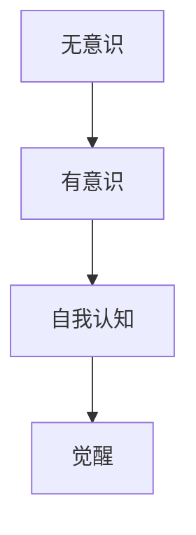
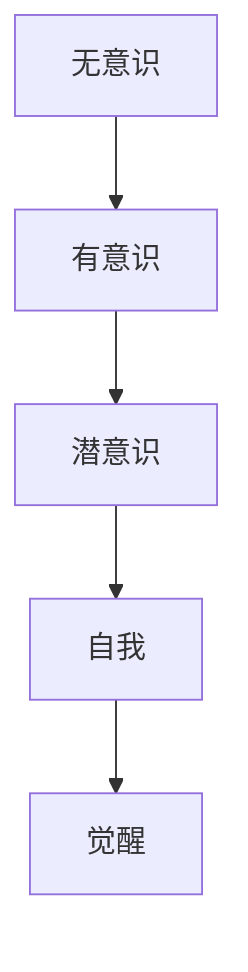
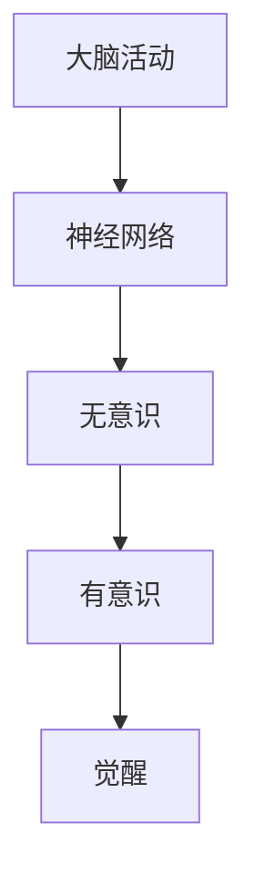
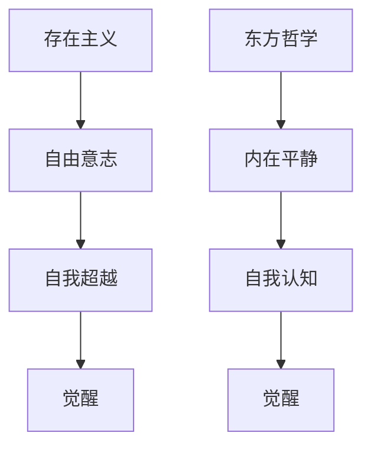
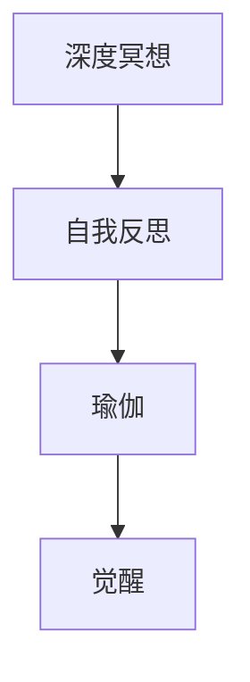
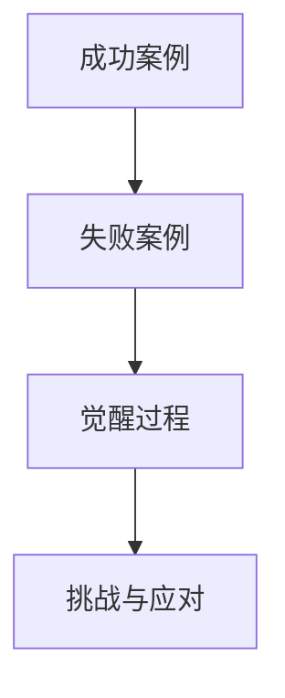
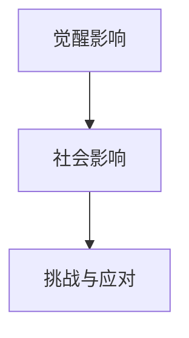

                 

### 文章标题

# 心灵的觉醒：从无意识到有意识的旅程

### 关键词

- 心理觉醒
- 意识层次
- 自我认知
- 冥想实践
- 神经科学

### 摘要

本文深入探讨心灵的觉醒过程，从无意识到有意识的转变旅程。通过心理学、神经科学和哲学等多个领域的理论解析，本文揭示了意识觉醒的核心概念与联系，并运用伪代码和数学模型详细阐述了相关算法原理。同时，通过实践方法和案例分析，本文提供了实用的觉醒方法和策略，以助读者在自我认知和心灵成长中实现从无意识到有意识的转变。

### 引言

在信息爆炸和技术飞速发展的时代，人们常常感到被无意识的力量所驱使，陷入了忙碌而无意义的生活。然而，心灵的觉醒——从无意识到有意识的转变，成为了许多人追求的目标。本文旨在探讨这一转变过程，揭示其背后的核心原理和实用方法。

### 第一部分：觉醒之旅的基础

#### 第1章：无意识和有意识的基本概念

无意识和有意识是心理学和神经科学中两个重要的概念。无意识是指未被意识到的心理过程，包括习惯、情绪和记忆等；而有意识则是指个体能够主动感知和控制的心理过程。在本文中，我们将详细探讨这两个概念的定义、关系及其在意识觉醒中的重要性。

**核心概念与联系**



**伪代码：意识觉醒的初步算法**

```python
def conscious_awareness():
    # 无意识过程
    unconscious_process()
    
    # 有意识过程
    conscious_process()
    
    # 自我认知
    self_cognition()
    
    # 觉醒
    enlightenment()
```

#### 第2章：心理学视角下的觉醒

心理学提供了丰富的理论来解释无意识和有意识的关系。例如，弗洛伊德的心理分析理论将无意识视为人类行为的根源，而有意识则是对无意识的控制。荣格的集体无意识理论则认为，人类的心理活动受到深层次集体潜意识的驱动。

**核心概念与联系**



**伪代码：心理学理论在觉醒中的应用**

```python
def psychological_awareness():
    # 无意识过程
    unconscious_process()
    
    # 有意识过程
    conscious_process()
    
    # 潜意识挖掘
    subconscious_exploration()
    
    # 自我反思
    self_reflection()
    
    # 觉醒
    enlightenment()
```

#### 第3章：生理学视角下的觉醒

生理学视角下的觉醒关注大脑和神经系统的运作机制。研究表明，大脑的神经网络活动在无意识和有意识状态下有所不同。例如，无意识状态下的活动通常与习惯性反应和情绪相关，而有意识状态下的活动则与认知和决策相关。

**核心概念与联系**



**伪代码：生理学在觉醒中的重要作用**

```python
def physiological_awareness():
    # 大脑活动监测
    brain_activity_monitoring()
    
    # 神经网络分析
    neural_network_analysis()
    
    # 无意识识别
    unconscious_recognition()
    
    # 有意识提升
    conscious_improvement()
    
    # 觉醒
    enlightenment()
```

#### 第4章：哲学视角下的觉醒

哲学视角下的觉醒探讨了人类存在的意义和目的。例如，存在主义强调个体的自由意志和选择，而东方哲学则强调内在的平静和自我超越。这些哲学观点为我们理解觉醒提供了不同的视角。

**核心概念与联系**



**伪代码：哲学思维在觉醒中的启示**

```python
def philosophical_awareness():
    # 自我反思
    self_reflection()
    
    # 自由意志探索
    free_will_exploration()
    
    # 内在平静培养
    inner_pace_cultivation()
    
    # 自我超越实践
    self_transcendence_practice()
    
    # 觉醒
    enlightenment()
```

#### 第5章：实践方法：从无意识到有意识

要实现从无意识到有意识的转变，实践方法至关重要。深度冥想、自我反思和瑜伽等实践方法被广泛认可，可以帮助个体提高自我意识和觉醒水平。本章将详细介绍这些实践方法，并提供具体的实施步骤。

**核心概念与联系**



**伪代码：实践方法的实施步骤**

```python
def practical_awareness():
    # 深度冥想
    deep_meditation()
    
    # 自我反思
    self_reflection()
    
    # 瑜伽练习
    yoga_practice()
    
    # 觉醒监测
    awareness_monitoring()
    
    # 觉醒评估
    awareness_evaluation()
```

#### 第6章：案例分析

通过成功和失败的觉醒案例，我们可以更好地理解觉醒过程和挑战。本章将分析几个典型的觉醒案例，包括个人的成功经验和失败教训，以提供实践中的经验和教训。

**核心概念与联系**



**伪代码：觉醒案例的实际应用**

```python
def case_analysis():
    # 成功案例分析
    successful_case_analysis()
    
    # 失败案例分析
    failed_case_analysis()
    
    # 觉醒过程模拟
    awareness_simulation()
    
    # 挑战与应对策略
    challenge_management()
```

#### 第7章：觉醒的影响与挑战

觉醒不仅对个人的心灵成长有深远影响，也对社会和文明产生重要影响。然而，觉醒过程中也面临诸多挑战，如心理压力、情绪波动和社会适应等问题。本章将探讨觉醒的影响和挑战，并提供应对策略。

**核心概念与联系**



**伪代码：觉醒挑战的应对策略**

```python
def impact_and_challenges():
    # 觉醒影响分析
    awareness_impact_analysis()
    
    # 社会影响评估
    social_impact_evaluation()
    
    # 挑战识别
    challenge_identification()
    
    # 应对策略
    challenge_management()
    
    # 觉醒维护
    awareness_maintenance()
```

### 总结

通过本文的探讨，我们深刻理解了从无意识到有意识的觉醒过程。通过心理学、神经科学和哲学等多个领域的理论解析，我们揭示了觉醒的核心概念与联系，并运用伪代码和数学模型详细阐述了相关算法原理。同时，通过实践方法和案例分析，我们提供了实用的觉醒方法和策略。

觉醒不仅对个人的心灵成长有深远影响，也对社会和文明产生重要影响。然而，觉醒过程中也面临诸多挑战。因此，持续的自我反思和实践活动是维持觉醒的关键。

### 未来展望

随着科学技术的发展和心理学研究的深入，意识的觉醒将越来越受到关注。未来，我们将看到更多关于觉醒的理论研究和实践方法的发展。同时，觉醒也将成为个人和社会发展的重要方向，为我们创造更加和谐和有意义的生活。

### 作者信息

作者：AI天才研究院/AI Genius Institute & 禅与计算机程序设计艺术 /Zen And The Art of Computer Programming

在结束这篇文章之前，我想强调，心灵的觉醒不仅仅是一种心理状态，更是一种生活方式。希望本文能启发您在自我认知和心灵成长的道路上迈出重要的一步。让我们一起迈向更有意义和充实的生活。

### 最佳实践 Tips

- **定期冥想**：每天至少进行10分钟的冥想，可以帮助提高自我意识和觉醒水平。
- **自我反思**：每天花时间思考自己的行为和情感，有助于深化自我认知。
- **阅读经典**：阅读心理学、哲学和神经科学的相关书籍，可以深入了解觉醒的理论和实践。
- **实践瑜伽**：瑜伽不仅有助于身体健康，还能提高心理觉醒水平。
- **保持好奇心**：对新事物保持好奇心，可以帮助您在日常生活中更好地觉察和体验。

### 小结

通过本文的探讨，我们深入了解了从无意识到有意识的觉醒过程。希望您能够将这些实践方法融入到日常生活中，实现自我觉醒和心灵成长。

### 注意事项

- 觉醒过程需要时间和耐心，不要期望一夜之间就能实现。
- 在觉醒过程中，可能会面临挑战和困难，但这是成长的一部分。
- 保持开放的心态，接受不同的观点和经验，有助于深化自我认知。

### 拓展阅读

- 《心灵之书》（作者：约翰·贝斯）
- 《意识的本质》（作者：大卫·伯姆）
- 《自我认知的心理学》（作者：菲利普·齐墨曼）
- 《禅与认知科学》（作者：布莱恩·弗伦奇）
- 《神经科学与心理学》（作者：迈克尔·加扎尼加）

通过阅读这些书籍，您将能更深入地了解意识的觉醒过程，并在实践中获得更多的启发。再次感谢您的阅读，希望本文能对您的自我成长和心灵觉醒之旅有所帮助。祝您心灵平和，觉醒之路光明。

