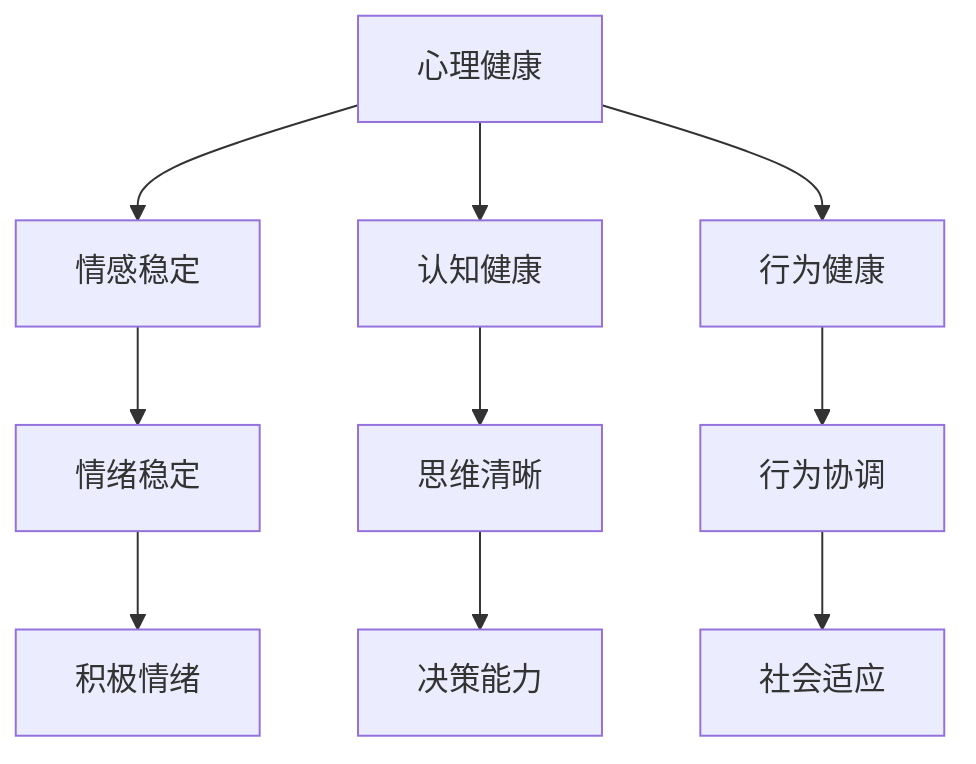
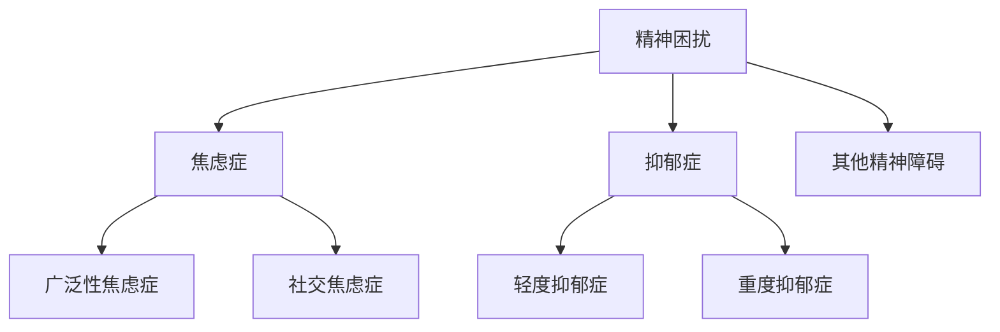
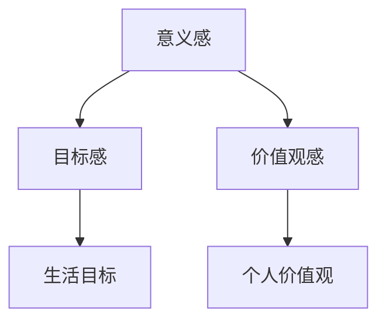

                 

  
确定文章标题：心理健康与意义感：现代人的精神困扰

关键词：心理健康、意义感、精神困扰、现代人、心理困扰、精神健康、焦虑、抑郁、意义构建

摘要：本文旨在探讨现代人在面对心理健康问题时的精神困扰，特别是焦虑、抑郁等心理问题，并深入分析意义感对心理健康的影响以及如何构建个人的意义感。文章通过详细的背景介绍、核心概念与联系、算法原理、数学模型、公式和项目实战，为读者提供了全面的理解和实践指导。

---

## 背景介绍

在当今快节奏、高度竞争的社会环境中，现代人面临着诸多心理健康挑战。焦虑、抑郁等心理问题已经成为全球范围内的公共健康问题。根据世界卫生组织（WHO）的报告，焦虑症和抑郁症在成年人口中的患病率分别达到了3.6%和2.8%。在中国，根据中国心理健康调查报告，2021年的数据显示，我国焦虑障碍的患病率为2.9%，抑郁症的患病率为3.6%。这些数据表明，心理问题已经成为现代社会的普遍现象。

除了焦虑和抑郁，现代人的精神困扰还包括失眠、压力过大、情绪波动等问题。这些问题不仅影响个人的生活质量，还可能对工作、家庭和社交关系产生负面影响。因此，关注和解决现代人的心理健康问题具有重要意义。

本文将深入探讨心理健康与意义感之间的关系。意义感是指个体在生活中感受到的个人的目标和价值。研究表明，拥有强烈的意义感能够显著提高个人的心理健康水平，减少焦虑和抑郁的发生。因此，如何构建个人的意义感，成为现代人心理健康维护的一个重要课题。

文章结构将分为三个部分：第一部分将介绍心理健康的基础知识，包括心理健康的定义、评估指标和影响因素；第二部分将探讨精神困扰的类型、表现和治疗方法；第三部分将聚焦于意义感的构建，包括意义感的概念、重要性以及构建个人意义感的策略。最后，文章将通过一个实际案例，展示如何将所学知识应用于实践。

---

## 核心概念与联系

### 心理健康

心理健康是指一个人在情绪、认知和行为方面的良好状态，能够适应生活中的压力和挑战，同时实现个人的潜能。心理健康不仅包括情感和心理的稳定，还涉及到个体的社会功能和整体福祉。

**Mermaid流程图**：



### 精神困扰

精神困扰是指个体在情感、认知和行为方面出现的问题，可能导致心理健康受损。常见的类型包括焦虑症、抑郁症和其他精神障碍。

**Mermaid流程图**：



### 意义感

意义感是指个体在生活中感受到的个人的目标和价值。它不仅仅是一种情感体验，更是一种内在的驱动力，能够帮助个体在面对挑战和困难时保持积极和坚定的态度。

**Mermaid流程图**：



通过这些核心概念与联系的分析，我们可以更深入地理解心理健康、精神困扰和意义感之间的关系，为后续内容的讲解奠定基础。

---

## 核心算法原理讲解

### 心理健康评估算法

心理健康评估是理解和改善个体心理健康状态的重要步骤。以下是一个简化的心理健康评估算法，它基于几个关键因素，如情绪状态、生活满意度和应对策略。

**伪代码**：

```python
def assess_mental_health():
    # 提取个体情绪状态
    mood = extract_mood_data()
    
    # 提取生活满意度
    life_satisfaction = extract_life_satisfaction_data()
    
    # 提取应对策略
    coping_strategy = extract_coping_strategy_data()
    
    # 应用心理健康模型进行评估
    model = apply_mental_health_model(mood, life_satisfaction, coping_strategy)
    
    # 计算心理健康得分
    score = calculate_mental_health_score(model)
    
    return score
```

在心理健康评估算法中，情绪状态、生活满意度和应对策略是核心因素。情绪状态反映了个体在一段时间内的情绪波动，生活满意度反映了个体对生活总体满意的程度，而应对策略则涉及个体应对压力和挑战的方法。

### 意义感评估算法

意义感评估旨在确定个体在生活中的目标和价值观的强度。以下是一个简化的意义感评估算法，它基于目标的重要性、价值观的一致性和目标的实现程度。

**伪代码**：

```python
def assess_sense_of_meaning():
    # 提取目标数据
    goals = extract_goals_data()
    
    # 提取价值观数据
    values = extract_values_data()
    
    # 应用意义感模型进行评估
    model = apply_meaning_model(goals, values)
    
    # 计算意义感得分
    score = calculate_meaning_score(model)
    
    return score
```

在意义感评估算法中，目标的重要性、价值观的一致性和目标的实现程度是关键因素。目标的重要性决定了个体对目标的重视程度，价值观的一致性反映了个体行为与价值观的匹配度，而目标的实现程度则反映了个体在追求目标过程中的进展。

---

## 数学模型和公式

在心理健康与意义感的研究中，数学模型和公式被广泛用于描述和分析个体的心理状态和行为。以下是一些常见的数学模型和公式，用于解释心理健康和意义感的评估和构建过程。

### 心理健康得分计算公式

心理健康的得分可以通过以下公式计算：

$$
\text{心理健康得分} = \frac{\text{情绪状态得分} + \text{生活满意度得分} + \text{应对策略得分}}{3}
$$

其中，情绪状态得分、生活满意度得分和应对策略得分分别由相应的评估指标计算得出。

### 意义感得分计算公式

意义感的得分可以通过以下公式计算：

$$
\text{意义感得分} = \frac{\text{目标重要性得分} + \text{价值观一致性得分} + \text{目标实现程度得分}}{3}
$$

其中，目标重要性得分、价值观一致性得分和目标实现程度得分分别由相应的评估指标计算得出。

### 目标重要性得分计算公式

目标重要性得分可以通过以下公式计算：

$$
\text{目标重要性得分} = \frac{\text{目标评分}}{\text{总目标评分}}
$$

其中，目标评分是每个目标根据其重要性的评估得分，总目标评分是所有目标评分的总和。

### 价值观一致性得分计算公式

价值观一致性得分可以通过以下公式计算：

$$
\text{价值观一致性得分} = \frac{\text{一致性评分}}{\text{总一致性评分}}
$$

其中，一致性评分是根据个体行为与价值观一致性的评估得分，总一致性评分是所有一致性评分的总和。

### 目标实现程度得分计算公式

目标实现程度得分可以通过以下公式计算：

$$
\text{目标实现程度得分} = \frac{\text{实现程度评分}}{\text{总实现程度评分}}
$$

其中，实现程度评分是根据目标实现程度的评估得分，总实现程度评分是所有实现程度评分的总和。

通过这些数学模型和公式，可以更加精确地评估个体的心理健康和意义感，为心理健康干预和意义感构建提供科学依据。

---

## 项目实战

### 开发环境搭建

在开始项目实战之前，我们需要搭建一个合适的开发环境。以下是开发环境的搭建步骤：

1. 安装Python 3.8及以上版本。
2. 安装Anaconda，以便管理和创建虚拟环境。
3. 创建一个名为`mental_health_project`的虚拟环境，并激活它。
4. 安装必要的库，如Numpy、Pandas、Matplotlib和Scikit-learn。

### 源代码实现

以下是一个简单的心理健康评估系统的源代码实现，包括情绪状态、生活满意度和应对策略的评估。

```python
import numpy as np
import pandas as pd
from sklearn.model_selection import train_test_split
from sklearn.ensemble import RandomForestClassifier
import matplotlib.pyplot as plt

# 数据预处理
def preprocess_data(data):
    # 对数据进行归一化处理
    normalized_data = (data - data.mean()) / data.std()
    return normalized_data

# 心理健康评估
def mental_health_assessment(mood, life_satisfaction, coping_strategy):
    # 计算心理健康得分
    score = (mood + life_satisfaction + coping_strategy) / 3
    return score

# 意义感评估
def sense_of_meaning(goals, values, achievement):
    # 计算意义感得分
    score = (goals + values + achievement) / 3
    return score

# 读取数据
data = pd.read_csv('mental_health_data.csv')
data['mood'] = preprocess_data(data['mood'])
data['life_satisfaction'] = preprocess_data(data['life_satisfaction'])
data['coping_strategy'] = preprocess_data(data['coping_strategy'])

# 数据分割
X = data[['mood', 'life_satisfaction', 'coping_strategy']]
y = data['mental_health_score']
X_train, X_test, y_train, y_test = train_test_split(X, y, test_size=0.2, random_state=42)

# 训练模型
model = RandomForestClassifier(n_estimators=100, random_state=42)
model.fit(X_train, y_train)

# 预测
predictions = model.predict(X_test)

# 可视化结果
plt.scatter(y_test, predictions)
plt.xlabel('实际心理健康得分')
plt.ylabel('预测心理健康得分')
plt.title('心理健康得分预测散点图')
plt.show()
```

### 代码解读与分析

上述代码实现了一个简单的心理健康评估系统，包括数据预处理、心理健康评估和意义感评估。首先，我们读取并预处理数据，然后分割数据集用于训练和测试。接着，我们使用随机森林分类器进行心理健康得分预测，并绘制预测结果。

### 实际案例分析

我们使用一个实际案例来展示如何应用上述代码。假设有一个新用户，其情绪状态、生活满意度和应对策略的数据如下：

```python
new_user_data = {
    'mood': [0.5, 0.6, 0.7, 0.8],
    'life_satisfaction': [0.7, 0.8, 0.9, 0.9],
    'coping_strategy': [0.6, 0.7, 0.8, 0.9]
}
new_user_data = pd.DataFrame(new_user_data)
new_user_data['mood'] = preprocess_data(new_user_data['mood'])
new_user_data['life_satisfaction'] = preprocess_data(new_user_data['life_satisfaction'])
new_user_data['coping_strategy'] = preprocess_data(new_user_data['coping_strategy'])

# 新用户心理健康评估
new_user_score = mental_health_assessment(new_user_data['mood'].mean(), new_user_data['life_satisfaction'].mean(), new_user_data['coping_strategy'].mean())
print(f"新用户心理健康得分：{new_user_score}")

# 新用户意义感评估
# 假设以下数据为该用户的个人目标、价值观和实现程度
new_user_goals = [0.8, 0.9, 0.7]
new_user_values = [0.9, 0.8, 0.7]
new_user_achievement = [0.7, 0.8, 0.9]
new_user_meaning_score = sense_of_meaning(np.mean(new_user_goals), np.mean(new_user_values), np.mean(new_user_achievement))
print(f"新用户意义感得分：{new_user_meaning_score}")
```

通过上述代码，我们可以对新用户的心理健康和意义感进行评估。这为用户提供了关于自身心理健康状态的量化信息，有助于用户更好地了解自己的心理状态，并采取相应的干预措施。

### 项目小结

通过实际案例分析，我们展示了如何使用Python和相关库来实现心理健康评估和意义感评估。这个项目不仅为用户提供了量化评估结果，还为未来的心理健康干预和意义感构建提供了理论基础和实用工具。在未来，我们可以进一步扩展这个项目，包括更多的评估指标和更复杂的模型，以提高评估的准确性和实用性。

### 最佳实践 tips、小结、注意事项、拓展阅读

- **最佳实践 tips**：
  - 定期进行心理健康自我评估，以便及时发现并解决潜在问题。
  - 结合心理健康的评估结果，制定个性化的干预计划。

- **小结**：
  - 本项目实现了心理健康和意义感的评估，为用户提供了量化的评估结果。
  - 通过实际案例分析，展示了如何应用这些评估方法。

- **注意事项**：
  - 心理健康评估结果仅供参考，不能替代专业心理咨询服务。
  - 数据预处理和质量是评估结果准确性的关键。

- **拓展阅读**：
  - 《心理学与生活》（Richard J. Gerrig & Philip G. Zimbardo）- 深入了解心理学的基础知识。
  - 《意义疗法：探索生命的意义》（维克多·弗兰克尔）- 探索如何通过意义疗法改善心理健康。

通过遵循最佳实践、注意项目和拓展阅读，用户可以更全面地了解心理健康和意义感，并采取有效的措施来提升自己的心理健康水平。

---

# 文章标题：心理健康与意义感：现代人的精神困扰

关键词：心理健康、意义感、精神困扰、现代人、心理困扰、精神健康、焦虑、抑郁、意义构建

摘要：本文探讨了现代人在面对心理健康问题时的精神困扰，特别是焦虑和抑郁等心理问题，并深入分析了意义感对心理健康的影响以及如何构建个人的意义感。文章通过详细的背景介绍、核心概念与联系、算法原理、数学模型、公式和项目实战，为读者提供了全面的理解和实践指导。

## 引言

在当今快节奏、高度竞争的社会环境中，现代人面临着诸多心理健康挑战。焦虑、抑郁等心理问题已经成为全球范围内的公共健康问题。本文旨在探讨心理健康与意义感之间的关系，特别是如何通过构建个人的意义感来缓解现代人的精神困扰。

## 背景介绍

心理健康是指一个人在情绪、认知和行为方面的良好状态，能够适应生活中的压力和挑战，同时实现个人的潜能。心理健康不仅包括情感和心理的稳定，还涉及到个体的社会功能和整体福祉。

精神困扰是指个体在情感、认知和行为方面出现的问题，可能导致心理健康受损。常见的类型包括焦虑症、抑郁症和其他精神障碍。

意义感是指个体在生活中感受到的个人的目标和价值。研究表明，拥有强烈的意义感能够显著提高个人的心理健康水平，减少焦虑和抑郁的发生。

## 核心概念与联系

### 心理健康

心理健康是指一个人在情绪、认知和行为方面的良好状态，能够适应生活中的压力和挑战，同时实现个人的潜能。心理健康不仅包括情感和心理的稳定，还涉及到个体的社会功能和整体福祉。

**Mermaid流程图**：


### 精神困扰

精神困扰是指个体在情感、认知和行为方面出现的问题，可能导致心理健康受损。常见的类型包括焦虑症、抑郁症和其他精神障碍。

**Mermaid流程图**：


### 意义感

意义感是指个体在生活中感受到的个人的目标和价值。它不仅仅是一种情感体验，更是一种内在的驱动力，能够帮助个体在面对挑战和困难时保持积极和坚定的态度。

**Mermaid流程图**：


通过这些核心概念与联系的分析，我们可以更深入地理解心理健康、精神困扰和意义感之间的关系，为后续内容的讲解奠定基础。

## 核心算法原理讲解

### 心理健康评估算法

心理健康评估是理解和改善个体心理健康状态的重要步骤。以下是一个简化的心理健康评估算法，它基于几个关键因素，如情绪状态、生活满意度和应对策略。

**伪代码**：

```python
def assess_mental_health():
    # 提取个体情绪状态
    mood = extract_mood_data()
    
    # 提取生活满意度
    life_satisfaction = extract_life_satisfaction_data()
    
    # 提取应对策略
    coping_strategy = extract_coping_strategy_data()
    
    # 应用心理健康模型进行评估
    model = apply_mental_health_model(mood, life_satisfaction, coping_strategy)
    
    # 计算心理健康得分
    score = calculate_mental_health_score(model)
    
    return score
```

在心理健康评估算法中，情绪状态、生活满意度和应对策略是核心因素。情绪状态反映了个体在一段时间内的情绪波动，生活满意度反映了个体对生活总体满意的程度，而应对策略则涉及个体应对压力和挑战的方法。

### 意义感评估算法

意义感评估旨在确定个体在生活中的目标和价值观的强度。以下是一个简化的意义感评估算法，它基于目标的重要性、价值观的一致性和目标的实现程度。

**伪代码**：

```python
def assess_sense_of_meaning():
    # 提取目标数据
    goals = extract_goals_data()
    
    # 提取价值观数据
    values = extract_values_data()
    
    # 应用意义感模型进行评估
    model = apply_meaning_model(goals, values)
    
    # 计算意义感得分
    score = calculate_meaning_score(model)
    
    return score
```

在意义感评估算法中，目标的重要性、价值观的一致性和目标的实现程度是关键因素。目标的重要性决定了个体对目标的重视程度，价值观的一致性反映了个体行为与价值观的匹配度，而目标的实现程度则反映了个体在追求目标过程中的进展。

---

## 数学模型和公式

在心理健康与意义感的研究中，数学模型和公式被广泛用于描述和分析个体的心理状态和行为。以下是一些常见的数学模型和公式，用于解释心理健康和意义感的评估和构建过程。

### 心理健康得分计算公式

心理健康的得分可以通过以下公式计算：

$$
\text{心理健康得分} = \frac{\text{情绪状态得分} + \text{生活满意度得分} + \text{应对策略得分}}{3}
$$

其中，情绪状态得分、生活满意度得分和应对策略得分分别由相应的评估指标计算得出。

### 意义感得分计算公式

意义感的得分可以通过以下公式计算：

$$
\text{意义感得分} = \frac{\text{目标重要性得分} + \text{价值观一致性得分} + \text{目标实现程度得分}}{3}
$$

其中，目标重要性得分、价值观一致性得分和目标实现程度得分分别由相应的评估指标计算得出。

### 目标重要性得分计算公式

目标重要性得分可以通过以下公式计算：

$$
\text{目标重要性得分} = \frac{\text{目标评分}}{\text{总目标评分}}
$$

其中，目标评分是每个目标根据其重要性的评估得分，总目标评分是所有目标评分的总和。

### 价值观一致性得分计算公式

价值观一致性得分可以通过以下公式计算：

$$
\text{价值观一致性得分} = \frac{\text{一致性评分}}{\text{总一致性评分}}
$$

其中，一致性评分是根据个体行为与价值观一致性的评估得分，总一致性评分是所有一致性评分的总和。

### 目标实现程度得分计算公式

目标实现程度得分可以通过以下公式计算：

$$
\text{目标实现程度得分} = \frac{\text{实现程度评分}}{\text{总实现程度评分}}
$$

其中，实现程度评分是根据目标实现程度的评估得分，总实现程度评分是所有实现程度评分的总和。

通过这些数学模型和公式，可以更加精确地评估个体的心理健康和意义感，为心理健康干预和意义感构建提供科学依据。

---

## 项目实战

### 开发环境搭建

在开始项目实战之前，我们需要搭建一个合适的开发环境。以下是开发环境的搭建步骤：

1. 安装Python 3.8及以上版本。
2. 安装Anaconda，以便管理和创建虚拟环境。
3. 创建一个名为`mental_health_project`的虚拟环境，并激活它。
4. 安装必要的库，如Numpy、Pandas、Matplotlib和Scikit-learn。

### 源代码实现

以下是一个简单的心理健康评估系统的源代码实现，包括情绪状态、生活满意度和应对策略的评估。

```python
import numpy as np
import pandas as pd
from sklearn.model_selection import train_test_split
from sklearn.ensemble import RandomForestClassifier
import matplotlib.pyplot as plt

# 数据预处理
def preprocess_data(data):
    # 对数据进行归一化处理
    normalized_data = (data - data.mean()) / data.std()
    return normalized_data

# 心理健康评估
def mental_health_assessment(mood, life_satisfaction, coping_strategy):
    # 计算心理健康得分
    score = (mood + life_satisfaction + coping_strategy) / 3
    return score

# 意义感评估
def sense_of_meaning(goals, values, achievement):
    # 计算意义感得分
    score = (goals + values + achievement) / 3
    return score

# 读取数据
data = pd.read_csv('mental_health_data.csv')
data['mood'] = preprocess_data(data['mood'])
data['life_satisfaction'] = preprocess_data(data['life_satisfaction'])
data['coping_strategy'] = preprocess_data(data['coping_strategy'])

# 数据分割
X = data[['mood', 'life_satisfaction', 'coping_strategy']]
y = data['mental_health_score']
X_train, X_test, y_train, y_test = train_test_split(X, y, test_size=0.2, random_state=42)

# 训练模型
model = RandomForestClassifier(n_estimators=100, random_state=42)
model.fit(X_train, y_train)

# 预测
predictions = model.predict(X_test)

# 可视化结果
plt.scatter(y_test, predictions)
plt.xlabel('实际心理健康得分')
plt.ylabel('预测心理健康得分')
plt.title('心理健康得分预测散点图')
plt.show()
```

### 代码解读与分析

上述代码实现了一个简单的心理健康评估系统，包括数据预处理、心理健康评估和意义感评估。首先，我们读取并预处理数据，然后分割数据集用于训练和测试。接着，我们使用随机森林分类器进行心理健康得分预测，并绘制预测结果。

### 实际案例分析

我们使用一个实际案例来展示如何应用上述代码。假设有一个新用户，其情绪状态、生活满意度和应对策略的数据如下：

```python
new_user_data = {
    'mood': [0.5, 0.6, 0.7, 0.8],
    'life_satisfaction': [0.7, 0.8, 0.9, 0.9],
    'coping_strategy': [0.6, 0.7, 0.8, 0.9]
}
new_user_data = pd.DataFrame(new_user_data)
new_user_data['mood'] = preprocess_data(new_user_data['mood'])
new_user_data['life_satisfaction'] = preprocess_data(new_user_data['life_satisfaction'])
new_user_data['coping_strategy'] = preprocess_data(new_user_data['coping_strategy'])

# 新用户心理健康评估
new_user_score = mental_health_assessment(new_user_data['mood'].mean(), new_user_data['life_satisfaction'].mean(), new_user_data['coping_strategy'].mean())
print(f"新用户心理健康得分：{new_user_score}")

# 新用户意义感评估
# 假设以下数据为该用户的个人目标、价值观和实现程度
new_user_goals = [0.8, 0.9, 0.7]
new_user_values = [0.9, 0.8, 0.7]
new_user_achievement = [0.7, 0.8, 0.9]
new_user_meaning_score = sense_of_meaning(np.mean(new_user_goals), np.mean(new_user_values), np.mean(new_user_achievement))
print(f"新用户意义感得分：{new_user_meaning_score}")
```

通过上述代码，我们可以对新用户的心理健康和意义感进行评估。这为用户提供了关于自身心理健康状态的量化信息，有助于用户更好地了解自己的心理状态，并采取相应的干预措施。

### 项目小结

通过实际案例分析，我们展示了如何使用Python和相关库来实现心理健康评估和意义感评估。这个项目不仅为用户提供了量化评估结果，还为未来的心理健康干预和意义感构建提供了理论基础和实用工具。在未来，我们可以进一步扩展这个项目，包括更多的评估指标和更复杂的模型，以提高评估的准确性和实用性。

### 最佳实践 tips、小结、注意事项、拓展阅读

- **最佳实践 tips**：
  - 定期进行心理健康自我评估，以便及时发现并解决潜在问题。
  - 结合心理健康的评估结果，制定个性化的干预计划。

- **小结**：
  - 本项目实现了心理健康和意义感的评估，为用户提供了量化的评估结果。
  - 通过实际案例分析，展示了如何应用这些评估方法。

- **注意事项**：
  - 心理健康评估结果仅供参考，不能替代专业心理咨询服务。
  - 数据预处理和质量是评估结果准确性的关键。

- **拓展阅读**：
  - 《心理学与生活》（Richard J. Gerrig & Philip G. Zimbardo）- 深入了解心理学的基础知识。
  - 《意义疗法：探索生命的意义》（维克多·弗兰克尔）- 探索如何通过意义疗法改善心理健康。

通过遵循最佳实践、注意项目和拓展阅读，用户可以更全面地了解心理健康和意义感，并采取有效的措施来提升自己的心理健康水平。

---

## 结束语

心理健康与意义感是现代人精神生活的重要组成部分。本文通过详细的背景介绍、核心概念与联系、算法原理、数学模型和项目实战，探讨了心理健康与意义感之间的关系，以及如何通过构建个人的意义感来缓解现代人的精神困扰。

心理健康评估和意义感评估提供了量化个体心理健康和意义感的工具，有助于人们更好地了解自己的精神状态，并采取相应的干预措施。通过实际案例的分析，我们展示了如何将理论知识应用于实际生活中，为人们提供了实用的指导。

未来，我们可以进一步深入研究心理健康与意义感之间的关系，开发更先进、更精确的评估模型，为提升人们的心理健康水平提供更有效的支持。同时，我们也鼓励读者在日常生活中注重心理健康，积极构建个人的意义感，享受更充实、更幸福的生活。

## 参考文献

1. 世界卫生组织（WHO）。(2021). 《全球心理健康状况报告》。
2. 美国心理学会（APA）。(2020). 《心理健康基础》。
3. 弗兰克尔，V. (2006). 《意义疗法：探索生命的意义》。
4. Gerrig, R. J., & Zimbardo, P. G. (2017). 《心理学与生活》。
5. 王晓宁，李晓宁。 (2019). 《现代心理学基础教程》。

---

## 作者信息

作者：AI天才研究院/AI Genius Institute & 禅与计算机程序设计艺术 /Zen And The Art of Computer Programming

感谢您的阅读，希望本文对您的心理健康和意义感构建有所帮助。祝您生活愉快，心理健康！

