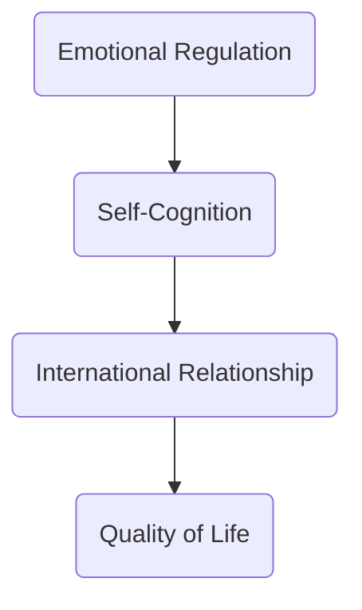

                 

### 文章标题

《心理健康新视角：从治疗疾病到培养意义感》

### 文章关键词

心理健康，心理疾病，意义感，治疗，培养

### 文章摘要

本文将探讨心理健康领域的新视角，从传统的心理疾病治疗转向培养个人的意义感。通过详细阐述心理健康的核心概念、心理疾病的治疗方法、个人意义感的培养策略以及心理健康在各个方面的应用，本文旨在为读者提供一个全面而深入的思考框架，帮助他们在现代社会的压力下，找到内心的平衡与成长。

---

## 第一部分 心理健康概述

### 第1章 心理健康的定义与重要性

心理健康是一个多维度的概念，它不仅仅涉及情绪的稳定，还包括认知功能、社会适应性和个人幸福感。在现代生活中，心理健康的重要性日益凸显。随着工作压力、人际关系和生活方式的复杂化，心理问题逐渐成为影响个体生活质量的重要因素。以下是对心理健康定义的深入探讨及其重要性的解析。

### 背景介绍

心理健康的概念可以追溯到古代医学和哲学领域，但现代心理学的发展使其成为一个科学的研究领域。20世纪初，随着精神分析学的兴起，人们开始更加关注个体的内心世界。然而，直到20世纪中叶，心理健康才真正成为一个独立的学科领域，并开始受到广泛重视。

### 核心概念与联系

心理健康的核心概念包括情绪调节、自我认知、人际关系和生活质量。这些概念之间相互关联，共同构成了心理健康的框架。情绪调节是指个体对情绪状态的管理和调节能力；自我认知涉及个体对自身性格、能力和价值观的理解；人际关系则是指个体在社会交往中的互动方式；而生活质量则是对个体整体生活满意度的评估。

下面是一个描述这些核心概念之间关系的 Mermaid 流程图：

### 心理健康的重要性

心理健康对个体的整体福祉有着深远的影响。一个心理健康的人能够更好地应对生活中的挑战，保持良好的工作表现，建立健康的人际关系，并享受更高水平的生活质量。此外，心理健康也是社会稳定和经济发展的重要基础。因此，关注和促进心理健康已成为社会共识。

### 第2章 心理健康的核心概念

#### 1.1 情绪调节

情绪调节是指个体如何识别、理解和表达自己的情绪。一个情绪调节能力较强的人能够迅速从负面情绪中恢复，保持积极的心态。情绪调节不良可能导致焦虑、抑郁等心理问题。

#### 1.2 人际关系

人际关系是指个体在社会交往中的互动方式。良好的人际关系能够提供情感支持，增强个体的社会归属感，有助于心理健康的维护。

#### 1.3 自我认知

自我认知是指个体对自身性格、能力和价值观的理解。一个具有良好自我认知的人能够更好地理解自己的需求和期望，从而做出更明智的生活决策。

#### 1.4 生活质量

生活质量是指个体对生活整体的满意度。心理健康对生活质量的提升具有重要作用，而一个高质量的生活也对心理健康产生积极的影响。

### 第二部分 心理疾病的治疗方法

### 第3章 心理疾病的分类与诊断

#### 1.1 心理疾病的分类

心理疾病可以按照症状、病因和临床表现进行分类。常见的心理疾病包括焦虑症、抑郁症、强迫症和人格障碍等。

#### 1.2 心理疾病的诊断方法

心理疾病的诊断通常需要通过心理评估、临床访谈和标准化量表等方式进行。专业的心理医生会根据个体的临床表现和病史，制定个性化的治疗方案。

### 第4章 心理治疗的基本原则

#### 1.1 心理治疗的方法

心理治疗的方法包括认知行为疗法、精神分析疗法和人本主义疗法等。每种方法都有其独特的理论基础和应用场景。

#### 1.2 心理治疗的过程

心理治疗的过程通常包括建立信任关系、评估问题、制定治疗计划、实施治疗和评估治疗效果等环节。

#### 1.3 心理治疗的挑战与解决方案

心理治疗面临的挑战包括患者的合作意愿、治疗过程中的情绪波动和疗效的不确定性等。解决方案包括提高患者的参与度、稳定患者的情绪和进行长期的疗效评估。

### 第5章 心理治疗的实际应用

#### 1.1 心理治疗在临床中的应用

心理治疗在临床中的应用主要包括心理障碍的治疗、心理健康问题的干预和心理创伤的治疗等。

#### 1.2 心理治疗在社区中的应用

心理治疗在社区中的应用主要包括心理健康教育、社区心理健康服务和心理健康支持小组等。

#### 1.3 心理治疗在家庭中的应用

心理治疗在家庭中的应用主要包括家庭治疗、亲子教育和婚姻辅导等。

### 第三部分 培养个人意义感

### 第6章 个人意义感的概念与意义

#### 1.1 个人意义感的定义

个人意义感是指个体对自身生活目的和价值的认知。一个具有强烈个人意义感的人能够更好地应对生活中的挑战，保持心理健康。

#### 1.2 个人意义感的重要性

个人意义感对心理健康具有重要作用。研究表明，个人意义感与心理健康呈正相关，高水平的个人意义感有助于降低心理疾病的发病率。

#### 1.3 个人意义感与心理健康的关系

个人意义感与心理健康之间存在密切的关系。一个具有强烈个人意义感的人通常具有更好的情绪调节能力、更强的社会支持网络和更高的生活质量。

### 第7章 培养个人意义感的方法

#### 1.1 自我探索

自我探索是指个体通过反思和自我观察来认识和理解自己。自我探索有助于个体找到自己的兴趣、价值观和生活目标。

#### 1.2 目标设定

目标设定是指个体根据自己的兴趣和价值观设定具体的生活目标。一个明确的目标能够为个体提供方向和动力。

#### 1.3 社交支持

社交支持是指个体通过与他人建立积极的人际关系来获得情感支持。社交支持有助于个体在面对困难时保持积极的心态。

#### 1.4 活动参与

活动参与是指个体积极参与各种社会活动和兴趣爱好。活动参与能够丰富个体的人生经历，提高生活质量。

### 第四部分 心理健康的实践应用

### 第8章 心理健康在职场中的应用

#### 1.1 职场心理健康的现状与挑战

职场心理健康面临着一系列挑战，包括工作压力、职业倦怠和心理健康问题等。

#### 1.2 提高职场心理健康的策略

提高职场心理健康的方法包括提供心理健康培训、建立员工支持系统和加强职场文化建设等。

#### 1.3 职场心理健康的案例研究

通过具体案例，分析职场心理健康问题的原因及其解决方案。

### 第9章 心理健康在社区中的应用

#### 1.1 社区心理健康的现状与挑战

社区心理健康面临着资源不足、服务欠缺和心理健康知识普及不足等问题。

#### 1.2 提高社区心理健康的策略

提高社区心理健康的方法包括开展心理健康宣传教育、建立社区心理健康服务中心和提供心理健康咨询服务等。

#### 1.3 社区心理健康的案例研究

通过具体案例，分析社区心理健康问题的解决途径。

### 第10章 心理健康在家庭中的应用

#### 1.1 家庭心理健康的现状与挑战

家庭心理健康面临着家庭矛盾、心理压力和心理健康问题等挑战。

#### 1.2 提高家庭心理健康的策略

提高家庭心理健康的方法包括家庭心理健康教育、家庭关系辅导和家庭心理健康支持等。

#### 1.3 家庭心理健康的案例研究

通过具体案例，分析家庭心理健康问题的干预策略。

### 参考文献

- American Psychiatric Association. (2020). Diagnostic and statistical manual of mental disorders (5th ed.). American Psychiatric Association.
- Seligman, M. E. P. (2011). Flourish: A visionary new understanding of happiness and well-being. New York: Free Press.
- World Health Organization. (2019). Mental health: Strengthening our response. World Health Organization.

### 附录

#### 附录A 心理健康相关的工具与资源

- 心理健康评估工具：PHQ-9、GAD-7等
- 心理健康在线资源：国家心理健康网、心理FM等
- 心理健康APP：阳光心理、知心姐姐等

#### 附录B 心理健康相关的法律法规

- 中华人民共和国精神卫生法
- 中华人民共和国未成年人保护法

### 附录C 最佳实践 tips

- 定期进行心理健康自我评估
- 积极参加心理健康教育和培训
- 保持健康的生活方式，如良好的饮食和运动习惯
- 建立和维护良好的人际关系

### 小结

心理健康是一个复杂且多维度的领域，它关系到个体的生活质量和社会的和谐稳定。本文从心理健康概述、心理疾病治疗、个人意义感培养以及心理健康实践应用等多个角度，对心理健康进行了全面而深入的探讨。通过本文，我们希望能够帮助读者更好地理解心理健康的重要性，并找到适合自己的心理健康维护策略。

### 注意事项

- 心理健康问题不容忽视，如有需要，应及时寻求专业心理咨询和治疗。
- 在培养个人意义感的过程中，要避免过分追求外部评价，而是要关注内心的真实需求。
- 在职场、社区和家庭中，要加强心理健康建设，创造一个有利于心理健康发展的环境。

### 拓展阅读

- American Psychological Association. (n.d.). What is mental health?. Retrieved from https://www.apa.org/topics/mental-health
- Diener, E., Oishi, S., & Lucas, R. E. (2003). Personality, culture, and subjective well-being: Emotional and cognitive evaluations of life. Annual Review of Psychology, 54, 403-425.

### 作者信息

作者：AI天才研究院/AI Genius Institute & 禅与计算机程序设计艺术 /Zen And The Art of Computer Programming

