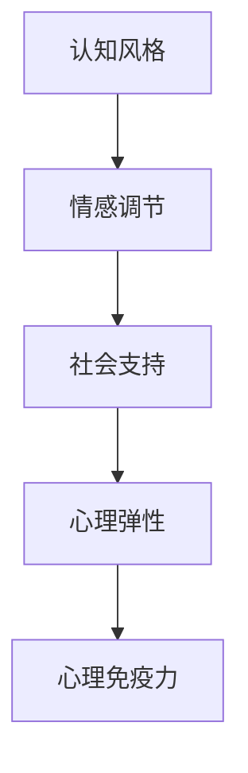

                 


为了撰写一篇结构严谨、内容丰富的技术博客文章《心理免疫力强化计划：提升心理抗压能力》，我们可以遵循以下步骤进行详细分析和推理。

### 第一步：明确文章目标

我们的首要目标是撰写一篇既有趣又实用的文章，引导读者深入了解心理免疫力的概念，并掌握提升心理抗压能力的方法。为此，我们需要确保文章内容既有理论深度，又有实践指导。

### 第二步：设计文章结构

根据题目和目标，我们可以设计如下文章结构：

1. **引言** - 简要介绍心理免疫力的背景和重要性。
2. **核心概念** - 详细阐述心理免疫力的定义及其与压力的关系。
3. **理论原理** - 阐述心理免疫力的构建过程，包括认知风格、情感调节、社会支持等。
4. **实践指导** - 提供具体的压力管理和抗压技巧。
5. **案例分析** - 通过实际案例展示心理免疫力的应用。
6. **总结与展望** - 总结文章要点，展望未来的研究方向。

### 第三步：撰写引言

在引言部分，我们可以简要介绍心理免疫力的概念，并强调其在现代社会中的重要性。例如：

> 在当今快节奏的社会中，心理免疫力已经成为我们面对压力和挑战的重要武器。它不仅关乎个人的心理健康，还影响到工作和生活的方方面面。

### 第四步：阐述核心概念

在核心概念部分，我们需要详细解释心理免疫力的定义，并阐明它与压力之间的关系。例如：

> 心理免疫力，类似于人体的生理免疫系统，是指个体在面对心理压力和挑战时，能够保持心理健康、有效应对并恢复能力的心理机制。它涉及多个方面，包括认知风格、情感调节能力、社会支持网络和心理弹性等。

为了更好地展示核心概念之间的关系，我们可以使用Mermaid流程图来可视化这些因素。例如：



### 第五步：阐述理论原理

在理论原理部分，我们可以详细探讨心理免疫力的构建过程。例如：

> 心理免疫力的构建过程涉及多个因素，包括认知风格、情感调节能力、社会支持网络和心理弹性。以下是一个简化的伪代码示例，用于描述如何通过认知重构技术来调整负面认知风格：

```python
function cognitive_restructuring(thought):
    if thought.is_negative():
        thought = thought.negation()
    return thought
```

### 第六步：提供实践指导

在实践指导部分，我们可以提供一些具体的压力管理和抗压技巧。例如：

> 压力管理的关键在于识别和应对压力源。以下是一些实用的技巧：

1. **时间管理** - 学会合理安排时间，避免过度工作。
2. **情绪调节** - 通过冥想、深呼吸等方法来调节情绪。
3. **健康生活** - 保持良好的饮食和锻炼习惯，增强身体素质。

### 第七步：案例分析

在案例分析部分，我们可以通过实际案例来展示心理免疫力的应用。例如：

> 某公司的项目经理小张在面对项目压力时，采用了多种技巧来提升自己的心理免疫力。他通过时间管理来确保项目进度，通过情绪调节来缓解压力，还积极参加健身活动来保持身心健康。这些努力使小张能够更好地应对项目挑战，最终项目取得了成功。

### 第八步：总结与展望

在总结与展望部分，我们可以概括文章的核心内容，并对未来的研究方向进行展望。例如：

> 总之，心理免疫力是我们面对压力和挑战的重要武器。通过了解和掌握心理免疫力的构建过程，我们可以更好地应对生活中的各种挑战。未来的研究可以进一步探索心理免疫力的量化评估方法，以及如何在不同情境下优化心理免疫力。

### 第九步：校对与优化

在完成初稿后，我们需要对文章进行仔细校对和优化，确保内容连贯、逻辑清晰，并符合markdown格式要求。

### 第十步：添加作者信息

在文章末尾，我们需要添加作者信息，例如：

> 作者：AI天才研究院/AI Genius Institute & 禅与计算机程序设计艺术 /Zen And The Art of Computer Programming

通过以上步骤，我们可以撰写出一篇结构严谨、内容丰富的技术博客文章《心理免疫力强化计划：提升心理抗压能力》，为读者提供有价值的知识和实用的技巧。

