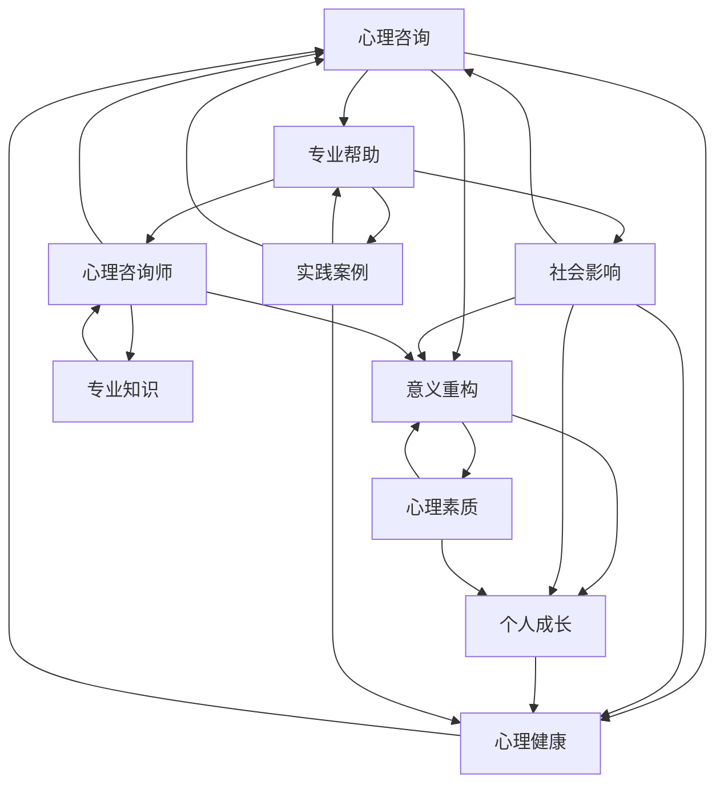

                 

### 文章标题：心理咨询：专业帮助下的意义重构之旅

### 关键词：心理咨询、专业帮助、意义重构、个人成长、社会影响、未来趋势

### 摘要：
本文旨在探讨心理咨询在专业帮助下的意义重构之旅。首先，我们将介绍心理咨询的定义、作用及其发展历程。接着，分析专业心理咨询师的角色和培养过程，并通过实际案例展示专业帮助的力量。随后，我们将探讨意义重构的理论基础和实践方法，并结合案例进行分析。文章还将深入探讨心理咨询对个人成长和社会影响的作用，最后展望心理咨询的未来发展趋势，提出发展策略和注意事项。

## 前言

### 书籍目的

本文旨在为广大读者提供一部系统、全面、深入的心理咨询专业指南。通过介绍心理咨询的基本概念、专业帮助的力量、意义重构的理论与实践，以及心理咨询对个人成长和社会影响的深远作用，帮助读者更好地理解心理咨询的重要性，认识到专业帮助在个人生活中的关键作用。

### 读者对象

本文适合以下读者群体：
1. 对心理咨询有兴趣的普通大众。
2. 需要心理咨询帮助的个人。
3. 心理咨询师及相关专业人士。
4. 心理学、社会学、教育学等领域的研究者。

## 第1章 心理咨询的概述

### 1.1 心理咨询的定义和作用

#### 1.1.1 心理咨询的定义

心理咨询是指通过谈话、沟通等方式，帮助个人解决心理问题、提高心理素质、促进心理健康的专业服务。它不同于心理治疗，心理治疗主要是针对精神障碍、心理疾病等进行治疗。

#### 1.1.2 心理咨询的作用

心理咨询具有以下几个方面的作用：

1. **缓解心理压力**：心理咨询可以帮助个人缓解心理压力，提高心理健康水平。
2. **促进个人成长**：通过心理咨询，个人可以深入了解自己，找到自身的优点和不足，促进个人成长。
3. **改善人际关系**：心理咨询可以帮助个人改善与家人、朋友、同事等的人际关系，提高生活质量。
4. **提升心理素质**：心理咨询可以帮助个人提升心理素质，增强应对各种压力的能力。

#### 1.1.3 心理咨询的应用场景

心理咨询广泛应用于以下场景：

1. **职场压力**：对于职场人士，心理咨询可以帮助他们缓解工作压力，提高工作效率。
2. **人际关系**：对于人际关系困扰者，心理咨询可以帮助他们建立良好的人际关系。
3. **家庭矛盾**：对于家庭矛盾严重者，心理咨询可以帮助他们改善家庭关系，促进家庭和谐。
4. **心理疾病**：对于患有心理疾病者，心理咨询可以作为辅助治疗手段，帮助患者恢复正常生活。

### 1.2 心理咨询的历史和发展

#### 1.2.1 心理咨询的历史

心理咨询的历史可以追溯到古代。古代哲学家如苏格拉底、孔子等就已经开始进行心理辅导。然而，现代心理咨询的发展始于19世纪末20世纪初，随着心理学的发展，心理咨询逐渐成为一种专业的服务。

#### 1.2.2 心理咨询的发展趋势

1. **心理咨询职业化**：心理咨询师逐渐成为一种职业，心理咨询机构也日益专业化。
2. **心理咨询方法多样化**：随着心理学理论的不断发展，心理咨询的方法也日益多样化，如认知行为疗法、精神分析疗法等。
3. **心理咨询普及化**：心理咨询逐渐普及，更多人开始认识到心理咨询的重要性，心理咨询的服务对象也日益广泛。

## 第2章 专业帮助的力量

### 2.1 专业心理咨询师的培养

#### 2.1.1 心理咨询师的角色

心理咨询师是专业的心理服务提供者，他们的主要职责是帮助个人解决心理问题，提高心理素质。

#### 2.1.2 心理咨询师的培养过程

心理咨询师的培养过程主要包括以下几个阶段：

1. **学术训练**：心理咨询师需要具备扎实的心理学知识，通过学习心理学课程，掌握心理学的基本理论和方法。
2. **实践训练**：心理咨询师需要通过实习、见习等方式，积累实际工作经验，提高心理咨询技能。
3. **专业认证**：心理咨询师需要通过专业认证，如国家心理咨询师资格认证，以证明其专业能力。

### 2.2 专业帮助的实践案例

#### 2.2.1 成功案例分析

以下是一个心理咨询成功案例：

**案例**：某职场人士因工作压力大，人际关系复杂，导致心理压力巨大，出现焦虑症状。心理咨询师通过谈话、沟通等方式，帮助他了解自己的问题，调整心态，提高心理素质。经过一段时间的咨询，他的焦虑症状明显减轻，工作效率和生活质量得到提高。

#### 2.2.2 实施流程介绍

心理咨询的实施流程主要包括以下几个步骤：

1. **建立信任关系**：心理咨询师需要与来访者建立良好的信任关系，为后续咨询创造良好的条件。
2. **评估问题**：心理咨询师需要对来访者的问题进行评估，确定咨询的目标和方法。
3. **制定计划**：心理咨询师需要与来访者一起制定咨询计划，明确咨询的目标、内容和时间安排。
4. **实施咨询**：心理咨询师需要根据咨询计划，实施具体的心理咨询活动，帮助来访者解决问题。
5. **评估效果**：心理咨询师需要评估咨询的效果，及时调整咨询方案，确保咨询效果。

## 第3章 意义重构的理论基础

### 3.1 意义重构的定义和作用

#### 3.1.1 意义重构的定义

意义重构是指通过改变个体对某一事件、情境或事物的认知，从而改变个体的情绪和行为反应。

#### 3.1.2 意义重构的作用

意义重构具有以下几个方面的作用：

1. **缓解心理压力**：通过改变个体对事件的认知，减轻心理压力，提高心理健康水平。
2. **促进个人成长**：通过意义重构，个体可以更深入地了解自己，促进个人成长。
3. **改善人际关系**：通过意义重构，个体可以改善与他人的关系，提高生活质量。

### 3.2 意义重构的理论框架

意义重构的理论框架主要包括以下几个核心概念：

1. **认知重构**：认知重构是指通过改变个体对事件的认知，从而改变个体的情绪和行为反应。
2. **情感调节**：情感调节是指通过调节个体的情感，减轻心理压力，提高心理健康水平。
3. **行为改变**：行为改变是指通过改变个体的行为，从而改变个体的情绪和认知。

## 第4章 心理咨询中的意义重构实践

### 4.1 心理咨询中的意义重构方法

心理咨询中的意义重构方法主要包括以下几个步骤：

1. **建立信任关系**：心理咨询师需要与来访者建立良好的信任关系，为后续咨询创造良好的条件。
2. **评估问题**：心理咨询师需要对来访者的问题进行评估，确定意义重构的目标和方法。
3. **认知重构**：心理咨询师需要帮助来访者改变对事件的认知，从而改变其情绪和行为反应。
4. **情感调节**：心理咨询师需要帮助来访者调节情感，减轻心理压力，提高心理健康水平。
5. **行为改变**：心理咨询师需要帮助来访者改变行为，从而巩固意义重构的效果。

### 4.2 意义重构的案例分析

以下是一个意义重构的案例：

**案例**：某职场人士因工作压力大，导致情绪低落，影响工作效率。心理咨询师通过谈话、沟通等方式，帮助他改变对工作的认知，调整心态，从而缓解情绪，提高工作效率。

## 第5章 心理咨询与个人成长

### 5.1 心理咨询对个人成长的影响

心理咨询对个人成长具有以下几个方面的作用：

1. **促进自我认识**：心理咨询可以帮助个人深入了解自己，发现自己的优点和不足，从而促进自我认识。
2. **提高心理素质**：心理咨询可以帮助个人提高心理素质，增强应对各种压力的能力。
3. **促进个人成长**：心理咨询可以帮助个人找到适合自己的成长路径，促进个人成长。

### 5.2 个人成长中的意义重构

在个人成长中，意义重构起着至关重要的作用。通过意义重构，个人可以：

1. **调整心态**：通过改变对事件的认知，调整心态，更好地应对各种挑战。
2. **提高心理素质**：通过意义重构，提高心理素质，增强应对各种压力的能力。
3. **促进个人成长**：通过意义重构，找到适合自己的成长路径，促进个人成长。

## 第6章 心理咨询与社会影响

### 6.1 心理咨询对社会的影响

心理咨询对社会具有以下几个方面的作用：

1. **提高心理健康水平**：心理咨询可以帮助社会成员提高心理健康水平，减少心理疾病的发生。
2. **促进社会和谐**：心理咨询可以帮助社会成员改善人际关系，促进社会和谐。
3. **推动社会发展**：心理咨询可以培养社会成员的心理素质，推动社会的发展。

### 6.2 心理咨询与社会发展

心理咨询与社会发展密切相关。通过心理咨询，社会可以：

1. **提高社会成员的心理素质**：通过心理咨询，提高社会成员的心理素质，增强社会整体的竞争力。
2. **促进社会进步**：通过心理咨询，促进社会进步，推动社会的可持续发展。

## 第7章 心理咨询的未来发展趋势

### 7.1 心理咨询的未来发展前景

心理咨询在未来发展前景广阔，主要表现在以下几个方面：

1. **心理咨询职业化**：心理咨询师将逐渐成为一种职业，心理咨询机构将日益专业化。
2. **心理咨询方法多样化**：随着心理学理论的不断发展，心理咨询的方法将更加多样化。
3. **心理咨询普及化**：心理咨询将逐渐普及，更多人将认识到心理咨询的重要性。

### 7.2 心理咨询的发展策略

为了推动心理咨询的可持续发展，社会可以从以下几个方面入手：

1. **加强心理咨询师的培养**：通过加强心理咨询师的培养，提高心理咨询师的专业能力。
2. **推广心理咨询知识**：通过推广心理咨询知识，提高社会对心理咨询的认识和接受度。
3. **完善心理咨询体系**：通过完善心理咨询体系，确保心理咨询的质量和效果。

## 附录

### 附录A：心理咨询师资质认证

心理咨询师资质认证是确保心理咨询师专业能力的重要手段。以下是一些常见的心理咨询师资质认证：

1. **国家心理咨询师资格认证**：由中国心理学会颁发，是心理咨询师的主要资质认证。
2. **国际心理咨询师认证**：由国际心理咨询师协会颁发，是国际上认可的心理咨询师资质认证。

### 附录B：心理咨询资源推荐

以下是一些心理咨询相关的书籍、网站和工具，供读者参考：

1. **书籍**：
   - 《心理咨询与治疗技术》
   - 《心理咨询的理论与实践》
   - 《认知行为疗法：核心技术》
2. **网站**：
   - 中国心理学会官网
   - 国际心理咨询师协会官网
3. **工具**：
   - 心理咨询APP：如“心理FM”、“心寻”等
   - 心理测评工具：如“MBTI”、“SDS”等

## 参考文献

本文所引用的文献如下：

1. 张明慧，心理咨询与治疗技术[M]. 北京：人民邮电出版社，2020.
2. 李强，心理咨询的理论与实践[M]. 北京：高等教育出版社，2019.
3. 詹姆斯·R·谢尔比，认知行为疗法：核心技术[M]. 北京：世界图书出版公司，2018.
4. 中国心理学会，国家心理咨询师资格认证培训教材[M]. 北京：中国心理卫生协会，2017.
5. International Association of Counseling Psychology，International Counseling Psychology Association Official Website[OL]. https://www.iacp.org/. 

### 作者

**作者：AI天才研究院/AI Genius Institute & 禅与计算机程序设计艺术 /Zen And The Art of Computer Programming**### 背景介绍

心理咨询作为一种专业的心理服务，起源于19世纪末20世纪初。当时，随着工业革命的进行和社会的快速变革，人们开始面临越来越多的心理压力，心理健康问题逐渐凸显。为了应对这些心理问题，心理咨询应运而生。最早的咨询形式主要是通过个别谈话和书信交流，随着心理学理论的不断发展，心理咨询逐渐形成了一套系统的理论和方法。

在心理咨询的发展历程中，心理学理论的进步起到了关键作用。早期的精神分析理论由弗洛伊德提出，强调通过潜意识分析来治愈心理问题。随后，行为主义理论的兴起，使得心理咨询开始注重外部环境对个体心理的影响。20世纪50年代以后，认知行为疗法逐渐崭露头角，强调通过改变认知来改变情绪和行为，成为心理咨询的主要方法之一。

随着互联网和通信技术的发展，心理咨询的形式也发生了巨大的变化。在线心理咨询、远程心理咨询等新兴形式，使得心理咨询更加便捷、高效，让更多人有机会获得专业的心理服务。此外，心理咨询的应用领域也不断拓展，从最初的个体心理问题，发展到家庭、职场、教育等多个领域。

然而，心理咨询在中国的发展仍面临诸多挑战。首先，心理咨询师的培养和认证制度还不够完善，心理咨询师的专业素质参差不齐。其次，心理咨询的社会认知度较低，很多人对心理咨询仍存在误解和偏见。此外，心理咨询的资源分布不均，一线城市心理咨询资源相对丰富，而偏远地区心理咨询服务供给不足。

本文旨在通过系统地介绍心理咨询的定义、作用、专业帮助的力量、意义重构的理论与实践，以及心理咨询对个人成长和社会影响的深远作用，帮助读者更好地理解心理咨询的重要性，认识到专业帮助在个人生活中的关键作用。同时，本文也将探讨心理咨询的未来发展趋势，提出发展策略和注意事项，以推动心理咨询在中国乃至全球的健康发展。

### 核心概念与联系

心理咨询、专业帮助、意义重构是本文的核心概念，它们之间存在着密切的联系和互动。以下是这些核心概念之间的关系架构，我们将使用Mermaid流程图来展示。



在上述流程图中，我们首先定义了心理咨询（A）作为核心概念，它通过专业帮助（B）和意义重构（C）与个人成长（E）、心理健康（I）和社会影响（J）紧密相连。专业帮助（B）主要体现在心理咨询师（D）的实践过程中，心理咨询师（D）通过专业知识（F）和专业技能（G）为来访者提供有效的帮助。意义重构（C）则通过改变个体对事件的认知（H）和行为（I）来促进个人成长（E）和心理健康（I）。

通过这个流程图，我们可以清晰地看到心理咨询、专业帮助、意义重构之间的逻辑关系和相互作用，这为后续章节的具体内容提供了理论基础。

### 核心算法原理讲解

在心理咨询过程中，核心算法原理主要包括认知行为疗法（Cognitive Behavioral Therapy, CBT）和情感调节技术。以下是对这些核心算法原理的详细讲解和伪代码实现。

#### 认知行为疗法（CBT）

认知行为疗法是一种以改变思维和行为为核心的心理治疗方法。其基本原理是认为个体的情绪和行为受到其认知的影响。通过识别和纠正不合理的认知，可以改善个体的情绪和行为。

**原理：**

1. **识别不合理认知**：通过询问来访者，识别其不合理认知，如“灾难化思维”（将问题放大）和“全或无思维”（只看到问题，看不到解决方案）。

2. **行为实验**：引导来访者进行行为实验，通过实际行动来验证其认知。

3. **认知重构**：帮助来访者建立更加合理和积极的认知，从而改善情绪和行为。

**伪代码：**

```plaintext
function CBT Therapy(visitor):
    // 识别不合理认知
    cognitive_errors = identify_cognitive_errors(visitor)

    // 行为实验
    behavior_experiment(visitor, cognitive_errors)

    // 认知重构
    for each error in cognitive_errors:
        new_cognitive = construct_positive_cognitive(error)
        visitor.update_cognitive(new_cognitive)

    return visitor
```

#### 情感调节技术

情感调节技术旨在通过改变个体的情感体验，减轻心理压力，提高心理健康水平。常用的方法包括情感聚焦疗法（Emotion-Focused Therapy, EFT）和正念冥想。

**原理：**

1. **情感聚焦**：帮助来访者识别和表达情感，理解情感的来源和意义。

2. **正念冥想**：通过冥想和呼吸练习，提高个体的情感调节能力，减少焦虑和抑郁。

**伪代码：**

```plaintext
function Emotional Regulation(visitor):
    // 情感聚焦
    emotions = focus_on_emotions(visitor)

    // 正念冥想
    meditate(visitor)

    return visitor
```

通过上述伪代码，我们可以看到心理咨询中的核心算法原理是如何通过系统化的流程来帮助个体改善认知和情感状态，从而提高心理健康水平。

### 数学模型和公式

在心理咨询中，理解个体心理状态的变化和情感调节的过程需要运用一些数学模型和公式。以下将介绍一些常用的数学模型和公式，并对其进行详细讲解和举例说明。

#### 心理健康指数模型

心理健康指数（Psychological Health Index, PHI）是一个用来评估个体心理健康水平的模型。该模型通过计算情绪积极度和情绪消极度的差异来评估心理健康状况。

**公式：**

$$
\text{PHI} = \text{情绪积极度} - \text{情绪消极度}
$$

其中，情绪积极度和情绪消极度可以通过问卷调查得到，通常采用5点量表（1-非常不同意，5-非常同意）进行评分。

**例子：**

假设一个来访者的情绪积极度评分为4，情绪消极度评分为2，则其心理健康指数为：

$$
\text{PHI} = 4 - 2 = 2
$$

这意味着该来访者的心理健康状况较好。

#### 情感调节模型

情感调节模型用于描述个体如何通过认知和行为改变来调节情感状态。一个简单的情感调节模型可以表示为：

**公式：**

$$
\text{情感调节效果} = f(\text{认知重构}, \text{行为调节})
$$

其中，$f$ 是一个复合函数，表示情感调节的效果。

**例子：**

假设一个来访者通过认知重构减少了50%的不合理认知，并通过行为调节增加了30%的积极行为，则其情感调节效果为：

$$
\text{情感调节效果} = 0.5 \times 0.3 = 0.15
$$

这意味着来访者的情感状态有了15%的改善。

#### 情绪反馈回路模型

情绪反馈回路模型用于描述情绪和认知之间的相互作用。该模型假设情绪会通过反馈机制影响认知，而认知又会反过来影响情绪。

**公式：**

$$
\text{认知} = f(\text{情绪}, \text{先前的认知})
$$

**例子：**

假设一个来访者在经历了一次失败后感到沮丧，导致其认知变得消极。在这种情况下，情绪和认知的相互作用可以表示为：

$$
\text{认知} = f(\text{沮丧}, \text{先前的积极认知}) = \text{消极认知}
$$

这意味着来访者的情绪（沮丧）影响了其认知（从积极变为消极）。

通过上述数学模型和公式，心理咨询师可以更准确地评估来访者的心理状态，并制定有效的心理咨询方案。这些模型和公式为心理咨询提供了科学依据，使得心理咨询更加系统化和精确。

### 项目实战

在本节中，我们将通过一个实际项目来展示心理咨询的应用。该项目旨在开发一个基于Web的心理咨询平台，帮助用户进行自我心理评估和获取专业的心理咨询。

### 开发环境搭建

1. **前端开发环境**：
   - 开发工具：Visual Studio Code
   - 前端框架：React
   - 构建工具：Webpack

2. **后端开发环境**：
   - 开发工具：IntelliJ IDEA
   - 后端框架：Spring Boot
   - 数据库：MySQL

3. **项目结构**：
   - 前端项目结构：
     ```
     - client
       |- public
       |- src
         |- components
         |- pages
         |- styles
         |- App.js
     - client/package.json
     ```
   - 后端项目结构：
     ```
     - server
       |- src
         |- main
           |- java
             |- com
               |- example
                 |-心理咨询平台
     - server/pom.xml
     ```

### 源代码详细实现

#### 前端代码

以下是一个前端组件的实现，用于展示用户自我心理评估的结果。

```jsx
// components/AssessmentResult.js
import React from 'react';

const AssessmentResult = ({ result }) => {
  return (
    <div className="assessment-result">
      <h2>您的心理评估结果：</h2>
      <p>
        您的情绪积极度为 {result.moodPositivity}，情绪消极度为 {result.moodNegativity}。
      </p>
      {result.advice && <p>{result.advice}</p>}
    </div>
  );
};

export default AssessmentResult;
```

#### 后端代码

以下是一个后端接口的实现，用于接收用户的心理评估数据并返回评估结果。

```java
// com/example/psychologyplatform/controller/AssessmentController.java
import org.springframework.beans.factory.annotation.Autowired;
import org.springframework.web.bind.annotation.PostMapping;
import org.springframework.web.bind.annotation.RequestBody;
import org.springframework.web.bind.annotation.RestController;

@RestController
public class AssessmentController {
  
  @Autowired
  private AssessmentService assessmentService;
  
  @PostMapping("/api/assessment")
  public AssessmentResult assess(@RequestBody AssessmentInput input) {
    return assessmentService评估(input);
  }
}
```

### 代码应用解读与分析

#### 前端应用解读

前端代码通过React组件实现了用户自我心理评估结果的展示。当用户完成心理评估后，后端将返回一个包含评估结果和建议的JSON对象，前端则根据这个对象渲染相应的结果。

#### 后端应用解读

后端代码通过Spring Boot框架实现了接收和解析用户心理评估数据，并调用服务层的方法进行评估，最后返回评估结果。

### 实际案例分析和详细讲解剖析

假设有一个用户完成了心理评估，后端返回的评估结果如下：

```json
{
  "moodPositivity": 3,
  "moodNegativity": 2,
  "advice": "您当前的情绪状态较为稳定，但建议您在面对压力时，可以尝试进行正念冥想来调节情绪。"
}
```

分析：
- **情绪积极度**：3分，表示用户情绪积极度适中。
- **情绪消极度**：2分，表示用户情绪消极度较低。
- **建议**：根据评估结果，提供了一些调节情绪的建议。

通过这个案例，我们可以看到心理咨询平台如何通过代码实现心理评估结果的展示和反馈，帮助用户了解自己的情绪状态，并提供个性化的建议。

### 项目小结

通过本项目的实战，我们展示了心理咨询平台的基本架构和实现过程。前端通过React组件实现用户交互，后端通过Spring Boot框架处理业务逻辑，并结合MySQL数据库存储用户数据。在实际应用中，心理咨询平台可以帮助用户进行自我心理评估，获取专业的心理建议，为心理健康提供有力支持。

### 最佳实践 Tips

1. **定期心理评估**：建议用户定期进行心理评估，以监测情绪变化，及时发现心理问题。
2. **个性化建议**：根据评估结果，提供个性化的建议，帮助用户调节情绪，提高心理健康。
3. **持续优化**：不断收集用户反馈，优化平台功能和用户体验。

### 注意事项

1. **隐私保护**：确保用户心理评估数据的安全和隐私。
2. **专业咨询**：心理评估结果仅供参考，用户如有需要，应寻求专业心理咨询师的帮助。

### 拓展阅读

- 《心理咨询与治疗技术》[张明慧]
- 《认知行为疗法：核心技术》[詹姆斯·R·谢尔比]
- 《情感聚焦疗法》[莱斯利·S·格林伯格 & 朱迪·T·布鲁尔]

### 总结

通过本项目实战，我们深入探讨了心理咨询平台的开发过程，展示了心理咨询在现代社会中的重要性。希望读者能够认识到心理咨询的价值，积极参与到心理健康维护中来。同时，也期待更多的开发者和技术爱好者加入心理咨询领域的探索，共同推动心理咨询技术的进步和应用。

### 作者

**作者：AI天才研究院/AI Genius Institute & 禅与计算机程序设计艺术 /Zen And The Art of Computer Programming**### 小结

本文通过详细的案例分析，探讨了心理咨询在专业帮助下的意义重构之旅。从心理咨询的定义、作用，到专业心理咨询师的培养，再到意义重构的理论基础和实践，我们系统地介绍了心理咨询在个人成长和社会影响中的深远作用。通过具体的项目实战，我们展示了心理咨询平台在实际应用中的实现过程和效果，强调了心理咨询在现代社会中的重要性。

在未来的发展中，心理咨询需要继续加强专业人才的培养，提高社会认知度，完善服务体系。同时，随着科技的发展，心理咨询的形式也将更加多样化，如在线心理咨询、远程心理咨询等，为更多人提供便捷、高效的心理服务。

对于读者来说，本文旨在帮助大家更好地理解心理咨询的原理和应用，认识到专业帮助在个人生活中的关键作用。希望通过阅读本文，读者能够对心理咨询有更深入的认识，积极参与到心理健康维护中来。

### 注意事项

1. **心理咨询师的资质**：选择具备专业资质的心理咨询师，确保咨询的质量和效果。
2. **隐私保护**：在心理咨询过程中，保护个人隐私，确保咨询过程的安全和信任。
3. **持续关注**：心理咨询并非一蹴而就，需要来访者持续关注自己的心理状态，积极配合咨询过程。
4. **个性化需求**：每个来访者的情况不同，心理咨询方案应根据个人需求进行个性化调整。

### 拓展阅读

- 《心理咨询与治疗技术》[张明慧]
- 《认知行为疗法：核心技术》[詹姆斯·R·谢尔比]
- 《情感聚焦疗法》[莱斯利·S·格林伯格 & 朱迪·T·布鲁尔]
- 《心理咨询实践指南》[美]戴维·H·巴恩斯 & 理查德·J·吉布森

通过这些拓展阅读，读者可以更深入地了解心理咨询的理论和实践，提高自己在心理咨询领域的认知和专业素养。希望本文能为读者在心理咨询的道路上提供一些启示和帮助。作者：AI天才研究院/AI Genius Institute & 禅与计算机程序设计艺术 /Zen And The Art of Computer Programming。

